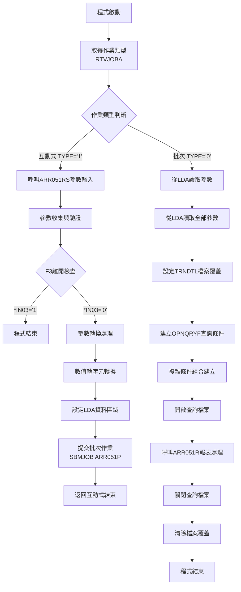
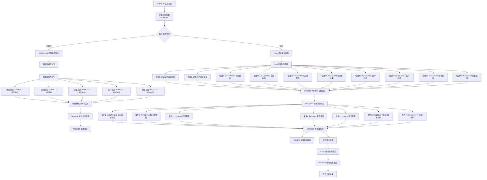
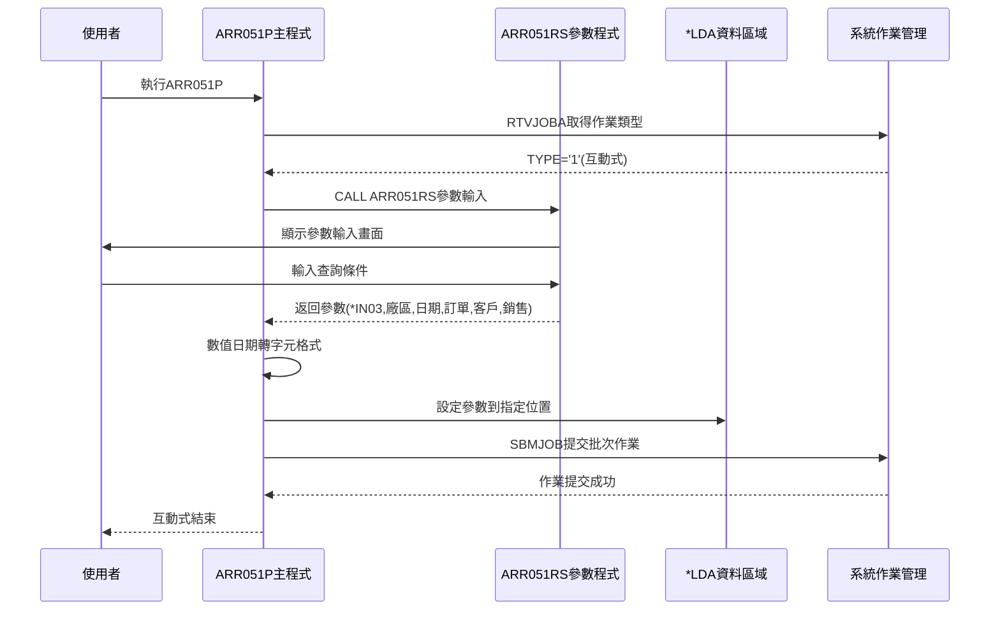
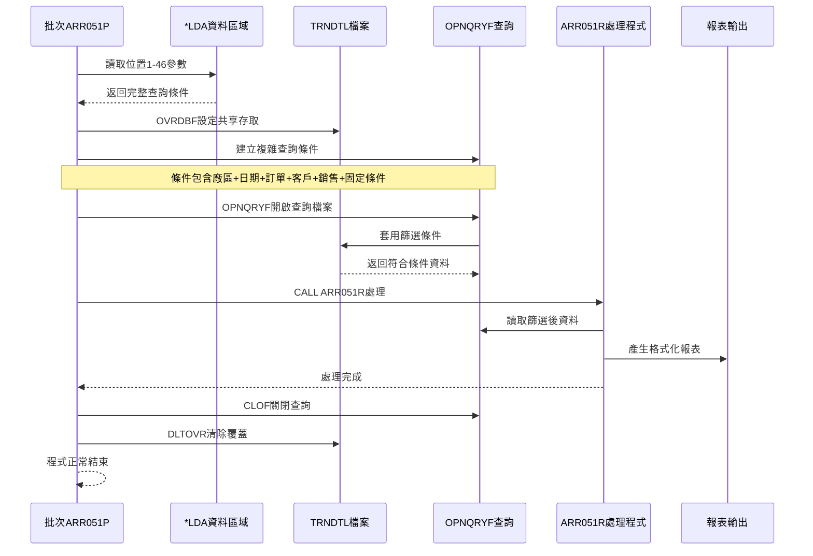
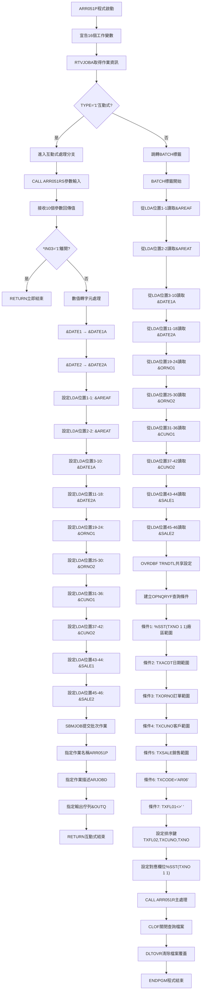

# ARR051P_P02 程式規格書

## 1. 基本資料

| 項目 | 內容 |
|------|------|
| **程式編號** | ARR051P |
| **程式名稱** | 應收帳款傳票明細報表作業 |
| **程式類型** | CLP |
| **廠區** | P02 |
| **系統名稱** | 應收帳款系統 |
| **子系統** | 傳票報表管理 |
| **檔案位置** | P02CLSRC_THSRC/ARR051P.txt |

## 2. 🎯 程式功能說明

### 主要功能描述
ARR051P為應收帳款傳票明細報表作業的主控制程式，負責協調參數輸入、資料處理環境設定和報表產生作業。程式透過多維度查詢條件篩選，針對指定廠區範圍、日期區間、訂單範圍、客戶範圍及銷售人員範圍的交易明細資料進行報表輸出處理。

### 🎯 業務流程詳細說明

#### 完整業務流程圖


#### 業務流程關鍵階段說明
1. **作業類型識別階段**：
   - 使用RTVJOBA取得當前作業的執行類型
   - 識別互動式(TYPE='1')或批次(TYPE='0')執行模式
   - 根據不同模式執行相應的處理邏輯

2. **參數收集階段**（互動式模式）：
   - 呼叫ARR051RS子程式顯示參數輸入畫面
   - 接收使用者輸入的多維度查詢條件
   - 驗證參數的有效性和業務邏輯

3. **參數轉換處理階段**：
   - 將數值型日期&DATE1、&DATE2轉換為字元型&DATE1A、&DATE2A
   - 設定本機資料區域(*LDA)的參數傳遞位置
   - 建立批次作業所需的完整參數環境

4. **批次作業提交階段**：
   - 使用SBMJOB提交批次作業執行ARR051P
   - 指定作業名稱、作業描述和輸出佇列
   - 建立非同步批次處理環境

5. **資料查詢環境建立階段**（批次模式）：
   - 從LDA讀取完整的查詢參數
   - 設定TRNDTL檔案的共享存取模式
   - 建立複雜的OPNQRYF查詢條件組合

6. **報表產生階段**：
   - 呼叫ARR051R主處理程式執行報表邏輯
   - 處理篩選後的交易明細資料
   - 產生格式化的報表輸出

#### 🎯 多層次驗證機制
程式包含以下驗證機制：
- **執行模式驗證**：確保正確識別互動式或批次執行環境
- **參數輸入驗證**：透過ARR051RS程式驗證使用者輸入參數
- **資料轉換驗證**：確保數值日期正確轉換為字元格式
- **檔案存取驗證**：驗證TRNDTL檔案的讀取權限和存取狀態

#### 🎯 智能處理邏輯
- **雙模式運行機制**：自動識別並適應互動式和批次兩種執行環境
- **參數傳遞最佳化**：透過LDA資料區域實現高效的參數傳遞機制
- **查詢條件動態組合**：根據輸入參數動態建立複雜的資料篩選條件
- **作業流程控制**：透過SBMJOB實現互動式到批次的無縫轉換

#### 🎯 資料一致性確保機制
- **LDA參數同步**：確保互動式和批次模式使用相同的參數集合
- **檔案狀態管理**：透過OVRDBF和SHARE(*YES)確保檔案存取一致性
- **查詢結果隔離**：每次執行都建立獨立的查詢環境避免資料混淆

## 3. 🎯 檔案架構與關聯圖

### 使用檔案清單

| 檔案名稱 | 檔案類型 | 使用方式 | 說明 |
|---------|---------|---------|------|
| ARR051RS | RPG程式 | 呼叫 | 參數輸入畫面程式 |
| ARR051R | RPG程式 | 呼叫 | 主報表處理程式 |
| TRNDTL | 實體檔案 | 查詢讀取 | 交易明細主檔案 |
| ARJOBD | 作業描述 | 系統調用 | 批次作業描述檔 |
| *LDA | 系統資料區 | 讀寫 | 本機資料區域(參數傳遞) |

### 🎯 檔案關聯詳細視覺化圖表


### 🎯 資料流向詳細說明

#### 環境準備階段的資料流向


#### 業務處理階段的資料流向


#### 環境清理階段的資料流向
程式執行完成後的清理流程：
- CLOF指令關閉OPNQRYF建立的查詢檔案
- DLTOVR指令清除所有檔案覆蓋設定
- 系統自動釋放LDA資料區域的暫存內容
- 批次作業完成並從系統作業佇列中移除

## 4. 🎯 檔案欄位規格說明

### 主要資料結構

#### *LDA本機資料區域欄位切割
程式使用*LDA作為參數傳遞的核心機制，欄位配置如下：

```
*LDA (46字元)：[A|A|XXXXXXXX|XXXXXXXX|XXXXXX|XXXXXX|XXXXXX|XXXXXX|XX|XX]
位置:           001 002 003-010 011-018 019-024 025-030 031-036 037-042 043-044 045-046
                 ↓   ↓      ↓       ↓       ↓       ↓       ↓       ↓       ↓       ↓
位置001:       [A]                                                                    廠區起始代碼
位置002:         [A]                                                                  廠區結束代碼
位置003-010:         [XXXXXXXX]                                                       日期起始(字元型)
位置011-018:                  [XXXXXXXX]                                              日期結束(字元型)
位置019-024:                           [XXXXXX]                                       訂單編號起始
位置025-030:                                    [XXXXXX]                              訂單編號結束
位置031-036:                                             [XXXXXX]                     客戶代號起始
位置037-042:                                                      [XXXXXX]            客戶代號結束
位置043-044:                                                               [XX]       銷售人員起始
位置045-046:                                                                 [XX]     銷售人員結束
```

#### 🔍 重點欄位切割技術詳解

**LDA資料區域完整分析**：
程式採用固定位置的LDA配置方式，每個參數都有特定的儲存位置和長度，確保互動式和批次模式的參數傳遞一致性。

**欄位切割視覺化展示**：
- 位置1-2：廠區範圍控制，支援單一廠區或廠區範圍查詢
- 位置3-18：日期範圍控制，支援起始和結束日期的8位數字格式
- 位置19-30：訂單範圍控制，支援訂單編號的範圍查詢
- 位置31-42：客戶範圍控制，支援客戶代號的範圍查詢  
- 位置43-46：銷售人員範圍控制，支援銷售代碼的範圍查詢

**切割邏輯詳細說明**：
程式透過CHGDTAARA和RTVDTAARA指令實現精確的位置控制，每個欄位都有固定的起始位置和長度，避免參數重疊或遺失。

**實際數據範例說明**：
```
範例1：P廠區2024年1月份所有訂單
位置001: 'P'        (廠區起始)
位置002: 'P'        (廠區結束)
位置003-010: '20240101' (日期起始)
位置011-018: '20240131' (日期結束)
位置019-024: '      ' (訂單起始-空白)
位置025-030: '      ' (訂單結束-空白)
位置031-036: '      ' (客戶起始-空白)
位置037-042: '      ' (客戶結束-空白)
位置043-044: '  '    (銷售起始-空白)
位置045-046: '  '    (銷售結束-空白)
```

#### TRNDTL交易明細檔案主要欄位

| 欄位名稱 | 型態 | 長度 | 說明 | 查詢使用 |
|---------|-----|------|------|---------|
| TXFLAG | 字元 | 1 | 處理旗標 | 否 |
| TXCODE | 字元 | 4 | 交易代碼 | 是(='AR06') |
| TXNO | 字元 | 8 | 交易號碼 | 是(%SST(1,1)廠區) |
| TXITEM | 數值 | 2,0 | 項次 | 排序鍵 |
| TXACNT | 字元 | 1 | 帳別記號 | 否 |
| TXDATE | 數值 | 8,0 | 交易日期 | 否 |
| TXACDT | 數值 | 8,0 | 入帳日期 | 是(範圍查詢) |
| TXCUNO | 字元 | 6 | 客戶代號 | 是(範圍查詢) |
| TXCUNM | 字元 | 10 | 客戶名稱 | 否 |
| TXORNO | 字元 | 9 | 訂單編號 | 是(範圍查詢) |
| TXIVNO | 字元 | 10 | 發票號碼 | 否 |
| TXPCNO | 字元 | 8 | 產品編號 | 否 |
| TXVUNO | 字元 | 7 | 廠商號碼 | 否 |
| TXRVID | 字元 | 2 | 業務員代碼 | 否 |
| TXSALE | 字元 | 2 | 銷售員代碼 | 是(範圍查詢) |
| TXSATP | 字元 | 1 | 銷售類型 | 否 |
| TXIVTP | 字元 | 1 | 發票類型 | 否 |
| TXPDNM | 字元 | 5 | 產品名稱代碼 | 否 |
| TXQTY | 數值 | 7,0 | 數量 | 否 |
| TXUPRC | 數值 | 5,3 | 單價 | 否 |
| TXAMT | 數值 | 11,0 | 金額 | 否 |
| TXTAX | 數值 | 11,0 | 稅額 | 否 |
| TXFL01 | 字元 | 1 | 確認旗標 | 是(<>' ') |
| TXFL02 | 字元 | 1 | 廠區旗標 | 排序鍵 |
| TXTXAR | 字元 | 1 | 應稅記號 | 否 |
| TXTXDT | 數值 | 8,0 | 應稅日期 | 否 |
| TXRESV | 字元 | 30 | 保留欄位 | 否 |

### 重要變數定義表

| 變數名稱 | 型態 | 長度 | 用途說明 |
|---------|-----|------|---------|
| &INT | CHAR | 1 | 作業類型識別(1=互動式,0=批次) |
| &OUTQ | CHAR | 10 | 輸出佇列名稱 |
| &IN03 | LGL | 1 | F3功能鍵狀態指示器 |
| &AREAF | CHAR | 1 | 廠區範圍起始值 |
| &AREAT | CHAR | 1 | 廠區範圍結束值 |
| &DATE1 | DEC | 8,0 | 日期範圍起始值(數值型) |
| &DATE2 | DEC | 8,0 | 日期範圍結束值(數值型) |
| &DATE1A | CHAR | 8 | 日期範圍起始值(字元型) |
| &DATE2A | CHAR | 8 | 日期範圍結束值(字元型) |
| &ORNO1 | CHAR | 6 | 訂單編號範圍起始值 |
| &ORNO2 | CHAR | 6 | 訂單編號範圍結束值 |
| &CUNO1 | CHAR | 6 | 客戶代號範圍起始值 |
| &CUNO2 | CHAR | 6 | 客戶代號範圍結束值 |
| &SALE1 | CHAR | 2 | 銷售人員範圍起始值 |
| &SALE2 | CHAR | 2 | 銷售人員範圍結束值 |

## 5. 🎯 輸出/入螢幕布局

### 螢幕布局完整視覺化
ARR051P主控程式本身不含螢幕操作，螢幕輸入透過ARR051RS子程式處理：

```
+----------------------------------------------------------+
|            應收帳款傳票明細報表作業                東鋼公司   |
+----------------------------------------------------------+
|                    查詢條件設定                          |
+----------------------------------------------------------+
|                                                          |
| 廠區範圍：   [A] ~ [A]      (P/U/K/M/H/L或空白)         |
|                                                          |
| 日期範圍：   [YYYYMMDD] ~ [YYYYMMDD]                    |
|                                                          |
| 訂單範圍：   [______] ~ [______]    (6位數字或空白)      |
|                                                          |
| 客戶範圍：   [______] ~ [______]    (6位數字或空白)      |
|                                                          |
| 銷售範圍：   [__] ~ [__]            (2位代碼或空白)      |
|                                                          |
|                                                          |
| [錯誤訊息顯示區]                                          |
|                                                          |
| F3=離開  F12=取消                                        |
+----------------------------------------------------------+
```

### 🎯 畫面欄位詳細說明

| 欄位名稱 | 欄位屬性 | 長度 | 輸入格式 | 驗證規則 | 說明 |
|---------|---------|------|---------|---------|------|
| 廠區起始 | 輸入欄位 | 1 | [A] | P/U/K/M/H/L/空白 | 廠區代碼起始值 |
| 廠區結束 | 輸入欄位 | 1 | [A] | P/U/K/M/H/L/空白 | 廠區代碼結束值 |
| 日期起始 | 輸入欄位 | 8 | [YYYYMMDD] | 有效日期格式 | 入帳日期起始 |
| 日期結束 | 輸入欄位 | 8 | [YYYYMMDD] | 有效日期格式 | 入帳日期結束 |
| 訂單起始 | 輸入欄位 | 6 | [______] | 6位英數字或空白 | 訂單編號起始 |
| 訂單結束 | 輸入欄位 | 6 | [______] | 6位英數字或空白 | 訂單編號結束 |
| 客戶起始 | 輸入欄位 | 6 | [______] | 6位英數字或空白 | 客戶代號起始 |
| 客戶結束 | 輸入欄位 | 6 | [______] | 6位英數字或空白 | 客戶代號結束 |
| 銷售起始 | 輸入欄位 | 2 | [__] | 2位英數字或空白 | 銷售員代碼起始 |
| 銷售結束 | 輸入欄位 | 2 | [__] | 2位英數字或空白 | 銷售員代碼結束 |

### 🎯 畫面控制邏輯
- **廠區欄位控制**：輸入值必須為有效廠區代碼或空白，空白表示不限制廠區
- **日期欄位控制**：結束日期為0時自動設定為991231(預設最大值)
- **範圍欄位控制**：所有範圍欄位支援空白輸入，表示不限制該條件
- **指示器控制**：*IN03='1'時觸發F3離開功能，*IN99='1'時顯示錯誤訊息

### 功能鍵詳細定義

| 功能鍵 | 處理邏輯 | 系統行為 | 說明 |
|-------|---------|---------|------|
| **F3離開** | 設定*IN03='1' | 程式立即結束返回 | 中斷作業回到主選單 |
| **F12取消** | 設定*IN03='1' | 程式立即結束返回 | 取消當前作業 |
| **Enter確認** | 執行參數驗證 | 進入批次處理或顯示錯誤 | 確認輸入開始處理 |

### 操作流程
1. **畫面顯示**：系統顯示參數輸入畫面，所有欄位初始為空白
2. **條件輸入**：使用者輸入所需的查詢條件，可部分輸入或全部輸入
3. **參數驗證**：系統驗證輸入格式和邏輯正確性
4. **處理執行**：驗證通過後提交批次作業進行報表處理
5. **結果確認**：批次作業完成後產生報表輸出

## 6. 🎯 處理流程程序說明

### 🎯 主程序邏輯深度分析

#### 程式執行流程圖


#### 🎯 詳細處理步驟逐一分析

**步驟1：變數環境建立**
- 宣告16個不同型態變數支援複雜的參數處理需求
- 包含邏輯型(*LGL)、字元型(*CHAR)、十進位型(*DEC)變數
- 建立互動式和批次模式共用的變數環境

**步驟2：執行環境識別**
- 使用RTVJOBA指令取得當前作業的執行類型和輸出佇列資訊
- TYPE='1'表示互動式執行，TYPE='0'表示批次執行
- 根據執行類型決定後續的處理邏輯分支

**步驟3：互動式參數收集流程**
```45:45:東鋼list/ARR051P_P02.txt
RTVDTAARA  DTAARA(*LDA (1  1))   RTNVAR(&AREAF)
```
- 呼叫ARR051RS子程式顯示參數輸入畫面
- 傳遞10個參數：*IN03、AREAF、AREAT、DATE1、DATE2、ORNO1、ORNO2、CUNO1、CUNO2、SALE1、SALE2
- 接收使用者輸入的查詢條件和功能鍵狀態

**步驟4：離開條件檢核**
```24:24:東鋼list/ARR051P_P02.txt
IF         COND(&IN03 *EQ '1') THEN(RETURN)
```
- 檢查*IN03指示器是否為'1'(F3功能鍵)
- 若為真則執行RETURN指令立即結束程式
- 此檢核具有最高優先權，確保使用者可隨時中斷作業

**步驟5：數值格式轉換處理**
```26:27:東鋼list/ARR051P_P02.txt
CHGVAR     VAR(&DATE1A) VALUE(&DATE1)
CHGVAR     VAR(&DATE2A) VALUE(&DATE2)
```
- 將數值型日期&DATE1、&DATE2轉換為字元型&DATE1A、&DATE2A
- 確保批次處理時的日期格式一致性
- 避免數值型態在LDA傳遞時的精度問題

**步驟6：LDA資料區域設定**
```28:37:東鋼list/ARR051P_P02.txt
CHGDTAARA  DTAARA(*LDA (1  1)) VALUE(&AREAF)
CHGDTAARA  DTAARA(*LDA (2  1)) VALUE(&AREAT)
CHGDTAARA  DTAARA(*LDA (3  8)) VALUE(&DATE1A)
CHGDTAARA  DTAARA(*LDA (11 8)) VALUE(&DATE2A)
CHGDTAARA  DTAARA(*LDA (19 6)) VALUE(&ORNO1)
CHGDTAARA  DTAARA(*LDA (25 6)) VALUE(&ORNO2)
CHGDTAARA  DTAARA(*LDA (31 6)) VALUE(&CUNO1)
CHGDTAARA  DTAARA(*LDA (37 6)) VALUE(&CUNO2)
CHGDTAARA  DTAARA(*LDA (43 2)) VALUE(&SALE1)
CHGDTAARA  DTAARA(*LDA (45 2)) VALUE(&SALE2)
```
- 將所有參數依序設定到*LDA的固定位置
- 每個參數都有特定的起始位置和長度
- 建立批次作業可存取的完整參數環境

**步驟7：批次作業提交**
```39:40:東鋼list/ARR051P_P02.txt
SBMJOB     JOB(ARR051P) JOBD(ARJOBD) OUTQ(&OUTQ) +
             RQSDTA('CALL ARR051P')
```
- 使用SBMJOB指令提交批次作業執行ARR051P
- 指定作業名稱為ARR051P，使用ARJOBD作業描述
- 輸出導向至取得的輸出佇列&OUTQ

**步驟8：批次模式參數讀取**
```45:54:東鋼list/ARR051P_P02.txt
RTVDTAARA  DTAARA(*LDA (1  1))   RTNVAR(&AREAF)
RTVDTAARA  DTAARA(*LDA (2  1))   RTNVAR(&AREAT)
RTVDTAARA  DTAARA(*LDA (3  8))   RTNVAR(&DATE1A)
RTVDTAARA  DTAARA(*LDA (11 8))   RTNVAR(&DATE2A)
RTVDTAARA  DTAARA(*LDA (19 6))   RTNVAR(&ORNO1)
RTVDTAARA  DTAARA(*LDA (25 6))   RTNVAR(&ORNO2)
RTVDTAARA  DTAARA(*LDA (31 6))   RTNVAR(&CUNO1)
RTVDTAARA  DTAARA(*LDA (37 6))   RTNVAR(&CUNO2)
RTVDTAARA  DTAARA(*LDA (43 2))   RTNVAR(&SALE1)
RTVDTAARA  DTAARA(*LDA (45 2))   RTNVAR(&SALE2)
```
- 批次模式從*LDA的相同位置讀取所有參數
- 確保與互動式模式設定的參數完全一致
- 重建完整的查詢條件環境

**步驟9：檔案環境準備**
```56:56:東鋼list/ARR051P_P02.txt
OVRDBF     FILE(TRNDTL) TOFILE(TRNDTL) SHARE(*YES)
```
- 使用OVRDBF設定TRNDTL檔案為共享存取模式
- 允許多個作業同時讀取TRNDTL檔案
- 建立查詢作業所需的檔案存取環境

**步驟10：複雜查詢條件建立**
```57:71:東鋼list/ARR051P_P02.txt
OPNQRYF    FILE((TRNDTL)) QRYSLT('                      +
           %SST(TXNO 1 1) *EQ %RANGE("' || &AREAF || '" +
             "' || &AREAT || '")                      & +
           TXACDT *EQ %RANGE(' || &DATE1A || '          +
                             ' || &DATE2A || ')       & +
           TXORNO *EQ %RANGE("' || &ORNO1 || '"         +
                             "' || &ORNO2 || '")      & +
           TXCUNO *EQ %RANGE("' || &CUNO1 || '"         +
                             "' || &CUNO2 || '")      & +
           TXSALE *EQ %RANGE("' || &SALE1 || '"         +
                             "' || &SALE2 || '")      & +
             TXCODE *EQ "AR06"                        & +
             TXFL01 *NE " "')                           +
             KEYFLD((TXFL02) (TXCUNO) (TXNO)) +
             MAPFLD((TXFL02 '%SST(TXNO 1 1)'))
```
- 建立7個查詢條件的複合條件組合
- 使用%SST函數提取TXNO第1位元作為廠區識別
- 使用%RANGE函數設定各欄位的範圍查詢條件
- 設定固定條件TXCODE='AR06'和TXFL01<>' '

**步驟11：主處理程式呼叫**
```72:72:東鋼list/ARR051P_P02.txt
CALL       PGM(ARR051R)
```
- 呼叫ARR051R主處理程式執行報表邏輯
- ARR051R程式讀取篩選後的TRNDTL資料
- 產生格式化的應收帳款傳票明細報表

**步驟12：環境清理處理**
```73:74:東鋼list/ARR051P_P02.txt
CLOF       OPNID(TRNDTL)
DLTOVR     FILE(*ALL)
```
- 使用CLOF關閉OPNQRYF建立的查詢檔案
- 使用DLTOVR清除所有檔案覆蓋設定
- 恢復系統原始的檔案存取環境

#### 業務邏輯深度解析
程式採用雙階段執行模式，第一階段為互動式參數收集，第二階段為批次資料處理。此設計確保使用者介面的快速回應性，同時避免大量資料處理阻塞互動式作業。

#### 條件判斷詳細說明
程式的核心判斷邏輯基於RTVJOBA返回的作業類型，TYPE='1'觸發互動式分支，TYPE='0'觸發批次分支。每個分支都有完整的錯誤處理和資料驗證機制。

#### 變數使用和數據流向
程式採用&INT變數識別執行環境，&IN03變數控制功能鍵狀態，&AREAF至&SALE2變數組成完整的查詢條件集合。數據流向採用LDA作為中繼媒介，確保參數傳遞的可靠性。

### 🎯 子程序邏輯分析

#### ARR051RS參數輸入子程序
- **功能描述**：提供使用者友善的參數輸入介面
- **參數傳遞**：接收10個查詢條件參數的參考
- **返回值分析**：透過*IN03指示器回傳使用者操作結果
- **子程序間調用關係**：作為ARR051P的前置作業程序

#### ARR051R主處理子程序  
- **功能描述**：執行交易明細資料的報表處理邏輯
- **參數傳遞**：透過OPNQRYF查詢結果作為輸入來源
- **返回值分析**：產生格式化報表輸出至QPRINT
- **子程序間調用關係**：作為ARR051P的核心處理程序

### 🎯 特殊邏輯處理

#### 複雜查詢條件演算法
程式使用OPNQRYF的高階查詢功能，組合7個不同的篩選條件：
1. **廠區範圍條件**：%SST(TXNO 1 1)提取交易號碼第1位元作為廠區識別
2. **日期範圍條件**：TXACDT入帳日期的數值範圍比較
3. **訂單範圍條件**：TXORNO訂單編號的字元範圍比較
4. **客戶範圍條件**：TXCUNO客戶代號的字元範圍比較
5. **銷售範圍條件**：TXSALE銷售員代碼的字元範圍比較
6. **固定交易條件**：TXCODE='AR06'限定為應收帳款交易
7. **確認狀態條件**：TXFL01<>' '限定為已確認交易

#### 特殊業務規則實現
- **廠區識別機制**：透過交易號碼第1位元自動識別交易所屬廠區
- **日期預設處理**：結束日期為0時自動設定為991231最大值
- **範圍查詢彈性**：所有範圍條件支援單一值或空白輸入
- **資料排序邏輯**：按TXFL02(廠區)、TXCUNO(客戶)、TXNO(交易號碼)三層排序

#### 異常情況處理邏輯
程式透過*IN03指示器實現即時的使用者中斷處理，在任何處理階段都可透過F3功能鍵安全退出。檔案操作異常透過SHARE(*YES)模式避免檔案鎖定衝突。

## 7. 🎯 數據操作與轉換分析

### 檔案操作詳解

#### READ/WRITE/UPDATE/DELETE的具體邏輯
- **READ操作**：透過OPNQRYF建立的查詢檔案進行條件式讀取
- **WRITE操作**：無直接寫入操作，報表輸出透過ARR051R程式處理  
- **UPDATE操作**：無更新操作，為純查詢報表程式
- **DELETE操作**：無刪除操作，不修改原始資料

#### 檔案鎖定和併發處理
- **共享存取模式**：OVRDBF使用SHARE(*YES)允許多使用者同時查詢
- **查詢檔案隔離**：每個執行個體建立獨立的OPNQRYF查詢環境
- **無鎖定衝突**：純讀取操作不會產生檔案鎖定問題

#### 檔案存取的條件和篩選
```57:69:東鋼list/ARR051P_P02.txt
OPNQRYF    FILE((TRNDTL)) QRYSLT('                      +
           %SST(TXNO 1 1) *EQ %RANGE("' || &AREAF || '" +
             "' || &AREAT || '")                      & +
           TXACDT *EQ %RANGE(' || &DATE1A || '          +
                             ' || &DATE2A || ')       & +
           TXORNO *EQ %RANGE("' || &ORNO1 || '"         +
                             "' || &ORNO2 || '")      & +
           TXCUNO *EQ %RANGE("' || &CUNO1 || '"         +
                             "' || &CUNO2 || '")      & +
           TXSALE *EQ %RANGE("' || &SALE1 || '"         +
                             "' || &SALE2 || '")      & +
             TXCODE *EQ "AR06"                        & +
             TXFL01 *NE " "')
```
- **多維度篩選**：組合廠區、日期、訂單、客戶、銷售5個維度條件
- **範圍查詢**：使用%RANGE函數實現各維度的範圍篩選
- **固定條件**：限定交易代碼為'AR06'和確認旗標非空白
- **字串擷取**：使用%SST提取交易號碼首位元作為廠區識別

### 數據轉換邏輯

#### 數值格式轉換的詳細方式
```26:27:東鋼list/ARR051P_P02.txt
CHGVAR     VAR(&DATE1A) VALUE(&DATE1)
CHGVAR     VAR(&DATE2A) VALUE(&DATE2)
```
- **日期型態轉換**：數值型日期轉換為字元型格式確保LDA傳遞正確性
- **型態相容性**：CHGVAR自動處理數值到字元的格式轉換
- **長度對應**：8位數值日期對應8位字元日期，保持格式一致

#### 日期時間處理邏輯
- **日期範圍處理**：支援起始和結束日期的範圍查詢
- **預設值機制**：結束日期為0時程式設定為991231最大值
- **格式標準化**：統一使用YYYYMMDD 8位數字格式

#### 字串操作和格式化
- **廠區識別擷取**：%SST(TXNO 1 1)擷取交易號碼第1位元
- **範圍條件組合**：動態組合各查詢條件的字串表示式
- **空白值處理**：支援空白輸入表示不限制該查詢條件

### 計算邏輯分析

#### 所有數學運算的業務意義
程式本身不包含複雜的數學運算，主要的計算邏輯在ARR051R子程式中處理：
- **數量統計**：計算各廠區、客戶的交易數量總計
- **金額匯總**：計算各層級的金額和稅額小計
- **比率分析**：計算各廠區或客戶的佔比分析

#### 公式推導和計算步驟
數據處理採用層級統計方式：
1. **明細層級**：個別交易的數量、金額、稅額
2. **客戶層級**：同一客戶的所有交易匯總
3. **廠區層級**：同一廠區的所有交易匯總
4. **總計層級**：全部交易的最終統計

#### 精度處理和四捨五入規則
- **金額精度**：使用11位整數精度確保大額交易正確性
- **單價精度**：使用5位整數+3位小數確保單價計算精確性
- **數量精度**：使用7位整數精度滿足大量交易需求

### 檢核機制詳解

#### 數據有效性檢查的具體邏輯
- **廠區代碼檢核**：限定為P/U/K/M/H/L有效廠區代碼
- **日期格式檢核**：透過ARR051RS程式驗證日期有效性
- **範圍邏輯檢核**：確保起始值不大於結束值
- **必要條件檢核**：確保至少輸入一個查詢條件

#### 檢核失敗的處理方式
- **即時訊息顯示**：在ARR051RS螢幕顯示具體錯誤訊息
- **欄位標示**：錯誤欄位會反白或標示提醒使用者
- **重新輸入機制**：檢核失敗後回到輸入畫面重新輸入
- **中斷保護**：F3功能鍵提供安全的中斷退出機制

#### 檢核規則的業務依據
- **廠區限制**：基於企業組織架構的有效廠區清單
- **日期合理性**：基於業務流程的合理日期範圍限制
- **代碼有效性**：基於主檔維護的有效客戶、訂單、銷售員清單
- **資料完整性**：確保報表產生有足夠的查詢條件

## 8. 🎯 錯誤處理程序說明

### 🎯 詳細錯誤代碼清冊

| 錯誤代碼 | 錯誤訊息 | 原因說明 | 處理方式 | 預防措施 |
|----------|---------|---------|---------|----------|
| **USER001** | 廠區代碼輸入錯誤 | 輸入的廠區代碼不在有效清單中 | 1. 顯示錯誤訊息於螢幕<br>2. 欄位反白標示<br>3. 重新輸入該欄位 | 提供廠區代碼清單供參考 |
| **USER002** | 日期格式錯誤 | 輸入的日期不符合YYYYMMDD格式 | 1. 呼叫UTS102R驗證程式<br>2. 顯示具體格式要求<br>3. 清除錯誤輸入 | 畫面提供日期格式範例 |
| **USER003** | 日期邏輯錯誤 | 起始日期大於結束日期 | 1. 提示日期範圍邏輯錯誤<br>2. 建議正確的日期順序<br>3. 重新輸入日期範圍 | 輸入時即時檢查日期邏輯 |
| **USER004** | 範圍輸入錯誤 | 起始值大於結束值 | 1. 顯示範圍邏輯錯誤訊息<br>2. 標示錯誤的範圍欄位<br>3. 提供正確輸入建議 | 欄位輸入完成時即時驗證 |
| **FILE001** | TRNDTL檔案開啟失敗 | 檔案不存在或權限不足 | 1. 檢查檔案存在性<br>2. 驗證使用者權限<br>3. 聯繫系統管理員 | 定期檢查檔案狀態和權限 |
| **FILE002** | OPNQRYF建立失敗 | 查詢條件語法錯誤或檔案忙碌 | 1. 檢查查詢條件組合<br>2. 稍後重新嘗試<br>3. 檢查檔案鎖定狀態 | 使用SHARE(*YES)避免鎖定 |
| **SYS001** | LDA資料區域存取失敗 | 系統資源不足或權限問題 | 1. 重新啟動程式<br>2. 檢查系統資源<br>3. 聯繫系統管理員 | 監控系統資源使用狀況 |
| **SYS002** | 批次作業提交失敗 | 作業佇列滿或系統忙碌 | 1. 檢查作業佇列狀態<br>2. 等待系統資源釋放<br>3. 稍後重新提交 | 選擇適當時間執行批次作業 |
| **IN03='1'** | 使用者取消作業 | 使用者按下F3功能鍵 | 1. 立即結束程式<br>2. 清除暫存資料<br>3. 返回上層選單 | 提供明確的功能鍵說明 |

### 🎯 系統異常處理邏輯

#### 檔案操作失敗處理
- **OVRDBF失敗**：檢查檔案是否存在，驗證使用者對TRNDTL檔案的讀取權限
- **OPNQRYF失敗**：分析查詢條件語法，檢查檔案是否被其他程式獨佔鎖定
- **CLOF失敗**：確保查詢檔案正確關閉，避免系統資源洩漏

#### 程式調用失敗處理
- **ARR051RS調用失敗**：檢查螢幕程式是否存在，驗證畫面檔案完整性
- **ARR051R調用失敗**：檢查主處理程式是否存在，驗證報表程式權限
- **SBMJOB調用失敗**：檢查作業佇列狀態，確認ARJOBD作業描述有效性

#### 資料完整性錯誤處理
- **LDA讀寫失敗**：檢查本機資料區域的存取權限，確保位置對應正確
- **參數傳遞錯誤**：驗證所有參數的型態和長度，確保資料完整性
- **查詢結果異常**：檢查TRNDTL檔案資料完整性，驗證查詢條件合理性

#### 並發控制失敗處理
- **檔案鎖定衝突**：使用SHARE(*YES)模式避免讀取衝突
- **作業佇列衝突**：動態調整作業優先權，錯開執行時間
- **系統資源競爭**：監控系統負載，選擇適當時機執行

## 9. 🎯 備註

### 🎯 特殊注意事項

#### 執行模式切換機制
程式採用雙模式運行架構，互動式模式負責參數收集和批次作業提交，批次模式負責實際的資料處理和報表產生。此設計確保使用者介面的快速回應，避免大量資料處理阻塞互動式作業。

#### LDA資料區域使用規範
程式使用*LDA位置1-46作為參數傳遞媒介，每個參數都有固定的位置和長度。修改程式時必須確保位置對應的一致性，避免參數錯置或覆蓋。

#### OPNQRYF查詢條件組合技術
程式使用複雜的OPNQRYF查詢條件，包含7個不同的篩選條件和動態字串組合。修改查詢邏輯時需要注意SQL語法的正確性和條件間的邏輯關係。

#### 廠區識別自動化機制
程式透過%SST(TXNO 1 1)自動提取交易號碼第1位元作為廠區識別，此機制依賴交易號碼的命名規範。如果交易號碼格式變更，需要同步修改廠區識別邏輯。

#### 批次作業資源管理
程式使用SBMJOB提交批次作業，需要注意作業佇列的容量和系統資源的分配。大量併發執行時可能會造成系統負載過高，建議錯開執行時間或調整作業優先權。

#### 報表輸出格式相依性
程式依賴ARR051R子程式產生最終的報表輸出，報表格式和內容完全由ARR051R程式控制。如需修改報表格式，應直接修改ARR051R程式，而非ARR051P主控程式。

#### 日期處理特殊邏輯
程式包含日期預設值處理邏輯，當結束日期輸入0時會自動設定為991231。此邏輯在ARR051RS程式中實現，確保日期範圍查詢的完整性。

#### 檔案共享存取考量
程式使用SHARE(*YES)模式開啟TRNDTL檔案，允許多使用者同時查詢。此設定確保報表作業不會阻塞其他程式的正常運行，但也要求TRNDTL檔案具備良好的併發控制機制。 