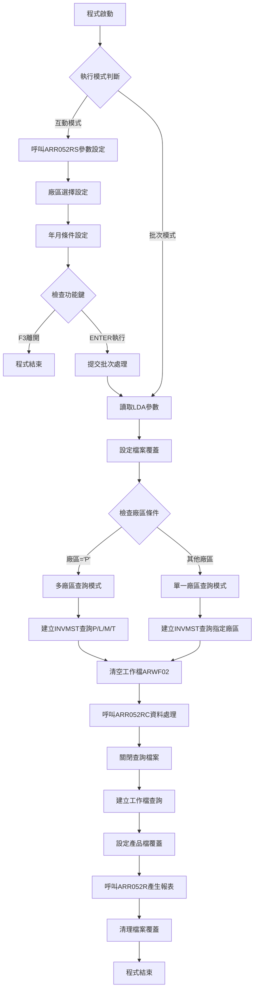
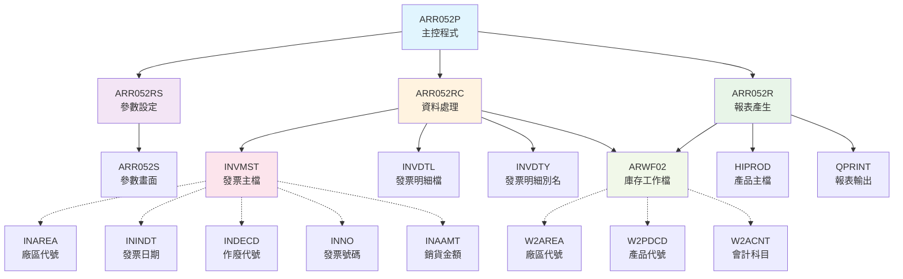
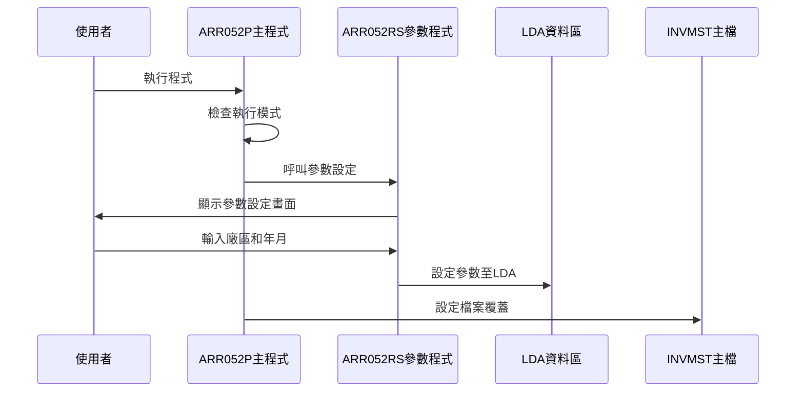
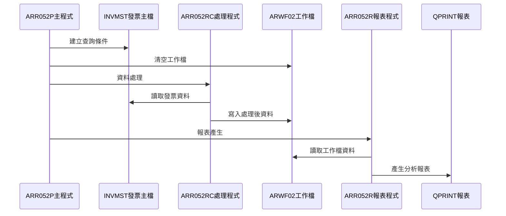
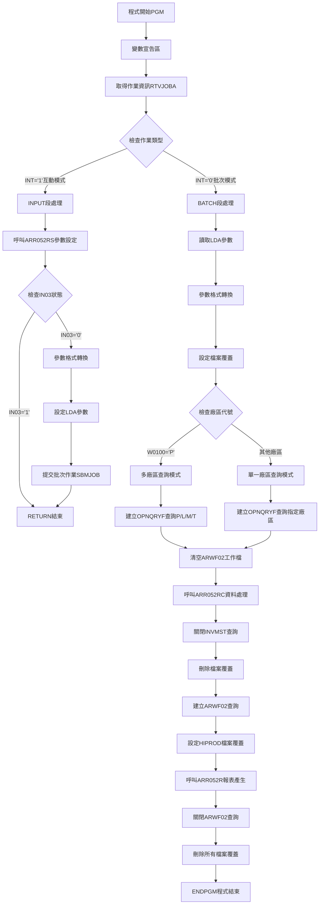

# ARR052P_K02 程式規格書

## 1. 基本資料

| 項目 | 內容 |
|------|------|
| **程式編號** | ARR052P |
| **程式名稱** | 庫存發票分析報表作業 |
| **程式類型** | CLP |
| **廠區** | K02 |
| **系統名稱** | 應收帳款系統 |
| **子系統** | 應收帳款報表 |
| **檔案位置** | 東鋼list/ARR052P_K02.txt |

## 2. 🎯 程式功能說明

### 主要功能描述
本程式為庫存發票分析報表系統，具備多廠區發票資料分析、庫存狀況統計和發票明細彙總等完整功能。程式支援互動式參數設定和批次處理雙重模式，可根據廠區代號和年月條件進行精確的發票資料篩選分析，並產生詳細的庫存發票分析報表。

### 🎯 業務流程詳細說明

#### 完整業務流程圖


#### 業務流程關鍵階段說明
1. **參數設定階段**：透過ARR052RS畫面收集廠區和年月條件
2. **廠區判斷階段**：根據廠區代號決定查詢模式
3. **條件建構階段**：建構發票資料的查詢條件
4. **資料篩選階段**：根據條件篩選發票主檔資料
5. **資料處理階段**：透過ARR052RC進行資料加工和統計
6. **報表產生階段**：透過ARR052R產生格式化的分析報表
7. **資源清理階段**：清理檔案覆蓋和查詢設定

#### 多層次驗證機制
- **廠區代號驗證**：確保廠區代號為有效值(P/K/H/N)
- **年月格式驗證**：確保年月輸入的格式正確性
- **參數完整性驗證**：確認所有必要參數的完整性
- **資料存在驗證**：確保相關發票資料檔案的可存取性
- **檔案權限驗證**：確認對相關檔案的讀寫權限

#### 智能處理邏輯
- **動態廠區處理**：根據廠區代號自動選擇查詢模式
- **條件式查詢建構**：智能建構不同廠區的查詢條件
- **彈性日期範圍**：自動計算月份的起迄日期範圍
- **最佳化資料處理**：使用工作檔提升大量資料處理效率
- **智能報表格式**：根據資料內容調整報表格式

#### 資料一致性確保機制
- **檔案共享控制**：設定SHARE(*YES)確保多使用者並行存取
- **工作檔隔離**：使用ARWF02工作檔進行資料處理隔離
- **查詢條件一致性**：確保查詢條件與參數設定的一致性
- **檔案覆蓋管理**：正確設定檔案覆蓋避免資料混亂
- **處理順序控制**：按既定順序處理確保資料處理的一致性

## 3. 🎯 檔案架構與關聯圖

### 使用檔案清單
| 檔案名稱 | 檔案類型 | 用途說明 | 存取方式 |
|----------|----------|----------|----------|
| ARR052S | DSPF | 參數設定畫面檔案 | 螢幕格式定義 |
| INVMST | 實體檔案 | 發票主檔 | 讀取查詢 |
| INVDTL | 實體檔案 | 發票明細檔 | 讀取查詢 |
| INVDTY | 實體檔案 | 發票明細檔別名 | 讀取查詢 |
| ARWF02 | 實體檔案 | 庫存分析工作檔 | 清空/更新/查詢 |
| HIPROD | 實體檔案 | 產品主檔 | 讀取查詢 |
| ARR052RS | RPG程式 | 參數設定處理程式 | 程式呼叫 |
| ARR052RC | RPG程式 | 資料處理程式 | 程式呼叫 |
| ARR052R | RPG程式 | 報表產生程式 | 程式呼叫 |

### 🎯 檔案關聯詳細視覺化圖表


### 🎯 資料流向詳細說明

#### 環境準備階段的資料流向


#### 業務處理階段的資料流向


#### 環境清理階段的資料流向
- **檔案關閉序列**：查詢檔案關閉 → 檔案覆蓋刪除 → 工作檔案清理
- **資源釋放流程**：報表輸出完成 → 記憶體清理 → 系統環境恢復
- **狀態恢復機制**：覆蓋設定移除 → 查詢檔案關閉 → 系統環境還原

## 4. 🎯 檔案欄位規格說明

### 主要資料結構

#### INVMST檔案關鍵欄位
| 欄位名稱 | 資料型態 | 長度 | 說明 |
|----------|----------|------|------|
| INFLAG | CHAR | 1 | 處理旗標 |
| INTYPE | CHAR | 1 | 發票類型 |
| INDECD | CHAR | 1 | 作廢代號 |
| INDEDT | DECIMAL | 8 | 作廢日期 |
| INNO | CHAR | 10 | 發票號碼 |
| INCUNO | CHAR | 6 | 客戶編號 |
| INCUNM | OUTPUT | 10 | 客戶名稱 |
| INORNO | CHAR | 6 | 訂單號碼 |
| ININDT | DECIMAL | 8 | 發票日期 |
| INKIND | CHAR | 1 | 發票種類 |
| INRVID | CHAR | 2 | 收款業務員 |
| INSALE | CHAR | 2 | 銷貨業務員 |
| INAREA | CHAR | 1 | 廠區代號 |
| INAAMT | DECIMAL | 11 | 銷貨金額 |
| INATAX | DECIMAL | 11 | 銷項稅額 |

#### ARWF02檔案關鍵欄位
| 欄位名稱 | 資料型態 | 長度 | 說明 |
|----------|----------|------|------|
| W2AREA | CHAR | 1 | 廠區代號 |
| W2PDCD | CHAR | 6 | 產品代號 |
| W2ACNT | CHAR | 3 | 會計科目 |

#### 程式變數結構

##### 🔍 重點欄位切割技術詳解
程式使用LDA進行參數傳遞的欄位配置：

```
LDA資料區配置 (總長度1022字元)：
位置1:       [X]                              廠區代號
位置2-7:     [XXXXXX]                         年月條件(YYYYMM)
位置11-18:   [XXXXXXXX]                       起始日期(YYYYMMDD)
位置21-28:   [XXXXXXXX]                       結束日期(YYYYMMDD)
```

##### 日期範圍計算邏輯
```
年月轉換為日期範圍：
輸入年月: W0101 = 202312 (2023年12月)
起始日期: W0102 = 20231201 (當月第1天)
結束日期: W0103 = 20231231 (當月最後一天)

計算公式：
起始日期 = 年月 + "01"
結束日期 = 年月 + "31"
```

##### 切割邏輯詳細說明
- **廠區代號儲存**：使用單一字元儲存廠區選擇
- **年月格式轉換**：6位數字年月轉換為8位日期格式
- **日期範圍計算**：自動計算月份的完整日期範圍
- **參數驗證機制**：確保參數格式和內容的正確性

##### 實際數據範例說明
```
LDA參數範例：
位置1:     'K'                  (廠區代號: 崑山廠區)
位置2-7:   '202312'             (年月: 2023年12月)
位置11-18: '20231201'           (起始日期: 2023/12/01)
位置21-28: '20231231'           (結束日期: 2023/12/31)

查詢條件範例：
INAREA *EQ "K" 
& INDECD *EQ " " 
& ININDT *EQ %RANGE(20231201 20231231)
```

### 🎯 欄位挪用詳細分析

#### 挪用情況對比表
| 原始定義 | 實際使用方式 | 挪用說明 |
|----------|-------------|----------|
| W0100 | 廠區代號選擇 | 從一般工作變數挪用為廠區識別碼 |
| W0101 | 年月條件輸入 | 從數值變數挪用為日期範圍基準 |
| W0102/W0103 | 日期範圍計算 | 從一般日期挪用為計算結果儲存 |
| INVDTY | 發票明細別名 | 從獨立檔案挪用為INVDTL的別名檔案 |
| ARWF02 | 工作檔案 | 從簡單工作檔挪用為複雜分析資料暫存 |

#### 挪用原因深度分析
- **查詢彈性需求**：需要支援多種廠區查詢組合
- **效能最佳化需求**：使用工作檔案提升大量資料處理效率
- **相容性維護**：保持與既有檔案結構的相容性
- **程式簡化設計**：避免建立新的資料結構

#### 挪用影響評估
- **查詢條件複雜化**：需要動態建構不同的查詢邏輯
- **資料處理多層化**：增加了資料處理的層次和複雜度
- **維護難度增加**：需要理解多檔案間的關聯和挪用邏輯
- **效能影響**：工作檔案的使用可能影響系統效能

### 重要變數定義表
| 變數名稱 | 型態 | 長度 | 用途說明 |
|----------|------|------|----------|
| &INT | CHAR | 1 | 作業類型識別 |
| &OUTQ | CHAR | 10 | 輸出佇列名稱 |
| &W0100 | CHAR | 1 | 廠區代號 |
| &W0101 | DECIMAL | 6 | 年月條件 |
| &W0101A | CHAR | 6 | 年月條件字串 |
| &W0102 | DECIMAL | 8 | 起始日期 |
| &W0102A | CHAR | 8 | 起始日期字串 |
| &W0103 | DECIMAL | 8 | 結束日期 |
| &W0103A | CHAR | 8 | 結束日期字串 |
| &IN03 | LGL | 1 | 功能鍵狀態 |

## 5. 🎯 輸出/入螢幕布局

### 螢幕布局完整視覺化

#### TITLE - 庫存發票分析參數設定畫面
```
+----------------------------------------------------------+
|2023/12/25    東鋼鋼鐵股份有限公司              ARR052S |
|           庫存發票分析報表                          K02  |
+----------------------------------------------------------+
|                                                          |
|                                                          |
|                                                          |
|      廠區: K ( P:台灣廠區混合  K:崑山                   |
|                H:河北  N:大慶)                           |
|                                                          |
|                                                          |
|     年月: 202312                                         |
|                                                          |
|                                                          |
|                                                          |
|                                                          |
|                                                          |
|                                                          |
|                                                          |
|                                                          |
|                                                          |
|                                                          |
| [錯誤訊息顯示區]                                        |
|     ENTER:執行       PF03:離開                          |
+----------------------------------------------------------+
```

### 🎯 畫面欄位詳細說明
| 欄位名稱 | 欄位類型 | 長度 | 輸入格式 | 驗證規則 | 說明 |
|----------|----------|------|----------|----------|------|
| W0100 | 輸入欄位 | 1 | 英文字母 | P/K/H/N值驗證 | 廠區代號選擇 |
| W0101 | 輸入欄位 | 6 | 數字 | 年月格式驗證 | 年月條件輸入 |
| COMP | 顯示欄位 | 35 | 唯讀 | - | 公司名稱顯示 |
| DEVNM | 顯示欄位 | 10 | 唯讀 | - | 裝置名稱顯示 |
| ERRMSG | 訊息欄位 | 70 | 系統控制 | - | 錯誤訊息顯示 |

### 🎯 畫面控制邏輯
- **指示器IN41**：控制廠區代號的錯誤屬性顯示
- **指示器IN42**：控制年月欄位的錯誤屬性顯示
- **指示器IN99**：控制整體錯誤狀態和處理流程
- **錯誤屬性**：使用DSPATR(RI PC)顯示反向和受保護屬性
- **訊息顯示**：使用DSPATR(HI)高亮顯示錯誤訊息

### 功能鍵詳細定義
| 功能鍵 | 處理邏輯 | 系統行為 | 程式控制 |
|--------|----------|----------|----------|
| **F3** | 離開程式 | 結束程式執行 | 設定*IN03='1'並返回 |
| **ENTER** | 執行處理 | 進行參數驗證和批次提交 | 執行主要業務邏輯 |

### 操作流程
1. **畫面初始顯示**：載入公司名稱、裝置資訊和預設廠區
2. **參數輸入階段**：輸入廠區代號和年月條件
3. **參數驗證階段**：檢查廠區代號和年月格式的有效性
4. **批次提交階段**：驗證通過後設定LDA參數並提交處理

## 6. 🎯 處理流程程序說明

### 🎯 主程序邏輯深度分析

#### 程式執行流程圖


#### 🎯 詳細處理步驟逐一分析

##### 步驟1：環境初始化處理
```
1. 程式變數宣告：建立所有必要的工作變數和參數變數
2. 作業屬性取得：呼叫RTVJOBA取得執行模式和輸出佇列
3. 模式判斷：根據TYPE值決定互動或批次流程路徑
4. 系統環境檢查：確認必要的檔案和資源可用性
```

##### 步驟2：互動模式參數收集
```
1. 參數設定呼叫：呼叫ARR052RS程式顯示參數設定畫面
2. 廠區代號輸入：選擇要分析的廠區(P/K/H/N)
3. 年月條件輸入：設定要分析的年月範圍
4. 參數驗證：驗證廠區代號和年月格式的正確性
5. 格式轉換：將DECIMAL型態轉換為CHAR型態
6. LDA參數設定：將驗證後的參數設定至LDA
7. 批次作業提交：使用SBMJOB提交批次處理作業
```

##### 步驟3：批次模式資料處理
```
1. LDA參數讀取：從LDA指定位置讀取廠區和日期參數
2. 格式轉換：將CHAR型態轉換為DECIMAL型態供查詢使用
3. 檔案覆蓋設定：設定INVMST、INVDTY、INVDTL的檔案覆蓋
4. 廠區條件判斷：根據廠區代號決定查詢模式
5. 查詢條件建構：建構符合廠區和日期條件的OPNQRYF查詢
6. 工作檔清理：清空ARWF02工作檔準備新的分析資料
```

##### 步驟4：資料分析處理
```
1. 資料處理呼叫：呼叫ARR052RC進行發票資料分析處理
2. 查詢檔案關閉：關閉INVMST的查詢檔案
3. 檔案覆蓋清理：刪除第一階段的檔案覆蓋設定
4. 工作檔查詢建立：建立ARWF02工作檔的查詢和排序
5. 產品檔覆蓋：設定HIPROD產品主檔的覆蓋
6. 報表程式呼叫：呼叫ARR052R產生格式化分析報表
7. 最終清理：關閉所有查詢檔案並刪除檔案覆蓋
```

### 🎯 子程序邏輯分析

#### ARR052RS參數設定程式呼叫
- **參數1 (&IN03)**：回傳1字元功能鍵狀態('1'=F3離開)
- **參數2 (&W0100)**：回傳1字元廠區代號
- **參數3 (&W0101)**：回傳6位DECIMAL年月條件
- **參數4 (&W0102)**：回傳8位DECIMAL起始日期
- **參數5 (&W0103)**：回傳8位DECIMAL結束日期
- **畫面顯示**：透過TITLE格式收集使用者輸入
- **參數驗證**：進行廠區代號和年月格式的完整驗證

#### ARR052RC資料處理程式呼叫
- **發票資料讀取**：從INVMST讀取符合條件的發票資料
- **明細資料處理**：從INVDTL/INVDTY讀取發票明細資料
- **資料分析計算**：進行庫存相關的分析計算
- **工作檔更新**：將分析結果寫入ARWF02工作檔
- **特殊邏輯處理**：處理作廢發票、稅額計算等特殊邏輯

#### ARR052R報表產生程式呼叫
- **工作檔讀取**：從ARWF02讀取分析處理後的資料
- **產品資料關聯**：從HIPROD讀取產品相關資訊
- **報表格式化**：產生格式化的庫存發票分析報表
- **統計計算**：計算各種統計數據和彙總資訊
- **報表輸出**：透過QPRINT輸出最終報表

### 🎯 特殊邏輯處理

#### 動態查詢條件建構
```sql
廠區='P'時的查詢條件：
QRYSLT('INAREA *EQ %VALUES("P" "L" "M" "T" ) 
        & INDECD *EQ " " 
        & ININDT *EQ %RANGE(' || &W0102A || ' ' || &W0103A || ')')

其他廠區的查詢條件：
QRYSLT('INAREA *EQ "' || &W0100 || '" 
        & INDECD *EQ " " 
        & ININDT *EQ %RANGE(' || &W0102A || ' ' || &W0103A || ')')
```

#### 日期範圍計算邏輯
- **年月轉日期**：將6位年月轉換為8位完整日期
- **月首日計算**：自動設定為當月第1天
- **月末日計算**：自動設定為當月第31天
- **格式轉換**：在DECIMAL和CHAR格式間進行轉換

#### 檔案覆蓋技術實現
- **階段性覆蓋**：分兩個階段設定不同的檔案覆蓋
- **SHARE控制**：設定SHARE(*YES)支援多使用者存取
- **別名檔案**：INVDTY作為INVDTL的別名檔案使用
- **工作檔管理**：ARWF02作為中間資料處理檔案

#### 多廠區處理邏輯
- **P廠區特殊處理**：包含P/L/M/T四個廠區的綜合查詢
- **單一廠區處理**：針對K/H/N等特定廠區的獨立查詢
- **廠區代號驗證**：確保輸入的廠區代號有效
- **查詢最佳化**：根據廠區選擇最適合的查詢方式

## 7. 🎯 數據操作與轉換分析

### 檔案操作詳解

#### READ操作邏輯
- **RTVDTAARA操作**：從LDA指定位置讀取廠區和日期參數
- **RTVJOBA操作**：讀取作業屬性和輸出佇列資訊
- **查詢檔案讀取**：透過OPNQRYF建立條件查詢讀取發票資料

#### WRITE操作邏輯
- **工作檔清空**：使用CLRPFM清空ARWF02工作檔
- **工作檔更新**：透過ARR052RC更新工作檔案內容
- **報表輸出**：透過ARR052R產生分析報表

#### DELETE操作邏輯
- **檔案覆蓋刪除**：使用DLTOVR刪除所有檔案覆蓋設定
- **查詢檔案關閉**：使用CLOF關閉查詢檔案釋放資源
- **工作檔清理**：定期清理工作檔案的過期資料

#### 檔案存取的條件和篩選
```
OPNQRYF查詢條件：
1. 廠區篩選：INAREA *EQ 指定廠區 或 *EQ %VALUES(多廠區)
2. 有效發票：INDECD *EQ " " (排除作廢發票)
3. 日期範圍：ININDT *EQ %RANGE(起始日期 結束日期)
4. 排序設定：按INNO發票號碼排序
5. 工作檔排序：按W2AREA、W2PDCD、W2ACNT排序
```

### 數據轉換邏輯

#### 日期格式轉換的詳細方式
```
多種日期格式轉換：
1. 使用者輸入格式：6位數字 "YYYYMM"
2. 系統內部計算：8位DECIMAL型態
3. 查詢條件格式：8位CHAR字串
4. 起始日期計算：年月 + "01"
5. 結束日期計算：年月 + "31"

轉換範例：
輸入: 202312 → 起始: 20231201, 結束: 20231231
```

#### 字串操作和格式化
- **參數型態轉換**：DECIMAL與CHAR間的雙向轉換
- **查詢條件組合**：使用|| CAT操作符組合查詢字串
- **廠區清單處理**：%VALUES函數處理多廠區選擇
- **日期範圍處理**：%RANGE函數處理日期範圍條件

#### 數值計算邏輯
- **金額統計**：發票金額的彙總和分類統計
- **數量統計**：發票明細的數量統計
- **稅額計算**：銷項稅額的計算和驗證
- **庫存分析**：庫存相關的數值分析計算

### 計算邏輯分析

#### 庫存分析計算邏輯
- **發票分類統計**：按產品、廠區、科目分類統計
- **金額彙總計算**：各層次金額的彙總計算
- **庫存週轉分析**：庫存週轉相關的分析計算
- **異常資料識別**：識別和標記異常的發票資料

#### 公式推導和計算步驟
```
庫存分析公式：
1. 廠區發票總額 = Σ(INAAMT WHERE INAREA = 廠區)
2. 產品銷貨統計 = Σ(明細金額 WHERE 產品代號)
3. 庫存週轉率 = 銷貨成本 / 平均庫存
4. 發票作廢率 = 作廢發票數 / 總發票數
```

### 檢核機制詳解

#### 數據有效性檢查的具體邏輯
1. **廠區代號檢查**：確保廠區代號為P/K/H/N之一
2. **年月格式檢查**：驗證6位數字年月格式的正確性
3. **日期邏輯檢查**：確保日期範圍的邏輯正確性
4. **發票資料檢查**：驗證發票資料的完整性和正確性

#### 檢核失敗的處理方式
- **廠區錯誤**：在ARR052RS中顯示廠區選擇錯誤訊息
- **年月錯誤**：提示年月格式錯誤並要求重新輸入
- **檔案錯誤**：記錄檔案操作錯誤並提供替代處理
- **資料錯誤**：標記異常資料並在報表中特別說明

#### 檢核規則的業務依據
- **會計準則遵循**：按照會計準則進行發票資料檢核
- **稅務法規要求**：確保發票處理符合稅務法規
- **庫存管理原則**：遵循庫存管理的標準原則
- **系統穩定性**：透過完整檢核確保系統穩定運行

## 8. 🎯 錯誤處理程序說明

### 🎯 詳細錯誤代碼清冊

| 錯誤代碼 | 錯誤訊息 | 原因說明 | 處理方式 | 預防措施 |
|----------|---------|---------|---------|----------|
| **USER001** | 廠區選擇錯誤 | 輸入的廠區代號不符合規範 | 1. 顯示廠區選擇錯誤訊息<br>2. 設定IN41錯誤指示器<br>3. 返回輸入畫面重新選擇 | 畫面提供廠區代號說明和範例 |
| **USER002** | 年月格式錯誤 | 年月輸入格式不正確 | 1. 顯示年月格式錯誤訊息<br>2. 設定IN42錯誤指示器<br>3. 要求重新輸入正確格式 | 提供年月格式範例和驗證 |
| **FILE001** | INVMST檔案存取失敗 | 發票主檔無法存取 | 1. 記錄檔案錯誤狀態<br>2. 提供替代處理方案<br>3. 通知系統管理員 | 定期檢查檔案權限和狀態 |
| **FILE002** | ARWF02工作檔操作失敗 | 工作檔無法清空或更新 | 1. 嘗試重新建立工作檔<br>2. 檢查磁碟空間狀況<br>3. 記錄操作失敗原因 | 確保工作檔存取權限和空間 |
| **SYS001** | 批次作業提交失敗 | SBMJOB執行失敗 | 1. 記錄提交失敗原因<br>2. 檢查系統資源狀態<br>3. 提供直接執行選項 | 監控系統作業佇列狀態 |
| **SYS002** | 查詢檔案建立失敗 | OPNQRYF執行失敗 | 1. 檢查查詢條件語法<br>2. 驗證檔案結構完整性<br>3. 嘗試簡化查詢條件 | 定期檢查檔案索引和結構 |

### 🎯 系統異常處理邏輯

#### 檔案操作失敗處理
- **檔案不存在**：檢查檔案路徑和權限，提供替代檔案方案
- **權限不足**：設定檔案共享模式SHARE(*YES)避免權限衝突
- **檔案損壞**：嘗試重建檔案索引，記錄損壞狀況
- **磁碟空間不足**：清理工作檔案，釋放磁碟空間

#### 程式調用失敗處理
- **ARR052RS呼叫失敗**：檢查畫面檔案完整性，提供預設參數
- **ARR052RC呼叫失敗**：記錄處理失敗狀態，提供手動處理選項
- **ARR052R呼叫失敗**：提供簡化報表格式作為替代方案
- **批次作業失敗**：提供即時執行模式作為替代

#### 資料完整性錯誤處理
- **參數異常**：使用預設參數值繼續處理
- **資料格式錯誤**：自動修正可修正的格式錯誤
- **資料不一致**：標記不一致資料並在報表中說明
- **計算錯誤**：重新計算並驗證計算結果

#### 並發控制失敗處理
- **檔案鎖定衝突**：使用SHARE(*YES)模式開啟檔案
- **工作檔衝突**：為每個使用者建立獨立的工作檔
- **查詢衝突**：使用不同的查詢ID避免衝突
- **報表輸出衝突**：使用不同的輸出佇列

#### 查詢處理錯誤處理
- **查詢條件錯誤**：驗證查詢條件語法，提供修正建議
- **查詢結果過大**：分批處理大量查詢結果
- **查詢超時**：增加查詢超時限制，優化查詢條件
- **索引缺失**：建議建立適當的檔案索引

## 9. 🎯 備註

### 🎯 特殊注意事項
- **多廠區查詢支援**：支援P廠區的多廠區混合查詢(P/L/M/T)和單一廠區查詢
- **彈性日期處理**：自動將年月條件轉換為完整的日期範圍查詢
- **工作檔案機制**：使用ARWF02工作檔提升大量資料處理效率
- **階段性檔案覆蓋**：分兩個階段設定不同的檔案覆蓋避免衝突
- **資料完整性保證**：排除作廢發票確保分析資料的準確性
- **批次處理整合**：完整的互動與批次處理整合機制
- **彈性廠區選擇**：支援台灣、崑山、河北、大慶等多廠區選擇
- **庫存分析專業化**：專門針對庫存發票進行深度分析
- **報表格式最佳化**：根據分析需求調整報表格式和內容
- **系統效能考量**：透過工作檔和查詢最佳化提升處理效能
- **錯誤復原機制**：完整的錯誤處理和復原機制確保系統穩定
- **參數驗證完整性**：多層次的參數驗證確保輸入資料的正確性 