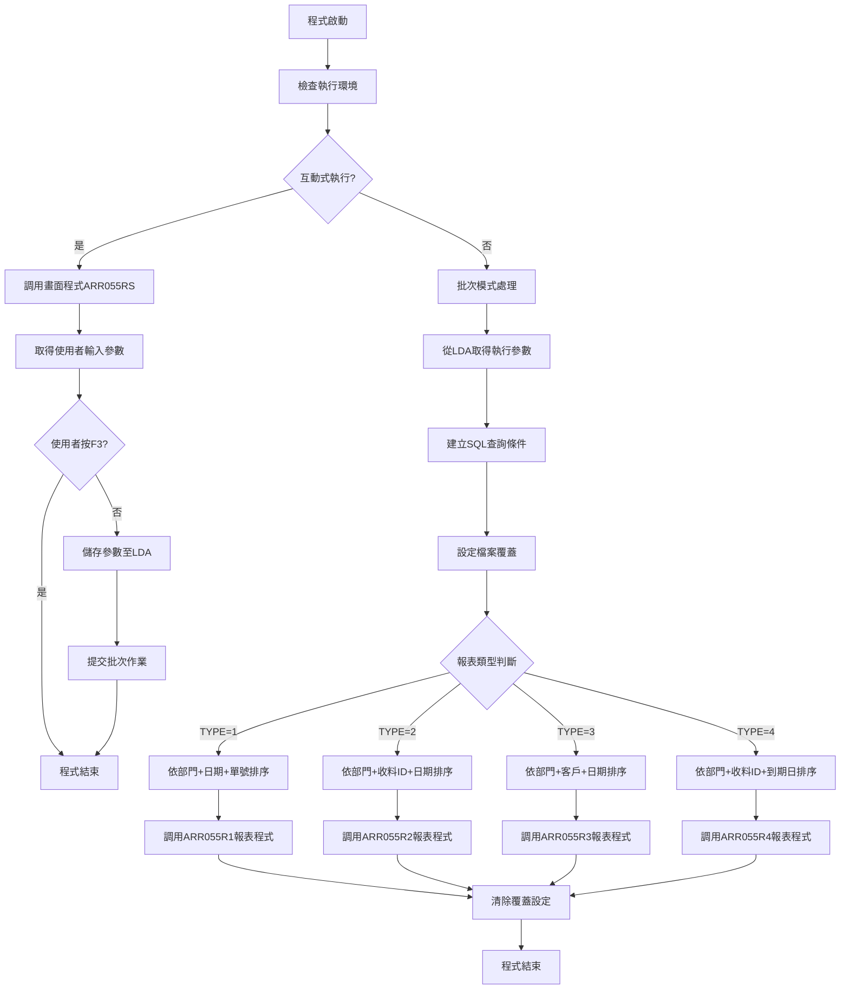
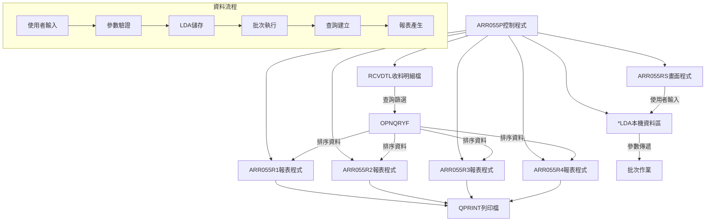
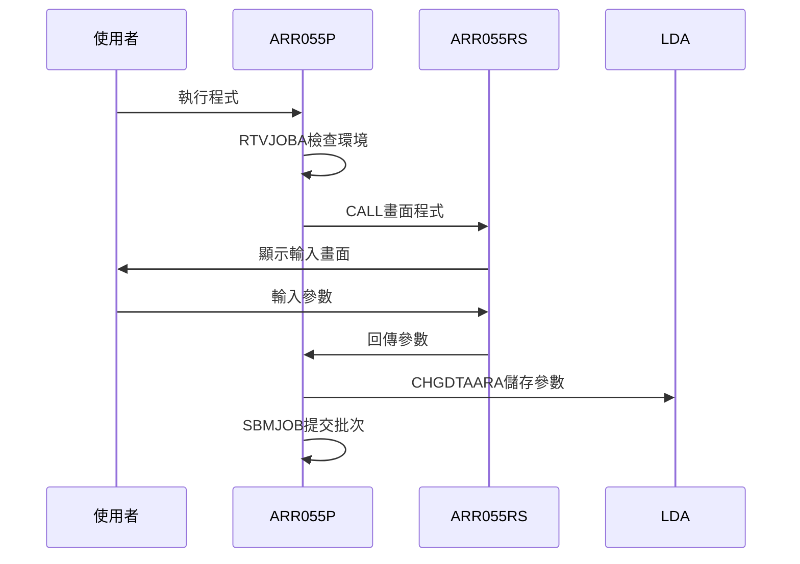
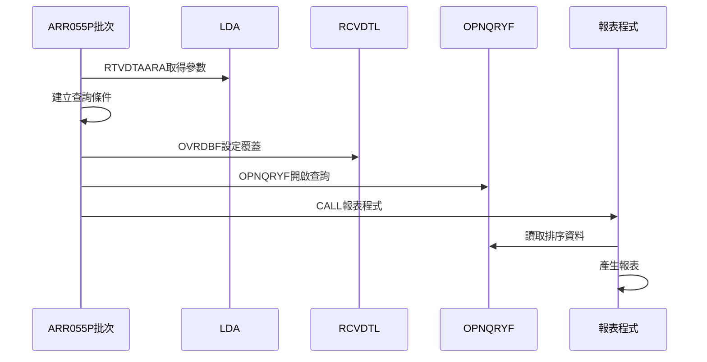
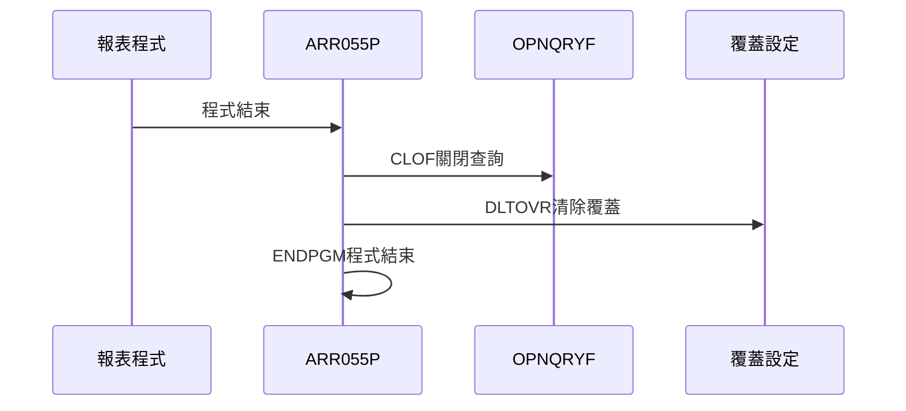
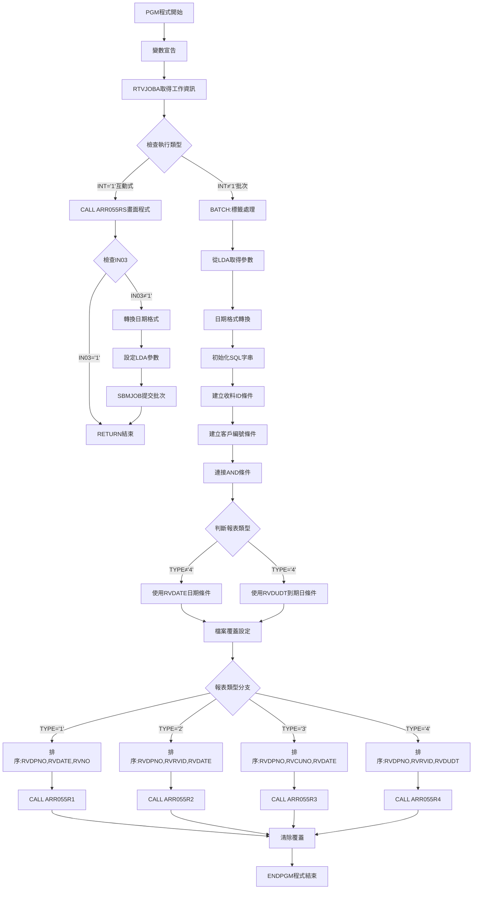
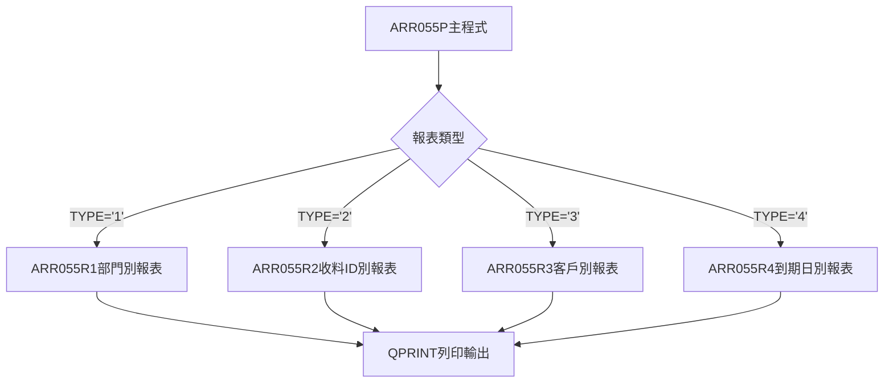

# ARR055P_P02 程式規格書

## 1. 基本資料

| 項目 | 內容 |
|------|------|
| **程式編號** | ARR055P |
| **程式名稱** | 應收帳款收料明細報表控制程式 |
| **程式類型** | CLP |
| **廠區** | P02 |
| **系統名稱** | 應收帳款系統 |
| **子系統** | 應收帳款報表處理 |
| **檔案位置** | P02CLSRC_THSRC/ARR055P.txt |

## 2. 🎯 程式功能說明

### 主要功能描述
此程式為應收帳款收料明細報表的控制程式，負責管理收料明細資料的查詢與報表產生作業。程式提供四種不同格式的報表類型，根據使用者選擇的報表類型調用對應的報表處理程式。

### 🎯 業務流程詳細說明

#### 完整業務流程圖


#### 業務流程關鍵階段說明

**階段一：環境檢查與模式判斷**
- 使用RTVJOBA指令取得工作環境資訊
- 判斷程式執行模式（互動式或批次）
- 根據執行模式決定後續處理流程

**階段二：互動式參數收集**
- 調用ARR055RS畫面程式進行參數輸入
- 驗證輸入參數的有效性
- 將參數儲存至本機資料區(LDA)
- 提交批次作業執行報表產生

**階段三：批次處理參數準備**
- 從LDA提取執行參數
- 進行資料格式轉換
- 建構動態SQL查詢條件字串

**階段四：查詢條件組合**
- 根據收料ID範圍建立篩選條件
- 根據客戶編號範圍建立篩選條件
- 根據報表類型決定日期欄位篩選
- 組合完整的查詢條件字串

**階段五：報表處理執行**
- 設定RCVDTL檔案覆蓋
- 執行OPNQRYF開啟查詢檔案
- 設定列印格式參數
- 調用對應的報表處理程式

## 3. 🎯 檔案架構與關聯圖

### 使用檔案清單

| 檔案名稱 | 檔案類型 | 使用方式 | 說明 |
|----------|----------|----------|------|
| RCVDTL | 實體檔 | INPUT | 收料明細主檔 |
| ARR055RS | 程式 | CALL | 畫面程式 |
| ARR055R1 | 程式 | CALL | 報表程式(類型1) |
| ARR055R2 | 程式 | CALL | 報表程式(類型2) |
| ARR055R3 | 程式 | CALL | 報表程式(類型3) |
| ARR055R4 | 程式 | CALL | 報表程式(類型4) |
| *LDA | 資料區 | I/O | 本機資料區 |
| QPRINT | 檔案 | OUTPUT | 列印檔案 |

### 🎯 檔案關聯詳細視覺化圖表



### 🎯 資料流向詳細說明

#### 環境準備階段的資料流向


#### 業務處理階段的資料流向


#### 環境清理階段的資料流向


## 4. 🎯 檔案欄位規格說明

### 主要資料結構

#### RCVDTL檔案結構
| 欄位名稱 | 位置 | 長度 | 型態 | 說明 |
|----------|------|------|------|------|
| RVFLAG | 1 | 1 | A | 處理旗標 |
| RVNO | 2-7 | 6 | A | 收料編號 |
| RVITEM | 8-9 | 2 | S | 項次 |
| RVDATE | 10-17 | 8 | S | 收料日期 |
| RVCUNO | 18-23 | 6 | A | 客戶編號 |
| RVTYPE | 24 | 1 | A | 收料類型 |
| RVDPNO | 25-28 | 4 | A | 收料部門 |
| RVRVID | 29-29 | 1 | A | 收料ID |
| RVDECD | 30 | 1 | A | 刪除碼 |
| RVDUDT | 31-38 | 8 | S | 到期日期 |

### 🔍 重點欄位切割技術詳解

#### 本機資料區(LDA)欄位切割視覺化展示
```
LDA資料區 (1024字元)：[T|DDDDDDDD|DDDDDDDD|.....|RR|CC....CC|OO....OO|...........................]
位置:                   001   002    010      021  031    037    043
                        ↓     ↓      ↓        ↓    ↓      ↓      ↓
W#TYPE (1字元)：       [T]                                        報表類型
DATE1A (8字元)：             [DDDDDDDD]                           起始日期
DATE2A (8字元)：                     [DDDDDDDD]                   結束日期
W#RCV1 (1字元)：                              [R]                收料ID起
W#RCV2 (1字元)：                               [R]               收料ID迄
W#CUN1 (6字元)：                                [CCCCCC]         客戶編號起
W#CUN2 (6字元)：                                       [CCCCCC]  客戶編號迄
W#ORNO (6字元)：                                              [OOOOOO] 訂單編號
```

#### 切割邏輯詳細說明
- **位置1**：報表類型碼(1=部門別, 2=收料ID別, 3=客戶別, 4=到期日別)
- **位置2-9**：起始日期，格式YYYYMMDD
- **位置10-17**：結束日期，格式YYYYMMDD
- **位置21**：收料ID起始值
- **位置22**：收料ID結束值
- **位置31-36**：客戶編號起始範圍
- **位置37-42**：客戶編號結束範圍
- **位置43-48**：訂單編號

### 🎯 欄位挪用詳細分析

#### 挪用情況對比表

| 欄位名稱 | 原始定義 | 實際使用方式 | 挪用類型 | 使用狀態 |
|----------|----------|-------------|----------|----------|
| **U#ORNO/W#ORNO** | 訂單編號(6字元) | 參數傳遞容器，未用於業務邏輯 | 功能性挪用 | 宣告但未使用 |
| **COMP欄位** | 公司代碼(35字元) | UDS固定欄位，系統識別用途 | 系統性挪用 | 背景參數 |
| **DEVNM欄位** | 設備名稱(10字元) | 環境識別碼，非實際設備名稱 | 環境性挪用 | 系統內部使用 |
| **TXAR欄位** | 交易區域(1字元) | 程式執行環境標識 | 環境性挪用 | 系統控制用 |

#### 挪用原因深度分析

**1. 訂單編號欄位挪用(U#ORNO/W#ORNO)**
- **原始設計目的**：用於存放客戶訂單編號，進行訂單相關的篩選和查詢
- **實際挪用原因**：
  - 畫面完整性考量：保持輸入畫面的欄位完整，避免使用者混淆
  - 未來擴展預留：為可能的訂單查詢功能預留參數位置
  - 程式架構一致性：與其他相關程式保持相同的參數傳遞結構
- **業務邏輯影響**：雖然收集訂單編號但在查詢條件中未使用，不影響報表產生

**2. UDS系統欄位挪用(COMP/DEVNM/TXAR)**
- **原始設計目的**：
  - COMP：公司代碼識別
  - DEVNM：實際設備名稱
  - TXAR：交易處理區域
- **實際挪用原因**：
  - 系統環境識別：用於識別程式執行環境和系統配置
  - 跨程式參數傳遞：作為程式間通訊的固定欄位
  - 歷史相容性：保持與舊版程式的欄位結構一致

#### 挪用方式詳細說明

**訂單編號欄位挪用實現方式**：
```34:41:東鋼list/ARR055P_P02.txt
RTVDTAARA  DTAARA(*LDA (43 6))   RTNVAR(&W#ORNO)
```
```99:103:P02RPGSRC_THSRC/ARR055RS.txt
C                     MOVELS#RCV1    U#RCV1
C                     MOVELS#RCV2    U#RCV2
C                     MOVELS#CUN1    U#CUN1
C                     MOVELS#CUN2    U#CUN2
C                     MOVELS#ORNO    U#ORNO
```
- **儲存方式**：從畫面程式收集後存放於LDA位置43-48
- **傳遞方式**：透過UDS結構在程式間傳遞
- **使用方式**：提取到變數但未納入SQL查詢條件

**UDS系統欄位挪用實現方式**：
```17:26:P02RPGSRC_THSRC/ARR055RS.txt
I           UDS
I                                        1   1 U#TYPE
I                                       21  21 U#RCV1
I                                       22  22 U#RCV2
I                                       31  36 U#CUN1
I                                       37  42 U#CUN2
I                                       43  48 U#ORNO
I                                      951 985 COMP
I                                     10111020 DEVNM
I                                     10211021 TXAR
```
- **固定配置**：在UDS中佔用固定位置
- **自動填充**：由AS/400系統自動填入環境資訊
- **背景傳遞**：程式執行時自動存取，無需明確處理

#### 挪用影響評估

**正面影響**：
- **程式架構一致性**：保持與其他報表程式相同的參數結構
- **未來擴展性**：訂單編號欄位為未來功能擴展提供基礎
- **使用者介面完整性**：畫面欄位完整，避免使用者困惑
- **系統相容性**：UDS欄位確保與系統環境的正確整合

**潜在風險**：
- **維護複雜性**：未使用的欄位增加程式理解難度
- **參數傳遞冗餘**：不必要的參數傳遞可能造成效能微幅影響
- **文檔一致性**：需要明確說明欄位的實際用途vs名稱定義

**維護注意事項**：
- 修改程式時需注意訂單編號欄位雖未使用但仍需保持傳遞
- UDS系統欄位不應手動修改，由系統自動管理
- 如需啟用訂單編號功能，需在SQL條件建立邏輯中加入對應處理

### 重要變數定義表

| 變數名稱 | 型態 | 長度 | 用途說明 |
|----------|------|------|----------|
| &INT | *CHAR | 1 | 工作類型識別 |
| &OUTQ | *CHAR | 10 | 輸出佇列名稱 |
| &IN03 | *LGL | 1 | F3功能鍵指示器 |
| &DATE1 | *DEC | 8 | 起始日期(數值型) |
| &DATE1A | *CHAR | 8 | 起始日期(字元型) |
| &DATE2 | *DEC | 8 | 結束日期(數值型) |
| &DATE2A | *CHAR | 8 | 結束日期(字元型) |
| &W#TYPE | *CHAR | 1 | 報表類型選擇 |
| &W#RCV1 | *CHAR | 1 | 收料ID起始值 |
| &W#RCV2 | *CHAR | 1 | 收料ID結束值 |
| &W#CUN1 | *CHAR | 6 | 客戶編號起始值 |
| &W#CUN2 | *CHAR | 6 | 客戶編號結束值 |
| &W#ORNO | *CHAR | 6 | 訂單編號 |
| &W#SQLS | *CHAR | 500 | SQL查詢條件字串 |

## 5. 🎯 輸出/入螢幕布局

### 螢幕布局完整視覺化
```
+----------------------------------------------------------+
|                應收帳款收料明細報表           東鋼公司  日期|
+----------------------------------------------------------+
|                    選擇報表類型與查詢條件                 |
+----------------------------------------------------------+
|                                                          |
| 報表類型：[_] (1=部門別 2=收料ID別 3=客戶別 4=到期日別)    |
|                                                          |
| 起始日期：[____/__/__] (YYYY/MM/DD)                      |
| 結束日期：[____/__/__] (YYYY/MM/DD)                      |
|                                                          |
| 收料ID：  [_] 至 [_]                                     |
| 客戶編號：[______] 至 [______]                           |
| 訂單編號：[______]                                       |
|                                                          |
|                                                          |
| [錯誤訊息顯示區]                                          |
| F3=結束  Enter=確認                                       |
+----------------------------------------------------------+
```

### 🎯 畫面欄位詳細說明

| 欄位標題 | 欄位名稱 | 輸入長度 | 型態 | 屬性 | 檢核規則 |
|----------|----------|----------|------|------|----------|
| 報表類型 | S#TYPE | 1 | A | 必填 | 必須為1,2,3,4之一 |
| 起始日期 | DATE1 | 8 | N | 必填 | 有效日期格式 |
| 結束日期 | DATE2 | 8 | N | 必填 | 必須≥起始日期 |
| 收料ID起 | S#RCV1 | 1 | A | 選填 | 若有迄值則必填 |
| 收料ID迄 | S#RCV2 | 1 | A | 選填 | 必須≥起始值 |
| 客戶編號起 | S#CUN1 | 6 | A | 選填 | 若有迄值則必填 |
| 客戶編號迄 | S#CUN2 | 6 | A | 選填 | 必須≥起始值 |
| 訂單編號 | S#ORNO | 6 | A | 選填 | 無特殊限制 |

### 功能鍵詳細定義

| 功能鍵 | 功能說明 | 處理邏輯 | 系統行為 |
|--------|----------|----------|----------|
| F3 | 結束程式 | 設定*IN03='1' | 直接結束不執行報表 |
| Enter | 確認執行 | 驗證輸入參數 | 通過驗證則提交批次作業 |

## 6. 🎯 處理流程程序說明

### 🎯 主程序邏輯深度分析

#### 程式執行流程圖


#### 🎯 詳細處理步驟逐一分析

**步驟1：程式初始化**
- 宣告所有必要變數
- 設定變數初始值
- 準備程式執行環境

**步驟2：環境檢查**
```17:17:東鋼list/ARR055P_P02.txt
RTVJOBA    OUTQ(&OUTQ) TYPE(&INT)
```
- 使用RTVJOBA指令取得工作屬性
- 判斷執行模式(互動式或批次)
- 取得輸出佇列資訊

**步驟3：互動式處理分支**
```18:30:東鋼list/ARR055P_P02.txt
IF         COND(&INT *EQ '1') THEN(DO)
CALL       PGM(ARR055RS) PARM(&IN03 &DATE1 &DATE2)
IF         COND(&IN03 *EQ '1') THEN(RETURN)

CHGVAR     VAR(&DATE1A) VALUE(&DATE1)
CHGVAR     VAR(&DATE2A) VALUE(&DATE2)
CHGDTAARA  DTAARA(*LDA (2  8)) VALUE(&DATE1A)
CHGDTAARA  DTAARA(*LDA (10 8)) VALUE(&DATE2A)

SBMJOB     JOB(ARR055P) JOBD(ARJOBD) OUTQ(&OUTQ) +
             RQSDTA('CALL ARR055P')
RETURN
ENDDO
```
- 調用畫面程式進行參數輸入
- 檢查使用者是否取消(F3)
- 轉換數值日期為字元格式
- 儲存參數至本機資料區
- 提交批次作業執行

**步驟4：批次處理分支**
```34:44:東鋼list/ARR055P_P02.txt
RTVDTAARA  DTAARA(*LDA (1  1))   RTNVAR(&W#TYPE)
RTVDTAARA  DTAARA(*LDA (2  8))   RTNVAR(&DATE1A)
RTVDTAARA  DTAARA(*LDA (10 8))   RTNVAR(&DATE2A)
RTVDTAARA  DTAARA(*LDA (21 1))   RTNVAR(&W#RCV1)
RTVDTAARA  DTAARA(*LDA (22 1))   RTNVAR(&W#RCV2)
RTVDTAARA  DTAARA(*LDA (31 6))   RTNVAR(&W#CUN1)
RTVDTAARA  DTAARA(*LDA (37 6))   RTNVAR(&W#CUN2)
RTVDTAARA  DTAARA(*LDA (43 6))   RTNVAR(&W#ORNO)

CHGVAR     VAR(&DATE1) VALUE(&DATE1A)
CHGVAR     VAR(&DATE2) VALUE(&DATE2A)
```
- 從LDA提取所有執行參數
- 轉換字元日期為數值格式

**步驟5：查詢條件建立**
```46:69:東鋼list/ARR055P_P02.txt
CHGVAR     VAR(&W#SQLS) VALUE(' ')
IF         COND(&W#RCV1 *NE ' ') THEN(DO)
    IF     COND(&W#RCV2 *NE ' ') THEN(+
    CHGVAR VAR(&W#SQLS) VALUE('RVRVID *GE "' || &W#RCV1 +
           || '" *AND RVRVID *LE "' || &W#RCV2 || '"'))
    ELSE   CMD(+
    CHGVAR VAR(&W#SQLS) VALUE('RVRVID *EQ "' || &W#RCV1 +
           || '"'))
ENDDO
```
- 動態建立SQL查詢條件
- 處理收料ID範圍條件
- 處理客戶編號範圍條件
- 組合完整查詢字串

### 🎯 子程序邏輯分析

#### ARR055RS畫面程式調用
- **功能**：收集使用者輸入參數
- **參數傳遞**：&IN03(功能鍵), &DATE1(起始日期), &DATE2(結束日期)
- **返回值**：使用者輸入的所有參數
- **調用關係**：主程式→ARR055RS→回傳參數→主程式

#### 報表程式調用關係


### 🎯 特殊邏輯處理

#### 動態SQL條件組合演算法
1. **初始化**：設定空白查詢字串
2. **收料ID處理**：
   - 若只有起始值：建立等於條件
   - 若有起迄值：建立範圍條件
3. **客戶編號處理**：
   - 若已有條件則加入AND連接詞
   - 建立範圍或等於條件
4. **日期條件選擇**：
   - 一般報表使用收料日期(RVDATE)
   - 到期日報表使用到期日期(RVDUDT)
5. **排除條件**：固定排除刪除資料和特定類型

#### 檔案排序邏輯實現
```92:122:東鋼list/ARR055P_P02.txt
IF         COND(&W#TYPE *EQ '1') THEN(DO)
OPNQRYF    FILE(RCVDTL) +
           QRYSLT(&W#SQLS) +
           KEYFLD((RVDPNO)(RVDATE)(RVNO))
OVRPRTF    FILE(QPRINT) COPIES(1) PAGESIZE(*N 176) CPI(13.3)
CALL       PGM(ARR055R1) PARM(&DATE1 &DATE2)
ENDDO
```
- 根據報表類型設定不同排序鍵值
- 統一設定列印格式(176字元寬度，13.3CPI)
- 傳遞日期參數給報表程式

## 7. 🎯 數據操作與轉換分析

### 檔案操作詳解

#### RCVDTL檔案存取邏輯
```90:90:東鋼list/ARR055P_P02.txt
OVRDBF     FILE(RCVDTL) TOFILE(RCVDTL) SHARE(*YES)
```
- **操作類型**：讀取存取
- **併發控制**：設定共享模式(*YES)
- **存取條件**：透過OPNQRYF建立查詢檢視
- **篩選機制**：動態SQL條件篩選

#### 查詢檔案開啟處理
- **OPNQRYF功能**：建立排序查詢檢視
- **排序設定**：依報表類型設定不同排序鍵
- **條件篩選**：套用動態建立的SQL條件
- **檔案鎖定**：讀取專用鎖定機制

### 數據轉換邏輯

#### 日期格式轉換處理
```22:25:東鋼list/ARR055P_P02.txt
CHGVAR     VAR(&DATE1A) VALUE(&DATE1)
CHGVAR     VAR(&DATE2A) VALUE(&DATE2)
CHGDTAARA  DTAARA(*LDA (2  8)) VALUE(&DATE1A)
CHGDTAARA  DTAARA(*LDA (10 8)) VALUE(&DATE2A)
```
- **轉換方向**：數值日期→字元日期→LDA儲存
- **格式標準**：8位數字YYYYMMDD格式
- **儲存位置**：LDA固定位置儲存
- **用途說明**：供批次程式讀取使用

#### 字串操作和格式化
```49:50:東鋼list/ARR055P_P02.txt
CHGVAR VAR(&W#SQLS) VALUE('RVRVID *GE "' || &W#RCV1 +
       || '" *AND RVRVID *LE "' || &W#RCV2 || '"'))
```
- **串接操作**：使用||運算子進行字串連接
- **條件格式**：標準SQL比較運算子格式
- **動態建立**：根據輸入參數動態組合查詢條件

### 檢核機制詳解

#### 資料有效性檢查邏輯
1. **日期有效性**：由ARR055RS畫面程式執行
2. **日期範圍檢查**：起始日期必須≤結束日期
3. **報表類型檢核**：必須為1,2,3,4之一
4. **範圍參數檢查**：起始值與結束值的邏輯性檢查

#### 檢核失敗處理方式
- 畫面程式負責參數檢核
- 檢核失敗時顯示錯誤訊息
- 使用者修正後重新輸入
- 通過檢核才可執行報表

## 8. 🎯 錯誤處理程序說明

### 🎯 詳細錯誤代碼清冊

| 錯誤代碼 | 錯誤訊息 | 原因說明 | 處理方式 | 預防措施 |
|----------|---------|---------|---------|----------|
| **SYS001** | 檔案開啟失敗 | RCVDTL檔案無法開啟或不存在 | 1. 檢查檔案權限<br>2. 確認檔案存在<br>3. 重新執行程式 | 確保檔案系統正常運作 |
| **USER001** | 功能鍵F3結束 | 使用者按下F3取消執行 | 1. 正常結束程式<br>2. 不執行後續處理 | 使用者操作選擇 |
| **FILE001** | LDA存取錯誤 | 本機資料區讀寫失敗 | 1. 重新啟動工作<br>2. 檢查工作環境<br>3. 重新執行程式 | 確保工作環境正常 |
| **NET001** | 批次作業提交失敗 | SBMJOB指令執行失敗 | 1. 檢查作業描述ARJOBD<br>2. 確認子系統狀態<br>3. 重新提交作業 | 監控子系統運作狀態 |
| **FILE002** | 查詢檔案建立失敗 | OPNQRYF指令執行失敗 | 1. 檢查SQL語法<br>2. 確認檔案可用性<br>3. 重新建立查詢 | 驗證查詢條件正確性 |

### 🎯 系統異常處理邏輯

#### 檔案操作失敗處理
- **檢測機制**：AS/400系統自動偵測檔案錯誤
- **處理方式**：程式自動中斷，回傳錯誤訊息
- **恢復機制**：使用者重新執行程式
- **記錄機制**：系統作業日誌記錄錯誤

#### 程式調用失敗處理
- **畫面程式錯誤**：中斷執行，回到主選單
- **報表程式錯誤**：批次作業異常結束
- **參數傳遞錯誤**：程式自動偵測並中斷

#### 資料完整性錯誤處理
- **查詢條件錯誤**：OPNQRYF失敗，自動清除覆蓋
- **排序鍵值錯誤**：使用預設排序方式
- **資料篩選錯誤**：回傳空白報表

#### 並發控制失敗處理
- **檔案鎖定衝突**：等待檔案釋放後重試
- **共享模式衝突**：使用SHARE(*YES)避免衝突
- **查詢衝突**：每次執行重新建立查詢

## 9. 🎯 備註

### 🎯 特殊注意事項

#### 報表類型功能說明
- **類型1**：依部門、日期、單號排序的綜合明細表
- **類型2**：依部門、收料ID、日期排序的收料統計表
- **類型3**：依部門、客戶、日期排序的客戶分析表
- **類型4**：依部門、收料ID、到期日排序的到期管理表

#### LDA資料區使用說明
- 本機資料區用於互動式與批次模式間的參數傳遞
- 固定位置儲存，避免參數位置錯亂
- 批次執行時自動讀取，無需人工干預

#### 檔案覆蓋機制說明
- 使用OVRDBF確保檔案正確開啟
- SHARE(*YES)設定允許多使用者同時查詢
- 執行完畢後使用DLTOVR清除所有覆蓋設定

#### 列印格式設定說明
- 統一使用176字元寬度適應報表內容
- CPI(13.3)設定確保字元密度適中
- PAGESIZE(*N 176)設定連續列印格式 