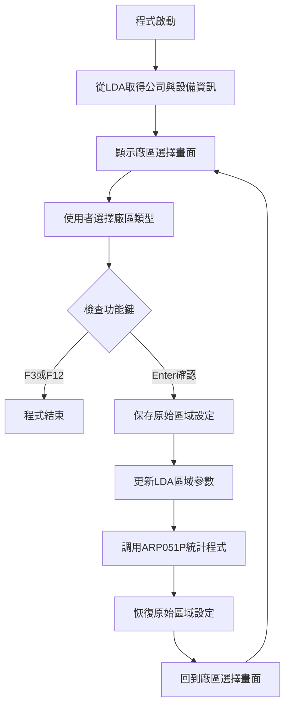
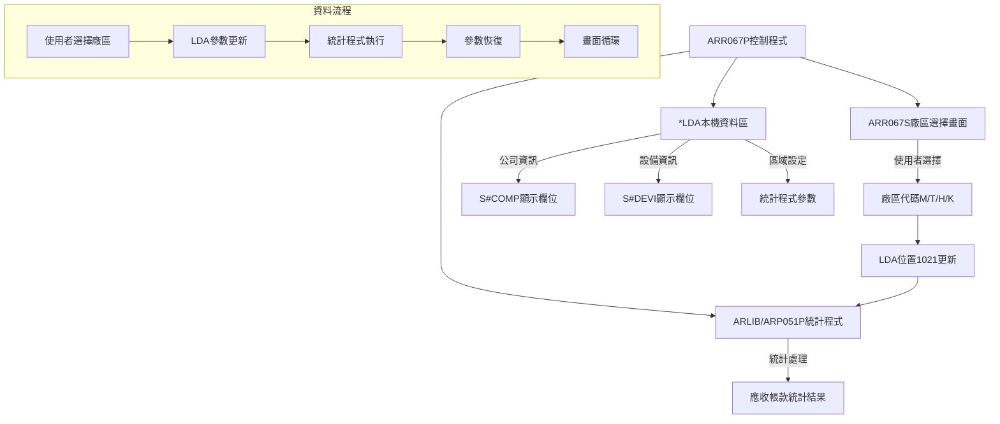
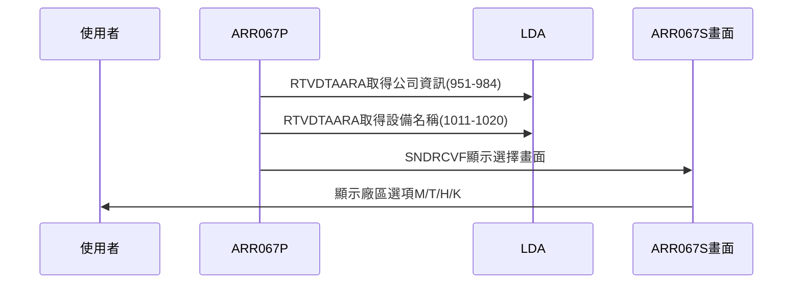
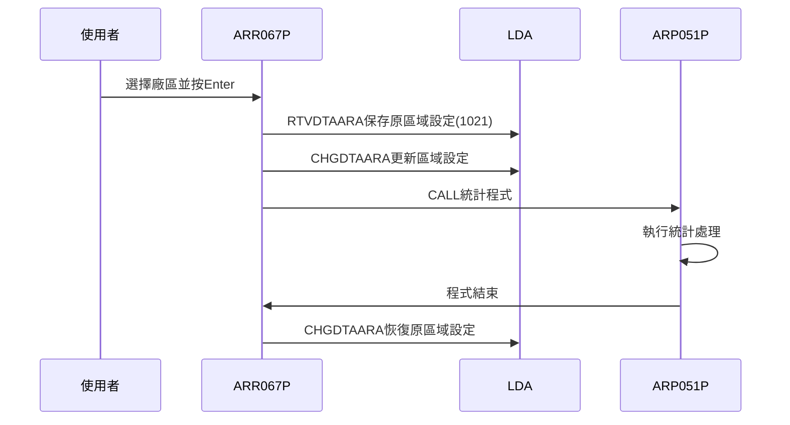
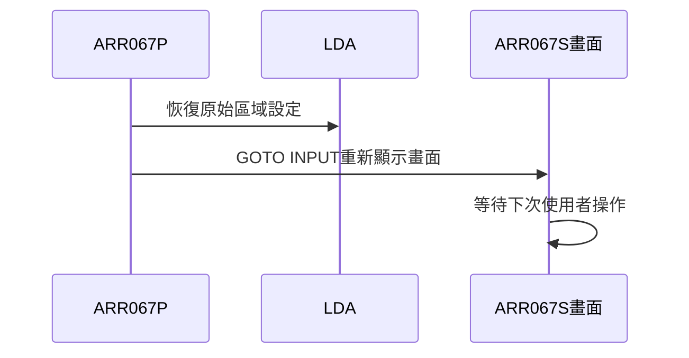
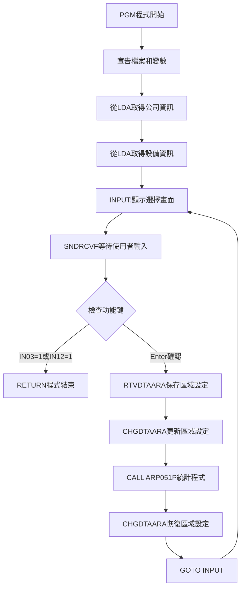
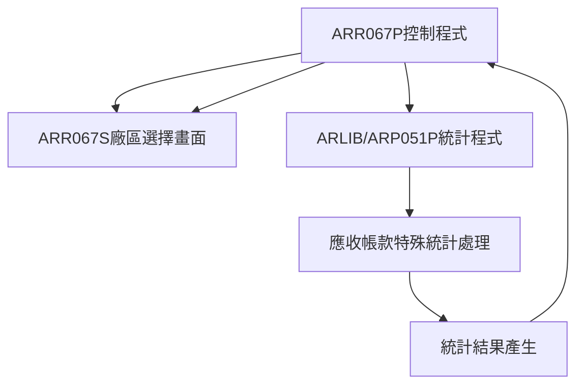

# ARR067P_P02 程式規格書

## 1. 基本資料

| 項目 | 內容 |
|------|------|
| **程式編號** | ARR067P |
| **程式名稱** | 應收帳款特殊統計系統控制程式 |
| **程式類型** | CLP |
| **廠區** | P02 |
| **系統名稱** | 應收帳款系統 |
| **子系統** | 應收帳款統計報表 |
| **檔案位置** | P02CLSRC_THSRC/ARR067P.txt |

## 2. 🎯 程式功能說明

### 主要功能描述
此程式為應收帳款特殊統計系統的控制程式，提供廠區選擇功能並調用對應的統計處理程式。程式透過簡易的選擇畫面讓使用者指定統計範圍，然後啟動後端的統計處理作業。

### 🎯 業務流程詳細說明

#### 完整業務流程圖


#### 業務流程關鍵階段說明

**階段一：環境參數準備**
- 從LDA取得公司編號(位置951-984，34字元)
- 從LDA取得設備名稱(位置1011-1020，10字元)
- 準備畫面顯示所需的基本環境資訊

**階段二：使用者互動處理**
- 顯示ARR067S廠區選擇畫面
- 提供四種廠區選項：M(台鋼)、T(東鋼)、H(高雄)、K(嘉聯)
- 等待使用者選擇並驗證輸入

**階段三：區域設定管理**
- 保存當前LDA位置1021的區域設定值
- 將使用者選擇的廠區代碼寫入LDA位置1021
- 確保統計程式使用正確的廠區參數

**階段四：統計程式調用**
- 呼叫ARLIB/ARP051P應收帳款特殊統計程式
- 傳遞廠區參數供統計程式使用
- 等待統計程式執行完成

**階段五：環境恢復與循環**
- 恢復原始的LDA區域設定值
- 維持畫面循環，允許使用者繼續選擇
- 直到使用者按F3或F12結束程式

## 3. 🎯 檔案架構與關聯圖

### 使用檔案清單

| 檔案名稱 | 檔案類型 | 使用方式 | 說明 |
|----------|----------|----------|------|
| ARR067S | 畫面檔 | DCLF | 廠區選擇畫面檔案 |
| ARP051P | 程式 | CALL | 應收帳款特殊統計處理程式 |
| *LDA | 資料區 | I/O | 本機資料區(參數傳遞) |

### 🎯 檔案關聯詳細視覺化圖表



### 🎯 資料流向詳細說明

#### 環境準備階段的資料流向


#### 業務處理階段的資料流向


#### 環境清理階段的資料流向


## 4. 🎯 檔案欄位規格說明

### 主要資料結構

#### 程式變數定義
| 變數名稱 | 型態 | 長度 | 用途說明 |
|----------|------|------|----------|
| &IN03 | *LGL | 1 | F3功能鍵指示器 |
| &IN12 | *LGL | 1 | F12功能鍵指示器 |
| &AREA | *CHAR | 1 | 區域設定暫存變數 |
| &S#COMP | *CHAR | 34 | 公司名稱顯示欄位 |
| &S#DEVI | *CHAR | 10 | 設備名稱顯示欄位 |

#### ARR067S畫面欄位結構
| 欄位名稱 | 位置 | 長度 | 型態 | 說明 |
|----------|------|------|------|------|
| S#COMP | 1,23 | 35 | A | 公司名稱顯示 |
| S#DEVI | 2,70 | 10 | A | 設備名稱顯示 |
| S#AREA | 10,28 | 1 | B | 廠區選擇輸入欄位 |

### 🔍 重點欄位切割技術詳解

#### 本機資料區(LDA)欄位切割視覺化展示
```
LDA資料區 (1024字元)：[............CCCCCCCCCCCCCCCCCCCCCCCCCCCCCCCCCC........DDDDDDDDDD.AAAAA...]
位置:                         951                                1011      1021
                              ↓                                  ↓         ↓
S#COMP (34字元)：           [CCCCCCCCCCCCCCCCCCCCCCCCCCCCCCCCCC]           公司名稱
S#DEVI (10字元)：                                              [DDDDDDDDDD] 設備名稱  
AREA (1字元)：                                                           [A] 區域設定
```

#### 切割邏輯詳細說明
- **位置951-984**：公司名稱欄位，長度34字元，用於畫面標題顯示
- **位置1011-1020**：設備名稱欄位，長度10字元，用於識別執行環境
- **位置1021**：區域設定欄位，長度1字元，控制統計程式處理範圍

### 🎯 欄位挪用詳細分析

#### 挪用情況對比表

| 欄位名稱 | 原始定義 | 實際使用方式 | 挪用類型 | 使用狀態 |
|----------|----------|-------------|----------|----------|
| **LDA位置1021** | 系統區域設定 | 廠區類型參數傳遞 | 參數性挪用 | 臨時覆蓋使用 |
| **S#COMP/S#DEVI** | 一般顯示欄位 | 環境識別顯示 | 功能性挪用 | 只讀顯示 |

#### 挪用原因深度分析

**1. LDA位置1021區域設定挪用**
- **原始設計目的**：系統環境區域設定，用於語言和地區識別
- **實際挪用原因**：
  - 程式間參數傳遞需求：需要傳遞廠區選擇給統計程式
  - 固定位置約定：與ARP051P程式約定的參數傳遞位置
  - 臨時性使用：使用後立即恢復原值，不影響系統設定
- **業務邏輯影響**：通過臨時覆蓋和恢復機制，確保不影響系統原有設定

**2. 顯示欄位功能性挪用**
- **原始設計目的**：一般性資訊顯示欄位
- **實際挪用原因**：
  - 環境識別需求：讓使用者確認執行環境
  - 畫面資訊完整性：提供必要的系統識別資訊
  - 標準化顯示格式：遵循系統標準畫面布局

#### 挪用方式詳細說明

**區域設定欄位挪用實現方式**：
```24:27:東鋼list/ARR067P_P02.txt
RTVDTAARA  DTAARA(*LDA (1021 1)) RTNVAR(&AREA)
CHGDTAARA  DTAARA(*LDA (1021 1)) VALUE(&S#AREA)
CALL       PGM(ARLIB/ARP051P)
CHGDTAARA  DTAARA(*LDA (1021 1)) VALUE(&AREA)
```
- **保存機制**：先讀取原值保存至&AREA變數
- **設定機制**：將使用者選擇的廠區代碼寫入LDA
- **恢復機制**：統計程式執行完後恢復原值

**顯示欄位挪用實現方式**：
```20:21:東鋼list/ARR067P_P02.txt
RTVDTAARA  DTAARA(*LDA (951 34)) RTNVAR(&S#COMP)
RTVDTAARA  DTAARA(*LDA (1011 10)) RTNVAR(&S#DEVI)
```
- **讀取方式**：從LDA固定位置讀取環境資訊
- **顯示方式**：直接傳遞給畫面欄位顯示
- **用途說明**：提供環境識別和使用者確認

#### 挪用影響評估

**正面影響**：
- **參數傳遞效率**：利用LDA固定位置實現高效參數傳遞
- **程式間協作**：與ARP051P程式形成標準化的參數傳遞機制
- **環境識別清晰**：使用者可清楚了解執行環境
- **系統一致性**：遵循系統標準的顯示格式

**潛在風險**：
- **參數位置依賴**：依賴LDA固定位置，變更時需同步修改
- **臨時覆蓋風險**：雖有恢復機制，但仍存在中斷風險
- **維護複雜性**：需要理解參數傳遞的完整流程

**維護注意事項**：
- LDA位置1021的使用必須確保恢復機制正常運作
- 修改程式時需確認ARP051P程式的參數讀取邏輯
- 顯示欄位的LDA位置變更需同步更新相關程式

### 重要變數定義表

| 變數名稱 | 型態 | 長度 | 用途說明 |
|----------|------|------|----------|
| &IN03 | *LGL | 1 | F3結束功能鍵指示器 |
| &IN12 | *LGL | 1 | F12取消功能鍵指示器 |
| &AREA | *CHAR | 1 | 區域設定暫存變數(保存LDA原值) |
| &S#COMP | *CHAR | 34 | 公司名稱(從LDA取得) |
| &S#DEVI | *CHAR | 10 | 設備名稱(從LDA取得) |

## 5. 🎯 輸出/入螢幕布局

### 螢幕布局完整視覺化
```
+----------------------------------------------------------+
|  12/28/24     東鋼金屬股份有限公司               ARR067S  |
|  10:30:25     應收帳款特殊統計系統整理           SYS001   |
|                                                          |
|                                                          |
|                                                          |
|                                                          |
|                                                          |
|                                                          |
|                -----------------------------------       |
|                統計系統：[_] (M台鋼, T東鋼, H高雄, K嘉聯) |
|                -----------------------------------       |
|                                                          |
|                                                          |
|                                                          |
|                                                          |
|                                                          |
|                                                          |
|                                                          |
|                                                          |
|                                                          |
|                                                          |
| F3=結束  F12=取消                                        |
+----------------------------------------------------------+
```

### 🎯 畫面欄位詳細說明

| 欄位標題 | 欄位名稱 | 輸入長度 | 型態 | 屬性 | 檢核規則 |
|----------|----------|----------|------|------|----------|
| 統計系統 | S#AREA | 1 | A | 必填 | 必須為M,T,H,K之一 |

#### 廠區代碼說明
- **M**：台鋼廠區統計
- **T**：東鋼廠區統計  
- **H**：高雄廠區統計
- **K**：嘉聯廠區統計

### 🎯 畫面控制邏輯

#### 顯示屬性控制
- 公司名稱：顯示專用(Output only)
- 設備名稱：顯示專用(Output only)
- 廠區選擇：輸入欄位(Both input/output)

#### 指示器控制
- CA03(03)：F3功能鍵控制
- CA12(12)：F12功能鍵控制
- OVERLAY：畫面覆蓋顯示

### 功能鍵詳細定義

| 功能鍵 | 功能說明 | 處理邏輯 | 系統行為 |
|--------|----------|----------|----------|
| F3 | 結束程式 | 設定*IN03='1' | 直接結束程式，回到呼叫點 |
| F12 | 取消作業 | 設定*IN12='1' | 取消目前作業，回到呼叫點 |
| Enter | 確認選擇 | 驗證廠區代碼 | 調用統計程式執行 |

### 操作流程

1. **畫面顯示**：顯示廠區選擇畫面，等待使用者輸入
2. **廠區選擇**：使用者輸入M/T/H/K其中一個代碼
3. **功能鍵處理**：
   - 按Enter：驗證輸入後執行統計
   - 按F3/F12：結束程式
4. **循環操作**：統計完成後回到選擇畫面

## 6. 🎯 處理流程程序說明

### 🎯 主程序邏輯深度分析

#### 程式執行流程圖


#### 🎯 詳細處理步驟逐一分析

**步驟1：程式初始化**
```14:19:東鋼list/ARR067P_P02.txt
PGM
DCLF       FILE(ARR067S)
DCL        VAR(&IN03) TYPE(*LGL)  LEN(1)
DCL        VAR(&IN12) TYPE(*LGL)  LEN(1)
DCL        VAR(&AREA) TYPE(*CHAR) LEN(1)
```
- 宣告ARR067S畫面檔案
- 定義功能鍵指示器變數(&IN03, &IN12)
- 定義區域設定暫存變數(&AREA)

**步驟2：環境資訊準備**
```20:21:東鋼list/ARR067P_P02.txt
RTVDTAARA  DTAARA(*LDA (951 34)) RTNVAR(&S#COMP)
RTVDTAARA  DTAARA(*LDA (1011 10)) RTNVAR(&S#DEVI)
```
- 從LDA位置951-984讀取公司名稱(34字元)
- 從LDA位置1011-1020讀取設備名稱(10字元)
- 準備畫面顯示所需的環境識別資訊

**步驟3：使用者互動循環**
```22:23:東鋼list/ARR067P_P02.txt
INPUT:      SNDRCVF    RCDFMT(AR067F1)
            IF COND((&IN03 *EQ '1') *OR (&IN12 *EQ '1')) THEN(RETURN)
```
- 顯示AR067F1廠區選擇畫面
- 等待使用者輸入廠區代碼或按功能鍵
- 檢查F3或F12功能鍵，若按下則結束程式

**步驟4：區域設定管理**
```24:27:東鋼list/ARR067P_P02.txt
RTVDTAARA  DTAARA(*LDA (1021 1)) RTNVAR(&AREA)
CHGDTAARA  DTAARA(*LDA (1021 1)) VALUE(&S#AREA)
CALL       PGM(ARLIB/ARP051P)
CHGDTAARA  DTAARA(*LDA (1021 1)) VALUE(&AREA)
```
- 保存LDA位置1021的原始區域設定值
- 將使用者選擇的廠區代碼寫入LDA位置1021
- 調用ARP051P統計程式執行
- 恢復原始的區域設定值

**步驟5：循環控制**
```28:29:東鋼list/ARR067P_P02.txt
GOTO       INPUT
ENDPGM
```
- 跳回INPUT標籤重新顯示選擇畫面
- 形成無限循環，直到使用者按F3或F12結束

### 🎯 子程序邏輯分析

#### ARP051P統計程式調用
- **調用方式**：CALL PGM(ARLIB/ARP051P)
- **程式庫**：ARLIB程式庫
- **參數傳遞**：透過LDA位置1021傳遞廠區代碼
- **執行模式**：同步調用，等待完成後返回

#### 調用關係圖


### 🎯 特殊邏輯處理

#### 區域設定保護機制
1. **保存原值**：調用統計程式前先保存LDA位置1021原值
2. **設定新值**：將廠區代碼寫入LDA供統計程式使用
3. **恢復原值**：統計程式完成後立即恢復原始設定
4. **防護措施**：確保系統區域設定不受永久影響

#### 畫面循環控制邏輯
- **無限循環設計**：使用GOTO INPUT形成持續循環
- **使用者控制退出**：只有F3或F12才能退出循環
- **作業連續性**：允許使用者連續選擇不同廠區進行統計

#### 功能鍵處理策略
```23:23:東鋼list/ARR067P_P02.txt
IF COND((&IN03 *EQ '1') *OR (&IN12 *EQ '1')) THEN(RETURN)
```
- **OR邏輯判斷**：F3或F12任一按下都可結束程式
- **即時響應**：功能鍵檢查在畫面輸入後立即執行
- **優先處理**：功能鍵檢查優先於業務邏輯處理

## 7. 🎯 數據操作與轉換分析

### 檔案操作詳解

#### LDA資料區存取操作
```20:21:東鋼list/ARR067P_P02.txt
RTVDTAARA  DTAARA(*LDA (951 34)) RTNVAR(&S#COMP)
RTVDTAARA  DTAARA(*LDA (1011 10)) RTNVAR(&S#DEVI)
```
- **操作類型**：讀取操作(RTVDTAARA)
- **存取位置**：固定位置存取
- **併發控制**：單一程式存取，無併發問題
- **資料用途**：環境識別和畫面顯示

#### 畫面檔案互動操作
```22:22:東鋼list/ARR067P_P02.txt
SNDRCVF    RCDFMT(AR067F1)
```
- **操作方式**：同步畫面互動(SNDRCVF)
- **資料流向**：雙向(顯示資料+接收輸入)
- **記錄格式**：AR067F1畫面格式
- **等待機制**：阻塞式等待使用者輸入

### 數據轉換邏輯

#### 廠區代碼轉換處理
```25:25:東鋼list/ARR067P_P02.txt
CHGDTAARA  DTAARA(*LDA (1021 1)) VALUE(&S#AREA)
```
- **轉換來源**：畫面輸入欄位S#AREA
- **轉換目標**：LDA位置1021(1字元)
- **轉換方式**：直接字元複製
- **格式驗證**：由畫面DDS的VALUES子句控制

#### 環境資訊格式化
- **公司名稱**：34字元固定長度，左對齊顯示
- **設備名稱**：10字元固定長度，右對齊顯示
- **廠區代碼**：1字元固定值，大寫字母

### 檢核機制詳解

#### 廠區代碼有效性檢查
```34:36:P02DDSSRC_THSRC/ARR067S.txt
S#AREA         1   B 10 28VALUES('M' 'T' 'H' 'K')
```
- **檢核位置**：畫面DDS層級檢核
- **有效值**：限定為M、T、H、K四個值
- **檢核時機**：使用者輸入時立即檢核
- **錯誤處理**：無效輸入時畫面拒絕接受

#### 功能鍵檢核邏輯
```23:23:東鋼list/ARR067P_P02.txt
IF COND((&IN03 *EQ '1') *OR (&IN12 *EQ '1')) THEN(RETURN)
```
- **檢核方式**：指示器狀態檢查
- **檢核邏輯**：OR邏輯，任一功能鍵有效
- **處理方式**：立即結束程式，不執行後續邏輯

## 8. 🎯 錯誤處理程序說明

### 🎯 詳細錯誤代碼清冊

| 錯誤代碼 | 錯誤訊息 | 原因說明 | 處理方式 | 預防措施 |
|----------|---------|---------|---------|----------|
| **USER001** | 功能鍵F3結束 | 使用者按下F3結束程式 | 1. 正常結束程式<br>2. 清理資源<br>3. 回到呼叫點 | 使用者操作選擇 |
| **USER002** | 功能鍵F12取消 | 使用者按下F12取消作業 | 1. 取消目前作業<br>2. 正常結束程式<br>3. 回到呼叫點 | 使用者操作選擇 |
| **FILE001** | 畫面檔案錯誤 | ARR067S畫面檔案無法開啟 | 1. 檢查檔案存在性<br>2. 確認檔案權限<br>3. 重新編譯畫面 | 確保畫面檔案正確部署 |
| **FILE002** | LDA存取錯誤 | 本機資料區讀寫失敗 | 1. 重新啟動工作<br>2. 檢查工作環境<br>3. 重新執行程式 | 確保工作環境正常 |
| **SYS001** | 程式調用失敗 | ARP051P程式調用失敗 | 1. 檢查ARLIB程式庫<br>2. 確認程式存在<br>3. 檢查程式權限 | 確保被調用程式可用 |

### 🎯 系統異常處理邏輯

#### 畫面檔案操作失敗處理
- **檢測機制**：SNDRCVF指令自動偵測畫面錯誤
- **處理方式**：程式自動中斷，回傳錯誤訊息
- **恢復機制**：重新執行程式或檢查畫面檔案
- **記錄機制**：系統作業日誌記錄錯誤詳情

#### 程式調用失敗處理
- **調用錯誤**：ARLIB/ARP051P程式無法找到或執行
- **權限錯誤**：程式庫或程式權限不足
- **參數錯誤**：LDA參數傳遞異常

#### 資料完整性錯誤處理
- **LDA存取錯誤**：本機資料區讀寫異常
- **參數傳遞錯誤**：區域設定參數異常
- **資料格式錯誤**：廠區代碼格式不正確

#### 並發控制失敗處理
- **畫面衝突**：多使用者同時存取相同畫面
- **LDA衝突**：本機資料區存取衝突
- **程式衝突**：統計程式同時執行衝突

### 🎯 錯誤恢復機制

#### 區域設定恢復保護
```24:27:東鋼list/ARR067P_P02.txt
RTVDTAARA  DTAARA(*LDA (1021 1)) RTNVAR(&AREA)
CHGDTAARA  DTAARA(*LDA (1021 1)) VALUE(&S#AREA)
CALL       PGM(ARLIB/ARP051P)
CHGDTAARA  DTAARA(*LDA (1021 1)) VALUE(&AREA)
```
- **保護機制**：即使統計程式異常，也能恢復原始區域設定
- **異常處理**：CLP自動錯誤處理機制確保恢復執行
- **資料保護**：防止系統區域設定被永久修改

#### 畫面循環保護
```28:28:東鋼list/ARR067P_P02.txt
GOTO       INPUT
```
- **循環保護**：即使統計程式執行失敗，仍回到選擇畫面
- **使用者體驗**：允許使用者重新選擇或結束程式
- **系統穩定性**：不會因單次錯誤而整體中斷

## 9. 🎯 備註

### 🎯 特殊注意事項

#### 程式設計特色
- **簡潔設計**：僅30行程式碼，功能專一且高效
- **標準控制模式**：典型的CLP控制程式設計模式
- **環境保護機制**：妥善的LDA區域設定保護和恢復

#### 廠區代碼管理
- **M(台鋼)**：主要生產廠區統計
- **T(東鋼)**：東部廠區統計
- **H(高雄)**：南部廠區統計  
- **K(嘉聯)**：關聯企業廠區統計

#### LDA使用約定
- **位置951-984**：固定用於公司名稱儲存
- **位置1011-1020**：固定用於設備名稱儲存
- **位置1021**：臨時用於廠區參數傳遞

#### 程式協作機制
- 與ARP051P程式形成標準的控制-處理模式
- 透過LDA固定位置實現參數傳遞
- 統計程式執行完成後自動回到控制程式

#### 使用者操作說明
- 程式啟動後顯示廠區選擇畫面
- 選擇所需統計的廠區代碼(M/T/H/K)
- 按Enter確認執行統計作業
- 統計完成後可繼續選擇其他廠區
- 按F3或F12結束程式作業

#### 系統整合注意事項
- 依賴ARLIB程式庫中的ARP051P程式
- 需要正確的LDA環境設定
- 與應收帳款統計系統緊密整合 