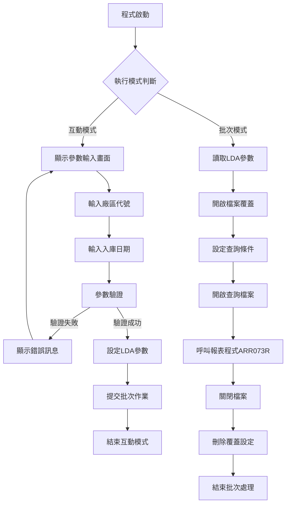
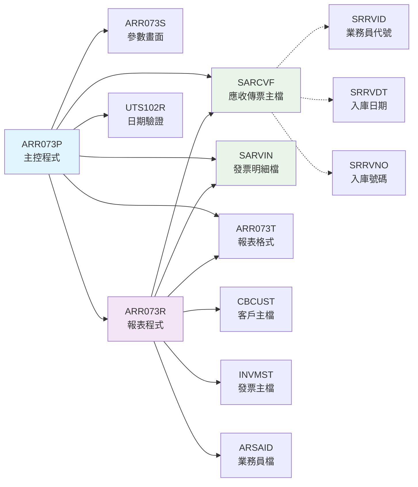
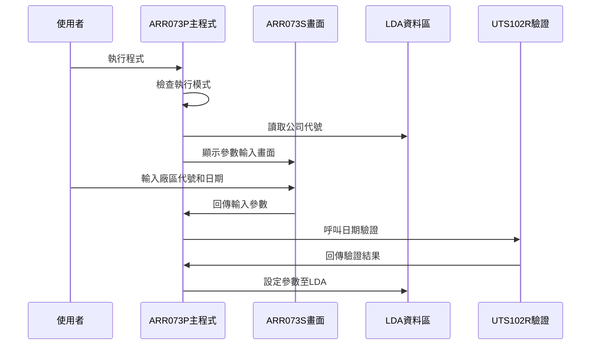
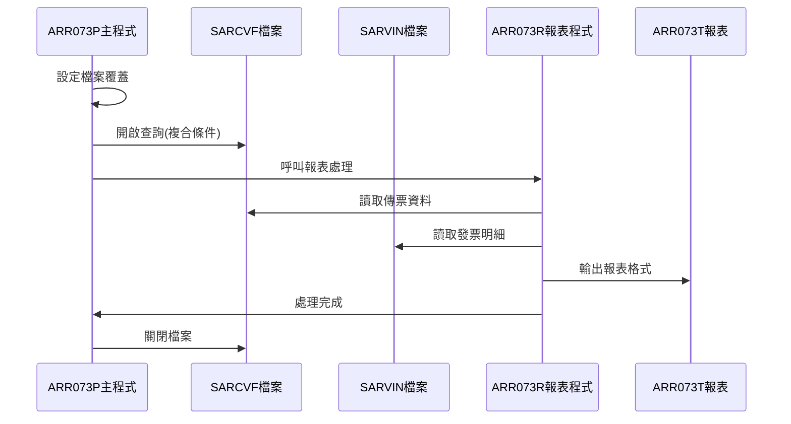
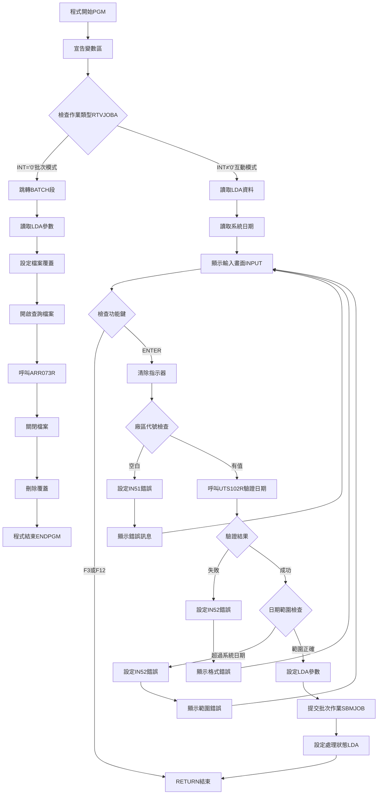

# ARR073P_P02 程式規格書

## 1. 基本資料

| 項目 | 內容 |
|------|------|
| **程式編號** | ARR073P |
| **程式名稱** | 定期入庫傳票總賬報表作業 |
| **程式類型** | CLP |
| **廠區** | P02 |
| **系統名稱** | 應收帳款系統 |
| **子系統** | 應收帳款報表 |
| **檔案位置** | 東鋼list/ARR073P_P02.txt |

## 2. 🎯 程式功能說明

### 主要功能描述
本程式為定期入庫相關傳票的總賬報表產生作業，具備互動式參數輸入和批次報表產生雙重功能。程式可根據使用者指定的廠區代號和入庫日期條件，產生包含入庫明細、發票資訊和金額統計的完整報表。

### 🎯 業務流程詳細說明

#### 完整業務流程圖


#### 業務流程關鍵階段說明
1. **模式識別階段**：檢查作業類型判斷執行互動或批次模式
2. **參數輸入階段**：透過畫面收集廠區代號和入庫日期條件
3. **資料驗證階段**：驗證日期格式和範圍的正確性
4. **檔案準備階段**：設定報表檔案和資料檔案的覆蓋關係
5. **查詢設定階段**：建立複合條件的檔案查詢機制
6. **報表產生階段**：呼叫RPG程式進行報表資料處理和輸出

#### 多層次驗證機制
- **廠區代號驗證**：限制輸入值為P、M、T、H、K等有效廠區
- **日期格式驗證**：呼叫UTS102R程式進行日期格式和有效性檢查
- **日期範圍驗證**：確保輸入日期不超過系統當前日期
- **必填欄位檢查**：確保廠區代號不得為空值

#### 智能處理邏輯
- **自動模式切換**：根據作業類型自動選擇互動或批次處理流程
- **參數傳遞機制**：使用LDA區域資料區進行參數的跨程式傳遞
- **動態查詢建構**：根據輸入條件動態建立檔案查詢邏輯
- **報表格式控制**：設定固定頁面寬度198字元和15CPI字體

#### 資料一致性確保機制
- **檔案共享控制**：SARCVF檔案設定SHARE(*YES)確保多使用者存取
- **查詢條件精確性**：使用複合條件確保資料篩選的準確性
- **檔案關閉順序**：按正確順序關閉檔案防止資料鎖定問題

## 3. 🎯 檔案架構與關聯圖

### 使用檔案清單
| 檔案名稱 | 檔案類型 | 用途說明 | 存取方式 |
|----------|----------|----------|----------|
| ARR073S | DSPF | 參數輸入畫面檔案 | 螢幕格式定義 |
| SARCVF | 實體檔案 | 應收傳票主檔 | 查詢讀取 |
| SARVIN | 實體檔案 | 應收發票明細檔 | 查詢讀取 |
| ARR073T | PRTF | 報表格式檔案 | 列印輸出 |
| ARR073R | RPG程式 | 報表處理程式 | 程式呼叫 |
| UTS102R | RPG程式 | 日期驗證程式 | 程式呼叫 |

### 🎯 檔案關聯詳細視覺化圖表


### 🎯 資料流向詳細說明

#### 環境準備階段的資料流向


#### 業務處理階段的資料流向


#### 環境清理階段的資料流向
- **檔案關閉序列**：SARCVF查詢關閉 → 所有檔案覆蓋刪除 → 程式結束
- **資源釋放流程**：報表輸出完成 → 記憶體清理 → 檔案控制釋放
- **狀態恢復機制**：覆蓋設定移除 → 系統預設值恢復 → 環境初始化

## 4. 🎯 檔案欄位規格說明

### 主要資料結構

#### SARCVF檔案關鍵欄位
| 欄位名稱 | 資料型態 | 長度 | 說明 |
|----------|----------|------|------|
| SRRVID | CHAR | 2 | 業務員代號 |
| SRRVDT | DECIMAL | 8 | 入庫日期 |
| SRRVNO | CHAR | 6 | 入庫號碼 |
| SRFL01 | CHAR | 1 | 處理旗標1 |
| SRFL02 | CHAR | 1 | 處理旗標2 |
| SRCUNO | CHAR | 6 | 客戶編號 |
| SRRAMT | DECIMAL | 11 | 入庫金額 |

#### 程式變數結構

##### 🔍 重點欄位切割技術詳解
程式中使用標準的CLP變數宣告，無複雜的欄位切割結構：

```
&S#RVDP (1字元)：[X]                     廠區代號
                  ↓
位置1:           [X]                     廠區識別碼

&S#RVDT (8字元)：[XXXXXXXX]              入庫日期
                  ↓
位置1-8:         [XXXXXXXX]              YYYYMMDD格式日期

&W#UDATE (8字元)：[XXXXXXXX]             系統日期
                   ↓
位置1-8:          [XXXXXXXX]             當前系統日期
```

##### 切割邏輯詳細說明
本程式採用簡單的變數定義方式，無複雜的資料結構切割：
- **廠區代號**：單一字元變數，直接對應廠區識別
- **日期欄位**：8位數字格式，遵循YYYYMMDD標準
- **訊息欄位**：固定70字元長度，用於錯誤訊息顯示

##### 實際數據範例說明
```
廠區代號範例：
- P：台灣廠區
- M：馬來西亞廠區  
- T：泰國廠區
- H：河北廠區
- K：崑山廠區

日期格式範例：
- 輸入：20231225
- 顯示：2023/12/25
- 驗證：不可超過系統當前日期
```

### 🎯 欄位挪用詳細分析

#### 挪用情況對比表
| 原始定義 | 實際使用方式 | 挪用說明 |
|----------|-------------|----------|
| &P#PDAT | 日期傳遞參數 | 傳遞給UTS102R進行驗證 |
| &P#MODE | 驗證模式參數 | 固定設為'1'表示標準驗證 |
| &P#MTL | 日期文字描述 | 接收UTS102R回傳的日期說明 |
| &P#LEAP | 閏年旗標 | 接收UTS102R回傳的閏年判斷 |
| &W#FLAG | 驗證結果旗標 | 接收UTS102R回傳的驗證狀態 |

#### 挪用原因深度分析
- **標準化介面需求**：配合UTS102R程式的參數介面規範
- **驗證功能整合**：統一使用企業標準的日期驗證機制
- **錯誤處理統一**：透過旗標變數實現統一的錯誤處理流程

#### 挪用影響評估
- **維護複雜度**：需要瞭解UTS102R程式的參數規範
- **程式耦合度**：與日期驗證程式存在介面相依性
- **錯誤追蹤**：錯誤來源可能涉及多個程式模組

### 重要變數定義表
| 變數名稱 | 型態 | 長度 | 用途說明 |
|----------|------|------|----------|
| &INT | CHAR | 1 | 作業類型識別 |
| &OUTQ | CHAR | 10 | 輸出佇列名稱 |
| &W#FLAG | CHAR | 1 | 驗證結果旗標 |
| &W#DATE | DEC | 8 | 數值型日期 |
| &W#UDATE | CHAR | 8 | 字元型系統日期 |
| &W#RVDT | CHAR | 8 | 入庫日期字串 |
| &S#RVDP | CHAR | 1 | 廠區代號 |
| &S#RVDT | DEC | 8 | 入庫日期數值 |
| &S#COMP | CHAR | 35 | 公司名稱 |
| &S#DEVI | CHAR | 10 | 裝置代號 |
| &S#MSG1 | CHAR | 70 | 錯誤訊息內容 |

## 5. 🎯 輸出/入螢幕布局

### 螢幕布局完整視覺化

#### AR073F1 - 參數輸入畫面
```
+----------------------------------------------------------+
|2023/12/25    東鋼鋼鐵股份有限公司              ARR073S |
|10:30:25         應收帳款定期入庫報表作業            P02  |
+----------------------------------------------------------+
|                                                          |
|                                                          |
|                                                          |
|                                                          |
|                                                          |
|        請輸入您要查詢的條件:                             |
|                                                          |
|           1.廠區代號: [P] (P:台灣 M:馬來 T:泰國          |
|                            H:河北 K:崑山)               |
|                                                          |
|           2.入庫日期: [2023/12/25]                      |
|                                                          |
|                                                          |
|                                                          |
|           注意：程式將依您所輸入的查詢條件列印定期入庫    |
|                 總帳相關的應收帳款報表。                |
|                                                          |
|                                                          |
|                                                          |
|                                                          |
|                                                          |
|F3:離開     F12:回到主選單     ENTER:執行                |
| [錯誤訊息顯示區]                                        |
+----------------------------------------------------------+
```

### 🎯 畫面欄位詳細說明
| 欄位名稱 | 欄位類型 | 長度 | 輸入格式 | 驗證規則 | 說明 |
|----------|----------|------|----------|----------|------|
| S#RVDP | 輸入欄位 | 1 | 單一字元 | VALUES('P','M','T','H','K') | 廠區代號選擇 |
| S#RVDT | 輸入欄位 | 8 | YYYY/MM/DD | 日期格式驗證 | 入庫日期輸入 |
| S#COMP | 顯示欄位 | 35 | 唯讀 | - | 公司名稱顯示 |
| S#DEVI | 顯示欄位 | 10 | 唯讀 | - | 裝置代號顯示 |
| S#MSG1 | 訊息欄位 | 70 | 系統控制 | - | 錯誤訊息顯示 |

### 🎯 畫面控制邏輯
- **指示器IN51**：控制廠區代號欄位的錯誤屬性顯示
- **指示器IN52**：控制入庫日期欄位的錯誤屬性顯示
- **錯誤屬性**：使用DSPATR(PC RI)顯示受保護且反向顯示
- **功能鍵控制**：CA03和CA12分別對應F3和F12功能鍵

### 功能鍵詳細定義
| 功能鍵 | 處理邏輯 | 系統行為 | 程式控制 |
|--------|----------|----------|----------|
| **F3** | 離開程式 | 結束程式執行 | 設定IN03='1'並RETURN |
| **F12** | 回到主選單 | 返回上層選單 | 設定IN12='1'並RETURN |
| **ENTER** | 執行處理 | 進行參數驗證和批次提交 | 執行驗證邏輯 |

### 操作流程
1. **畫面初始顯示**：載入公司名稱和裝置代號
2. **參數輸入階段**：使用者輸入廠區代號和日期
3. **驗證處理階段**：進行欄位驗證和錯誤提示
4. **批次提交階段**：驗證通過後提交批次作業
5. **結果回應階段**：顯示處理狀態訊息

## 6. 🎯 處理流程程序說明

### 🎯 主程序邏輯深度分析

#### 程式執行流程圖


#### 🎯 詳細處理步驟逐一分析

##### 步驟1：環境初始化處理
```
1. 程式變數宣告：建立所有必要的工作變數
2. 畫面檔案宣告：連結ARR073S參數輸入畫面
3. 作業屬性取得：呼叫RTVJOBA取得執行模式
4. 模式判斷：根據TYPE值決定互動或批次流程
```

##### 步驟2：互動模式參數收集
```
1. LDA資料讀取：從位置951讀取35字元公司代號
2. 裝置資訊讀取：從位置1011讀取10字元裝置代號
3. 系統日期取得：呼叫RTVJOBA取得CYMDDATE
4. 畫面初始化：設定畫面顯示的基本資訊
5. 畫面顯示：呼叫SNDRCVF顯示AR073F1格式
```

##### 步驟3：參數驗證處理邏輯
```
1. 功能鍵檢查：檢查IN03(F3)和IN12(F12)狀態
2. 指示器重置：將IN51和IN52設為'0'初始狀態
3. 廠區代號驗證：檢查S#RVDP是否為空白
4. 日期格式驗證：呼叫UTS102R程式進行日期檢查
5. 日期範圍驗證：比較輸入日期與系統日期
```

##### 步驟4：批次作業提交流程
```
1. LDA參數設定：將廠區代號設定至LDA位置1
2. 日期參數設定：將入庫日期設定至LDA位置2-9
3. 批次作業提交：使用SBMJOB提交ARR073P
4. 狀態訊息設定：更新LDA位置601的處理狀態
5. 程式結束：返回呼叫程式
```

##### 步驟5：批次模式報表處理
```
1. 參數讀取：從LDA讀取廠區代號和日期參數
2. 報表檔案設定：覆蓋ARR073T至ARLIB/ARR073T
3. 資料檔案設定：覆蓋SARCVF和SARVIN檔案
4. 查詢檔案開啟：建立複合條件的檔案查詢
5. 報表程式呼叫：執行ARR073R進行報表處理
6. 環境清理：關閉檔案並刪除覆蓋設定
```

### 🎯 子程序邏輯分析

#### UTS102R日期驗證程式呼叫
- **參數1 (&P#PDAT)**：傳入8字元日期字串
- **參數2 (&P#MODE)**：固定設為'1'表示標準驗證模式
- **參數3 (&P#MTL)**：回傳24字元日期文字描述
- **參數4 (&P#LEAP)**：回傳1字元閏年旗標
- **參數5 (&W#FLAG)**：回傳1字元驗證結果('0'=成功)

#### ARR073R報表處理程式呼叫
- **檔案準備**：透過OVRDBF設定檔案存取路徑
- **查詢條件**：設定SRFL02='Y'、SRFL01='Y'等複合條件
- **排序欄位**：按SRRVID、SRRVDT、SRRVNO順序處理
- **報表輸出**：產生包含統計資訊的完整報表

### 🎯 特殊邏輯處理

#### 複合查詢條件建構
```
QRYSLT條件邏輯：
1. SRFL02 *EQ "Y"：處理旗標2必須為Y
2. SRFL01 *EQ "Y"：處理旗標1必須為Y  
3. %SST(SRRVNO 1 1) *EQ 廠區代號：入庫號碼首字元符合廠區
4. SRRVDT *EQ 入庫日期：日期完全匹配
```

#### 檔案覆蓋技術實現
- **OVRPRTF設定**：報表檔案設定198字元頁寬、15CPI字體
- **OVRDBF設定**：資料檔案重新導向至DALIB目錄
- **SHARE控制**：SARCVF設定共享存取模式
- **HOLD設定**：報表輸出設定暫存，便於檢視

### 🎯 錯誤處理與資料完整性控制

#### 詳細錯誤處理邏輯
1. **輸入驗證錯誤**：設定對應指示器並顯示特定錯誤訊息
2. **日期驗證錯誤**：根據UTS102R回傳結果判斷錯誤類型
3. **範圍檢查錯誤**：防止輸入未來日期造成查詢異常
4. **檔案存取錯誤**：透過檔案覆蓋機制確保檔案可存取性

#### 資料完整性檢查機制
- **強制參數檢查**：廠區代號不可為空白值
- **日期一致性檢查**：確保日期格式符合系統要求
- **查詢條件完整性**：使用複合條件確保資料篩選正確性
- **檔案狀態檢查**：透過檔案覆蓋確保檔案存在和可存取

#### 關鍵業務規則實現
- **廠區權限控制**：限制廠區代號只能選擇有效值
- **時間邊界控制**：入庫日期不可超過系統當前日期
- **資料範圍控制**：只處理符合條件的傳票資料
- **報表輸出控制**：確保報表格式和內容的一致性

## 7. 🎯 數據操作與轉換分析

### 檔案操作詳解

#### READ操作邏輯
- **RTVDTAARA操作**：從LDA指定位置讀取公司代號和裝置代號
- **RTVJOBA操作**：讀取作業屬性和系統日期資訊
- **參數讀取**：批次模式下從LDA讀取廠區代號和日期參數

#### WRITE操作邏輯
- **CHGDTAARA操作**：將參數寫入LDA供批次程式使用
- **SBMJOB操作**：提交批次作業到指定的輸出佇列
- **狀態更新**：更新LDA中的處理狀態訊息

#### 檔案存取的條件和篩選
```
OPNQRYF條件設定：
- FILE(SARCVF)：指定查詢的主要檔案
- QRYSLT：設定四個並列的篩選條件
- KEYFLD：指定三層排序鍵值
- 動態條件：使用變數組合查詢字串
```

### 數據轉換邏輯

#### 日期格式轉換的詳細方式
```
輸入格式 → 系統格式轉換：
1. 取得系統日期：RTVJOBA CYMDDATE(&W#UDATE)
2. 格式調整：CHGVAR VALUE('0' *CAT &W#UDATE)
3. 顯示格式：使用EDTWRD('    /  /  ')格式化
4. 驗證轉換：傳遞給UTS102R進行格式檢查
```

#### 字串操作和格式化
- **字串連接**：使用*CAT操作符連接'0'與系統日期
- **子字串操作**：%SST(SRRVNO 1 1)取得入庫號碼首字元
- **變數賦值**：CHGVAR進行變數值的設定和轉換
- **訊息格式化**：錯誤訊息使用中文字串常數

### 計算邏輯分析

#### 數值格式轉換邏輯
- **字元轉數值**：日期由字元型轉為數值型進行比較
- **數值比較**：使用*GT運算符進行日期大小比較
- **條件設定**：根據比較結果設定指示器狀態

### 檢核機制詳解

#### 數據有效性檢查的具體邏輯
1. **非空檢查**：IF COND(&S#RVDP *EQ ' ')檢查廠區代號
2. **格式檢查**：呼叫UTS102R進行日期格式驗證
3. **範圍檢查**：IF COND(&S#RVDT *GT &W#DATE)比較日期範圍
4. **值域檢查**：VALUES('P','M','T','H','K')限制廠區選擇

#### 檢核失敗的處理方式
- **錯誤標記**：設定IN51或IN52指示器為'1'
- **錯誤訊息**：設定S#MSG1顯示具體錯誤內容
- **流程控制**：GOTO INPUT返回輸入畫面重新輸入
- **狀態重置**：清除指示器準備下次驗證

#### 檢核規則的業務依據
- **廠區權限**：基於組織架構限制可選擇的廠區
- **日期邏輯**：防止查詢未來日期的不存在資料
- **格式標準**：遵循企業統一的日期格式規範
- **資料完整性**：確保報表查詢的資料有效性

## 8. 🎯 錯誤處理程序說明

### 🎯 詳細錯誤代碼清冊

| 錯誤代碼 | 錯誤訊息 | 原因說明 | 處理方式 | 預防措施 |
|----------|---------|---------|---------|----------|
| **USER001** | 廠區代號不可空白 | 使用者未輸入廠區代號 | 1. 設定IN51='1'<br>2. 顯示錯誤屬性<br>3. 返回輸入畫面 | 畫面設計時提供廠區選擇清單 |
| **USER002** | 日期格式錯誤 | UTS102R驗證回傳&W#FLAG≠'0' | 1. 設定IN52='1'<br>2. 顯示格式錯誤訊息<br>3. 重新輸入日期 | 提供日期格式說明和範例 |
| **USER003** | 日期不可超過系統日期 | 輸入日期 > 系統當前日期 | 1. 設定IN52='1'<br>2. 顯示範圍錯誤訊息<br>3. 要求重新輸入 | 動態顯示系統當前日期參考 |
| **SYS001** | 檔案存取錯誤 | SARCVF或SARVIN檔案無法開啟 | 1. 檢查檔案存在性<br>2. 確認檔案權限<br>3. 重新執行程式 | 定期檢查檔案狀態和權限設定 |
| **FILE001** | 查詢條件錯誤 | OPNQRYF執行失敗 | 1. 檢查查詢條件語法<br>2. 確認檔案欄位存在<br>3. 重建查詢 | 驗證檔案結構與程式一致性 |

### 🎯 系統異常處理邏輯

#### 檔案操作失敗處理
- **檔案不存在**：透過檔案覆蓋OVRDBF確保檔案路徑正確
- **權限不足**：使用共享模式SHARE(*YES)避免檔案鎖定
- **檔案損壞**：程式結束時確保檔案正確關閉

#### 程式調用失敗處理
- **UTS102R呼叫失敗**：檢查回傳的&W#FLAG值判斷錯誤
- **ARR073R呼叫失敗**：確保檔案覆蓋設定正確
- **SBMJOB提交失敗**：檢查作業佇列狀態和權限

#### 資料完整性錯誤處理
- **LDA讀取失敗**：使用預設值或重新初始化
- **參數傳遞錯誤**：重新設定LDA參數值
- **日期轉換錯誤**：使用標準日期格式重新處理

#### 並發控制失敗處理
- **檔案鎖定衝突**：使用SHARE(*YES)模式開啟檔案
- **作業佇列滿載**：延遲提交或使用其他佇列
- **系統資源不足**：等待資源釋放後重試

## 9. 🎯 備註

### 🎯 特殊注意事項
- **批次作業管理**：程式會自動提交批次作業ARR073P執行報表產生
- **檔案覆蓋機制**：使用OVRPRTF和OVRDBF重新導向檔案存取路徑
- **LDA參數傳遞**：使用本地資料區在互動和批次模式間傳遞參數
- **日期驗證標準**：統一使用UTS102R程式進行日期格式和有效性驗證
- **報表格式控制**：固定使用198字元頁寬和15CPI字體設定
- **查詢條件精確性**：使用四個並列條件確保資料篩選的準確性
- **檔案共享設定**：SARCVF檔案設定共享模式支援多使用者並行存取
- **錯誤訊息國際化**：所有錯誤訊息使用繁體中文顯示
- **廠區代號標準化**：限制為P、M、T、H、K五個有效廠區選擇
- **報表輸出管理**：設定HOLD(*YES)暫存報表便於檢視和管理 