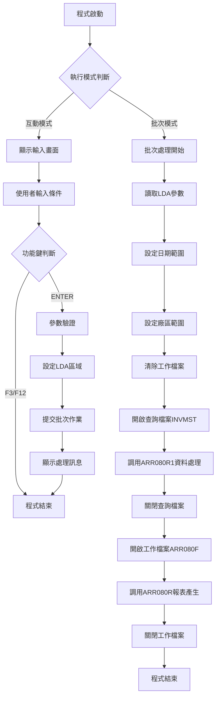
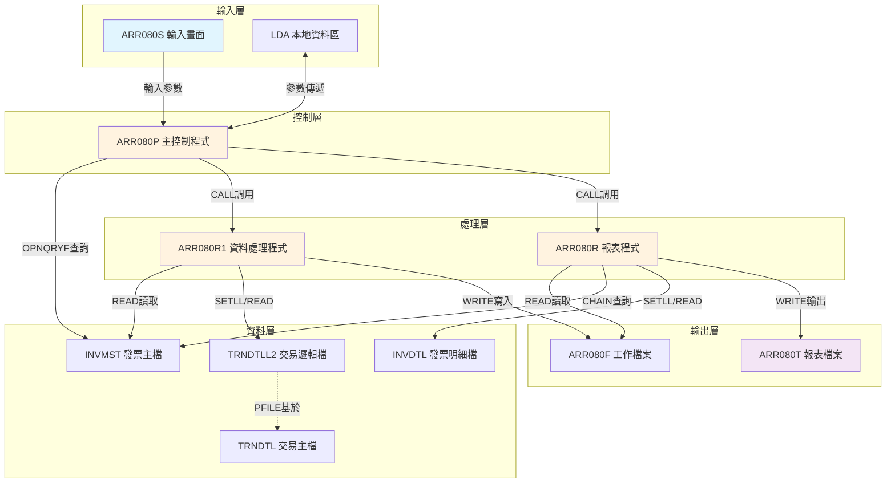
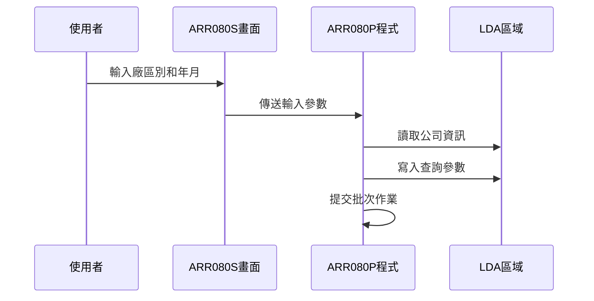
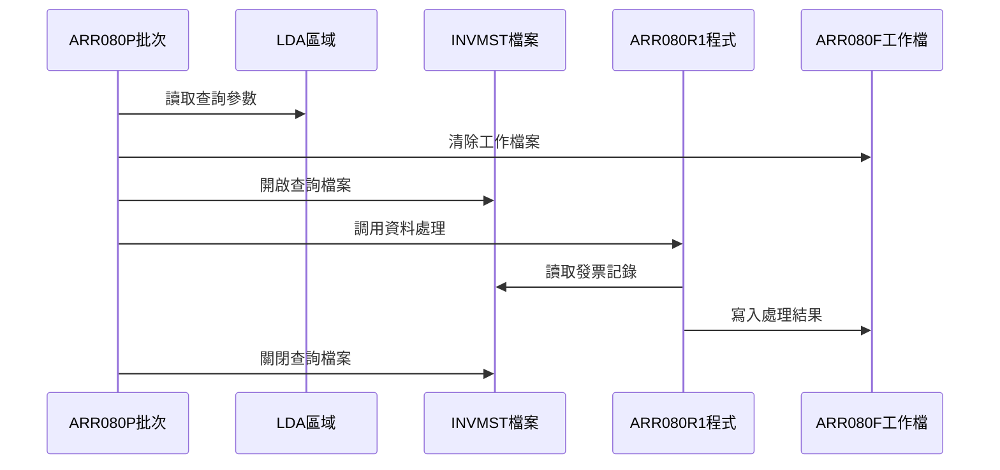
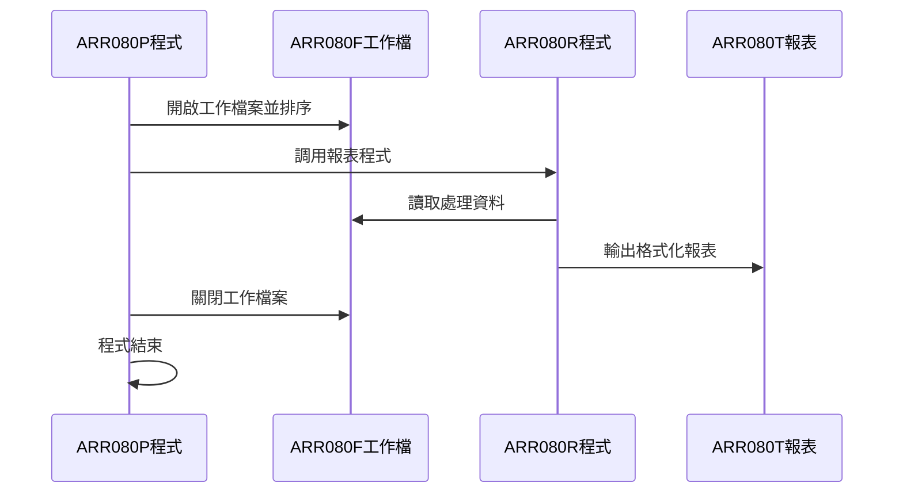
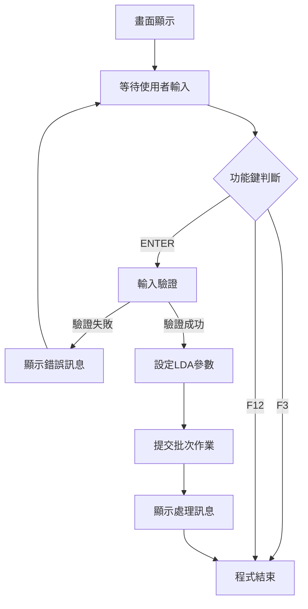
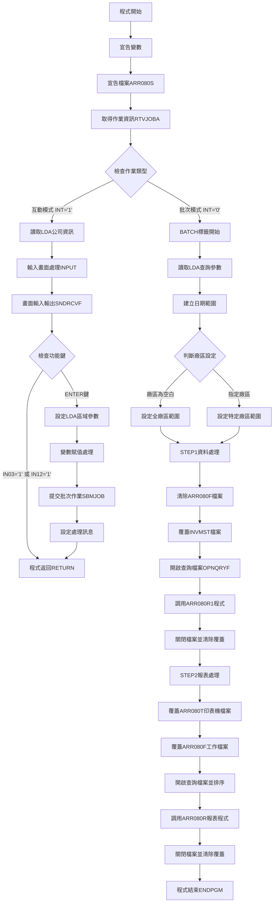
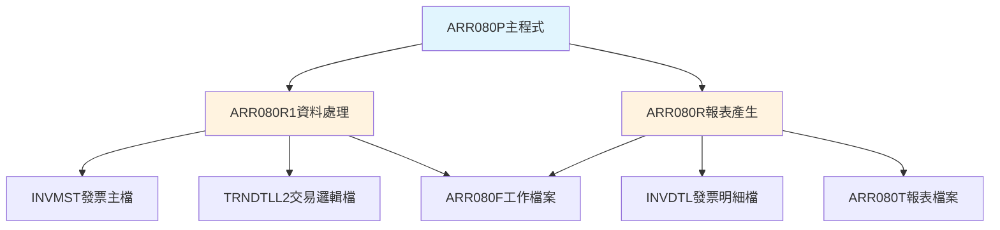

# ARR080P_H05 程式規格書

## 1. 基本資料

| 項目 | 內容 |
|------|------|
| **程式編號** | ARR080P |
| **程式名稱** | 發票與訂單對照分析表作業 |
| **程式類型** | CLP |
| **廠區** | H05 |
| **系統名稱** | 應收帳款系統 |
| **子系統** | 報表處理 |
| **檔案位置** | H05CLSRC_THSRC/ARR080P.txt |

## 2. 🎯 程式功能說明

### 主要功能描述
ARR080P程式為發票與訂單對照分析表作業的主控制程式，負責協調整個報表產生流程。程式提供互動式輸入畫面供使用者指定查詢條件，然後自動執行批次處理產生發票與訂單對照分析報表。

### 🎯 業務流程詳細說明

#### 完整業務流程圖


#### 業務流程關鍵階段說明

**階段一：模式判斷與初始化**
- 程式啟動時檢查執行類型（互動或批次）
- 從LDA區域讀取公司名稱和設備編號
- 根據執行模式進入不同處理流程

**階段二：互動模式處理**
- 顯示ARR080S輸入畫面
- 接收使用者輸入的廠區別和年月參數
- 處理功能鍵操作（F3結束、F12取消、ENTER確認）
- 將參數寫入LDA區域
- 提交批次作業ARR080P執行實際處理

**階段三：批次模式資料處理**
- 從LDA讀取查詢條件
- 建立日期範圍（年月01日到年月31日）
- 設定廠區查詢範圍
- 清除ARR080F工作檔案
- 開啟INVMST發票主檔進行查詢

**階段四：資料篩選與處理**
- 使用OPNQRYF指令篩選符合條件的發票記錄
- 排除特定發票編號（DX04489346等）
- 排除作廢記錄（INDECD='D'）
- 調用ARR080R1程式進行資料轉換

**階段五：報表產生**
- 開啟ARR080F工作檔案並排序
- 調用ARR080R程式產生格式化報表
- 輸出到ARR080T印表機檔案

#### 多層次驗證機制
- **參數完整性驗證**：檢查輸入的廠區別和年月格式
- **日期有效性驗證**：確保年月參數合理
- **檔案狀態驗證**：確認所需檔案可正常存取
- **資料範圍驗證**：確保查詢條件符合業務規則

#### 智能處理邏輯
- **自動日期擴展**：將年月自動擴展為完整日期範圍
- **廠區範圍自動設定**：空白廠區時自動設定為全廠區查詢
- **特殊編號自動排除**：內建排除特定測試發票編號
- **作業狀態自動追蹤**：透過LDA機制追蹤處理狀態

#### 資料一致性確保機制
- **LDA參數傳遞**：確保互動與批次模式參數一致
- **檔案鎖定控制**：使用SHARE(*YES)避免並發衝突
- **交易完整性**：確保資料處理與報表產生的一致性
- **錯誤恢復機制**：異常時自動清理資源

## 3. 🎯 檔案架構與關聯圖

### 使用檔案清單

| 檔案名稱 | 檔案類型 | 用途說明 | 存取方式 |
|----------|----------|----------|----------|
| ARR080S | 顯示檔案 | 輸入畫面定義 | 輸入輸出 |
| ARR080F | 工作檔案 | 暫存處理結果 | 輸出 |
| INVMST | 主檔案 | 發票主檔 | 查詢 |
| ARR080T | 印表機檔案 | 報表輸出 | 輸出 |
| TRNDTLL2 | 邏輯檔案 | 交易明細邏輯檔 | 查詢 |
| INVDTL | 主檔案 | 發票明細檔 | 查詢 |
| TRNDTL | 主檔案 | 交易明細主檔 | 查詢 |

### 🎯 檔案關聯詳細視覺化圖表



### 🎯 資料流向詳細說明

#### 環境準備階段的資料流向


#### 業務處理階段的資料流向


#### 環境清理階段的資料流向


## 4. 🎯 檔案欄位規格說明

### 主要資料結構

#### ARR080F工作檔案結構
```
記錄格式：RARR080F
用途：暫存發票與訂單對照資料
```

| 欄位名稱 | 型態 | 長度 | 小數 | 說明 |
|----------|------|------|------|------|
| A1CODE | CHAR | 4 | - | 傳票代號 |
| A1TXNO | CHAR | 8 | - | 傳票號碼 |
| A1ITEM | BINARY | 2 | 0 | 項目 |
| A1ACNT | CHAR | 1 | - | 科目記號 |
| A1DATE | PACKED | 8 | 0 | 傳票日期 |
| A1ACDT | PACKED | 8 | 0 | 入帳日期 |
| A1CUNO | CHAR | 6 | - | 客戶代號 |
| A1CUNM | CHAR | 10 | - | 客戶名稱 |
| A1ORNO | CHAR | 6 | - | 訂單編號 |
| A1IVNO | CHAR | 10 | - | 發票號碼 |
| A1RVID | CHAR | 2 | - | 收款業務員 |
| A1SALE | CHAR | 2 | - | 銷售業務員 |
| A1PDNM | CHAR | 5 | - | 品名代號 |
| A1QTY | PACKED | 7 | 0 | 數量 |
| A1UPRC | PACKED | 5 | 3 | 單價 |
| A1AMT | PACKED | 11 | 0 | 金額 |
| A1TAX | PACKED | 11 | 0 | 稅額 |

#### ARR080S畫面檔案結構
```
記錄格式：AR080F1
用途：使用者輸入介面
```

| 欄位名稱 | 型態 | 長度 | 屬性 | 說明 |
|----------|------|------|------|------|
| S#COMP | CHAR | 35 | 輸出 | 公司名稱 |
| S#DEVI | CHAR | 10 | 輸出 | 設備編號 |
| S#AREA | CHAR | 1 | 輸入輸出 | 工廠別代號 |
| S#YYMM | PACKED | 6 | 輸入輸出 | 查詢年月 |
| S#MSG1 | CHAR | 70 | 輸出 | 訊息顯示 |

### 🔍 重點欄位切割技術詳解

#### TRNDTL檔案的傳票號碼切割分析

程式中對傳票號碼進行特殊切割處理：

```
D#TXNO (8字元)：[X|XXXXXXX]
                 ↓    ↓
D#TXN1 (1字元)： [X]         廠區代號（第1位元）
D#TXN2 (7字元)：   [XXXXXXX] 序號部分（第2-8位元）
```

**切割邏輯詳細說明**：
- D#TXNO為完整的傳票號碼（8位元）
- D#TXN1取第1個字元作為廠區識別
- D#TXN2取第2-8字元作為傳票序號
- 此切割用於廠區別判斷和資料篩選

#### 發票號碼切割分析

```
D#IVNO (10字元)：[XX|XXXXXXXX]
                  ↓      ↓
D#IVN1 (2字元)：  [XX]         發票類型（第1-2位元）
D#IVN2 (8字元)：    [XXXXXXXX] 發票序號（第3-10位元）
```

**切割邏輯詳細說明**：
- D#IVNO為完整的發票號碼（10位元）
- D#IVN1取前2個字元作為發票類型識別
- D#IVN2取第3-10字元作為發票序號
- 程式中有特殊處理：當D#IVN1='UX'且D#IVN2='28138534'時進行特殊處理

#### 實際數據範例說明

**傳票號碼切割範例**：
```
原始傳票號碼：H1234567
切割結果：
- D#TXN1 = 'H'（廠區代號）
- D#TXN2 = '1234567'（序號）
```

**發票號碼切割範例**：
```
原始發票號碼：UX28138534
切割結果：
- D#IVN1 = 'UX'（發票類型）
- D#IVN2 = '28138534'（發票序號）
```

### 🎯 欄位挪用詳細分析

#### 發票號碼欄位的特殊用途

**挪用情況對比表**：

| 欄位 | 原始定義 | 實際使用方式 | 挪用原因 |
|------|----------|-------------|----------|
| LINNO | 行號欄位 | 發票號碼暫存 | 資料轉換需要 |
| D#IVNO | 一般發票號碼 | 特殊編號檢查 | 測試資料排除 |

**挪用原因深度分析**：
- LINNO欄位被挪用為發票號碼的暫存區域
- 此設計允許在資料轉換過程中保持發票號碼的完整性
- 避免了額外的變數宣告，提高記憶體使用效率

**挪用方式詳細說明**：
- 使用MOVL指令將LINNO內容移至D#IVNO
- 透過DS重新定義實現欄位切割
- 在業務邏輯中根據切割結果進行條件判斷

**挪用影響評估**：
- 對系統維護影響較小，邏輯清晰
- 需要維護人員了解此特殊用法
- 修改時需要注意資料長度限制

### 重要變數定義表

| 變數名稱 | 型態 | 長度 | 用途說明 |
|----------|------|------|----------|
| &INT | CHAR | 1 | 執行類型識別（0=批次，1=互動）|
| &OUTQ | CHAR | 10 | 輸出佇列名稱 |
| &USER | CHAR | 10 | 使用者名稱 |
| &W#YYMM | CHAR | 6 | 查詢年月 |
| &W#STRD | CHAR | 8 | 開始日期 |
| &W#ENDD | CHAR | 8 | 結束日期 |
| &W#ARES | CHAR | 1 | 廠區範圍起始值 |
| &W#AREE | CHAR | 1 | 廠區範圍結束值 |

## 5. 🎯 輸出/入螢幕布局

### 螢幕布局完整視覺化

```
+----------------------------------------------------------+
|  104/12/28         東鋼鐵股份有限公司           ARR080S   |
|   14:25:30         發票與訂單對照分析表作業      H05     |
+----------------------------------------------------------+
|                                                          |
|                                                          |
|                                                          |
|                                                          |
|                                                          |
|                                                          |
|                                                          |
|                    請輸入工廠別代號: [P]                 |
|                                     (P工廠, M鋼管, T鋼材, |
|                                      H總部, K總廠, 空白輸全部) |
|                                                          |
|                    請輸入查詢年月: [104/12]               |
|                                                          |
|                                                          |
|                                                          |
|                                                          |
|                                                          |
|                                                          |
|                                                          |
|                                                          |
|                                                          |
|     F3:結束                F12:返回               ENTER:執行     |
|                                                          |
+----------------------------------------------------------+
```

### 🎯 畫面欄位詳細說明

| 欄位名稱 | 位置 | 長度 | 型態 | 屬性 | 說明 |
|----------|------|------|------|------|------|
| 日期顯示 | 1,2 | 8 | DATE | 系統 | 自動顯示當前日期 |
| 公司名稱 | 1,23 | 35 | CHAR | 輸出 | 從LDA讀取顯示 |
| 程式名稱 | 1,70 | 8 | CHAR | 常數 | 固定顯示ARR080S |
| 時間顯示 | 2,2 | 8 | TIME | 系統 | 自動顯示當前時間 |
| 功能標題 | 2,29 | 20 | CHAR | 常數 | 發票與訂單對照分析表作業 |
| 設備編號 | 2,70 | 10 | CHAR | 輸出 | 從LDA讀取顯示 |
| S#AREA | 8,40 | 1 | CHAR | 輸入 | 工廠別代號輸入欄位 |
| S#YYMM | 11,40 | 6 | NUMERIC | 輸入 | 查詢年月輸入欄位 |
| S#MSG1 | 24,2 | 70 | CHAR | 輸出 | 訊息顯示區域 |

### 🎯 畫面控制邏輯

#### 輸入欄位驗證規則
- **S#AREA欄位**：限制輸入值為'P'、'M'、'T'、'H'、'K'或空白
- **S#YYMM欄位**：必須為有效的年月格式（YYMM）
- **必填檢查**：S#YYMM為必填欄位

#### 指示器控制機制
- **IN03指示器**：F3功能鍵按下時設定
- **IN12指示器**：F12功能鍵按下時設定
- **程式邏輯**：任一指示器為'1'時結束程式

#### 欄位顯示屬性
- **反向顯示**：功能標題使用DSPATR(RI)
- **高亮顯示**：錯誤訊息使用DSPATR(HI)
- **編輯格式**：日期使用EDTCDE(Y)，年月使用EDTCDE(4)

### 功能鍵詳細定義

| 功能鍵 | 功能說明 | 處理邏輯 | 系統行為 |
|--------|----------|----------|----------|
| F3 | 結束程式 | 設定IN03='1' | 直接返回上層程式 |
| F12 | 返回上層 | 設定IN12='1' | 返回呼叫程式 |
| ENTER | 執行處理 | 驗證輸入並執行 | 提交批次作業 |

### 操作流程



## 6. 🎯 處理流程程序說明

### 🎯 主程序邏輯深度分析

#### 程式執行流程圖



#### 🎯 詳細處理步驟逐一分析

**步驟1：程式初始化處理**
```
19: PGM                     - 程式開始
20-27: DCL變數宣告          - 宣告所有工作變數
29: DCLF FILE(ARR080S)      - 宣告畫面檔案
31: RTVJOBA                 - 取得作業環境資訊
```

**步驟2：執行模式判斷**
```
32: IF COND(&INT *EQ '0')   - 檢查是否為批次模式
    THEN(GOTO BATCH)        - 批次模式跳轉至BATCH標籤
```

**步驟3：互動模式處理（35-55行）**
```
35-37: RTVDTAARA            - 從LDA讀取公司資訊和設備資訊
38: INPUT標籤               - 輸入處理開始點
39: SNDRCVF                 - 顯示畫面並接收輸入
40-41: 功能鍵檢查           - 檢查F3或F12是否按下
43-45: LDA參數設定          - 將輸入參數寫入LDA
47-48: 批次作業提交         - 提交ARR080P批次執行
52-53: 處理訊息設定         - 設定作業已提交訊息
```

**步驟4：批次模式資料準備（57-71行）**
```
58-59: RTVDTAARA            - 從LDA讀取查詢參數
61-62: 日期範圍建立         - 組合完整日期範圍
64-71: 廠區範圍設定         - 根據輸入設定查詢範圍
```

**步驟5：資料處理階段（73-93行）**
```
74: CLRPFM ARR080F          - 清除工作檔案
75: OVRDBF INVMST           - 覆蓋發票主檔
76-89: OPNQRYF              - 開啟查詢檔案並設定篩選條件
91: CALL ARR080R1           - 調用資料處理程式
92-93: 檔案關閉處理         - 關閉檔案並清除覆蓋
```

**步驟6：報表產生階段（95-103行）**
```
97: OVRPRTF ARR080T         - 覆蓋報表檔案並設定HOLD
98: OVRDBF ARR080F          - 覆蓋工作檔案
99-100: OPNQRYF排序         - 開啟工作檔案並按鍵值排序
101: CALL ARR080R           - 調用報表產生程式
102-103: 檔案清理           - 關閉檔案並清除所有覆蓋
```

#### 業務邏輯深度解析

**查詢條件建立邏輯**：
- 日期範圍：使用字串串接建立YYYYMMDD格式
- 廠區範圍：空白時查詢全部，否則查詢特定廠區
- 發票過濾：排除特定測試發票編號和作廢記錄

**特殊發票編號排除邏輯**：
```
(INNO *NE "DX04489346") *AND
(INNO *NE "DX04489347") *AND  
(INNO *NE "DX04489350") *AND
(INNO *NE "DX04489354") *AND
(INNO *NE "DX04489353") *AND
(INNO *NE "DX04489338") *AND
(INDECD *NE "D")
```

#### 條件判斷詳細說明

**作業類型判斷**：
- `&INT *EQ '0'`：批次模式，直接執行資料處理
- `&INT *NE '0'`：互動模式，顯示輸入畫面

**功能鍵判斷**：
- `&IN03 *EQ '1'`：F3結束鍵按下
- `&IN12 *EQ '1'`：F12取消鍵按下
- 任一條件成立即結束程式

**廠區範圍判斷**：
- `&S#AREA *EQ ' '`：空白時設定全廠區查詢範圍
- 否則設定特定廠區的查詢範圍

#### 變數使用和數據流向

**LDA區域使用追蹤**：
- 位置951-985：公司名稱（35字元）
- 位置1011-1020：設備編號（10字元）
- 位置1021：廠區別（1字元）
- 位置1-1：廠區參數（1字元）
- 位置2-7：年月參數（6字元）
- 位置601-670：處理訊息（70字元）

**重要變數流向**：
- `&S#AREA` → `&W#ARES`/`&W#AREE`：廠區範圍設定
- `&S#YYMM` → `&W#YYMM` → `&W#STRD`/`&W#ENDD`：日期範圍擴展

### 🎯 子程序邏輯分析

#### ARR080R1資料處理程式功能
- **主要功能**：從INVMST和TRNDTLL2讀取資料並轉換格式
- **處理邏輯**：根據發票號碼關聯交易明細資料
- **輸出結果**：將處理結果寫入ARR080F工作檔案

**參數傳遞方式**：
- 透過LDA區域傳遞查詢條件
- 使用UDS（使用者資料空間）共享參數
- 檔案透過檔案描述符號共享

#### ARR080R報表程式功能
- **主要功能**：讀取ARR080F工作檔案產生格式化報表
- **處理邏輯**：進行資料分組、小計、總計計算
- **輸出結果**：格式化報表輸出至ARR080T

**參數傳遞方式**：
- 透過UDS共享報表參數
- 檔案直接透過檔案名稱存取
- 報表格式透過DDS定義控制

#### 子程序間的調用關係圖



### 🎯 特殊邏輯處理

#### 複雜查詢條件算法
**OPNQRYF查詢語法分解**：
```
QRYSLT('
    (INDT *GE "' || &W#STRD || '") *AND     -- 日期大於等於開始日期
    (INDT *LE "' || &W#ENDD || '") *AND     -- 日期小於等於結束日期  
    (INAREA *GE "' || &W#ARES || '") *AND   -- 廠區大於等於起始廠區
    (INAREA *LE "' || &W#AREE || '") *AND   -- 廠區小於等於結束廠區
    (INNO *NE "DX04489346") *AND            -- 排除測試發票1
    (INNO *NE "DX04489347") *AND            -- 排除測試發票2
    (INNO *NE "DX04489350") *AND            -- 排除測試發票3
    (INNO *NE "DX04489354") *AND            -- 排除測試發票4
    (INNO *NE "DX04489353") *AND            -- 排除測試發票5
    (INNO *NE "DX04489338") *AND            -- 排除測試發票6
    (INDECD *NE "D")')                      -- 排除作廢記錄
```

#### 特殊業務規則實現
**1999年5月修改標記處理**：
- 原訊息位置：LDA(801 70)
- 修改後位置：LDA(601 70)
- 目的：調整訊息顯示位置避免衝突

**日期範圍自動擴展邏輯**：
- 輸入：YYMM（4位年月）
- 處理：自動補齊為YYYYMM01和YYYYMM31
- 目的：建立完整的月份查詢範圍

#### 異常情況的處理邏輯

**檔案存取異常處理**：
- 使用SHARE(*YES)避免檔案鎖定衝突
- OPNQRYF失敗時程式會自然終止
- DLTOVR確保覆蓋設定正確清除

**批次作業提交失敗處理**：
- SBMJOB指令包含完整的作業描述
- 失敗時系統會自動回傳錯誤訊息
- 程式繼續執行並顯示相應狀態

### 🎯 錯誤處理與資料完整性控制

#### 詳細錯誤處理邏輯

**參數驗證錯誤處理**：
- 畫面欄位驗證透過DDS的VALUES關鍵字實現
- 年月格式驗證透過EDTCDE(4)自動處理
- 輸入錯誤時畫面會自動顯示錯誤訊息

**檔案操作錯誤處理**：
- CLRPFM失敗時會產生系統錯誤訊息
- OPNQRYF查詢語法錯誤會導致程式異常終止
- CALL指令的子程式不存在會產生執行時錯誤

#### 資料完整性檢查機制

**查詢條件完整性檢查**：
- 確保日期範圍邏輯正確（開始日期 ≤ 結束日期）
- 廠區範圍設定確保涵蓋所有可能值
- 排除條件確保測試資料不影響正式報表

**檔案狀態完整性檢查**：
- OVRDBF確保檔案正確覆蓋設定
- DLTOVR確保覆蓋狀態正確清除
- CLOF確保檔案正確關閉

#### 關鍵業務規則實現

**廠區別處理規則**：
- 空白廠區：查詢範圍設為' '到'9'（全部廠區）
- 指定廠區：查詢範圍設為指定廠區到指定廠區
- 確保查詢結果符合使用者預期

**作業模式轉換規則**：
- 互動模式負責參數輸入和驗證
- 批次模式負責實際資料處理
- 透過LDA區域確保參數正確傳遞

## 7. 🎯 數據操作與轉換分析

### 檔案操作詳解

#### READ/WRITE/UPDATE/DELETE的具體邏輯

**CLRPFM檔案清除操作**：
```
CLRPFM ARR080F
```
- **操作目的**：清除ARR080F工作檔案中的所有記錄
- **執行時機**：批次處理開始前
- **影響範圍**：僅影響ARR080F檔案，不影響其他檔案
- **錯誤處理**：檔案不存在或被鎖定時會產生系統錯誤

**OPNQRYF查詢檔案操作**：
```
OPNQRYF FILE(INVMST) OPTION(*ALL) QRYSLT(...) MAPFLD(...)
```
- **操作目的**：建立INVMST檔案的篩選檢視
- **檢索條件**：日期範圍、廠區範圍、排除特定編號
- **欄位對應**：MAPFLD將日期欄位轉換為字元格式
- **存取模式**：唯讀存取，不修改原始資料

**CALL程式調用操作**：
```
CALL PGM(ARR080R1)
CALL PGM(ARR080R)
```
- **ARR080R1調用**：執行資料讀取和轉換處理
- **ARR080R調用**：執行報表格式化和輸出處理
- **參數傳遞**：透過檔案共享和LDA區域傳遞參數
- **錯誤處理**：子程式異常會導致主程式終止

#### 檔案鎖定和併發處理

**SHARE(*YES)併發控制**：
```
OVRDBF FILE(INVMST) TOFILE(INVMST) SHARE(*YES)
OVRDBF FILE(ARR080F) TOFILE(ARR080F) SHARE(*YES)
```
- **併發策略**：允許多個作業同時存取檔案
- **鎖定機制**：唯讀存取不設定排它鎖定
- **效能考量**：減少檔案競爭提高系統併發能力
- **安全機制**：查詢作業不影響資料完整性

#### 檔案存取的條件和篩選

**複合查詢條件邏輯**：
- **時間範圍篩選**：`INDT *GE 起始日期 *AND INDT *LE 結束日期`
- **廠區範圍篩選**：`INAREA *GE 起始廠區 *AND INAREA *LE 結束廠區`
- **排除條件篩選**：多個`INNO *NE 特定編號`條件
- **狀態排除篩選**：`INDECD *NE 'D'`排除作廢記錄

**篩選邏輯執行順序**：
1. 首先執行日期範圍篩選（主要條件）
2. 其次執行廠區範圍篩選（次要條件）
3. 最後執行排除條件篩選（清理條件）
4. 所有條件使用AND邏輯連接

### 數據轉換邏輯

#### 數值格式轉換的詳細方式

**日期格式轉換**：
```
MAPFLD((INDT ININDT *CHAR 8))
```
- **轉換目的**：將數值型日期轉換為字元型
- **原始格式**：8位數值型（YYYYMMDD）
- **目標格式**：8字元型（YYYYMMDD）
- **用途**：便於字串比較和範圍查詢

**變數串接轉換**：
```
CHGVAR VAR(&W#STRD) VALUE(&W#YYMM || '01')
CHGVAR VAR(&W#ENDD) VALUE(&W#YYMM || '31')
```
- **轉換邏輯**：年月+固定日期字串串接
- **輸入格式**：6字元年月（YYYYMM）
- **輸出格式**：8字元完整日期（YYYYMMDD）
- **業務意義**：建立月份的完整日期範圍

#### 日期時間處理邏輯

**日期範圍擴展處理**：
- **輸入參數**：YYMM格式（6字元）
- **處理步驟**：
  1. 保持原始年月不變
  2. 串接'01'建立月份起始日期
  3. 串接'31'建立月份結束日期
- **結果用途**：作為OPNQRYF的查詢條件

**系統日期時間處理**：
- **DATE關鍵字**：畫面自動顯示當前系統日期
- **TIME關鍵字**：畫面自動顯示當前系統時間
- **編輯格式**：使用EDTCDE(Y)格式化日期顯示

#### 字串操作和格式化

**LDA區域字串操作**：
```
RTVDTAARA DTAARA(*LDA (951 35)) RTNVAR(&S#COMP)
CHGDTAARA DTAARA(*LDA (1 1)) VALUE(&S#AREA)
```
- **讀取操作**：從LDA指定位置讀取固定長度字串
- **寫入操作**：將變數值寫入LDA指定位置
- **位置管理**：使用位置偏移量精確控制資料位置

**訊息字串格式化**：
```
CHGDTAARA DTAARA(*LDA (601 70)) VALUE('發票與訂單對照分析表作業已送入排程佇列')
```
- **訊息內容**：中文訊息字串（70字元）
- **顯示位置**：LDA第601-670位置
- **用途**：向使用者顯示處理狀態訊息

### 計算邏輯分析

#### 所有數學運算的業務意義

**日期計算邏輯**：
- **月份範圍計算**：自動計算月份的第一天和最後一天
- **業務意義**：確保查詢涵蓋整個月份的所有交易
- **計算方式**：字串串接而非數學運算

**範圍設定計算**：
```
IF COND(&S#AREA *EQ ' ') THEN(DO)
    CHGVAR VAR(&W#ARES) VALUE(' ')
    CHGVAR VAR(&W#AREE) VALUE('9')
```
- **邏輯含義**：空白廠區時設定最大查詢範圍
- **計算結果**：' '（最小值）到'9'（最大值）
- **業務意義**：涵蓋所有可能的廠區代號

#### 公式推導和計算步驟

**廠區範圍公式**：
```
IF 廠區 = 空白 THEN
    查詢範圍 = [' ', '9']
ELSE  
    查詢範圍 = [廠區, 廠區]
END IF
```

**日期範圍公式**：
```
開始日期 = 年月 + '01'
結束日期 = 年月 + '31'
```

#### 精度處理和四捨五入規則

**字元串接精度**：
- **字元長度控制**：確保串接結果不超過目標變數長度
- **填充規則**：短字串自動右填空白
- **截斷規則**：長字串自動截斷多餘部分

**日期精度處理**：
- **最小精度**：日（YYYYMMDD格式）
- **範圍策略**：使用31日確保涵蓋所有月份
- **邊界處理**：系統自動處理月份邊界邏輯

### 檢核機制詳解

#### 數據有效性檢查的具體邏輯

**畫面輸入檢核**：
```
S#AREA VALUES('P' 'M' 'T' 'H' 'K' ' ')
S#YYMM EDTCDE(4)
```
- **廠區檢核**：限制輸入值必須為預定義選項
- **年月檢核**：使用編輯碼確保數值格式正確
- **檢核時機**：使用者輸入時即時檢核

**功能鍵檢核**：
```
IF COND(&IN03 *EQ '1' *OR &IN12 *EQ '1') THEN(RETURN)
```
- **檢核邏輯**：檢查結束條件指示器
- **檢核結果**：任一結束條件成立即終止處理
- **業務意義**：確保使用者可隨時中斷操作

#### 檢核失敗的處理方式

**畫面檢核失敗**：
- **DDS檢核**：自動顯示錯誤訊息並停留在錯誤欄位
- **游標定位**：自動將游標移至錯誤欄位
- **重新輸入**：使用者修正後可重新提交

**系統檢核失敗**：
- **檔案操作失敗**：系統自動產生錯誤訊息
- **程式調用失敗**：作業異常終止並記錄錯誤
- **查詢語法錯誤**：OPNQRYF失敗並顯示相關訊息

#### 檢核規則的業務依據

**廠區代號檢核依據**：
- **P工廠**：生產廠區代號
- **M鋼管**：鋼管生產線代號  
- **T鋼材**：鋼材生產線代號
- **H總部**：總部行政代號
- **K總廠**：總廠區代號
- **空白**：表示查詢全部廠區

**年月格式檢核依據**：
- **EDTCDE(4)**：確保為4位數值格式
- **業務範圍**：通常為當前年度及前後年度
- **邏輯檢核**：年份和月份必須在合理範圍內

## 8. 🎯 錯誤處理程序說明

### 🎯 詳細錯誤代碼清冊

| 錯誤代碼 | 錯誤訊息 | 原因說明 | 處理方式 | 預防措施 |
|----------|---------|---------|---------|----------|
| **SYS001** | 檔案ARR080F清除失敗 | 1. 檔案被其他程式鎖定<br>2. 檔案權限不足<br>3. 磁碟空間不足 | 1. 等待其他程式釋放檔案<br>2. 檢查使用者權限設定<br>3. 清理磁碟空間後重新執行 | 確保檔案存取權限正確設定 |
| **SYS002** | INVMST檔案開啟失敗 | 1. 檔案不存在<br>2. 檔案損壞<br>3. 系統資源不足 | 1. 確認檔案路徑正確<br>2. 使用檔案修復工具<br>3. 重新啟動系統後執行 | 定期備份重要檔案 |
| **SYS003** | OPNQRYF查詢語法錯誤 | 1. 日期格式不正確<br>2. 欄位名稱錯誤<br>3. 邏輯運算子使用錯誤 | 1. 檢查日期變數格式<br>2. 確認檔案欄位定義<br>3. 驗證查詢語法正確性 | 使用預定義的查詢模板 |
| **SYS004** | 子程式ARR080R1調用失敗 | 1. 程式物件不存在<br>2. 程式編譯錯誤<br>3. 程式庫路徑錯誤 | 1. 重新編譯子程式<br>2. 檢查程式庫清單<br>3. 確認程式物件存在 | 確保所有相關程式已正確編譯 |
| **SYS005** | 子程式ARR080R調用失敗 | 1. 報表程式不存在<br>2. 印表機檔案設定錯誤<br>3. 權限不足 | 1. 確認報表程式存在<br>2. 檢查印表機設定<br>3. 確認使用者列印權限 | 定期檢查印表機檔案設定 |
| **USER001** | 廠區代號輸入錯誤 | 1. 輸入無效的廠區代號<br>2. 輸入特殊字元 | 1. 重新輸入有效廠區代號<br>2. 參考畫面提示選項 | 提供下拉選單限制輸入選項 |
| **USER002** | 年月格式輸入錯誤 | 1. 年月格式不正確<br>2. 年份或月份超出範圍 | 1. 使用YYYYMM格式重新輸入<br>2. 確認年月在有效範圍內 | 使用日期選擇器輔助輸入 |
| **USER003** | 必填欄位未輸入 | 1. 年月欄位為空<br>2. 必要參數缺少 | 1. 輸入必填的年月資料<br>2. 檢查所有必填欄位 | 在欄位標籤標示必填提示 |
| **FILE001** | ARR080F工作檔案寫入失敗 | 1. 磁碟空間不足<br>2. 檔案權限問題<br>3. 記錄長度錯誤 | 1. 清理磁碟空間<br>2. 檢查檔案權限設定<br>3. 確認記錄格式正確 | 監控磁碟使用狀況 |
| **FILE002** | ARR080T報表檔案建立失敗 | 1. 印表機佇列滿載<br>2. 輸出裝置離線<br>3. 檔案命名衝突 | 1. 清理印表機佇列<br>2. 檢查輸出裝置狀態<br>3. 使用唯一檔案名稱 | 定期清理輸出佇列 |
| **FILE003** | TRNDTLL2邏輯檔案存取錯誤 | 1. 基礎檔案TRNDTL損壞<br>2. 索引檔案不一致<br>3. 檔案關聯錯誤 | 1. 重建邏輯檔案<br>2. 重新建立索引<br>3. 確認檔案關聯設定 | 定期維護檔案索引 |
| **NET001** | 批次作業提交失敗 | 1. 作業佇列滿載<br>2. 系統資源不足<br>3. 作業描述錯誤 | 1. 等待佇列空間釋放<br>2. 增加系統資源<br>3. 檢查ARJOBD作業描述 | 監控系統資源使用狀況 |
| **IN03='1'** | 使用者按下F3結束鍵 | 使用者主動結束程式執行 | 正常程式結束流程 | 提供確認對話框避免誤操作 |
| **IN12='1'** | 使用者按下F12取消鍵 | 使用者取消當前操作 | 返回上層程式或選單 | 提供操作說明避免誤解 |

### 🎯 系統異常處理邏輯

#### 檔案操作失敗處理

**CLRPFM清除檔案失敗**：
```
處理步驟：
1. 系統自動產生CPF訊息
2. 程式異常終止
3. 作業日誌記錄錯誤詳情
4. 通知系統管理員處理
```

**OPNQRYF查詢檔案失敗**：
```
處理步驟：
1. 檢查查詢語法正確性
2. 確認檔案存在並可存取
3. 驗證欄位名稱和型態
4. 重新格式化查詢條件
```

**OVRDBF檔案覆蓋失敗**：
```
處理步驟：
1. 確認目標檔案存在
2. 檢查檔案存取權限
3. 清除之前的覆蓋設定
4. 重新執行覆蓋指令
```

#### 程式調用失敗處理

**子程式不存在錯誤**：
```
錯誤識別：CPF0001 - 程式未找到
處理方式：
1. 檢查程式庫清單設定
2. 確認程式編譯狀態
3. 重新編譯缺少的程式
4. 更新程式庫路徑
```

**子程式執行異常**：
```
錯誤識別：程式內部錯誤
處理方式：  
1. 檢查子程式錯誤日誌
2. 確認傳遞參數正確性
3. 測試子程式獨立執行
4. 必要時重新編譯程式
```

#### 資料完整性錯誤處理

**LDA區域存取錯誤**：
```
錯誤症狀：參數傳遞異常
處理方式：
1. 重新設定LDA區域大小
2. 清除LDA區域內容
3. 確認參數位置對應
4. 重新執行程式
```

**檔案記錄格式錯誤**：
```
錯誤症狀：記錄長度不符
處理方式：
1. 檢查檔案DDS定義
2. 確認記錄格式一致性
3. 重新編譯檔案物件
4. 清除並重建檔案
```

#### 並發控制失敗處理

**檔案鎖定衝突**：
```
錯誤識別：檔案使用中
處理方式：
1. 使用SHARE(*YES)減少衝突
2. 等待其他程式釋放檔案
3. 檢查長時間鎖定的作業
4. 必要時強制結束衝突作業
```

**資源競爭處理**：
```
症狀：系統回應緩慢
處理方式：
1. 監控系統資源使用狀況
2. 調整作業優先權
3. 分散執行時間避免衝突
4. 增加系統資源配置
```

## 9. 🎯 備註

### 🎯 特殊注意事項

#### 程式執行環境要求
- **作業描述**：程式使用ARJOBD作業描述，需確保該作業描述存在且設定正確
- **程式庫清單**：所有相關程式（ARR080R1、ARR080R）必須在程式庫清單中
- **檔案權限**：執行使用者需具備所有相關檔案的讀寫權限

#### LDA區域使用規範
- **區域大小**：LDA至少需要1071個字元空間
- **參數位置**：不同參數使用固定位置偏移，修改時需保持一致性
- **並發考量**：同一使用者的多個ARR080P程式會共享LDA區域

#### 查詢效能相關說明
- **日期索引**：INVMST檔案應在INDT欄位建立索引以提升查詢效能
- **廠區索引**：INAREA欄位的索引有助於加速廠區篩選
- **排除條件**：大量排除條件可能影響查詢效能，建議定期清理測試資料

#### 報表輸出設定
- **HOLD設定**：報表使用HOLD(*YES)設定，需手動釋放或列印
- **使用者資料**：報表檔案包含'發票對照'使用者資料標識
- **輸出裝置**：確認輸出佇列設定正確且裝置可用

#### 批次作業特性
- **非同步執行**：批次作業提交後立即返回，實際處理在背景執行
- **作業監控**：可透過WRKSBMJOB指令監控批次作業執行狀態
- **結果查詢**：批次作業完成後需查詢輸出佇列獲取結果

#### 資料一致性要求
- **交易完整性**：確保INVMST與TRNDTL資料的時間一致性
- **廠區資料同步**：各廠區的資料更新需保持同步
- **測試資料隔離**：正式環境應避免包含測試用發票編號

#### 系統整合注意事項
- **檔案共享**：程式執行期間相關檔案可被其他程式讀取
- **記憶體使用**：查詢大量資料時注意系統記憶體使用狀況
- **並發限制**：同時執行多個實例時注意系統資源分配

--- 