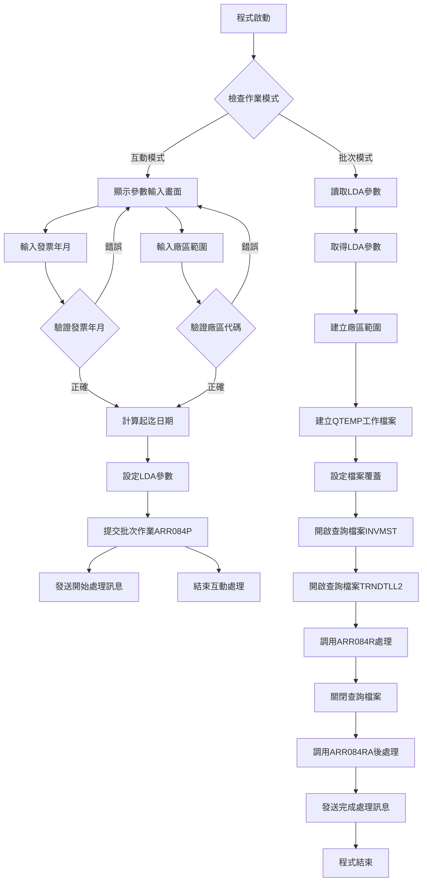
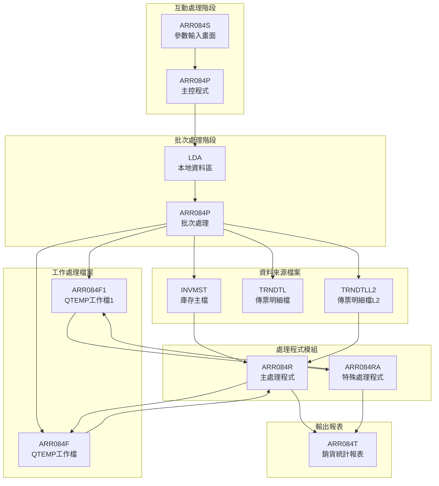
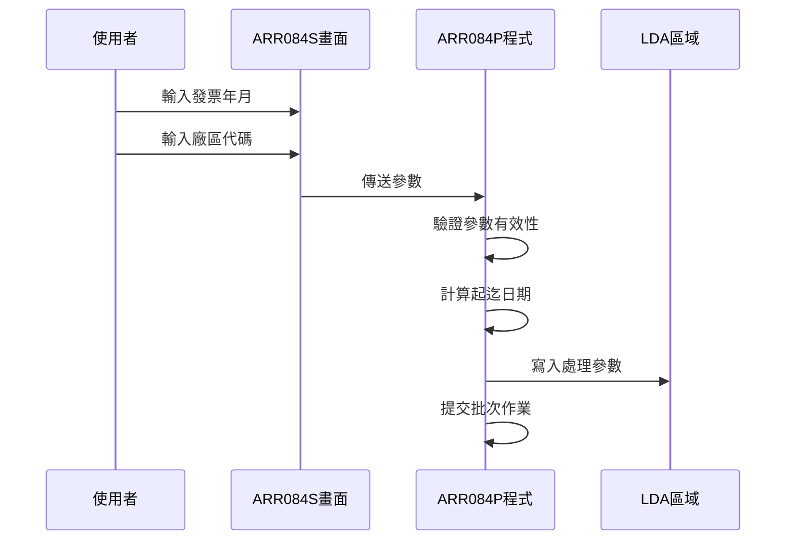
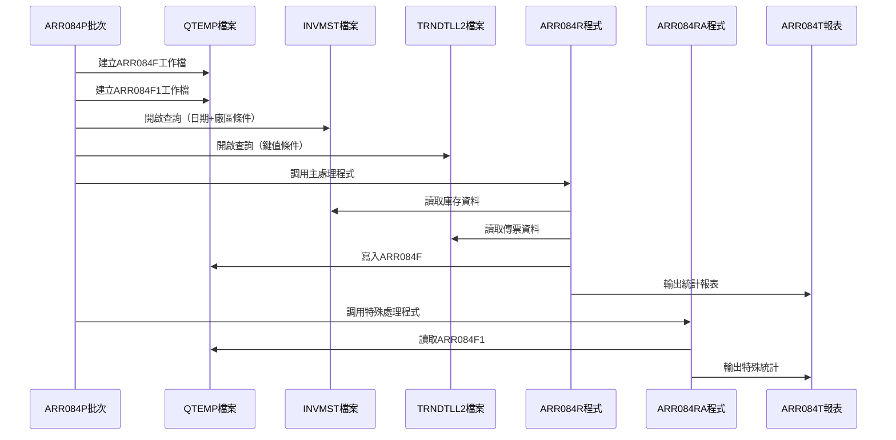
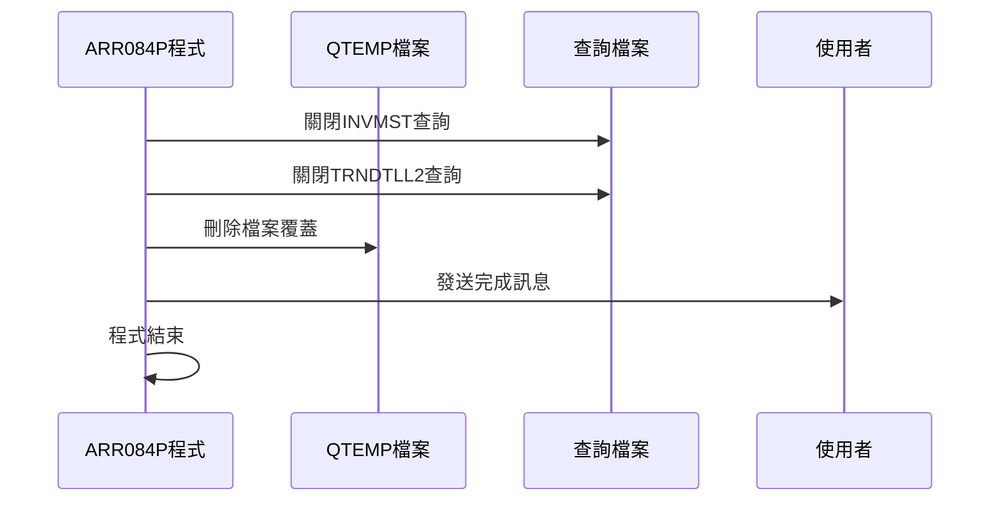
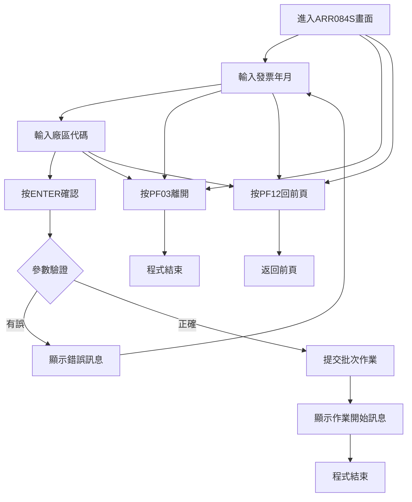
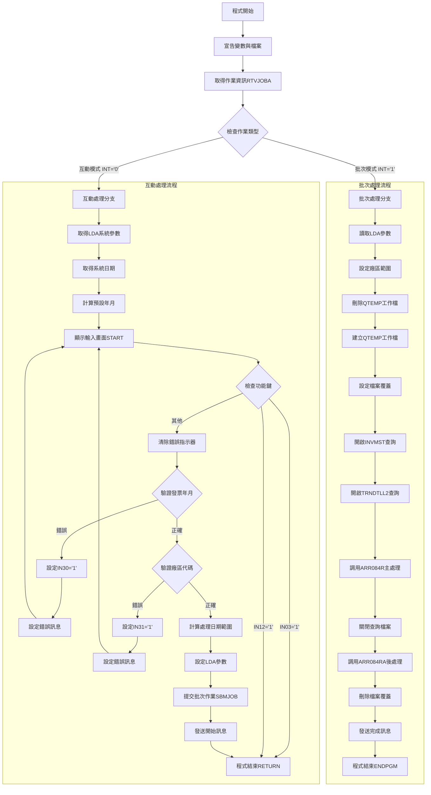
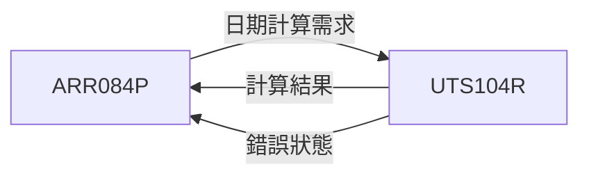

# ARR084P_P02 程式規格書

## 1. 基本資料

| 項目 | 內容 |
|------|------|
| **程式編號** | ARR084P |
| **程式名稱** | 銷貨與出貨對照統計報表作業 |
| **程式類型** | CLP |
| **廠區** | P02 |
| **系統名稱** | 應收帳款系統 |
| **子系統** | 應收帳款報表模組 |
| **檔案位置** | 東鋼list/ARR084P_P02.txt |

## 2. 🎯 程式功能說明

### 主要功能描述
ARR084P程式是銷貨與出貨對照統計報表產生作業，負責統計特定月份內的銷貨發票資料與出貨憑證的對照分析。程式會產生詳細的銷貨統計報表，包含客戶資料、發票資料、出貨憑證及相關金額統計。

### 🎯 業務流程詳細說明

#### 完整業務流程圖


#### 業務流程關鍵階段說明

**第一階段：參數設定與驗證**
- 接收使用者輸入的發票年月（S#YYMM）
- 驗證發票年月不可為0
- 接收廠區代碼（S#AREA），支援P、T、H、M、K、U、N等廠區
- 驗證廠區代碼的有效性

**第二階段：日期計算處理**
- 將輸入年月轉換為完整日期格式
- 調用UTS104R程式計算月份的起始和結束日期
- 建立查詢用的日期範圍（DATES到DATEE）

**第三階段：批次作業提交**
- 將參數寫入LDA（Local Data Area）
- 提交批次作業到ARJOBD作業描述
- 發送作業開始處理的通知訊息

**第四階段：資料查詢與處理**
- 建立QTEMP暫存檔案ARR084F和ARR084F1
- 設定INVMST庫存主檔的查詢條件
- 設定TRNDTLL2傳票明細檔的查詢條件
- 調用ARR084R程式進行主要資料處理

**第五階段：報表產生與輸出**
- 調用ARR084RA程式進行特殊處理
- 產生ARR084T報表
- 發送作業完成的通知訊息

#### 智能處理邏輯
- 自動判斷互動與批次執行模式
- 動態建立廠區查詢範圍
- 自動計算月份起迄日期
- 智能處理QTEMP檔案建立與清理

#### 資料一致性確保機制
- 參數驗證確保資料正確性
- 檔案覆蓋確保暫存檔案狀態一致
- 查詢條件嚴格控制資料範圍
- 錯誤監控確保處理完整性

## 3. 🎯 檔案架構與關聯圖

### 使用檔案清單

| 檔案名稱 | 檔案類型 | 用途說明 | 存取方式 |
|----------|----------|----------|----------|
| ARR084S | 螢幕檔案 | 參數輸入畫面 | 輸入輸出 |
| INVMST | 資料檔案 | 庫存主檔 | 查詢讀取 |
| TRNDTL | 資料檔案 | 傳票明細檔 | 查詢讀取 |
| TRNDTLL2 | 資料檔案 | 傳票明細檔L2 | 查詢讀取 |
| ARR084F | 工作檔案 | 處理工作檔 | 更新處理 |
| ARR084F1 | 工作檔案 | 特殊處理工作檔 | 輸出建立 |
| ARR084T | 報表檔案 | 銷貨統計報表 | 列印輸出 |

### 🎯 檔案關聯詳細視覺化圖表



### 🎯 資料流向詳細說明

#### 環境準備階段的資料流向


#### 業務處理階段的資料流向


#### 環境清理階段的資料流向


## 4. 🎯 檔案欄位規格說明

### 主要資料結構

#### ARR084S 螢幕檔案欄位
| 欄位名稱 | 類型 | 長度 | 位置 | 說明 |
|----------|------|------|------|------|
| S#COMP | CHAR | 35 | 1,23 | 公司名稱 |
| S#DEVI | CHAR | 10 | 2,70 | 設備代號 |
| S#YYMM | DEC | 6,0 | 8,43 | 發票年月 |
| S#AREA | CHAR | 1 | 10,43 | 廠區代碼 |
| S#ERR | CHAR | 70 | 23,2 | 錯誤訊息 |

#### ARR084F 工作檔案欄位
| 欄位名稱 | 類型 | 長度 | 說明 |
|----------|------|------|------|
| T1CUNO | CHAR | 6 | 客戶編號 |
| T1CUNM | CHAR | 10 | 客戶名稱 |
| T1IVNO | CHAR | 10 | 發票編號 |
| T1IVDT | DEC | 8,0 | 發票日期 |
| T1BAMT | DEC | 11,0 | 開立金額 |
| T1NO | CHAR | 8 | 特殊編號 |
| T1DATE | DEC | 8,0 | 出貨日期 |
| T1PDNM | CHAR | 5 | 品名 |
| T1UPRC | DEC | 5,2 | 單價 |
| T1QTY | DEC | 7,0 | 數量 |
| T1AMT | DEC | 11,0 | 原始金額 |
| T1ORNO | CHAR | 6 | 訂單編號 |

### 🔍 重點欄位切割技術詳解

#### DS結構完整分析

**程式中主要DS結構定義**：

```
1. 日期切割結構（ARR084R程式）:
   DS
    1  60 D#DAT        ← 完整日期字串（60字元）
    1  40 D#YYMM       ← 年月部分（前40字元）

2. 發票編號切割結構:
   DS  
    1  10 D#INNO       ← 完整發票編號（10字元）
    3  10 D#INN1       ← 發票編號後段（第3-10字元）

3. 發票編號擴展切割:
   DS
    1  10 D#INNX       ← 完整發票編號（10字元）
    1   4 D#INN2       ← 發票編號前段（第1-4字元）
```

#### 欄位切割視覺化展示

**日期欄位切割對應**：
```
D#DAT (60字元)：[YYMM..............................]
                 ↓
D#YYMM (40字元)：[YYMM............................] 年月資料
```

**發票編號切割對應**：
```
D#INNO (10字元)：[XX########]
                  ↓    ↓
D#INN1 (8字元)：    [########] 發票編號後段（位置3-10）
D#INN2 (4字元)：[XXXX]         發票編號前段（位置1-4）
```

#### 切割邏輯詳細說明

**日期切割用途**：
- D#DAT：用於完整日期字串操作
- D#YYMM：提取年月部分進行日期比較和計算

**發票編號切割用途**：
- D#INNO：完整發票編號處理
- D#INN1：提取發票編號主要部分用於特殊判斷
- D#INN2：提取發票編號前綴用於特殊處理邏輯

#### 實際數據範例說明

**日期切割範例**：
```
輸入：D#DAT = "20230501..."（共60字元）
結果：D#YYMM = "2023..."（前40字元包含年月資訊）
```

**發票編號切割範例**：
```
輸入：D#INNO = "A123456789"
結果：D#INN1 = "23456789"（位置3開始的8字元）
      D#INN2 = "A123"（前4字元）
```

### 🎯 欄位挪用詳細分析

#### 挪用情況對比表

| 欄位名稱 | 原始定義 | 實際使用方式 | 挪用說明 |
|----------|----------|-------------|----------|
| T1NO | 特殊編號 | 傳票編號 | 將設計用於特殊編號的欄位用來存放傳票編號 |
| T1DATE | 出貨日期 | 傳票日期 | 將出貨日期欄位用來存放傳票產生日期 |
| T1BAMT | 開立金額 | 基準金額 | 將開立金額欄位挪用為基準比較金額 |

#### 挪用原因深度分析

**傳票編號挪用（T1NO）**：
- **原因**：程式需要追蹤每筆銷貨資料對應的傳票編號
- **業務邏輯**：銷貨與出貨對照需要精確到傳票層級
- **技術考量**：利用現有欄位結構避免增加新欄位

**傳票日期挪用（T1DATE）**：
- **原因**：需要記錄傳票產生的實際日期
- **業務邏輯**：統計分析需要區分發票日期與傳票日期
- **資料完整性**：確保報表呈現正確的時間資訊

#### 挪用方式詳細說明

**T1NO欄位挪用實現**：
```
程式碼：MOVEL TXNO      T#NO
說明：將傳票檔案的TXNO（傳票編號）移至T1NO欄位
```

**T1DATE欄位挪用實現**：
```
程式碼：Z-ADD TXDATE    T#DATE
說明：將傳票檔案的TXDATE（傳票日期）移至T1DATE欄位
```

#### 挪用影響評估

**維護影響**：
- 欄位用途與名稱不符，需要特別註記
- 資料理解需要參考程式邏輯而非欄位定義
- 後續修改需要考慮挪用邏輯的一致性

**系統整合影響**：
- 其他程式讀取此檔案時需要了解挪用情況
- 報表產生需要正確解釋欄位實際意義
- 資料交換時需要特別處理欄位對應關係

### 重要變數定義表

| 變數名稱 | 類型 | 長度 | 用途說明 |
|----------|------|------|----------|
| &DSPID | CHAR | 10 | 顯示設備ID |
| &OUTQ | CHAR | 10 | 輸出佇列名稱 |
| &INT | CHAR | 1 | 互動模式指示器 |
| &QDATE | CHAR | 8 | 系統日期 |
| &C#DATE | CHAR | 6 | 處理日期 |
| &DATES | CHAR | 8 | 起始日期 |
| &DATEE | CHAR | 8 | 結束日期 |
| &AREAS | CHAR | 1 | 起始廠區 |
| &AREAE | CHAR | 1 | 結束廠區 |

## 5. 🎯 輸出/入螢幕布局

### 螢幕布局完整視覺化

```
+----------------------------------------------------------+
|107/03/15  東鋼股份有限公司                    ARR084S  |
|08:30:15        銷貨與出貨對照統計報表作業              P02|
+----------------------------------------------------------+
|                                                          |
|                                                          |
|                                                          |
|                                                          |
|                                                          |
|                                                          |
|               發票年月：[____/__]                         |
|                                                          |
|               廠區代碼：[_] (   P :台南                   |
|                                 T :嘉義                   |
|                                 H :高雄                   |
|                                 M :台中                   |
|                                 K :桃園                   |
|                                 U :花蓮                   |
|                                 N :台北                   |
|                                空白:全部)                 |
|                                                          |
|                                                          |
|                                                          |
|                                                          |
|                                                          |
|[錯誤訊息顯示區域]                                          |
|    PF03:離開            PF12:回到前頁                     |
+----------------------------------------------------------+
```

### 🎯 畫面欄位詳細說明

| 欄位名稱 | 位置 | 長度 | 型態 | 屬性 | 說明 |
|----------|------|------|------|------|------|
| 日期 | 1,2 | 8 | DATE | 顯示 | 系統日期，自動顯示格式YY/MM/DD |
| 時間 | 2,2 | 8 | TIME | 顯示 | 系統時間，格式HH:MM:SS |
| S#COMP | 1,23 | 35 | CHAR | 顯示 | 公司名稱，從LDA取得 |
| S#DEVI | 2,70 | 10 | CHAR | 顯示 | 設備代號，從LDA取得 |
| S#YYMM | 8,43 | 6 | DEC | 輸入 | 發票年月，格式YYYY/MM |
| S#AREA | 10,43 | 1 | CHAR | 輸入 | 廠區代碼，單一字元 |
| S#ERR | 23,2 | 70 | CHAR | 顯示 | 錯誤訊息，高亮度顯示 |

### 🎯 畫面控制邏輯

#### 指示器控制說明
- **IN30**：發票年月錯誤時設為'1'，欄位顯示反白+閃爍
- **IN31**：廠區代碼錯誤時設為'1'，欄位顯示反白+閃爍
- **IN03**：PF03按鍵，程式返回離開
- **IN12**：PF12按鍵，程式返回前頁

#### 欄位顯示屬性
- **必填欄位**：S#YYMM和S#AREA為必須輸入欄位
- **錯誤顯示**：錯誤時欄位顯示反白閃爍（DSPATR(RI PC)）
- **提示資訊**：廠區代碼旁顯示完整的廠區對照說明

### 功能鍵詳細定義

| 功能鍵 | 功能說明 | 處理邏輯 | 系統行為 |
|--------|----------|----------|----------|
| **PF03** | 離開程式 | 設定IN03='1' | 直接結束程式，返回呼叫端 |
| **PF12** | 回到前頁 | 設定IN12='1' | 結束程式，返回前一個程式 |
| **ENTER** | 確認執行 | 驗證輸入參數 | 驗證通過後提交批次作業 |

### 操作流程

#### 畫面間轉換流程


## 6. 🎯 處理流程程序說明

### 🎯 主程序邏輯深度分析

#### 程式執行流程圖


#### 🎯 詳細處理步驟逐一分析

**步驟1：環境初始化處理**
```
RTVJOBA JOB(&DSPID) OUTQ(&OUTQ) TYPE(&INT)
```
- 取得當前作業的顯示設備ID
- 取得輸出佇列名稱
- 取得作業類型（互動='0', 批次='1'）

**步驟2：互動模式參數準備**
```
RTVDTAARA DTAARA(*LDA (951 35)) RTNVAR(&S#COMP)    // 公司名稱
RTVDTAARA DTAARA(*LDA (1011 10)) RTNVAR(&S#DEVI)   // 設備代號
RTVDTAARA DTAARA(*LDA (1021 1)) RTNVAR(&S#AREA)    // 廠區代碼
```
- 從LDA區域取得系統基本參數
- 設定畫面顯示用的預設值

**步驟3：系統日期取得與處理**
```
RTVJOBA CYMDDATE(&QDATE)                            // 取得西元年月日
CHGVAR VAR(&QDATE) VALUE('0' *CAT &QDATE)          // 前補0
CHGVAR VAR(&C#DATE) VALUE(%SST(&QDATE 1 6))        // 取前6碼年月
```
- 取得系統當前日期
- 格式化為YYYYMM格式作為預設年月

**步驟4：預設月份計算**
```
CALL PGM(UTS104R) PARM(&W#LDAY &W#MOD &W#FUN &W#CNT &W#CDAY &W#ERR)
```
- 調用日期計算程式UTS104R
- 計算上個月份作為預設處理年月
- W#MOD='1'（月份模式），W#FUN='1'（往前），W#CNT='0001'（1個月）

**步驟5：畫面輸入與驗證迴圈**
```
START: SNDRCVF
IF COND(&IN03 *EQ '1') THEN(RETURN)                // PF03離開
IF COND(&IN12 *EQ '1') THEN(RETURN)                // PF12離開
```
- 顯示輸入畫面並等待使用者輸入
- 檢查功能鍵是否要離開程式

**步驟6：發票年月驗證處理**
```
IF COND(&S#YYMM *EQ 0) THEN(DO)
    CHGVAR (&IN30) VALUE('1')                       // 設定錯誤指示器
    CHGVAR (&S#ERR) VALUE('發票年月不可為空!')      // 設定錯誤訊息
    GOTO CMDLBL(START)                              // 回到輸入畫面
ENDDO
```
- 檢查發票年月是否為0
- 設定錯誤指示器與訊息並重新顯示畫面

**步驟7：廠區代碼驗證處理**
```
IF COND((&S#AREA *NE ' ') *AND (&S#AREA *NE 'P') *AND 
        (&S#AREA *NE 'T') *AND (&S#AREA *NE 'H') *AND
        (&S#AREA *NE 'M') *AND (&S#AREA *NE 'U') *AND
        (&S#AREA *NE 'N') *AND (&S#AREA *NE 'K')) THEN(DO)
    CHGVAR (&IN31) VALUE('1')                       // 設定錯誤指示器
    CHGVAR (&S#ERR) VALUE('廠區代碼輸入錯誤!')      // 設定錯誤訊息
    GOTO CMDLBL(START)                              // 回到輸入畫面
ENDDO
```
- 驗證廠區代碼是否為有效值
- 支援空白（全部）、P、T、H、M、U、N、K等廠區

**步驟8：LDA參數設定**
```
CHGDTAARA DTAARA(*LDA (500 8)) VALUE(&DATES)       // 起始日期
CHGDTAARA DTAARA(*LDA (508 8)) VALUE(&DATEE)       // 結束日期
CHGDTAARA DTAARA(*LDA (516 1)) VALUE(&S#AREA)      // 廠區代碼
CHGDTAARA DTAARA(*LDA (517 10)) VALUE(&DSPID)      // 設備ID
```
- 將處理參數寫入LDA區域
- 供批次作業讀取使用

**步驟9：批次作業提交**
```
SBMJOB CMD(CALL PGM(ARR084P)) JOB(ARR084P) JOBD(ARJOBD)
```
- 提交批次作業到系統
- 使用ARJOBD作業描述執行

#### 業務邏輯深度解析

**日期範圍處理邏輯**：
- 將輸入年月（YYYYMM）轉換為起始日期（YYYY MM 01）
- 設定結束日期為月底（YYYY MM 31）
- 確保查詢範圍涵蓋整個月份

**廠區範圍處理邏輯**：
- 空白廠區：設定範圍為' '到'9'，查詢全部廠區
- 特定廠區：設定範圍為該廠區碼，精確查詢
- 支援多廠區的彈性查詢機制

**錯誤處理邏輯**：
- 即時驗證使用者輸入
- 錯誤時顯示明確的中文錯誤訊息
- 錯誤欄位以反白閃爍方式提醒使用者

#### 條件判斷詳細說明

**作業模式判斷**：
```
IF COND(&INT *EQ '0') THEN(GOTO BATCH)
```
- INT='0'：互動模式，顯示輸入畫面
- INT='1'：批次模式，直接執行處理

**參數有效性判斷**：
```
IF COND(&S#YYMM *EQ 0)                              // 年月不可為0
IF COND(&S#AREA *NE 'P' *AND ...)                  // 廠區碼必須有效
IF COND(&W#ERR *EQ '1')                             // 日期計算錯誤
```
- 多層次參數驗證確保資料正確性
- 每個驗證點都有對應的錯誤處理

**檔案狀態判斷**：
```
MONMSG MSGID(CPF2105)                               // 監控檔案不存在錯誤
```
- 允許檔案不存在的情況
- 確保程式能正常處理各種檔案狀態

#### 變數使用和數據流向

**核心變數追蹤**：
- **&S#YYMM**：使用者輸入 → 日期計算 → LDA設定 → 批次處理
- **&S#AREA**：使用者輸入 → 驗證 → LDA設定 → 廠區範圍設定
- **&DATES/&DATEE**：日期計算結果 → LDA設定 → 查詢條件
- **&AREAS/&AREAE**：廠區範圍計算 → 查詢條件設定

**資料傳遞流向**：
```
畫面輸入 → 程式變數 → LDA區域 → 批次程式 → 查詢條件 → 資料處理
```

### 🎯 子程序邏輯分析

#### UTS104R日期計算程序
**功能描述**：計算指定日期的前後月份
**參數傳遞**：
- 輸入：&W#LDAY（基準日期）、&W#MOD（模式）、&W#FUN（方向）、&W#CNT（數量）
- 輸出：&W#CDAY（計算結果）、&W#ERR（錯誤狀態）

**調用關係**：


#### ARR084R主處理程序
**功能描述**：讀取庫存和傳票資料，產生統計報表
**資料來源**：INVMST、TRNDTLL2檔案
**輸出結果**：ARR084T報表、ARR084F工作檔

#### ARR084RA特殊處理程序
**功能描述**：處理特殊情況的資料，產生補充報表
**資料來源**：ARR084F1工作檔
**輸出結果**：ARR084T報表補充內容

### 🎯 特殊邏輯處理

#### QTEMP檔案管理邏輯
```
DLTF FILE(QTEMP/ARR084F)                            // 刪除既有檔案
MONMSG MSGID(CPF2105)                               // 忽略不存在錯誤
CRTDUPOBJ OBJ(ARR084F) FROMLIB(DALIB) OBJTYPE(*FILE) TOLIB(QTEMP)
```
- 先刪除可能存在的暫存檔案
- 重新建立乾淨的工作檔案
- 確保每次執行都有一致的起始狀態

#### 檔案覆蓋設定邏輯
```
OVRDBF FILE(ARR084F) TOFILE(QTEMP/ARR084F) SHARE(*YES)
OVRDBF FILE(TRNDTLL2) TOFILE(DALIB/TRNDTLL2) SHARE(*YES)
```
- 將邏輯檔案名稱對應到實體檔案位置
- 設定共享模式允許多重存取
- 建立靈活的檔案存取機制

#### 查詢條件動態建構
```
QRYSLT('((INTYPE *EQ "1") *OR (INTYPE *EQ "3")) *AND 
        (INDECD *NE "D") *AND
        (DATE1 *GE "' || &DATES || '") *AND 
        (DATE1 *LE "' || &DATEE || '") *AND
        (INAREA *GE "' || &AREAS || '") *AND 
        (INAREA *LE "' || &AREAE || '")')
```
- 動態組合查詢條件字串
- 結合日期範圍和廠區範圍條件
- 確保查詢精確度和效率

### 🎯 錯誤處理與資料完整性控制

#### 詳細的錯誤處理邏輯

**系統錯誤監控**：
```
MONMSG MSGID(CPF2105)                               // 檔案不存在
```
- 監控特定的系統錯誤
- 允許程式在檔案不存在時繼續執行
- 避免因非關鍵錯誤中斷處理

**使用者輸入錯誤**：
- 發票年月驗證：確保不為空值
- 廠區代碼驗證：確保為有效廠區代碼
- 日期計算驗證：確保日期計算成功

**檔案操作錯誤**：
- 檔案建立前先刪除舊檔案
- 檔案覆蓋設定確保正確的檔案對應
- 查詢檔案開啟前確保檔案存在

#### 資料完整性檢查機制

**參數傳遞完整性**：
- LDA區域參數設定：確保批次程式能正確讀取參數
- 參數範圍驗證：確保查詢範圍邏輯正確
- 日期格式一致性：確保日期格式在各階段保持一致

**檔案狀態完整性**：
- 工作檔案重新建立：確保每次執行的初始狀態一致
- 檔案覆蓋清理：確保檔案對應關係清除
- 查詢檔案關閉：確保系統資源正確釋放

#### 關鍵業務規則實現

**廠區處理規則**：
- 空白廠區代表全部廠區查詢
- 特定廠區代表單一廠區查詢
- 廠區範圍計算邏輯確保查詢正確性

**日期處理規則**：
- 輸入年月轉換為完整月份範圍
- 起始日期固定為01日
- 結束日期固定為31日，涵蓋整月

**作業分離規則**：
- 互動處理負責參數收集與驗證
- 批次處理負責大量資料處理
- 參數傳遞透過LDA區域確保一致性

## 7. 🎯 數據操作與轉換分析

### 檔案操作詳解

#### READ/WRITE/UPDATE/DELETE的具體邏輯

**檔案讀取操作**：
```
// ARR084R程式中的檔案讀取
READ INVMST    // 讀取庫存主檔
READ TRNDTLL2  // 讀取傳票明細檔
SETLL/READE    // 定位讀取模式
```
- 使用SETLL進行檔案定位
- 使用READE讀取符合條件的記錄
- 透過指示器控制讀取迴圈

**檔案寫入操作**：
```
// ARR084R程式中的檔案寫入
WRITE ARR084T1   // 寫入明細報表記錄
WRITE ARR084F    // 寫入工作檔記錄
WRITE ARR084F1   // 寫入特殊工作檔記錄
```
- 直接寫入報表檔案
- 寫入工作檔案供後續處理使用

**檔案更新操作**：
```
// 工作檔案的更新處理
OVRDBF FILE(ARR084F) TOFILE(QTEMP/ARR084F)
```
- 透過檔案覆蓋機制更新檔案位置
- 使用QTEMP暫存區域提升處理效率

**檔案刪除操作**：
```
DLTF FILE(QTEMP/ARR084F)     // 刪除工作檔案
DLTF FILE(QTEMP/ARR084F1)    // 刪除特殊工作檔案
MONMSG MSGID(CPF2105)        // 監控刪除錯誤
```
- 程式開始時清理舊的工作檔案
- 使用MONMSG處理檔案不存在的情況

#### 檔案鎖定和併發處理

**共享模式設定**：
```
OVRDBF FILE(TRNDTLL2) TOFILE(DALIB/TRNDTLL2) SHARE(*YES)
OVRDBF FILE(INVMST) TOFILE(DALIB/INVMST) SHARE(*YES)
```
- 設定SHARE(*YES)允許多使用者同時存取
- 避免檔案鎖定衝突
- 確保系統並行處理能力

#### 檔案存取的條件和篩選

**INVMST檔案查詢條件**：
```
QRYSLT('((INTYPE *EQ "1") *OR (INTYPE *EQ "3")) *AND 
        (INDECD *NE "D") *AND
        (DATE1 *GE "' || &DATES || '") *AND 
        (DATE1 *LE "' || &DATEE || '") *AND
        (INAREA *GE "' || &AREAS || '") *AND 
        (INAREA *LE "' || &AREAE || '")')
```
- INTYPE='1'或'3'：限制記錄類型
- INDECD<>'D'：排除已刪除記錄
- DATE1範圍：限制日期範圍
- INAREA範圍：限制廠區範圍

**TRNDTLL2檔案查詢條件**：
```
KEYFLD((TXIVNO) (TXNO) (TXITEM))
```
- 依發票編號、傳票編號、項次排序
- 建立有序的資料存取模式

### 數據轉換邏輯

#### 數值格式轉換的詳細方式

**日期格式轉換**：
```
// CLP程式中的日期轉換
RTVJOBA CYMDDATE(&QDATE)                    // 取得CYYMMDD格式
CHGVAR VAR(&QDATE) VALUE('0' *CAT &QDATE)  // 轉換為YYYYMMDD
CHGVAR VAR(&C#DATE) VALUE(%SST(&QDATE 1 6)) // 取前6碼YYYYMM
```
- 系統日期從CYYMMDD轉換為YYYYMMDD
- 提取年月部分作為處理基準

**資料結構轉換**：
```
// RPG程式中的資料轉換
Z-ADD ININDT T#IVDT        // 數值轉數值
MOVEL INCUNO T#CUNO        // 字串轉字串（左對齊）
MOVE INCUNM T#CUNM         // 字串轉字串（右對齊）
```
- 使用Z-ADD進行數值間轉換
- 使用MOVEL/MOVE進行字串轉換

#### 日期時間處理邏輯

**月份範圍計算**：
```
CHGVAR VAR(&DATES) VALUE(&C#DATE || '01')  // 月初日期：YYYYMM01
CHGVAR VAR(&DATEE) VALUE(&C#DATE || '31')  // 月底日期：YYYYMM31
```
- 自動組合年月與日期產生範圍
- 使用01和31確保涵蓋整個月份

**日期運算處理**：
```
CALL PGM(UTS104R) PARM(&W#LDAY &W#MOD &W#FUN &W#CNT &W#CDAY &W#ERR)
```
- 調用專用日期運算程式
- 支援月份加減運算
- 處理月底日期的正確性

#### 字串操作和格式化

**字串串接操作**：
```
CHGVAR VAR(&QDATE) VALUE('0' *CAT &QDATE)   // 前補字元
CHGVAR VAR(&QDATE8) VALUE(&C#DATE || '01')  // 字串串接
```
- 使用*CAT進行字串串接
- 使用||運算子進行直接串接

**字串切割操作**：
```
CHGVAR VAR(&C#DATE) VALUE(%SST(&QDATE8 1 6))  // 切割字串
```
- 使用%SST函數切割指定位置字串
- 精確控制字串長度和位置

### 計算邏輯分析

#### 所有數學運算的業務意義

**金額計算**：
```
// ARR084R程式中的金額計算
ADD T#BAM1 T#BAM2     // 基準金額累計
ADD T#QTY1 T#QTY2     // 數量累計  
ADD T#AMT1 T#AMT2     // 總金額累計
SUB T#BAM1 T#BAL1     // 差異金額計算
```
- 多層次的金額統計（發票層、訂單層、客戶層、廠區層）
- 基準金額與實際金額的差異分析

**數量計算**：
```
ADD T#QTY T#QTY1      // 發票數量累計到訂單層
ADD T#QTY1 T#QTY2     // 訂單數量累計到客戶層
ADD T#QTY2 T#QTY3     // 客戶數量累計到廠區層
```
- 階層式數量統計
- 支援多層次匯總分析

#### 公式推導和計算步驟

**差異金額計算公式**：
```
差異金額 = 實際金額 - 基準金額
T#BAL1 = T#AMT1 - T#BAM1
```
- 用於分析銷貨與出貨的金額差異
- 幫助識別可能的資料問題

**累計金額計算公式**：
```
層級累計 = 目前層級累計 + 下層累計
T#AMT2 = T#AMT2 + T#AMT1
```
- 建立多層次的統計結構
- 支援階層式報表呈現

#### 精度處理和四捨五入規則

**數值精度定義**：
```
T#UPRC 5S 2    // 單價：5位數，2位小數
T#AMT 11S 0    // 金額：11位數，無小數
T#QTY 7S 0     // 數量：7位數，無小數
```
- 單價保留2位小數精度
- 金額和數量使用整數處理
- 避免小數運算的精度問題

### 檢核機制詳解

#### 數據有效性檢查的具體邏輯

**發票編號檢核**：
```
// ARR084R程式中的發票編號檢核
MOVE INNO D#INNO          // 取得發票編號
MOVE D#INN1 '29152254'    // 特殊發票號碼檢核
IFEQ D#INN1 '29152254'    // 特殊處理邏輯
```
- 檢查特定發票編號的特殊處理需求
- 確保特殊情況能正確處理

**日期有效性檢核**：
```
TXDATE IFLT D#DATE        // 傳票日期小於處理日期
```
- 確保只處理指定日期範圍內的資料
- 避免未來日期的資料被錯誤處理

**資料完整性檢核**：
```
IF COND(&W#ERR *EQ '1')   // 日期計算錯誤檢核
T#QTY1 IFNE 0             // 數量非零檢核
T#AMT1 ANDNE 0            // 金額非零檢核
```
- 確保計算結果的有效性
- 避免空值或異常值影響統計結果

#### 檢核失敗的處理方式

**錯誤指示器設定**：
```
CHGVAR (&IN30) VALUE('1')              // 設定年月錯誤指示器
CHGVAR (&IN31) VALUE('1')              // 設定廠區錯誤指示器
CHGVAR (&S#ERR) VALUE('錯誤訊息')      // 設定錯誤訊息內容
GOTO CMDLBL(START)                     // 返回輸入畫面
```
- 設定對應的錯誤指示器
- 顯示具體的錯誤訊息
- 回到輸入畫面重新處理

**資料跳過處理**：
```
C 40 LEAVE                // 檔案結束時離開迴圈
C ITER                    // 重複資料時跳過處理
```
- 遇到不符條件的資料時跳過
- 確保處理流程的連續性

#### 檢核規則的業務依據

**廠區代碼檢核規則**：
- 支援的廠區：P（台南）、T（嘉義）、H（高雄）、M（台中）、K（桃園）、U（花蓮）、N（台北）
- 空白代表查詢全部廠區
- 確保只處理有效廠區的資料

**發票年月檢核規則**：
- 不可為0或空值
- 必須為有效的年月格式
- 確保有明確的處理範圍

**資料狀態檢核規則**：
- INDECD <> 'D'：排除已刪除的資料
- INTYPE = '1' or '3'：只處理特定類型的資料
- 確保統計資料的準確性

## 8. 🎯 錯誤處理程序說明

### 🎯 詳細錯誤代碼清冊

| 錯誤代碼 | 錯誤訊息 | 原因說明 | 處理方式 | 預防措施 |
|----------|---------|---------|---------|----------|
| **USER001** | 發票年月不可為空! | 使用者未輸入發票年月或輸入為0 | 1. 設定IN30='1'錯誤指示器<br>2. 欄位顯示反白閃爍<br>3. 返回輸入畫面重新輸入 | 在畫面設計時明確標示必填欄位 |
| **USER002** | 廠區代碼輸入錯誤! | 輸入的廠區代碼不在有效範圍內 | 1. 設定IN31='1'錯誤指示器<br>2. 欄位顯示反白閃爍<br>3. 顯示有效廠區代碼清單<br>4. 返回輸入畫面重新輸入 | 提供廠區代碼對照表供使用者參考 |
| **SYS001** | 日期計算錯誤! | UTS104R程式計算日期失敗 | 1. 檢查輸入日期格式<br>2. 驗證日期邏輯正確性<br>3. 返回輸入畫面重新輸入 | 確保輸入日期為有效格式 |
| **FILE001** | CPF2105 | QTEMP工作檔案不存在 | 1. 使用MONMSG忽略此錯誤<br>2. 繼續執行檔案建立程序<br>3. 確保工作檔案正常建立 | 程式開始時統一清理QTEMP檔案 |
| **FILE002** | 檔案開啟失敗 | 資料檔案無法正常開啟 | 1. 檢查檔案是否存在<br>2. 檢查檔案權限設定<br>3. 聯繫系統管理員處理 | 定期檢查關鍵檔案的可用性 |
| **IN03='1'** | 使用者按PF03離開 | 使用者主動選擇離開程式 | 1. 直接執行RETURN指令<br>2. 結束程式執行<br>3. 返回呼叫端程式 | 提供明確的功能鍵說明 |
| **IN12='1'** | 使用者按PF12回前頁 | 使用者選擇回到前一個程式 | 1. 直接執行RETURN指令<br>2. 結束程式執行<br>3. 返回前一個程式 | 確保前頁程式的正確性 |

### 🎯 系統異常處理邏輯

#### 檔案操作失敗處理
```
DLTF FILE(QTEMP/ARR084F)
MONMSG MSGID(CPF2105)                    // 監控檔案不存在錯誤
```
**處理邏輯**：
- 允許檔案不存在的情況繼續執行
- 避免因初次執行時檔案不存在而中斷程式
- 確保每次執行都能正常建立工作檔案

#### 程式調用失敗處理
```
CALL PGM(UTS104R) PARM(&W#LDAY &W#MOD &W#FUN &W#CNT &W#CDAY &W#ERR)
IF COND(&W#ERR *EQ '1') THEN(DO)         // 檢查程式執行錯誤
```
**處理邏輯**：
- 檢查被調用程式的返回狀態
- 根據錯誤狀態進行相應處理
- 避免錯誤狀態傳播影響後續處理

#### 資料完整性錯誤處理
```
IF COND(&S#YYMM *EQ 0) THEN(DO)         // 資料完整性檢查
    CHGVAR (&IN30) VALUE('1')            // 設定錯誤指示器
    CHGVAR (&S#ERR) VALUE('發票年月不可為空!')
    GOTO CMDLBL(START)                   // 回到輸入處理
ENDDO
```
**處理邏輯**：
- 即時驗證資料完整性
- 提供明確的錯誤訊息指引
- 引導使用者重新輸入正確資料

#### 並發控制失敗處理
```
OVRDBF FILE(TRNDTLL2) TOFILE(DALIB/TRNDTLL2) SHARE(*YES)
OVRDBF FILE(INVMST) TOFILE(DALIB/INVMST) SHARE(*YES)
```
**處理邏輯**：
- 設定檔案共享模式避免鎖定衝突
- 允許多使用者同時執行程式
- 確保系統並行處理能力

## 9. 🎯 備註

### 🎯 特殊注意事項

**檔案處理注意事項**：
- QTEMP工作檔案會在每次執行時重新建立，確保資料的一致性
- 檔案覆蓋設定必須在處理完成後清除，避免影響其他程式
- 大量資料處理時建議在低峰時段執行，減少系統負載

**參數設定注意事項**：
- 發票年月必須為6位數字格式（YYYYMM），不可包含特殊字元
- 廠區代碼區分大小寫，必須使用大寫英文字母
- LDA參數設定位置固定，不可任意更改

**報表輸出注意事項**：
- 報表檔案設定為HOLD模式，需要手動釋放列印
- 報表寬度設定為198字元，需要使用寬幅印表機
- CPI設定為15，確保資料完整顯示在單頁內

**程式執行注意事項**：
- 批次作業提交後無法中途取消，執行前請確認參數正確
- 程式執行期間會占用相關檔案，其他程式可能需要等待
- 執行完成後會自動發送通知訊息到提交者的訊息佇列

**資料查詢注意事項**：
- 查詢範圍包含整個月份，可能產生大量資料
- 特殊發票編號會進行額外處理，可能影響執行時間
- 廠區範圍設定會直接影響查詢效率和結果數量 