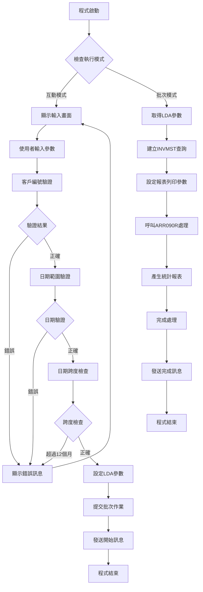
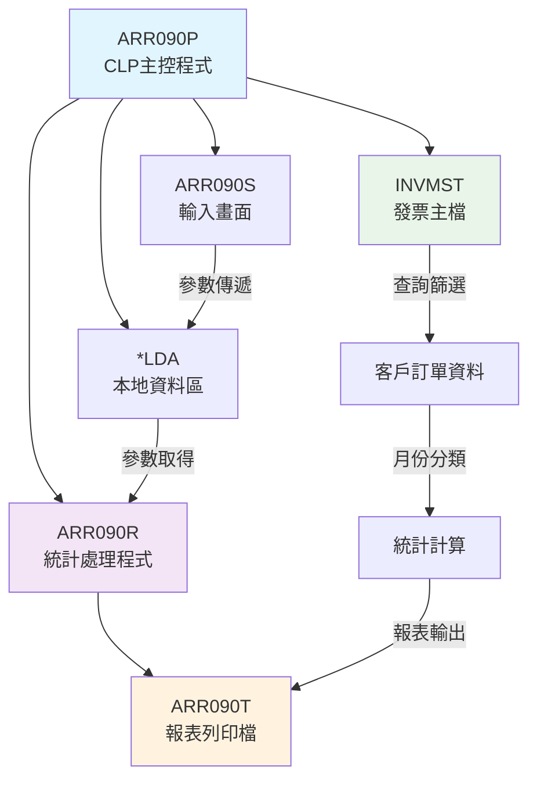
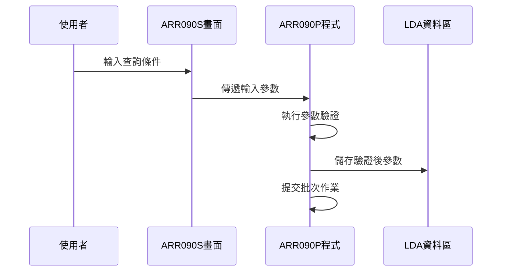
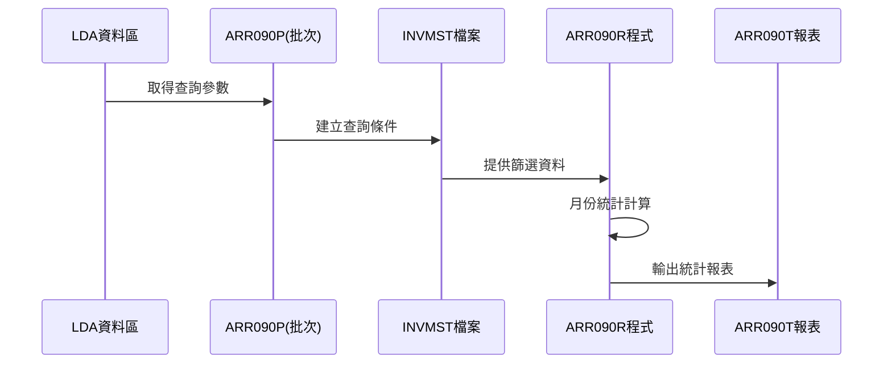
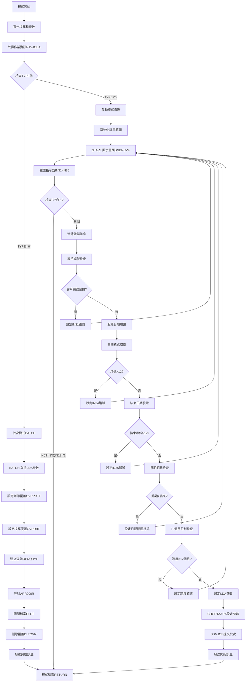
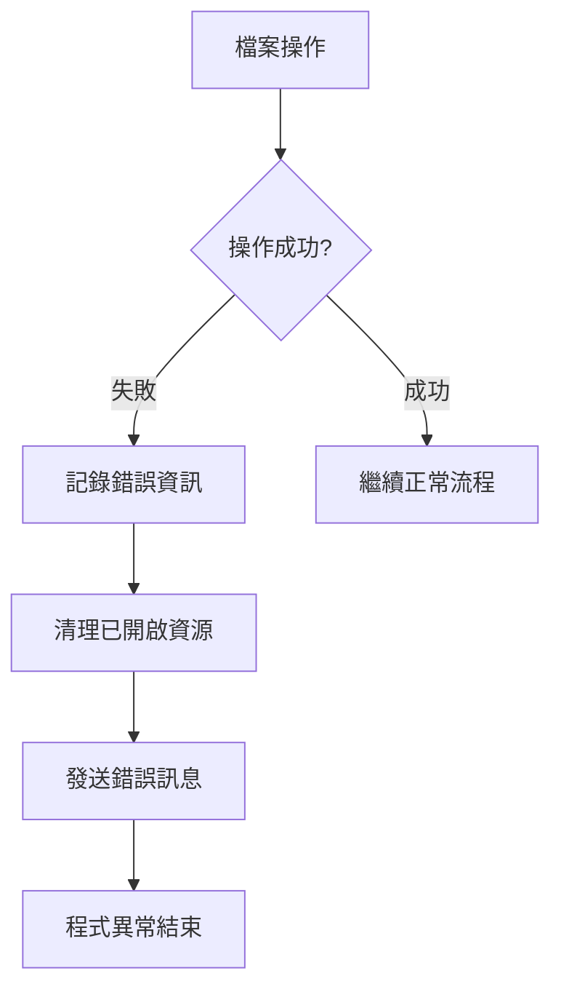

# ARR090P_P02 程式規格書

## 1. 基本資料

| 項目 | 內容 |
|------|------|
| **程式編號** | ARR090P |
| **程式名稱** | 客戶訂單列印作業 |
| **程式類型** | CLP |
| **廠區** | P02 |
| **系統名稱** | 應收帳款系統 |
| **子系統** | 應收帳款報表處理 |
| **檔案位置** | P02CLSRC_THSRC/ARR090P.txt |

## 2. 🎯 程式功能說明

### 主要功能描述
ARR090P是客戶訂單列印作業的主控程式，提供客戶訂單按月份統計報表功能。程式支援互動模式和批次模式執行，讓使用者能夠指定客戶編號、訂單範圍及統計期間，產生詳細的月份統計報表。

### 🎯 業務流程詳細說明

#### 完整業務流程圖


#### 業務流程關鍵階段說明

**階段一：模式判斷與參數輸入**
- 程式根據作業類型(TYPE)判斷執行模式
- 互動模式：顯示ARR090S畫面接受使用者輸入
- 批次模式：從LDA取得預設參數進行處理

**階段二：輸入參數驗證機制**
- 客戶編號必填驗證
- 訂單範圍起迄編號邏輯檢查
- 統計日期格式驗證(YYMMDD)
- 日期跨度限制檢查(不得超過12個月)

**階段三：資料查詢與處理**
- 建立INVMST檔案查詢條件
- 設定客戶編號、訂單範圍、日期範圍篩選
- 排序條件：訂單編號(INORNO)、發票日期(ININDT)

**階段四：報表產生與輸出**
- 呼叫ARR090R進行月份統計計算
- 產生按月份排列的金額統計報表
- 提供訂單明細及月份合計資訊

## 3. 🎯 檔案架構與關聯圖

### 使用檔案清單

| 檔案名稱 | 檔案類型 | 用途說明 |
|----------|----------|----------|
| **ARR090S** | 螢幕檔案 | 使用者輸入參數畫面 |
| **INVMST** | 資料檔案 | 發票主檔(查詢來源) |
| **ARR090T** | 列印檔案 | 報表輸出格式定義 |
| **ARR090R** | RPG程式 | 統計處理與報表產生 |

### 🎯 檔案關聯詳細視覺化圖表



### 🎯 資料流向詳細說明

#### 環境準備階段的資料流向


#### 業務處理階段的資料流向


## 4. 🎯 檔案欄位規格說明

### 主要資料結構

#### ARR090S螢幕檔案欄位定義

| 欄位名稱 | 位置 | 長度 | 型態 | 屬性 | 說明 |
|----------|------|------|------|------|------|
| **S#DEVN** | - | 10 | CHAR | 輸出 | 裝置名稱 |
| **S#USER** | - | 10 | CHAR | 輸出 | 使用者代號 |
| **S#CUNO** | 9,36 | 6 | CHAR | 輸入 | 客戶編號 |
| **S#ORNS** | 11,36 | 6 | CHAR | 輸入 | 訂單起始編號 |
| **S#ORNE** | 11,48 | 6 | CHAR | 輸入 | 訂單結束編號 |
| **S#DATS** | 13,36 | 6 | NUMERIC | 輸入 | 統計起始日期 |
| **S#DATE** | 13,48 | 6 | NUMERIC | 輸入 | 統計結束日期 |
| **S#ERR** | 23,2 | 40 | CHAR | 輸出 | 錯誤訊息 |

#### ARR090R程式資料結構分析

**UDS(User Data Structure)使用者資料結構定義**：
```
位置400-405: T#CUNO (客戶編號)
位置406-411: T#ORNS (訂單起始編號)  
位置412-417: T#ORNE (訂單結束編號)
位置418-423: D#YMS (統計起始日期)
位置424-429: D#YME (統計結束日期)
位置1001-1010: T#USER (使用者代號)
```

**月份處理資料結構**：
```
YM陣列(1-12): 月份對應表
HD陣列(1-12): 月份標題顯示
W#YYMM: 處理月份工作變數
```

### 🔍 重點欄位切割技術詳解

#### DS結構完整分析

**日期欄位切割分析**：
```
D#YMS (6位數) : [YYYYMM]
                 ↓    ↓
W#YEA1 (4位數): [YYYY]        統計起始年份
W#MON1 (2位數):     [MM]      統計起始月份

D#YME (6位數) : [YYYYMM]  
                 ↓    ↓
W#YEA2 (4位數): [YYYY]        統計結束年份
W#MON2 (2位數):     [MM]      統計結束月份
```

**發票日期處理切割**：
```
ININDT (8位數): [YYYYMMDD]
                 ↓      ↓
YYMM (6位數):   [YYYYMM]      月份統計鍵值
DAT1 (8位數):   [YYYYMMDD]    完整日期欄位
```

#### 🎯 欄位挪用詳細分析

**挪用情況對比表**：

| 原始欄位 | 原始用途 | 實際使用方式 | 挪用說明 |
|----------|----------|-------------|----------|
| **T#AMT1-T#AMTC** | 各月份金額 | 12個月統計 | 將12個獨立變數對應到月份順序 |
| **T#TAM1-T#TAMC** | 總計金額 | 月份合計 | 對應各月份的累計金額 |
| **YM陣列** | 月份編號 | 查表索引 | 用於LOOKUP月份對應 |
| **HD陣列** | 月份標題 | 報表標頭 | 動態產生月份標題顯示 |

**挪用原因深度分析**：
- 統計需求：需要12個月的獨立統計欄位
- 報表格式：橫向顯示月份統計需要固定欄位數量
- 查表機制：使用LOOKUP進行月份索引對應
- 彈性處理：支援跨年度的月份統計計算

## 5. 🎯 輸出/入螢幕布局

### 螢幕布局完整視覺化

```
+----------------------------------------------------------+
| 2024/12/28      東豐鋼鐵股份有限公司-應收帳款處理作業    ARR090S |
| 14:30:25                客戶訂單列印作業應收帳款作業       |
| SYSUSER                                                  |
|                                                          |
|                                                          |
|                                                          |
|                                                          |
|                    客戶編號：[______]                     |
|                                                          |
|                    訂單範圍：[______] 至 [______]         |
|                                                          |
|                    統計日期：[______] 至 [______]         |
|                                                          |
|                                                          |
|                                                          |
|                                                          |
|                                                          |
|                                                          |
|                                                          |
|                                                          |
| F3:結束  F12:回上一層                                     |
| [錯誤訊息顯示區]                                          |
+----------------------------------------------------------+
```

### 🎯 畫面欄位詳細說明

| 欄位標題 | 欄位名稱 | 欄位屬性 | 輸入格式 | 驗證規則 | 說明 |
|----------|----------|----------|----------|----------|------|
| **客戶編號** | S#CUNO | 必填,6位 | [XXXXXX] | 不可空白 | 指定查詢的客戶編號 |
| **訂單起始** | S#ORNS | 選填,6位 | [XXXXXX] | 數值檢查 | 預設為空白(全部) |
| **訂單結束** | S#ORNE | 選填,6位 | [XXXXXX] | 範圍檢查 | 預設為999999 |
| **起始日期** | S#DATS | 必填,6位 | [YYMMDD] | 日期格式 | 統計期間起始月份 |
| **結束日期** | S#DATE | 必填,6位 | [YYMMDD] | 日期格式 | 統計期間結束月份 |

### 🎯 畫面控制邏輯

**指示器控制機制**：
- IN31：客戶編號錯誤指示器(紅色顯示+游標定位)
- IN32：訂單起始編號錯誤指示器
- IN33：訂單結束編號錯誤指示器  
- IN34：起始日期錯誤指示器
- IN35：結束日期錯誤指示器

**欄位顯示屬性**：
- DSPATR(RI)：反相顯示錯誤欄位
- DSPATR(PC)：保護顏色顯示
- EDTCDE(4)：日期編輯格式

### 功能鍵詳細定義

| 功能鍵 | 處理邏輯 | 系統行為 | 說明 |
|--------|----------|----------|------|
| **F3** | CA03 | 程式結束 | 直接返回呼叫程式 |
| **F12** | CA12 | 程式結束 | 回到上一層選單 |
| **ENTER** | - | 參數驗證 | 執行輸入驗證及批次提交 |

## 6. 🎯 處理流程程序說明

### 🎯 主程序邏輯深度分析

#### 程式執行流程圖


#### 🎯 詳細處理步驟逐一分析

**步驟1：環境初始化處理**
1. 宣告ARR090S螢幕檔案
2. 定義工作變數(TYPE、日期、年月等)
3. 取得作業資訊判斷執行模式
4. 初始化訂單範圍預設值

**步驟2：互動模式參數處理**
1. 設定訂單範圍預設值(空白至999999)
2. 顯示輸入畫面等待使用者操作
3. 重置所有錯誤指示器(IN31-IN35)
4. 檢查功能鍵操作(F3/F12結束)

**步驟3：輸入驗證邏輯處理**
1. 客戶編號必填檢查
2. 日期格式驗證(年月日切割)
3. 月份範圍檢查(1-12)
4. 日期邏輯檢查(起始≤結束)
5. 跨度限制檢查(≤12個月)

**步驟4：批次作業準備處理**
1. 設定LDA參數(位置400-429)
2. 提交ARR090P批次作業
3. 發送處理開始訊息
4. 程式結束返回

**步驟5：批次模式統計處理**
1. 從LDA取得查詢參數
2. 設定ARR090T報表列印參數
3. 覆蓋INVMST檔案為共享模式
4. 建立OPNQRYF查詢條件
5. 呼叫ARR090R統計處理
6. 清理環境及發送完成訊息

### 🎯 子程序邏輯分析

#### OPNQRYF查詢條件建立
程式建立複雜的SQL查詢條件：
```sql
SELECT * FROM INVMST 
WHERE INCUNO = '客戶編號'
  AND INTYPE <> '9'
  AND INORNO <> '      '
  AND INORNO BETWEEN '起始訂單' AND '結束訂單'
  AND INDECD = ' '
  AND YYMM BETWEEN '起始月份' AND '結束月份'
ORDER BY INORNO, ININDT
```

#### 動態欄位對應機制
使用MAPFLD建立動態欄位：
- DAT1：從ININDT轉換為8位字元日期
- YYMM：從DAT1前6位元建立月份索引

### 🎯 特殊邏輯處理

#### 日期跨度計算邏輯
```
如果 結束年份 = 起始年份：
    月份差 = 結束月份 - 起始月份 + 1
否則：
    月份差 = (12 - 起始月份) + 結束月份 + 1
    
限制條件：月份差 ≤ 12
```

#### 月份範圍驗證算法
1. 解析年月日格式(YYMMDD → YY, MM, DD)
2. 檢查月份值域(01-12)
3. 計算年度差異及月份跨度
4. 驗證總跨度不超過12個月

## 7. 🎯 數據操作與轉換分析

### 檔案操作詳解

#### INVMST檔案存取邏輯
- **存取模式**：IP(Input Primary)，主鍵讀取
- **檔案用途**：發票主檔查詢來源
- **篩選條件**：
  - 客戶編號完全匹配
  - 排除作廢類型(INTYPE≠'9')  
  - 排除空白訂單
  - 訂單範圍篩選
  - 未刪除記錄(INDECD=' ')
  - 月份範圍篩選

#### 檔案鎖定和併發處理
- 使用SHARE(*YES)允許多使用者同時查詢
- OPNQRYF建立暫時性查詢檢視
- 處理完成後執行CLOF關閉查詢
- DLTOVR清理所有檔案覆蓋設定

### 數據轉換邏輯

#### 日期格式轉換處理
```
輸入格式：YYMMDD (6位數字)
轉換處理：
1. %SST(&DATE 1 4) → 年份(4位)
2. %SST(&DATE 5 2) → 月份(2位)
3. 年月組合驗證邏輯檢查
```

#### 字串操作和格式化
```
訂單範圍處理：
- 空白時自動設定為'999999'
- 使用字串連接建立查詢條件
- 動態SQL條件組合
```

### 計算邏輯分析

#### 月份跨度計算公式
```
同年度：跨度 = 結束月份 - 起始月份 + 1
跨年度：跨度 = (12 - 起始月份 + 1) + 結束月份
限制檢查：跨度 ≤ 12個月
```

#### LDA參數位置計算
```
基準位置 = 400
客戶編號位置 = 400-405 (6位)
訂單起始位置 = 406-411 (6位)  
訂單結束位置 = 412-417 (6位)
起始日期位置 = 418-423 (6位)
結束日期位置 = 424-429 (6位)
```

### 檢核機制詳解

#### 數據有效性檢查邏輯
1. **客戶編號檢查**：不可為全空白
2. **月份有效性**：必須在01-12範圍內  
3. **日期邏輯性**：起始日期≤結束日期
4. **跨度合理性**：統計期間≤12個月
5. **訂單範圍**：起始≤結束(若有輸入)

#### 檢核失敗的處理方式
- 設定對應錯誤指示器(IN31-IN35)
- 顯示具體錯誤訊息於S#ERR欄位
- 重新顯示輸入畫面等待修正
- 錯誤欄位以反相+保護色標示

## 8. 🎯 錯誤處理程序說明

### 🎯 詳細錯誤代碼清冊

| 錯誤代碼 | 錯誤訊息 | 原因說明 | 處理方式 | 預防措施 |
|----------|----------|----------|----------|----------|
| **USER001** | 客戶編號不可空白! | 使用者未輸入客戶編號 | 1. 設定IN31指示器<br>2. 游標定位至客戶編號欄位<br>3. 重新顯示輸入畫面 | 在畫面設計時標示為必填欄位 |
| **USER002** | 起始日期格式錯誤! | 月份值超過12或格式不正確 | 1. 設定IN34指示器<br>2. 顯示格式說明<br>3. 清除錯誤輸入重新輸入 | 提供日期格式範例說明 |
| **USER003** | 結束日期格式錯誤! | 月份值超過12或格式不正確 | 1. 設定IN35指示器<br>2. 顯示格式說明<br>3. 清除錯誤輸入重新輸入 | 提供日期格式範例說明 |
| **USER004** | 起始日期不可大於結束日期! | 輸入的日期範圍邏輯錯誤 | 1. 設定IN34和IN35指示器<br>2. 同時標示兩個日期欄位<br>3. 要求重新輸入正確範圍 | 增加即時驗證提示 |
| **USER005** | 起始日期與結束日期不可相距12個月以上! | 統計期間過長 | 1. 設定IN34和IN35指示器<br>2. 顯示最大範圍說明<br>3. 建議合適的查詢期間 | 提供合理期間範例 |

### 🎯 系統異常處理邏輯

#### 檔案操作失敗處理


#### 程式調用失敗處理
- SBMJOB失敗：檢查作業佇列狀態
- ARR090R調用失敗：檢查程式是否存在
- 記錄失敗原因並通知使用者

#### 資料完整性錯誤處理
- OPNQRYF建立失敗：檢查檔案權限
- 查詢結果為空：顯示無符合條件訊息
- 確保資料一致性和完整性

#### 並發控制失敗處理
- 檔案鎖定衝突：重試機制
- 資源競爭：等待後重新嘗試
- 確保多使用者環境穩定運行

## 9. 🎯 備註

### 🎯 特殊注意事項

**檔案相依性**：
- 需確保ARR090S螢幕檔案已正確編譯
- ARR090R統計程式必須在同一函式庫中
- ARR090T列印檔案格式需與報表對應
- INVMST發票主檔需具備查詢權限

**LDA使用限制**：
- 程式使用固定LDA位置(400-429)傳遞參數
- 批次與互動模式共用相同LDA區域
- 需注意多使用者環境下的LDA衝突

**日期處理特性**：
- 使用6位數YYMMDD格式
- 支援跨年度統計(最多12個月)
- 月份編號使用YYYYMM格式進行比較

**報表輸出格式**：
- 固定198字元寬度橫向報表
- 支援12個月橫向統計顯示
- 使用15字元寬度列印格式

**併發處理機制**：
- 支援多使用者同時查詢
- 使用SHARE(*YES)避免檔案鎖定
- 批次作業獨立執行避免影響互動作業 