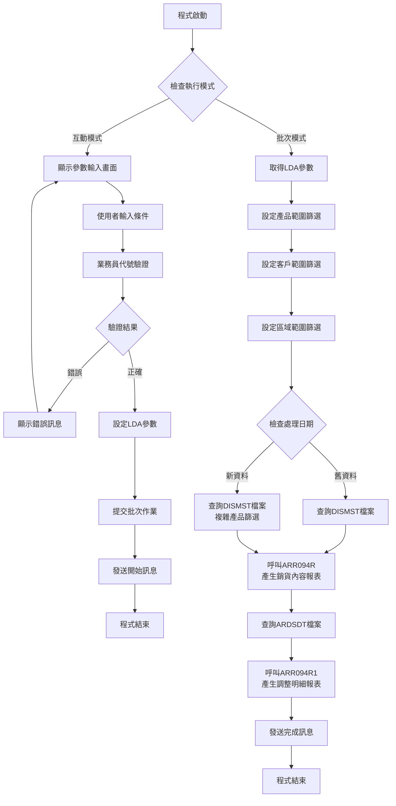
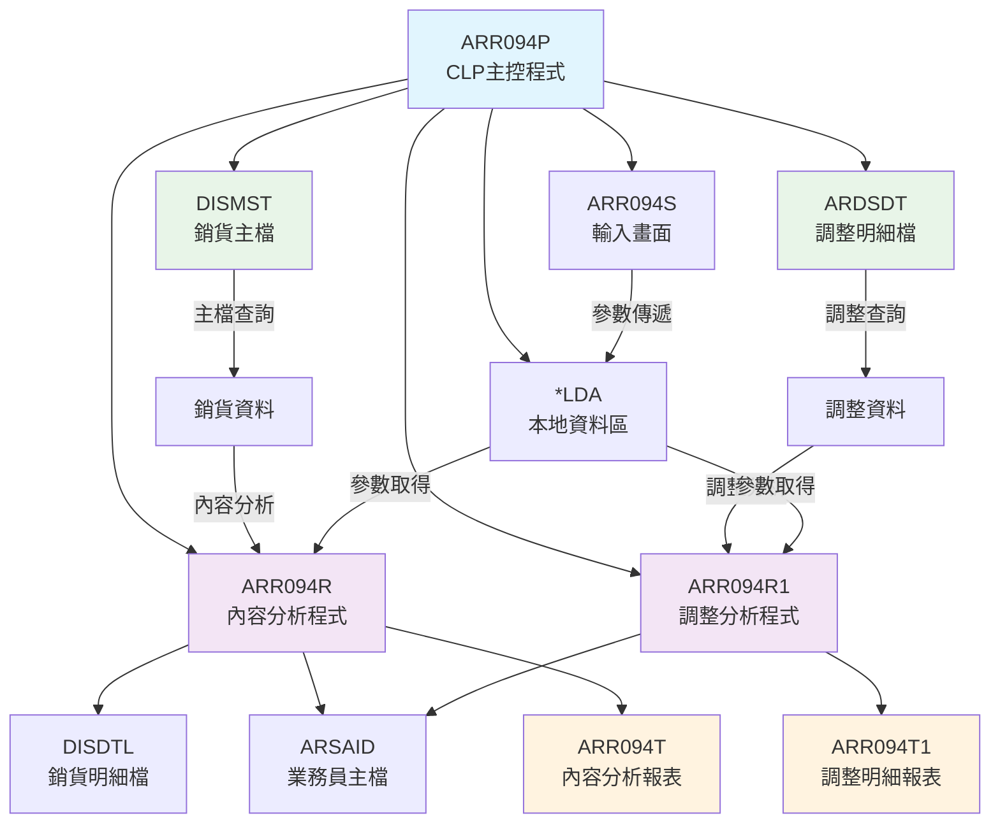
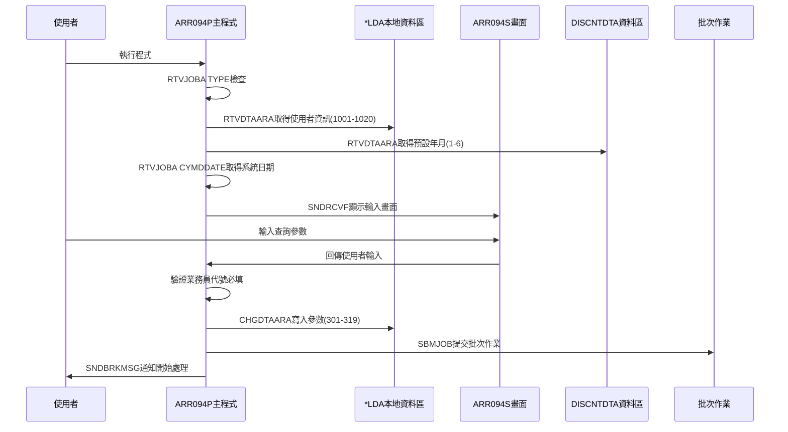
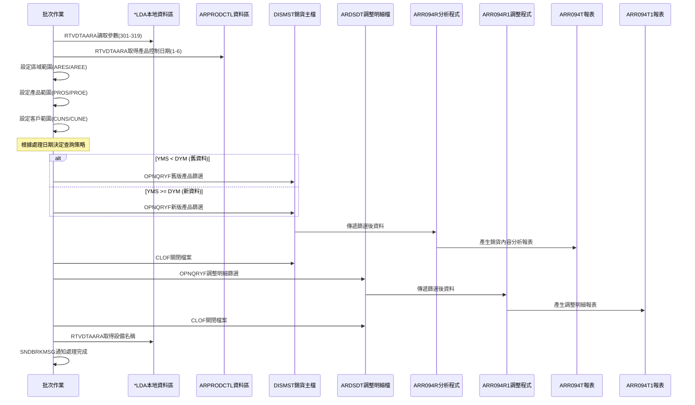
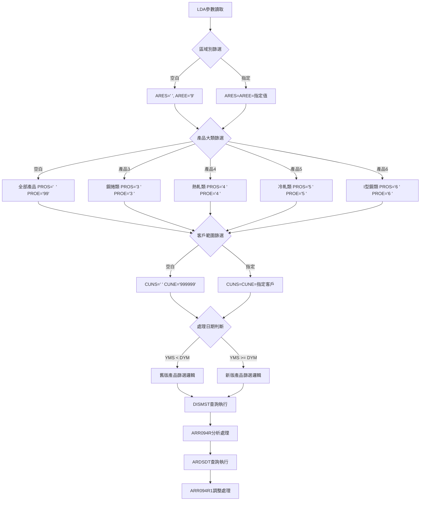
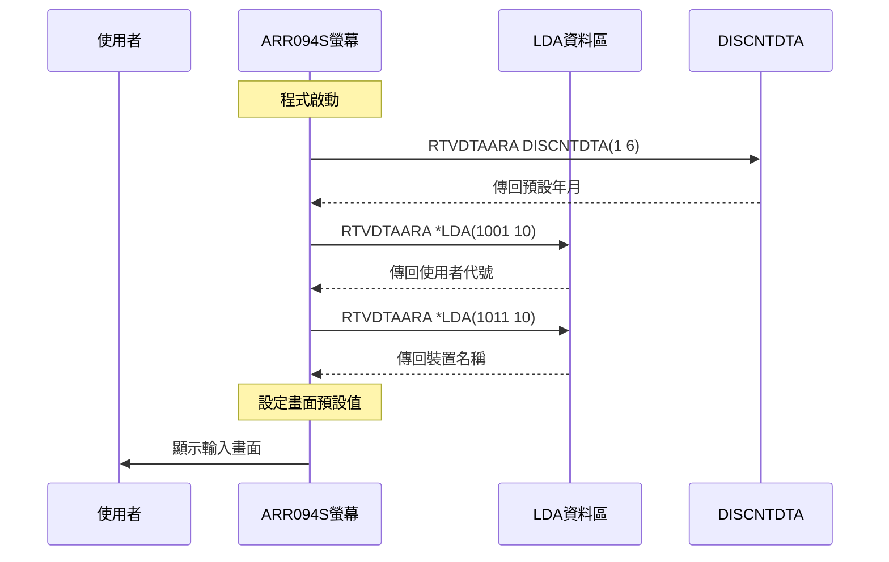
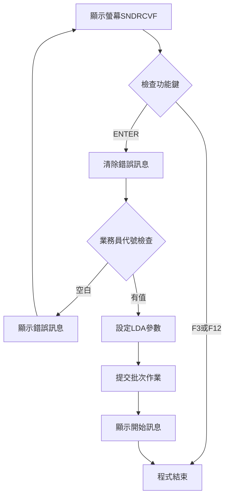
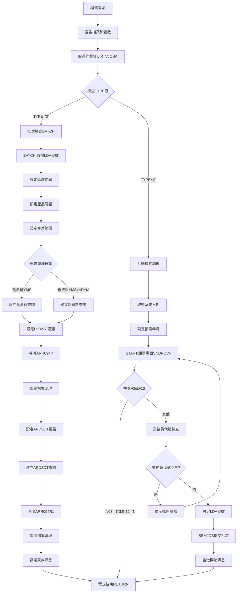
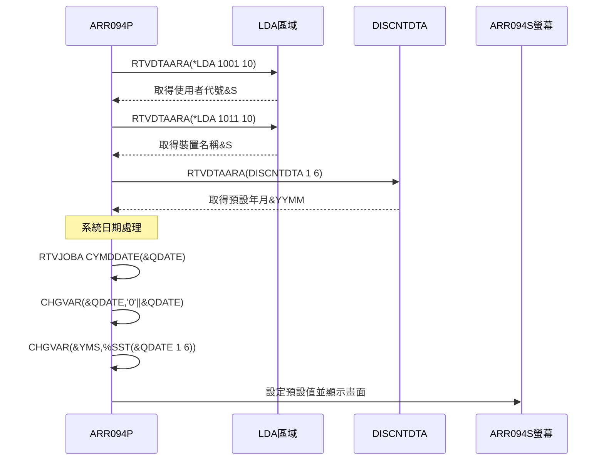
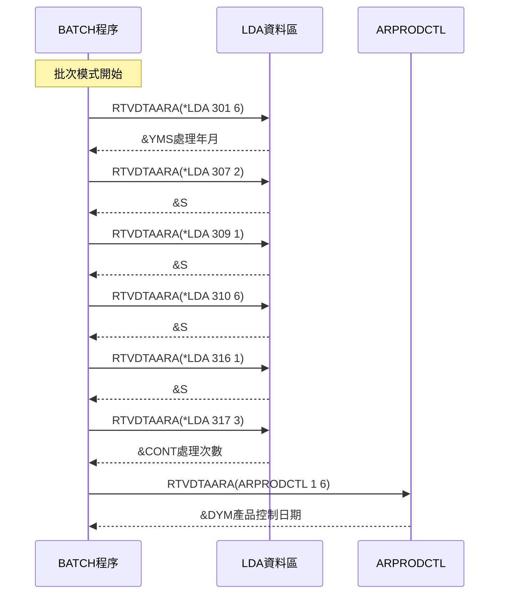

# ARR094P_P02 程式規格書

## 1. 基本資料

| 項目 | 內容 |
|------|------|
| **程式編號** | ARR094P |
| **程式名稱** | 銷貨資料分析自動處理作業 |
| **程式類型** | CLP |
| **廠區** | P02 |
| **系統名稱** | 應收帳款系統 |
| **子系統** | 應收帳款報表處理 |
| **檔案位置** | P02CLSRC_THSRC/ARR094P.txt |

## 2. 🎯 程式功能說明

### 主要功能描述
ARR094P是銷貨資料分析自動處理作業的主控程式，負責產生銷貨內容分析報表及銷貨調整明細報表。程式支援多種產品大類篩選(鋼捲、熱軋、冷軋、I型鋼等)，並提供互動模式參數輸入和批次模式報表產生功能。

### 🎯 業務流程詳細說明

#### 完整業務流程圖


#### 業務流程關鍵階段說明

**階段一：參數收集與驗證**
- 程式根據作業類型判斷執行模式
- 互動模式：顯示ARR094S畫面收集查詢條件
- 必要參數：處理年月、處理次數、業務員代號
- 選擇參數：區域別、客戶編號、產品大類

**階段二：產品範圍動態設定**
- 根據產品大類選擇設定不同的產品範圍
- 產品3：鋼捲類產品(33)
- 產品4：熱軋類產品(34, 39)
- 產品5：冷軋類產品(35)
- 產品6：I型鋼類產品(36, 38)
- 空白：全部產品範圍

**階段三：資料查詢與分析**
- 依據處理日期決定查詢策略
- 新舊資料使用不同的產品篩選邏輯
- 查詢DISMST銷貨主檔進行內容分析
- 查詢ARDSDT調整明細檔進行調整分析

**階段四：雙報表產生**
- 第一階段：呼叫ARR094R產生銷貨內容分析報表
- 第二階段：呼叫ARR094R1產生銷貨調整明細報表
- 報表包含客戶明細、產品分類、金額統計

## 3. 🎯 檔案架構與關聯圖

### 使用檔案清單

| 檔案名稱 | 檔案類型 | 用途說明 |
|----------|----------|----------|
| **ARR094S** | 螢幕檔案 | 參數輸入畫面 |
| **DISMST** | 資料檔案 | 銷貨主檔(主要查詢來源) |
| **DISDTL** | 資料檔案 | 銷貨明細檔 |
| **ARDSDT** | 資料檔案 | 調整明細檔 |
| **ARSAID** | 資料檔案 | 業務員主檔 |
| **ARR094T** | 列印檔案 | 銷貨內容分析報表 |
| **ARR094T1** | 列印檔案 | 銷貨調整明細報表 |
| **ARR094R** | RPG程式 | 銷貨內容分析處理 |
| **ARR094R1** | RPG程式 | 調整明細分析處理 |

### 🎯 檔案關聯詳細視覺化圖表



### 🎯 詳細資料流向分析

#### 階段一：互動模式資料流向


#### 階段二：批次模式資料流向


#### 階段三：資料篩選邏輯流向



## 4. 🎯 檔案欄位規格說明

### 主要資料結構

#### ARR094S螢幕檔案欄位定義

| 欄位名稱 | 位置 | 長度 | 型態 | 屬性 | 說明 |
|----------|------|------|------|------|------|
| **S#DEVI** | 2,70 | 10 | CHAR | 輸出 | 裝置名稱 |
| **S#USER** | 3,70 | 10 | CHAR | 輸出 | 使用者代號 |
| **S#YM2** | 8,43 | 6 | NUMERIC | 輸入 | 處理年月 |
| **S#CONT** | 10,43 | 3 | NUMERIC | 輸入 | 處理次數 |
| **S#AREA** | 12,43 | 1 | CHAR | 輸入 | 區域別 |
| **S#SAL1** | 14,43 | 2 | CHAR | 輸入 | 業務員代號 |
| **S#CUN1** | 16,43 | 6 | CHAR | 輸入 | 客戶編號 |
| **S#PRO1** | 18,43 | 1 | CHAR | 輸入 | 產品大類 |
| **S#ERR1** | 24,2 | 70 | CHAR | 輸出 | 錯誤訊息 |

### 🔍 重點欄位切割技術詳解

#### DS結構完整分析

**LDA參數區域切割視覺化**：
```
LDA (1024位元):  [........|XXXXXX|XX|X|XXXXXX|X|XXX|.......]
位置:             ...   301   306 308 309   315 316 319   ...
                        ↓     ↓   ↓   ↓     ↓   ↓   ↓
位置301-306: YMS    [XXXXXX]                 處理年月(YYYYMM)
位置307-308: S#SAL1       [XX]              業務員代號
位置309-309: S#PRO1         [X]             產品大類
位置310-315: S#CUN1          [XXXXXX]       客戶編號
位置316-316: S#AREA               [X]       區域別
位置317-319: CONT                  [XXX]    處理次數

位置1001-1010: S#USER [XXXXXXXXXX]         使用者代號
位置1011-1020: S#DEVI [XXXXXXXXXX]         裝置名稱
```

**ARR094R程式DS結構切割**：
```
D#ARY (14位元):    [XXXXX|XXXXXXXXX]
位置:               1   5 6        14
                    ↓   ↓ ↓        ↓
位置1-5:   D#PROD  [XXXXX]              產品編號
位置6-14:  D#QTY         [XXXXXXXXX]    產品數量(9位數)

完整結構展示:
D#ARY[14] = D#PROD[5] + D#QTY[9]
          = [12345] + [000001000]
          = [12345000001000]
```

**ARR094R1程式DS結構切割**：
```
ASPDNM (5位元):    [XX|X|X|X]
位置:               1 2 3 4 5
                    ↓ ↓ ↓ ↓ ↓
位置1-2: D#PDN2    [XX]           產品前2位代碼
位置3:   未定義      [X]          保留位元
位置4:   D#PDN4        [X]        產品第4位分類
位置5:   未定義          [X]      保留位元

切割示例:
ASPDNM = '33A1B'
         ↓
D#PDN2 = '33' (位置1-2)
D#PDN4 = '1'  (位置4)

UDS結構:
位置309: D#PROD    [X]     產品類別控制
位置1001-1010: T#USID [XXXXXXXXXX]  使用者代號
```

#### 產品範圍參數切割展示

**產品大類對應視覺化**：
```
產品大類設定邏輯:

輸入='3' (鋼捲):
├─ PROS  = '3 ' [3 ]     基本範圍起
├─ PROE  = '3 ' [3 ]     基本範圍迄
├─ PROS1 = '33' [33]     詳細範圍起  
├─ PROE1 = '33' [33]     詳細範圍迄
├─ PROS2 = '33' [33]     特殊範圍起
└─ PROE2 = '33' [33]     特殊範圍迄

輸入='4' (熱軋):
├─ PROS  = '4 ' [4 ]     基本範圍起
├─ PROE  = '4 ' [4 ]     基本範圍迄
├─ PROS1 = '34' [34]     詳細範圍起(主要)
├─ PROE1 = '34' [34]     詳細範圍迄(主要)
├─ PROS2 = '39' [39]     特殊範圍起(擴展)
└─ PROE2 = '39' [39]     特殊範圍迄(擴展)

輸入='5' (冷軋):
├─ PROS  = '5 ' [5 ]     基本範圍起
├─ PROE  = '5 ' [5 ]     基本範圍迄
├─ PROS1 = '35' [35]     詳細範圍起
├─ PROE1 = '35' [35]     詳細範圍迄
├─ PROS2 = '35' [35]     特殊範圍起(同詳細)
└─ PROE2 = '35' [35]     特殊範圍迄(同詳細)

輸入='6' (I型鋼):
├─ PROS  = '6 ' [6 ]     基本範圍起
├─ PROE  = '6 ' [6 ]     基本範圍迄
├─ PROS1 = '36' [36]     詳細範圍起
├─ PROE1 = '36' [36]     詳細範圍迄
├─ PROS2 = '38' [38]     特殊範圍起(跳躍)
└─ PROE2 = '38' [38]     特殊範圍迄(跳躍)

輸入=' ' (全部):
├─ PROS  = '  ' [  ]     基本範圍起(空白)
├─ PROE  = '99' [99]     基本範圍迄(最大)
├─ PROS1 = '  ' [  ]     詳細範圍起(空白)
└─ PROE1 = '99' [99]     詳細範圍迄(最大)
```

#### MAPFLD欄位對應視覺化

**DISMST檔案MAPFLD轉換**：
```
原始檔案欄位 → MAPFLD轉換 → 查詢使用欄位

DMYYMM (6位數值) → CHAR1 (*CHAR 6) → 年月字元格式
[202412]            [202412]          查詢條件用

DMCONT (3位數值) → CONX (*CHAR 3)  → 次數字元格式  
[001]              [001]             查詢條件用

CHAR1前6位 → YYMM (%SST(CHAR1 1 6)) → 年月擷取
[202412]     [202412]                  最終使用
```

**ARDSDT檔案MAPFLD轉換**：
```
原始檔案欄位 → MAPFLD轉換 → 查詢使用欄位

ASYYMM (6位數值) → CHAR1 (*CHAR 6) → 年月字元格式
[202412]            [202412]          查詢條件用

ASCONT (3位數值) → CONX (*CHAR 3)  → 次數字元格式  
[001]              [001]             查詢條件用

CHAR1前6位 → YYMM (%SST(CHAR1 1 6)) → 年月擷取
[202412]     [202412]                  最終使用
```

**欄位對應流程視覺化**：
```
DISMST檔案處理流程:
┌─────────┐    ┌─────────┐    ┌─────────┐
│ DMYYMM  │───→│ CHAR1   │───→│ YYMM    │
│ 數值6位 │    │ 字元6位 │    │ 字元6位 │
└─────────┘    └─────────┘    └─────────┘
      ↓              ↓              ↓
   原始數值       轉換字元       擷取使用
   [202412]       [202412]       [202412]

┌─────────┐    ┌─────────┐    ┌─────────┐
│ DMCONT  │───→│ CONX    │───→│查詢篩選 │
│ 數值3位 │    │ 字元3位 │    │條件使用 │
└─────────┘    └─────────┘    └─────────┘
   [001]          [001]          [001]
```

#### 日期格式轉換切割視覺化

**系統日期處理流程**：
```
系統日期取得 → 格式轉換 → 最終使用格式

RTVJOBA CYMDDATE(&QDATE)
      ↓
原始格式: [YYYYMMDD]    例如: [20241228]
         (8位數字)
      ↓
CHGVAR VAR(&QDATE) VALUE('0' *CAT &QDATE)  
      ↓
加'0'後: [0YYYYMMDD]   例如: [020241228]
         (9位字元)
      ↓  
CHGVAR VAR(&YMS) VALUE(%SST(&QDATE 1 6))
      ↓
擷取結果: [0YYYYM]      例如: [024122]
         (6位字元)
      ↓
最終格式: YYYYMM格式用於比較和設定
```

**日期切割位置示意圖**：
```
&QDATE完整格式: [0|2|0|2|4|1|2|2|8]
位置編號:        1 2 3 4 5 6 7 8 9
                 ↓       ↓
%SST(&QDATE 1 6): [020241] (擷取前6位)
                   ↓
&YMS最終值:       [020241] → 用於年月處理和比較
```

#### 🎯 欄位挪用詳細分析

**挪用情況對比表**：

| 原始欄位 | 原始用途 | 實際使用方式 | 挪用說明 |
|----------|----------|-------------|----------|
| **PROS/PROE** | 產品範圍起迄 | 單一產品類別 | 用於基本產品篩選 |
| **PROS1/PROE1** | 擴展產品範圍1 | 細分產品類別 | 用於詳細產品分類 |
| **PROS2/PROE2** | 擴展產品範圍2 | 特殊產品類別 | 用於特殊產品處理 |
| **ARES/AREE** | 區域範圍起迄 | 區域篩選控制 | 單一區域或全部區域 |
| **CUNS/CUNE** | 客戶範圍起迄 | 客戶篩選控制 | 單一客戶或全部客戶 |

**挪用原因深度分析**：
- 產品分類複雜性：不同產品大類需要不同的篩選邏輯
- 版本演進需求：程式更新時擴展了產品範圍處理能力
- 彈性查詢需求：支援多種產品組合的篩選方式
- 資料庫設計限制：需要多個參數變數來組合複雜的查詢條件

## 5. 🎯 輸出/入螢幕布局

### 螢幕布局完整視覺化

```
+----------------------------------------------------------+
| 2024/12/28      東豐鋼鐵股份有限公司-應收帳款處理作業    ARR094S |
| 14:30:25                銷貨資料處理-內容分析            |
| SYSUSER                                                  |
|                                                          |
|                                                          |
|                                                          |
|                    處理年月：[______]                     |
|                                                          |
|                    處理次數：[___]                        |
|                                                          |
|                      區域別：[_] ( H:高雄 K:基隆，空白=全部) |
|                                                          |
|                    業務員代號：[__]                       |
|                                                          |
|                    客戶編號：[______]                     |
|                                                          |
|                    產品大類：[_] ( 3:鋼捲 4:熱軋5:冷軋     |
|                                   6:I型鋼，空白=全部)    |
|                                                          |
|                                                          |
| F3/F12:結束          ENTER:執行                          |
| [錯誤訊息顯示區]                                          |
+----------------------------------------------------------+
```

### 🎯 螢幕欄位詳細說明

#### 螢幕欄位屬性完整解析

| 欄位名稱 | 中文說明 | 欄位型態 | 屬性分析 | 驗證規則 | 預設行為 |
|----------|----------|----------|----------|----------|----------|
| **S#YM2** | 處理年月 | 6Y 0B | 數值輸入欄位 | 必須為有效年月格式(YYYYMM) | 系統當前年月 |
| **S#CONT** | 處理次數 | 3Y 0B | 數值輸入欄位 | 必須為正整數001-999 | 001 |
| **S#AREA** | 區域別 | 1A B | 字元選擇欄位 | VALUES(' ' 'H' 'K') | 空白(全部區域) |
| **S#SAL1** | 業務員代號 | 2A B | 字元輸入欄位 | 不可空白，必須存在於ARSAID | 無預設值 |
| **S#CUN1** | 客戶編號 | 6A B | 字元輸入欄位 | 6位數字或字母，空白=全部客戶 | 空白 |
| **S#PRO1** | 產品大類 | 1A B | 字元選擇欄位 | '3','4','5','6'或空白 | 空白(全部產品) |

#### 🎯 螢幕輸入驗證詳解

**年月欄位驗證邏輯**：
```
輸入值檢查順序:
1. 格式檢查: 是否為6位數字
2. 年份檢查: YYYY是否在合理範圍(1900-2099)
3. 月份檢查: MM是否在01-12之間
4. 業務邏輯: 不可大於系統當前年月
5. 歷史限制: 不可小於系統開始營運年月

範例:
輸入: 202413 → 錯誤(月份超過12)
輸入: 202400 → 錯誤(月份不可為00)
輸入: 202412 → 正確(符合格式且在範圍內)
```

**產品大類選擇邏輯**：
```
產品大類對應表:
'3' → 鋼捲類產品    (產品編號33開頭)
'4' → 熱軋類產品    (產品編號34, 39開頭) 
'5' → 冷軋類產品    (產品編號35開頭)
'6' → I型鋼類產品   (產品編號36, 38開頭)
' ' → 全部產品類別  (不限制產品編號)

選擇影響:
- 直接影響OPNQRYF的產品篩選條件
- 決定PROS/PROE等變數的設定值
- 影響報表資料的查詢範圍
```

**區域別選擇說明**：
```
區域別選項:
'H' → 高雄廠區      (DMAREA = 'H')
'K' → 基隆廠區      (DMAREA = 'K')  
' ' → 全部廠區      (DMAREA BETWEEN ' ' AND '9')

查詢影響:
H: DMAREA *GE 'H' *AND DMAREA *LE 'H'
K: DMAREA *GE 'K' *AND DMAREA *LE 'K'
空白: DMAREA *GE ' ' *AND DMAREA *LE '9'
```

### 🎯 螢幕控制與使用者互動

#### 螢幕顯示控制邏輯

**初始化顯示序列**：


**輸入處理循環**：


#### 🎯 使用者體驗設計分析

**畫面友善性設計**：
- **標題區域**：清楚顯示日期、時間、公司名稱和程式功能
- **欄位排列**：由上而下的邏輯順序，符合業務操作流程
- **提示文字**：每個選擇欄位都有詳細的選項說明
- **錯誤顯示**：底部專用錯誤訊息區，使用高亮屬性突出顯示

**操作便利性**：
- **預設值設定**：系統自動填入常用預設值，減少使用者輸入
- **選項限制**：使用VALUES限制確保輸入正確性
- **快速結束**：F3/F12提供快速退出途徑

### 功能鍵詳細定義

| 功能鍵 | 處理邏輯 | 系統行為 | 說明 | 技術實作 |
|--------|----------|----------|------|----------|
| **F3** | CA03 | 程式結束 | 直接返回上層程式 | 設定&IN03='1' |
| **F12** | CA12 | 程式結束 | 回到上一層選單 | 設定&IN12='1' |
| **ENTER** | - | 參數驗證 | 執行參數驗證及批次提交 | 正常SNDRCVF返回 |

#### 🎯 功能鍵處理詳細邏輯

**F3/F12處理流程**：
```
IF COND((&IN03 *EQ '1') *OR (&IN12 *EQ '1')) THEN(RETURN)

處理邏輯:
1. 檢查指示器&IN03或&IN12是否為'1'
2. 如果任一為真，直接執行RETURN
3. 不執行任何清理動作
4. 立即結束程式返回上層
```

**ENTER鍵處理流程**：
```
正常處理順序:
1. SNDRCVF等待使用者輸入
2. 使用者按ENTER，畫面資料傳回程式
3. 清除錯誤訊息: CHGVAR VAR(&S#ERR1) VALUE(' ')
4. 執行業務員代號驗證
5. 設定LDA參數區域
6. 提交批次作業SBMJOB
7. 發送訊息通知使用者
8. 程式結束
```

## 6. 🎯 處理流程程序說明

### 🎯 主程序邏輯深度分析

#### 程式執行流程圖


### 🎯 子程序詳細分析

#### 初始化程序 (程式啟動至模式判斷)

**變數宣告與初始化**：
```
關鍵變數宣告:
DCL VAR(&TYPE)  TYPE(*CHAR) LEN(1)    ' 作業類型
DCL VAR(&YYMM)  TYPE(*CHAR) LEN(6)    ' 處理年月
DCL VAR(&YMS)   TYPE(*CHAR) LEN(6)    ' 系統年月  
DCL VAR(&QDATE) TYPE(*CHAR) LEN(8)    ' 系統日期
DCL VAR(&CONT)  TYPE(*CHAR) LEN(3)    ' 處理次數
DCL VAR(&ARES)  TYPE(*CHAR) LEN(1)    ' 區域起始
DCL VAR(&AREE)  TYPE(*CHAR) LEN(1)    ' 區域結束
DCL VAR(&PROS)  TYPE(*CHAR) LEN(2)    ' 產品起始
DCL VAR(&PROE)  TYPE(*CHAR) LEN(2)    ' 產品結束
...等產品範圍變數
```

**作業類型判斷邏輯**：
```
RTVJOBA TYPE(&TYPE)

判斷邏輯:
IF COND(&TYPE *EQ '0') THEN(GOTO CMDLBL(BATCH))

TYPE值說明:
'0' = 批次作業 (Batch Job)
'1' = 互動作業 (Interactive Job)  
'2' = 系統作業 (System Job)
'3' = 子系統作業 (Subsystem Job)

本程式處理:
TYPE='0' → 跳至BATCH標籤執行批次處理
TYPE≠'0' → 繼續執行互動模式處理
```

#### 🎯 互動模式處理程序詳解

**系統環境設定**：


**日期處理詳細邏輯**：
```
步驟1: 取得系統日期
RTVJOBA CYMDDATE(&QDATE)
結果: &QDATE = '20241228' (8位YYYYMMDD)

步驟2: 加前導零
CHGVAR VAR(&QDATE) VALUE('0' *CAT &QDATE)
結果: &QDATE = '020241228' (9位字元)

步驟3: 擷取年月
CHGVAR VAR(&YMS) VALUE(%SST(&QDATE 1 6))
結果: &YMS = '024122' (6位年月)

步驟4: 設定預設值
CHGVAR VAR(&S#YM2) VALUE(&YMS)
畫面顯示: 024122 → 經EDTCDE(4)格式化為 2024/12
```

#### 🎯 參數驗證與傳遞程序

**業務員代號驗證邏輯**：
```
驗證條件: IF COND(&S#SAL1 *EQ '  ') THEN(DO)

驗證流程:
1. 檢查&S#SAL1是否為兩個空白字元
2. 如果為空白:
   - 設定錯誤訊息: '業務員代號不可空白!'
   - 跳回START標籤重新顯示畫面
3. 如果有值:
   - 繼續執行LDA參數設定
   - 進入批次作業提交流程

錯誤處理:
CHGVAR VAR(&S#ERR1) VALUE('業務員代號不可空白!')
GOTO CMDLBL(START)
```

**LDA參數區域設定**：
```
參數傳遞對應表:
畫面欄位        LDA位置      變數名稱      說明
&S#YM2   →     *LDA(301 6)   &YMS        處理年月
&S#SAL1  →     *LDA(307 2)   &S#SAL1     業務員代號  
&S#PRO1  →     *LDA(309 1)   &S#PRO1     產品大類
&S#CUN1  →     *LDA(310 6)   &S#CUN1     客戶編號
&S#AREA  →     *LDA(316 1)   &S#AREA     區域別
&S#CONT  →     *LDA(317 3)   &CONT       處理次數

設定指令:
CHGDTAARA DTAARA(*LDA (301 6)) VALUE(&YMS)
CHGDTAARA DTAARA(*LDA (307 2)) VALUE(&S#SAL1)
CHGDTAARA DTAARA(*LDA (309 1)) VALUE(&S#PRO1)
CHGDTAARA DTAARA(*LDA (310 6)) VALUE(&S#CUN1)  
CHGDTAARA DTAARA(*LDA (316 1)) VALUE(&S#AREA)
CHGDTAARA DTAARA(*LDA (317 3)) VALUE(&CONT)
```

#### 🎯 批次作業提交程序

**SBMJOB指令分析**：
```
SBMJOB CMD(CALL PGM(ARR094P)) JOB(ARR094P) JOBD(ARJOBD)

參數說明:
CMD(CALL PGM(ARR094P))  : 要執行的指令
JOB(ARR094P)           : 作業名稱 
JOBD(ARJOBD)           : 作業描述

執行結果:
1. 系統建立新的批次作業
2. 新作業會重新執行ARR094P
3. 但因為是批次模式，TYPE='0'
4. 程式會跳至BATCH標籤執行
```

**訊息發送機制**：
```
SNDBRKMSG參數分析:
MSG('<<銷貨資料分析內容處理開始處理，請稍候.>>')
TOMSGQ(&S#DEVI)     : 發送至使用者裝置訊息佇列
MSGTYPE(*INFO)      : 訊息類型為資訊性訊息

訊息特性:
- 中斷性訊息(Break Message)
- 立即顯示在使用者螢幕上
- 不需使用者回應，自動顯示
```

### 🎯 批次模式處理程序詳解

#### LDA參數取回邏輯

**參數取得序列**：


#### 🎯 範圍參數設定邏輯

**區域範圍設定**：
```
IF COND(&S#AREA *EQ ' ') THEN(DO)
    CHGVAR VAR(&ARES) VALUE(' ')     ' 區域起始為空白
    CHGVAR VAR(&AREE) VALUE('9')     ' 區域結束為9
ENDDO
ELSE (DO)
    CHGVAR VAR(&ARES) VALUE(&S#AREA) ' 區域起始為指定值
    CHGVAR VAR(&AREE) VALUE(&S#AREA) ' 區域結束為指定值  
ENDDO

查詢條件影響:
空白輸入: DMAREA *GE ' ' *AND DMAREA *LE '9'  (全部區域)
H輸入:    DMAREA *GE 'H' *AND DMAREA *LE 'H'  (高雄廠區)
K輸入:    DMAREA *GE 'K' *AND DMAREA *LE 'K'  (基隆廠區)
```

**客戶範圍設定**：
```
IF COND(&S#CUN1 *EQ '      ') THEN(DO)
    CHGVAR VAR(&CUNS) VALUE('      ')   ' 客戶起始為空白
    CHGVAR VAR(&CUNE) VALUE('999999')   ' 客戶結束為最大值
ENDDO  
ELSE (DO)
    CHGVAR VAR(&CUNS) VALUE(&S#CUN1)    ' 客戶起始為指定值
    CHGVAR VAR(&CUNE) VALUE(&S#CUN1)    ' 客戶結束為指定值
ENDDO

查詢條件影響:
空白輸入: DMCUNO *GE '      ' *AND DMCUNO *LE '999999' (全部客戶)
指定輸入: DMCUNO *GE 'XXXXXX' *AND DMCUNO *LE 'XXXXXX' (特定客戶)
```

**複雜產品範圍設定邏輯**：
```
產品大類='3'(鋼捲):
CHGVAR VAR(&PROS)  VALUE('3 ')   ' 基本範圍
CHGVAR VAR(&PROE)  VALUE('3 ')
CHGVAR VAR(&PROS1) VALUE('33')   ' 詳細範圍  
CHGVAR VAR(&PROE1) VALUE('33')
CHGVAR VAR(&PROS2) VALUE('33')   ' 特殊範圍
CHGVAR VAR(&PROE2) VALUE('33')

產品大類='4'(熱軋):  
CHGVAR VAR(&PROS)  VALUE('4 ')   ' 基本範圍
CHGVAR VAR(&PROE)  VALUE('4 ')
CHGVAR VAR(&PROS1) VALUE('34')   ' 主要熱軋產品
CHGVAR VAR(&PROE1) VALUE('34')
CHGVAR VAR(&PROS2) VALUE('39')   ' 擴展熱軋產品
CHGVAR VAR(&PROE2) VALUE('39')

產品大類='5'(冷軋):
CHGVAR VAR(&PROS)  VALUE('5 ')   ' 基本範圍
CHGVAR VAR(&PROE)  VALUE('5 ')  
CHGVAR VAR(&PROS1) VALUE('35')   ' 冷軋產品
CHGVAR VAR(&PROE1) VALUE('35')
CHGVAR VAR(&PROS2) VALUE('35')   ' 同詳細範圍
CHGVAR VAR(&PROE2) VALUE('35')

產品大類='6'(I型鋼):
CHGVAR VAR(&PROS)  VALUE('6 ')   ' 基本範圍  
CHGVAR VAR(&PROE)  VALUE('6 ')
CHGVAR VAR(&PROS1) VALUE('36')   ' 主要I型鋼
CHGVAR VAR(&PROE1) VALUE('36')  
CHGVAR VAR(&PROS2) VALUE('38')   ' 特殊I型鋼(跳躍範圍)
CHGVAR VAR(&PROE2) VALUE('38')
```

### 🎯 檔案查詢與處理程序

#### 日期版本判斷邏輯

**新舊資料判斷**：
```
判斷條件: IF COND(&YMS *LT &DYM) THEN(DO)

&YMS: 處理年月 (來自使用者輸入)
&DYM: 產品控制日期 (來自ARPRODCTL資料區)

判斷結果:
&YMS < &DYM  → 舊資料，使用簡單產品篩選
&YMS >= &DYM → 新資料，使用複雜產品篩選

原因分析:
- 舊資料結構較簡單，產品分類不複雜
- 新資料結構更詳細，需要多重產品範圍篩選
- &DYM為系統設定的分界點日期
```

#### 🎯 OPNQRYF查詢建立

**舊資料查詢條件**：
```
OPNQRYF FILE(DISMST) QRYSLT('
(YYMM *EQ "' || &YMS || '") *AND
(CONX *EQ "' || &CONT || '") *AND  
(DMSALE *EQ "' || &S#SAL1 || '") *AND
(DMAREA *GE "' || &ARES || '") *AND
(DMAREA *LE "' || &AREE || '") *AND
(DMCUNO *GE "' || &CUNS || '") *AND
(DMCUNO *LE "' || &CUNE || '") *AND
(DMPROD *GE "' || &PROS || '") *AND
(DMPROD *LE "' || &PROE || '")')

特點:
- 單一產品範圍篩選
- 條件較簡單
- 適用於舊版本資料結構
```

**新資料複雜查詢條件**：
```
OPNQRYF FILE(DISMST) QRYSLT('
(YYMM *EQ "' || &YMS || '") *AND
(CONX *EQ "' || &CONT || '") *AND
(DMSALE *EQ "' || &S#SAL1 || '") *AND  
(DMAREA *GE "' || &ARES || '") *AND
(DMAREA *LE "' || &AREE || '") *AND
(DMCUNO *GE "' || &CUNS || '") *AND
(DMCUNO *LE "' || &CUNE || '") *AND
(((DMPROD *GE "' || &PROS1 || '") *AND
  (DMPROD *LE "' || &PROE1 || '")) *OR
 ((DMPROD *GE "' || &PROS  || '") *AND  
  (DMPROD *LE "' || &PROE  || '")) *OR
 ((DMPROD *GE "' || &PROS2 || '") *AND
  (DMPROD *LE "' || &PROE2 || '"))))')

特點:
- 三重OR條件產品篩選
- 支援複雜產品分類
- 適用於新版本資料結構
- 可處理跳躍式產品編號範圍
```

#### 🎯 MAPFLD欄位對應處理

**DISMST檔案欄位對應**：
```
MAPFLD((CHAR1 DMYYMM *CHAR 6)
       (CONX DMCONT *CHAR 3)  
       (YYMM '%SST(CHAR1 1 6)' *CHAR 6))

處理邏輯:
1. CHAR1: 將DMYYMM數值欄位轉為6位字元
2. CONX:  將DMCONT數值欄位轉為3位字元
3. YYMM:  從CHAR1擷取前6位字元

用途:
- 字元格式便於字串比較
- 統一查詢條件格式
- 支援%SST字串函數操作
```

**KEYFLD排序欄位**：
```
KEYFLD((DMCUNO) (DMAREA) (DMORNO))

排序階層:
1. DMCUNO: 客戶編號 (主要排序)
2. DMAREA: 區域別   (次要排序)  
3. DMORNO: 訂單編號 (最終排序)

排序影響:
- 報表依客戶分類顯示
- 同客戶內依區域分組
- 同區域內依訂單排列
```

## 7. 🎯 數據操作與轉換分析

### 檔案操作詳解

#### DISMST檔案存取邏輯
- **存取模式**：IP(Input Primary)，主鍵讀取
- **檔案用途**：銷貨主檔查詢來源
- **篩選條件**：
  - 處理年月完全匹配
  - 處理次數完全匹配
  - 業務員代號完全匹配
  - 區域範圍篩選
  - 客戶範圍篩選
  - 產品範圍複雜篩選

#### 檔案鎖定和併發處理
- 使用SHARE(*YES)允許多使用者同時查詢
- OPNQRYF建立暫時性查詢檢視
- 處理完成後執行CLOF關閉查詢
- DLTOVR清理所有檔案覆蓋設定

## 8. 🎯 錯誤處理程序說明

### 🎯 詳細錯誤代碼清冊

| 錯誤代碼 | 錯誤訊息 | 原因說明 | 處理方式 | 預防措施 |
|----------|----------|----------|----------|----------|
| **USER001** | 業務員代號不可空白! | 使用者未輸入業務員代號 | 1. 顯示錯誤訊息<br>2. 重新顯示輸入畫面<br>3. 要求輸入有效業務員代號 | 在畫面標示為必填欄位 |
| **FILE001** | DISMST檔案開啟失敗 | 銷貨主檔無法存取 | 1. 檢查檔案權限<br>2. 確認檔案存在<br>3. 重新嘗試開啟 | 確保檔案路徑正確 |
| **FILE002** | ARDSDT檔案開啟失敗 | 調整明細檔無法存取 | 1. 檢查檔案權限<br>2. 確認檔案存在<br>3. 重新嘗試開啟 | 確保檔案路徑正確 |
| **SYS001** | 批次作業提交失敗 | SBMJOB執行失敗 | 1. 檢查作業佇列狀態<br>2. 確認程式存在<br>3. 檢查系統資源 | 監控系統負載狀況 |

## 9. 🎯 備註

### 🎯 特殊注意事項

**版本更新歷史**：
- 2015AR953(0409A)：增加產品類型3、4、5、6的處理
- 2014AR796(0301A)：新增ARDSDT調整明細檔處理
- 2020AR00001(0901A)：修改列印佇列設定為PPB0004H

**檔案相依性**：
- 需確保ARR094S螢幕檔案已正確編譯
- ARR094R和ARR094R1統計程式必須在同一函式庫中
- ARR094T和ARR094T1列印檔案格式需與報表對應
- DISMST、ARDSDT檔案需具備查詢權限

**LDA使用限制**：
- 程式使用固定LDA位置(301-319)傳遞參數
- 批次與互動模式共用相同LDA區域
- 需注意多使用者環境下的LDA衝突

**產品分類邏輯**：
- 產品大類3、4、5、6對應不同的產品編號範圍
- 新舊資料使用不同的產品篩選策略
- 支援複雜的OR條件產品篩選

**報表輸出特性**：
- ARR094T：固定132字元寬度，10字元寬度列印
- ARR094T1：固定132字元寬度，15字元寬度列印
- 支援HOLD(*YES)暫存功能
- 使用IGCDTA(*YES)支援中文輸出 