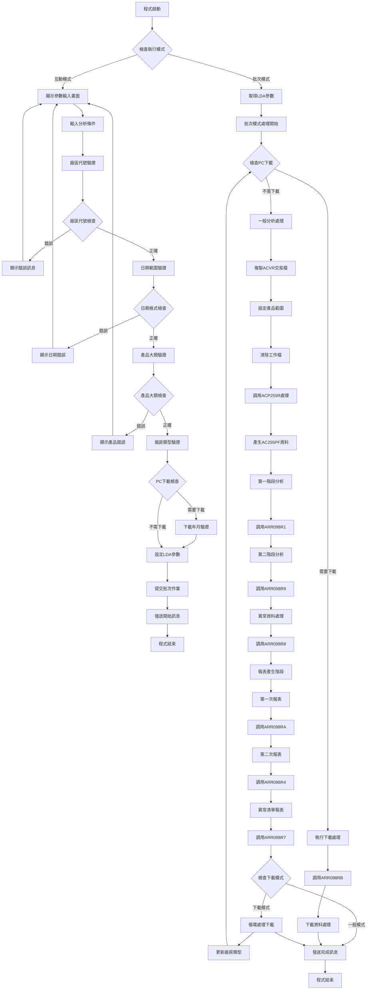
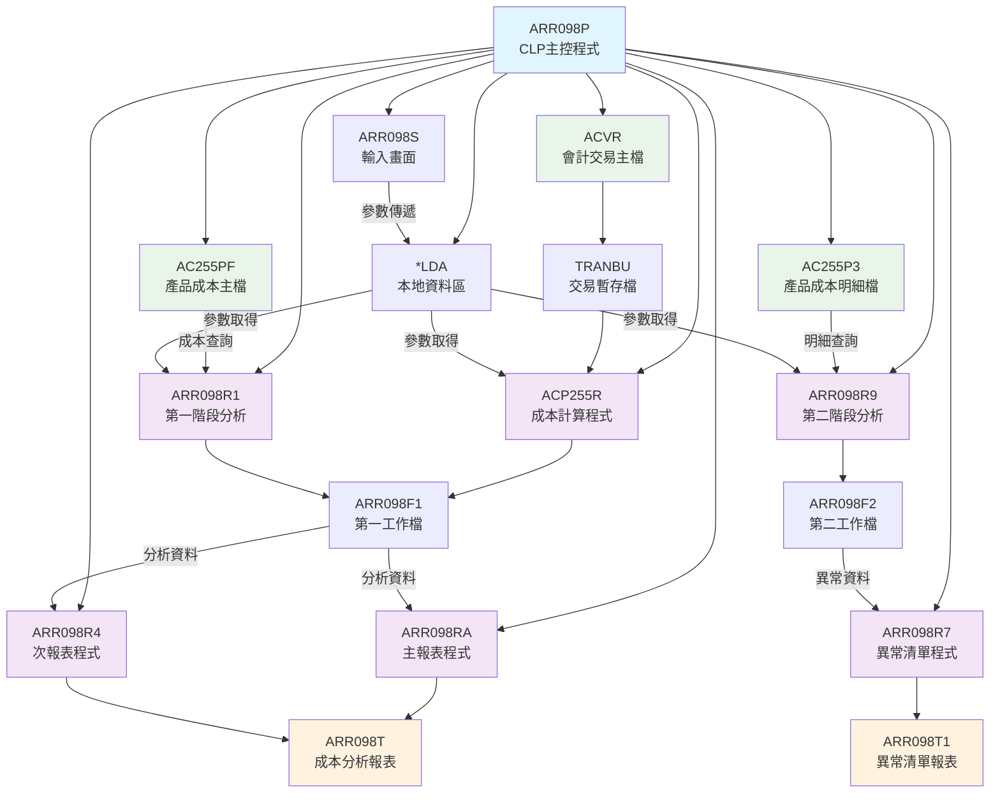
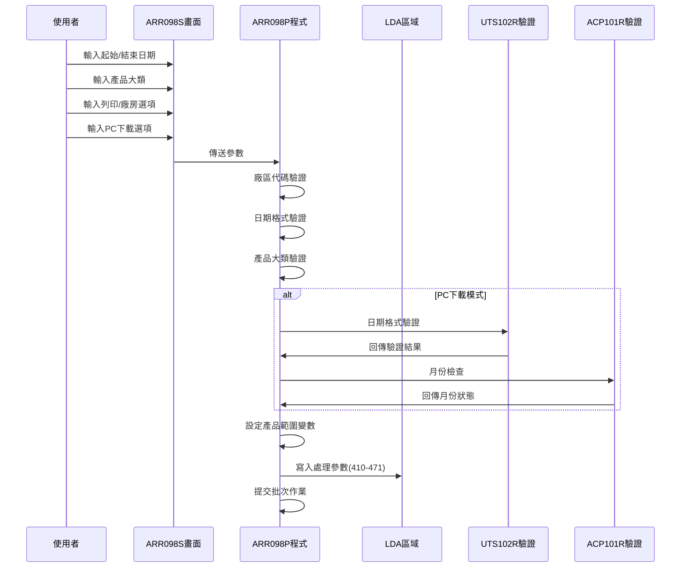
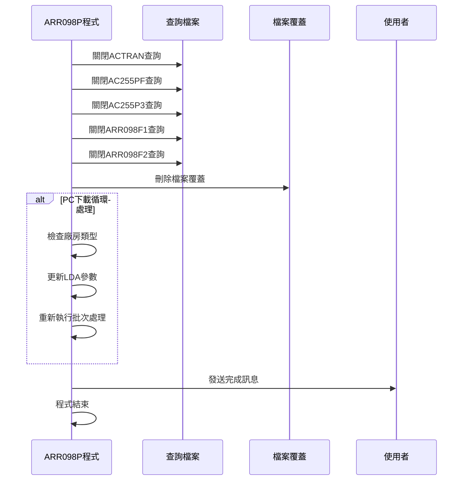
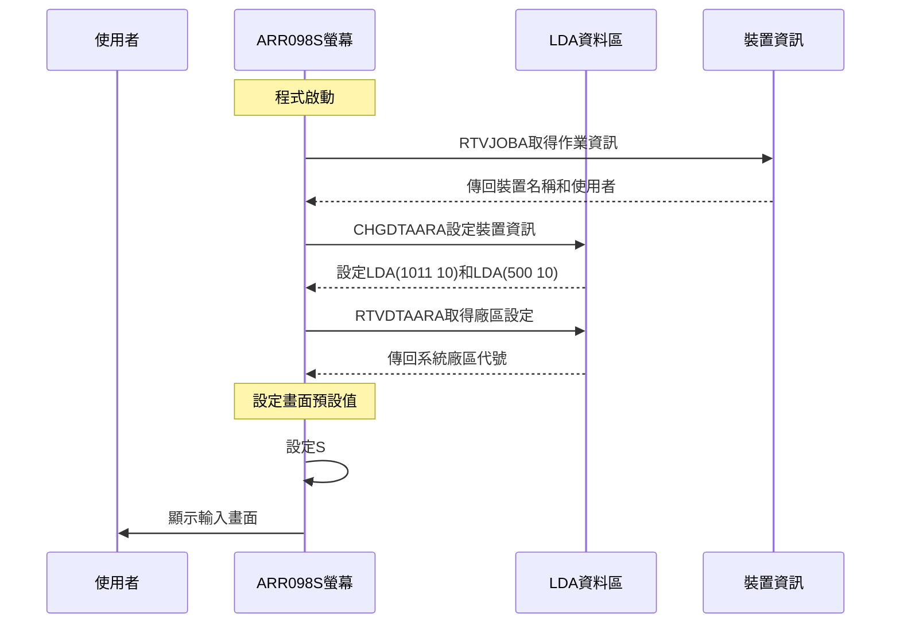
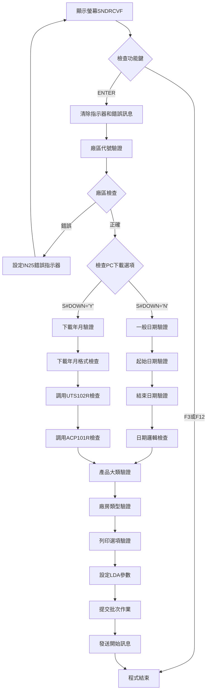
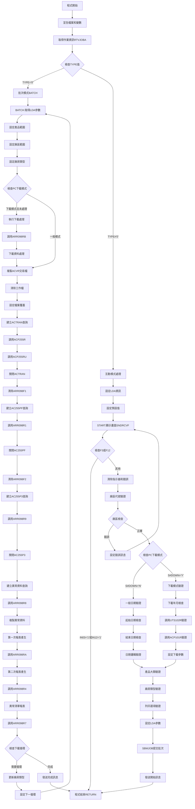
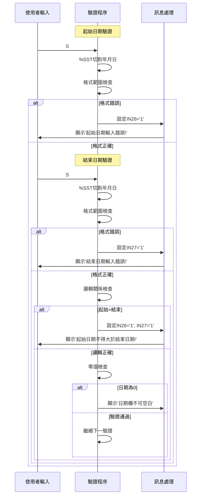
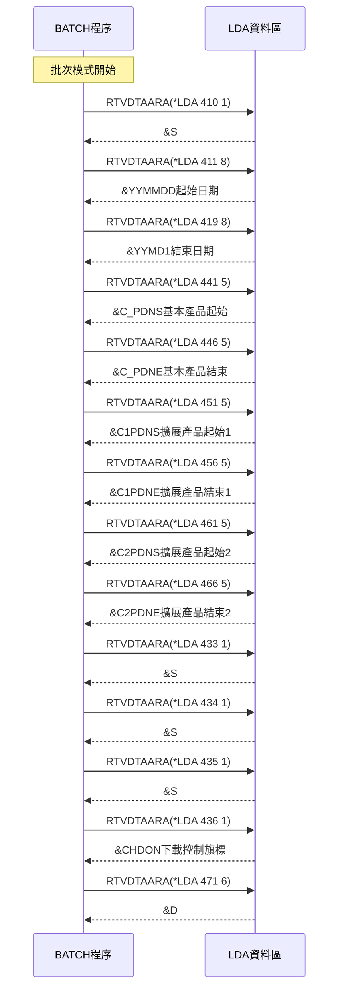

# ARR098P_U01 程式規格書

## 1. 基本資料

| 項目 | 內容 |
|------|------|
| **程式編號** | ARR098P |
| **程式名稱** | 智慧成本分析表 |
| **程式類型** | CLP |
| **廠區** | U01 |
| **系統名稱** | 應收帳款系統 |
| **子系統** | 成本分析報表處理 |
| **檔案位置** | U01CLSRC_THSRC/ARR098P.txt |

## 2. 🎯 程式功能說明

### 主要功能描述
ARR098P是智慧成本分析表的主控程式，負責產生詳細的成本分析報表。程式支援多廠區成本分析(K/T/M/L/H/U/P)、多產品大類分析(鋼軋/鋼捲/熱軋/冷軋/型鋼/其他)、廠房類型分析(廠房/廠房/兩者併計)，並提供PC下載功能和批次處理能力。

### 🎯 業務流程詳細說明

#### 完整業務流程圖


#### 業務流程關鍵階段說明

**階段一：參數收集與多重驗證**
- 廠區代號驗證：支援K/T/M/L/H/U/P七個廠區
- 日期範圍驗證：起始日期不可大於結束日期，日期格式YYYYMMDD
- 產品大類驗證：2(鋼軋)/3(鋼捲)/4(熱軋)/5(冷軋)/6(型鋼)/9(其他)
- 廠房類型驗證：1(廠房)/2(廠房)/3(兩者併計)
- PC下載驗證：Y/N選項，Y時需輸入下載年月

**階段二：產品範圍動態設定**
- 產品2：鋼軋類產品(100-299, 1AAA-2999)
- 產品3：鋼捲類產品(300-399, 33AA-3399)
- 產品4：熱軋類產品(400-499, 34AA-3499, 39AA-3999)
- 產品5：冷軋類產品(500-599, 35AA-3599)
- 產品6：型鋼類產品(600-699, 36AA-3699, 38AA-3899)
- 產品9：其他類產品(900-999, 37AA-3799)
- 空白：全部產品範圍(100-999, 1AAA-3999)

**階段三：多階段成本分析處理**
- 第一階段：ACVR交易檔複製和初步處理
- 第二階段：AC255PF產品成本檔分析處理
- 第三階段：ARR098F1工作檔建立和異常處理
- 第四階段：多重報表產生和PC下載處理

**階段四：報表產生與下載**
- 智慧成本分析主報表(ARR098T)
- 異常資料清單報表(ARR098T1)
- 支援PC下載模式的循環處理
- 支援列印包含或不包含零值資料選項

## 3. 🎯 檔案架構與關聯圖

### 使用檔案清單

| 檔案名稱 | 檔案類型 | 用途說明 |
|----------|----------|----------|
| **ARR098S** | 螢幕檔案 | 參數輸入畫面 |
| **ACVR** | 資料檔案 | 會計交易主檔(主要資料來源) |
| **AC255PF** | 資料檔案 | 產品成本主檔 |
| **AC255P3** | 資料檔案 | 產品成本明細檔 |
| **ACPROD** | 資料檔案 | 產品主檔 |
| **ARR098F1** | 工作檔案 | 第一階段分析工作檔 |
| **ARR098F2** | 工作檔案 | 第二階段分析工作檔 |
| **ARR098FD** | 工作檔案 | 下載資料工作檔 |
| **ARR098FZ** | 工作檔案 | 異常資料暫存檔 |
| **ARR098T** | 列印檔案 | 智慧成本分析報表 |
| **ARR098T1** | 列印檔案 | 異常資料清單報表 |
| **TRANBU** | 暫存檔案 | 交易資料暫存檔 |

### 使用子程式清單

| 程式名稱 | 程式用途 | 呼叫時機 |
|----------|----------|----------|
| **ACP255R** | 產品成本計算主程式 | 批次模式初期處理 |
| **ACP255RU** | 產品成本更新程式 | 成本資料更新 |
| **ARR098R1** | 第一階段分析程式 | AC255PF資料分析 |
| **ARR098R4** | 第二次報表產生程式 | 最終報表產生 |
| **ARR098R7** | 異常清單產生程式 | 異常資料報表 |
| **ARR098R8** | 異常資料處理程式 | 異常資料篩選 |
| **ARR098R9** | 第二階段分析程式 | AC255P3資料分析 |
| **ARR098RA** | 第一次報表產生程式 | 主要報表產生 |
| **ARR098RB** | PC下載處理程式 | 下載資料處理 |
| **ARR098RC** | 最終成本計算程式 | 成本計算處理 |
| **UTS102R** | 月末日期檢查程式 | 下載年月驗證 |
| **ACP101R** | 月份檢查程式 | 下載月份驗證 |

### 🎯 檔案關聯詳細視覺化圖表



### 🎯 資料流向詳細說明

#### 互動處理階段的資料流向


#### 環境清理階段的資料流向


## 4. 🎯 檔案欄位規格說明

### 主要資料結構

#### ARR098S螢幕檔案欄位定義

| 欄位名稱 | 位置 | 長度 | 型態 | 屬性 | 說明 |
|----------|------|------|------|------|------|
| **S#DEVN** | 2,70 | 10 | CHAR | 輸出 | 裝置名稱 |
| **S#USER** | 3,2 | 10 | CHAR | 輸出 | 使用者代號 |
| **S#AREA** | 6,31 | 1 | CHAR | 輸入 | 廠區代號 |
| **S#YYMM** | 8,31 | 8 | NUMERIC | 輸入 | 起始日期 |
| **S#YYM1** | 8,46 | 8 | NUMERIC | 輸入 | 結束日期 |
| **S#PDNM** | 10,31 | 1 | CHAR | 輸入 | 產品大類 |
| **S#CUTY** | 14,31 | 1 | CHAR | 輸入 | 廠房類型 |
| **S#OPT** | 16,64 | 1 | CHAR | 輸入 | 列印選項 |
| **S#DOWN** | 18,25 | 1 | CHAR | 輸入 | PC下載選項 |
| **S#YM** | 20,25 | 6 | NUMERIC | 輸入 | 下載年月 |
| **S#ERR** | 24,2 | 70 | CHAR | 輸出 | 錯誤訊息 |

### 🔍 重點欄位切割技術詳解

#### LDA參數區域完整切割視覺化

**LDA參數配置總覽**：
```
LDA (1024位元):  [............|X|XXXXXXXX|XXXXXXXX|...|XXXXX|XXXXX|XXXXX|XXXXX|XXXXX|XXXXX|X|X|X|X|XXXXXX|...]
位置:             ...      410 411      419      ...  441   446   451   456   461   466 433 434 435 436   471  ...
                           ↓   ↓        ↓        ...   ↓     ↓     ↓     ↓     ↓     ↓   ↓   ↓   ↓   ↓     ↓   ...
位置410-410: S#AREA       [X]                                                                                      廠區代號
位置411-418: YYMMDD         [XXXXXXXX]                                                                             起始日期(YYYYMMDD)
位置419-426: YYMD1                  [XXXXXXXX]                                                                     結束日期(YYYYMMDD)
位置441-445: C_PDNS                                [XXXXX]                                                         產品起始編號
位置446-450: C_PDNE                                      [XXXXX]                                                   產品結束編號
位置451-455: C1PDNS                                             [XXXXX]                                            產品擴展起始編號1
位置456-460: C1PDNE                                                 [XXXXX]                                        產品擴展結束編號1
位置461-465: C2PDNS                                                         [XXXXX]                                產品擴展起始編號2
位置466-470: C2PDNE                                                              [XXXXX]                           產品擴展結束編號2
位置433-433: S#OPT                                                                     [X]                         列印選項
位置434-434: S#CUTY                                                                         [X]                    廠房類型
位置435-435: S#DOWN                                                                            [X]                 PC下載選項
位置436-436: CHDON                                                                                 [X]             下載控制旗標
位置471-476: D#YM                                                                                      [XXXXXX]    下載年月(YYYYMM)

系統區域:
位置1011-1020: S#DEVN [XXXXXXXXXX]                 裝置名稱
位置1021-1021: AREA   [X]                          系統廠區設定
```

#### 日期欄位切割技術詳解

**日期分解處理邏輯**：
```
原始輸入: S#YYMM = 20241228 (8位數YYYYMMDD)
         S#YYM1 = 20241231 (8位數YYYYMMDD)

切割處理:
DATE = S#YYMM = [2|0|2|4|1|2|2|8]
                 ↓ ↓ ↓ ↓ ↓ ↓ ↓ ↓
                 1 2 3 4 5 6 7 8

YARS = %SST(DATE 1 4) = [2024]     年份部分(位置1-4)
MONS = %SST(DATE 5 2) = [12]       月份部分(位置5-6)  
DAYS = %SST(DATE 7 2) = [28]       日期部分(位置7-8)

類似處理結束日期:
DATE = S#YYM1 = [2|0|2|4|1|2|3|1]
YARE = %SST(DATE 1 4) = [2024]     結束年份
MONE = %SST(DATE 5 2) = [12]       結束月份
DAYE = %SST(DATE 7 2) = [31]       結束日期
```

**LDA日期格式轉換**：
```
互動模式設定:
YYMMDD = S#YYMM = [20241228]  → LDA(411 8)
YYMD1  = S#YYM1 = [20241231]  → LDA(419 8)

批次模式取得:
RTVDTAARA DTAARA(*LDA (411 8)) RTNVAR(&YYMMDD)
RTVDTAARA DTAARA(*LDA (419 8)) RTNVAR(&YYMD1)

進一步切割:
MMF = %SST(YYMMDD 5 2) = [12]     起始月份
MMT = %SST(YYMD1  5 2) = [12]     結束月份
Y   = %SST(YYMMDD 1 4) = [2024]   起始年份
Y1  = %SST(YYMD1  1 4) = [2024]   結束年份

月份格式組合:
YMS  = Y || MMF = [2024] + [12] = [202412]   起始年月
YMS1 = Y1|| MMT = [2024] + [12] = [202412]   結束年月
```

#### 產品範圍切割設定詳解

**產品大類範圍切割邏輯**：
```
產品2(鋼軋):
基本範圍:    C_PDNS='100  ', C_PDNE='299  '    [100  ] 到 [299  ]
擴展範圍1:   C1PDNS='1AAA ', C1PDNE='2999 '    [1AAA ] 到 [2999 ]
擴展範圍2:   C2PDNS='1AAA ', C2PDNE='2999 '    [1AAA ] 到 [2999 ]

產品3(鋼捲):
基本範圍:    C_PDNS='300  ', C_PDNE='399  '    [300  ] 到 [399  ]
擴展範圍1:   C1PDNS='33AA ', C1PDNE='3399 '    [33AA ] 到 [3399 ]
擴展範圍2:   C2PDNS='33AA ', C2PDNE='3399 '    [33AA ] 到 [3399 ]

產品4(熱軋):
基本範圍:    C_PDNS='400  ', C_PDNE='499  '    [400  ] 到 [499  ]
擴展範圍1:   C1PDNS='34AA ', C1PDNE='3499 '    [34AA ] 到 [3499 ]
擴展範圍2:   C2PDNS='39AA ', C2PDNE='3999 '    [39AA ] 到 [3999 ] (跳躍範圍)

產品5(冷軋):
基本範圍:    C_PDNS='500  ', C_PDNE='599  '    [500  ] 到 [599  ]
擴展範圍1:   C1PDNS='35AA ', C1PDNE='3599 '    [35AA ] 到 [3599 ]
擴展範圍2:   C2PDNS='35AA ', C2PDNE='3599 '    [35AA ] 到 [3599 ] (同擴展1)

產品6(型鋼):
基本範圍:    C_PDNS='600  ', C_PDNE='699  '    [600  ] 到 [699  ]
擴展範圍1:   C1PDNS='36AA ', C1PDNE='3699 '    [36AA ] 到 [3699 ]
擴展範圍2:   C2PDNS='38AA ', C2PDNE='3899 '    [38AA ] 到 [3899 ] (跳躍範圍)

產品9(其他):
基本範圍:    C_PDNS='900  ', C_PDNE='999  '    [900  ] 到 [999  ]
擴展範圍1:   C1PDNS='37AA ', C1PDNE='3799 '    [37AA ] 到 [3799 ]
擴展範圍2:   C2PDNS='37AA ', C2PDNE='3799 '    [37AA ] 到 [3799 ] (同擴展1)

全部產品:
基本範圍:    C_PDNS='100  ', C_PDNE='999  '    [100  ] 到 [999  ]
擴展範圍1:   C1PDNS='1AAA ', C1PDNE='3999 '    [1AAA ] 到 [3999 ]
擴展範圍2:   C2PDNS='1AAA ', C2PDNE='3999 '    [1AAA ] 到 [3999 ]
```

#### ARR098R1程式DS結構切割

**產品編號DS結構**：
```
F1PDNM (5位元):    [XX|X|X|X]
位置:               1 2 3 4 5
                    ↓ ↓ ↓ ↓ ↓
位置1-2: W#PDN1    [XX]           產品前2位代碼
位置2-2: D#PDN2    [X]            產品第2位分類  
位置3-3: D#PDN3    [X]            產品第3位分類
位置4-4: D#PDN4    [X]            產品第4位分類

切割示例:
F1PDNM = '33A1B'
         ↓
W#PDN1 = '33' (位置1-2)    產品類別
D#PDN2 = '3'  (位置2)      次分類
D#PDN3 = 'A'  (位置3)      詳分類  
D#PDN4 = '1'  (位置4)      細分類
```

**成本代碼DS結構**：
```
F1COD1 (3位元):    [X|XX]
位置:               1 2 3
                    ↓ ↓ ↓
位置1-1: D#COD1    [X]            成本代碼類別

切割示例:
F1COD1 = '3AB'
         ↓  
D#COD1 = '3'  (位置1)      成本類別代碼
```

#### MAPFLD欄位對應切割視覺化

**ACVR檔案MAPFLD轉換**：
```
原始檔案欄位 → MAPFLD轉換 → 查詢使用欄位

ACYMD (8位數值) → YMD (*CHAR 8) → 日期字元格式
[20241228]         [20241228]      查詢條件用

ACDSC1 (描述1) → DSC1 ('%SST(ACDSC1 1 5)' *CHAR 5) → 描述前5位
[ABCDEFGH]        [ABCDE]                           產品識別用
```

**AC255PF檔案MAPFLD轉換**：
```
原始檔案欄位 → MAPFLD轉換 → 查詢使用欄位

A1PRNO (5位產品編號) → 直接使用 → 產品編號比較
[33A1B]                [33A1B]    範圍篩選用

A1PRNO第4位 → PRD4 ('%SST(A1PRNO 4 1)' *CHAR 1) → 產品分類
[33A1B]       [1]                                   分類判斷用
```

**ARR098F1檔案MAPFLD轉換**：
```
原始檔案欄位 → MAPFLD轉換 → 查詢使用欄位

F1PDNM (5位產品編號) → F1AREA ('%SST(F1PDNM 1 1)' *CHAR 1) → 廠區代碼
[H3A1B]                [H]                                     廠區分組用

切割邏輯:
F1PDNM第1位 = 廠區代碼 (H/K/T/M/L/U/P)
用於報表分組和廠區篩選
```

#### 🎯 廠房類型參數切割分析

**廠房類型對應處理**：
```
輸入值='1' (廠房):
CUTYD = 'D'    [D]     廠房代碼起始
CUTYE = 'D'    [D]     廠房代碼結束
查詢條件: ACNO等於廠房相關科目(4111, 4112, 410101-410103, 4113)

輸入值='2' (廠房):  
CUTYD = 'E'    [E]     廠房代碼起始
CUTYE = 'E'    [E]     廠房代碼結束
查詢條件: ACNO等於廠房相關科目(4114, 4115, 410104-410106, 4116)

輸入值='3' (兩者):
CUTYD = 'D'    [D]     廠房代碼起始
CUTYE = 'G'    [G]     廠房代碼結束(包含D到G範圍)
查詢條件: ACNO等於所有科目(4111-4116, 410101-410106)
```

#### PC下載模式切割邏輯

**下載年月處理**：
```
下載選項='Y'時:
S#YM = 202412 (6位數YYYYMM)
     ↓
D#YM = S#YM = [202412]         下載年月
D#YMD = D#YM + '01' = [20241201]  月初日期
D#YMD = D#YM + '31' = [20241231]  月末日期

LDA設定:
位置471-476: D#YM = [202412]   下載年月設定
位置435-435: S#DOWN = 'Y'      下載旗標設定
位置436-436: CHDON = 'N'       下載控制初始化
```

**下載循環控制切割**：
```
下載模式處理流程:
1. 第一次: S#CUTY='1' → 處理廠房資料
2. 自動更新: LDA(434 1)='2', LDA(436 1)='Y'  
3. 第二次: S#CUTY='2' → 處理廠房資料
4. 自動更新: LDA(434 1)='3'
5. 第三次: S#CUTY='3' → 處理兩者資料
6. 結束循環

控制變數切割:
CHDON = 'N' → 第一次執行
CHDON = 'Y' → 後續循環執行
S#CUTY遞增控制循環次數
```

#### 🎯 欄位挪用詳細分析

**挪用情況對比表**：

| 原始欄位 | 原始用途 | 實際使用方式 | 挪用說明 |
|----------|----------|-------------|----------|
| **C_PDNS/C_PDNE** | 基本產品範圍 | 主要產品編號範圍 | 用於基本產品篩選 |
| **C1PDNS/C1PDNE** | 擴展產品範圍1 | 字母產品編號範圍 | 用於字母開頭產品 |
| **C2PDNS/C2PDNE** | 擴展產品範圍2 | 特殊產品編號範圍 | 用於跳躍式產品範圍 |
| **CUTYD/CUTYE** | 廠房類型範圍 | 科目代碼篩選 | 轉換為會計科目查詢 |
| **CHDON** | 下載控制旗標 | 循環執行控制 | 控制PC下載多次執行 |

**挪用原因深度分析**：
- 產品編號複雜性：數字+字母混合編號需要多重範圍篩選
- 廠房類型轉換：使用者友善的廠房選項轉為會計科目查詢條件
- 下載循環需求：PC下載模式需要自動循環處理多種廠房類型
- 彈性查詢設計：支援複雜的OR條件和跳躍式範圍查詢

## 5. 🎯 輸出/入螢幕布局

### 螢幕布局完整視覺化

```
+----------------------------------------------------------+
| 2024/12/28      東豐鋼鐵股份有限公司-應收帳款處理作業    ARR098S |
| 14:30:25                智慧成本分析表                   |
| SYSUSER                                                  |
|                                                          |
|                                                          |
|                 廠區代號: [_]                             |
|                                                          |
|               入庫日期:[____/__/__] ~ [____/__/__]       |
|                           (請輸入完整日期)               |
|                                                          |
|               產品大類: [_] (2:鋼軋(含鋼筋) , 3:鋼捲)     |
|                           4:熱軋, 5:冷軋 , 6:型鋼類,     |
|                           9:其他,空白表示全部)           |
|                                                          |
|               廠房類型:[_] (1:廠房2:廠房3:兩者)           |
|                                                          |
|               列印時是否包含成本分析表和異常成本分析表的零值: [_] |
|                                                          |
|               PC下載: [_] (Y/N；Y=下載，同時產生         |
|                            廠房和兩者的報表)             |
|                                                          |
|               下載年月: [____/__] (請輸入下載年月)        |
|                                                          |
|                                                          |
| PF3=結束作業          PF12=回前畫面                      |
| [錯誤訊息顯示區]                                          |
+----------------------------------------------------------+
```

### 🎯 螢幕欄位詳細說明

#### 螢幕欄位屬性完整解析

| 欄位名稱 | 中文說明 | 欄位型態 | 屬性分析 | 驗證規則 | 預設行為 |
|----------|----------|----------|----------|----------|----------|
| **S#AREA** | 廠區代號 | 1A B | 字元輸入欄位 | 必須為K/T/M/L/H/U/P | 系統LDA設定值 |
| **S#YYMM** | 起始日期 | 8Y 0B | 數值輸入欄位 | YYYYMMDD格式，不可為0 | 無預設值 |
| **S#YYM1** | 結束日期 | 8Y 0B | 數值輸入欄位 | YYYYMMDD格式，不可小於起始日期 | 無預設值 |
| **S#PDNM** | 產品大類 | 1A B | 字元輸入欄位 | 2/3/4/5/6/9或空白 | '2' |
| **S#CUTY** | 廠房類型 | 1A B | 字元選擇欄位 | VALUES('1' '2' '3' '4') | 無預設值 |
| **S#OPT** | 列印選項 | 1A B | 字元選擇欄位 | VALUES('Y' 'N') | 'Y' |
| **S#DOWN** | PC下載選項 | 1A B | 字元選擇欄位 | VALUES('N' 'Y') | 'N' |
| **S#YM** | 下載年月 | 6Y 0B | 數值輸入欄位 | YYYYMM格式，下載時必填 | 無預設值 |

#### 🎯 螢幕輸入驗證詳解

**廠區代號驗證邏輯**：
```
允許的廠區代號:
'K' → 基隆廠區
'T' → 台北廠區  
'M' → 台中廠區
'L' → 台南廠區
'H' → 高雄廠區
'U' → 聯合廠區
'P' → 其他廠區

驗證條件:
IF COND((&S#AREA *NE 'K') *AND (&S#AREA *NE 'T') *AND
        (&S#AREA *NE 'M') *AND (&S#AREA *NE 'L') *AND  
        (&S#AREA *NE 'H') *AND (&S#AREA *NE 'U') *AND
        (&S#AREA *NE 'P')) THEN(DO)

錯誤訊息: '廠區別輸入錯誤!'
```

**日期範圍驗證邏輯**：
```
起始日期驗證:
1. 格式檢查: YYYYMMDD (8位數字)
2. 年份檢查: YYYY範圍0001-9999
3. 月份檢查: MM範圍01-12  
4. 日期檢查: DD範圍01-32
5. 非零檢查: 不可為00000000

結束日期驗證:
1. 同起始日期格式檢查
2. 邏輯檢查: 不可小於起始日期

範例:
輸入: S#YYMM=20241301 → 錯誤(月份13無效)
輸入: S#YYMM=20241228, S#YYM1=20241225 → 錯誤(結束日期小於起始日期)
輸入: S#YYMM=20241228, S#YYM1=20241231 → 正確
```

**產品大類驗證邏輯**：
```
有效產品大類:
'2' → 鋼軋(含鋼筋)
'3' → 鋼捲
'4' → 熱軋  
'5' → 冷軋
'6' → 型鋼類
'9' → 其他
' ' → 全部(空白)

驗證條件與產品範圍對應:
每個產品大類對應不同的產品編號範圍設定
影響後續OPNQRYF的產品篩選條件
```

**PC下載模式驗證**：
```
下載選項='Y'時額外驗證:
1. 下載年月不可為0
2. 下載年月格式YYYYMM (6位數字)
3. 調用UTS102R檢查月末日期有效性
4. 調用ACP101R檢查月份合理性

下載年月處理邏輯:
D#YMD = D#YM + '01'  生成月初日期
調用UTS102R檢查該月是否有效
調用ACP101R檢查是否允許下載該月份
```

### 🎯 螢幕控制與使用者互動

#### 螢幕顯示控制邏輯

**初始化顯示序列**：


**輸入處理循環**：


#### 🎯 使用者體驗設計分析

**畫面友善性設計**：
- **多重提示文字**：每個選擇欄位都有詳細的選項說明和範例
- **格式化顯示**：日期欄位使用EDTWRD格式化顯示為YYYY/MM/DD
- **條件式顯示**：下載年月欄位僅在PC下載='Y'時需要填寫
- **錯誤高亮顯示**：錯誤欄位使用PC(高亮)和RI(反向)屬性突出

**複雜驗證設計**：
- **多層次驗證**：廠區→日期→產品→廠房→下載的順序驗證
- **關聯式驗證**：下載選項影響年月欄位的必填性
- **業務邏輯驗證**：調用外部程式進行複雜的月份和日期檢查
- **即時錯誤回饋**：每個驗證錯誤都有明確的錯誤訊息和欄位指示

### 功能鍵詳細定義

| 功能鍵 | 處理邏輯 | 系統行為 | 說明 | 技術實作 |
|--------|----------|----------|------|----------|
| **F3** | CF03 | 程式結束 | 結束作業 | 設定&IN03='1' |
| **F12** | CF12 | 程式結束 | 回前畫面 | 設定&IN12='1' |
| **ENTER** | - | 參數驗證 | 執行驗證及批次提交 | 正常SNDRCVF返回 |

#### 🎯 功能鍵處理詳細邏輯

**F3/F12處理流程**：
```
IF COND(&IN03 *EQ '1') THEN(RETURN)
IF COND(&IN12 *EQ '1') THEN(RETURN)

處理邏輯:
1. 檢查指示器&IN03或&IN12是否為'1'
2. 如果任一為真，直接執行RETURN
3. 不執行任何清理動作
4. 立即結束程式返回上層
```

**ENTER鍵處理流程**：
```
正常處理順序:
1. SNDRCVF等待使用者輸入
2. 使用者按ENTER，畫面資料傳回程式
3. 清除所有指示器: IN25-IN31='0'
4. 清除錯誤訊息: S#ERR=' '
5. 執行多重參數驗證
6. 設定LDA參數區域
7. 提交批次作業SBMJOB
8. 發送訊息通知使用者
9. 程式結束
```

## 6. 🎯 處理流程程序說明

### 🎯 主程序邏輯深度分析

#### 程式執行流程圖


### 🎯 子程序詳細分析

#### 初始化程序 (程式啟動至模式判斷)

**變數宣告與初始化**：
```
關鍵變數宣告群組:

日期相關變數:
DCL VAR(&YYMMDD) TYPE(*CHAR) LEN(8)    ' 起始日期
DCL VAR(&YYMD1)  TYPE(*CHAR) LEN(8)    ' 結束日期  
DCL VAR(&DATE)   TYPE(*CHAR) LEN(8)    ' 日期工作變數
DCL VAR(&MONS)   TYPE(*CHAR) LEN(2)    ' 起始月份
DCL VAR(&MONE)   TYPE(*CHAR) LEN(2)    ' 結束月份
DCL VAR(&YARS)   TYPE(*CHAR) LEN(4)    ' 起始年份
DCL VAR(&YARE)   TYPE(*CHAR) LEN(4)    ' 結束年份

產品範圍變數群組:
DCL VAR(&C_PDNS) TYPE(*CHAR) LEN(5)    ' 基本產品起始
DCL VAR(&C_PDNE) TYPE(*CHAR) LEN(5)    ' 基本產品結束
DCL VAR(&C1PDNS) TYPE(*CHAR) LEN(5)    ' 擴展產品起始1
DCL VAR(&C1PDNE) TYPE(*CHAR) LEN(5)    ' 擴展產品結束1
DCL VAR(&C2PDNS) TYPE(*CHAR) LEN(5)    ' 擴展產品起始2
DCL VAR(&C2PDNE) TYPE(*CHAR) LEN(5)    ' 擴展產品結束2

廠房控制變數:
DCL VAR(&CUTYD)  TYPE(*CHAR) LEN(1)    ' 廠房類型起始
DCL VAR(&CUTYE)  TYPE(*CHAR) LEN(1)    ' 廠房類型結束

下載控制變數:
DCL VAR(&CHDON)  TYPE(*CHAR) LEN(1)    ' 下載控制旗標
DCL VAR(&D#YMD)  TYPE(*CHAR) LEN(8)    ' 下載日期
DCL VAR(&D#YM)   TYPE(*CHAR) LEN(6)    ' 下載年月
```

**系統環境初始化**：
```
RTVJOBA JOB(&S#DEVN) USER(&S#USER) OUTQ(&OUTQ) TYPE(&TYPE)

環境設定:
1. 取得作業名稱(&S#DEVN)
2. 取得使用者代號(&S#USER)  
3. 取得輸出佇列(&OUTQ)
4. 取得作業類型(&TYPE)

LDA設定:
CHGDTAARA DTAARA(*LDA (1011 10)) VALUE(&S#DEVN)  ' 裝置名稱
CHGDTAARA DTAARA(*LDA (500 10))  VALUE(&DSPID)   ' 顯示ID
RTVDTAARA DTAARA(*LDA (1021 1))  RTNVAR(&S#AREA) ' 系統廠區

預設值設定:
CHGVAR VAR(&S#PDNM) VALUE('2')   ' 預設產品大類=鋼軋
CHGVAR VAR(&S#OPT)  VALUE('Y')   ' 預設列印選項=是
CHGVAR VAR(&S#DOWN) VALUE('N')   ' 預設下載選項=否
```

#### 🎯 複雜驗證程序詳解

**多重日期驗證邏輯**：


**PC下載模式複雜驗證**：
```
下載模式驗證流程:

步驟1: 基本格式檢查
IF COND(&S#DOWN *EQ 'Y' *AND &S#YM *EQ 0) THEN(DO)
    錯誤處理: '下載年月不可空白'
ENDDO

步驟2: 月末日期檢查
CHGVAR VAR(&D#YM)   VALUE(&S#YM)
CHGVAR VAR(&D#YMD)  VALUE(&D#YM || '01')
CHGVAR VAR(&W#MOD)  VALUE('1')
CALL PGM(UTLIB/UTS102R) PARM(&D#YMD &W#MOD &W#MTL &W#LY &W#ERR)

UTS102R參數說明:
&D#YMD: 輸入月份+01日期
&W#MOD: 模式='1'(月末檢查)
&W#MTL: 傳回月末天數
&W#LY:  傳回是否閏年
&W#ERR: 傳回錯誤代碼

步驟3: 月份權限檢查  
CALL PGM(ACP101R) PARM(&D#YM &P#CODE)

ACP101R參數說明:
&D#YM:   輸入年月
&P#CODE: 傳回權限代碼('1'=允許)

步驟4: 下載日期設定
IF 驗證通過 THEN(DO)
    CHGVAR VAR(&YYMMDD) VALUE(&D#YMD)      ' 設定起始日期
    CHGVAR VAR(&D#YMD)  VALUE(&D#YM||'31') ' 生成月末日期  
    CHGVAR VAR(&YYMD1)  VALUE(&D#YMD)      ' 設定結束日期
ENDDO
```

#### 🎯 產品範圍動態設定程序

**產品大類判斷與設定**：
```
產品範圍設定決策樹:

S#PDNM='2' (鋼軋):
├─ C_PDNS='100  ', C_PDNE='299  '    基本數字範圍
├─ C1PDNS='1AAA ', C1PDNE='2999 '    擴展字母範圍
└─ C2PDNS='1AAA ', C2PDNE='2999 '    重複範圍(相同)

S#PDNM='3' (鋼捲):  
├─ C_PDNS='300  ', C_PDNE='399  '    基本數字範圍
├─ C1PDNS='33AA ', C1PDNE='3399 '    擴展字母範圍
└─ C2PDNS='33AA ', C2PDNE='3399 '    重複範圍(相同)

S#PDNM='4' (熱軋):
├─ C_PDNS='400  ', C_PDNE='499  '    基本數字範圍
├─ C1PDNS='34AA ', C1PDNE='3499 '    主要字母範圍  
└─ C2PDNS='39AA ', C2PDNE='3999 '    跳躍字母範圍

S#PDNM='5' (冷軋):
├─ C_PDNS='500  ', C_PDNE='599  '    基本數字範圍
├─ C1PDNS='35AA ', C1PDNE='3599 '    擴展字母範圍
└─ C2PDNS='35AA ', C2PDNE='3599 '    重複範圍(相同)

S#PDNM='6' (型鋼):
├─ C_PDNS='600  ', C_PDNE='699  '    基本數字範圍
├─ C1PDNS='36AA ', C1PDNE='3699 '    主要字母範圍
└─ C2PDNS='38AA ', C2PDNE='3899 '    跳躍字母範圍

S#PDNM='9' (其他):
├─ C_PDNS='900  ', C_PDNE='999  '    基本數字範圍
├─ C1PDNS='37AA ', C1PDNE='3799 '    擴展字母範圍
└─ C2PDNS='37AA ', C2PDNE='3799 '    重複範圍(相同)

S#PDNM=' ' (全部):
├─ C_PDNS='100  ', C_PDNE='999  '    全部數字範圍
├─ C1PDNS='1AAA ', C1PDNE='3999 '    全部字母範圍
└─ C2PDNS='1AAA ', C2PDNE='3999 '    重複範圍(相同)
```

### 🎯 批次模式處理程序詳解

#### LDA參數完整取回邏輯

**參數取得序列**：


#### 🎯 複雜檔案處理程序

**ACVR交易檔複製邏輯**：
```
廠區條件判斷複製:

IF COND((&AREA *NE 'T') *AND (&AREA *NE 'U') *AND (&AREA *NE 'H')) THEN(DO)
    ' 非T/U/H廠區使用限制複製
    CPYF FROMFILE(DALIB/ACVR) TOFILE(QTEMP/TRANBU) +
         MBROPT(*REPLACE) CRTFILE(*YES) +
         INCREL((*IF ACYM *GE &YMS) (*AND ACYM *LE &YMS1))
ENDDO
ELSE (DO)
    ' T/U/H廠區使用完整複製
    CPYF FROMFILE(DALIB/ACVR) TOFILE(QTEMP/TRANBU) +
         MBROPT(*REPLACE) CRTFILE(*YES) +
         INCREL((*IF ACYM *GE &YMS) (*AND ACYM *LE &YMS1))
ENDDO

複製參數說明:
MBROPT(*REPLACE): 取代方式建立
CRTFILE(*YES):    自動建立檔案
INCREL:           包含記錄條件
ACYM:             會計年月欄位
&YMS:             起始年月變數
&YMS1:            結束年月變數
```

**複雜OPNQRYF建立**：
```
ACTRAN檔案查詢建立(廠房類型='3'的情況):

OPNQRYF FILE((ACTRAN)) QRYSLT('
((ACNO *EQ "4111" ) *OR (ACNO *EQ "4114" ) *OR 
 (ACNO *EQ "4112" ) *OR (ACNO *EQ "4115" ) *OR
 (ACNO *EQ "4113" ) *OR (ACNO *EQ "410101") *OR
 (ACNO *EQ "410104") *OR (ACNO *EQ "410102") *OR  
 (ACNO *EQ "410105") *OR (ACNO *EQ "410103") *OR
 (ACNO *EQ "410106") *OR (ACNO *EQ "4116" )) *AND
(YMD *GE "' || &C_DATS || '") *AND
(YMD *LE "' || &C_DATE || '") *AND  
(ACCARD *GE "' || &ARES || '") *AND
(ACCARD *LE "' || &AREE || '") *AND
(%SST(ACVRNO 1 1) *NE "X")') +
MAPFLD((YMD ACYMD *CHAR 8) +
       (DSC1 '%SST(ACDSC1 1 5)' *CHAR 5)) +
KEYFLD((ACYM) (ACCARD) (DSC1) (ACDSC3))

查詢條件解析:
1. ACNO科目代碼: 包含所有廠房相關科目
2. YMD日期範圍: 在指定日期區間內
3. ACCARD廠區: 在指定廠區範圍內  
4. ACVRNO排除: 第1位不為'X'的記錄
5. MAPFLD轉換: 日期和描述欄位格式轉換
6. KEYFLD排序: 年月+廠區+描述+代碼3排序
```

#### 🎯 多階段分析處理

**第一階段：AC255PF分析**：
```
檔案覆蓋設定:
OVRDBF FILE(AC255PF) TOFILE(DALIB/AC255PF) SHARE(*YES)
OVRDBF FILE(ACPROD)  TOFILE(ACPROD)

複雜產品查詢建立:
OPNQRYF FILE(AC255PF) QRYSLT('
((A1PRNO *GE "' || &C_PDNS || '") *AND
 (A1PRNO *LE "' || &C_PDNE || '") *AND  
 (PRD4 *EQ " ")) *OR
((A1PRNO *GE "' || &C1PDNS || '") *AND
 (A1PRNO *LE "' || &C1PDNE || '") *AND
 (PRD4 *NE " ")) *OR  
((A1PRNO *GE "' || &C2PDNS || '") *AND
 (A1PRNO *LE "' || &C2PDNE || '") *AND
 (PRD4 *NE " "))') +
KEYFLD((A1PRNO)) +
MAPFLD((PRD4 '%SST(A1PRNO 4 1)' *CHAR 1))

三重OR條件邏輯:
1. 基本範圍 + PRD4=' ': 標準產品編號
2. 擴展範圍1 + PRD4≠' ': 特殊產品編號  
3. 擴展範圍2 + PRD4≠' ': 跳躍產品編號

調用分析程式:
CALL PGM(ARR098R1)
```

**第二階段：AC255P3分析**：
```
同樣的產品範圍查詢邏輯應用於AC255P3:
相同的OPNQRYF結構但針對不同檔案
額外排序欄位: KEYFLD((A1PRNO) (A1DSC3))
調用分析程式: CALL PGM(ARR098R9)
```

**第三階段：異常資料處理**：
```
異常資料篩選查詢:
OPNQRYF FILE(ARR098F1) OPTION(*ALL) QRYSLT('
((PRD4 *EQ " ") *AND (%SST(F1PDNM 3 1) *EQ "X")) *OR
((PRD4 *NE " ") *AND (%SST(F1PDNM 4 1) *EQ "X"))') +
KEYFLD((F1CODE) (F1PDNM) (F1COD1)) +
MAPFLD((PRD4 '%SST(F1PDNM 4 1)' *CHAR 1))

異常條件邏輯:
1. 標準產品(PRD4=' ') 且 第3位為'X'
2. 特殊產品(PRD4≠' ') 且 第4位為'X'

異常處理程式: CALL PGM(ARR098R8)
異常資料複製: CPYF QTEMP/ARR098FZ → ARLIB/ARR098F1
```

### 🎯 報表產生與下載循環

#### 雙報表產生機制

**條件式報表查詢**：
```
列印選項='N'時(不包含零值):
OPNQRYF FILE(ARR098F1) QRYSLT('
(F1CODE *EQ "3") *AND
((F1QTY4 *NE 0) *OR (F1AMT4 *NE 0) *OR
 (F1QTY2 *NE 0) *OR (F1AMT2 *NE 0) *OR  
 (F1AMT3 *NE 0) *OR (F1QTY  *NE 0) *OR
 (F1AMT  *NE 0))') +
MAPFLD((F1AREA '%SST(F1PDNM 1 1)')) +
KEYFLD((F1CODE) (F1AREA) (F1COD1) (F1PDN1))

列印選項='Y'時(包含零值):
OPNQRYF FILE(ARR098F1) QRYSLT('
(F1QTY4 *NE 0) *OR (F1AMT4 *NE 0) *OR
(F1QTY2 *NE 0) *OR (F1AMT2 *NE 0) *OR
(F1AMT3 *NE 0) *OR (F1QTY  *NE 0) *OR  
(F1AMT  *NE 0)') +
MAPFLD((F1AREA '%SST(F1PDNM 1 1)')) +
KEYFLD((F1CODE) (F1AREA) (F1COD1) (F1PDN1))

差異說明:
選項='N': 額外限制F1CODE='3'
選項='Y': 不限制F1CODE，包含所有非零記錄
```

#### PC下載循環控制邏輯

**下載模式循環處理**：
```
下載循環控制流程:

檢查條件:
IF COND(&S#DOWN *EQ 'Y' *AND &S#CUTY *NE '3') THEN(DO)

循環處理邏輯:
第一次執行(S#CUTY='1'):
├─ 處理廠房類型1的資料
├─ 更新LDA(434 1)='2'      下次處理廠房類型2
├─ 更新LDA(436 1)='Y'      設定循環旗標
└─ GOTO CMDLBL(BATCH)      重新執行批次處理

第二次執行(S#CUTY='2'):  
├─ 處理廠房類型2的資料
├─ 更新LDA(434 1)='3'      下次處理廠房類型3
└─ GOTO CMDLBL(BATCH)      重新執行批次處理

第三次執行(S#CUTY='3'):
├─ 處理兩者併計的資料
└─ 不再循環，正常結束

循環控制變數:
&S#DOWN='Y':    啟動下載模式
&S#CUTY:        當前處理的廠房類型
&CHDON:         循環控制旗標
LDA(434 1):     下次要處理的廠房類型
LDA(436 1):     循環執行旗標
```

## 7. 🎯 數據操作與轉換分析

### 檔案操作詳解

#### 複雜檔案操作序列
- **ACVR交易檔複製**：根據廠區條件決定複製範圍
- **AC255PF成本檔分析**：三重OR條件的複雜產品篩選
- **ARR098F1工作檔建立**：多階段分析結果匯總
- **異常資料篩選**：特殊條件的異常記錄處理

#### 檔案鎖定和併發處理
- 使用SHARE(*YES)允許多使用者同時查詢
- OPNQRYF建立暫時性查詢檢視
- 處理完成後執行CLOF關閉查詢
- DLTOVR清理所有檔案覆蓋設定

## 8. 🎯 錯誤處理程序說明

### 🎯 詳細錯誤代碼清冊

| 錯誤代碼 | 錯誤訊息 | 原因說明 | 處理方式 | 預防措施 |
|----------|----------|----------|----------|----------|
| **USER001** | 廠區別輸入錯誤! | 廠區代號不在K/T/M/L/H/U/P範圍內 | 1. 設定IN25='1'<br>2. 重新顯示輸入畫面<br>3. 要求輸入有效廠區代號 | 在畫面標示有效廠區選項 |
| **DATE001** | 起始日期輸入錯誤! | 起始日期格式錯誤或超出範圍 | 1. 設定IN26='1'<br>2. 重新顯示輸入畫面<br>3. 要求輸入有效日期 | 使用EDTWRD格式化顯示 |
| **DATE002** | 結束日期輸入錯誤! | 結束日期格式錯誤或超出範圍 | 1. 設定IN27='1'<br>2. 重新顯示輸入畫面<br>3. 要求輸入有效日期 | 使用EDTWRD格式化顯示 |
| **DATE003** | 起始日期不得大於結束日期! | 日期邏輯錯誤 | 1. 設定IN26='1', IN27='1'<br>2. 重新顯示輸入畫面<br>3. 要求重新輸入日期範圍 | 提供日期邏輯說明 |
| **DATE004** | 日期欄不可空白 | 日期欄位輸入為0 | 1. 設定相應指示器<br>2. 重新顯示輸入畫面<br>3. 要求輸入有效日期 | 標示必填欄位 |
| **PROD001** | 請輸入正確編號!!! | 產品大類輸入錯誤 | 1. 設定IN28='1'<br>2. 重新顯示輸入畫面<br>3. 要求輸入有效產品大類 | 提供產品大類選項說明 |
| **PRNT001** | 列印椎不可空白 | 列印選項未選擇 | 1. 設定IN29='1'<br>2. 重新顯示輸入畫面<br>3. 要求選擇列印選項 | 使用VALUES限制選項 |
| **TYPE001** | 廠房類型別不可空白 | 廠房類型未選擇 | 1. 設定IN30='1'<br>2. 重新顯示輸入畫面<br>3. 要求選擇廠房類型 | 使用VALUES限制選項 |
| **DOWN001** | 下載年月不可空白 | PC下載模式但未輸入年月 | 1. 設定IN31='1'<br>2. 重新顯示輸入畫面<br>3. 要求輸入下載年月 | 條件式必填提示 |
| **DOWN002** | 下載年月輸入錯誤! | 下載年月格式錯誤 | 1. 設定IN31='1'<br>2. 重新顯示輸入畫面<br>3. 要求輸入有效年月 | 使用EDTWRD格式化 |
| **DOWN003** | 下載年月尚未結帳，不可下載! | 該月份未結帳 | 1. 設定IN31='1'<br>2. 重新顯示輸入畫面<br>3. 選擇已結帳月份 | 提供結帳狀態查詢 |

## 9. 🎯 備註

### 🎯 特殊注意事項

**版本更新歷史**：
- 2011AR609(0006A)：新增異常報表處理和使用說明報表功能
- 2012AR679-2012AR705：陸續新增多個廠區支援(H/K/R/J/N/V)
- 2013AR722(0201A)：新增零值計算功能
- 2013AR763(0208A)：新增科目成本分析和總成本分析
- 2015AR900(0401A)：產品類型新增3、4、5、6類
- 2015SA619(0409A)：新增庫存數量異動欄位
- 2018AR00018(0710A)：新增PC下載功能和下載年月控制
- 2022AR00043(1109A)：新增處理智慧成本和智慧成本十點

**檔案相依性**：
- 需確保ARR098S螢幕檔案已正確編譯
- 所有ARR098R系列子程式必須在同一函式庫中
- AC255PF、AC255P3檔案需具備查詢權限
- ACVR交易檔案需要適當的存取權限
- UTS102R和ACP101R驗證程式必須可用

**LDA使用限制**：
- 程式使用固定LDA位置(410-476)傳遞參數
- 批次與互動模式共用相同LDA區域
- 下載模式使用額外LDA位置控制循環
- 需注意多使用者環境下的LDA衝突

**產品分類邏輯**：
- 支援數字+字母混合的產品編號
- 複雜的三重OR條件產品篩選
- 支援跳躍式產品範圍(如產品4和6)
- 異常資料特殊標記('X')處理

**下載功能特性**：
- 支援PC下載模式的自動循環處理
- 下載時自動處理三種廠房類型
- 下載年月需要通過月末和權限檢查
- 下載模式影響日期參數的設定方式

**報表輸出特性**：
- ARR098T：198字元寬度，15字元寬度列印
- ARR098T1：198字元寬度，15字元寬度列印
- 支援HOLD(*YES)暫存功能
- 條件式零值包含控制功能 