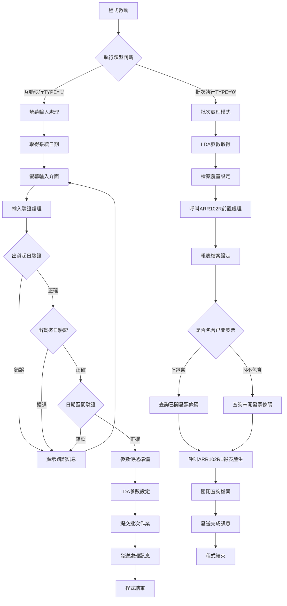
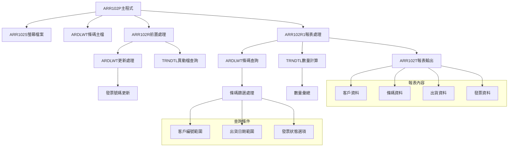
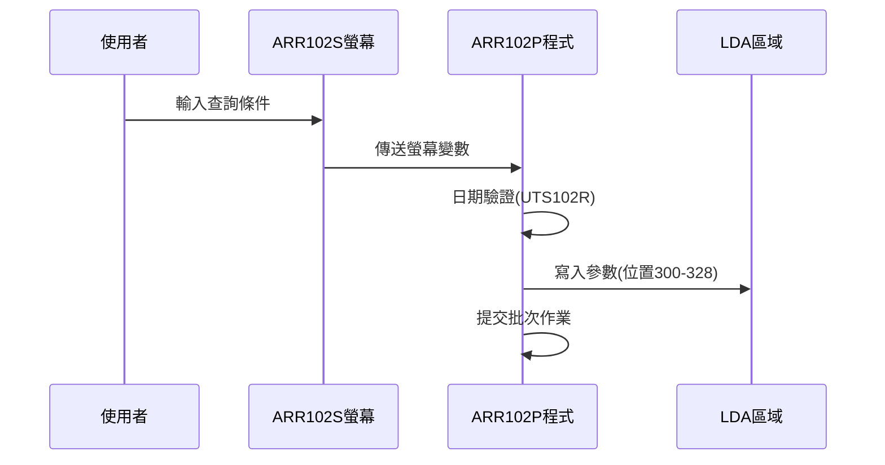
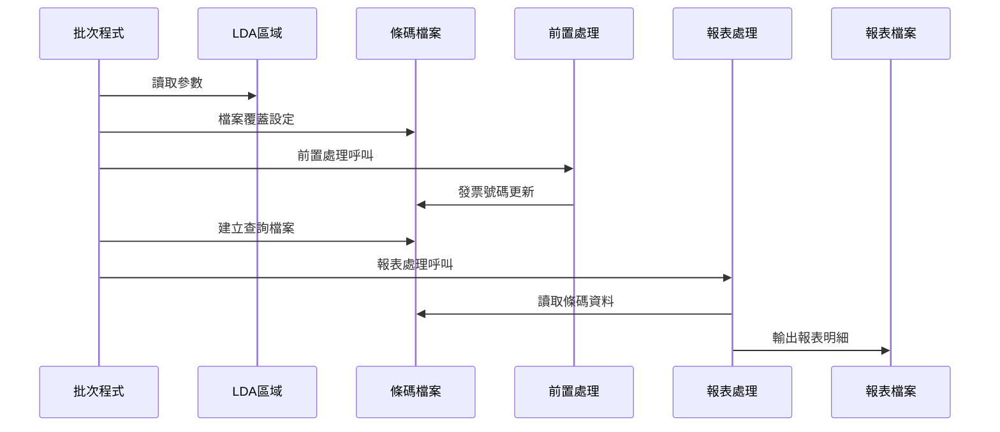
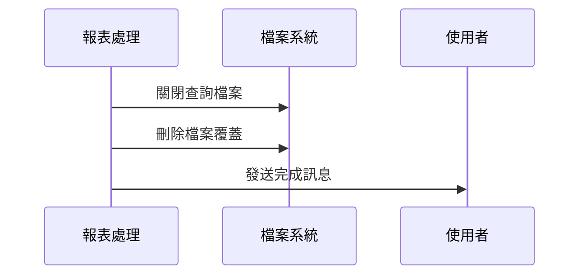
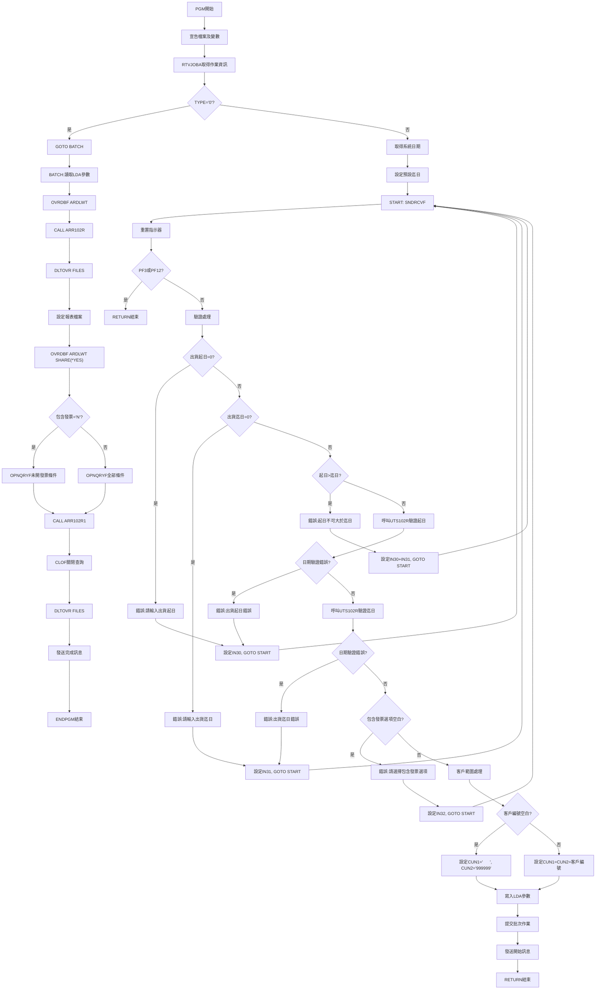

# ARR102P_P02 程式規格書

## 1. 基本資料

| 項目 | 內容 |
|------|------|
| **程式編號** | ARR102P |
| **程式名稱** | 條碼確認註銷異動作業 |
| **程式類型** | CLP |
| **廠區** | P02 |
| **系統名稱** | 應收帳款系統 |
| **子系統** | 條碼管理作業 |
| **檔案位置** | P02CLSRC_THSRC/ARR102P.txt |

## 2. 🎯 程式功能說明

### 主要功能描述
ARR102P是條碼確認註銷異動作業的控制程式，主要功能包含：
- 條碼資料的確認註銷處理
- 出貨日期區間及客戶編號的輸入驗證
- 批次作業的提交控制
- 條碼註銷報表的產生

### 🎯 業務流程詳細說明



#### 業務流程關鍵階段說明

**階段一：執行模式判斷**
- 透過RTVJOBA取得作業類型(TYPE)
- TYPE='0'為批次執行，直接跳轉BATCH標籤
- TYPE='1'為互動執行，進入螢幕處理流程

**階段二：螢幕輸入處理**
- 取得系統當前日期作為預設迄日
- 透過SNDRCVF進行螢幕互動
- 重置錯誤指示器(IN30, IN31, IN32)

**階段三：多層次驗證機制**
- 出貨起日不可為零
- 出貨迄日不可為零  
- 出貨起日不可大於出貨迄日
- 日期格式有效性驗證(透過UTS102R)
- 是否包含已開發票選項必須輸入

**階段四：批次作業提交**
- 將驗證後參數寫入LDA特定位置
- 提交ARR102P批次作業(JOB名稱:ARR102P)
- 使用ARJOBD作業描述
- 發送處理開始訊息

**階段五：批次處理執行**
- 從LDA讀取參數
- 設定ARDLWT檔案覆蓋
- 執行ARR102R前置處理
- 根據包含發票選項建立不同查詢條件
- 產生ARR102T條碼註銷報表

### 🎯 智能處理邏輯
- 自動日期預設機制：系統自動設定當日為出貨迄日
- 客戶範圍自動處理：空白時自動設定為全部客戶(000000-999999)
- 條件式查詢邏輯：根據是否包含已開發票採用不同QRYSLT條件

### 🎯 資料一致性確保機制
- LDA區域資料共享：確保互動與批次參數一致性
- 檔案鎖定機制：ARDLWT檔案在批次處理時使用SHARE(*YES)
- 條碼狀態檢核：僅處理符合條件的條碼記錄

## 3. 🎯 檔案架構與關聯圖

### 使用檔案清單

| 檔案名稱 | 檔案類型 | 用途說明 | 存取方式 |
|----------|----------|----------|----------|
| ARR102S | DSPF | 螢幕輸入檔案 | 輸入/輸出 |
| ARDLWT | PF | 銷貨及裝運條碼主檔 | 查詢 |
| ARR102T | PRTF | 條碼註銷報表檔案 | 輸出 |
| TRNDTL | PF | 異動明細檔案 | 查詢 |

### 🎯 檔案關聯詳細視覺化圖表



### 🎯 資料流向詳細說明

#### 環境準備階段的資料流向


#### 業務處理階段的資料流向


#### 環境清理階段的資料流向


## 4. 🎯 檔案欄位規格說明

### 主要資料結構

#### ARR102S 螢幕檔案欄位規格

| 欄位名稱 | 型態 | 長度 | 位置 | 屬性 | 說明 |
|----------|------|------|------|------|------|
| S#DEVN | CHAR | 10 | 2,70 | O | 終端機代號 |
| S#USER | CHAR | 10 | 3,2 | O | 使用者代號 |
| S#CUNO | CHAR | 6 | 9,32 | B | 客戶編號 |
| S#WTD1 | ZONED | 8,0 | 11,32 | B | 出貨起日 |
| S#WTD2 | ZONED | 8,0 | 11,46 | B | 出貨迄日 |
| S#CODE | CHAR | 1 | 13,46 | B | 是否包含已開發票 |
| S#ERR | CHAR | 70 | 24,2 | O | 錯誤訊息 |

#### ARDLWT 條碼檔案欄位規格

| 欄位名稱 | 型態 | 長度 | 說明 |
|----------|------|------|------|
| AWFLAG | CHAR | 1 | 處理標記 |
| AWCUNO | CHAR | 6 | 客戶編號 |
| AWCUNM | CHAR | 10 | 客戶名稱 |
| AWORNO | CHAR | 6 | 訂單編號 |
| AWDLVY | CHAR | 6 | 送貨編號 |
| AWWTNO | CHAR | 8 | 條碼編號 |
| AWWTDT | NUMERIC | 8,0 | 出貨日期 |
| AWTXNO | CHAR | 8 | 傳票號碼 |
| AWTXDT | NUMERIC | 8,0 | 傳票開立日期 |
| AWIVNO | CHAR | 10 | 發票號碼 |
| AWCOD1 | CHAR | 1 | 傳票開立標記 |
| AWCOD2 | CHAR | 1 | 傳票確認標記 |
| AWCOD3 | CHAR | 1 | 已開發票標記 |

### 🔍 重點欄位切割技術詳解

#### DS結構完整分析

**ARR102R1程式中的D#WTNO欄位切割**：

```
D#WTNO (8字元)：[X|XX|XXXXX]
                 ↓ ↓  ↓
D#WTN1 (1字元)：[X]           條碼第1段
D#WTN2 (2字元)：  [XX]        條碼第2段  
D#WTN3 (5字元)：    [XXXXX]   條碼第3段
```

#### 欄位切割視覺化展示
```
條碼編號結構解析：
位置：    1   2-3   4-8
格式：   [段1][段2][段3]
用途：   類別  工廠  序號
範例：    1    11   SA004
```

#### 切割邏輯詳細說明
- **D#WTN1**：條碼類別識別碼，用於區分不同類型條碼
- **D#WTN2**：工廠代號，固定設為'11'用於特定查詢
- **D#WTN3**：條碼序號部分，與TRNDTL檔案TXNO關聯

#### 實際數據範例說明
```
原始條碼：12345678
切割結果：
- D#WTN1 = '1' (類別)
- D#WTN2 = '23' (工廠)  
- D#WTN3 = '45678' (序號)

TRNDTL查詢使用：
- TXCODE = 'SA04'
- TXNO = '12345678' (完整條碼)
- TXITEM = 0
```

### 重要變數定義表

| 變數名稱 | 型態 | 長度 | 說明 | 使用位置 |
|----------|------|------|------|----------|
| &TYPE | CHAR | 1 | 作業類型(0:批次,1:互動) | 程式主體 |
| &CUN1 | CHAR | 6 | 客戶編號起始值 | 查詢條件 |
| &CUN2 | CHAR | 6 | 客戶編號結束值 | 查詢條件 |
| &C_WTD1 | CHAR | 8 | 出貨起日(批次用) | LDA參數 |
| &C_WTD2 | CHAR | 8 | 出貨迄日(批次用) | LDA參數 |
| &W#WTD1 | CHAR | 8 | 出貨起日暫存 | 日期處理 |
| &W#WTD2 | CHAR | 8 | 出貨迄日暫存 | 日期處理 |
| &W#TD21 | CHAR | 8 | 系統日期暫存 | 日期初始化 |
| &W#FLAG | CHAR | 1 | 日期驗證旗標 | UTS102R回傳 |
| &P#PDAT | CHAR | 8 | 日期參數 | UTS102R輸入 |
| &P#MODE | CHAR | 1 | 驗證模式 | UTS102R輸入 |
| &P#MTL | CHAR | 24 | 月份資料 | UTS102R輸出 |
| &P#LEAP | CHAR | 1 | 閏年標記 | UTS102R輸出 |

## 5. 🎯 輸出/入螢幕布局

### 螢幕布局完整視覺化

```
+----------------------------------------------------------+
|99/12/26      東鋼鐵股份有限公司暨關係企業       ARR102S  |
|08:30:25      條碼確認註銷異動作業              TERMINAL |
|USER01                                                    |
|                                                          |
|                                                          |
|                                                          |
|                                                          |
|                                                          |
|        客戶編號：[______] (空白為全部客戶)                |
|                                                          |
|        出貨期間：[______/__/__] 至 [______/__/__]        |
|                                                          |
|        列印時是否包含已開發票：[_] (Y ,N)                 |
|                                                          |
|                                                          |
|                                                          |
|                                                          |
|                                                          |
|                                                          |
|                                                          |
|                                                          |
|                                                          |
|執行動作:     PF3=離開作業     PF12=回到前頁              |
|[錯誤訊息顯示區]                                          |
+----------------------------------------------------------+
```

### 🎯 畫面欄位詳細說明

| 欄位 | 位置 | 長度 | 類型 | 輸入格式 | 驗證規則 | 必填 |
|------|------|------|------|----------|----------|------|
| 客戶編號 | 9,32 | 6 | 英數字 | XXXXXX | 可空白 | N |
| 出貨起日 | 11,32 | 8 | 數字 | YYYYMMDD | 日期格式,不可為零 | Y |
| 出貨迄日 | 11,46 | 8 | 數字 | YYYYMMDD | 日期格式,不可為零,不可小於起日 | Y |
| 包含已開發票 | 13,46 | 1 | 英文字母 | Y/N | 必須為Y或N | Y |

### 🎯 畫面控制邏輯

#### 指示器控制說明
- **IN30**：出貨起日錯誤時亮起，欄位顯示反白閃爍
- **IN31**：出貨迄日錯誤時亮起，欄位顯示反白閃爍  
- **IN32**：包含發票選項錯誤時亮起，欄位顯示反白閃爍

#### 欄位顯示屬性
- **DSPATR(PC)**：保護字元，防止游標停留
- **DSPATR(RI)**：反向顯示，錯誤時反白提示
- **EDTCDE(4)**：日期編輯碼，自動加入斜線分隔

### 功能鍵詳細定義

| 功能鍵 | 功能說明 | 處理邏輯 | 系統行為 |
|--------|----------|----------|----------|
| **PF3** | 離開作業 | 設定IN03='1' | 直接RETURN結束程式 |
| **PF12** | 回到前頁 | 設定IN12='1' | 直接RETURN結束程式 |
| **ENTER** | 確認執行 | 觸發驗證邏輯 | 驗證通過後提交批次作業 |

### 操作流程
1. 輸入客戶編號(可空白)
2. 輸入出貨日期區間
3. 選擇是否包含已開發票
4. 按ENTER確認，系統進行驗證
5. 驗證通過後提交批次作業
6. 顯示處理開始訊息

## 6. 🎯 處理流程程序說明

### 🎯 主程序邏輯深度分析

#### 程式執行流程圖


#### 🎯 詳細處理步驟逐一分析

**步驟1：環境初始化**
- 宣告ARR102S螢幕檔案
- 定義所有工作變數及參數變數
- 取得作業執行資訊判斷執行模式

**步驟2：日期初始化處理**
- 使用RTVJOBA CYMDDATE取得系統日期
- 在日期前加'0'補足8位數格式
- 設定S#WTD2預設值為系統日期

**步驟3：螢幕互動循環**
- SNDRCVF等待使用者輸入
- 重置所有錯誤指示器(IN30,IN31,IN32)
- 清除錯誤訊息變數

**步驟4：功能鍵處理**
- 檢查IN03(PF3)或IN12(PF12)
- 任一按下即RETURN結束程式

**步驟5：輸入欄位驗證**
- 出貨起日非零檢查
- 出貨迄日非零檢查  
- 日期區間邏輯檢查
- UTS102R日期格式驗證
- 包含發票選項必填檢查

**步驟6：客戶範圍設定**
- 空白時設定為全客戶範圍(000000-999999)
- 有值時設定為單一客戶查詢

**步驟7：參數傳遞機制**
- LDA位置300-308：出貨日期區間
- LDA位置316-322：客戶編號範圍
- LDA位置328：包含發票選項

**步驟8：批次作業提交**
- SBMJOB提交ARR102P批次作業
- 使用ARJOBD作業描述
- 作業名稱設為ARR102P

### 🎯 子程序邏輯分析

#### ARR102R前置處理程序
**功能**：更新ARDLWT檔案中的發票號碼
**邏輯**：
1. 讀取ARDLWT條碼記錄
2. 根據傳票號碼查詢TRNDTL異動檔
3. 若找到對應記錄則更新發票號碼
4. 執行UPDAT更新ARDLWT記錄

#### ARR102R1報表處理程序  
**功能**：產生條碼註銷明細報表
**邏輯**：
1. 初始化報表環境及分隔線
2. 讀取ARDLWT條碼記錄
3. 查詢TRNDTL計算出貨數量
4. 格式化報表明細資料
5. 輸出報表記錄

### 🎯 特殊邏輯處理

#### 日期驗證邏輯
```
CALL UTS102R參數：
- P#PDAT：8位數日期(YYYYMMDD)
- P#MODE：驗證模式'1'
- P#MTL：回傳月份資料(24字元)
- P#LEAP：回傳閏年標記
- W#FLAG：回傳錯誤旗標('0'=正確)
```

#### 查詢條件建構邏輯
**包含已開發票(S#CODE='N')**：
- 加入條件：AWCOD3 *EQ " " AND AWIVNO *EQ " "
- 僅查詢未開發票且發票號碼空白的條碼

**不限發票狀態(S#CODE='Y')**：
- 僅使用：AWCOD3 *EQ " "
- 查詢所有未標記已開發票的條碼

#### 客戶範圍處理邏輯
```
IF 客戶編號空白 THEN
    CUN1 = '      ' (6個空格)
    CUN2 = '999999'
ELSE
    CUN1 = CUN2 = 輸入的客戶編號
```

### 🎯 錯誤處理與資料完整性控制

#### 錯誤檢查順序
1. 必填欄位檢查(出貨日期、發票選項)
2. 邏輯關係檢查(日期區間)
3. 格式有效性檢查(日期格式)
4. 業務規則檢查(客戶存在性)

#### 資料完整性機制
- LDA參數傳遞確保批次與互動資料一致
- 檔案鎖定避免並行更新衝突
- 查詢條件確保資料範圍正確性

## 7. 🎯 數據操作與轉換分析

### 檔案操作詳解

#### READ操作邏輯
- **ARDLWT讀取**：使用OPNQRYF建立查詢檔案，依據客戶編號和出貨日期範圍篩選
- **TRNDTL讀取**：使用SETLL定位後READ，查詢特定條碼的異動記錄
- **查詢終止條件**：檔案結束或條碼編號不符合

#### WRITE操作邏輯  
- **報表輸出**：ARR102T報表記錄格式化後WRITE
- **報表標題**：每頁輸出時先WRITE標題記錄
- **明細記錄**：逐筆WRITE條碼明細資料

#### UPDATE操作邏輯
- **ARDLWT更新**：ARR102R程序中更新發票號碼欄位
- **更新條件**：必須先成功CHAIN讀取記錄
- **更新欄位**：主要更新AWIVNO發票號碼欄位

#### 檔案鎖定和併發處理
- **獨占存取**：ARR102R中ARDLWT使用UP(更新)模式
- **共享存取**：ARR102R1中ARDLWT使用SHARE(*YES)
- **查詢存取**：OPNQRYF提供唯讀查詢功能

### 數據轉換邏輯

#### 日期格式轉換
```
系統日期取得：RTVJOBA CYMDDATE(&W#TD21)
格式補強：CHGVAR VAR(&W#TD21) VALUE('0' *CAT &W#TD21)
結果：7位數日期轉換為8位數標準格式
```

#### 客戶範圍轉換
```
輸入空白轉換：
&CUN1 = '      ' (6個空格代表最小值)
&CUN2 = '999999' (代表最大值)
```

#### LDA參數轉換
```
位置對應：
300-307：出貨起日(8字元)
308-315：出貨迄日(8字元)  
316-321：客戶起始編號(6字元)
322-327：客戶結束編號(6字元)
328：包含發票選項(1字元)
```

### 計算邏輯分析

#### 數量計算邏輯
**ARR102R1中的數量彙總**：
```
初始化：Z-ADD 0 W#QTY
累加：ADD TXQTY W#QTY
結果：W#QTY為該條碼的總出貨數量
```

#### 條碼編號處理
**條碼分段邏輯**：
```
D#WTNO = AWWTNO (完整8位條碼)
D#WTN2 = '11' (固定工廠代號)
TXNO = D#WTNO (用於TRNDTL查詢)
```

### 檢核機制詳解

#### 日期有效性檢查
```
CALL UTS102R檢查項目：
- 年份合理性(1900-2999)
- 月份有效性(01-12)  
- 日期有效性(考慮閏年)
- 格式正確性(8位數字)
```

#### 客戶編號檢核
- 長度檢查：必須6位字元以內
- 格式檢查：英數字組合
- 範圍檢查：起始不大於結束

#### 發票選項檢核
- 必填檢查：不可空白
- 值域檢查：必須為'Y'或'N'
- 邏輯檢查：影響查詢條件建構

#### 檢核失敗處理方式
1. 設定對應錯誤指示器
2. 顯示具體錯誤訊息
3. 將游標定位至錯誤欄位
4. 回到輸入畫面重新輸入

## 8. 🎯 錯誤處理程序說明

### 🎯 詳細錯誤代碼清冊

| 錯誤代碼 | 錯誤訊息 | 原因說明 | 處理方式 | 預防措施 |
|----------|---------|---------|---------|----------|
| **USER001** | 請輸入出貨起日 | 出貨起日欄位為零或空白 | 1. 設定IN30='1'顯示錯誤<br>2. 回到輸入畫面<br>3. 游標定位至起日欄位 | 設定欄位為必填，提供預設值提示 |
| **USER002** | 請輸入出貨迄日 | 出貨迄日欄位為零或空白 | 1. 設定IN31='1'顯示錯誤<br>2. 回到輸入畫面<br>3. 游標定位至迄日欄位 | 自動帶入系統日期作為預設值 |
| **USER003** | 出貨起日不可大於出貨迄日 | 日期區間邏輯錯誤 | 1. 設定IN30='1'和IN31='1'<br>2. 兩個日期欄位同時反白<br>3. 要求重新輸入 | 提供日期區間選擇輔助功能 |
| **USER004** | 出貨起日錯誤！ | UTS102R日期驗證失敗 | 1. 設定IN30='1'錯誤顯示<br>2. 檢查日期格式和有效性<br>3. 重新輸入正確日期 | 使用日期編輯碼自動格式化 |
| **USER005** | 出貨迄日錯誤！ | UTS102R日期驗證失敗 | 1. 設定IN31='1'錯誤顯示<br>2. 檢查日期格式和有效性<br>3. 重新輸入正確日期 | 提供日期範例和格式說明 |
| **USER006** | 請選擇列印時是否包含已開發票選項 | 包含發票選項未輸入 | 1. 設定IN32='1'錯誤顯示<br>2. 游標定位至選項欄位<br>3. 輸入Y或N | 在畫面上清楚標示可選值 |
| **FILE001** | ARDLWT檔案開啟失敗 | 條碼主檔無法存取 | 1. 檢查檔案是否存在<br>2. 確認檔案權限<br>3. 重新執行程式 | 定期檢查檔案狀態和權限設定 |
| **FILE002** | ARR102T報表檔案建立失敗 | 報表檔案無法建立 | 1. 檢查輸出佇列狀態<br>2. 確認磁碟空間<br>3. 重新提交作業 | 監控系統資源使用狀況 |
| **SYS001** | 批次作業提交失敗 | SBMJOB指令執行錯誤 | 1. 檢查作業佇列狀態<br>2. 確認ARJOBD作業描述<br>3. 手動重新提交 | 定期檢查作業佇列和系統狀態 |
| **IN03='1'** | 使用者按下PF3離開 | 正常離開程式功能 | 直接RETURN結束程式 | 提供確認訊息避免誤按 |
| **IN12='1'** | 使用者按下PF12返回 | 正常返回前頁功能 | 直接RETURN結束程式 | 保存使用者輸入的資料 |

### 🎯 系統異常處理邏輯

#### 檔案操作失敗處理
- **ARDLWT存取失敗**：自動重試機制，失敗時發送錯誤訊息
- **TRNDTL查詢失敗**：跳過該筆記錄，繼續處理下一筆
- **報表檔案錯誤**：終止報表產生，發送警告訊息

#### 程式調用失敗處理
- **UTS102R呼叫失敗**：視為日期格式錯誤，要求重新輸入
- **ARR102R處理失敗**：記錄錯誤位置，發送詳細錯誤訊息
- **ARR102R1報表失敗**：保留已處理資料，產生部分報表

#### 資料完整性錯誤處理
- **LDA參數異常**：使用預設值並記錄警告
- **客戶編號不存在**：給予警告但繼續處理
- **條碼編號格式錯誤**：跳過該筆記錄並記錄

#### 並發控制失敗處理
- **檔案鎖定衝突**：等待重試機制
- **記錄被他人更新**：重新讀取後再次處理
- **查詢檔案衝突**：自動重建查詢條件

## 9. 🎯 備註

### 🎯 特殊注意事項

#### LDA參數傳遞機制
- 程式使用LDA(Local Data Area)在互動和批次模式間傳遞參數
- 參數位置固定，異動時需同步修改所有相關程式

#### 日期處理特殊邏輯
- 系統日期取得後需加'0'前綴補足8位數
- UTS102R程式返回的錯誤旗標'0'表示日期正確

#### 客戶範圍查詢機制
- 空白客戶編號自動轉換為'000000'-'999999'全範圍查詢
- 單一客戶查詢時起迄值設為相同

#### 條碼查詢條件差異
- 包含已開發票選項影響OPNQRYF的查詢條件
- 'N'選項會額外加入AWIVNO空白條件

#### 報表產生時機
- 前置處理(ARR102R)完成後才開始報表處理
- 報表處理中ARDLWT檔案設為共享模式避免鎖定

#### 檔案覆蓋設定
- OVRDBF指令用於重新導向檔案位置
- 處理完畢後必須DLTOVR清除覆蓋設定

#### 訊息發送機制
- 使用SNDBRKMSG發送中斷訊息到使用者終端
- 訊息接收者由LDA位置1011-1020指定

#### 作業提交參數
- 批次作業使用ARJOBD作業描述
- 作業名稱固定為ARR102P便於識別和管理 