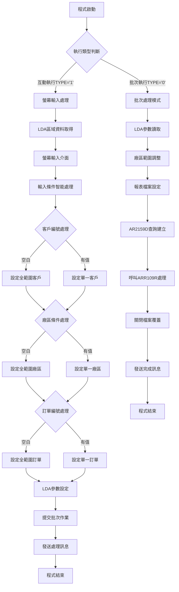
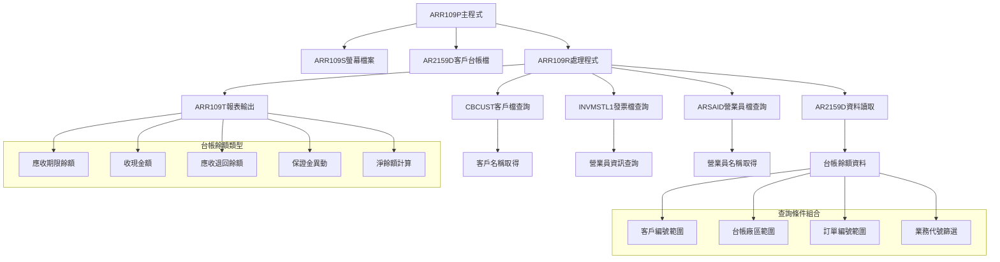
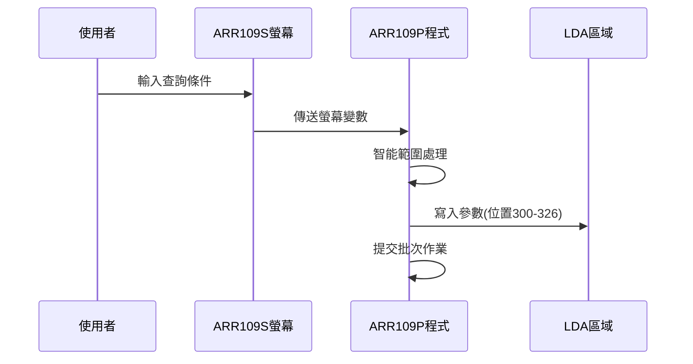
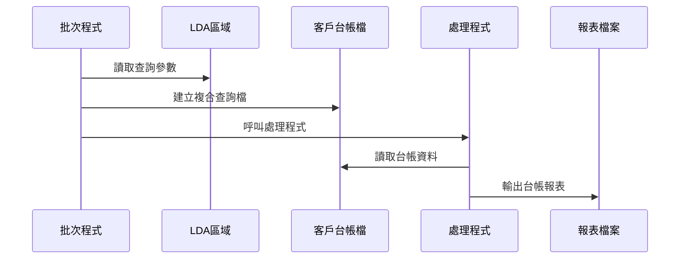
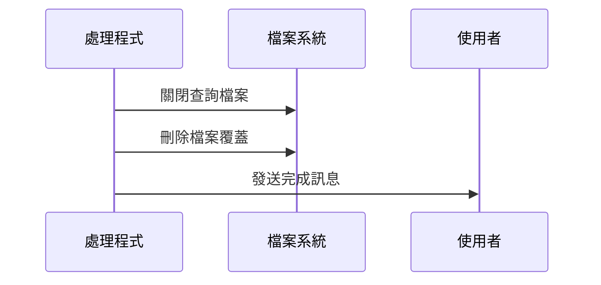
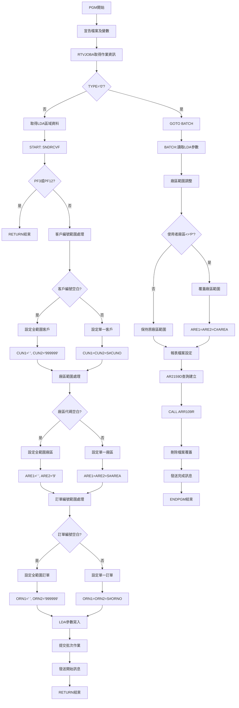

# ARR109P_P02 程式規格書

## 1. 基本資料

| 項目 | 內容 |
|------|------|
| **程式編號** | ARR109P |
| **程式名稱** | 客戶台帳餘額處理作業(信用) |
| **程式類型** | CLP |
| **廠區** | P02 |
| **系統名稱** | 應收帳款系統 |
| **子系統** | 客戶台帳管理作業 |
| **檔案位置** | P02CLSRC_THSRC/ARR109P.txt |

## 2. 🎯 程式功能說明

### 主要功能描述
ARR109P是客戶台帳餘額處理作業(信用)的控制程式，主要功能包含：
- 客戶台帳餘額查詢條件設定
- 多維度篩選條件處理（客戶、廠區、訂單、業務）
- 客戶台帳餘額統計分析
- 應收帳款各項目餘額報表產生
- 營業員績效統計功能

### 🎯 業務流程詳細說明



#### 業務流程關鍵階段說明

**階段一：執行模式識別**
- 透過RTVJOBA取得作業執行類型
- TYPE='0'為批次模式，直接跳轉BATCH處理
- TYPE='1'為互動模式，進入螢幕輸入流程

**階段二：螢幕互動處理**
- 從LDA區域取得使用者資訊(DEVN,USER)
- 透過SNDRCVF進行螢幕互動
- 支援PF3(離開)和PF12(返回)功能鍵

**階段三：智能條件處理**
- 客戶編號：空白時自動設為全範圍(000000-999999)
- 台帳廠區：空白時自動設為全範圍(' '-'9')
- 訂單編號：空白時自動設為全範圍(000000-999999)
- 業務代號：支援營業員篩選功能(9907A新增)

**階段四：LDA參數傳遞**
- 位置300-305：客戶起始編號
- 位置306-311：客戶結束編號
- 位置312：廠區起始代碼
- 位置313：廠區結束代碼
- 位置314-319：訂單起始編號
- 位置320-325：訂單結束編號
- 位置326：業務代號篩選條件

**階段五：批次處理邏輯**
- 讀取LDA傳遞的查詢參數
- 廠區條件特殊處理：非P廠時覆蓋廠區範圍
- 建立AR2159D複合查詢檔案
- 呼叫ARR109R進行台帳餘額處理

**階段六：AR2159D查詢處理**
- 依客戶編號、廠區、訂單編號建立複合查詢
- 排序順序：客戶編號、廠區、訂單編號
- 使用SHARE(*YES)避免檔案鎖定問題

### 🎯 智能處理邏輯
- 條件自動補強：空白條件自動設定為最大範圍查詢
- 廠區邏輯處理：P廠用戶可查詢全廠區，其他廠區限制本廠
- 範圍查詢優化：單一條件自動設為起迄相同值
- 業務篩選功能：支援依營業員代號進行資料篩選

### 🎯 資料一致性確保機制
- LDA參數機制：確保互動與批次處理參數一致性
- 檔案共享模式：AR2159D檔案使用SHARE(*YES)避免鎖定
- 查詢條件完整性：多重條件確保查詢結果準確性
- 廠區權限控制：依使用者廠區限制查詢範圍

## 3. 🎯 檔案架構與關聯圖

### 使用檔案清單

| 檔案名稱 | 檔案類型 | 用途說明 | 存取方式 |
|----------|----------|----------|----------|
| ARR109S | DSPF | 螢幕輸入檔案 | 輸入/輸出 |
| AR2159D | PF | 客戶台帳彙總檔案 | 查詢 |
| CBCUST | PF | 客戶基本資料檔案 | 查詢 |
| INVMSTL1 | LF | 發票主檔邏輯檔 | 查詢 |
| ARSAID | PF | 營業員基本資料檔案 | 查詢 |
| ARR109T | PRTF | 客戶台帳餘額報表檔案 | 輸出 |

### 🎯 檔案關聯詳細視覺化圖表



### 🎯 資料流向詳細說明

#### 環境準備階段的資料流向


#### 業務處理階段的資料流向


#### 環境清理階段的資料流向


## 4. 🎯 檔案欄位規格說明

### 主要資料結構

#### ARR109S 螢幕檔案欄位規格

| 欄位名稱 | 型態 | 長度 | 位置 | 屬性 | 說明 |
|----------|------|------|------|------|------|
| S#DEVN | CHAR | 10 | 2,70 | O | 終端機代號 |
| S#USER | CHAR | 10 | 3,2 | O | 使用者代號 |
| S#CUNO | CHAR | 6 | 10,37 | B | 客戶編號 |
| S#AREA | CHAR | 1 | 12,37 | B | 台帳廠區 |
| S#ORNO | CHAR | 6 | 14,37 | B | 訂單編號 |
| S#SALE | CHAR | 1 | 16,37 | B | 業務代號 |
| S#ERR | CHAR | 70 | 24,2 | O | 錯誤訊息 |

#### AR2159D 客戶台帳檔案欄位規格

| 欄位名稱 | 型態 | 長度 | 說明 |
|----------|------|------|------|
| ADFLAG | CHAR | 1 | 異動代碼 |
| ADCUNO | CHAR | 6 | 客戶編號 |
| ADORNO | CHAR | 6 | 訂單編號 |
| ADAREA | CHAR | 1 | 出貨廠區 |
| ADAMT1 | PACKED | 11,0 | 台帳應收期限 |
| ADAMT2 | PACKED | 11,0 | 台帳收現金額 |
| ADAMT3 | PACKED | 11,0 | 台帳應收退回 |
| ADAMT4 | PACKED | 11,0 | 保證金異動 |
| ADAMT5 | PACKED | 11,0 | 保證金異動 |
| ADAMT6 | PACKED | 11,0 | 保證金異動 |
| ADRESV | CHAR | 20 | 保留欄位 |
| ADAMT7 | SIGNED | 13,2 | 外幣台帳應收期限 |
| ADAMT8 | SIGNED | 13,2 | 外幣台帳收現金額 |
| ADAMT9 | SIGNED | 13,2 | 外幣台帳應收退回 |
| ADAM10 | SIGNED | 13,2 | 外幣保證金異動 |

### 🔍 重點欄位切割技術詳解

#### LDA參數區域切割分析

**ARR109P程式的LDA參數配置**：

```
LDA區域配置 (位置300-326)：
[XXXXXX|XXXXXX|X|X|XXXXXX|XXXXXX|X]
 ↓      ↓      ↓ ↓ ↓      ↓      ↓
 300    306    312 313 314   320   326
 CUN1   CUN2   ARE1 ARE2 ORN1  ORN2  W#SALE
(6字元)(6字元)(1)(1)(6字元)(6字元)(1字元)
```

#### LDA系統資訊區域切割

**系統資訊區域配置**：

```
LDA系統區域 (位置1001-1021)：
[XXXXXXXXXX|XXXXXXXXXX|X]
 ↓          ↓          ↓
 1001       1011       1021
 S#USER     S#DEVN     S#AREA
(10字元)   (10字元)   (1字元)
```

#### UDS使用者資料結構切割

**ARR109R程式中的UDS結構**：

```
UDS結構配置：
[XXXXXXXXXX|XXXXXXXXXX]
 ↓          ↓
 1001-1010  1011-1020
 U#USID     S#DEVN
(10字元)   (10字元)
```

#### 實際參數範例說明

```
範圍參數設定範例：
- CUN1='000001', CUN2='000001' (單一客戶查詢)
- CUN1='      ', CUN2='999999' (全客戶查詢)
- ARE1='P', ARE2='P' (P廠查詢)
- ARE1=' ', ARE2='9' (全廠區查詢)
- ORN1='A12345', ORN2='A12345' (單一訂單)
- ORN1='      ', ORN2='999999' (全訂單)
- W#SALE='A' (特定業務篩選)
- W#SALE=' ' (全業務查詢)

系統資訊範例：
- U#USID='USER001   ' (使用者代號)
- S#DEVN='TERM01    ' (終端機代號)
- S#AREA='P' (使用者所屬廠區)
```

### 重要變數定義表

| 變數名稱 | 型態 | 長度 | 說明 | 使用位置 |
|----------|------|------|------|----------|
| &TYPE | CHAR | 1 | 作業類型(0:批次,1:互動) | 程式主體 |
| &S#DEVN | CHAR | 10 | 終端機代號 | LDA讀取 |
| &S#USER | CHAR | 10 | 使用者代號 | LDA讀取 |
| &CUN1 | CHAR | 6 | 客戶起始編號 | 範圍處理 |
| &CUN2 | CHAR | 6 | 客戶結束編號 | 範圍處理 |
| &ARE1 | CHAR | 1 | 廠區起始代碼 | 範圍處理 |
| &ARE2 | CHAR | 1 | 廠區結束代碼 | 範圍處理 |
| &ORN1 | CHAR | 6 | 訂單起始編號 | 範圍處理 |
| &ORN2 | CHAR | 6 | 訂單結束編號 | 範圍處理 |
| &C#AREA | CHAR | 1 | 使用者廠區 | 權限控制 |
| &W#SALE | CHAR | 1 | 業務代號篩選 | 9907A新增 |

## 5. 🎯 輸出/入螢幕布局

### 螢幕布局完整視覺化

```
+----------------------------------------------------------+
|99/12/28      東鋼鐵股份有限公司暨關係企業       ARR110S  |
|08:30:25      客戶台帳餘額處理作業              TERMINAL |
|USER01                                                    |
|                                                          |
|                                                          |
|                                                          |
|                                                          |
|                                                          |
|                                                          |
|        客戶編號：[______] (空白為全部客戶)               |
|                                                          |
|        台帳廠區：[_] (空白為全部廠區)                    |
|                                                          |
|        訂單編號：[______] (空白為全部訂單)               |
|                                                          |
|        業務代號：[_] (空白為全部業務)                    |
|                                                          |
|                                                          |
|                                                          |
|                                                          |
|                                                          |
|執行動作:     PF3=離開作業     PF12=回到前頁              |
|[錯誤訊息顯示區]                                          |
+----------------------------------------------------------+
```

### 🎯 畫面欄位詳細說明

| 欄位 | 位置 | 長度 | 類型 | 輸入格式 | 驗證規則 | 必填 |
|------|------|------|------|----------|----------|------|
| 客戶編號 | 10,37 | 6 | 英數字 | XXXXXX | 可空白 | N |
| 台帳廠區 | 12,37 | 1 | 英文字母 | X | 可空白 | N |
| 訂單編號 | 14,37 | 6 | 英數字 | XXXXXX | 可空白 | N |
| 業務代號 | 16,37 | 1 | 英數字 | X | 可空白(9907A新增) | N |

### 功能鍵詳細定義

| 功能鍵 | 功能說明 | 處理邏輯 | 系統行為 |
|--------|----------|----------|----------|
| **PF3** | 離開作業 | 設定IN03='1' | 直接RETURN結束程式 |
| **PF12** | 回到前頁 | 設定IN12='1' | 直接RETURN結束程式 |
| **ENTER** | 確認執行 | 觸發處理邏輯 | 進行範圍處理後提交批次作業 |

### 操作流程
1. 輸入客戶編號（可空白，空白表示全部客戶）
2. 輸入台帳廠區（可空白，空白表示全部廠區）
3. 輸入訂單編號（可空白，空白表示全部訂單）
4. 輸入業務代號（可空白，空白表示全部業務）
5. 按ENTER確認，系統進行範圍處理
6. 提交批次作業開始處理
7. 顯示處理開始訊息

## 6. 🎯 處理流程程序說明

### 🎯 主程序邏輯深度分析

#### 程式執行流程圖


#### 🎯 詳細處理步驟逐一分析

**步驟1：環境初始化與識別**
- 宣告ARR109S螢幕檔案
- 定義多組範圍處理變數
- 取得作業執行類型判斷執行模式

**步驟2：LDA區域資料處理**
- 讀取終端機代號(位置1011-1020)
- 讀取使用者代號(位置1001-1010)

**步驟3：螢幕互動循環處理**
- SNDRCVF等待使用者輸入
- 檢查功能鍵處理

**步驟4：客戶編號範圍智能處理**
- 空白時：CUN1='      ', CUN2='999999'(全範圍)
- 有值時：CUN1=CUN2=S#CUNO(單一客戶)

**步驟5：廠區範圍智能處理**
- 空白時：ARE1=' ', ARE2='9'(全範圍)
- 有值時：ARE1=ARE2=S#AREA(單一廠區)

**步驟6：訂單編號範圍智能處理**
- 空白時：ORN1='      ', ORN2='999999'(全範圍)
- 有值時：ORN1=ORN2=S#ORNO(單一訂單)

**步驟7：LDA參數傳遞機制**
- 位置300-305：客戶起始編號
- 位置306-311：客戶結束編號
- 位置312：廠區起始代碼
- 位置313：廠區結束代碼
- 位置314-319：訂單起始編號
- 位置320-325：訂單結束編號
- 位置326：業務代號篩選條件(9907A新增)

**步驟8：批次作業提交**
- SBMJOB提交ARR109P批次作業
- 使用ARJOBD作業描述
- 作業名稱設為ARR109P

**步驟9：批次處理特殊邏輯**
- 廠區權限控制：非P廠使用者限制查詢本廠資料
- 使用者廠區從LDA位置1021讀取
- 覆蓋廠區範圍確保權限控制

### 🎯 子程序邏輯分析

#### ARR109R主處理程序
**功能**：客戶台帳餘額報表產生
**邏輯**：
1. 初始化報表環境和統計變數
2. 讀取AR2159D客戶台帳記錄
3. 查詢CBCUST取得客戶名稱
4. 計算各類台帳餘額
5. 查詢營業員資訊
6. 輸出ARR109T台帳餘額報表

#### 客戶資料查詢程序
**功能**：客戶基本資料取得
**邏輯**：
1. 使用客戶編號CHAIN CBCUST
2. 取得客戶名稱(CBCUNM)
3. 客戶不存在時使用空白處理

#### 營業員資訊查詢程序(SAIDSR)
**功能**：營業員資料取得和篩選
**邏輯**：
1. 查詢INVMSTL1取得發票營業員
2. 使用營業員代號CHAIN ARSAID
3. 取得營業員名稱
4. 業務代號篩選邏輯(9907A)

#### 台帳餘額計算程序
**功能**：各類台帳餘額統計
**邏輯**：
1. 台帳總額=ADAMT1+ADAMT3+ADAMT4
2. 淨餘額=台帳總額-收現金額
3. 各項目小計和總計累計
4. 零餘額篩選功能(9907A)

### 🎯 特殊邏輯處理

#### 廠區權限控制邏輯
```
IF 使用者廠區 <> 'P' THEN
    廠區起始=廠區結束=使用者廠區
ELSE
    維持原設定廠區範圍
END
```

#### 範圍參數處理邏輯
```
客戶範圍處理：
IF 客戶編號空白 THEN
    CUN1 = '      '(6個空格)
    CUN2 = '999999'
ELSE
    CUN1 = CUN2 = 客戶編號

廠區範圍處理：
IF 廠區代碼空白 THEN
    ARE1 = ' '
    ARE2 = '9'
ELSE
    ARE1 = ARE2 = 廠區代碼

訂單範圍處理：
IF 訂單編號空白 THEN
    ORN1 = '      '
    ORN2 = '999999'
ELSE
    ORN1 = ORN2 = 訂單編號
```

#### AR2159D查詢條件建構
```
複合查詢條件：
ADCUNO 在客戶範圍內(CUN1-CUN2)
ADORNO 在訂單範圍內(ORN1-ORN2)
ADAREA 在廠區範圍內(ARE1-ARE2)

排序條件：
PRIMARY: ADCUNO(客戶編號)
SECONDARY: ADAREA(廠區)
TERTIARY: ADORNO(訂單編號)
```

#### 業務代號篩選邏輯(9907A)
```
IF 業務代號篩選 <> 空白 THEN
    IF 營業員代號 <> 篩選條件 THEN
        設定不列印旗標(W#PRT='N')
    ELSE
        設定列印旗標(W#PRT=' ')
    END
END
```

### 🎯 錯誤處理與資料完整性控制

#### 功能鍵處理
- PF3和PF12檢查：直接RETURN結束程式
- 無需額外錯誤處理，系統標準處理

#### 檔案存取錯誤處理
- AR2159D查詢失敗：終止處理，發送錯誤訊息
- CBCUST客戶檔錯誤：使用空白客戶名稱繼續處理
- ARSAID營業員檔錯誤：使用空白營業員名稱

#### 資料完整性保障機制
- LDA參數完整性：確保所有參數正確傳遞
- 查詢條件完整性：範圍條件自動補強
- 廠區權限完整性：強制執行廠區存取限制
- 報表輸出完整性：完整的統計和小計功能

## 7. 🎯 數據操作與轉換分析

### 檔案操作詳解

#### READ操作邏輯
- **AR2159D讀取**：使用OPNQRYF建立多條件查詢檔案
- **CBCUST讀取**：使用CHAIN依客戶編號查詢客戶名稱
- **INVMSTL1讀取**：使用複合鍵查詢發票營業員資訊
- **ARSAID讀取**：使用CHAIN依營業員代號查詢營業員名稱

#### WRITE操作邏輯
- **報表標題**：每頁開始時WRITE標題記錄
- **明細記錄**：逐筆WRITE台帳餘額明細資料
- **小計記錄**：客戶別WRITE小計記錄
- **總計記錄**：最終WRITE總計記錄

#### 查詢檔案操作
- **查詢建立**：OPNQRYF建立複合條件查詢
- **查詢排序**：依客戶、廠區、訂單編號排序
- **查詢關閉**：DLTOVR清除檔案覆蓋

### 數據轉換邏輯

#### 範圍條件轉換
```
螢幕輸入：單一值或空白
內部處理：起迄範圍對
空白轉換：自動設為最大範圍
單值轉換：起迄設為相同值
```

#### 廠區權限轉換
```
P廠使用者：維持輸入的廠區範圍
其他廠區：強制設為使用者廠區
權限控制：確保只能查詢授權廠區
```

#### 台帳餘額轉換
```
台帳總額：ADAMT1+ADAMT3+ADAMT4
淨餘額：台帳總額-ADAMT2
報表格式：使用EDTCDE(J)千分位顯示
統計累計：各級小計和總計計算
```

### 計算邏輯分析

#### 台帳餘額計算
```
台帳總額(T#TAMT)：
= 應收期限(ADAMT1) + 應收退回(ADAMT3) + 保證金異動(ADAMT4)

淨餘額(T#NBAL)：
= 台帳總額 - 收現金額(ADAMT2)

客戶小計：
T#TAMS = Σ(T#TAMT)
T#NBLS = Σ(T#NBAL)

總計：
T#TAMA = Σ(T#TAMS)
T#NBLA = Σ(T#NBLS)
```

#### 營業員篩選計算
```
營業員查詢：
1. 從INVMSTL1查詢客戶發票記錄
2. 取得營業員代號(INRVID)
3. 查詢ARSAID取得營業員名稱
4. 依篩選條件決定是否列印
```

### 檢核機制詳解

#### 範圍條件檢核
```
客戶編號檢核：6位英數字格式
廠區代碼檢核：1位英文字母
訂單編號檢核：6位英數字格式
業務代號檢核：1位英數字格式
```

#### 資料存在性檢核
- 客戶資料檢核：CHAIN CBCUST檢查客戶存在性
- 營業員檢核：CHAIN ARSAID檢查營業員存在性
- 台帳資料檢核：AR2159D記錄有效性檢查

#### 權限檢核機制
- 廠區權限檢核：使用者廠區與查詢廠區比對
- 存取範圍檢核：確保查詢範圍在授權範圍內
- 資料安全檢核：防止越權查詢其他廠區資料

#### 檢核失敗處理方式
1. 客戶不存在：使用空白客戶名稱顯示
2. 營業員不存在：使用空白營業員名稱顯示
3. 權限不足：自動調整查詢範圍
4. 查詢無資料：顯示無資料訊息

## 8. 🎯 錯誤處理程序說明

### 🎯 詳細錯誤代碼清冊

| 錯誤代碼 | 錯誤訊息 | 原因說明 | 處理方式 | 預防措施 |
|----------|---------|---------|---------|----------|
| **USER001** | 使用者按下PF3離開 | 正常離開程式功能 | 直接RETURN結束程式 | 提供確認訊息避免誤按 |
| **USER002** | 使用者按下PF12返回 | 正常返回前頁功能 | 直接RETURN結束程式 | 保存使用者輸入資料 |
| **FILE001** | AR2159D檔案查詢失敗 | 客戶台帳檔無法存取 | 1. 檢查檔案是否存在<br>2. 確認檔案權限<br>3. 重新執行程式 | 定期檢查檔案狀態 |
| **FILE002** | ARR109T報表檔案建立失敗 | 報表檔案無法建立 | 1. 檢查輸出佇列狀態<br>2. 確認磁碟空間<br>3. 重新提交作業 | 監控系統資源狀況 |
| **FILE003** | CBCUST客戶檔案存取失敗 | 客戶主檔無法查詢 | 1. 檢查客戶檔案狀態<br>2. 確認檔案權限<br>3. 使用空白名稱繼續處理 | 定期維護客戶主檔 |
| **FILE004** | ARSAID營業員檔案存取失敗 | 營業員檔案無法查詢 | 1. 檢查營業員檔案狀態<br>2. 確認檔案權限<br>3. 使用空白名稱繼續處理 | 定期維護營業員檔 |
| **SYS001** | 批次作業提交失敗 | SBMJOB指令執行錯誤 | 1. 檢查作業佇列狀態<br>2. 確認ARJOBD作業描述<br>3. 手動重新提交 | 定期檢查作業佇列 |
| **SYS002** | LDA參數讀取失敗 | LDA區域資料異常 | 1. 重新初始化LDA<br>2. 檢查LDA權限<br>3. 使用預設值處理 | 定期檢查LDA狀態 |
| **DATA001** | 台帳資料無符合條件記錄 | 查詢條件無對應資料 | 1. 顯示無資料訊息<br>2. 檢查查詢條件<br>3. 擴大查詢範圍 | 提供查詢範圍建議 |
| **AUTH001** | 廠區權限不足 | 使用者無權查詢該廠區 | 1. 自動調整為授權廠區<br>2. 記錄權限違規<br>3. 通知系統管理員 | 建立權限管理機制 |

### 🎯 系統異常處理邏輯

#### 檔案操作失敗處理
- **AR2159D查詢失敗**：檢查查詢條件，重新建立查詢檔案
- **CBCUST存取失敗**：使用客戶編號作為名稱，繼續處理
- **ARSAID查詢失敗**：使用空白營業員名稱，繼續處理
- **報表檔案錯誤**：終止報表產生，發送錯誤訊息

#### 程式調用失敗處理
- **ARR109R處理失敗**：記錄失敗位置，發送詳細錯誤訊息
- **查詢檔案建立失敗**：檢查檔案狀態，重新建立查詢
- **子程序調用失敗**：跳過該筆處理，繼續下一筆資料

#### 資料完整性錯誤處理
- **LDA參數異常**：使用預設值並記錄警告訊息
- **查詢條件無效**：調整為最大範圍查詢
- **統計數據異常**：重新計算或使用近似值

#### 權限控制失敗處理
- **廠區權限違規**：自動調整為授權廠區範圍
- **存取權限不足**：記錄違規行為並通知管理員
- **資料安全違規**：終止查詢並記錄安全事件

#### 並發控制失敗處理
- **檔案鎖定衝突**：使用SHARE(*YES)共享模式
- **查詢檔案衝突**：等待後重新建立查詢
- **報表輸出衝突**：調整輸出佇列或延後處理

## 9. 🎯 備註

### 🎯 特殊注意事項

#### LDA參數傳遞擴展機制
- 程式支援多組範圍參數傳遞，包含客戶、廠區、訂單、業務代號
- 參數位置固定且具備向後相容性
- 9907A版本新增業務代號篩選功能(位置326)

#### 智能範圍處理機制
- 支援四種查詢維度的組合查詢
- 空白條件自動轉換為最大範圍查詢
- 單一條件自動設定為起迄相同值

#### 廠區權限控制機制
- P廠使用者可查詢全廠區資料
- 其他廠區使用者限制查詢本廠資料
- 批次處理時自動調整廠區查詢範圍

#### 客戶台帳餘額計算邏輯
- 台帳總額包含應收期限、應收退回、保證金異動
- 淨餘額扣除收現金額計算
- 支援外幣台帳餘額顯示(9902A)

#### 營業員資訊查詢機制
- 從發票主檔取得營業員代號
- 查詢營業員基本資料取得名稱
- 支援依業務代號篩選功能(9907A)

#### 報表輸出格式標準化
- 使用千分位格式顯示金額(EDTCDE(J))
- 標準化的報表標題和頁碼格式
- 支援198字元寬度報表輸出

#### 檔案共享存取模式
- AR2159D檔案使用SHARE(*YES)模式
- 避免批次處理時的檔案鎖定問題
- 支援多使用者同時查詢操作

#### 查詢條件組合邏輯
- 客戶編號、廠區、訂單編號複合查詢
- 排序優先順序：客戶、廠區、訂單
- 查詢結果依客戶分組統計

#### 零餘額篩選功能
- 9907A版本新增零餘額不顯示功能
- 依業務需求可顯示或隱藏零餘額記錄
- 提高報表資料的實用性

#### 版本演進歷程說明
- 原始版本：基本客戶台帳餘額查詢
- 9907A版本：新增業務代號篩選和零餘額篩選功能
- 9902A版本：新增外幣台帳餘額支援
- 持續優化權限控制和查詢效能 