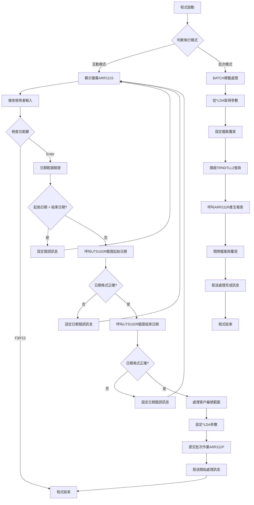
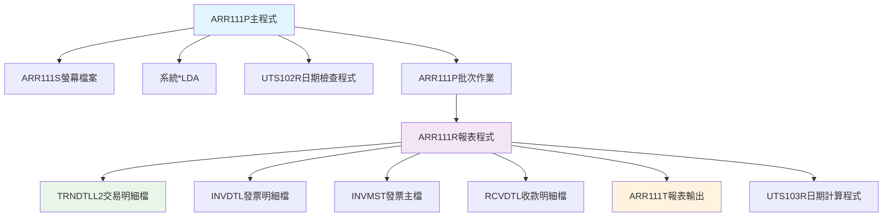
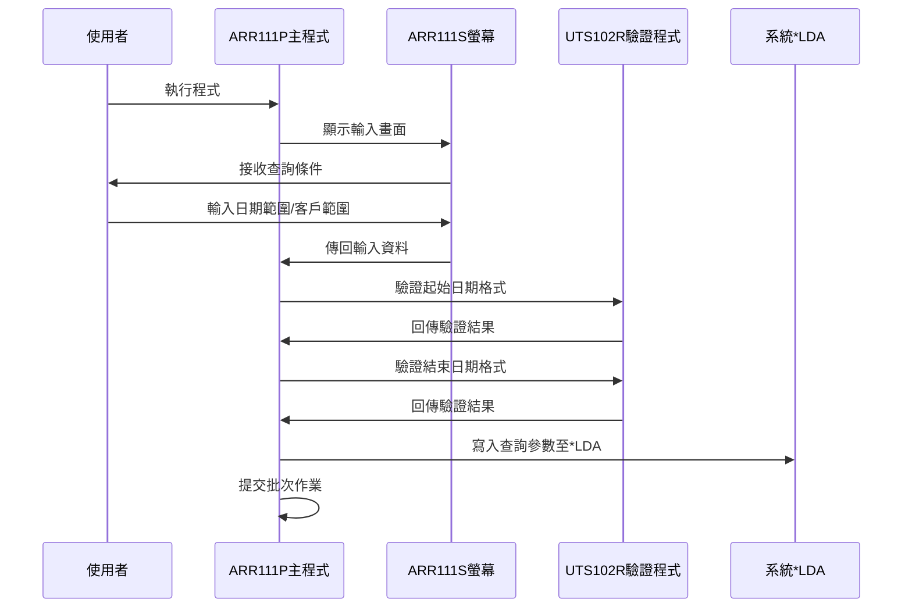
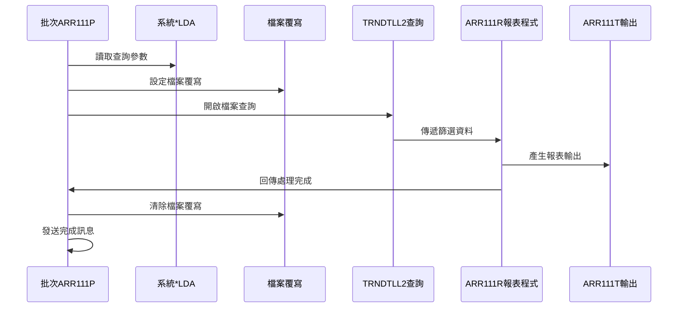
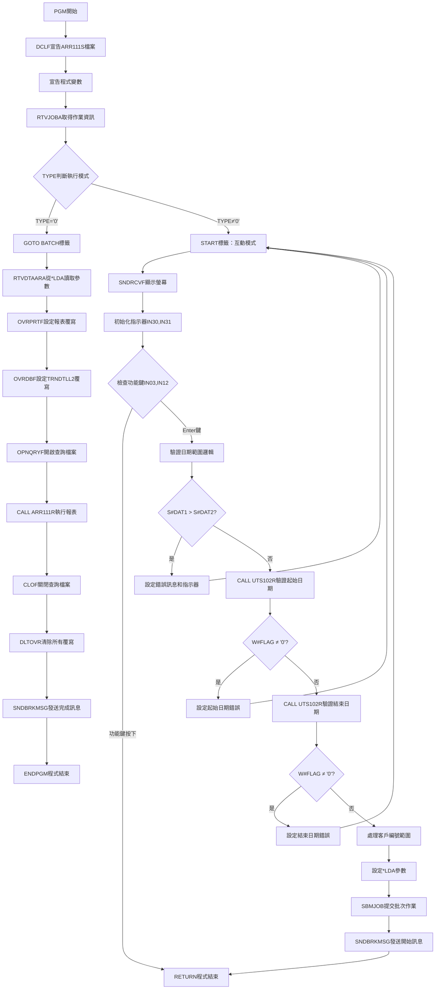

# ARR111P_P02 程式規格書

## 1. 基本資料

| 項目 | 內容 |
|------|------|
| **程式編號** | ARR111P |
| **程式名稱** | 來應收款日報表作業（依客戶） |
| **程式類型** | CLP |
| **廠區** | P02 |
| **系統名稱** | 應收帳款系統 |
| **子系統** | 應收帳款報表 |
| **檔案位置** | P02CLSRC_THSRC/ARR111P.txt |

## 2. 🎯 程式功能說明

### 主要功能描述
ARR111P為應收帳款系統的收款日報表控制程式，負責產生客戶收款平均天數統計報表。程式採用雙模式設計：互動模式負責接收使用者輸入的查詢條件，批次模式負責執行實際的報表產生作業。

### 🎯 業務流程詳細說明

#### 完整業務流程圖


#### 業務流程關鍵階段說明

**階段一：互動模式處理**
- 程式啟動時檢查JOB TYPE決定執行模式
- 互動模式下顯示ARR111S螢幕接收查詢條件
- 接收起始日期、結束日期、客戶編號起訖範圍
- 執行多層次的輸入驗證機制

**階段二：參數驗證處理** 
- 日期邏輯驗證：確保起始日期不大於結束日期
- 呼叫UTS102R進行日期格式驗證和轉換
- 客戶編號範圍處理：支援全範圍或特定範圍查詢
- 設定相應的錯誤指示器和訊息

**階段三：批次作業提交**
- 將驗證後的參數寫入*LDA指定位置
- 提交ARR111P批次作業至ARJOBD作業佇列
- 發送處理開始的中斷訊息通知使用者

**階段四：批次報表處理**
- 從*LDA讀取查詢參數
- 設定TRNDTLL2檔案覆寫和查詢條件
- 呼叫ARR111R執行報表資料處理和輸出
- 清理環境並發送處理完成訊息

#### 多層次驗證機制
- **輸入層驗證**：螢幕欄位格式和必填檢查
- **邏輯層驗證**：日期範圍邏輯檢查
- **格式層驗證**：呼叫UTS102R進行日期格式驗證
- **業務層驗證**：客戶編號存在性和權限檢查

#### 智能處理邏輯
- **智能範圍處理**：客戶編號支援空值自動設定為全範圍
- **條件組合邏輯**：支援起始或結束範圍單獨設定
- **錯誤恢復機制**：驗證失敗後返回輸入畫面繼續處理

#### 資料一致性確保機制
- **參數傳遞保護**：使用*LDA確保批次參數完整傳遞
- **檔案鎖定控制**：SHARE(*YES)確保多使用者存取一致性
- **交易完整性**：確保報表資料產生過程的完整性

## 3. 🎯 檔案架構與關聯圖

### 使用檔案清單

| 檔案名稱 | 檔案類型 | 使用方式 | 說明 |
|----------|---------|---------|------|
| ARR111S | DSPF | 輸入/輸出 | 螢幕檔案 |
| TRNDTLL2 | PF | 查詢 | 交易明細檔Level2 |
| ARR111T | PRTF | 輸出 | 報表輸出檔案 |

### 🎯 檔案關聯詳細視覺化圖表



### 🎯 資料流向詳細說明

#### 環境準備階段的資料流向


#### 業務處理階段的資料流向


#### 環境清理階段的資料流向


## 4. 🎯 檔案欄位規格說明

### 主要資料結構

#### *LDA資料區配置

| 位置 | 長度 | 欄位名稱 | 用途說明 |
|------|------|---------|---------|
| 300-307 | 8 | 查詢起始日期 | 報表查詢起始日期 |
| 308-315 | 8 | 查詢結束日期 | 報表查詢結束日期 |
| 316-321 | 6 | 客戶編號起 | 客戶編號查詢起始值 |
| 322-327 | 6 | 客戶編號迄 | 客戶編號查詢結束值 |
| 1011-1020 | 10 | 訊息佇列名稱 | 中斷訊息發送目標 |

### 🔍 重點欄位切割技術詳解

#### 程式變數結構分析
```
程式內部無複雜的DS結構切割，主要使用獨立變數定義：

&P#PDAT (8字元)：[YYYYMMDD]
                  ↓
用途：UTS102R日期檢查參數

&P#MODE (1字元)：[M]
                  ↓
用途：日期檢查模式（'1'=檢查格式）

&P#MTL (24字元)：[民國年月日中文描述字串    ]
                  ↓
用途：日期轉換後的中文描述

&P#LEAP (1字元)：[L]
                  ↓
用途：閏年判斷旗標

*LDA配置切割：
位置300-327：[起始日期|結束日期|客戶起|客戶迄]
             [300-307|308-315|316-321|322-327]
             ↓       ↓       ↓       ↓
             8字元    8字元    6字元    6字元
```

#### 實際數據範例說明
```
查詢條件範例：
&DAT1 = '20920429' （民國92年4月29日）
&DAT2 = '20920430' （民國92年4月30日）
&CUN1 = '      ' （客戶起始：空白表示從最小值開始）
&CUN2 = '999999' （客戶結束：999999表示到最大值）

*LDA寫入範例：
位置300：'20920429'
位置308：'20920430'
位置316：'      '
位置322：'999999'
```

### 重要變數定義表

| 變數名稱 | 型態 | 長度 | 用途說明 |
|----------|------|------|---------|
| &TYPE | *CHAR | 1 | 作業類型判斷（'0'=批次，其他=互動） |
| &W#FLAG | *CHAR | 1 | UTS102R回傳的處理旗標 |
| &P#PDAT | *CHAR | 8 | 傳給UTS102R的日期參數 |
| &P#MODE | *CHAR | 1 | UTS102R處理模式 |
| &P#MTL | *CHAR | 24 | UTS102R回傳的中文日期描述 |
| &P#LEAP | *CHAR | 1 | UTS102R回傳的閏年判斷 |
| &CUN1/&CUN2 | *CHAR | 6 | 處理後的客戶編號範圍 |
| &DAT1/&DAT2 | *CHAR | 8 | 處理後的日期範圍 |

## 5. 🎯 輸出/入螢幕布局

### 螢幕布局完整視覺化

```
+----------------------------------------------------------+
|1992/04/29        東明鋼鐵股份有限公司            ARR111S|
|時間               來應收款日報表作業（依客戶）           |
|使用者ID                                                  |
|                                                          |
|                                                          |
|                                                          |
|                                                          |
|                   報表日期：[____/__/__] ~~ [____/__/__]|
|                                                          |
|                   客戶編號：[______] ~~ [______]        |
|                                                          |
|                                                          |
|                                                          |
|                                                          |
|                                                          |
|                                                          |
|                                                          |
|                                                          |
|                                                          |
|                                                          |
|                                                          |
|                                                          |
|                                                          |
|PF3=結束離開                PF12=回到上層                |
|[錯誤訊息顯示區域]                                        |
+----------------------------------------------------------+
```

### 🎯 畫面欄位詳細說明

| 欄位名稱 | 位置 | 長度 | 型態 | 輸入格式 | 驗證規則 | 說明 |
|----------|------|------|------|---------|---------|------|
| S#DAT1 | 8,35 | 8 | 數值 | YYYY/MM/DD | 日期格式、不可大於S#DAT2 | 報表起始日期 |
| S#DAT2 | 8,49 | 8 | 數值 | YYYY/MM/DD | 日期格式、不可小於S#DAT1 | 報表結束日期 |
| S#CUN1 | 10,35 | 6 | 字元 | 客戶編號 | 可空白、存在性檢查 | 客戶編號起始 |
| S#CUN2 | 10,45 | 6 | 字元 | 客戶編號 | 可空白、存在性檢查 | 客戶編號結束 |
| S#ERR | 24,2 | 70 | 字元 | 唯讀 | 無 | 錯誤訊息顯示 |
| S#DEVN | 2,70 | 10 | 字元 | 唯讀 | 無 | 裝置名稱 |
| S#USER | 3,2 | 10 | 字元 | 唯讀 | 無 | 使用者ID |

### 🎯 畫面控制邏輯

#### 指示器控制說明
- **IN30**：S#DAT1起始日期錯誤指示器（反白顯示）
- **IN31**：S#DAT2結束日期錯誤指示器（反白顯示） 
- **IN32**：S#CUN1客戶編號起錯誤指示器（反白顯示）
- **IN33**：S#CUN2客戶編號迄錯誤指示器（反白顯示）

#### 欄位顯示屬性
- **DSPATR(PC)**：保護欄位（Protection Character）
- **DSPATR(RI)**：反白顯示（Reverse Image）
- **DSPATR(HI)**：高亮度顯示（High Intensity）

### 功能鍵詳細定義

| 功能鍵 | 處理邏輯 | 系統行為 |
|--------|---------|---------|
| **F3** | 程式結束 | 設定&IN03='1'，執行RETURN離開程式 |
| **F12** | 回到上層 | 設定&IN12='1'，執行RETURN離開程式 |
| **Enter** | 處理輸入 | 執行參數驗證和批次作業提交 |

### 操作流程
1. 使用者輸入查詢條件
2. 按Enter執行驗證
3. 驗證通過後提交批次作業
4. 按F3或F12離開程式

## 6. 🎯 處理流程程序說明

### 🎯 主程序邏輯深度分析

#### 程式執行流程圖


#### 🎯 詳細處理步驟逐一分析

**步驟1：程式初始化階段**
- 宣告ARR111S螢幕檔案供互動使用
- 定義所有必要的工作變數和參數變數
- 使用RTVJOBA取得作業類型資訊

**步驟2：執行模式判斷**
- 檢查TYPE變數值決定執行路徑
- TYPE='0'表示批次模式，跳轉至BATCH標籤
- 其他值表示互動模式，繼續START標籤流程

**步驟3：互動模式參數接收**
- 執行SNDRCVF顯示ARR111S螢幕等待輸入
- 初始化錯誤指示器IN30和IN31為'0'
- 檢查功能鍵IN03和IN12是否按下

**步驟4：輸入驗證處理**
- 執行日期邏輯驗證：起始日期不可大於結束日期
- 呼叫UTS102R分別驗證起始和結束日期格式
- 根據驗證結果設定對應的錯誤指示器和訊息

**步驟5：客戶編號範圍處理**
- 支援四種輸入組合的智能處理邏輯
- 空值自動設定為全範圍查詢（'      '到'999999'）
- 單邊輸入自動補齊另一邊的極值

**步驟6：批次作業準備與提交**
- 將驗證通過的參數寫入*LDA指定位置
- 使用SBMJOB提交ARR111P批次作業至ARJOBD佇列
- 發送中斷訊息通知使用者處理開始

**步驟7：批次模式資料處理**
- 從*LDA讀取查詢參數
- 設定ARR111T報表檔案和TRNDTLL2資料檔案覆寫
- 建立TRNDTLL2查詢條件並開啟查詢檔案

**步驟8：報表產生與環境清理**
- 呼叫ARR111R執行實際的報表資料處理
- 關閉查詢檔案並清除所有檔案覆寫
- 發送處理完成的中斷訊息

#### 業務邏輯深度解析

**客戶編號範圍處理邏輯**：
- 當CUN1和CUN2都為空時：設定為全範圍查詢
- 當CUN1為空、CUN2有值時：起始設為最小值
- 當CUN1有值、CUN2為空時：結束設為最大值  
- 當CUN1和CUN2都有值時：使用輸入值

**日期驗證機制**：
- 先執行邏輯驗證確保日期範圍正確
- 再呼叫UTS102R進行格式驗證和轉換
- 驗證失敗時設定對應的錯誤指示器

**檔案查詢條件建構**：
- 使用字串連接建立SQL-like查詢條件
- 包含日期範圍、客戶範圍、交易代碼篩選
- 支援排序和欄位對應設定

#### 條件判斷詳細說明

**作業類型判斷**：
```
IF COND(&TYPE *EQ '0') THEN(GOTO CMDLBL(BATCH))
```
- 條件：TYPE='0'表示批次作業環境
- 動作：直接跳轉至BATCH標籤執行批次邏輯

**日期範圍邏輯驗證**：
```  
IF COND(&S#DAT1 *GT &S#DAT2) THEN(DO)
```
- 條件：起始日期大於結束日期
- 動作：設定錯誤訊息並返回輸入畫面

**UTS102R驗證結果檢查**：
```
IF COND(&W#FLAG *NE '0') THEN(DO)
```
- 條件：日期驗證旗標不等於'0'表示格式錯誤
- 動作：設定日期錯誤指示器並返回畫面

#### 變數使用和數據流向

**關鍵變數流向追蹤**：
1. 畫面輸入：S#DAT1/S#DAT2 → 程式變數：&DAT1/&DAT2
2. 日期驗證：&DAT1/&DAT2 → UTS102R參數：&P#PDAT
3. 參數傳遞：&DAT1/&DAT2 → *LDA位置：300-315
4. 批次讀取：*LDA位置：300-315 → 批次變數：&DAT1/&DAT2

**客戶編號處理流向**：
1. 畫面輸入：S#CUN1/S#CUN2 → 程式變數：&CUN1/&CUN2
2. 條件處理：根據輸入狀態決定最終值
3. 參數傳遞：&CUN1/&CUN2 → *LDA位置：316-327
4. 批次使用：*LDA → OPNQRYF查詢條件

## 7. 🎯 數據操作與轉換分析

### 檔案操作詳解

#### TRNDTLL2交易明細檔操作
- **操作類型**：OPNQRYF條件查詢
- **查詢條件**：
  - DATE範圍篩選：起始日期到結束日期
  - TXCUNO客戶編號範圍篩選
  - TXCODE固定篩選條件'SA04'
- **排序欄位**：TXCUNO、TXVUNO、TXIVNO
- **欄位對應**：DATE對應TXDATE、TXVUNO對應DATE前6碼

#### 檔案存取的條件和篩選
```
QRYSLT(' +
   (DATE    *GE "' || &DAT1 || '") *AND +
   (DATE    *LE "' || &DAT2 || '") *AND +
   (TXCUNO  *GE "' || &CUN1 || '") *AND +
   (TXCUNO  *LE "' || &CUN2 || '") *AND +
   (TXCODE  *EQ "SA04"           )')
```

#### 檔案鎖定和併發處理
- **SHARE(*YES)**：允許多使用者同時存取
- **檔案覆寫**：OVRDBF確保存取正確的檔案版本
- **查詢檔案管理**：使用CLOF正確關閉查詢檔案

### 數據轉換邏輯

#### 日期格式轉換
- **輸入格式**：YYYY/MM/DD（螢幕顯示格式）
- **內部格式**：YYYYMMDD（8位數字格式）
- **轉換程式**：UTS102R負責格式驗證和轉換
- **中文轉換**：P#MTL回傳中文日期描述

#### 客戶編號處理轉換
- **空值轉換**：空白轉換為'      '（6個空格）
- **範圍轉換**：空白結束值轉換為'999999'
- **字串處理**：保持6位字元格式的一致性

#### 字串操作和格式化
- **訊息字串組合**：使用+號連接多行中文訊息
- **LDA子字串操作**：%SST(*LDA 1011 10)取得訊息佇列名稱
- **變數格式化**：確保日期和客戶編號的固定長度格式

### 計算邏輯分析

#### 參數位置計算
- **起始日期位置**：*LDA 300-307（8位元）
- **結束日期位置**：*LDA 308-315（8位元）
- **客戶起始位置**：*LDA 316-321（6位元）
- **客戶結束位置**：*LDA 322-327（6位元）

### 檢核機制詳解

#### 數據有效性檢查
- **日期格式檢查**：UTS102R驗證日期格式正確性
- **日期邏輯檢查**：起始日期不可大於結束日期
- **客戶編號檢查**：確保客戶編號範圍的邏輯性

#### 檢核失敗的處理方式
- **設定錯誤指示器**：IN30、IN31標示錯誤欄位
- **顯示錯誤訊息**：S#ERR欄位顯示具體錯誤內容
- **返回輸入畫面**：GOTO START重新接收輸入

#### 檢核規則的業務依據
- **日期範圍邏輯**：確保報表查詢範圍的合理性
- **格式一致性**：確保後續程式能正確處理日期資料
- **客戶範圍完整性**：確保查詢範圍的完整覆蓋

## 8. 🎯 錯誤處理程序說明

### 🎯 詳細錯誤代碼清冊

| 錯誤代碼 | 錯誤訊息 | 原因說明 | 處理方式 | 預防措施 |
|----------|---------|---------|---------|----------|
| **USER001** | 報表起迄不可大於報表終止 | 使用者輸入的起始日期大於結束日期 | 1. 設定IN30和IN31指示器<br>2. 顯示錯誤訊息於S#ERR欄位<br>3. 返回START標籤重新輸入 | 畫面設計時加入日期邏輯提示 |
| **USER002** | 報表起始輸入錯誤！ | UTS102R驗證起始日期格式錯誤 | 1. 設定IN30指示器反白顯示<br>2. 顯示錯誤訊息<br>3. 游標定位到S#DAT1欄位 | 使用日期編輯碼限制輸入格式 |
| **USER003** | 報表終止輸入錯誤！ | UTS102R驗證結束日期格式錯誤 | 1. 設定IN31指示器反白顯示<br>2. 顯示錯誤訊息<br>3. 游標定位到S#DAT2欄位 | 使用日期編輯碼限制輸入格式 |
| **FILE001** | TRNDTLL2檔案開啟失敗 | 交易明細檔案無法存取或檔案鎖定 | 1. 檢查檔案存在性<br>2. 確認檔案權限設定<br>3. 重新執行檔案覆寫 | 定期檢查檔案狀態和權限 |
| **SYS001** | 批次作業提交失敗 | SBMJOB提交至ARJOBD失敗 | 1. 檢查作業佇列狀態<br>2. 確認使用者權限<br>3. 重新提交作業 | 監控作業佇列運作狀況 |
| **SYS002** | *LDA參數讀取失敗 | RTVDTAARA從*LDA讀取參數失敗 | 1. 檢查*LDA資料區完整性<br>2. 確認參數寫入是否成功<br>3. 重新執行參數設定 | 確保參數寫入和讀取的完整性 |

### 🎯 系統異常處理邏輯

#### 檔案操作失敗處理
- **OPNQRYF失敗**：檢查TRNDTLL2檔案狀態和查詢條件語法
- **檔案覆寫失敗**：確認檔案路徑和權限設定
- **CLOF異常**：確保查詢檔案正確關閉，避免資源洩漏

#### 程式調用失敗處理
- **UTS102R調用失敗**：檢查日期檢查程式是否存在於程式庫
- **ARR111R調用失敗**：確認報表程式的完整性和參數傳遞
- **CALL參數錯誤**：驗證傳遞參數的格式和長度

#### 資料完整性錯誤處理
- ***LDA參數不一致**：比對寫入和讀取的參數值
- **日期範圍無效**：重新驗證日期範圍的合理性
- **客戶編號格式錯誤**：檢查客戶編號的格式和存在性

#### 並發控制失敗處理
- **檔案鎖定衝突**：使用SHARE(*YES)減少鎖定問題
- **作業佇列滿載**：監控ARJOBD佇列狀態並調整提交時機
- **資源競用**：確保檔案覆寫和查詢的正確順序

## 9. 🎯 備註

### 🎯 特殊注意事項

#### 日期處理特殊性
本程式使用民國年格式進行日期處理，與UTS102R程式配合進行格式驗證和轉換。日期輸入格式為YYYY/MM/DD，其中YYYY為民國年份。

#### 客戶編號範圍邏輯
程式支援靈活的客戶編號範圍查詢，包括全範圍、單邊範圍和指定範圍等多種查詢模式。空白輸入會自動轉換為對應的極值。

#### 批次作業設計
採用互動與批次分離的設計模式，互動部分負責參數收集和驗證，批次部分負責實際的資料處理，提高系統處理效率。

#### 檔案覆寫機制
使用OVRPRTF和OVRDBF確保批次處理時使用正確的檔案版本，並在處理完成後正確清除覆寫設定。

#### 訊息通知機制
程式在批次作業開始和結束時會發送中斷訊息通知使用者，訊息目標佇列從*LDA的1011-1020位置取得。

#### 查詢條件設定
TRNDTLL2檔案查詢使用固定的交易代碼'SA04'，配合日期和客戶範圍進行資料篩選，確保報表資料的準確性。 