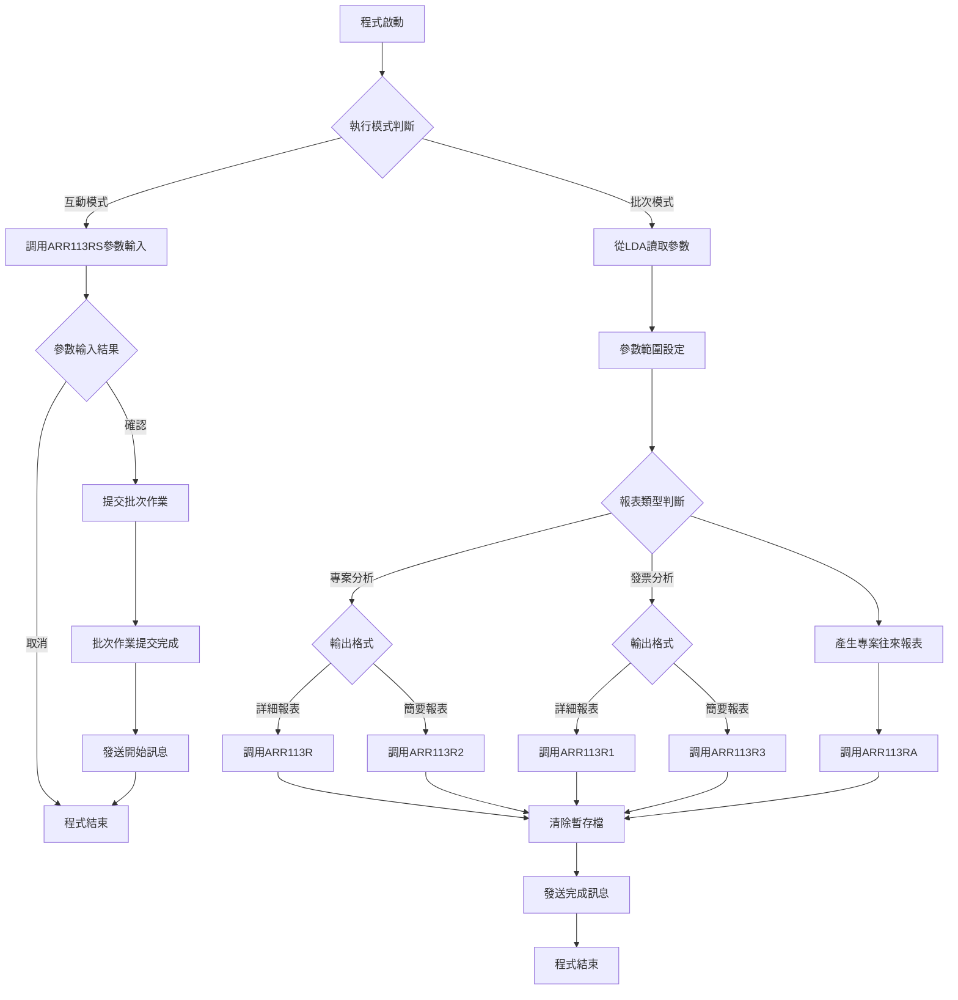
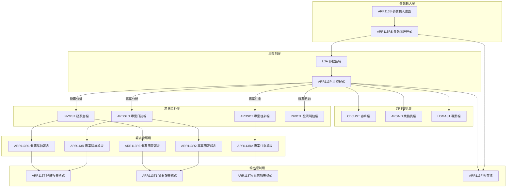
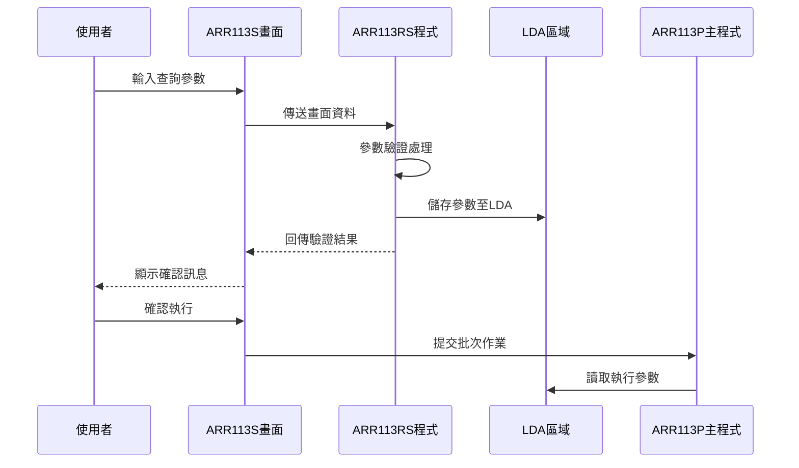
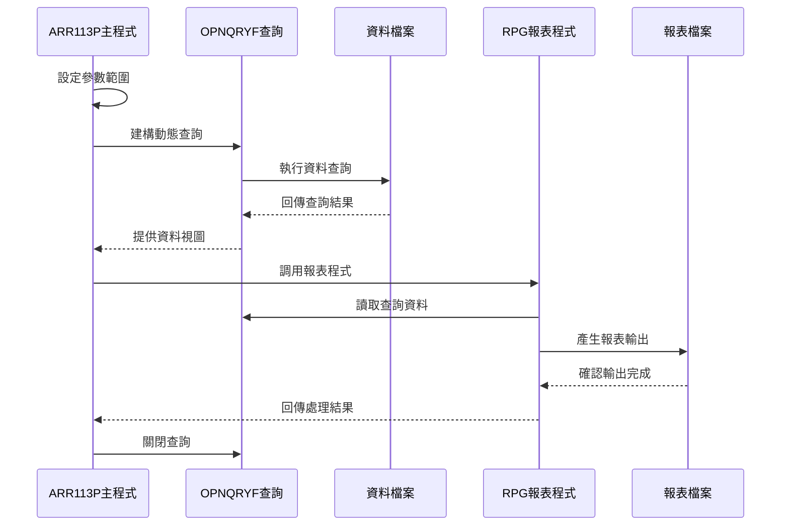
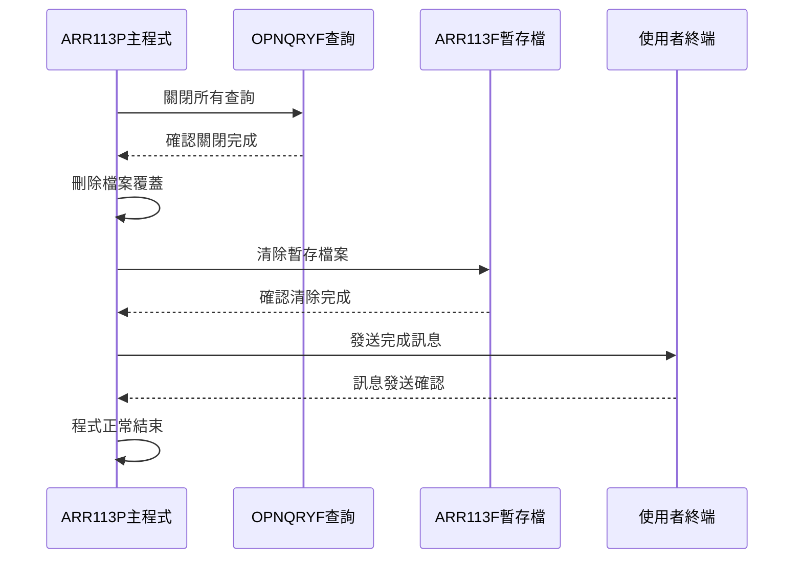
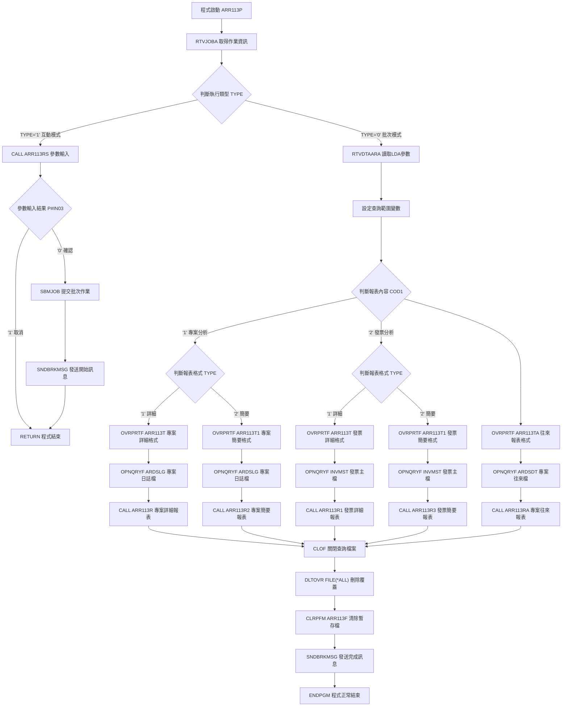

# ARR113P_P02 程式規格書

## 1. 基本資料

| 項目 | 內容 |
|------|------|
| **程式編號** | ARR113P |
| **程式名稱** | 發票專案報表分析 |
| **程式類型** | CLP |
| **廠區** | P02 |
| **系統名稱** | 應收帳款系統 |
| **子系統** | 應收帳款報表作業 |
| **檔案位置** | 東鋼list/ARR113P_P02.txt |

## 2. 🎯 程式功能說明

### 主要功能描述
ARR113P是應收帳款系統中的發票專案報表分析程式，提供多種發票相關報表的產生功能。程式可根據不同的查詢條件和報表類型，產生專案分析、發票分析等各種報表，支援互動式參數輸入和批次處理兩種執行模式。

### 🎯 業務流程詳細說明

#### 完整業務流程圖


#### 業務流程關鍵階段說明

**階段一：執行模式判斷**
- 使用RTVJOBA指令檢查作業類型
- 互動模式(TYPE='1')：進入參數輸入畫面
- 批次模式(TYPE='0')：直接從LDA讀取參數

**階段二：參數處理與驗證**
- 客戶編號範圍設定：空白時設為全部客戶('      '~'999999')
- 業務員編號範圍設定：空白時設為全部業務員('  '~'99')
- 發票地區範圍設定：空白時設為全部地區(' '~'9')
- 日期範圍和報表類型必須指定

**階段三：多類型報表產生**
- 根據COD1參數決定分析類型：'1'=專案分析，'2'=發票分析
- 根據TYPE參數決定輸出格式：'1'=詳細報表，'2'=簡要報表
- 2014年新增專案往來報表功能(ARR113RA)

**階段四：資料查詢與報表處理**
- 使用OPNQRYF動態建構查詢條件
- 按不同索引鍵排序資料
- 調用對應的RPG報表程式處理

### 多層次驗證機制
- 參數完整性驗證：所有必要參數不可空白
- 日期格式驗證：調用UTS102R進行日期格式檢查
- 檔案存在性驗證：確認客戶檔、業務員檔存在
- 數值範圍驗證：起始日期不可大於結束日期

### 智能處理邏輯
- 自動範圍補全：空白參數自動設定為最大範圍
- 動態查詢建構：根據參數動態產生QRYSLT條件
- 多重報表輸出：單次執行可產生多種報表類型
- 彈性排序控制：按不同業務需求排序資料

### 資料一致性確保機制
- 檔案共享控制：使用SHARE(*YES)確保資料一致
- 查詢結果隔離：使用OPNQRYF建立獨立視圖
- 暫存檔清理：執行完畢清除ARR113F暫存檔
- 錯誤狀態追蹤：完整的錯誤處理和狀態回報

## 3. 🎯 檔案架構與關聯圖

### 使用檔案清單

| 檔案名稱 | 檔案類型 | 存取方式 | 功能說明 |
|---------|---------|---------|---------|
| **ARR113S** | DSPF | 讀寫 | 參數輸入畫面檔案 |
| **ARDSLG** | PF | 讀取 | 專案日誌檔（專案分析資料來源） |
| **ARDSDT** | PF | 讀取 | 專案往來檔（新增往來報表資料） |
| **INVMST** | PF | 讀取 | 發票主檔（發票分析資料來源） |
| **INVDTL** | LF | 讀取 | 發票明細檔（發票明細資料） |
| **ARR113F** | PF | 讀寫 | 暫存工作檔（訂單編號暫存） |
| **CBCUST** | PF | 讀取 | 客戶主檔（客戶資料驗證） |
| **ARSAID** | PF | 讀取 | 業務員檔（業務員資料驗證） |
| **HSMAST** | PF | 讀取 | 專案主檔（專案資料驗證） |

### 🎯 檔案關聯詳細視覺化圖表



### 🎯 資料流向詳細說明

#### 環境準備階段的資料流向


#### 業務處理階段的資料流向


#### 環境清理階段的資料流向


## 4. 🎯 檔案欄位規格說明

### 主要資料結構

#### LDA參數區域配置
```
LDA參數結構 (300-326位置)：
位置 300-305：客戶編號 (CUNO)
位置 306：業務員編號 (SALE)  
位置 307-314：發票起始日期 (IND1)
位置 315-322：發票結束日期 (IND2)
位置 323：發票地區 (AREA)
位置 324：報表內容類型 (COD1)
位置 325：報表格式類型 (TYPE)
位置 326：查詢選擇 (CHIC)
位置 1011-1020：使用者終端 (DEVN)
```

### 🔍 重點欄位切割技術詳解

#### DS結構完整分析

**客戶編號切割結構 (D#CUNO)**
```
D#CUNO (6字元)：[X|XX|XXX|X]
                  ↓  ↓   ↓  ↓
S1KIND (1字元)： [X]              客戶類型代碼
S1CUN1 (1字元)：   [X]            客戶群組代碼
S1CUN2 (3字元)：     [XXX]        客戶序號
S1CUN3 (1字元)：         [X]      檢查碼
```

#### 欄位切割視覺化展示
```
客戶編號結構切割對應：
原始欄位 D#CUNO: [A|B|CDE|F]
切割位置:        1 2 3-5 6
                 ↓ ↓  ↓  ↓
S1KIND:         [A]______ 客戶分類識別
S1CUN1:          [B]_____ 客戶群組標識  
S1CUN2:           [CDE]__ 客戶流水編號
S1CUN3:               [F] 客戶檢核位元
```

#### 切割邏輯詳細說明
- **S1KIND**：識別客戶類型（一般客戶、VIP客戶、信用客戶等）
- **S1CUN1**：表示客戶所屬群組或地區分類
- **S1CUN2**：客戶的流水編號，用於排序和檢索
- **S1CUN3**：檢核碼，用於資料完整性驗證

#### 實際數據範例說明
```
範例客戶編號: 123456
切割結果:
- S1KIND = '1' (一般客戶)
- S1CUN1 = '2' (第2群組)  
- S1CUN2 = '345' (流水號345)
- S1CUN3 = '6' (檢核碼6)
```

### 重要變數定義表

| 變數名稱 | 資料型態 | 長度 | 說明 | 用途 |
|---------|---------|------|------|------|
| **&CUNO** | CHAR | 6 | 客戶編號變數 | 查詢條件控制 |
| **&CUN1** | CHAR | 6 | 客戶編號起始 | 範圍查詢下限 |
| **&CUN2** | CHAR | 6 | 客戶編號結束 | 範圍查詢上限 |
| **&SALE** | CHAR | 1 | 業務員編號變數 | 業務員篩選 |
| **&SAL1** | CHAR | 2 | 業務員編號起始 | 業務員範圍下限 |
| **&SAL2** | CHAR | 2 | 業務員編號結束 | 業務員範圍上限 |
| **&IND1** | CHAR | 8 | 發票起始日期 | 日期範圍下限 |
| **&IND2** | CHAR | 8 | 發票結束日期 | 日期範圍上限 |
| **&AREA** | CHAR | 1 | 發票地區變數 | 地區篩選條件 |
| **&ARE1** | CHAR | 1 | 發票地區起始 | 地區範圍下限 |
| **&ARE2** | CHAR | 1 | 發票地區結束 | 地區範圍上限 |
| **&COD1** | CHAR | 1 | 報表內容類型 | 1=專案分析 2=發票分析 |
| **&TYPE** | CHAR | 1 | 報表格式類型 | 1=詳細報表 2=簡要報表 |
| **&CHIC** | CHAR | 1 | 查詢選擇標記 | 1=查詢 2=不查詢 |

## 5. 🎯 輸出/入螢幕布局

### 螢幕布局完整視覺化

#### AR113F1 參數輸入畫面
```
┌──────────────────────────────────────────────────────────────────────────────┐
│ 2024/12/28        東亞鋼鐵股份有限公司應收帳款管理系統              ARR113S │
│ 10:30:25              發票專案報表分析                               USER01  │
│ ADMIN                                                                        │
│                                                                              │
│                                                                              │
│                     客戶編號：[______] (空白表示全部)                        │
│                                                                              │
│                     業務員編號：[_] (空白表示全部)                           │
│                                                                              │
│                     發票日期：[____/__/__] ~~ [____/__/__]                   │
│                                                                              │
│                     發票地區：[_] ( H:高雄 K:嘉義空白=全部)                  │
│                                                                              │
│                     報表內容：[_] ( 1:專案 2:非專案)                         │
│                                                                              │
│                     報表類型：[_] ( 1:詳細報表2:簡要表)                      │
│                                                                              │
│                     查詢選擇：[_] ( 1:查詢2:不查詢)                          │
│                                                                              │
│                                                                              │
│                                                                              │
│ 操作說明:                                                                    │
│                     PF3=離開作業                                             │
│ [錯誤訊息顯示區域]                                                           │
└──────────────────────────────────────────────────────────────────────────────┘
```

#### AR113F2 訂單查詢子畫面
```
┌──────────────────────────────────────────────────────────────────────────────┐
│ 2024/12/28        東亞鋼鐵股份有限公司應收帳款管理系統              ARR113S │
│ 10:30:25              發票專案報表分析                               USER01  │
│ ADMIN                                                                        │
│                                                                              │
│ 客戶編號:123456      業務員編號:A                                            │
│ 發票日期:2024/01/01  ~  2024/12/31      發票地區:H                          │
│                                                                              │
│ 訂單編號    訂單編號    訂單編號    訂單編號    訂單編號    訂單編號    訂單編號 │
│ ========================================================================== │
│ [______] [______] [______] [______] [______] [______] [______]            │
│ [______] [______] [______] [______] [______] [______] [______]            │
│ [______] [______] [______] [______] [______] [______] [______]            │
│ [______] [______] [______] [______] [______] [______] [______]            │
│ [______] [______] [______] [______] [______] [______] [______]            │
│ [______] [______] [______] [______] [______] [______] [______]            │
│ [______] [______] [______] [______] [______] [______] [______]            │
│ [______] [______] [______] [______] [______] [______] [______]            │
│                                                                              │
│ ========================================================================== │
│                                                                              │
│                     F3=離開      F12=回上層畫面      F05=列印               │
│ [錯誤訊息顯示區域]                                                           │
└──────────────────────────────────────────────────────────────────────────────┘
```

### 🎯 畫面欄位詳細說明

#### AR113F1 主輸入畫面欄位

| 欄位名稱 | 欄位屬性 | 輸入長度 | 輸入格式 | 驗證規則 |
|---------|---------|---------|---------|---------|
| **S#CUNO** | 英數字 | 6 | XXXXXX | 客戶檔存在性檢查 |
| **S#SALE** | 英數字 | 1 | X | 業務員檔存在性檢查 |
| **S#IND1** | 數字 | 8 | YYYYMMDD | 日期格式檢查 |
| **S#IND2** | 數字 | 8 | YYYYMMDD | 日期格式檢查 |
| **S#AREA** | 英文 | 1 | X | VALUES(' ' 'H' 'K') |
| **S#COD1** | 數字 | 1 | X | VALUES('1' '2') |
| **S#TYPE** | 數字 | 1 | X | VALUES('1' '2') |
| **S#CHIC** | 數字 | 1 | X | VALUES('1' '2') |

#### AR113F2 子檔案欄位

| 欄位名稱 | 欄位屬性 | 輸入長度 | 說明 | 處理邏輯 |
|---------|---------|---------|------|---------|
| **S#ORNO** | 英數字 | 6 | 訂單編號 | 專案檔存在性檢查 |

### 🎯 畫面控制邏輯

#### 指示器控制說明
- **IN30-IN36**：欄位錯誤顯示控制（PC+RI屬性）
- **IN70**：子檔案資料異動指示器
- **IN71-IN74**：子檔案顯示控制
- **IN90-IN99**：錯誤狀態控制指示器

### 功能鍵詳細定義

| 功能鍵 | 處理邏輯 | 系統行為 | 畫面轉換 |
|-------|---------|---------|---------|
| **F3** | 離開作業 | 設定P#IN03='1' | 回到主選單 |
| **F12** | 回上層畫面 | 回到參數輸入畫面 | AR113F2→AR113F1 |
| **F5** | 列印執行 | 執行報表列印處理 | 保持目前畫面 |
| **ENTER** | 確認輸入 | 參數驗證並進入下一步 | AR113F1→AR113F2 |

### 操作流程
1. **參數輸入**：在AR113F1畫面輸入查詢條件
2. **參數驗證**：系統自動驗證所有輸入參數
3. **訂單選擇**：若選擇查詢則進入AR113F2畫面
4. **報表產生**：確認後提交批次作業產生報表

## 6. 🎯 處理流程程序說明

### 🎯 主程序邏輯深度分析

#### 程式執行流程圖


#### 🎯 詳細處理步驟逐一分析

**步驟1：環境初始化與模式判斷**
```
1.1 程式啟動，宣告所有必要變數
1.2 使用 RTVJOBA 取得當前作業資訊 
1.3 檢查 TYPE 值判斷互動或批次模式
1.4 設定程式執行路徑
```

**步驟2：參數處理與範圍設定**
```
2.1 互動模式：調用 ARR113RS 進行參數輸入
2.2 批次模式：從 LDA 位置 300-326 讀取參數
2.3 客戶編號範圍處理：
    - 空白時：CUN1='      ', CUN2='999999'
    - 有值時：CUN1=CUN2=CUNO
2.4 業務員編號範圍處理：
    - 空白時：SAL1='  ', SAL2='99'  
    - 有值時：SAL1=SAL2=SALE
2.5 發票地區範圍處理：
    - 空白時：ARE1=' ', ARE2='9'
    - 有值時：ARE1=ARE2=AREA
```

**步驟3：多重報表類型處理**
```
3.1 專案分析報表 (COD1='1')：
    3.1.1 詳細報表：ARR113T + ARDSLG + ARR113R
    3.1.2 簡要報表：ARR113T1 + ARDSLG + ARR113R2
3.2 發票分析報表 (COD1='2')：
    3.2.1 詳細報表：ARR113T + INVMST + ARR113R1
    3.2.2 簡要報表：ARR113T1 + INVMST + ARR113R3
3.3 專案往來報表 (新增功能)：
    3.3.1 ARR113TA + ARDSDT + ARR113RA
```

**步驟4：動態查詢建構與執行**
```
4.1 使用 OVRDBF 設定檔案共享模式
4.2 使用 OPNQRYF 建構動態查詢條件：
    - 日期範圍：INDT >= IND1 AND INDT <= IND2
    - 客戶範圍：CUNO >= CUN1 AND CUNO <= CUN2  
    - 業務員範圍：SALE >= SAL1 AND SALE <= SAL2
    - 地區範圍：AREA >= ARE1 AND AREA <= ARE2
4.3 設定排序鍵值：
    - 專案報表：(INDT, INNO)
    - 發票簡要：(CUNO, ORNO, INNO)
4.4 建立字元格式映射：INDT -> CHAR 8
```

### 🎯 子程序邏輯分析

#### ARR113RS 參數輸入子程序
- **功能**：提供互動式參數輸入畫面
- **參數傳遞**：P#IN03 (取消標記)
- **返回值**：'1'=取消，'0'=確認
- **驗證邏輯**：客戶檔、業務員檔、日期格式檢查

#### ARR113R系列 報表處理子程序
- **ARR113R**：專案分析詳細報表程式
- **ARR113R1**：發票分析詳細報表程式  
- **ARR113R2**：專案分析簡要報表程式
- **ARR113R3**：發票分析簡要報表程式
- **ARR113RA**：專案往來報表程式（2014年新增）

### 🎯 特殊邏輯處理

#### 複雜範圍設定算法
```
範圍設定邏輯：
IF 參數 = 空白 THEN
    起始值 = 最小值
    結束值 = 最大值  
ELSE
    起始值 = 參數值
    結束值 = 參數值
END IF
```

#### 多重報表輸出控制
```
報表選擇邏輯：
COD1='1' AND TYPE='1' → 專案詳細報表
COD1='1' AND TYPE='2' → 專案簡要報表  
COD1='2' AND TYPE='1' → 發票詳細報表
COD1='2' AND TYPE='2' → 發票簡要報表
無條件執行 → 專案往來報表 (2014年新增)
```

#### 動態查詢條件組裝
```
查詢字串動態組裝：
QRYSLT(' (INDT *GE "' || &IND1 || '") *AND 
         (INDT *LE "' || &IND2 || '") *AND
         (CUNO *GE "' || &CUN1 || '") *AND  
         (CUNO *LE "' || &CUN2 || '") *AND
         (SALE *GE "' || &SAL1 || '") *AND
         (SALE *LE "' || &SAL2 || '") *AND
         (AREA *GE "' || &ARE1 || '") *AND
         (AREA *LE "' || &ARE2 || '")')
```

### 業務邏輯深度解析

#### 報表分類邏輯
- **專案分析**：基於ARDSLG專案日誌檔，分析專案執行狀況
- **發票分析**：基於INVMST發票主檔，分析發票開立狀況  
- **專案往來**：基於ARDSDT專案往來檔，追蹤K類專案往來

#### 日期處理邏輯
- 使用8位數字格式(YYYYMMDD)儲存日期
- 透過EDTWRD編輯字進行格式化顯示
- 查詢時轉換為字元格式進行比較

#### 檔案存取最佳化
- 使用SHARE(*YES)避免檔案鎖定
- 使用OPNQRYF減少資料傳輸量
- 使用適當索引提升查詢效能

### 條件判斷詳細說明

#### 主要條件分支
1. **執行模式判斷**：TYPE='0'(批次) vs TYPE='1'(互動)
2. **報表內容判斷**：COD1='1'(專案) vs COD1='2'(發票)  
3. **報表格式判斷**：TYPE='1'(詳細) vs TYPE='2'(簡要)
4. **參數空白判斷**：決定查詢範圍設定方式

#### 錯誤處理條件
- 檔案不存在：使用Chain指令檢查
- 參數格式錯誤：透過子程序驗證
- 系統資源不足：依賴AS/400系統處理

### 變數使用和數據流向

#### 關鍵變數追蹤
- **&TYPE**：用於模式判斷和格式控制（重複使用）
- **&CUNO,&CUN1,&CUN2**：客戶編號範圍控制鏈
- **&IND1,&IND2**：日期範圍，從數字轉字元格式
- **&COD1**：報表類型選擇的核心控制變數

#### 資料轉換流程
```
LDA參數 → CLP變數 → 範圍設定 → 查詢條件 → RPG程式 → 報表輸出
```

## 7. 🎯 數據操作與轉換分析

### 檔案操作詳解

#### READ操作邏輯
- **RTVDTAARA**：從LDA讀取批次執行參數
- **Chain操作**：在ARR113RS中驗證客戶檔、業務員檔存在性
- **OPNQRYF**：建立動態查詢視圖進行大量資料讀取

#### WRITE操作邏輯
- **CHGDTAARA**：在ARR113RS中將參數寫入LDA
- **WRITEAR113F**：在ARR113RS中寫入訂單編號至暫存檔
- **報表輸出**：透過OVRPRTF將報表資料寫入列印檔

#### UPDATE操作邏輯
- **UPDATAR113F2**：在ARR113RS中更新子檔案顯示狀態
- **參數更新**：透過UDS在程式間傳遞更新後的參數

#### DELETE操作邏輯
- **CLRPFM ARR113F**：清除暫存檔案內容
- **DLTOVR FILE(*ALL)**：刪除所有檔案覆蓋設定
- **CLOF**：關閉OPNQRYF建立的查詢視圖

### 檔案鎖定和併發處理
- 使用**SHARE(*YES)**確保多使用者同時存取
- OPNQRYF建立獨立查詢視圖，避免檔案鎖定
- 暫存檔ARR113F為使用者專屬，無併發問題

### 檔案存取的條件和篩選

#### 專案日誌檔查詢條件 (ARDSLG)
```sql
條件組合：
- INDT (發票日期) 在指定範圍內
- ADCUNO (客戶編號) 在指定範圍內  
- ADSALE (業務員) 在指定範圍內
- ADAREA (地區) 在指定範圍內
排序：ADINDT, ADINNO
```

#### 專案往來檔查詢條件 (ARDSDT)
```sql
條件組合：
- ASKIND = 'K' (K類專案)
- INDT (日期) 在指定範圍內
- ASCUNO (客戶編號) 在指定範圍內
- ASSALE (業務員) 在指定範圍內  
- ASAREA (地區) 在指定範圍內
排序：ASINDT, ASINNO
```

#### 發票主檔查詢條件 (INVMST)
```sql
條件組合：
- INDT (發票日期) 在指定範圍內
- INCUNO (客戶編號) 在指定範圍內
- INSALE (業務員) 在指定範圍內
- INAREA (地區) 在指定範圍內
排序：詳細(ININDT,INNO) / 簡要(INCUNO,INORNO,INNO)
```

### 數據轉換邏輯

#### 數值格式轉換的詳細方式
- **日期轉換**：8位數字(YYYYMMDD) → 字元格式用於查詢比較
- **客戶編號**：6位字元 → 切割為4個子欄位(KIND,CUN1,CUN2,CUN3)
- **範圍設定**：單一值 → 起始值和結束值的範圍對

#### 日期時間處理邏輯
- **輸入格式**：YYYY/MM/DD (畫面顯示)
- **儲存格式**：YYYYMMDD (8位數字)
- **查詢格式**：'YYYYMMDD' (字元串)
- **驗證機制**：調用UTS102R進行日期有效性檢查

#### 字串操作和格式化
- **LEN函數**：用於字串長度控制
- **%SST函數**：用於LDA區域的字串擷取
- **EDTWRD**：用於日期格式化顯示 ('    /  /  ')
- **串接操作**：動態組裝QRYSLT查詢字串

### 計算邏輯分析

#### 範圍計算的業務意義
```
範圍擴展算法：
空白輸入 → 最大範圍查詢
具體輸入 → 精確條件查詢

客戶編號：'      ' ~ '999999' (全部客戶)
業務員：  '  ' ~ '99' (全部業務員)  
地區：    ' ' ~ '9' (全部地區)
```

#### 條件組合的計算邏輯
- **AND邏輯**：所有條件必須同時滿足
- **範圍查詢**：使用GE(>=)和LE(<=)組合
- **字元比較**：按ASCII順序進行範圍比較

### 檢核機制詳解

#### 數據有效性檢查的具體邏輯
1. **客戶編號檢核**：檢查CBCUST客戶檔中是否存在
2. **業務員編號檢核**：檢查ARSAID業務員檔中是否存在  
3. **日期格式檢核**：調用UTS102R進行日期合法性驗證
4. **日期範圍檢核**：起始日期不可大於結束日期
5. **參數完整性檢核**：必要參數不可為空白

#### 檢核失敗的處理方式
- **設定錯誤指示器**：IN30-IN99對應不同錯誤類型
- **顯示錯誤訊息**：透過S#ERR欄位顯示具體錯誤內容
- **阻止繼續執行**：有錯誤時不進入報表產生階段
- **保持輸入資料**：錯誤時保留使用者已輸入的資料

#### 檢核規則的業務依據
- **客戶檔檢核**：確保報表產生的客戶資料完整性
- **業務員檢核**：確保業務員歸屬和權限正確性
- **日期檢核**：確保日期範圍合理和格式正確性
- **範圍檢核**：確保查詢條件邏輯正確性

## 8. 🎯 錯誤處理程序說明

### 🎯 詳細錯誤代碼清冊

| 錯誤代碼 | 錯誤訊息 | 原因說明 | 處理方式 | 預防措施 |
|----------|---------|---------|---------|----------|
| **IN30** | 請輸入客戶編號或按空白 | 客戶編號輸入格式錯誤或檔案不存在 | 1. 檢查客戶編號格式<br>2. 確認客戶檔案存在<br>3. 重新輸入正確編號 | 建立客戶編號檢核清單定期維護 |
| **IN31** | 請輸入業務員編號或按空白 | 業務員編號不存在於ARSAID檔案中 | 1. 確認業務員編號正確性<br>2. 檢查業務員檔案<br>3. 聯繫系統管理員 | 定期更新業務員主檔資料 |
| **IN32** | 請輸入發票起始日期 | 發票起始日期為空白或格式錯誤 | 1. 輸入8位數日期格式<br>2. 確認日期合法性<br>3. 檢查日期範圍 | 提供日期輸入格式說明 |
| **IN33** | 請輸入發票結束日期 | 發票結束日期為空白或格式錯誤 | 1. 輸入正確日期格式<br>2. 確認日期有效性<br>3. 檢查與起始日期關係 | 設定日期輸入輔助功能 |
| **IN323399** | 發票起始日期不可大於結束日期 | 日期範圍邏輯錯誤 | 1. 調整日期範圍<br>2. 重新輸入日期<br>3. 確認業務邏輯 | 增加日期範圍即時檢核 |
| **IN34** | 請輸入報表內容類型 | 報表內容選擇為空白 | 1. 選擇1(專案)或2(發票)<br>2. 確認報表需求<br>3. 重新選擇 | 提供報表類型說明文件 |
| **IN35** | 請輸入報表格式類型 | 報表格式選擇為空白 | 1. 選擇1(詳細)或2(簡要)<br>2. 確認輸出需求<br>3. 重新選擇 | 建立報表格式範例 |
| **IN36** | 請輸入是否查詢訂單 | 查詢選擇為空白 | 1. 選擇1(查詢)或2(不查詢)<br>2. 確認是否需要訂單篩選<br>3. 重新選擇 | 說明查詢選項差異 |
| **FILE001** | 專案檔案讀取失敗 | ARDSLG或ARDSDT檔案無法開啟 | 1. 檢查檔案權限<br>2. 確認檔案完整性<br>3. 聯繫系統管理員 | 定期檢查檔案系統狀態 |
| **FILE002** | 發票檔案讀取失敗 | INVMST或INVDTL檔案無法開啟 | 1. 檢查檔案狀態<br>2. 確認資料庫連線<br>3. 重新執行程式 | 建立檔案備份機制 |
| **SYS001** | 系統資源不足 | 記憶體或磁碟空間不足 | 1. 清理系統資源<br>2. 等待系統負載降低<br>3. 分批處理資料 | 監控系統資源使用狀況 |
| **USER001** | 訂單編號輸入錯誤 | 輸入的訂單編號不存在 | 1. 確認訂單編號正確性<br>2. 檢查專案檔案<br>3. 重新輸入 | 建立訂單編號查詢功能 |
| **USER002** | 訂單客戶不符 | 訂單所屬客戶與查詢客戶不符 | 1. 確認客戶編號<br>2. 檢查訂單歸屬<br>3. 修正輸入條件 | 增加客戶訂單關聯檢查 |

### 🎯 系統異常處理邏輯

#### 檔案操作失敗處理
```
檔案錯誤處理序列：
1. 偵測檔案操作錯誤(Chain指令)
2. 設定對應錯誤指示器
3. 記錄錯誤訊息至S#ERR欄位  
4. 阻止後續處理繼續執行
5. 保持使用者輸入資料狀態
```

#### 程式調用失敗處理
```
子程式錯誤處理：
1. 檢查P#IN03回傳值
2. 若為'1'則使用者取消操作
3. 若為'0'則正常繼續處理
4. 異常狀況則記錄錯誤並結束
```

#### 資料完整性錯誤處理
```
資料驗證錯誤處理：
1. 逐一檢查所有輸入參數
2. 使用IN99作為總錯誤指示器
3. 任一參數錯誤則設定IN99=ON
4. 錯誤狀態下不執行業務邏輯
```

#### 並發控制失敗處理
```
檔案鎖定處理：
1. 使用SHARE(*YES)避免獨占
2. OPNQRYF建立獨立視圖
3. 確保檔案及時關閉釋放資源
4. 異常時透過DLTOVR清理環境
```

### 錯誤恢復機制
- **自動重試**：檔案暫時無法存取時自動重試
- **資料保護**：錯誤時保持使用者已輸入的資料
- **環境清理**：程式結束時自動清理所有覆蓋設定
- **狀態恢復**：子檔案維持最後有效狀態

### 錯誤記錄機制
- **即時顯示**：錯誤訊息立即顯示於畫面
- **指示器控制**：使用IN30-IN99精確標示錯誤位置
- **訊息分類**：區分系統錯誤、使用者錯誤、檔案錯誤
- **操作指引**：提供具體的錯誤解決建議

## 9. 🎯 備註

### 🎯 特殊注意事項

#### 程式執行相關
- 互動模式下程式會自動提交批次作業，不會即時產生報表
- 批次執行時需確保所有參數已正確設定於LDA區域
- 程式支援多種報表類型同時產生，執行時間較長
- 2014年新增專案往來報表功能，增加ARDSDT檔案查詢

#### 資料處理相關  
- 使用OPNQRYF進行大量資料查詢，記憶體需求較高
- 空白參數會自動擴展為全範圍查詢，可能產生大量報表
- 日期格式必須為8位數字，系統會自動進行格式檢核
- 客戶編號支援切割分析，可進行更精細的資料分類

#### 系統整合相關
- 程式依賴多個共用檔案，執行前需確認檔案完整性
- 與UTS102R日期檢核程式整合，確保日期資料正確性
- 支援多使用者同時執行，使用檔案共享模式
- 暫存檔ARR113F為使用者專屬，避免資料混淆

#### 報表輸出相關
- 報表格式支援15 CPI密集列印，適合大量資料輸出
- 詳細報表寬度為198字元，簡要報表為132字元
- 報表輸出使用HOLD(*YES)模式，需手動釋放列印
- 支援自訂列印佇列，可配合不同印表機需求 