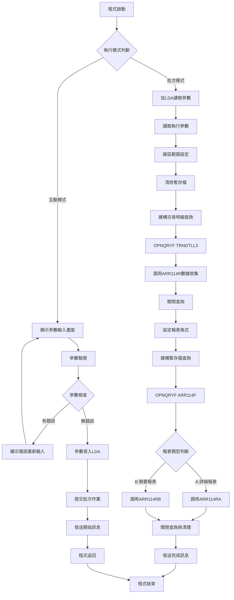
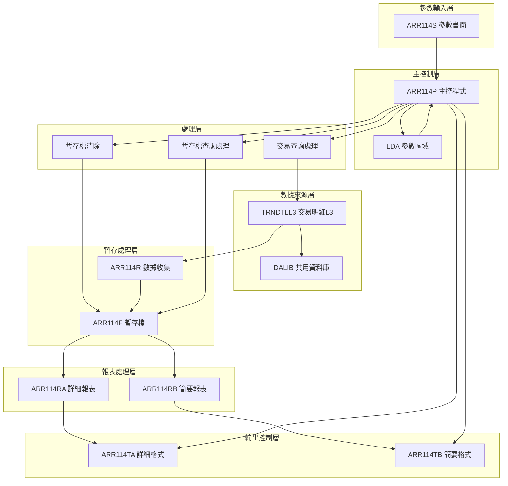
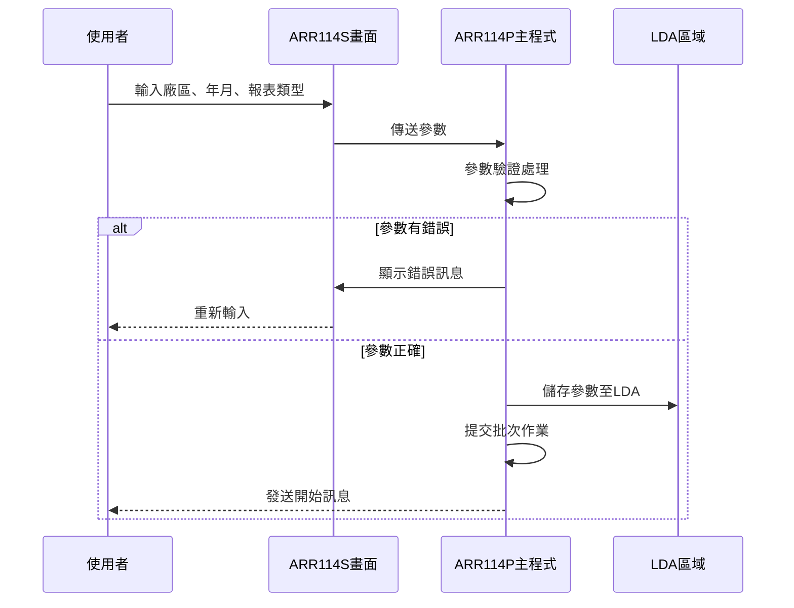
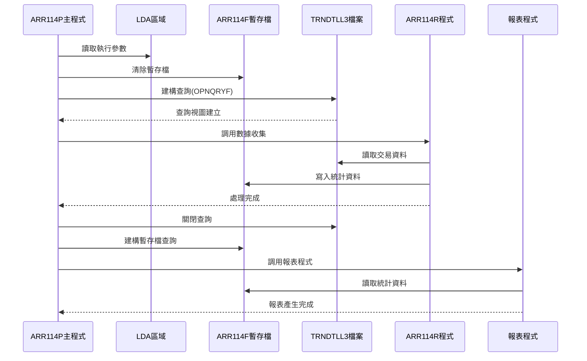
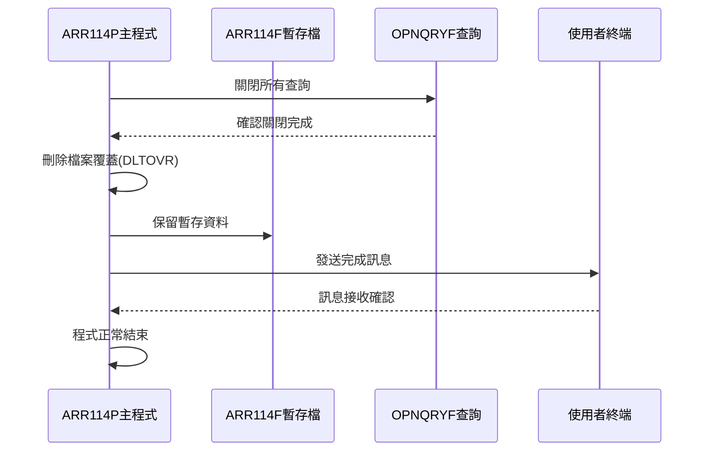
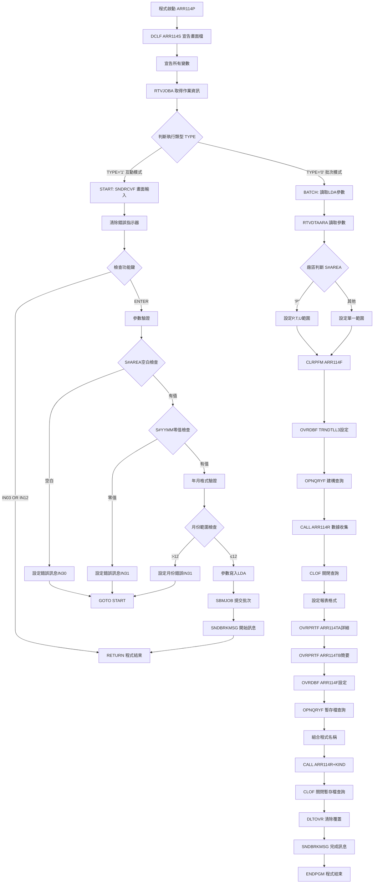

# ARR114P_P02 程式規格書

## 1. 基本資料

| 項目 | 內容 |
|------|------|
| **程式編號** | ARR114P |
| **程式名稱** | 營收統計報表(含個人區域和多項指定) |
| **程式類型** | CLP |
| **廠區** | P02 |
| **系統名稱** | 應收帳款系統 |
| **子系統** | 應收帳款報表作業 |
| **檔案位置** | 東鋼list/ARR114P_P02.txt |

## 2. 🎯 程式功能說明

### 主要功能描述
ARR114P是應收帳款系統中的營收統計報表程式，提供多區域營收分析功能。程式可根據指定廠區、年月期間和報表類型，產生詳細或簡要的營收統計報表，支援互動式參數輸入和批次處理兩種執行模式。

### 🎯 業務流程詳細說明

#### 完整業務流程圖


#### 業務流程關鍵階段說明

**階段一：執行模式判斷與參數處理**
- 使用RTVJOBA檢查執行類型
- 互動模式：進入畫面參數輸入
- 批次模式：從LDA讀取預設參數

**階段二：參數驗證與範圍設定**
- 廠區代碼必須輸入，不可空白
- 年月格式必須為YYYYMM，月份範圍1-12
- P廠區自動擴展為P、T、U三個區域(1999年擴充)

**階段三：交易資料收集處理**
- 清除ARR114F暫存檔
- 從TRNDTLL3查詢指定年月的交易記錄
- 支援當月資料(ACDT)和保留資料(RESV)查詢
- 篩選已確認交易(TXFL01='Y')，排除刪除記錄(TXFLAG≠'D')

**階段四：營收統計報表產生**
- 設定兩種報表格式：詳細報表(132欄)、簡要報表(98欄)
- 按廠區範圍篩選暫存檔資料
- 根據報表類型調用對應RPG程式
- 支援多區域組合查詢功能

### 多層次驗證機制
- 廠區代碼完整性驗證：不可空白輸入
- 年月格式驗證：YYYYMM格式，月份1-12範圍檢查
- 報表類型驗證：限定A(詳細)或B(簡要)選項
- 系統參數一致性驗證：LDA參數正確性檢查

### 智能處理邏輯
- 廠區自動擴展：P廠區自動包含P、T、U區域
- 動態查詢建構：根據年月期間動態組裝查詢條件
- 彈性報表選擇：支援詳細和簡要兩種報表格式
- 數據完整性控制：自動排除無效和刪除的交易記錄

### 資料一致性確保機制
- 暫存檔重建：每次執行前清除並重建暫存檔
- 檔案共享控制：使用SHARE(*YES)避免檔案鎖定
- 查詢結果隔離：使用OPNQRYF建立獨立資料視圖
- 環境清理：程式結束時刪除所有檔案覆蓋設定

## 3. 🎯 檔案架構與關聯圖

### 使用檔案清單

| 檔案名稱 | 檔案類型 | 存取方式 | 功能說明 |
|---------|---------|---------|---------|
| **ARR114S** | DSPF | 讀寫 | 參數輸入畫面檔案 |
| **TRNDTLL3** | LF | 讀取 | 交易明細邏輯檔L3（數據來源） |
| **ARR114F** | PF | 讀寫 | 營收統計暫存檔（中間處理） |
| **ARR114TA** | PRTF | 輸出 | 詳細報表列印檔（132欄） |
| **ARR114TB** | PRTF | 輸出 | 簡要報表列印檔（98欄） |

### 🎯 檔案關聯詳細視覺化圖表



### 🎯 資料流向詳細說明

#### 環境準備階段的資料流向


#### 業務處理階段的資料流向


#### 環境清理階段的資料流向


## 4. 🎯 檔案欄位規格說明

### 主要資料結構

#### LDA參數區域配置
```
LDA參數結構 (300-307位置)：
位置 300：廠區代碼 (AREA)
位置 301-306：年月期間 (YYMM) 
位置 303-306：四位年月 (YM)
位置 307：報表類型 (KIND)
位置 1011-1020：使用者終端 (DEVN)
```

### 🔍 重點欄位切割技術詳解

#### 年月參數切割結構
```
C#YYMM (6字元)：[YYYY|MM]
                  ↓    ↓
C#YY (4字元)：   [YYYY]     年份部分
C#MM (2字元)：        [MM]  月份部分
```

#### 欄位切割視覺化展示
```
年月參數切割對應：
原始輸入 S#YYMM: [202412]
儲存至LDA:       [202412]
位置對應:        300-305
                 ↓
讀取切割:
C#YY:           [2024] (位置 300-303)
C#MM:           [12]   (位置 304-305)
```

#### 切割邏輯詳細說明
- **C#YYMM**：完整的6位年月輸入(YYYYMM格式)
- **C#YY**：提取前4位作為年份識別
- **C#MM**：提取後2位作為月份，進行1-12範圍驗證

#### 實際數據範例說明
```
範例輸入: 202412
處理結果:
- C#YYMM = '202412' (完整年月)
- C#YY = '2024' (年份)
- C#MM = '12' (月份)
- 月份驗證: 12 ≤ 12 (有效)
```

### 重要變數定義表

| 變數名稱 | 資料型態 | 長度 | 說明 | 用途 |
|---------|---------|------|------|------|
| **&S#AREA** | CHAR | 1 | 廠區代碼輸入 | 廠區識別控制 |
| **&S#YYMM** | NUMERIC | 6 | 年月輸入 | 時間範圍控制 |
| **&S#KIND** | CHAR | 1 | 報表類型 | A=詳細 B=簡要 |
| **&C#YYMM** | CHAR | 6 | 年月字元轉換 | 查詢條件使用 |
| **&C#YY** | CHAR | 4 | 年份部分 | 年份驗證 |
| **&C#MM** | CHAR | 2 | 月份部分 | 月份範圍檢查 |
| **&ARE1** | CHAR | 1 | 廠區範圍起始 | 查詢範圍下限 |
| **&ARE2** | CHAR | 1 | 廠區範圍結束 | 查詢範圍上限 |
| **&ARE3** | CHAR | 1 | 廠區範圍擴充 | U廠區擴充支援 |
| **&W#PGM** | CHAR | 8 | 動態程式名稱 | ARR114R+報表類型 |

## 5. 🎯 輸出/入螢幕布局

### 螢幕布局完整視覺化

#### AR114F1 參數輸入畫面
```
┌──────────────────────────────────────────────────────────────────────────────┐
│ 2024/12/28        東亞鋼鐵股份有限公司應收帳款管理系統              ARR114S │
│ 10:30:25    營收統計報表(含個人區域和多項指定)作業                   USER01  │
│ ADMIN                                                                        │
│                                                                              │
│                                                                              │
│                                                                              │
│                                                                              │
│                     廠區發票地區：[_] (P:台北,嘉義,屏東 M:台中)                │
│                                     K:高雄N:南投H:花蓮)                       │
│                                                                              │
│                     查詢月份年月：[____/__]                                   │
│                                                                              │
│                     報表輸出類型：[_] (A:詳細報表B:簡要表)                     │
│                                                                              │
│                                                                              │
│                                                                              │
│                                                                              │
│                                                                              │
│                                                                              │
│                                                                              │
│                                                                              │
│ F03:離開                                                                     │
│                     F12:回上                                                 │
│                                     ENTER:確認                              │
│ [錯誤訊息顯示區域]                                                           │
└──────────────────────────────────────────────────────────────────────────────┘
```

### 🎯 畫面欄位詳細說明

#### AR114F1 主輸入畫面欄位

| 欄位名稱 | 欄位屬性 | 輸入長度 | 輸入格式 | 驗證規則 |
|---------|---------|---------|---------|---------|
| **S#AREA** | 英文 | 1 | X | VALUES('P' 'M' 'K' 'H' 'N') |
| **S#YYMM** | 數字 | 6 | YYYY/MM | 年月格式，月份1-12 |
| **S#KIND** | 英文 | 1 | X | VALUES('A' 'B') |

### 🎯 畫面控制邏輯

#### 指示器控制說明
- **IN30**：廠區代碼錯誤顯示控制（PC+RI屬性）
- **IN31**：年月輸入錯誤顯示控制（PC+RI屬性）
- **IN03**：F03離開功能鍵
- **IN12**：F12回上層功能鍵

### 功能鍵詳細定義

| 功能鍵 | 處理邏輯 | 系統行為 | 畫面轉換 |
|-------|---------|---------|---------|
| **F3** | 離開作業 | 程式結束返回 | 回到主選單 |
| **F12** | 回上層 | 程式結束返回 | 回到上層選單 |
| **ENTER** | 確認輸入 | 參數驗證並執行 | 提交批次作業 |

### 操作流程
1. **參數輸入**：輸入廠區代碼、年月和報表類型
2. **參數驗證**：系統自動驗證所有輸入參數
3. **批次提交**：確認後提交批次作業執行報表
4. **結果通知**：顯示開始處理訊息

## 6. 🎯 處理流程程序說明

### 🎯 主程序邏輯深度分析

#### 程式執行流程圖


#### 🎯 詳細處理步驟逐一分析

**步驟1：環境初始化與變數宣告**
```
1.1 DCLF FILE(ARR114S) - 宣告畫面檔案
1.2 宣告所有控制變數和工作變數
1.3 使用 RTVJOBA 取得作業執行環境
1.4 根據 TYPE 判斷互動或批次模式
```

**步驟2：互動模式參數處理**
```
2.1 START標籤開始畫面處理迴圈
2.2 SNDRCVF 顯示參數輸入畫面
2.3 清除錯誤指示器 IN30, IN31
2.4 檢查功能鍵：F3/F12=結束，ENTER=繼續
```

**步驟3：參數驗證與錯誤處理**
```
3.1 廠區代碼驗證：
    - 空白檢查：IF S#AREA = ' '
    - 錯誤處理：設定錯誤訊息和IN30指示器
3.2 年月驗證：
    - 零值檢查：IF S#YYMM = 0
    - 月份範圍：IF C#MM > '12'
    - 錯誤處理：設定錯誤訊息和IN31指示器
3.3 錯誤時：GOTO START 重新輸入
```

**步驟4：LDA參數處理與批次提交**
```
4.1 CHGDTAARA 將參數寫入LDA：
    - 位置300：廠區代碼
    - 位置301-306：年月期間
    - 位置307：報表類型
4.2 SBMJOB 提交批次作業
4.3 SNDBRKMSG 發送開始處理訊息
4.4 RETURN 互動程式結束
```

**步驟5：批次模式參數讀取**
```
5.1 BATCH標籤開始批次處理
5.2 RTVDTAARA 從LDA讀取參數：
    - &S#AREA：廠區代碼
    - &C#YYMM：年月期間
    - &C#YM：四位年月
    - &S#KIND：報表類型
```

**步驟6：廠區範圍動態設定**
```
6.1 P廠區特殊處理（1999年擴充）：
    - ARE1='P', ARE2='T', ARE3='U'
    - 支援三廠區組合查詢
6.2 其他廠區單一設定：
    - ARE1=ARE2=ARE3=S#AREA
    - 單一廠區查詢
```

**步驟7：數據收集與處理**
```
7.1 CLRPFM ARR114F - 清除暫存檔
7.2 OVRDBF TRNDTLL3 設定共用檔案
7.3 OPNQRYF 建構複雜查詢條件：
    - 當月資料：ACDT = C#YYMM
    - 保留資料：ACDX='999999' AND RESV=C#YYMM
    - 確認交易：TXFL01='Y'
    - 排除刪除：TXFLAG≠'D'
7.4 CALL ARR114R 執行數據收集
7.5 CLOF 關閉查詢檔案
```

**步驟8：報表格式設定與產生**
```
8.1 設定兩種報表格式：
    - ARR114TA：132欄詳細報表
    - ARR114TB：98欄簡要報表
8.2 OVRDBF ARR114F 設定暫存檔共用
8.3 OPNQRYF 建構暫存檔查詢：
    - 廠區範圍：ARE1 ≤ A4AREA ≤ ARE2 OR ARE3
    - 排序：ACNT, NO, ACDT, CUNM, ORNO
8.4 動態程式調用：
    - 組合程式名稱：'ARR114R' + S#KIND
    - ARR114RA：詳細報表
    - ARR114RB：簡要報表
```

### 🎯 子程序邏輯分析

#### ARR114R 數據收集程序
- **功能**：從TRNDTLL3讀取交易資料並統計至ARR114F
- **參數**：無參數傳遞，使用共用檔案
- **處理邏輯**：交易分類統計和金額彙總

#### ARR114RA 詳細報表程序
- **功能**：產生132欄寬的詳細營收報表
- **輸出格式**：包含完整交易明細和統計資訊
- **排序方式**：按科目、編號、日期、客戶、訂單排序

#### ARR114RB 簡要報表程序
- **功能**：產生98欄寬的簡要營收報表
- **輸出格式**：彙總統計資訊，精簡顯示
- **處理邏輯**：金額彙總和筆數統計

### 🎯 特殊邏輯處理

#### 複雜查詢條件組裝
```
OPNQRYF查詢邏輯：
((ACDT = 年月) OR (ACDX='999999' AND RESV=年月))
AND TXFL01='Y' 
AND TXFLAG≠'D'

說明：
- 當月交易或保留轉入交易
- 已確認的有效交易
- 排除已刪除的交易
```

#### 廠區範圍擴展算法
```
IF 廠區='P' THEN
    查詢範圍 = P OR T OR U
ELSE
    查詢範圍 = 指定廠區
END IF
```

#### 動態程式名稱組合
```
程式名稱組合邏輯：
W#PGM = 'ARR114R' + S#KIND
- A類型 → ARR114RA (詳細報表)
- B類型 → ARR114RB (簡要報表)
```

### 業務邏輯深度解析

#### 時間範圍處理
- 支援年月(YYYYMM)格式輸入
- 自動處理當月交易和保留轉入
- 確保統計期間的完整性

#### 廠區管理邏輯
- P廠區特殊處理：包含P、T、U三個區域
- 其他廠區：單一區域查詢
- 支援多區域組合營收分析

#### 報表分類控制
- A類型：詳細報表(132欄)，完整交易明細
- B類型：簡要報表(98欄)，統計彙總資訊
- 彈性選擇適合的報表格式

### 條件判斷詳細說明

#### 主要條件分支
1. **執行模式判斷**：TYPE='0'(批次) vs TYPE='1'(互動)
2. **參數驗證判斷**：空白檢查、格式檢查、範圍檢查
3. **廠區類型判斷**：S#AREA='P'(多區域) vs 其他(單區域)
4. **報表類型判斷**：S#KIND='A'(詳細) vs 'B'(簡要)

#### 錯誤處理條件
- 廠區空白：設定IN30錯誤指示器
- 年月無效：設定IN31錯誤指示器  
- 月份超範圍：設定IN31錯誤指示器
- 檔案操作失敗：依賴系統錯誤處理

### 變數使用和數據流向

#### 關鍵變數追蹤
- **&S#AREA**：廠區控制，影響查詢範圍設定
- **&C#YYMM**：年月參數，核心查詢條件
- **&ARE1,&ARE2,&ARE3**：廠區範圍控制變數鏈
- **&W#PGM**：動態程式名稱，決定報表類型

#### 資料轉換流程
```
畫面輸入 → CLP變數 → LDA儲存 → 批次處理 → 查詢條件 → RPG程式 → 報表輸出
```

## 7. 🎯 數據操作與轉換分析

### 檔案操作詳解

#### READ操作邏輯
- **RTVDTAARA**：從LDA讀取批次參數和使用者資訊
- **OPNQRYF**：建立複雜查詢視圖進行大量資料讀取
- **動態查詢**：根據年月和廠區動態建構查詢條件

#### WRITE操作邏輯
- **CHGDTAARA**：將驗證後的參數寫入LDA指定位置
- **CLRPFM**：清除ARR114F暫存檔準備新數據
- **報表輸出**：透過ARR114TA/TB將統計結果寫入列印檔

#### UPDATE操作邏輯
- **暫存檔更新**：ARR114R程式更新統計暫存檔
- **參數更新**：互動模式下即時更新LDA參數區域

#### DELETE操作邏輯
- **CLRPFM**：清除暫存檔內容重新開始統計
- **DLTOVR**：刪除所有檔案覆蓋設定
- **CLOF**：關閉OPNQRYF建立的查詢視圖

### 檔案鎖定和併發處理
- 使用**SHARE(*YES)**確保多使用者同時存取
- OPNQRYF建立獨立查詢視圖，避免檔案鎖定
- 暫存檔ARR114F為作業專屬，無併發問題

### 檔案存取的條件和篩選

#### TRNDTLL3交易明細查詢條件
```sql
複合查詢條件：
((ACDT = 指定年月) OR 
 (ACDX = '999999' AND RESV = 指定年月))
AND TXFL01 = 'Y'
AND TXFLAG ≠ 'D'

排序條件：
ORDER BY TXNO, TXACDT
```

#### ARR114F暫存檔查詢條件
```sql
廠區範圍查詢：
(A4AREA ≥ ARE1 AND A4AREA ≤ ARE2) OR 
(A4AREA = ARE3)

排序條件：
ORDER BY A4ACNT, A4NO, A4ACDT, A4CUNM, A4ORNO
```

### 數據轉換邏輯

#### 數值格式轉換的詳細方式
- **年月轉換**：數字格式(YYYYMM) → 字元格式用於查詢
- **廠區擴展**：單一廠區 → 多廠區範圍(P→P,T,U)
- **參數映射**：畫面變數 → LDA固定位置儲存

#### 日期時間處理邏輯
- **輸入格式**：YYYY/MM (畫面顯示格式)
- **儲存格式**：YYYYMM (6位數字)
- **查詢格式**：字元串用於SQL條件比較
- **驗證機制**：月份範圍1-12檢查

#### 字串操作和格式化
- **%SST函數**：LDA區域字串擷取
- **串接操作**：動態組裝程式名稱('ARR114R'+KIND)
- **EDTWRD**：年月格式化顯示 ('YYYY/MM')

### 計算邏輯分析

#### 廠區範圍計算的業務意義
```
廠區擴展邏輯：
P廠區 → P,T,U (台北、嘉義、屏東組合)
其他 → 單一廠區查詢

業務意義：P區域為主要營運中心，需要
整合周邊區域的營收統計
```

#### 時間範圍處理邏輯
- **當月交易**：ACDT欄位等於指定年月
- **保留轉入**：ACDX='999999'且RESV等於指定年月
- **組合邏輯**：OR條件確保資料完整性

### 檢核機制詳解

#### 數據有效性檢查的具體邏輯
1. **廠區代碼檢核**：不可空白，必須為有效廠區代碼
2. **年月格式檢核**：必須為6位數字，月份1-12範圍
3. **報表類型檢核**：限定A(詳細)或B(簡要)
4. **系統資源檢核**：確認TRNDTLL3檔案可存取性

#### 檢核失敗的處理方式
- **設定錯誤指示器**：IN30(廠區錯誤)、IN31(年月錯誤)
- **顯示錯誤訊息**：透過S#ERR欄位顯示具體錯誤
- **重新輸入**：使用GOTO START返回輸入畫面
- **保持資料**：錯誤時保留使用者已輸入的正確欄位

#### 檢核規則的業務依據
- **廠區檢核**：確保營收統計的組織正確性
- **年月檢核**：確保統計期間的時間有效性
- **格式檢核**：確保系統處理的資料格式一致性

## 8. 🎯 錯誤處理程序說明

### 🎯 詳細錯誤代碼清冊

| 錯誤代碼 | 錯誤訊息 | 原因說明 | 處理方式 | 預防措施 |
|----------|---------|---------|---------|----------|
| **IN30** | 請輸入廠區發票地區 | 廠區代碼欄位為空白 | 1. 選擇有效廠區代碼<br>2. 參考P,M,K,H,N選項<br>3. 重新輸入 | 提供廠區代碼對照表 |
| **IN31** | 請輸入查詢月份年月 | 年月欄位為零或空白 | 1. 輸入YYYYMM格式<br>2. 確認年月有效性<br>3. 重新輸入 | 增加年月輸入說明 |
| **IN31** | 查詢月份年月輸入錯誤 | 月份超過12或格式錯誤 | 1. 檢查月份範圍1-12<br>2. 確認YYYYMM格式<br>3. 重新輸入正確年月 | 設定月份範圍檢核 |
| **FILE001** | TRNDTLL3檔案存取失敗 | 交易明細檔無法開啟或查詢 | 1. 檢查檔案權限<br>2. 確認DALIB連線<br>3. 聯繫系統管理員 | 定期檢查檔案系統狀態 |
| **FILE002** | ARR114F暫存檔操作失敗 | 暫存檔無法清除或寫入 | 1. 檢查磁碟空間<br>2. 確認檔案權限<br>3. 重新執行程式 | 建立暫存檔監控機制 |
| **SYS001** | 批次作業提交失敗 | 系統資源不足或作業佇列滿 | 1. 等待系統負載降低<br>2. 檢查作業佇列狀態<br>3. 重新提交 | 監控系統作業佇列狀況 |
| **USER001** | 參數驗證失敗 | 輸入參數不符合系統要求 | 1. 檢查所有必填欄位<br>2. 確認資料格式<br>3. 重新輸入 | 建立參數輸入檢核清單 |

### 🎯 系統異常處理邏輯

#### 檔案操作失敗處理
```
檔案錯誤處理序列：
1. 偵測檔案操作錯誤
2. 使用SHARE(*YES)重試存取
3. 記錄錯誤狀態到指示器
4. 顯示適當錯誤訊息
5. 提供恢復建議
```

#### 程式調用失敗處理
```
子程式錯誤處理：
1. 檢查CALL指令回傳狀態
2. 驗證程式存在性
3. 確認參數傳遞正確性
4. 記錄調用失敗資訊
```

#### 資料完整性錯誤處理
```
資料驗證錯誤處理：
1. 逐項檢查輸入參數
2. 設定對應錯誤指示器
3. 保持正確欄位資料
4. 使用GOTO機制重新輸入
```

#### 並發控制失敗處理
```
檔案併發處理：
1. 使用SHARE(*YES)避免鎖定
2. OPNQRYF建立獨立視圖
3. 確保查詢及時關閉
4. 透過DLTOVR清理環境
```

### 錯誤恢復機制
- **自動重試**：檔案暫時無法存取時的重試邏輯
- **資料保護**：錯誤時保持使用者輸入的有效資料
- **環境清理**：程式異常結束時自動清理資源
- **狀態恢復**：返回最後正確的程式狀態

### 錯誤記錄機制
- **即時顯示**：錯誤訊息立即顯示於S#ERR欄位
- **指示器控制**：使用IN30/IN31精確標示錯誤欄位
- **訊息分級**：區分系統錯誤、使用者錯誤、格式錯誤
- **操作指引**：提供具體的錯誤解決步驟

## 9. 🎯 備註

### 🎯 特殊注意事項

#### 程式執行相關
- 互動模式下程式會自動提交批次作業，不會即時產生報表
- 批次執行時必須確保LDA參數區域已正確設定
- P廠區會自動擴展為P、T、U三個區域的組合查詢
- 1999年功能擴充支援多區域範圍查詢

#### 資料處理相關
- 使用TRNDTLL3交易明細L3檔案，確保資料來源正確性
- 支援當月交易和保留轉入兩種資料來源
- ARR114F暫存檔會在每次執行前自動清除重建
- 年月格式必須為6位數字(YYYYMM)，系統會進行格式驗證

#### 系統整合相關
- 程式依賴DALIB共用資料庫的TRNDTLL3檔案
- 與ARR114R系列RPG程式緊密整合進行資料處理
- 支援多使用者同時執行，使用檔案共享模式
- 報表輸出使用HOLD(*YES)模式，需手動釋放列印

#### 報表輸出相關
- 提供詳細(132欄)和簡要(98欄)兩種報表格式
- 報表按科目、編號、日期、客戶、訂單排序
- 支援10 CPI列印密度，適合大量資料輸出
- 可依需求選擇適合的報表詳細程度 