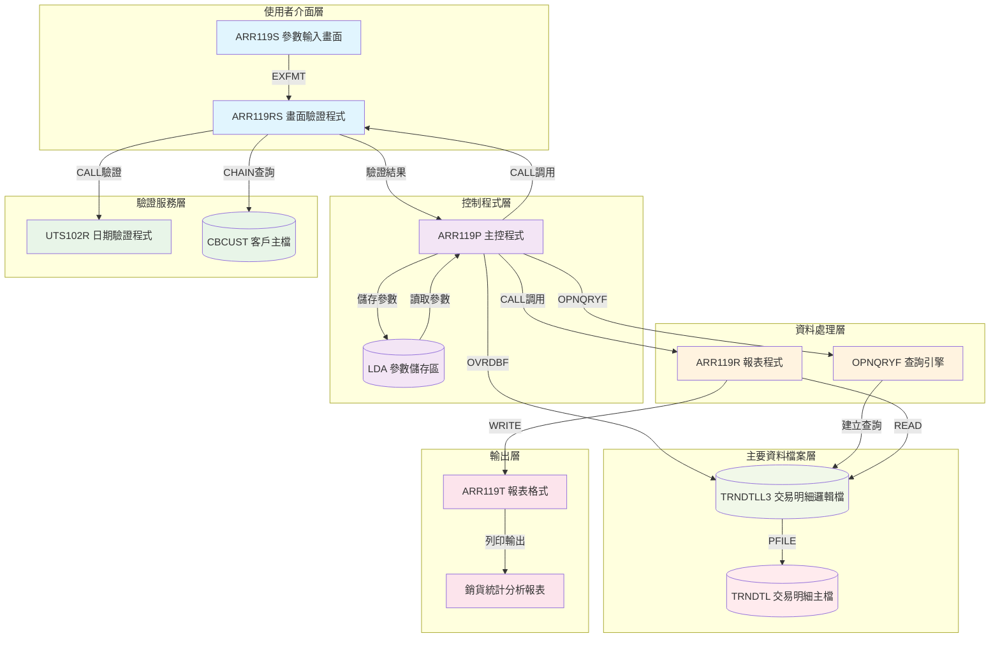

# ARR119P_P02 程式規格書

## 1. 基本資料

| 項目 | 內容 |
|------|------|
| **程式編號** | ARR119P |
| **程式名稱** | 銷貨統計分析報表作業 |
| **程式類型** | CLP |
| **廠區** | P02 |
| **系統名稱** | 應收帳款系統 |
| **子系統** | 銷貨統計分析子系統 |
| **檔案位置** | 東鋼list/ARR119P_P02.txt |

## 2. 🎯 程式功能說明

### 主要功能描述
ARR119P是銷貨統計分析報表作業的控制程式，負責收集使用者輸入的多種查詢條件（廠區範圍、客戶範圍、日期範圍、會計科目、保留欄位等），進行資料驗證後，調用報表程式從交易明細檔案(TRNDTLL3)產生詳細的銷貨統計分析報表。

### 🎯 業務流程詳細說明

#### 完整業務流程圖


#### 業務流程關鍵階段說明

**階段1：參數收集與多重驗證**
- 程式調用ARR119RS畫面程式收集查詢條件
- 廠區代碼驗證：支援P/T/M/H/K或空白(查詢所有廠區)
- 客戶編號驗證：透過CBCUST檔案檢查客戶是否存在
- 日期範圍驗證：雙重UTS102R日期格式檢查，確保起始日期不大於結束日期

**階段2：進階條件驗證**
- 會計科目驗證：限制為2(應收退貨)、3(應收銷貨)、4(預收帳款)
- 保留欄位驗證：限制為1(經銷商)、3(總經銷)
- 範圍處理邏輯：空白條件自動轉換為完整範圍查詢

**階段3：智能處理參數轉換**
- 單一條件轉換為範圍查詢(如單一廠區P轉為P到P)
- 空白條件擴展為最大範圍(如空白客戶轉為' '到'999999')
- 複雜查詢條件建構：支援8個不同條件的組合查詢

**階段4：高效能報表處理**
- 使用OPNQRYF建立複雜查詢條件，避免全檔掃描
- MAPFLD技術進行欄位映射和資料轉換
- 多層次統計：客戶小計、廠區小計、總計

## 3. 🎯 檔案架構與關聯圖

### 使用檔案清單

| 檔案名稱 | 檔案類型 | 用途說明 | 存取方式 |
|----------|----------|----------|----------|
| ARR119S | DSPF | 參數輸入畫面 | EXFMT |
| ARR119RS | RPG | 畫面驗證程式 | CALL |
| TRNDTLL3 | LF | 交易明細邏輯檔 | OPNQRYF查詢 |
| TRNDTL | PF | 交易明細主檔 | 透過TRNDTLL3 |
| ARR119T | PRTF | 報表輸出格式 | 報表列印 |
| ARR119R | RPG | 報表處理程式 | CALL調用 |
| UTS102R | RPG | 日期驗證程式 | CALL調用 |
| CBCUST | PF | 客戶主檔 | CHAIN查詢 |

### 🎯 檔案關聯詳細視覺化圖表



### 🎯 資料流向詳細說明

#### 互動階段的資料流向


#### 批次處理階段的資料流向


## 4. 🎯 檔案欄位規格說明

### 主要資料結構

#### TRNDTL交易明細主檔結構
```
記錄格式：TXREC
用途：儲存所有交易明細資料
```

| 欄位名稱 | 位置 | 長度 | 型態 | 說明 |
|----------|------|------|------|------|
| TXFLAG | 1 | 1 | CHAR | 處理旗標 |
| TXCODE | 2-5 | 4 | CHAR | 交易代碼 |
| TXNO | 6-13 | 8 | CHAR | 交易編號 |
| TXITEM | 14-15 | 2 | DEC | 項次 |
| TXACNT | 16 | 1 | CHAR | 帳別區分 |
| TXDATE | 17-24 | 8 | DEC | 交易日期 |
| TXACDT | 25-32 | 8 | DEC | 入帳日期 |
| TXCUNO | 33-38 | 6 | CHAR | 客戶編號 |
| TXCUNM | 39-48 | 10 | CHAR | 客戶名稱 |
| TXORNO | 49-57 | 9 | CHAR | 訂單編號 |
| TXIVNO | 58-67 | 10 | CHAR | 發票編號 |
| TXPCNO | 68-75 | 8 | CHAR | 特性編號 |
| TXVUNO | 76-82 | 7 | CHAR | 廠商編號 |
| TXRVID | 83-84 | 2 | CHAR | 收貨業務員 |
| TXSALE | 85-86 | 2 | CHAR | 出貨業務員 |
| TXSATP | 87 | 1 | CHAR | 銷售類別 |
| TXIVTP | 88 | 1 | CHAR | 發票類別 |
| TXPDNM | 89-93 | 5 | CHAR | 產品名稱 |
| TXQTY | 94-100 | 7 | DEC | 數量 |
| TXUPRC | 101-105 | 5 | DEC | 單價 |
| TXAMT | 106-116 | 11 | DEC | 金額 |
| TXTAX | 117-127 | 11 | DEC | 稅額 |
| TXFL01 | 128 | 1 | CHAR | 已出貨確認碼 |
| TXFL02 | 129 | 1 | CHAR | 已發票碼 |
| TXTXAR | 130 | 1 | CHAR | 送貨廠區 |
| TXTXDT | 131-138 | 8 | DEC | 送貨日期 |
| TXRESV | 139-168 | 30 | CHAR | 保留欄位 |

### 🔍 重點欄位切割技術詳解

#### DS結構完整分析

**ARR119R程式中的主要DS結構定義**
```
DS結構1：保留欄位切割
        1   30  TXRESV     (保留欄位30字元)
       15   15  D#RESV     (保留區分第15字元)

使用技術：
- OPNQRYF MAPFLD映射技術
- AREA映射：'%SST(TXNO 1 1)'  - 提取交易編號第一碼作為廠區
- RESV映射：'%SST(TXRESV 15 1)' - 提取保留欄位第15字元
- DATE映射：'TXDATE *CHAR 8'   - 日期轉字元格式
- YMD映射：'TXDATE *CHAR 8'    - 日期映射
- TXPCNO映射：'%SST(YMD 1 6)'  - 提取年月部分
```

#### 欄位切割視覺化展示

**TXRESV保留欄位切割對應圖**
```
TXRESV (30字元)：[XXXXXXXXXXXXXX|X|XXXXXXXXXXXXXXX]
位置:             001          14 15 16           30
                                 ↓
D#RESV (1字元)：                [X]              經銷商區分
```

**OPNQRYF MAPFLD映射技術展示**
```
原始欄位 → 映射欄位
TXNO      → AREA   ('%SST(TXNO 1 1)')    第一碼=廠區代碼
TXRESV    → RESV   ('%SST(TXRESV 15 1)') 第15碼=經銷類別
TXDATE    → DATE   ('TXDATE *CHAR 8')    日期轉字元型
TXDATE    → YMD    ('TXDATE *CHAR 8')    年月日資料
YMD       → TXPCNO ('%SST(YMD 1 6)')     取年月6碼
```

#### 切割邏輯詳細說明

**切割目的分析**
1. **查詢最佳化**：透過MAPFLD建立虛擬欄位，提升查詢效率
2. **條件建構**：將複合欄位拆解為可查詢的條件
3. **資料轉換**：數值型日期轉換為字元型便於比較
4. **業務邏輯**：提取特定位置的業務代碼進行分類

**映射實現方式**
```
OPNQRYF查詢建立時的MAPFLD定義：
MAPFLD((AREA  '%SST(TXNO    1 1)')     ← 交易編號第1碼映射為廠區
       (RESV  '%SST(TXRESV 15 1)')     ← 保留欄位第15碼映射為經銷類別
       (DATE   TXDATE *CHAR 8)         ← 交易日期轉字元型
       (YMD    TXDATE *CHAR 8)         ← 年月日資料
       (TXPCNO '%SST(YMD   1 6)'))     ← 提取年月6碼作為特性編號

查詢條件使用映射欄位：
(AREA   *GE "P")     *AND
(AREA   *LE "P")     *AND
(RESV   *GE "1")     *AND
(RESV   *LE "3")     *AND
(DATE   *GE "20240101") *AND
(DATE   *LE "20241231")
```

#### 實際數據範例說明

**範例1：廠區代碼提取**
```
TXNO原始內容：'P0001234'
             └1┘└─7─┘

映射後AREA欄位：'P'     (廠區代碼P02)
```

**範例2：經銷類別提取**
```
TXRESV原始內容：'ABCDEFGHIJKLMN1OPQRSTUVWXYZ1234'
                 └───14───┘└1┘└───15───┘

映射後RESV欄位：'1'     (經銷商類別)
```

**範例3：日期轉換處理**
```
TXDATE原始內容：1130425 (數值型)
映射後DATE欄位：'1130425' (字元型8位)
映射後YMD欄位： '1130425' (年月日)
映射後TXPCNO：  '113042'  (年月6碼)
```

### 🎯 欄位挪用詳細分析

#### 挪用情況對比表

| 欄位名稱 | 原始設計用途 | 實際使用方式 | 挪用原因 | 影響評估 |
|----------|-------------|-------------|---------|----------|
| TXRESV[15] | 一般保留欄位 | 經銷商類別標記 | 區分經銷商(1)和總經銷(3) | 查詢條件必須包含此欄位檢查 |
| TXNO[1] | 交易編號 | 廠區代碼標記 | 交易編號第一碼表示廠區 | 透過MAPFLD提取進行廠區查詢 |
| TXACNT | 帳別區分 | 業務類別區分 | 區分退貨(2)、銷貨(3)、預收(4) | 查詢條件中用於業務類型篩選 |

#### 挪用原因深度分析

**業務需求原因**
1. **廠區管制**：每筆交易需要標記所屬廠區，便於分廠區統計
2. **經銷分類**：區分不同經銷商類型，提供分類統計功能
3. **業務分類**：依據帳別區分不同業務類型，滿足財務需求

**技術實現原因**
1. **檔案結構限制**：TRNDTL主檔案結構固定，需要利用現有欄位實現新功能
2. **查詢效率**：透過OPNQRYF MAPFLD技術將複合欄位拆解為可查詢條件
3. **程式邏輯**：使用固定位置編碼簡化程式判斷和統計邏輯

#### 挪用方式詳細說明

**OPNQRYF條件建構**
```
查詢條件中的欄位挪用：
QRYSLT('(AREA   *GE "' ||  &P#ARE1 || '")     *AND +  ← 廠區範圍
        (AREA   *LE "' ||  &P#ARE2 || '")     *AND +
        (TXCUNO *GE "' ||  &P#CUN1 || '")     *AND +  ← 客戶範圍
        (TXCUNO *LE "' ||  &P#CUN2 || '")     *AND +
        (TXACNT *GE "' ||  &P#ACN1 || '")     *AND +  ← 帳別範圍
        (TXACNT *LE "' ||  &P#ACN2 || '")     *AND +
        (RESV   *GE "' ||  &P#RES1 || '")     *AND +  ← 經銷類別
        (RESV   *LE "' ||  &P#RES2 || '")     *AND +
        (DATE   *GE "' ||  &P#DAT1 || '")     *AND +  ← 日期範圍
        (DATE   *LE "' ||  &P#DAT2 || '")')
```

#### 挪用影響評估

**正面影響**
1. **查詢靈活性**：支援多維度組合查詢，滿足複雜業務需求
2. **統計功能**：提供廠區別、經銷類別、業務類型的分類統計
3. **效能提升**：透過MAPFLD避免程式中反覆進行字串操作

**負面影響**
1. **理解困難**：欄位用途需要查閱程式邏輯才能理解
2. **維護複雜**：MAPFLD定義和查詢條件必須保持一致
3. **除錯困難**：映射欄位錯誤時需要檢查多個層次的定義

### 重要變數定義表

| 變數名稱 | 長度 | 型態 | 用途說明 |
|----------|------|------|----------|
| &P#ARE1 | 1 | CHAR | 廠區範圍起始值 |
| &P#ARE2 | 1 | CHAR | 廠區範圍結束值 |
| &P#CUN1 | 6 | CHAR | 客戶編號範圍起始值 |
| &P#CUN2 | 6 | CHAR | 客戶編號範圍結束值 |
| &P#DAT1 | 8 | CHAR | 交易日期範圍起始值 |
| &P#DAT2 | 8 | CHAR | 交易日期範圍結束值 |
| &P#ACN1 | 1 | CHAR | 帳別範圍起始值 |
| &P#ACN2 | 1 | CHAR | 帳別範圍結束值 |
| &P#RES1 | 1 | CHAR | 保留欄位範圍起始值 |
| &P#RES2 | 1 | CHAR | 保留欄位範圍結束值 |

## 5. 🎯 輸出/入螢幕布局

### 螢幕布局完整視覺化

```
+------------------------------------------------------------------------------+
|94/07/22     東鋼鋼鐵股份有限公司                               ARR119S      |
|10:25:30           銷貨統計分析報表作業                           DEVN001   |
|USER001                                                                       |
|                                                                              |
|                                                                              |
|                                                                              |
|                                                                              |
|        系統廠區: [_] (空白表示全部)                                          |
|                                                                              |
|        客戶編號: [______] (空白表示全部)                                     |
|                                                                              |
|        開始日期: [____/__/__] ~~ [____/__/__] (空白表示全部)                 |
|                                                                              |
|        帳戶類別: [_] (2:應收退貨3:應收銷貨4:預收帳款,空白表示全部)            |
|                                                                              |
|        保留區分: [_] (1:經銷商3:總經銷)                                       |
|                                                                              |
|        注意:當客戶編號為空白時,才需輸入保留區分                              |
|                                                                              |
|                                                                              |
|                                                                              |
|                                                                              |
|                                                                              |
| 操作說明:                                                                    |
| PF3=回上一層        PF12=回到上層                                            |
|[錯誤訊息顯示區域]                                                            |
+------------------------------------------------------------------------------+
```

### 🎯 畫面欄位詳細說明

| 欄位名稱 | 位置 | 長度 | 型態 | 屬性 | 驗證規則 | 說明 |
|----------|------|------|------|------|----------|------|
| S#AREA | 7,36 | 1 | 字元 | 選填,反白 | VALUES('P','T','M','H','K',' ') | 系統廠區代碼 |
| S#CUNO | 9,36 | 6 | 字元 | 選填,反白 | 存在於CBCUST檔案或空白 | 客戶編號 |
| S#DAT1 | 11,36 | 8 | 數值 | 選填,反白 | 日期格式YYYYMMDD,UTS102R驗證 | 開始日期 |
| S#DAT2 | 11,50 | 8 | 數值 | 選填,反白 | 日期格式YYYYMMDD,不可小於起始日期 | 結束日期 |
| S#ACNT | 13,36 | 1 | 字元 | 選填,反白 | VALUES('2','3','4',' ') | 帳戶類別 |
| S#RESV | 15,36 | 1 | 字元 | 選填,反白 | VALUES('1','3',' ') | 保留區分 |

### 🎯 畫面控制邏輯

#### 指示器控制說明
| 指示器 | 控制欄位 | 觸發條件 | 顯示效果 |
|--------|----------|----------|----------|
| IN30 | S#AREA | 廠區代碼無效 | 欄位反白閃爍 |
| IN31 | S#CUNO | 客戶不存在 | 欄位反白閃爍 |
| IN32 | S#DAT1 | 起始日期格式錯誤 | 欄位反白閃爍 |
| IN33 | S#DAT2 | 結束日期格式錯誤 | 欄位反白閃爍 |
| IN34 | S#ACNT | 帳戶類別無效 | 欄位反白閃爍 |
| IN35 | S#RESV | 保留區分無效 | 欄位反白閃爍 |

### 功能鍵詳細定義

| 功能鍵 | 處理邏輯 | 系統行為 |
|--------|----------|----------|
| PF3 | 設定P#IN03='1' | ARR119RS程式結束,ARR119P執行RETURN |
| PF12 | 設定P#IN03='1' | ARR119RS程式結束,ARR119P執行RETURN |
| ENTER | 執行完整驗證 | 進行所有欄位驗證流程 |

### 操作流程
1. 系統顯示ARR119S參數輸入畫面
2. 使用者選填各項查詢條件
3. 按ENTER進行多層次驗證
4. 驗證通過後處理範圍參數
5. 儲存參數至LDA並提交批次作業
6. 手動檢查輸出佇列查看報表結果

## 6. 🎯 處理流程程序說明

### 🎯 主程序邏輯深度分析

#### 程式執行流程圖


#### 🎯 詳細處理步驟逐一分析

**步驟1：程式初始化處理**
```
1. 宣告11個參數變數
2. 取得工作資訊：RTVJOBA取得設備名稱、使用者ID、工作類型
3. 判斷執行模式：TYPE='0'為批次，其他為互動
```

**步驟2：互動模式參數收集**
```
1. 調用ARR119RS畫面程式：
   CALL PGM(ARR119RS) PARM(&P#IN03 &P#ARE1 &P#ARE2 &P#CUN1 
                             &P#CUN2 &P#DAT1 &P#DAT2 &P#ACN1 
                             &P#ACN2 &P#RES1 &P#RES2)
   
2. 檢查回傳結果：
   IF COND(&P#IN03 *EQ '1') 表示使用者取消操作
```

**步驟3：參數儲存至LDA**
```
CHGDTAARA儲存順序：
1. LDA位置300(1字元)：廠區範圍起始值
2. LDA位置301(1字元)：廠區範圍結束值  
3. LDA位置302(6字元)：客戶範圍起始值
4. LDA位置308(6字元)：客戶範圍結束值
5. LDA位置314(8字元)：日期範圍起始值
6. LDA位置322(8字元)：日期範圍結束值
7. LDA位置330(1字元)：帳別範圍起始值
8. LDA位置331(1字元)：帳別範圍結束值
9. LDA位置332(1字元)：保留範圍起始值
10. LDA位置333(1字元)：保留範圍結束值
```

**步驟4：批次作業提交**
```
SBMJOB提交設定：
- CMD：CALL PGM(ARR119P)
- JOB：ARR119P  
- JOBD：ARJOBD
- 系統自動切換為批次模式(TYPE='0')執行
```

**步驟5：批次模式處理**
```
1. 從LDA讀取所有參數：
   RTVDTAARA DTAARA(*LDA (300 1)) RTNVAR(&P#ARE1)
   ... (依序讀取10個參數)

2. 設定檔案覆寫：
   報表檔案：PAGESIZE(*N 198)、CPI(15)、HOLD(*YES)
   資料檔案：SHARE(*YES)允許併發存取
```

**步驟6：OPNQRYF查詢建立**
```
複雜查詢條件建構：
- 8個範圍條件的AND組合
- MAPFLD技術進行欄位映射
- KEYFLD排序：(TXPCNO)(TXCUNO)(TXORNO)(TXNO)
```

### 🎯 子程序邏輯分析

#### ARR119RS畫面程式邏輯
```
主要驗證流程：
1. 廠區代碼驗證：VALUES('P','T','M','H','K')
2. 客戶編號驗證：CHAIN CBCUST檔案
3. 日期格式驗證：雙重UTS102R調用
4. 日期範圍驗證：起始日期≤結束日期
5. 帳別類別驗證：VALUES('2','3','4')
6. 保留區分驗證：VALUES('1','3')
7. 範圍參數處理：單一值轉範圍查詢
```

#### UTS102R日期驗證程式調用
```
參數傳遞(起始日期)：
CALL 'UTS102R'
PARM P#DATE 8    ← 待驗證日期
PARM '1'    1    ← 驗證模式
PARM P#MTL  24   ← 月份資料
PARM P#LY   1    ← 閏年旗標
PARM ' '    1    ← 回傳結果旗標

參數傳遞(結束日期)：
同樣的調用方式，分別驗證兩個日期
```

#### ARR119R報表程式調用
```
前置條件：
- TRNDTLL3檔案已透過OPNQRYF建立查詢
- 報表檔案已設定覆寫參數
- 所有查詢條件已建構完成

處理邏輯：
- L2 Control Break：客戶編號變化
- L1 Control Break：特性編號變化  
- 明細處理：每筆交易記錄
- 統計累加：數量、金額、稅額三層統計
```

### 🎯 特殊邏輯處理

#### 範圍參數轉換邏輯
```
廠區代碼處理：
IF S#AREA = *BLANK THEN
   P#ARE1 = *BLANK
   P#ARE2 = '9'
ELSE
   P#ARE1 = S#AREA
   P#ARE2 = S#AREA

客戶編號處理：
IF S#CUNO = *BLANK THEN
   P#CUN1 = *BLANK  
   P#CUN2 = '999999'
ELSE
   P#CUN1 = S#CUNO
   P#CUN2 = S#CUNO

日期範圍處理：
IF S#DAT1 = 0 THEN
   P#DAT1 = *BLANK
ELSE
   P#DAT1 = S#DAT1

IF S#DAT2 = 0 THEN
   P#DAT2 = 99999999
ELSE  
   P#DAT2 = S#DAT2
```

#### OPNQRYF MAPFLD技術
```
欄位映射定義：
MAPFLD((AREA  '%SST(TXNO    1 1)')        ← 廠區代碼映射
       (RESV  '%SST(TXRESV 15 1)')        ← 經銷類別映射
       (DATE   TXDATE *CHAR 8)            ← 日期字元化
       (YMD    TXDATE *CHAR 8)            ← 年月日映射
       (TXPCNO '%SST(YMD   1 6)'))        ← 年月提取

排序條件：
KEYFLD((TXPCNO) (TXCUNO) (TXORNO) (TXNO))
按特性編號、客戶編號、訂單編號、交易編號排序
```

## 7. 🎯 數據操作與轉換分析

### 檔案操作詳解

#### OPNQRYF操作
- **TRNDTLL3檔案查詢**：透過複雜的8條件AND組合建立查詢視圖
- **MAPFLD映射**：將複合欄位拆解為可查詢的虛擬欄位
- **KEYFLD排序**：建立多層次排序確保報表順序正確

#### READ操作
- **順序讀取**：ARR119R程式依排序順序讀取符合條件的交易記錄
- **Control Break處理**：L1/L2斷點控制進行分層統計

#### 檔案覆寫和共享處理
- **報表覆寫**：PAGESIZE(198欄)、CPI(15字元/英吋)、HOLD暫停列印
- **檔案共享**：SHARE(*YES)允許多使用者同時查詢

### 數據轉換邏輯

#### 參數範圍轉換
```
單一值轉範圍查詢：
廠區'P' → 範圍'P'到'P'
客戶空白 → 範圍' '到'999999'  
日期0 → 範圍空白到99999999
```

#### MAPFLD映射轉換
```
複合欄位拆解：
TXNO(8字元) → AREA(1字元)     提取第1碼
TXRESV(30字元) → RESV(1字元)  提取第15碼
TXDATE(數值) → DATE(字元8位)   數值轉字元
TXDATE(數值) → YMD(字元8位)    年月日格式
YMD(8字元) → TXPCNO(6字元)     提取前6碼
```

#### 報表統計計算
```
三層統計累加：
明細層：T#QTY、T#AMT、T#TAX (每筆交易)
客戶層：T#QTYS、T#AMTS、T#TAXS (客戶小計)
廠區層：T#QTYT、T#AMTT、T#TAXT (廠區小計)  
總計層：T#QTYA、T#AMTA、T#TAXA (全部總計)
```

### 檢核機制詳解

#### 數據有效性檢查
1. **廠區代碼**：限制為P/T/M/H/K或空白
2. **客戶編號**：必須存在於CBCUST客戶主檔或空白
3. **日期格式**：透過UTS102R進行格式和有效性驗證
4. **日期邏輯**：起始日期不可大於結束日期
5. **帳別類別**：限制為2/3/4(對應不同業務類型)
6. **保留區分**：限制為1/3(對應不同經銷類型)

#### 檢核失敗處理方式
1. **設定錯誤指示器**：IN30-IN35對應不同欄位錯誤
2. **顯示具體錯誤訊息**：每種錯誤都有對應的中文說明
3. **欄位反白顯示**：錯誤欄位以PC和RI屬性反白閃爍
4. **重新輸入循環**：驗證失敗回到輸入畫面等待修正

#### 檢核規則的業務依據
1. **廠區管制**：確保只查詢有效廠區的交易資料
2. **客戶存在性**：避免查詢不存在的客戶編號
3. **日期合理性**：確保查詢日期範圍的邏輯正確性
4. **業務分類**：依據帳別和經銷類別進行準確分類統計

## 8. 🎯 錯誤處理程序說明

### 🎯 詳細錯誤代碼清冊

| 錯誤代碼 | 錯誤訊息 | 原因說明 | 處理方式 | 預防措施 |
|----------|---------|---------|---------|----------|
| **ERR1** | 廠區代碼必須輸入P或T或M或H或K！ | 輸入的廠區代碼不在有效值範圍內 | 1. 設定IN30='1'顯示欄位錯誤<br>2. 顯示錯誤訊息<br>3. 回到輸入循環 | 畫面上提供廠區代碼選項說明 |
| **ERR2** | 輸入的客戶編號不存在！ | 客戶編號在CBCUST檔案中查無記錄 | 1. 設定IN31='1'顯示欄位錯誤<br>2. 顯示錯誤訊息<br>3. 回到輸入循環 | 提供客戶編號查詢功能 |
| **ERR3** | 開始日期輸入錯誤！ | UTS102R驗證起始日期格式失敗 | 1. 設定IN32='1'顯示欄位錯誤<br>2. 顯示錯誤訊息<br>3. 回到輸入循環 | 提供正確日期格式範例(YYYY/MM/DD) |
| **ERR4** | 結束日期輸入錯誤！ | UTS102R驗證結束日期格式失敗 | 1. 設定IN33='1'顯示欄位錯誤<br>2. 顯示錯誤訊息<br>3. 回到輸入循環 | 提供正確日期格式範例(YYYY/MM/DD) |
| **ERR5** | 開始日期不可大於結束日期！ | 起始日期大於結束日期的邏輯錯誤 | 1. 設定IN32='1'和IN33='1'<br>2. 顯示錯誤訊息<br>3. 回到輸入循環 | 提供日期範圍選擇輔助功能 |
| **ERR6** | 帳戶類別必須輸入2或3或4！ | 帳戶類別不是有效的業務類型 | 1. 設定IN34='1'顯示欄位錯誤<br>2. 顯示錯誤訊息<br>3. 回到輸入循環 | 畫面說明各帳戶類別的意義 |
| **ERR7** | 保留區分必須輸入1或3！ | 保留區分不是有效的經銷類型 | 1. 設定IN35='1'顯示欄位錯誤<br>2. 顯示錯誤訊息<br>3. 回到輸入循環 | 說明經銷商和總經銷的差異 |
| **PF3/PF12** | 使用者按功能鍵離開 | 使用者選擇離開作業 | 設定P#IN03='1'，程式正常結束 | 提供清楚的功能鍵說明 |

### 🎯 系統異常處理邏輯

#### 檔案操作失敗處理
```
OPNQRYF建立失敗：
- 檢查TRNDTLL3檔案是否存在
- 確認MAPFLD語法正確性
- 記錄詳細錯誤資訊供除錯

CBCUST檔案存取失敗：
- 檢查客戶主檔案可用性
- 確認檔案存取權限
- 提供適當的錯誤回饋
```

#### 程式調用失敗處理
```
ARR119RS調用失敗：
- 檢查畫面程式是否存在
- 確認參數傳遞正確性
- 處理畫面程式異常終止

UTS102R調用失敗：
- 檢查日期驗證程式可用性
- 確認參數格式正確性
- 提供備用日期驗證邏輯

ARR119R調用失敗：
- 檢查報表程式和格式檔案
- 確保OPNQRYF已正確建立
- 記錄報表處理錯誤
```

#### 資料完整性錯誤處理
```
LDA存取失敗：
- 檢查本地資料區可用性
- 使用預設值繼續處理
- 記錄LDA異常狀況

參數轉換失敗：
- 檢查參數格式和長度
- 提供參數轉換錯誤提示
- 確保範圍參數邏輯正確

MAPFLD映射失敗：
- 檢查欄位定義和位置
- 確認字串操作的正確性
- 提供映射錯誤診斷資訊
```

#### 並發控制失敗處理
```
檔案鎖定衝突：
- SHARE(*YES)設定避免查詢鎖定
- 提供重試機制處理暫時性衝突
- 記錄併發存取異常狀況

批次作業提交失敗：
- 檢查ARJOBD作業描述存在性
- 確認批次佇列可用性
- 提供作業提交狀態回饋
```

## 9. 🎯 備註

### 🎯 特殊注意事項

#### 執行模式說明
程式採用互動收集參數、批次處理資料的分離設計，互動階段完成所有驗證後提交批次作業，批次階段專注於高效率的資料處理和報表產生。

#### 查詢條件組合邏輯
程式支援8個不同維度的查詢條件組合：廠區、客戶、日期範圍、帳別、保留區分，空白條件自動轉換為最大範圍查詢，提供極大的查詢靈活性。

#### MAPFLD映射技術
程式大量使用OPNQRYF的MAPFLD功能將複合欄位拆解為可查詢條件，這是AS/400平台上處理複雜查詢的高效技術，避免了程式中的反覆字串操作。

#### 多層次統計邏輯
報表採用RPG的Control Break技術進行多層次統計：明細、客戶小計、廠區小計、總計四個層次，每個層次都有數量、金額、稅額三種統計值。

#### 保留欄位特殊用途
TXRESV保留欄位的第15字元被特別用於標記經銷商類型，這種欄位挪用方式在Legacy系統中常見，需要透過程式文件才能理解其真實用途。

#### 日期處理機制
程式使用數值型日期儲存，透過MAPFLD轉換為字元型進行比較查詢，同時支援年月部分提取作為統計分組條件。

#### 報表輸出設定
批次模式執行時報表設定為198欄寬度、15字元/英吋密度、暫停列印狀態，使用者需到輸出佇列手動釋放列印，確保報表內容確認後再列印。

#### 範圍查詢最佳化
程式將所有單一條件查詢轉換為範圍查詢，統一查詢邏輯，並透過OPNQRYF的索引優化提升查詢效能，特別適合大量資料的統計分析作業。 