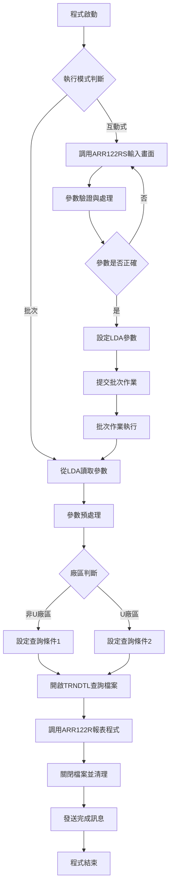
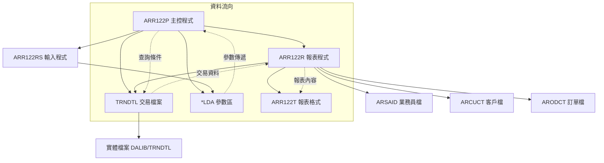
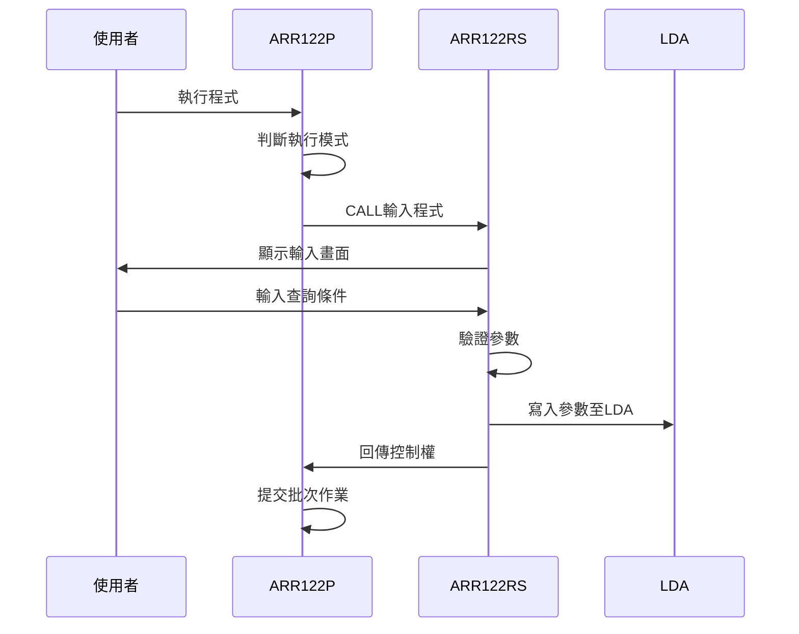
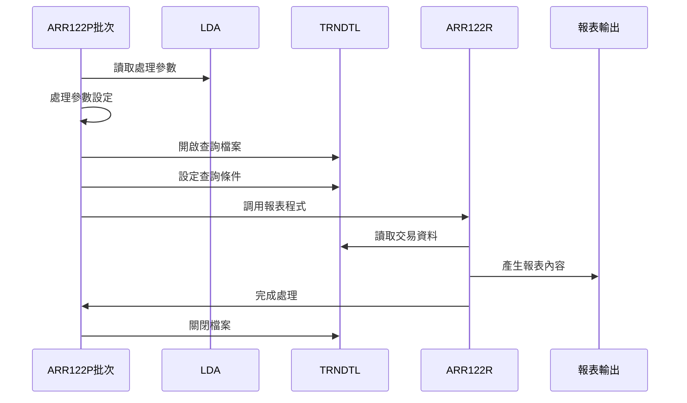
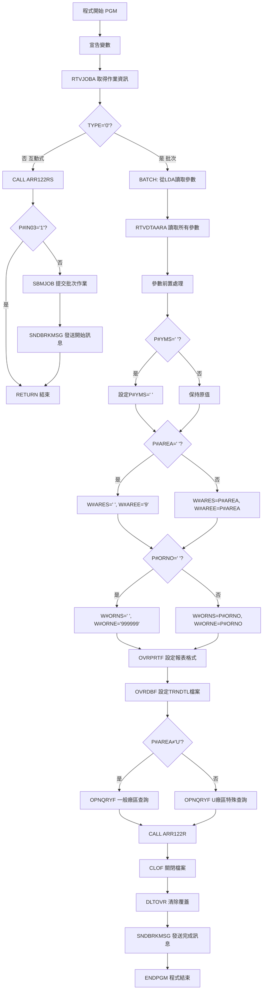

# ARR122P_P02 程式規格書

## 1. 基本資料

| 項目 | 內容 |
|------|------|
| **程式編號** | ARR122P |
| **程式名稱** | 發票分析統計報表作業 |
| **程式類型** | CLP |
| **廠區** | P02 |
| **系統名稱** | 應收帳款系統 |
| **子系統** | 應收帳款報表處理 |
| **檔案位置** | 東鋼list/ARR122P_P02.txt |

## 2. 🎯 程式功能說明

### 主要功能描述
ARR122P是應收帳款系統的發票分析統計報表作業控制程式，負責統計分析指定期間內的發票交易資料，並產生詳細的分析報表。程式支援多種查詢條件組合，包括年月範圍、廠區別、部門、業務員、訂單號碼等條件篩選。

### 🎯 業務流程詳細說明

#### 完整業務流程圖


#### 業務流程關鍵階段說明

**1. 執行模式判別階段**
- 透過RTVJOBA取得作業類型資訊
- 互動式作業(TYPE='1')進入畫面輸入模式
- 批次作業(TYPE='0')直接進入資料處理模式

**2. 互動式參數輸入階段**
- 調用ARR122RS程式提供輸入畫面
- 驗證輸入參數的正確性和完整性
- 將參數寫入LDA區域供批次程式使用
- 提交批次作業至作業佇列執行

**3. 批次處理執行階段**
- 從LDA讀取處理參數
- 根據廠區不同設定不同的資料查詢條件
- 建立TRNDTL檔案的查詢檢視
- 調用ARR122R程式產生實際報表

**4. 資料查詢條件設定階段**
- 非U廠區：查詢所有一般廠區的交易資料
- U廠區：特別處理U、R、V、J、O、D、X等特殊廠區代碼
- 依年月、廠區、訂單、業務員等條件篩選資料

## 3. 🎯 檔案架構與關聯圖

### 使用檔案清單

| 檔案名稱 | 檔案類型 | 用途說明 | 存取模式 |
|----------|----------|----------|----------|
| ARR122RS | RPG程式 | 互動式參數輸入程式 | CALL |
| ARR122R | RPG程式 | 報表產生處理程式 | CALL |
| ARR122T | PRTF | 報表列印格式檔案 | OUTPUT |
| TRNDTL | 資料檔案 | 交易明細主檔 | INPUT |
| *LDA | 本地資料區 | 參數傳遞區域 | READ/WRITE |

### 🎯 檔案關聯詳細視覺化圖表



### 🎯 資料流向詳細說明

#### 環境準備階段的資料流向


#### 業務處理階段的資料流向


## 4. 🎯 檔案欄位規格說明

### 主要資料結構

#### LDA參數區域結構
| 位置 | 長度 | 欄位名稱 | 用途說明 |
|------|------|----------|----------|
| 300-305 | 6 | P#YMS | 查詢年月起始 |
| 306-311 | 6 | P#YME | 查詢年月結束 |
| 312-312 | 1 | P#AREA | 查詢廠區別 |
| 313-316 | 4 | P#DEPT | 查詢部門代碼 |
| 317-318 | 2 | P#SAID | 查詢業務員代碼 |
| 319-319 | 1 | P#RVIS | 業務員範圍起始 |
| 320-320 | 1 | P#RVIE | 業務員範圍結束 |
| 321-326 | 6 | P#ORNO | 查詢訂單號碼 |
| 327-327 | 1 | P#KIND | 發票分析方式 |
| 1001-1010 | 10 | USID | 使用者識別碼 |

#### 程式變數定義表
| 變數名稱 | 類型 | 長度 | 說明 |
|----------|------|------|------|
| &TYPE | CHAR | 1 | 作業類型識別 |
| &P#IN03 | CHAR | 1 | 離開指示器 |
| &P#YMS | CHAR | 6 | 查詢年月起始 |
| &P#YME | CHAR | 6 | 查詢年月結束 |
| &P#AREA | CHAR | 1 | 查詢廠區代碼 |
| &W#ARES | CHAR | 1 | 廠區範圍起始 |
| &W#AREE | CHAR | 1 | 廠區範圍結束 |
| &P#DEPT | CHAR | 4 | 部門代碼 |
| &P#SAID | CHAR | 2 | 業務員代碼 |
| &P#RVIS | CHAR | 1 | 業務員範圍起始 |
| &P#RVIE | CHAR | 1 | 業務員範圍結束 |
| &P#ORNO | CHAR | 6 | 訂單號碼 |
| &W#ORNS | CHAR | 6 | 訂單範圍起始 |
| &W#ORNE | CHAR | 6 | 訂單範圍結束 |
| &P#KIND | CHAR | 1 | 發票分析方式 |
| &S#DEVN | CHAR | 10 | 裝置名稱 |
| &S#USER | CHAR | 10 | 使用者名稱 |

### 🔍 重點欄位切割技術詳解

#### LDA參數區域結構視覺化
```
LDA參數區域 (327字元)：[YMS_____|YME_____|A|DEPT|SI|V|E|ORNO__|K|.........|USID______|...]
位置:                001-006  007-012 013 014-017 018-019 020 021 022-027 028     1001-1010  1011-
                      ↓        ↓       ↓   ↓       ↓       ↓   ↓   ↓       ↓       ↓          ↓
查詢年月起:           [YMS___]                                                                   6位YYYYMM格式
查詢年月迄:                    [YME___]                                                          6位YYYYMM格式
查詢廠區:                              [A]                                                       1位廠區代碼
部門代碼:                                [DEPT]                                                  4位部門代碼
業務員代碼:                                    [SI]                                            2位業務員代碼
業務員範圍起:                                    [V]                                          1位範圍起始
業務員範圍迄:                                      [E]                                        1位範圍結束
訂單號碼:                                           [ORNO__]                                   6位訂單編號
分析方式:                                                   [K]                               1位分析類型
使用者ID:                                                           [USID______]               10位使用者識別
```

#### LDA區域欄位切割對應表
| 位置範圍 | 長度 | 欄位名稱 | 用途說明 | 切割邏輯 |
|----------|------|----------|----------|----------|
| 300-305 | 6 | P#YMS | 查詢年月起始 | 直接讀取YYYYMM格式 |
| 306-311 | 6 | P#YME | 查詢年月結束 | 直接讀取YYYYMM格式 |
| 312-312 | 1 | P#AREA | 查詢廠區別 | 單字元廠區代碼 |
| 313-316 | 4 | P#DEPT | 查詢部門代碼 | 4位部門識別碼 |
| 317-318 | 2 | P#SAID | 查詢業務員代碼 | 2位業務員編號 |
| 319-319 | 1 | P#RVIS | 業務員範圍起始 | 單字元範圍控制 |
| 320-320 | 1 | P#RVIE | 業務員範圍結束 | 單字元範圍控制 |
| 321-326 | 6 | P#ORNO | 查詢訂單號碼 | 6位訂單編號 |
| 327-327 | 1 | P#KIND | 發票分析方式 | 1位分析類型標記 |
| 1001-1010 | 10 | USID | 使用者識別碼 | 10位使用者ID |

#### TRNDTL檔案欄位切割技術詳細分析

##### MAPFLD欄位切割視覺化
```
TXDATE (8字元)：[YYYYMMDD] → DAT1 [YYYYMMDD] → DATE [YYYYMM]
                ↓                   ↓               ↓
原始交易日期:   [20231215]          [20231215]      [202312]
切割邏輯:      直接對應            直接複製         %SST(DAT1 1 6)

TXACDT (8字元)：[YYYYMMDD] → ACD1 [YYYYMMDD] → ACDT [YYYYMM]  
                ↓                   ↓               ↓
原始入帳日期:   [20231220]          [20231220]      [202312]
切割邏輯:      直接對應            直接複製         %SST(ACD1 1 6)

TXIVNO (10字元)：[NNNNNNNNNN] → IVNO [N]
                 ↓                   ↓
原始發票號碼:    [A123456789]        [A]
切割邏輯:       10字元發票號碼      %SST(TXIVNO 1 1)

TXSALE (2字元)：[NN] → SALE [N]
                ↓          ↓
原始業務員:     [01]       [0]
切割邏輯:      2字元業務員  %SST(TXSALE 1 1)

TXNO (8字元)：[NNNNNNNN] → TXFL01 [N]
              ↓                   ↓
原始單據號:   [P1234567]          [P]
切割邏輯:    8字元單據號          %SST(TXNO 1 1)

TXORNO (9字元)：[NNNNNNNNN] → TXPCNO [NNNNNN]
                ↓                    ↓
原始訂單號:     [123456789]         [123456]
切割邏輯:      9字元訂單號          %SST(TXORNO 1 6)
```

### 🎯 欄位挪用詳細分析

#### 參數範圍處理的挪用機制

##### 廠區範圍挪用處理
```
原始欄位P#AREA (1字元)：[A]
                       ↓
挪用處理邏輯：
IF P#AREA=' ' THEN
   W#ARES=' ', W#AREE='9'     // 空白時設為全範圍
ELSE
   W#ARES=P#AREA, W#AREE=P#AREA  // 指定廠區時設為相同值

範圍對應表：
輸入值    → 起始範圍   結束範圍   涵蓋範圍
' '(空白) → ' '      '9'       所有廠區
'T'      → 'T'      'T'       台北廠區
'M'      → 'M'      'M'       台中廠區
'H'      → 'H'      'H'       高雄廠區
'K'      → 'K'      'K'       高雄二廠
'U'      → 'U'      'U'       新竹廠區

挪用原因：OPNQRYF查詢需要範圍條件而非單一值
業務邏輯：支援全廠區查詢和單廠區查詢的彈性需求
```

##### 訂單範圍挪用處理
```
原始欄位P#ORNO (6字元)：[NNNNNN]
                        ↓
挪用處理邏輯：
IF P#ORNO='      ' THEN
   W#ORNS='      ', W#ORNE='999999'  // 空白時設為全範圍
ELSE
   W#ORNS=P#ORNO, W#ORNE=P#ORNO     // 指定訂單時設為相同值

範圍對應表：
輸入值        → 起始範圍     結束範圍     涵蓋範圍
'      '(空白) → '      '    '999999'    所有訂單
'123456'      → '123456'    '123456'    特定訂單

挪用原因：OPNQRYF範圍查詢的技術需求
業務邏輯：支援全訂單和特定訂單的查詢彈性
```

#### TRNDTL檔案欄位切割挪用分析

##### 交易日期的雙重切割處理
```
原始日期欄位的多重用途：
TXDATE (8字元) → DAT1 (8字元) → DATE (6字元)
TXACDT (8字元) → ACD1 (8字元) → ACDT (6字元)

挪用邏輯：
原始設計：完整的8位日期格式 (YYYYMMDD)
實際挪用：切割為6位年月格式 (YYYYMM)
挪用原因：查詢條件只需要年月比對，不需要具體日期
業務邏輯：簡化查詢條件，提升查詢效能

OR條件查詢設計：
((DAT1 *GE "起始年月") *AND (DAT1 *LE "結束年月")) *OR
((ACD1 *GE "起始年月") *AND (ACD1 *LE "結束年月"))

挪用優勢：支援依交易日期或入帳日期的彈性查詢
```

##### 單據編號的首位字元挪用
```
TXNO首位字元挪用：
TXNO (8字元)：[PNNNNNNN] → TXFL01 [P]
              ↓                  ↓
原始單據號:   [P1234567]         [P] (廠區識別)

挪用原因：單據號首位字元代表廠區別
挪用方式：%SST(TXNO 1 1)取得首位字元
業務邏輯：依廠區別進行交易資料篩選

廠區代碼對應：
P = P02廠區    M = 台中廠區    H = 高雄廠區
K = 高雄二廠   U = 新竹廠區    T = 台北廠區
R/V/J/O/D/X = U廠區特殊代碼
```

##### 發票號碼與業務員的首位挪用
```
發票號碼首位挪用：
TXIVNO (10字元)：[NNNNNNNNNN] → IVNO [N]
                 ↓                  ↓
用途：發票類型識別               特殊發票標記
挪用邏輯：%SST(TXIVNO 1 1)
查詢條件：(TXIVNO *EQ "          ") *OR (IVNO *EQ "*")

業務員首位挪用：
TXSALE (2字元)：[NN] → SALE [N]
                ↓           ↓
用途：業務員完整編號         業務員群組識別
挪用邏輯：%SST(TXSALE 1 1)
篩選目的：依業務員群組進行範圍篩選
```

### 欄位挪用業務邏輯分析

#### 廠區別查詢的特殊挪用處理

##### U廠區特殊處理邏輯
```
一般廠區查詢邏輯：
(TXFL01 *GE "起始廠區") *AND (TXFL01 *LE "結束廠區")

U廠區特殊查詢邏輯：
((TXFL01 *EQ "U") *OR (TXFL01 *EQ "R") *OR 
 (TXFL01 *EQ "V") *OR (TXFL01 *EQ "J") *OR 
 (TXFL01 *EQ "O") *OR (TXFL01 *EQ "D") *OR 
 (TXFL01 *EQ "X"))

挪用原因：U廠區包含多個特殊廠區代碼
業務邏輯：統一歸類為U廠區的業務範圍
技術實現：明確列舉而非範圍查詢
```

#### 訂單編號的長度挪用
```
原始欄位：TXORNO (9字元)
挪用切割：TXPCNO (6字元) = %SST(TXORNO 1 6)

切割原因：查詢條件只需要前6位的主要訂單編號
業務邏輯：後3位為訂單子項目編號，查詢時不需考慮
挪用效果：簡化訂單查詢條件，提升查詢效率
實際應用：支援主訂單層級的統計分析
```

### 重要變數定義表

| 變數名稱 | 類型 | 長度 | 說明 | 切割來源 | 挪用邏輯 |
|----------|------|------|------|----------|----------|
| &P#YMS | CHAR | 6 | 查詢年月起始 | LDA(300-305) | 直接使用 |
| &P#YME | CHAR | 6 | 查詢年月結束 | LDA(306-311) | 直接使用 |
| &P#AREA | CHAR | 1 | 查詢廠區代碼 | LDA(312) | 單值轉範圍 |
| &W#ARES | CHAR | 1 | 廠區範圍起始 | &P#AREA挪用 | 範圍起始值 |
| &W#AREE | CHAR | 1 | 廠區範圍結束 | &P#AREA挪用 | 範圍結束值 |
| &P#ORNO | CHAR | 6 | 查詢訂單號碼 | LDA(321-326) | 單值轉範圍 |
| &W#ORNS | CHAR | 6 | 訂單範圍起始 | &P#ORNO挪用 | 範圍起始值 |
| &W#ORNE | CHAR | 6 | 訂單範圍結束 | &P#ORNO挪用 | 範圍結束值 |
| &P#DEPT | CHAR | 4 | 部門代碼 | LDA(313-316) | 直接使用 |
| &P#SAID | CHAR | 2 | 業務員代碼 | LDA(317-318) | 直接使用 |
| &P#KIND | CHAR | 1 | 發票分析方式 | LDA(327) | 統計類型控制 |

## 5. 🎯 輸出/入螢幕布局

### 互動式輸入畫面布局
由ARR122RS程式提供的參數輸入畫面：

```
+----------------------------------------------------------+
|        ARR122RS                    東鋼企業股份有限公司    |
+----------------------------------------------------------+
|                  發票分析統計報表輸入作業                   |
+----------------------------------------------------------+
|                                                          |
| 查詢年月起：[______] (YYYYMM格式)                        |
| 查詢年月迄：[______] (YYYYMM格式)                        |
|                                                          |
| 查詢廠區：[_] (T/M/H/K/U/N或空白查詢全部)                |
| 部門代碼：[____] (B010/B020/B030/B040/B050或空白)        |
|                                                          |
| 業務員代碼：[__] (空白查詢全部)                           |
| 訂單號碼：[______] (空白查詢全部)                         |
|                                                          |
| 發票分析方式：[_] (1=依單位 其他=依噸數)                   |
|                                                          |
| [錯誤訊息顯示區]                                          |
|                                                          |
| F3=離開  F12=取消  Enter=確認                             |
+----------------------------------------------------------+
```

### 🎯 畫面欄位詳細說明
| 欄位名稱 | 屬性 | 長度 | 輸入格式 | 驗證規則 |
|----------|------|------|----------|----------|
| 查詢年月起 | 必填 | 6 | YYYYMM | 年月格式驗證 |
| 查詢年月迄 | 必填 | 6 | YYYYMM | 年月格式驗證，不可小於起始年月 |
| 查詢廠區 | 選填 | 1 | 廠區代碼 | T/M/H/K/U/N或空白 |
| 部門代碼 | 選填 | 4 | 部門代碼 | B010/B020/B030/B040/B050或空白 |
| 業務員代碼 | 選填 | 2 | 業務員代碼 | 必須存在於ARSAID檔案中 |
| 訂單號碼 | 選填 | 6 | 訂單號碼 | 必須存在於SAMAST檔案中 |
| 發票分析方式 | 必填 | 1 | 分析方式 | 1=依單位，其他=依噸數 |

### 功能鍵詳細定義
| 功能鍵 | 功能說明 | 處理邏輯 |
|--------|----------|----------|
| F3 | 離開程式 | 設定P#IN03='1'，回到主控程式 |
| F12 | 取消輸入 | 清除輸入資料，重新顯示畫面 |
| Enter | 確認輸入 | 執行輸入驗證，通過後進入報表處理 |

## 6. 🎯 處理流程程序說明

### 🎯 主程序邏輯深度分析

#### 程式執行流程圖


#### 🎯 詳細處理步驟逐一分析

**步驟1：程式初始化階段**
- 執行變數宣告，建立12個工作變數
- 透過RTVJOBA指令取得當前作業的執行環境資訊
- 判別作業類型決定後續處理流程

**步驟2：執行模式分支處理**
- 互動式模式(TYPE≠'0')：進入使用者輸入流程
- 批次模式(TYPE='0')：直接跳至BATCH標籤執行資料處理

**步驟3：互動式處理流程**
- 調用ARR122RS程式提供參數輸入畫面
- 檢查P#IN03離開指示器，決定是否繼續執行
- 使用SBMJOB提交批次作業至ARJOBD作業描述執行
- 發送開始處理訊息至使用者訊息佇列

**步驟4：批次處理參數讀取**
- 透過8個RTVDTAARA指令從LDA讀取處理參數
- 參數包含：年月範圍、廠區、部門、業務員、訂單、分析方式

**步驟5：參數前置處理邏輯**
- 年月起始檢查：空白時設定為空白字串
- 廠區範圍設定：空白時設定為全廠區(' '到'9')，否則設定為指定廠區
- 訂單範圍設定：空白時設定為全範圍('      '到'999999')，否則設定為指定訂單

**步驟6：檔案環境設定**
- OVRPRTF：設定ARR122T報表格式，頁寬198字元，15CPI，HOLD輸出
- OVRDBF：將TRNDTL邏輯檔案對應到實體檔案DALIB/TRNDTL

**步驟7：查詢條件設定分支**
- 根據廠區別(P#AREA)設定不同的OPNQRYF查詢條件
- 非U廠區：包含所有一般廠區的交易資料
- U廠區：特別處理U、R、V、J、O、D、X等特殊廠區代碼

### 🎯 子程序邏輯分析

**ARR122RS子程序功能**
- 提供完整的參數輸入介面
- 執行輸入資料的有效性驗證
- 處理年月格式、廠區代碼、部門代碼、業務員存在性檢查
- 將驗證通過的參數寫入LDA區域

**ARR122R子程序功能**
- 讀取TRNDTL交易資料進行統計分析
- 依客戶、訂單、廠區等條件分組處理
- 產生詳細的發票分析統計報表
- 處理數量和金額的累計計算

### 🎯 特殊邏輯處理

**廠區別查詢條件差異處理**
- 一般廠區查詢：依TXFL01欄位範圍篩選
- U廠區特殊查詢：明確指定U、R、V、J、O、D、X廠區代碼
- 此差異處理是配合不同廠區的業務特性需求

**發票號碼特殊處理邏輯**
- 查詢條件包含發票號碼為空白或第一位為'*'的記錄
- 透過MAPFLD功能取得發票號碼第一位字元進行比對

## 7. 🎯 數據操作與轉換分析

### 檔案操作詳解

**TRNDTL檔案存取邏輯**
- READ操作：透過OPNQRYF建立的查詢檢視讀取交易資料
- 查詢條件：交易代碼(SA04/AR05)、處理狀態(非刪除)、日期範圍、廠區範圍等
- 檔案鎖定：使用SHARE(*YES)允許多重存取
- 存取條件：依年月(TXDATE/TXACDT)、廠區(TXFL01)、訂單(TXPCNO)、業務員(TXSALE)篩選

**LDA資料區操作**
- WRITE操作：由ARR122RS程式將輸入參數寫入LDA
- READ操作：由ARR122P批次程式讀取處理參數
- 資料位置：固定位置300-327存放查詢參數，1001-1010存放使用者ID

### 數據轉換邏輯

**日期欄位處理**
- TXDATE轉換為DAT1：使用%SST(DATE 1 6)取得年月部分
- TXACDT轉換為ACD1：使用%SST(ACDT 1 6)取得年月部分
- 支援依交易日期或入帳日期進行查詢範圍控制

**字串欄位切割**
- TXIVNO轉換為IVNO：使用%SST(TXIVNO 1 1)取得第一位字元
- TXSALE轉換為SALE：使用%SST(TXSALE 1 1)取得業務員第一位
- TXNO轉換為TXFL01：使用%SST(TXNO 1 1)取得廠區識別碼
- TXORNO轉換為TXPCNO：使用%SST(TXORNO 1 6)取得訂單編號

### 計算邏輯分析

**參數範圍處理計算**
- 廠區範圍：空白時設定為' '到'9'涵蓋所有廠區
- 訂單範圍：空白時設定為'      '到'999999'涵蓋所有訂單
- 業務員範圍：由ARR122RS程式依輸入條件動態計算

**查詢條件組合邏輯**
- 使用AND/OR邏輯組合多個查詢條件
- 日期條件：(DAT1範圍 OR ACD1範圍)
- 發票條件：(發票號碼空白 OR 第一位為'*')
- 廠區條件：依廠區別設定不同的TXFL01範圍

### 檢核機制詳解

**參數有效性檢查**
- 年月格式檢查：確保輸入符合YYYYMM格式
- 廠區代碼檢查：限定T/M/H/K/U/N等有效廠區代碼
- 部門代碼檢查：限定B010-B050等有效部門代碼
- 業務員存在性檢查：確保業務員代碼存在於ARSAID檔案中

**資料完整性控制**
- TXFLAG≠'D'：排除已刪除的交易記錄
- TXCODE檢查：限定SA04(銷貨)和AR05(應收)交易類型
- 檔案關聯檢查：確保TXCUNO、TXORNO等關聯欄位的有效性

## 8. 🎯 錯誤處理程序說明

### 🎯 詳細錯誤代碼清冊

| 錯誤代碼 | 錯誤訊息 | 原因說明 | 處理方式 | 預防措施 |
|----------|----------|----------|----------|----------|
| **USER001** | 請輸入查詢結束年月 | 年月結束欄位為空白或0 | 1. 顯示錯誤訊息<br>2. 游標定位至年月結束欄位<br>3. 要求重新輸入 | 設定欄位為必填屬性 |
| **USER002** | 查詢起始年月輸入錯誤 | 年月起始格式不正確或月份超出1-12範圍 | 1. 顯示錯誤訊息<br>2. 游標定位至年月起始欄位<br>3. 清除錯誤資料 | 加強輸入格式驗證 |
| **USER003** | 查詢結束年月輸入錯誤 | 年月結束格式不正確或月份超出1-12範圍 | 1. 顯示錯誤訊息<br>2. 游標定位至年月結束欄位<br>3. 清除錯誤資料 | 提供日期選擇器輔助輸入 |
| **USER004** | 查詢起始年月不可大於結束年月 | 起始年月大於結束年月 | 1. 顯示錯誤訊息<br>2. 游標定位至起始年月欄位<br>3. 要求重新輸入正確範圍 | 增加欄位間邏輯檢查 |
| **USER005** | 查詢廠區輸入錯誤 | 輸入的廠區代碼不在有效清單中 | 1. 顯示錯誤訊息<br>2. 游標定位至廠區欄位<br>3. 提供有效廠區代碼清單 | 使用下拉選單限制輸入 |
| **USER006** | 部門代碼輸入錯誤 | 輸入的部門代碼不在有效清單中 | 1. 顯示錯誤訊息<br>2. 游標定位至部門欄位<br>3. 提供有效部門代碼清單 | 建立部門代碼驗證表 |
| **USER007** | 業務員代碼不存在 | 輸入的業務員代碼在ARSAID檔案中不存在 | 1. 顯示錯誤訊息<br>2. 游標定位至業務員欄位<br>3. 提供業務員代碼查詢功能 | 定期更新業務員檔案 |
| **USER008** | 訂單編號不存在 | 輸入的訂單編號在SAMAST檔案中不存在 | 1. 顯示錯誤訊息<br>2. 游標定位至訂單欄位<br>3. 提供訂單編號查詢功能 | 建立訂單有效性檢查機制 |
| **FILE001** | TRNDTL檔案開啟失敗 | 交易明細檔案無法開啟或不存在 | 1. 記錄錯誤日誌<br>2. 發送系統管理員通知<br>3. 終止程式執行 | 定期檢查檔案完整性 |
| **FILE002** | 報表檔案建立失敗 | ARR122T報表檔案無法建立 | 1. 檢查印表機狀態<br>2. 檢查檔案權限<br>3. 重試或使用替代輸出方式 | 確保印表機和檔案系統正常 |
| **SYS001** | LDA區域存取失敗 | 本地資料區讀寫發生錯誤 | 1. 重新初始化LDA區域<br>2. 重試存取操作<br>3. 記錄系統錯誤 | 定期檢查系統資源狀態 |

### 🎯 系統異常處理邏輯

**檔案操作失敗處理**
- TRNDTL檔案存取失敗時，程式自動執行CLOF和DLTOVR清理
- 報表檔案建立失敗時，檢查OVRPRTF設定是否正確
- 所有檔案操作均包含錯誤指示器檢查

**程式調用失敗處理**
- ARR122RS調用失敗時，檢查P#IN03回傳值判斷使用者意圖
- ARR122R調用失敗時，確保檔案關閉和資源釋放
- SBMJOB提交失敗時，提供替代的直接執行方式

**資料完整性錯誤處理**
- 發現資料異常時記錄詳細的錯誤訊息
- 提供資料修復或跳過的選擇機制
- 確保部分資料錯誤不影響整體處理

**並發控制失敗處理**
- 檔案鎖定衝突時自動重試或等待
- 提供處理進度監控和中斷機制
- 確保資料一致性不受並發操作影響

## 9. 🎯 備註

### 🎯 特殊注意事項

**廠區別處理差異**
程式針對U廠區設計特殊的查詢邏輯，與其他廠區的處理方式不同。U廠區查詢條件明確指定廠區代碼清單(U、R、V、J、O、D、X)，而非U廠區則使用範圍查詢方式。

**發票分析方式設定**
P#KIND參數控制報表的統計方式：'1'表示依單位進行分析統計，其他值表示依噸數進行分析統計。此設定影響ARR122R程式的計算邏輯。

**批次作業佇列控制**
程式使用ARJOBD作業描述提交批次作業，確保報表處理在背景執行，不影響互動式作業的回應時間。

**參數傳遞機制**
所有查詢參數透過LDA(本地資料區)在程式間傳遞，確保互動式輸入的參數能正確傳遞給批次處理程式。

**訊息通知機制**
程式執行開始和結束時會自動發送訊息至使用者訊息佇列，提供處理狀態的即時通知。 