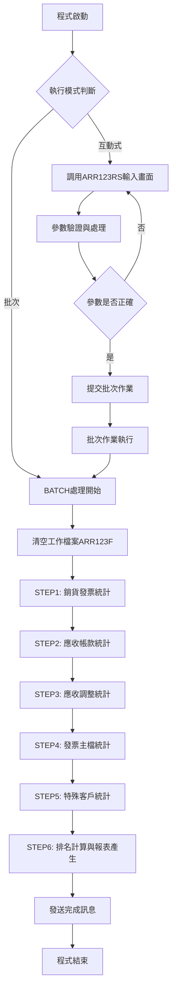
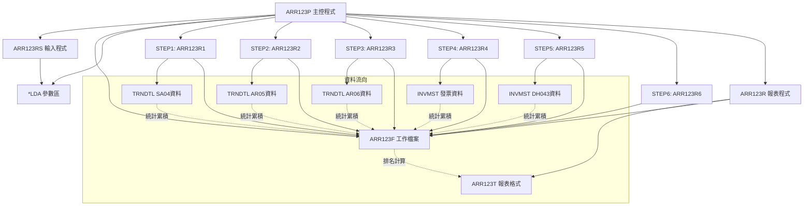
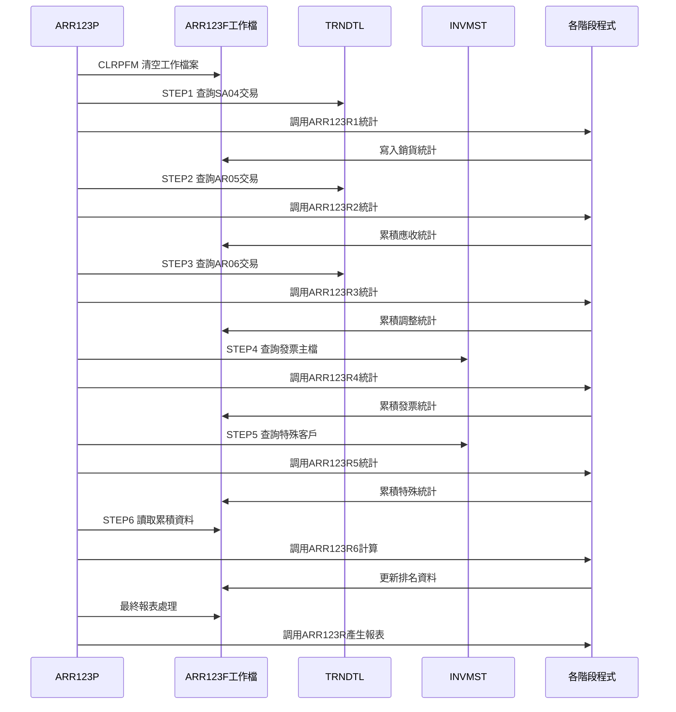
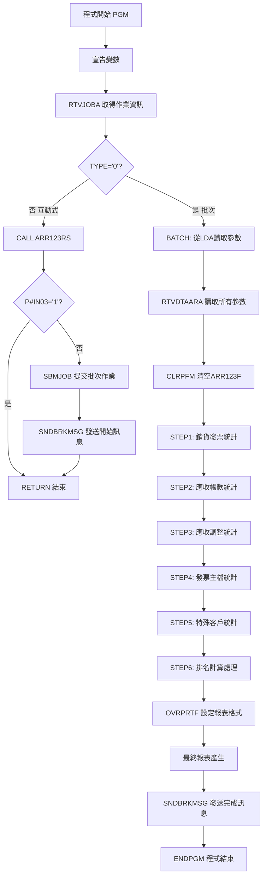

# ARR123P_P02 程式規格書

## 1. 基本資料

| 項目 | 內容 |
|------|------|
| **程式編號** | ARR123P |
| **程式名稱** | 客戶應收帳款排名統計報表作業 |
| **程式類型** | CLP |
| **廠區** | P02 |
| **系統名稱** | 應收帳款系統 |
| **子系統** | 應收帳款統計報表處理 |
| **檔案位置** | 東鋼list/ARR123P_P02.txt |

## 2. 🎯 程式功能說明

### 主要功能描述
ARR123P是應收帳款系統的客戶應收帳款排名統計報表作業控制程式，負責統計分析指定期間內的客戶應收帳款資料，並依金額大小進行排名，產生客戶應收帳款排名統計報表。程式採用分階段處理模式，透過六個步驟完成完整的統計分析作業。

### 🎯 業務流程詳細說明

#### 完整業務流程圖


#### 業務流程關鍵階段說明

**1. 多階段統計處理架構**
- STEP1：處理銷貨發票(SA04)交易資料統計
- STEP2：處理應收帳款(AR05)交易資料統計
- STEP3：處理應收調整(AR06)交易資料統計
- STEP4：處理發票主檔(INVMST)統計資料
- STEP5：處理特殊客戶(DH043)統計資料
- STEP6：進行排名計算並產生最終報表

**2. 工作檔案累積機制**
- 每個步驟將統計結果累積至ARR123F工作檔案
- 逐步建構完整的客戶應收帳款統計資料
- 最終依總金額進行降序排名

**3. 多重資料來源整合**
- TRNDTL交易明細檔案：提供銷貨、應收、調整交易資料
- INVMST發票主檔案：提供發票相關統計資料
- ARR123F工作檔案：統計結果的暫存與累計

## 3. 🎯 檔案架構與關聯圖

### 使用檔案清單

| 檔案名稱 | 檔案類型 | 用途說明 | 存取模式 |
|----------|----------|----------|----------|
| ARR123RS | RPG程式 | 互動式參數輸入程式 | CALL |
| ARR123R1 | RPG程式 | STEP1銷貨發票統計程式 | CALL |
| ARR123R2 | RPG程式 | STEP2應收帳款統計程式 | CALL |
| ARR123R3 | RPG程式 | STEP3應收調整統計程式 | CALL |
| ARR123R4 | RPG程式 | STEP4發票主檔統計程式 | CALL |
| ARR123R5 | RPG程式 | STEP5特殊客戶統計程式 | CALL |
| ARR123R6 | RPG程式 | STEP6排名計算程式 | CALL |
| ARR123R | RPG程式 | 最終報表產生程式 | CALL |
| ARR123F | 工作檔案 | 統計資料工作檔案 | OUTPUT/UPDATE |
| ARR123T | PRTF | 報表列印格式檔案 | OUTPUT |
| TRNDTL | 資料檔案 | 交易明細主檔 | INPUT |
| INVMST | 資料檔案 | 發票主檔 | INPUT |
| *LDA | 本地資料區 | 參數傳遞區域 | READ/WRITE |

### 🎯 檔案關聯詳細視覺化圖表



### 🎯 資料流向詳細說明

#### 分階段統計處理流程


## 4. 🎯 檔案欄位規格說明

### 主要資料結構

#### LDA參數區域結構視覺化
```
LDA參數區域 (328字元)：[YM1______|YM2______|RAK1_|RAK2_|AMT_________|USID______|...]
位置:                001-006   007-012  013-015 016-018 019-029    1001-1010  1011-
                      ↓         ↓        ↓       ↓       ↓          ↓          ↓
查詢年月起:           [YM1____]                                                  6位YYYYMM格式
查詢年月迄:                    [YM2____]                                        6位YYYYMM格式
排名範圍起:                             [RAK1]                                  3位數字排名起
排名範圍迄:                                    [RAK2]                           3位數字排名迄
查詢金額:                                           [AMT_______]                11位金額條件
使用者ID:                                                       [USID______]   10位使用者識別
```

#### 🔍 重點欄位切割技術詳解

##### LDA區域欄位切割對應表
| 位置範圍 | 長度 | 欄位名稱 | 用途說明 | 切割邏輯 |
|----------|------|----------|----------|----------|
| 300-305 | 6 | P#YM1 | 查詢年月起始 | 直接讀取YYYYMM格式 |
| 306-311 | 6 | P#YM2 | 查詢年月結束 | 直接讀取YYYYMM格式 |
| 312-314 | 3 | P#RAK1 | 排名範圍起始 | 數值型排名序號 |
| 315-317 | 3 | P#RAK2 | 排名範圍結束 | 數值型排名序號 |
| 318-328 | 11 | P#AMT | 查詢金額條件 | 數值型金額門檻 |
| 1001-1010 | 10 | USID | 使用者識別碼 | 字元型使用者ID |

#### ARR123F工作檔案結構詳細分析

##### ARR123F記錄格式視覺化
```
ARR123F記錄：[CUNO__|CUNM________|QTY1________|AMT1________|PRC1___|QTY2________|AMT2________|...]
位置:        001-006 007-016      017-028      029-040      041-045 046-057      058-069      
             ↓       ↓            ↓            ↓            ↓       ↓            ↓            
客戶編號:   [CUNO__]                                                                          6位客戶代碼
客戶名稱:    [CUNM________]                                                                   10位客戶名稱
銷貨數量:                [QTY1________]                                                       12位數量累計
銷貨金額:                            [AMT1________]                                           12位金額累計
銷貨單價:                                        [PRC1___]                                   5位平均單價
應收數量:                                                [QTY2________]                       12位應收數量
應收金額:                                                            [AMT2________]           12位應收金額
```

##### 擴展結構視覺化 (續)
```
ARR123F記錄：[PRC2___|QTY3________|AMT3________|PRC3___|QTY4________|AMT4________|PRC4___|...]
位置:        070-074  075-086      087-098      099-103 104-115      116-127      128-132
             ↓        ↓            ↓            ↓       ↓            ↓            ↓
應收單價:   [PRC2___]                                                              5位應收平均單價
調整數量:             [QTY3________]                                              12位調整數量
調整金額:                         [AMT3________]                                 12位調整金額
調整單價:                                     [PRC3___]                          5位調整平均單價
發票數量:                                              [QTY4________]             12位發票數量
發票金額:                                                          [AMT4________] 12位發票金額
發票單價:                                                                      [PRC4___] 5位發票平均單價
```

##### 總計與排名結構視覺化
```
ARR123F記錄：[QTY5________|AMT5________|RANK_|RESV__________________|]
位置:        133-144      145-156      157-159 160-179                
             ↓            ↓            ↓       ↓                      
總計數量:   [QTY5________]                                             12位總數量
總計金額:                [AMT5________]                               12位總金額(排名依據)
客戶排名:                            [RANK]                          3位排名順序
保留欄位:                                    [RESV__________________] 20位保留空間
```

### 🎯 欄位挪用詳細分析

#### 年月欄位的雙重切割處理

##### 原始年月欄位與切割後欄位對應
```
原始欄位P#YM1 (6字元)：[YYYYMM]
                       ↓
切割後W#YM1 (4字元)：  [YYMM] = %SST(&P#YM1 3 4)
                       
處理邏輯：
輸入: P#YM1 = "202312" (2023年12月)
切割: W#YM1 = "2312"   (供STEP3使用)

挪用原因：TRNDTL.TXRESV欄位使用4位年月格式
挪用方式：取年份後2位+月份2位組成YYMM格式
業務邏輯：配合應收調整資料的年月比對需求
```

#### TRNDTL檔案欄位切割映射技術

##### MAPFLD欄位切割視覺化
```
TXDATE (8字元)：[YYYYMMDD] → DAT1 [YYYYMMDD] → DATE [YYYYMM]
                ↓                   ↓               ↓
原始交易日期:   [20231215]          [20231215]      [202312]
切割邏輯:      直接對應            直接複製         %SST(DAT1 1 6)

TXACDT (8字元)：[YYYYMMDD] → ACD1 [YYYYMMDD] → ACDT [YYYYMM]  
                ↓                   ↓               ↓
原始入帳日期:   [20231220]          [20231220]      [202312]
切割邏輯:      直接對應            直接複製         %SST(ACD1 1 6)

TXRESV (30字元)：[RRRRRRRRRRRRRRRRRRRRRRRRRRRRR] → RESV [RRRRRR]
                 ↓                                    ↓
原始保留欄位:    [保留欄位內容...]                    [202312]
切割邏輯:       30字元保留欄位                      %SST(TXRESV 1 6)
挪用說明:       第1-6位存放年月資訊供STEP3使用
```

#### INVMST檔案欄位切割技術

##### 發票日期欄位切割邏輯
```
ININDT (8字元)：[YYYYMMDD] → IND1 [YYYYMMDD] → INDT [YYYYMM]
                ↓                  ↓              ↓
原始發票日期:   [20231215]         [20231215]     [202312]
切割邏輯:      直接對應           直接複製        %SST(IND1 1 6)
用途說明:      發票建立日期       暫存變數        年月比對用
```

### 欄位挪用業務邏輯分析

#### 多階段統計中的欄位重複利用

##### STEP別欄位使用方式對比表
| 步驟 | 主要欄位 | 切割方式 | 業務用途 | 挪用特色 |
|------|----------|----------|----------|----------|
| STEP1 | TXDATE→DATE | %SST(DAT1 1 6) | 銷貨發票年月篩選 | 標準年月切割 |
| STEP2 | TXACDT→ACDT | %SST(ACD1 1 6) | 應收帳款年月篩選 | 入帳日期切割 |
| STEP3 | TXRESV→RESV | %SST(TXRESV 1 6) | 調整資料年月篩選 | **保留欄位挪用** |
| STEP4 | ININDT→INDT | %SST(IND1 1 6) | 發票主檔年月篩選 | 發票日期切割 |
| STEP5 | ININDT→INDT | %SST(IND1 1 6) | 特殊客戶年月篩選 | 同STEP4邏輯 |

#### 挪用原因深度分析

**1. TXRESV保留欄位的重新定義**
- 原始設計：30字元的保留欄位，供未來擴充使用
- 實際挪用：前6位存放年月資訊 (YYYYMM格式)
- 挪用原因：應收調整資料需要年月篩選條件，但主要日期欄位不符需求
- 業務邏輯：利用保留欄位存放業務相關的年月資訊

**2. 年月格式的統一轉換機制**
- 技術挪用：所有8位日期欄位統一切割為6位年月
- 處理方式：%SST函數取前6位字元 (YYYYMM)
- 業務優勢：統一的年月比對邏輯，簡化查詢條件設定

**3. 排名欄位的動態計算挪用**
- A1RANK欄位：原設計為固定排名，實際為動態計算結果
- 挪用方式：在STEP6階段由ARR123R6程式動態填入排名
- 計算邏輯：依A1AMT5總金額降序排列後填入順序號

### 重要變數定義表

| 變數名稱 | 類型 | 長度 | 說明 | 切割來源 | 業務邏輯 |
|----------|------|------|------|----------|----------|
| &P#YM1 | CHAR | 6 | 查詢年月起始 | LDA(300-305) | 直接使用 |
| &P#YM2 | CHAR | 6 | 查詢年月結束 | LDA(306-311) | 直接使用 |
| &W#YM1 | CHAR | 4 | STEP3年月起始 | %SST(&P#YM1 3 4) | 年月後4位 |
| &W#YM2 | CHAR | 4 | STEP3年月結束 | %SST(&P#YM2 3 4) | 年月後4位 |
| &P#RAK1 | CHAR | 3 | 排名範圍起始 | LDA(312-314) | 數值型排名 |
| &P#RAK2 | CHAR | 3 | 排名範圍結束 | LDA(315-317) | 數值型排名 |
| &P#AMT | CHAR | 11 | 查詢金額條件 | LDA(318-328) | 金額門檻 |

## 5. 🎯 輸出/入螢幕布局

### 互動式輸入畫面布局
由ARR123RS程式提供的參數輸入畫面：

```
+----------------------------------------------------------+
|        ARR123RS                    東鋼企業股份有限公司    |
+----------------------------------------------------------+
|                客戶應收帳款排名統計報表輸入作業              |
+----------------------------------------------------------+
|                                                          |
| 查詢年月起：[______] (YYYYMM格式)                        |
| 查詢年月迄：[______] (YYYYMM格式)                        |
|                                                          |
| 排名範圍起：[___] (數字，如001)                          |
| 排名範圍迄：[___] (數字，如010)                          |
|                                                          |
| 查詢金額：[___________] (最低金額條件)                   |
|                                                          |
| [錯誤訊息顯示區]                                          |
|                                                          |
| F3=離開  F12=取消  Enter=確認                             |
+----------------------------------------------------------+
```

### 報表輸出布局
ARR123T報表格式：

```
+------------------------------------------------------------------------------+
| 報表代號: ARR123T              東鋼營業股份有限公司             列印日期:2023/12/15 |
| 列印人員: USER001            客戶應收帳款排名統計報表           列印時間:14:30:25  |
| 查詢年月: 2023/01 ~~ 2023/12                                  報表頁數:    1    |
| 排名範圍: 001 ~~ 010                                                          |
| 查詢金額: 1,000,000 (萬元)                                                   |
+==============================================================================+
| 排名序號     客戶名稱          應收總金額(萬元)      占總應收帳款比率(%)        |
+==============================================================================+
|    1        ABC股份有限公司        15,680,250            25.32%             |
|    2        XYZ企業公司           12,450,180            20.11%             |
|    3        DEF工業股份           10,230,150            16.53%             |
|    4        GHI貿易公司            8,120,320            13.12%             |
|    5        JKL製造公司            6,890,240            11.13%             |
|              ...                     ...                 ...               |
+------------------------------------------------------------------------------+
| 小計總計：                        61,925,480           100.00%             |
+------------------------------------------------------------------------------+
```

### 🎯 畫面欄位詳細說明
| 欄位名稱 | 屬性 | 長度 | 輸入格式 | 驗證規則 |
|----------|------|------|----------|----------|
| 查詢年月起 | 必填 | 6 | YYYYMM | 年月格式驗證 |
| 查詢年月迄 | 必填 | 6 | YYYYMM | 年月格式驗證，不可小於起始年月 |
| 排名範圍起 | 必填 | 3 | 數字 | 數值驗證，不可為0 |
| 排名範圍迄 | 必填 | 3 | 數字 | 數值驗證，不可小於起始排名 |
| 查詢金額 | 必填 | 11 | 數字 | 數值驗證，不可為0 |

### 功能鍵詳細定義
| 功能鍵 | 功能說明 | 處理邏輯 |
|--------|----------|----------|
| F3 | 離開程式 | 設定P#IN03='1'，回到主控程式 |
| F12 | 取消輸入 | 清除輸入資料，重新顯示畫面 |
| Enter | 確認輸入 | 執行輸入驗證，通過後進入報表處理 |

## 6. 🎯 處理流程程序說明

### 🎯 主程序邏輯深度分析

#### 程式執行流程圖


#### 🎯 詳細處理步驟逐一分析

**STEP 1：銷貨發票統計處理**
- 查詢條件：TXCODE='SA04'，TXFLAG≠'D'
- 時間範圍：TXDATE或TXACDT在指定年月範圍內
- 資料來源：TRNDTL交易明細檔案
- 處理程式：ARR123R1
- 統計內容：按客戶統計銷貨發票的數量和金額

**STEP 2：應收帳款統計處理**
- 查詢條件：TXCODE='AR05'，TXFLAG≠'D'
- 時間範圍：TXDATE或TXACDT在指定年月範圍內
- 資料來源：TRNDTL交易明細檔案
- 處理程式：ARR123R2
- 統計內容：按客戶統計應收帳款的數量和金額

**STEP 3：應收調整統計處理**
- 查詢條件：TXCODE='AR06'，TXFLAG≠'D'，TXACNT≠'4'，TXACDT≠0
- 特殊處理：使用W#YM1、W#YM2（4位年月格式）
- 時間來源：TXRESV欄位前6位的年月資訊
- 處理程式：ARR123R3
- 統計內容：按客戶統計應收調整的相關資料

**STEP 4：發票主檔統計處理**
- 查詢條件：INTYPE='1'，INDECD=' '
- 時間範圍：ININDT在指定年月範圍內
- 資料來源：INVMST發票主檔案
- 處理程式：ARR123R4
- 統計內容：按客戶統計發票相關的數量和金額

**STEP 5：特殊客戶統計處理**
- 查詢條件：INTYPE='9'，INDECD=' '，INCUNO='DH043'
- 時間範圍：ININDT在指定年月範圍內
- 資料來源：INVMST發票主檔案
- 處理程式：ARR123R5
- 統計內容：專門處理DH043客戶的特殊統計

**STEP 6：排名計算與統計整合**
- 資料來源：ARR123F工作檔案累積的統計資料
- 處理程式：ARR123R6
- 計算邏輯：依A1AMT5總金額進行降序排列並計算排名
- 結果更新：將排名結果更新至ARR123F檔案

### 🎯 子程序邏輯分析

**ARR123RS子程序功能**
- 提供完整的參數輸入介面
- 執行年月格式、排名範圍、金額條件的驗證
- 檢查輸入參數的邏輯正確性（起始不大於結束）
- 將驗證通過的參數寫入LDA區域

**ARR123R1-R5統計子程序功能**
- 每個子程序處理特定的資料來源和交易類型
- 統一的客戶分組統計邏輯
- 將統計結果累積至ARR123F工作檔案
- 處理數量、金額、平均單價的計算

**ARR123R6排名計算子程序功能**
- 讀取ARR123F中所有客戶的累積統計資料
- 依A1AMT5總金額進行降序排列
- 計算每個客戶的排名順序
- 更新ARR123F的A1RANK排名欄位

**ARR123R報表產生子程序功能**
- 依排名順序讀取ARR123F資料
- 篩選在指定排名範圍和金額條件內的客戶
- 計算各客戶占總應收帳款的比率
- 產生格式化的排名統計報表

### 🎯 特殊邏輯處理

**年月格式轉換邏輯**
- 6位轉4位：%SST(&P#YM1 3 4)取年份後2位+月份
- 用途：配合STEP3中TXRESV欄位的年月格式
- 處理時機：在STEP3執行前進行轉換

**多重時間篩選邏輯**
- OR條件：((TXDATE範圍) OR (TXACDT範圍))
- 目的：確保按交易日期或入帳日期都能篩選到相關資料
- 適用：STEP1、STEP2、STEP3

**工作檔案累積機制**
- 每個STEP將統計結果寫入或更新ARR123F
- 客戶為單位進行累積統計
- 最終形成完整的客戶應收帳款統計資料

## 7. 🎯 數據操作與轉換分析

### 檔案操作詳解

**ARR123F工作檔案管理**
- CLRPFM：程式開始時清空工作檔案，確保乾淨的統計環境
- 累積寫入：各STEP程式依序將統計結果寫入工作檔案
- 排序讀取：最終依A1AMT5降序讀取進行報表輸出
- 自動清理：程式結束後系統自動清理工作檔案

**TRNDTL檔案查詢處理**
- READ操作：透過OPNQRYF建立的查詢檢視讀取交易資料
- 複合條件：交易代碼、狀態、日期範圍的AND/OR組合
- 排序方式：依客戶名稱、客戶編號、發票號碼排序
- 檔案共享：使用SHARE(*YES)允許並行存取

**INVMST檔案存取邏輯**
- 查詢條件：發票類型、刪除狀態、特定客戶的篩選
- 日期篩選：依發票建立日期的年月範圍篩選
- 特殊處理：STEP5專門處理DH043客戶的特殊資料
- 客戶分組：依客戶名稱進行分組統計

### 數據轉換邏輯

**日期格式統一轉換**
- 8位轉6位：所有YYYYMMDD格式統一轉為YYYYMM
- 轉換方式：使用%SST(欄位 1 6)函數
- 應用範圍：TXDATE、TXACDT、ININDT等日期欄位
- 業務目的：統一年月比對邏輯，簡化查詢條件

**年月格式特殊轉換**
- 6位轉4位：YYYYMM轉為YYMM格式
- 轉換公式：%SST(&P#YM1 3 4)
- 應用時機：STEP3應收調整處理
- 技術原因：配合TXRESV欄位的4位年月格式

**金額與數量累積計算**
- 數量累積：各類型交易數量的分別統計和總計
- 金額累積：各類型交易金額的分別統計和總計
- 平均單價：金額除以數量計算各類型平均單價
- 總計計算：所有類型統計的最終合計

### 計算邏輯分析

**排名計算機制**
- 排序基準：依A1AMT5總金額降序排列
- 排名分配：依序分配1、2、3...等排名序號
- 相同金額：相同金額客戶依客戶名稱排序決定排名
- 範圍篩選：最終只顯示在指定排名範圍內的客戶

**比率計算邏輯**
- 個別比率：(客戶總金額 / 所有客戶總金額) × 100%
- 累積比率：前N名客戶金額占總金額的比率
- 精度處理：保留兩位小數的百分比顯示
- 總計驗證：確保所有比率加總為100%

**統計彙總計算**
- 客戶層級：按客戶分組統計各類型交易
- 類型層級：按交易類型統計數量、金額、單價
- 總計層級：所有類型交易的彙總統計
- 排名層級：依總金額排名的最終統計

### 檢核機制詳解

**資料一致性檢核**
- 交易代碼檢查：確保只處理指定的SA04、AR05、AR06交易
- 刪除狀態檢查：TXFLAG≠'D'排除已刪除記錄
- 日期有效性檢查：確保日期欄位不為0或空白
- 客戶有效性檢查：確保客戶編號和名稱的完整性

**計算結果檢核**
- 數量合理性：檢查累積數量不為負數
- 金額一致性：檢查各階段金額累積的正確性
- 單價計算檢核：金額/數量計算的除零檢查
- 排名唯一性：確保排名序號的唯一性和連續性

**參數有效性檢核**
- 年月格式檢查：確保輸入符合YYYYMM格式
- 排名範圍檢查：起始排名不大於結束排名
- 金額條件檢查：金額門檻為正數且不為零
- 邏輯一致性檢查：各參數間的邏輯關係驗證

## 8. 🎯 錯誤處理程序說明

### 🎯 詳細錯誤代碼清冊

| 錯誤代碼 | 錯誤訊息 | 原因說明 | 處理方式 | 預防措施 |
|----------|----------|----------|----------|----------|
| **USER001** | 請輸入查詢年月起始 | 年月起始欄位為空白或0 | 1. 顯示錯誤訊息<br>2. 游標定位至年月起始欄位<br>3. 要求重新輸入 | 設定欄位為必填屬性 |
| **USER002** | 查詢年月起始輸入錯誤 | 年月起始格式不正確或月份超出1-12範圍 | 1. 顯示錯誤訊息<br>2. 游標定位至年月起始欄位<br>3. 清除錯誤資料 | 加強輸入格式驗證 |
| **USER003** | 請輸入查詢年月結束 | 年月結束欄位為空白或0 | 1. 顯示錯誤訊息<br>2. 游標定位至年月結束欄位<br>3. 要求重新輸入 | 設定欄位為必填屬性 |
| **USER004** | 查詢年月結束輸入錯誤 | 年月結束格式不正確或月份超出1-12範圍 | 1. 顯示錯誤訊息<br>2. 游標定位至年月結束欄位<br>3. 清除錯誤資料 | 提供日期選擇器輔助輸入 |
| **USER005** | 查詢年月起始不可大於結束年月 | 起始年月大於結束年月 | 1. 顯示錯誤訊息<br>2. 游標定位至起始年月欄位<br>3. 要求重新輸入正確範圍 | 增加欄位間邏輯檢查 |
| **USER006** | 請輸入排名範圍起始 | 排名起始欄位為空白或0 | 1. 顯示錯誤訊息<br>2. 游標定位至排名起始欄位<br>3. 要求重新輸入 | 設定預設值為1 |
| **USER007** | 請輸入排名範圍結束 | 排名結束欄位為空白或0 | 1. 顯示錯誤訊息<br>2. 游標定位至排名結束欄位<br>3. 要求重新輸入 | 設定預設值為10 |
| **USER008** | 排名起始不可大於排名結束 | 起始排名大於結束排名 | 1. 顯示錯誤訊息<br>2. 游標定位至排名起始欄位<br>3. 要求重新輸入正確範圍 | 增加排名範圍邏輯檢查 |
| **USER009** | 請輸入查詢金額 | 查詢金額欄位為空白或0 | 1. 顯示錯誤訊息<br>2. 游標定位至金額欄位<br>3. 要求重新輸入 | 設定預設金額條件 |
| **FILE001** | ARR123F檔案清空失敗 | 工作檔案清空作業發生錯誤 | 1. 重試CLRPFM作業<br>2. 檢查檔案權限<br>3. 必要時重新建立檔案 | 定期檢查工作檔案狀態 |
| **FILE002** | TRNDTL檔案開啟失敗 | 交易明細檔案無法開啟或不存在 | 1. 檢查檔案存在性<br>2. 檢查檔案權限<br>3. 通知系統管理員 | 確保檔案存在且可存取 |
| **FILE003** | INVMST檔案開啟失敗 | 發票主檔案無法開啟或不存在 | 1. 檢查檔案存在性<br>2. 檢查檔案權限<br>3. 通知系統管理員 | 確保檔案存在且可存取 |
| **SYS001** | 統計程式執行失敗 | ARR123R1-R6程式執行錯誤 | 1. 檢查程式存在性<br>2. 檢查程式執行權限<br>3. 重新編譯問題程式 | 定期檢查程式完整性 |

### 🎯 系統異常處理邏輯

**檔案操作失敗處理**
- 工作檔案清空失敗時，自動重試並檢查檔案狀態
- 查詢檔案開啟失敗時，確保檔案關閉和資源釋放
- 報表檔案建立失敗時，檢查印表機和輸出設定

**程式調用失敗處理**
- 各STEP程式調用失敗時，記錄錯誤並停止後續處理
- 提供詳細的錯誤診斷資訊
- 確保工作檔案的清理和資源釋放

**資料完整性錯誤處理**
- 發現統計異常時記錄詳細錯誤訊息
- 提供資料修復或重新統計的選擇
- 確保部分階段錯誤不影響已完成的統計

**記憶體和資源管理**
- 大量資料處理時的記憶體使用監控
- 工作檔案空間不足時的自動清理
- 確保程式異常結束時的資源釋放

## 9. 🎯 備註

### 🎯 特殊注意事項

**分階段統計處理架構**
程式採用六個獨立階段進行統計處理，每個階段處理不同的資料來源和交易類型。此設計確保了統計的完整性和準確性，同時便於維護和除錯。

**年月格式轉換機制**
STEP3使用特殊的4位年月格式(YYMM)，這是為了配合TRNDTL.TXRESV欄位的特殊格式要求。程式透過%SST函數進行格式轉換，確保資料比對的正確性。

**工作檔案累積統計**
ARR123F工作檔案作為各階段統計結果的累積載體，程式開始時清空檔案，各階段依序累積統計結果，最終形成完整的客戶應收帳款統計資料。

**排名計算與報表產生**
最終報表依客戶總金額進行降序排名，並支援排名範圍和金額條件的彈性篩選，提供管理階層所需的客戶應收帳款排名分析資訊。

**批次作業佇列控制**
程式使用ARJOBD作業描述提交批次作業，確保大量統計處理在背景執行，不影響互動式作業的回應時間。

**參數傳遞機制**
所有查詢參數透過LDA(本地資料區)在程式間傳遞，確保互動式輸入的參數能正確傳遞給批次處理程式和各階段統計程式。 