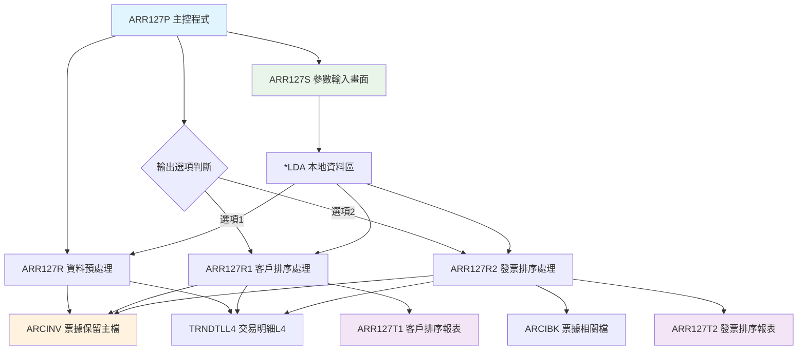
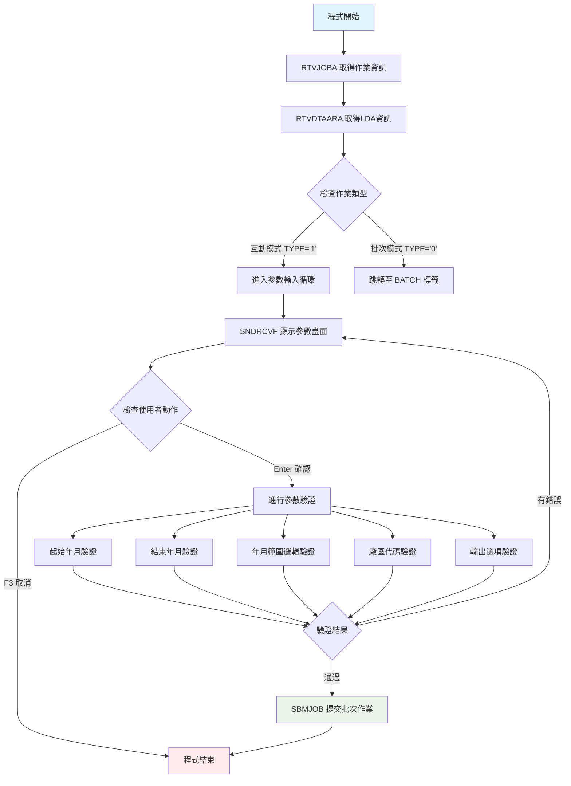
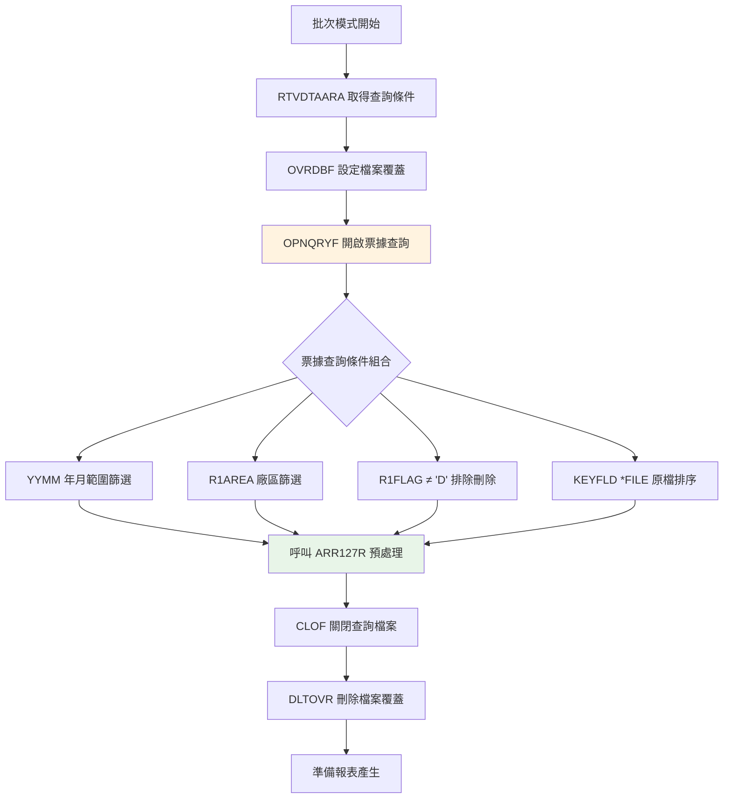
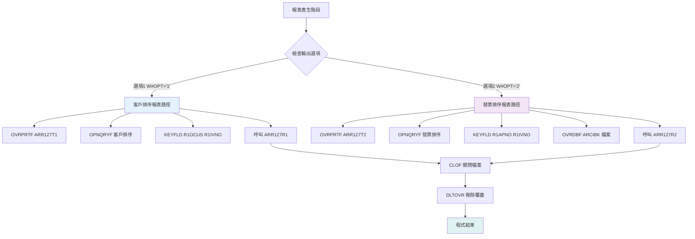
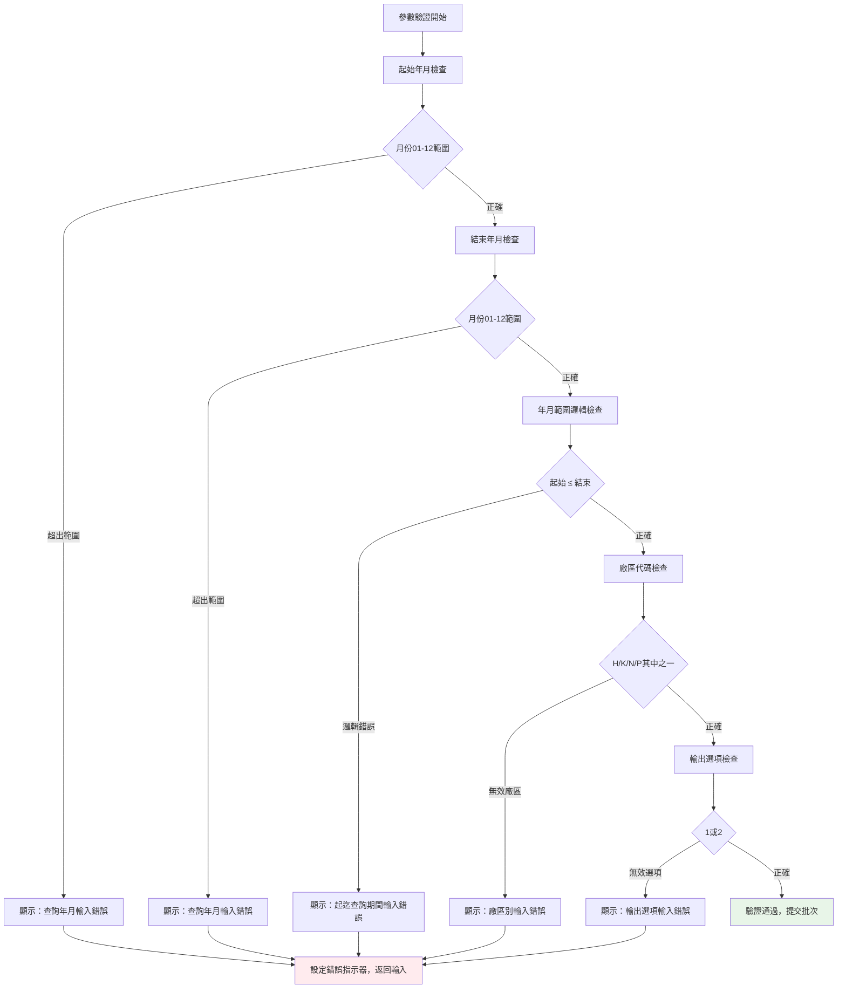

# ARR127P_K02 程式規格書

## 1. 基本資料

| 項目 | 內容 |
|------|------|
| **程式編號** | ARR127P |
| **程式名稱** | 年月期間票據報表系統 |
| **程式類型** | CLP (Control Language Program) |
| **廠區** | K02 |
| **系統名稱** | 應收帳款管理系統 |
| **子系統** | 應收帳款報表子系統 |
| **檔案位置** | K02CLSRC_THSRC/ARR127P.txt |

## 2. 程式功能說明

### 主要功能
ARR127P為年月期間票據統計分析的報表系統，主要功能包括：

1. **年月期間票據資料統計**：根據指定的年月範圍，統計票據保留資料檔（ARCINV）中的記錄
2. **排序輸出**：提供兩種排序方式，支援分析需求
3. **多廠區票據整合**：支援H、K、N、P四個廠區的票據資料處理
4. **資料預處理**：透過ARR127R程式進行票據資料的預處理和計算

### 業務流程說明
此程式用於票據管理分析，協助財務人員：
- 統計特定期間內的票據保留狀況
- 分析客戶別或發票別的票據分布
- 提供票據到期日和金額的資訊
- 支援票據管理決策和風險控制
- 協助編製票據相關的財務報表

## 3. 檔案架構與關聯圖

### 使用檔案清單

| 檔案名稱 | 檔案類型 | 使用方式 | 說明 |
|---------|---------|---------|------|
| **ARR127S** | DSPF | 輸入 | 參數輸入畫面（年月範圍、廠區、輸出選項）|
| **ARCINV** | 主檔 | 讀取 | 年月票據保留資料主檔（主要數據源）|
| **TRNDTLL4** | 主檔 | 讀取 | 交易明細檔L4（關聯查詢）|
| **ARCIBK** | 主檔 | 讀取 | 票據相關檔案（選項2使用）|
| **ARR127T1** | PRTF | 輸出 | 第一種輸出格式（客戶排序）|
| **ARR127T2** | PRTF | 輸出 | 第二種輸出格式（發票排序）|

### 檔案關聯視覺化圖表



### 資料流向說明

1. **參數收集階段**：透過 ARR127S 畫面收集年月範圍、廠區代碼、輸出選項，並存入 *LDA
2. **資料預處理階段**：ARR127R 從 ARCINV 主檔讀取符合條件的票據記錄，進行預處理計算
3. **報表產生階段**：根據輸出選項呼叫不同的處理程式：
   - 選項1：ARR127R1 產生按客戶排序的 ARR127T1 報表
   - 選項2：ARR127R2 產生按發票排序的 ARR127T2 報表

## 4. 檔案欄位規格說明

### 主要資料結構

#### ARCINV 票據保留資料檔案結構
```
A          R RARCINV                   TEXT('年月票據保留資料檔')
A            R1FLAG         1A         COLHDG('處理代碼')
A            R1AREA         1A         COLHDG('廠辦別')
A            R1ORNO         6A         COLHDG('訂單號碼')
A            R1SEQ          3S 0       COLHDG('訂單序號')
A            R1OCUS         6A         COLHDG('訂單客戶號碼')
A            R1OCNM        10O         COLHDG('訂單客戶名稱')
A            R1YYMM         6S 0       COLHDG('保留年月')
A            R1CDTE         8S 0       COLHDG('建立日期')
A            R1SACD         8S 0       COLHDG('起收票日期')
A            R1EACD         8S 0       COLHDG('迄收票日期')
A            R1TRAT         7S 4       COLHDG('匯率（美金兌台幣）')
A            R1FCUR        12S 2       COLHDG('外幣保留金額')
A            R1AMT         10S 0       COLHDG('台幣保留金額')
A            R1APNO        20A         COLHDG('帳單號碼')
A            R1IVNO        10A         COLHDG('發票號碼')
A            R1QTY         12S 3       COLHDG('保留數量')
```

### 欄位定義表格

| 欄位名稱 | 資料型態 | 長度 | 說明 | 特殊處理 |
|---------|---------|------|------|---------|
| **R1FLAG** | CHAR | 1 | 處理代碼 | ≠'D'過濾已刪除記錄 |
| **R1AREA** | CHAR | 1 | 廠辦別 | 條件：H/K/N/P |
| **R1ORNO** | CHAR | 6 | 訂單號碼 | 排序欄位 |
| **R1SEQ** | DECIMAL | 3,0 | 訂單序號 | 票據明細序號 |
| **R1OCUS** | CHAR | 6 | 訂單客戶號碼 | 客戶排序用 |
| **R1OCNM** | CHAR | 10 | 訂單客戶名稱 | 客戶名稱 |
| **R1YYMM** | DECIMAL | 6,0 | 保留年月 | 查詢條件 |
| **R1CDTE** | DECIMAL | 8,0 | 建立日期 | YYYYMMDD格式 |
| **R1SACD** | DECIMAL | 8,0 | 起收票日期 | 票據期間起始 |
| **R1EACD** | DECIMAL | 8,0 | 迄收票日期 | 票據期間結束 |
| **R1TRAT** | DECIMAL | 7,4 | 匯率 | 美金兌台幣匯率 |
| **R1FCUR** | DECIMAL | 12,2 | 外幣保留金額 | 美金金額 |
| **R1AMT** | DECIMAL | 10,0 | 台幣保留金額 | 新台幣金額 |
| **R1APNO** | CHAR | 20 | 帳單號碼 | 票據關聯帳單 |
| **R1IVNO** | CHAR | 10 | 發票號碼 | 票據關聯發票 |
| **R1QTY** | DECIMAL | 12,3 | 保留數量 | 票據相關數量 |

### 欄位挪用分析

#### LDA本地資料區使用
```
位置 301-308 (8位元): 查詢起始年月日 (W#YMDS)
位置 309-316 (8位元): 查詢結束年月日 (W#YMDE)
位置 317 (1位元): 廠區代碼 (W#AREA)
位置 318 (1位元): 輸出選項 (W#OPT)
位置 1011-1020 (10位元): 設備名稱 (S#DEVN)
位置 1021 (1位元): 廠區別 (S#AREA)
```

#### 動態欄位映射
1. **年月範圍處理**：
   - 自動將YYYYMM轉換為YYYYMM01（起始）和YYYYMM31（結束）
   - 提供更靈活的日期範圍查詢條件

2. **MAPFLD動態重組**：
   ```sql
   MAPFLD((YYMM   R1YYMM *CHAR 6))  -- 年月欄位字元化處理
   ```

## 5. 輸出/入螢幕布局

### ARR127S 參數輸入畫面

```
┌─────────────────────────────────────────────────────────────────────────────┐
│ 12/26/24      東森鋼鐵股份有限公司各廠區                         ARR127S   │
│              票據報表輸出系統                                              │
│                                                           DEVNAME01         │
│                                                                             │
│                                                                             │
│                                                                             │
│                                                                             │
│                     廠區代碼：[_]                                          │
│                                                                             │
│                     查詢年月：[______] ~ [______]                          │
│                                                                             │
│                     輸出選項：[_] (1 :訂單號碼、客戶號碼                    │
│                                 2 :訂單號碼、發票號碼)                    │
│                                                                             │
│                                                                             │
│                                                                             │
│                                                                             │
│                                                                             │
│                                                                             │
│                                                                             │
│                                                                             │
│                                                                             │
│ [錯誤訊息顯示區域]                                                          │
│ ENTER:確認     PF03:結束                                                   │
└─────────────────────────────────────────────────────────────────────────────┘
```

### 欄位配置說明
- **廠區代碼輸入**：1位字元，限定H、K、N、P
- **查詢年月輸入**：6位數字，格式YYYYMM，支援範圍查詢
- **輸出選項輸入**：1位數字，1或2選擇不同排序方式
- **錯誤處理**：即時驗證並顯示錯誤訊息

### 功能鍵定義
| 功能鍵 | 說明 | 處理方式 |
|--------|------|---------|
| **F3** | 結束作業 | 設定 *IN03='1'，返回上層 |
| **Enter** | 確認執行 | 驗證輸入後提交批次作業 |

## 6. 處理流程程序說明

### 主程序邏輯分析

#### 第一階段：作業模式判定與參數收集


#### 第二階段：資料預處理


#### 第三階段：雙軌報表產生


### 子程序邏輯分析

#### 參數驗證邏輯詳述


#### ARR127R 預處理程式邏輯
1. **票據資料計數處理**：
   - 以訂單號碼（R1ORNO）為L2控制層級
   - 計算同一訂單下的起訖收票日期統計
   - 更新票據數量計數資訊

2. **特殊邏輯處理**：
   ```rpg
   -- 特殊訂單號碼標記
   IF R1ORNO = 'X00085' THEN W#XX = 0
   
   -- 票據統計邏輯
   SELECT
   WHEN R1ORNO = W#ORNO AND R1SACD = W#SACD AND R1EACD = W#EACD
        ADD 1 TO W#CONT  (累計同類票據)
   OTHER
        RESET COUNTERS   (重置計數器)
   ```

#### ARR127R1 客戶排序報表邏輯
1. **多層級Control Level處理**：
   - L2 Level：客戶層級（R1OCUS）
   - L1 Level：發票層級（R1IVNO）
   - Detail Level：明細資料輸出

2. **關聯檔案整合**：
   - 主檔：ARCINV（票據保留檔）
   - 關聯：TRNDTLL4（交易明細檔L4）
   - 透過訂單號碼進行關聯查詢

3. **2015年欄位擴充**（0405A修改）：
   - 新增產品代號3碼和5碼支援
   - 增強產品分類統計功能

#### ARR127R2 發票排序報表邏輯
1. **與ARR127R1的差異**：
   - 主要排序：R1APNO（帳單號碼）+ R1IVNO（發票號碼）
   - 額外使用：ARCIBK檔案進行票據資料驗證
   - 提供不同的分析視角

2. **ARCIBK關聯邏輯**：
   ```rpg
   -- 關聯查詢鍵值
   CIKEY: D#AREA + K#ORNO  (廠區+訂單號碼)
   ```

### 🎯 特殊邏輯處理

#### 複合查詢條件邏輯
```sql
-- ARCINV 主要查詢條件
(YYMM   *GE "起始年月")    -- 年月範圍起始
*AND (YYMM   *LE "結束年月")    -- 年月範圍結束
*AND (R1AREA *EQ "指定廠區")    -- 廠區限定
*AND (R1FLAG *NE "D")          -- 排除已刪除記錄

-- 動態欄位重組
MAPFLD((YYMM   R1YYMM *CHAR 6))  -- 年月欄位字元化
```

#### 票據統計算法
```
票據保留統計邏輯：
├── 按訂單分組統計
├── 計算起訖收票期間
├── 累計台幣/外幣金額
├── 統計票據數量
└── 產生期間統計摘要

排序選項差異：
選項1 (ARR127R1)：客戶號碼 → 發票號碼 → 明細
選項2 (ARR127R2)：帳單號碼 → 發票號碼 → 明細
```

#### 2023年系統說明強化（1202A）
```sql
-- 廠區檢查邏輯更新
(S#AREA *NE 'H') *AND (S#AREA *NE 'K') 
*AND (S#AREA *NE 'N') *AND (S#AREA *NE 'P')
-- 新增N廠區支援，強化系統說明文件
```

## 7. 備註

1. **輸出架構**：
   - 客戶導向：ARR127R1提供客戶別票據分析
   - 票據導向：ARR127R2提供發票別票據分析
   - 選項切換：透過輸出選項選擇分析路徑

2. **年月範圍處理**：
   - 日期補齊：YYYYMM → YYYYMM01~YYYYMM31
   - 範圍驗證：確保起始年月 ≤ 結束年月
   - 查詢條件：支援跨月份、跨年度查詢

3. **多廠區整合**：
   - 資料模型：支援H、K、N、P四廠區
   - 廠區處理：根據廠區代碼進行邏輯
   - 2023年新增N廠區支援

### 技術注意事項

1. **核心業務規則**：
   - 票據範圍：限定指定廠區和年月範圍的票據保留記錄
   - 排序邏輯：提供客戶導向和票據導向兩種分析方式
   - 期間統計：計算票據起訖收票期間的統計資訊
   - 多廠區支援：統一處理H、K、N、P四個廠區的票據資料

2. **系統整合**：
   - 檔案整合：整合ARCINV、TRNDTLL4、ARCIBK等檔案
   - 歷史相容：支援歷史票據資料的查詢和分析
   - 效能考量：年月範圍查詢需要索引支援 