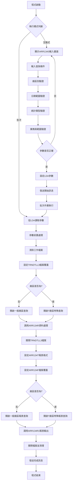
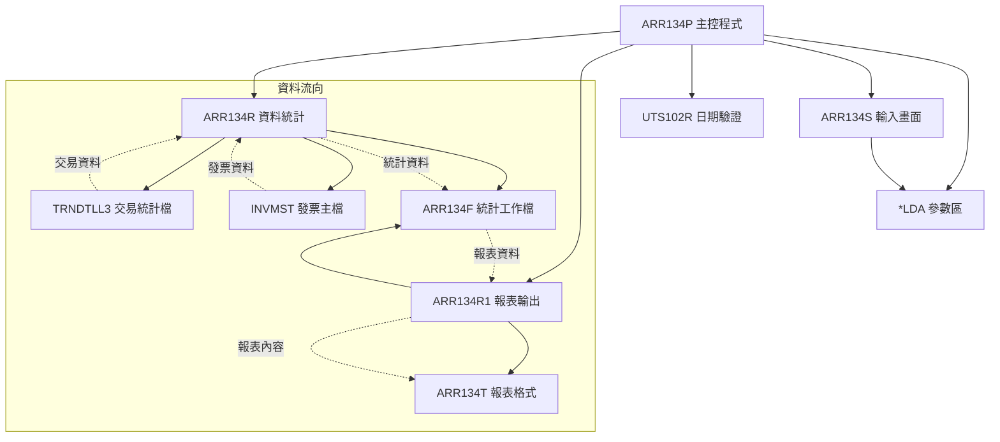
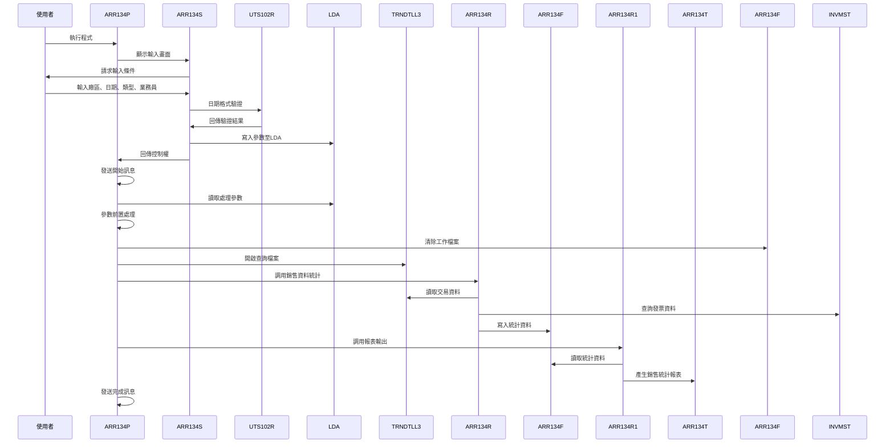
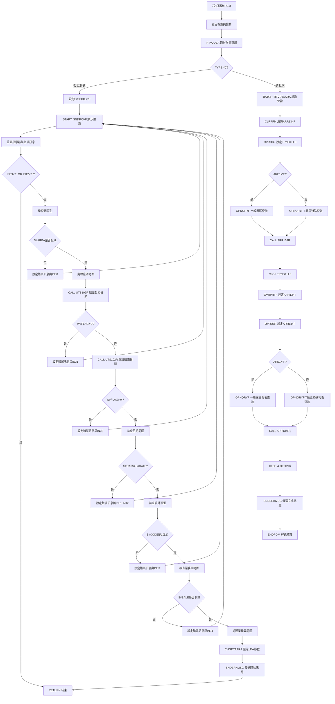

# ARR134P_P02 程式規格書

## 1. 基本資料

| 項目 | 內容 |
|------|------|
| **程式編號** | ARR134P |
| **程式名稱** | 銷售統計日報表(銷售員別和廠別統計) |
| **程式類型** | CLP |
| **廠區** | P02 |
| **系統名稱** | 應收帳款系統 |
| **子系統** | 銷售統計分析 |
| **檔案位置** | 東鋼list/ARR134P_P02.txt |

## 2. 🎯 程式功能說明

### 主要功能描述
ARR134P是應收帳款系統的銷售統計日報表程式，專門提供銷售員別和廠別的銷售統計分析。程式支援內銷/外銷分類統計，依據指定的廠區別、日期範圍、業務員範圍進行多維度的銷售金額統計，產生詳細的銷售統計報表，協助管理層掌握各廠區和業務員的銷售表現。

### 🎯 業務流程詳細說明

#### 完整業務流程圖


#### 業務流程關鍵階段說明

**1. 互動式參數輸入階段**
- 廠區別選擇：空白(全部)、P(台灣)、T(內銷)、K(高雄)、M(台中)、H(海外)
- 銷售統計日期範圍：起始日期到結束日期(YYYY/MM/DD格式)
- 統計類型選擇：1=內銷統計、2=外銷統計
- 業務員範圍：指定業務員代碼或空白(全部業務員)

**2. 參數驗證階段**
- 廠區別驗證：限定為空白、P、T、M、K、H其中之一
- 日期格式驗證：透過UTS102R程式驗證日期有效性
- 日期邏輯驗證：確保起始日期不大於結束日期
- 統計類型驗證：限定為1或2
- 業務員代碼驗證：限定為A-Z範圍或空白

**3. 第一階段：銷售資料統計處理**
- 目標檔案：TRNDTLL3(交易明細統計檔)
- 篩選條件：日期範圍、廠區範圍、業務員範圍、統計類型、有效記錄
- T廠區特殊處理：包含T/U/D/J/N/R/X/V等多個子廠區
- 透過ARR134R程式進行銷售金額分類統計

**4. 第二階段：報表產生處理**
- 讀取ARR134F統計資料，依科目別進行分類
- T廠區特殊查詢：包含T/U/D/J/N/R/X/V等子廠區統計
- 透過ARR134R1程式產生詳細的銷售統計報表
- 支援銷售員小計、廠區小計、總計等多層次統計

## 3. 🎯 檔案架構與關聯圖

### 使用檔案清單

| 檔案名稱 | 檔案類型 | 用途說明 | 存取模式 |
|----------|----------|----------|----------|
| ARR134S | DSPF | 互動式參數輸入畫面 | I/O |
| ARR134R | RPG程式 | 銷售資料統計處理程式 | CALL |
| ARR134R1 | RPG程式 | 銷售統計報表輸出程式 | CALL |
| ARR134T | PRTF | 銷售統計報表格式 | OUTPUT |
| ARR134F | 實體檔案 | 銷售統計工作檔 | I/O |
| TRNDTLL3 | 實體檔案 | 交易明細統計檔 | INPUT |
| INVMST | 實體檔案 | 發票主檔 | INPUT |
| UTS102R | RPG程式 | 日期驗證公用程式 | CALL |
| *LDA | 本地資料區 | 參數傳遞區域 | READ/WRITE |

### 🎯 檔案關聯詳細視覺化圖表



### 🎯 資料流向詳細說明

#### 雙階段處理的資料流向


## 4. 🎯 檔案欄位規格說明

### 主要資料結構

#### LDA參數區域結構
| 位置 | 長度 | 欄位名稱 | 用途說明 |
|------|------|----------|----------|
| 301-308 | 8 | C#DATS | 銷售統計起始日期 |
| 309-316 | 8 | C#DATE | 銷售統計結束日期 |
| 317-317 | 1 | ARE1 | 廠區範圍起始 |
| 318-318 | 1 | ARE2 | 廠區範圍結束 |
| 319-319 | 1 | S#CODE | 統計類型(1:內銷 2:外銷) |
| 320-321 | 2 | SALE1 | 業務員範圍起始 |
| 322-323 | 2 | SALE2 | 業務員範圍結束 |

#### 程式變數定義表
| 變數名稱 | 類型 | 長度 | 說明 |
|----------|------|------|------|
| &TYPE | CHAR | 1 | 作業類型識別 |
| &C#DATS | CHAR | 8 | 銷售統計起始日期 |
| &C#DATE | CHAR | 8 | 銷售統計結束日期 |
| &C#YMS | CHAR | 6 | 年月起始(YYYYMM) |
| &C#YME | CHAR | 6 | 年月結束(YYYYMM) |
| &ARE1 | CHAR | 1 | 廠區範圍起始 |
| &ARE2 | CHAR | 1 | 廠區範圍結束 |
| &SALE1 | CHAR | 2 | 業務員範圍起始 |
| &SALE2 | CHAR | 2 | 業務員範圍結束 |
| &W#BLK | CHAR | 70 | 空白字串 |
| &P#DATE | CHAR | 8 | 日期驗證參數 |
| &W#FLAG | CHAR | 1 | 日期驗證旗標 |
| &P#MODE | CHAR | 1 | 驗證模式 |
| &P#MTL | CHAR | 24 | 月份表 |
| &P#LEAP | CHAR | 1 | 閏年旗標 |

### 🔍 重點欄位切割技術詳解

#### LDA參數區域結構視覺化
```
LDA參數區域 (323字元)：[DATS____|DATE____|A|A|C|SA|SA|...]
位置:                 301-308  309-316  317 318 319 320-321 322-323
                       ↓        ↓        ↓   ↓   ↓   ↓       ↓
起始日期:             [DATS____]                                      8位YYYYMMDD格式
結束日期:                      [DATE____]                             8位YYYYMMDD格式
廠區起始:                               [A]                          1位廠區代碼
廠區結束:                                   [A]                      1位廠區代碼
統計類型:                                       [C]                  1位類型代碼
業務員起始:                                         [SA]             2位業務員代碼
業務員結束:                                                [SA]      2位業務員代碼
```

#### LDA區域欄位切割對應表
| 位置範圍 | 長度 | 欄位名稱 | 用途說明 | 切割邏輯 |
|----------|------|----------|----------|----------|
| 301-308 | 8 | C#DATS | 銷售統計起始日期 | 直接讀取YYYYMMDD格式 |
| 309-316 | 8 | C#DATE | 銷售統計結束日期 | 直接讀取YYYYMMDD格式 |
| 301-306 | 6 | C#YMS | 年月起始 | 前6位YYYYMM格式 |
| 309-314 | 6 | C#YME | 年月結束 | 前6位YYYYMM格式 |
| 317-317 | 1 | ARE1 | 廠區範圍起始 | 直接讀取1位廠區代碼 |
| 318-318 | 1 | ARE2 | 廠區範圍結束 | 直接讀取1位廠區代碼 |
| 319-319 | 1 | S#CODE | 統計類型 | 直接讀取1位類型代碼 |
| 320-321 | 2 | SALE1 | 業務員範圍起始 | 直接讀取2位業務員代碼 |
| 322-323 | 2 | SALE2 | 業務員範圍結束 | 直接讀取2位業務員代碼 |

#### TRNDTLL3檔案欄位切割技術詳細分析

##### 交易檔案欄位切割視覺化
```
TXACDT (8字元)：[YYYYMMDD] → ACDT [YYYYMMDD]
                ↓                  ↓
原始會計日期:   [20231215]         [20231215]
切割邏輯:      8字元會計日期       MAPFLD直接映射

TXRESV (30字元)：[NNNNNNNNNNNNNNNNNNNNNNNNNNNNNN] → RESV [NNNNNN]
                 ↓                                   ↓
原始保留欄位:    [231215ABCDEFGHIJKLMNOPQRST12345]  [231215]
切割邏輯:       30字元保留欄位                      %SST(TXRESV 1 6)前6位
```

#### ARR134F工作檔案結構詳細分析

##### ARR134F記錄格式視覺化
```
ARR134F記錄 (69字元)：[NO____|IT|ACDT____|AC|A|CUNM______|ORNO__|INNO______|AMT_______|TAX_____|TOT_______|]
位置:                001-006 007-008 009-016 017-018 019 020-029 030-035 036-045 046-055 056-063 064-073 ...
                      ↓       ↓       ↓        ↓       ↓   ↓       ↓       ↓       ↓       ↓       ↓       ↓
銷售員編號:          [NO____]                                                                               6位業務員編號
項目序號:                    [IT]                                                                           2位Packed序號
會計日期:                            [ACDT____]                                                             8位會計日期
科目代碼:                                     [AC]                                                         2位科目代碼
廠區別:                                           [A]                                                      1位廠區代碼
客戶名稱:                                             [CUNM______]                                        10位客戶名稱
訂單編號:                                                      [ORNO__]                                   6位訂單編號
發票號碼:                                                              [INNO______]                       10位發票號碼
未稅金額:                                                                       [AMT_______]               10位Packed金額
稅額:                                                                                   [TAX_____]         8位Packed稅額
含稅金額:                                                                                      [TOT_______] 10位Packed總額
```

### 🎯 欄位挪用詳細分析

#### 廠區範圍處理的挪用機制

##### 廠區範圍挪用處理
```
原始欄位S#AREA (1字元)：[A]
                        ↓
挪用處理邏輯：
IF S#AREA=' ' THEN
   ARE1='A', ARE2='Z'     // 空白時設為全範圍
ELSE
   ARE1=S#AREA, ARE2=S#AREA  // 指定廠區時設為相同值

廠區對應表：
輸入值     → 起始範圍   結束範圍   涵蓋範圍
' '(空白)   → 'A'       'Z'       所有廠區
'P'        → 'P'       'P'       台灣廠區
'T'        → 'T'       'T'       內銷廠區
'K'        → 'K'       'K'       高雄廠區
'M'        → 'M'       'M'       台中廠區
'H'        → 'H'       'H'       海外廠區

挪用原因：OPNQRYF查詢需要範圍條件而非單一值
業務邏輯：支援全廠區查詢和特定廠區查詢的彈性需求
```

##### 業務員範圍挪用處理
```
原始欄位S#SALE (2字元)：[SA]
                        ↓
挪用處理邏輯：
IF S#SALE=' ' THEN
   SALE1='A', SALE2='Z'   // 空白時設為全範圍
ELSE
   SALE1=S#SALE, SALE2=S#SALE  // 指定業務員時設為相同值

範圍對應表：
輸入值      → 起始範圍   結束範圍   涵蓋範圍
'  '(空白)   → 'A'       'Z'       所有業務員
'AB'        → 'AB'      'AB'      特定業務員

挪用原因：簡化使用者輸入，支援單一業務員和全部業務員查詢
業務邏輯：提供查詢條件的使用彈性
```

#### T廠區的特殊挪用處理

##### T廠區子廠區群組挪用
```
T廠區查詢條件挪用：
ARE1='T' → TXTXAR *EQ "T" *OR TXTXAR *EQ "U" *OR
           TXTXAR *EQ "D" *OR TXTXAR *EQ "J" *OR
           TXTXAR *EQ "N" *OR TXTXAR *EQ "R" *OR
           TXTXAR *EQ "X" *OR TXTXAR *EQ "V"

廠區歸類對應：
原始廠區 → 群組歸類
'T'      → 內銷廠區群組
'U'      → 內銷廠區群組
'D'      → 內銷廠區群組
'J'      → 內銷廠區群組
'N'      → 內銷廠區群組
'R'      → 內銷廠區群組
'X'      → 內銷廠區群組
'V'      → 內銷廠區群組

挪用原因：T廠區包含多個子廠區，需要群組查詢
業務邏輯：內銷業務分散在多個實體廠區，需要統一統計
技術實現：透過OR條件實現多廠區的群組查詢
```

#### 會計科目的分類挪用

##### TXACNT的科目分類挪用
```
TXACNT會計科目分類挪用：
原始科目 → 統計分類   → 說明
'2'      → '2'        → 銷售退回
'3'      → '3'/'1'/'X' → 銷售確認(依保留欄位細分)
'4'(+)   → '4'        → 預收貨款
'4'(-)   → '5'        → 預收退回
'4'(特殊) → '6'       → 預收修正

科目細分邏輯：
IF TXACNT='3' THEN
   IF D#RESV='1' OR D#RESV='3' THEN A4ACNT=D#RESV
   ELSE A4ACNT='X'

IF TXACNT='4' THEN
   IF TXAMT>0 THEN A4ACNT='4'
   ELSE A4ACNT='5'
   IF TXACDT=99999999 THEN A4ACNT='6'

挪用原因：不同會計科目需要不同的統計分類
業務邏輯：銷售統計需要區分正常銷售、退回、預收等不同性質
技術實現：透過條件判斷進行科目重新分類
```

#### 日期欄位的雙重挪用

##### 日期範圍的複合查詢挪用
```
日期查詢條件複合挪用：
正常日期範圍：
((ACDT *GE C#DATS) *AND (ACDT *LE C#DATE))

特殊日期範圍：
((ACDT *EQ "99999999") *AND 
 (RESV *GE C#YMS) *AND (RESV *LE C#YME))

組合條件：
正常日期範圍 *OR 特殊日期範圍

挪用原因：系統中存在特殊日期標記(99999999)的記錄
業務邏輯：特殊記錄使用保留欄位的年月進行日期篩選
技術效果：一個查詢條件同時處理正常和特殊日期記錄
```

### 重要變數定義表

| 變數名稱 | 類型 | 長度 | 說明 | 切割來源 | 挪用邏輯 |
|----------|------|------|------|----------|----------|
| &C#DATS | CHAR | 8 | 起始日期 | LDA(301-308) | 直接使用 |
| &C#DATE | CHAR | 8 | 結束日期 | LDA(309-316) | 直接使用 |
| &C#YMS | CHAR | 6 | 年月起始 | LDA(301-306) | 前6位切割 |
| &C#YME | CHAR | 6 | 年月結束 | LDA(309-314) | 前6位切割 |
| &ARE1 | CHAR | 1 | 廠區起始 | S#AREA挪用 | 單值轉範圍起始 |
| &ARE2 | CHAR | 1 | 廠區結束 | S#AREA挪用 | 單值轉範圍結束 |
| &SALE1 | CHAR | 2 | 業務員起始 | S#SALE挪用 | 單值轉範圍起始 |
| &SALE2 | CHAR | 2 | 業務員結束 | S#SALE挪用 | 單值轉範圍結束 |

## 5. 🎯 輸出/入螢幕布局

### 互動式輸入畫面布局
ARR134S提供的參數輸入畫面：

```
+----------------------------------------------------------+
|          ARR134S            東鋼企業股份有限公司          |
+----------------------------------------------------------+
|      銷售統計日報表(銷售員別和廠別統計)輸入畫面           |
+----------------------------------------------------------+
|                                                          |
|      銷售統計廠區：[_] (" ":全部                        |
|                        "P":台灣                        |
|                        "T":內銷                        |
|                        "K":高雄                        |
|                        "M":台中                        |
|                        "H":海外)                       |
|                                                          |
|      銷售統計日期：[____/__/__] ~ [____/__/__]         |
|                                                          |
|      統計類型：[_] (1:內銷2:外銷)                       |
|                                                          |
|      業務員：[__] (" ":全部)                           |
|                                                          |
|                                                          |
| [錯誤訊息顯示區]                                          |
|                                                          |
| F03:結束         F12:回上         ENTER:處理             |
+----------------------------------------------------------+
```

### 🎯 畫面欄位詳細說明
| 欄位名稱 | 屬性 | 長度 | 輸入格式 | 驗證規則 |
|----------|------|------|----------|----------|
| 銷售統計廠區 | 選填 | 1 | 英文字母 | 限定空白、P、T、M、K、H其中之一 |
| 起始日期 | 必填 | 8 | YYYY/MM/DD | 透過UTS102R驗證日期有效性 |
| 結束日期 | 必填 | 8 | YYYY/MM/DD | 透過UTS102R驗證，不可小於起始日期 |
| 統計類型 | 必填 | 1 | 數字 | 限定1或2其中之一 |
| 業務員 | 選填 | 2 | 英文字母 | 限定A-Z範圍或空白 |

### 功能鍵詳細定義
| 功能鍵 | 功能說明 | 處理邏輯 |
|--------|----------|----------|
| F3 | 結束 | 設定IN03='1'，結束程式執行 |
| F12 | 回上 | 設定IN12='1'，回到主選單 |
| Enter | 處理 | 執行輸入驗證，通過後進入批次處理 |

### 報表輸出格式
ARR134T報表的版面配置：

```
+=================================================================================+
| 程式代號:ARR134T      東鋼企業股份有限公司               列印日期: YYYY/MM/DD   |
| USR - ID : XXXXXXXXXX 銷售統計日報表(銷售員別和廠別統計) 列印時間: HH:MM:SS    |
| 統計廠區: XXXXXX     統計期間: YYYY/MM/DD ~ YYYY/MM/DD  程式頁數: XXX         |
+=================================================================================+
|                        台灣統計金額   內銷統計金額   台中統計金額   高雄統計金額      合計      |
+=================================================================================+
| 銷售確認              999,999,999,999 999,999,999,999 999,999,999,999 999,999,999,999 999,999,999,999 |
|   特殊確認            999,999,999,999 999,999,999,999 999,999,999,999 999,999,999,999 999,999,999,999 |
|   特殊小計            999,999,999,999 999,999,999,999 999,999,999,999 999,999,999,999 999,999,999,999 |
| 預收貨款              999,999,999,999 999,999,999,999 999,999,999,999 999,999,999,999 999,999,999,999 |
| 預收退回              999,999,999,999 999,999,999,999 999,999,999,999 999,999,999,999 999,999,999,999 |
| 預收修正              999,999,999,999 999,999,999,999 999,999,999,999 999,999,999,999 999,999,999,999 |
+=================================================================================+
| 總計：                999,999,999,999 999,999,999,999 999,999,999,999 999,999,999,999 999,999,999,999 |
+=================================================================================+
```

## 6. 🎯 處理流程程序說明

### 🎯 主程序邏輯深度分析

#### 程式執行流程圖


#### 🎯 詳細處理步驟逐一分析

**步驟1：程式初始化階段**
- 宣告ARR134S顯示檔案和14個工作變數
- 透過RTVJOBA取得作業資訊和使用者ID
- 判別互動式或批次處理流程

**步驟2：互動式處理流程**
- 設定預設統計類型為'1'(內銷)
- 透過SNDRCVF顯示ARR134S參數輸入畫面
- 重置所有錯誤指示器(IN30-IN34)和錯誤訊息

**步驟3：參數驗證處理**
- 廠區別檢查：限定為空白、P、T、M、K、H其中之一
- 起始日期驗證：透過UTS102R程式驗證日期格式和有效性
- 結束日期驗證：透過UTS102R程式驗證，確保不小於起始日期
- 統計類型檢查：限定為1或2
- 業務員代碼檢查：限定為A-Z範圍或空白

**步驟4：範圍前置處理**
- 廠區範圍：空白時設為A-Z全範圍，指定時設為相同值
- 業務員範圍：空白時設為A-Z全範圍，指定時設為相同值

**步驟5：LDA參數設定**
- 將驗證通過的參數寫入LDA區域
- 位置301-308：起始日期
- 位置309-316：結束日期
- 位置317-318：廠區範圍
- 位置319：統計類型
- 位置320-323：業務員範圍

**步驟6：第一階段批次處理-資料統計**
- 清除ARR134F工作檔案
- 設定TRNDTLL3檔案覆蓋為共享模式
- 依據ARE1是否為'T'設定不同的OPNQRYF查詢條件
- T廠區：包含T/U/D/J/N/R/X/V等多個子廠區
- 一般廠區：使用範圍查詢
- 調用ARR134R程式處理銷售統計

**步驟7：第二階段批次處理-報表產生**
- 設定ARR134T報表格式：98字元寬度、10CPI、HOLD輸出
- 設定ARR134F檔案覆蓋為共享模式
- 依據ARE1是否為'T'設定不同的OPNQRYF報表查詢條件
- 調用ARR134R1程式產生銷售統計報表
- 清除所有檔案覆蓋設定

### 🎯 子程序邏輯分析

**ARR134R子程序功能（銷售資料統計）**
- 讀取TRNDTLL3交易明細統計資料
- 透過INVMST發票主檔查詢發票資料
- 依會計科目進行金額分類：銷售確認、預收貨款、預收退回等
- 特殊處理：統計類型1排除H廠區(外銷)資料
- 科目重新分類：TXACNT='3'依保留欄位細分，TXACNT='4'依金額正負號分類
- 寫入ARR134F工作檔案進行後續報表處理

**ARR134R1子程序功能（報表產生）**
- 從ARR134F讀取統計資料，依科目別進行L1分類處理
- 使用10元素陣列進行廠區別金額累計
- 廠區歸類：P→台灣、T/U/D/J/N/R/X/V→內銷、M→台中、K→高雄
- 科目分類顯示：使用TABA1/TABA2表格進行科目名稱對照
- 特殊處理：科目'3'的細分統計和小計處理
- 產生科目別明細、小計、總計等多層次報表

### 🎯 特殊邏輯處理

**T廠區的群組處理邏輯**
- T廠區實際包含8個子廠區：T、U、D、J、N、R、X、V
- 查詢時使用OR條件組合所有子廠區
- 報表統計時將所有子廠區歸類為"內銷"統計
- 反映企業內銷業務分散在多個實體廠區的現實

**統計類型的篩選邏輯**
- 統計類型1(內銷)：排除TXTXAR='H'的記錄
- 統計類型2(外銷)：包含所有廠區記錄
- 內銷外銷的區分依據廠區代碼H進行判定

**會計科目的重新分類**
- 科目'3'：依TXRESV第15位進行細分(1、3、X)
- 科目'4'：依金額正負號分為預收貨款(+)和預收退回(-)
- 特殊日期99999999：分類為預收修正('6')
- 提供詳細的財務科目分析功能

**日期查詢的雙重條件**
- 正常記錄：使用TXACDT進行日期範圍查詢
- 特殊記錄：TXACDT=99999999時使用TXRESV前6位進行年月查詢
- 支援不同日期格式記錄的統一查詢

## 7. 🎯 數據操作與轉換分析

### 檔案操作詳解

**TRNDTLL3檔案存取邏輯**
- READ操作：透過OPNQRYF建立的查詢檢視讀取交易統計資料
- 查詢條件：日期範圍(雙重條件)、廠區範圍、業務員範圍、有效標記、非刪除狀態
- 檔案鎖定：使用SHARE(*YES)允許多重存取
- 欄位映射：ACDT映射為TXACDT，RESV映射為TXRESV前6位
- 排序鍵值：TXNO(交易號)、TXACDT(會計日期)

**ARR134F工作檔案操作**
- 操作模式：先清除再重建，確保資料的完整性
- 寫入模式：ARR134R寫入統計資料
- 讀取模式：ARR134R1讀取並產生報表
- 鍵值結構：A4NO(業務員)、A4ITEM(項目)

**INVMST檔案查詢**
- READ操作：透過發票號碼查詢發票基本資料
- 取得資料：發票狀態(INFLAG、INDECD)用於有效性檢查
- 錯誤處理：發票不存在或已刪除時跳過處理

### 數據轉換邏輯

**日期格式轉換**
- 輸入格式：YYYYMMDD (8位數字)
- 驗證處理：透過UTS102R轉換為標準日期格式
- 年月格式：前6位YYYYMM用於特殊記錄查詢
- 報表顯示：轉換為YYYY/MM/DD格式輸出

**會計科目轉換**
- 原始科目：TXACNT (2位字元)
- 重新分類：依業務邏輯進行科目重新歸類
- 特殊處理：科目'3'的三重細分、科目'4'的正負號分類
- 名稱對照：透過TABA1/TABA2表格轉換為中文說明

**金額統計轉換**
- 原始金額：TXAMT/TXTAX (Packed decimal)
- 統計分類：未稅金額、稅額、含稅金額分別統計
- 廠區歸類：依廠區代碼歸類到業務廠區統計
- 精度控制：使用Packed decimal確保計算精確度

### 計算邏輯分析

**陣列統計計算**
- 基礎邏輯：使用10元素陣列進行廠區別金額累計
- 查找機制：透過DO迴圈查找現有記錄或新增記錄
- 排序處理：透過SORTA排序後進行順序統計
- 結果輸出：依序輸出各廠區統計結果

**廠區歸類計算**
- 歸類邏輯：多個實體廠區歸類到業務廠區統計
- 計算公式：依廠區別分別累計到對應統計欄位
- 特殊處理：T廠區群組的統一歸類處理
- 合計計算：各廠區統計的總和計算

**科目別統計計算**
- 分類統計：依重新分類的科目進行統計
- 小計處理：科目'3'的特殊小計處理
- 總計計算：所有科目的總金額統計
- 層次結構：明細→小計→總計的多層次統計

### 檢核機制詳解

**輸入資料檢核**
- 日期有效性：透過UTS102R進行完整的日期檢核
- 廠區有效性：限定為特定的廠區代碼範圍
- 統計類型檢核：限定為1或2的有效值
- 業務員代碼檢核：限定為A-Z範圍或空白

**檔案存取檢核**
- 檔案存在性：使用指示器檢查檔案讀取狀態
- 資料完整性：確保交易檔案和發票檔案的關聯正確性
- 記錄有效性：排除已刪除和無效的交易記錄
- 發票有效性：檢查發票狀態確保統計準確性

**計算結果檢核**
- 金額合理性：檢查計算結果是否在合理範圍內
- 統計一致性：確保各層級統計的加總一致
- 廠區對應：驗證廠區代碼對應的正確性
- 科目分類：確保科目重新分類的邏輯正確

## 8. 🎯 錯誤處理程序說明

### 🎯 詳細錯誤代碼清冊

| 錯誤代碼 | 錯誤訊息 | 原因說明 | 處理方式 | 預防措施 |
|----------|----------|----------|----------|----------|
| **USER001** | 銷售統計廠區輸入錯誤 | 廠區代碼不在有效範圍內 | 1. 顯示錯誤訊息<br>2. 游標定位至廠區欄位<br>3. 設定IN30指示器 | 提供廠區代碼選項說明 |
| **USER002** | 起始日期錯誤！ | 起始日期格式錯誤或不存在 | 1. 顯示錯誤訊息<br>2. 游標定位至起始日期欄位<br>3. 設定IN31指示器 | 使用日期選擇器輔助輸入 |
| **USER003** | 結束日期錯誤！ | 結束日期格式錯誤或不存在 | 1. 顯示錯誤訊息<br>2. 游標定位至結束日期欄位<br>3. 設定IN32指示器 | 加強日期格式驗證 |
| **USER004** | 起始日期不可大於結束日期 | 日期範圍邏輯錯誤 | 1. 顯示錯誤訊息<br>2. 設定IN31和IN32指示器<br>3. 要求重新輸入範圍 | 增加日期範圍邏輯檢查 |
| **USER005** | 統計輸入錯誤 | 統計類型不是1或2 | 1. 顯示錯誤訊息<br>2. 設定IN33指示器<br>3. 提供有效選項說明 | 使用下拉選單限制輸入 |
| **USER006** | 業務員輸入錯誤 | 業務員代碼不在A-Z範圍 | 1. 顯示錯誤訊息<br>2. 設定IN34指示器<br>3. 說明有效範圍 | 加強業務員代碼驗證 |
| **FILE001** | TRNDTLL3檔案開啟失敗 | 交易統計檔案無法開啟或損壞 | 1. 記錄錯誤日誌<br>2. 通知系統管理員<br>3. 終止處理程序 | 定期檢查檔案完整性 |
| **FILE002** | ARR134F檔案清除失敗 | 工作檔案無法清除或鎖定 | 1. 等待檔案解鎖<br>2. 重試清除操作<br>3. 使用MONMSG忽略錯誤 | 確保檔案使用權限正確 |
| **FILE003** | INVMST檔案存取失敗 | 發票檔案無法讀取或權限不足 | 1. 跳過該筆發票記錄<br>2. 繼續處理其他資料<br>3. 記錄缺失發票 | 定期維護發票檔案 |
| **DATA001** | 交易資料異常 | TRNDTLL3檔案資料格式錯誤 | 1. 記錄異常資料<br>2. 跳過異常記錄<br>3. 繼續處理其他資料 | 加強資料驗證機制 |
| **DATA002** | 發票資料不存在 | 發票號碼在發票檔案中不存在 | 1. 跳過該筆交易記錄<br>2. 記錄缺失發票<br>3. 繼續統計處理 | 建立發票資料同步機制 |
| **DATA003** | 會計科目異常 | 會計科目代碼超出預期範圍 | 1. 使用預設科目分類<br>2. 記錄異常科目<br>3. 繼續統計處理 | 建立科目代碼檢查機制 |
| **CALC001** | 金額計算溢位 | 統計金額超出欄位容量 | 1. 記錄溢位項目<br>2. 設定為最大值<br>3. 發出警告訊息 | 擴大金額欄位容量 |
| **CALC002** | 陣列處理異常 | 廠區統計超過陣列容量(10) | 1. 記錄超出部分<br>2. 處理前10個廠區<br>3. 提醒檢查資料 | 增加陣列容量或分批處理 |
| **CALC003** | 統計結果異常 | 統計結果與預期不符 | 1. 記錄異常統計<br>2. 提供部分報表<br>3. 建議檢查資料 | 加強統計邏輯檢查 |
| **SYS001** | 日期驗證程式調用失敗 | UTS102R程式無法執行 | 1. 跳過日期驗證<br>2. 記錄系統錯誤<br>3. 繼續基本檢查 | 確保公用程式可用性 |
| **SYS002** | 陣列排序失敗 | SORTA排序操作異常 | 1. 使用未排序資料<br>2. 記錄排序錯誤<br>3. 繼續報表處理 | 檢查陣列資料完整性 |
| **RPT001** | 報表輸出異常 | ARR134T報表產生失敗 | 1. 檢查報表格式<br>2. 重新產生報表<br>3. 使用簡化格式 | 確保報表檔案正確性 |

### 🎯 系統異常處理邏輯

**檔案操作失敗處理**
- CLRPFM操作自動包含錯誤處理，清除失敗時繼續執行
- OPNQRYF失敗時自動執行CLOF清理資源
- 檔案讀取使用指示器控制，不存在時提供預設處理
- 所有檔案操作完成後確實執行DLTOVR

**資料處理異常控制**
- 發票資料不存在時跳過該筆交易記錄
- 會計科目異常時使用預設分類繼續處理
- 金額計算異常時記錄並使用合理預設值
- 確保部分資料異常不影響整體統計結果

**使用者輸入錯誤處理**
- 所有輸入錯誤都回到輸入畫面重新輸入
- 錯誤指示器精確定位錯誤欄位
- 提供詳細的錯誤說明和修正建議
- 保留正確輸入的資料，僅要求修正錯誤部分

**程式調用失敗處理**
- UTS102R調用失敗時跳過詳細日期驗證
- ARR134R調用失敗時確保檔案正確關閉
- ARR134R1調用失敗時提供錯誤報表輸出
- 所有程式調用都包含適當的錯誤恢復機制

## 9. 🎯 備註

### 🎯 特殊注意事項

**T廠區的群組處理設計**
T廠區在系統中是一個邏輯概念，實際包含8個子廠區(T/U/D/J/N/R/X/V)。這種設計反映了企業內銷業務分散在多個實體廠區，但需要統一管理和統計的現實需求。

**統計類型的業務意義**
統計類型1(內銷)會排除H廠區的記錄，統計類型2(外銷)包含所有廠區。這種設計反映了企業對內銷外銷分析的不同需求，H廠區專門處理海外業務。

**會計科目的重新分類邏輯**
程式對TXACNT='3'和'4'進行了複雜的重新分類處理，這反映了財務會計的細緻需求。科目'3'依保留欄位細分，科目'4'依金額正負號區分，提供了更精確的財務分析。

**日期查詢的雙重條件設計**
系統中存在特殊日期標記(99999999)的記錄，這些記錄使用保留欄位的年月進行日期篩選。這種設計可能反映了特殊業務處理或系統遷移的歷史原因。

**陣列統計的容量限制**
程式使用10元素陣列進行廠區別統計，如果實際廠區數量超過10個，可能影響統計完整性。實際使用時需要關注廠區數量是否超出此限制。

**特殊記錄的處理邏輯**
程式中包含對交易號'M02974'的特殊處理，這可能是特定業務需求或測試用途的特殊邏輯，需要了解其業務背景。

**廠區歸類的業務邏輯**
多個實體廠區歸類到4個業務廠區進行統計：台灣(P)、內銷(T/U/D/J/N/R/X/V)、台中(M)、高雄(K)。這種歸類反映了企業的地理分佈和業務管理結構。

**報表格式的多層次設計**
報表支援科目別明細、特殊小計、總計等多層次顯示，特別是科目'3'的特殊小計處理，提供了詳細的業務分析功能。

**參數範圍的彈性設計**
程式支援廠區範圍和業務員範圍的彈性查詢，空白時查詢全部，指定時查詢特定範圍，提供了查詢條件的使用彈性。

**批次處理的直接執行**
程式註解掉了SBMJOB和RETURN語句，改為直接執行批次處理。這可能是為了簡化執行流程或特定環境的配置需求。 