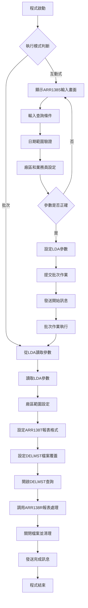
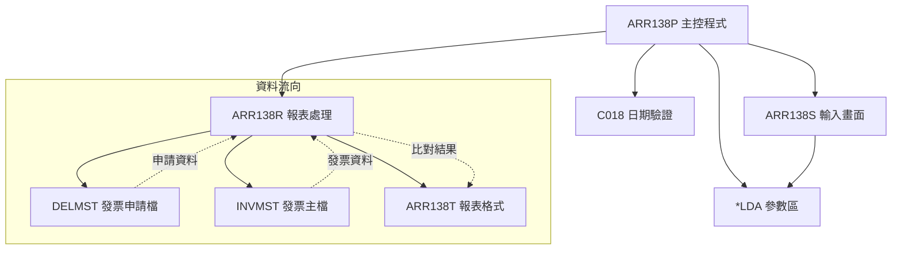
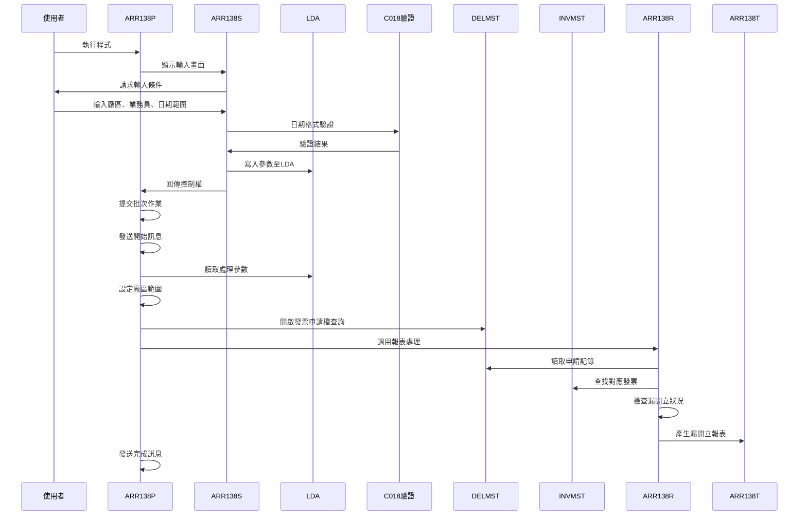

# ARR138P_K02 程式規格書

## 1. 基本資料

| 項目 | 內容 |
|------|------|
| **程式編號** | ARR138P |
| **程式名稱** | 銷貨發票漏開立報表 |
| **程式類型** | CLP |
| **廠區** | K02 |
| **系統名稱** | 應收帳款系統 |
| **子系統** | 發票開立管理 |
| **檔案位置** | 東鋼list/ARR138P_K02.txt |

## 2. 🎯 程式功能說明

### 主要功能描述
ARR138P是應收帳款系統的銷貨發票漏開立報表程式，專門用於檢查已申請但尚未開立發票的銷貨項目。程式從DELMST(發票開立申請檔)讀取指定條件的申請記錄，透過與INVMST(發票主檔)的比對，找出漏開立發票的項目，產生詳細的漏開立明細報表，協助管理層掌握發票開立狀況並及時處理漏開立的項目。

### 🎯 業務流程詳細說明

#### 完整業務流程圖


#### 業務流程關鍵階段說明

**1. 互動式參數輸入階段**
- 廠區範圍設定：空白(全部)、P(台灣)、U(雲林)、M(台中)、H(彰化)、K(高雄)、N(大陸廠區)
- 業務員條件：指定業務員代碼或空白(全部業務員)
- 日期範圍設定：申請開立發票的起始和結束日期

**2. 參數驗證階段**
- 起始日期檢查：必須輸入有效日期
- 日期格式驗證：透過C018程式驗證日期格式正確性
- 日期範圍檢查：確保起始日期不大於結束日期
- 日期自動補齊：起始日期有值而結束日期為空時自動補齊

**3. 範圍條件設定階段**
- 廠區範圍轉換：空白廠區轉換為' '到'9'的完整範圍
- 業務員範圍處理：指定業務員或全部業務員的條件設定
- DELMST查詢條件：結合廠區、日期、業務員的複合查詢

**4. 發票漏開立檢查階段**
- 讀取DELMST申請記錄：依據查詢條件讀取發票開立申請
- INVMST發票檢查：透過發票號碼查找是否已開立發票
- 業務員條件檢查：核對申請記錄的業務員是否符合條件
- 漏開立項目識別：找出申請但未開立發票的項目

## 3. 🎯 檔案架構與關聯圖

### 使用檔案清單

| 檔案名稱 | 檔案類型 | 用途說明 | 存取模式 |
|----------|----------|----------|----------|
| ARR138S | DSPF | 互動式參數輸入畫面 | I/O |
| ARR138R | RPG程式 | 報表處理程式 | CALL |
| ARR138T | PRTF | 銷貨發票漏開立報表格式 | OUTPUT |
| DELMST | 實體檔案 | 發票開立申請檔 | INPUT |
| INVMST | 實體檔案 | 發票主檔 | INPUT |
| C018 | RPG程式 | 日期格式驗證程式 | CALL |
| *LDA | 本地資料區 | 參數傳遞區域 | READ/WRITE |

### 🎯 檔案關聯詳細視覺化圖表



### 🎯 資料流向詳細說明

#### 發票漏開立檢查的資料流向


## 4. 🎯 檔案欄位規格說明

### 主要資料結構

#### LDA參數區域結構
| 位置 | 長度 | 欄位名稱 | 用途說明 |
|------|------|----------|----------|
| 501-501 | 1 | S#ARE1 | 廠區別 |
| 502-502 | 1 | S#SALE | 業務員代碼 |
| 511-518 | 8 | W#DAT1 | 起始申請日期 |
| 521-528 | 8 | W#DAT2 | 結束申請日期 |

#### 程式變數定義表
| 變數名稱 | 類型 | 長度 | 說明 |
|----------|------|------|------|
| &OUTQ | CHAR | 10 | 輸出佇列名稱 |
| &INT | CHAR | 1 | 作業類型識別 |
| &W#ERR | CHAR | 1 | 錯誤旗標 |
| &W#DAT1 | CHAR | 8 | 起始申請日期 |
| &W#DAT2 | CHAR | 8 | 結束申請日期 |
| &S#ARE1 | CHAR | 1 | 廠區別 |
| &AREAS | CHAR | 1 | 廠區範圍起始 |
| &AREAE | CHAR | 1 | 廠區範圍結束 |
| &S#SALE | CHAR | 1 | 業務員代碼 |

### 🔍 重點欄位切割技術詳解

#### 切割技術總覽與邏輯分析
ARR138P程式運用了多種AS/400的欄位切割技術，包括CLP程式的條件範圍設定、RPG程式的UDS結構和MAPFLD映射欄位切割。核心切割邏輯包括：

**1. CLP層級的範圍條件切割**
- CHGVAR廠區範圍設定：`&AREAS`到`&AREAE`的範圍轉換
- RTVDTAARA位置讀取：`DTAARA(*LDA (501 1)) RTNVAR(&S#ARE1)`
- CHGDTAARA位置寫入：`DTAARA(*LDA (501 1)) VALUE(&S#ARE1)`

**2. OPNQRYF層級的MAPFLD切割**
- DMDLNO的廠區代碼切割：`'%SST(DMDLNO 1 1)'`
- DMAPDT的日期格式切割：`DMAPDT *CHAR 8`
- 複合查詢條件的動態組合

**3. RPG UDS的LDA區域切割**
- 跨程式的參數傳遞結構
- 固定位置的資料區域對應
- 參數完整性的結構化管理

#### LDA參數區域結構視覺化
```
LDA參數區域 (50字元)：[....|A|S|.......|DAT1____|DAT2____|...]
位置:                  501 502       511-518   521-528
                        ↓   ↓         ↓         ↓
廠區別:                [A]                                1位廠區代碼
業務員:                    [S]                            1位業務員代碼
起始日期:                             [DAT1____]          8位日期格式
結束日期:                                       [DAT2____] 8位日期格式
```

#### LDA切割的UDS結構實現
```
RPG UDS (User Defined Structure) 定義：
I           UDS
I                                      501 501 T#ARE1    (廠區別)
I                                      502 502 T#SALE    (業務員代碼)  
I                                      511 5180T#DAT1    (起始申請日期)
I                                      521 5280T#DAT2    (結束申請日期)

UDS切割邏輯詳解：
*LDA區域總長度：1024字元，其中：
位置501:   廠區別     → T#ARE1 (1字元)
位置502:   業務員代碼 → T#SALE (1字元)
位置511-518: 起始日期 → T#DAT1 (8字元)
位置521-528: 結束日期 → T#DAT2 (8字元)

UDS語法說明：
- 501 501 T#ARE1：從LDA位置501讀取1個字元定義為T#ARE1
- 502 502 T#SALE：從LDA位置502讀取1個字元定義為T#SALE
- 511 5180T#DAT1：從LDA位置511開始讀取8個字元定義為T#DAT1
- 521 5280T#DAT2：從LDA位置521開始讀取8個字元定義為T#DAT2

實際切割案例：
*LDA內容 = "...P2...20240301...20240331..."
  ↓
T#ARE1 = LDA[501] = "P"        (廠區別)
T#SALE = LDA[502] = "2"        (業務員代碼)
T#DAT1 = LDA[511-518] = "20240301" (起始日期)
T#DAT2 = LDA[521-528] = "20240331" (結束日期)
```

#### DELMST檔案欄位切割技術詳細分析

##### OPNQRYF的MAPFLD切割視覺化
```
DMDLNO (6字元)：[AXXXXX] → DLNO [A] (廠區代碼)
                ↓               ↓
原始開立號碼:   [P12345]       [P]
切割邏輯:      6字元號碼       第1位廠區

DMAPDT (8字元)：[YYYYMMDD] → DATE [YYYYMMDD] (*CHAR 8)
                ↓                 ↓
原始申請日期:   [20240301]       [20240301]
切割邏輯:      數值格式          字元格式轉換

MAPFLD切割定義：
MAPFLD((DLNO   '%SST(DMDLNO 1 1)')     // 廠區代碼切割
       (DATE  DMAPDT *CHAR 8))         // 日期格式轉換
```

##### MAPFLD切割邏輯程式碼實現
```
CLP OPNQRYF語法：
OPNQRYF    FILE(DELMST) QRYSLT(' +
           (DMFLAG *NE "D" ) *AND +
           (DLNO   *GE "' || &AREAS || '") *AND +
           (DLNO   *LE "' || &AREAE || '") *AND +
           (DATE   *GE "' || &W#DAT1 || '") *AND +
           (DATE   *LE "' || &W#DAT2 || '")')    +
           KEYFLD((DMCUN1) (DMORN1) (DMAREA) (DMINDT) +
                  (DMINNO)) +
           MAPFLD((DLNO   '%SST(DMDLNO 1 1)') +
                  (DATE  DMAPDT *CHAR 8))

切割處理邏輯：
1. DLNO = %SST(DMDLNO 1 1)  // 從開立號碼提取第1位廠區代碼
2. DATE = DMAPDT *CHAR 8    // 將數值日期轉換為字元格式
3. 使用切割後的欄位作為查詢條件
4. 支援廠區範圍和日期範圍的精確篩選
```

### 🎯 欄位挪用詳細分析

#### 廠區範圍處理的挪用機制

##### 廠區條件轉換挪用處理
```
廠區範圍轉換挪用：
IF S#ARE1 = ' ' THEN        // 空白廠區
   AREAS = ' ', AREAE = '9'  // 全範圍
ELSE                         // 指定廠區
   AREAS = S#ARE1, AREAE = S#ARE1  // 單一廠區

廠區轉換案例：
輸入廠區: ' '(空白)     指定廠區: 'P'
     ↓                      ↓
AREAS = ' '              AREAS = 'P'
AREAE = '9'              AREAE = 'P'

查詢條件：
空白廠區: DLNO *GE ' ' *AND DLNO *LE '9'  (全部廠區)
指定廠區: DLNO *GE 'P' *AND DLNO *LE 'P'  (僅P廠區)

挪用原因：廠區欄位只有1位，但需要支援範圍查詢
業務邏輯：單一輸入值轉換為查詢範圍條件
技術實現：透過條件判斷設定起始和結束範圍值
```

#### 日期範圍處理的挪用機制

##### 日期自動補齊挪用處理
```
日期補齊條件組合：
IF S#DAT1≠0 AND S#DAT2=0 THEN
   S#DAT2 = S#DAT1

日期補齊案例：
輸入起始日期: 20240301    輸入結束日期: 0
                ↓                      ↓
自動補齊後:   20240301    自動設定:    20240301

挪用原因：使用者輸入便利性，單日查詢時無需重複輸入相同日期
業務邏輯：支援單日查詢的便利設計
技術實現：透過條件判斷自動補齊結束日期
```

#### DMDLNO的複合欄位挪用

##### DMDLNO的廠區代碼切割挪用
```
DMDLNO結構(6字元)：[AXXXXX]
                  ↓
切割結果：
DLNO(1字元) = DMDLNO[1] = [A]

開立號碼結構細分：
位置1:     廠區代碼 = DMDLNO[1]   = [A] (廠區識別)
位置2-6:   序號部分 = DMDLNO[2-6] = [XXXXX] (開立序號)

切割邏輯程式碼實現：
MAPFLD定義：
MAPFLD((DLNO   '%SST(DMDLNO 1 1)'))

查詢使用：
QRYSLT('(DLNO *GE "' || &AREAS || '") *AND +
        (DLNO *LE "' || &AREAE || '")')

挪用分析：
原始欄位 → 切割用途     → 業務意義        → 技術實現
DMDLNO   → DLNO(第1位)  → 廠區範圍篩選    → %SST函數切割
DMDLNO   → 完整號碼     → 開立序號識別    → 直接使用原值

挪用原因：開立號碼包含廠區和序號的複合資訊
業務邏輯：透過廠區代碼實現多廠區的分別管理
技術實現：透過MAPFLD的%SST函數進行位置切割
程式邏輯：範圍查詢支援廠區別的精確篩選
```

#### 業務員條件的挪用機制

##### 業務員篩選挪用處理
```
業務員條件處理挪用：
IF T#SALE ≠ *BLANK THEN
   W#SALE = T#SALE
   IF INRVID ≠ W#SALE THEN GOTO END100

業務員篩選案例：
輸入業務員: '2'          輸入業務員: ' '(空白)
     ↓                        ↓
篩選條件: INRVID = '2'    篩選條件: 無篩選(全部)

RPG處理邏輯：
C           T#SALE    IFNE *BLANK     // 有指定業務員
C                     MOVELT#SALE    W#SALE
C           DMINNO    CHAININVMST               55
C  N55      INRVID    IFNE W#SALE     // 業務員不符
C                     GOTO END100     // 跳過此筆
C                     ENDIF
C                     ENDIF

挪用原因：業務員篩選需要與發票檔案的業務員欄位比對
業務邏輯：支援指定業務員和全部業務員的彈性查詢
技術實現：RPG條件判斷和CHAIN檔案查找
程式邏輯：透過INVMST檔案取得業務員資訊進行比對
```

#### DMAPDT的日期格式挪用

##### 日期格式轉換挪用處理
```
DMAPDT日期格式切割：
DMAPDT (8S 0)：[YYYYMMDD] → DATE (*CHAR 8) [YYYYMMDD]
               ↓                           ↓
原始數值格式: [20240301]  轉換字元格式:  ["20240301"]

MAPFLD轉換定義：
MAPFLD((DATE  DMAPDT *CHAR 8))

查詢條件使用：
QRYSLT('(DATE *GE "' || &W#DAT1 || '") *AND +
        (DATE *LE "' || &W#DAT2 || '")')

格式轉換案例：
原始DMAPDT: 20240301 (數值型態)
            ↓
轉換DATE:  "20240301" (字元型態)
            ↓
查詢條件:  DATE *GE "20240301" *AND DATE *LE "20240331"

挪用原因：數值日期需要轉換為字元格式進行範圍比較
業務邏輯：支援日期範圍查詢的字串比較邏輯
技術實現：透過MAPFLD的*CHAR 8進行型態轉換
程式邏輯：字元格式日期支援範圍查詢的字典序比較
```

#### 發票漏開立檢查的挪用機制

##### 發票檢查邏輯挪用處理
```
發票檢查處理挪用：
DMINNO → CHAIN INVMST → 檢查INRVID

檢查邏輯案例：
DELMST申請記錄: DMINNO="INV0001234"
                ↓
CHAIN INVMST:  用DMINNO查找對應發票
                ↓
檢查結果:      *IN55='0'(找到) or *IN55='1'(未找到)
                ↓
業務員比對:    INRVID與T#SALE比較

RPG處理邏輯：
C           DMINNO    CHAININVMST               55
C  N55      INRVID    IFNE W#SALE     // 找到發票且業務員符合
C                     GOTO END100     // 已開立發票，跳過
C                     ENDIF

發票狀態判斷：
*IN55='0': 發票已開立，不列入漏開立報表
*IN55='1': 發票未開立，列入漏開立報表

挪用原因：申請檔案的發票號碼用來查找實際發票開立狀況
業務邏輯：透過檔案比對確認發票開立狀態
技術實現：CHAIN操作和指示器檢查
程式邏輯：只有未開立且符合業務員條件的項目才列入報表
```

### 重要變數定義表

| 變數名稱 | 類型 | 長度 | 說明 | 切割來源 | 挪用邏輯 |
|----------|------|------|------|----------|----------|
| &S#ARE1 | CHAR | 1 | 廠區別 | 輸入欄位 | 範圍條件轉換 |
| &AREAS | CHAR | 1 | 廠區範圍起始 | S#ARE1挪用 | 空白轉' ' |
| &AREAE | CHAR | 1 | 廠區範圍結束 | S#ARE1挪用 | 空白轉'9' |
| &S#SALE | CHAR | 1 | 業務員代碼 | 輸入欄位 | 直接使用 |
| &W#DAT1 | CHAR | 8 | 起始申請日期 | S#DAT1 | 日期格式轉換 |
| &W#DAT2 | CHAR | 8 | 結束申請日期 | S#DAT2 | 自動補齊邏輯 |
| T#ARE1 | CHAR | 1 | UDS廠區別 | LDA(501) | UDS位置切割 |
| T#SALE | CHAR | 1 | UDS業務員 | LDA(502) | UDS位置切割 |

## 5. 🎯 輸出/入螢幕布局

### 互動式輸入畫面布局
ARR138S提供的參數輸入畫面：

```
+----------------------------------------------------------+
|          ARR138S        東鋼企業股份有限公司             |
+----------------------------------------------------------+
|      ****銷貨發票漏開立報表****                         |
+----------------------------------------------------------+
|                                                          |
|      廠區別：[_] (P=台灣U=雲林 M=台中                    |
|                   H=彰化K=高雄                           |
|                   N=大陸廠區 空白=全部)                  |
|                                                          |
|      業務員代碼：[_] (空白=全部)                         |
|                                                          |
|      申請日期範圍：[________] ~ [________]               |
|      (限申請核准當天)                                    |
|                                                          |
|                                                          |
|                                                          |
|                                                          |
|                                                          |
| [錯誤訊息顯示區]                                          |
|                                                          |
| PF03:結束        PF12:回到上層                           |
+----------------------------------------------------------+
```

### 🎯 畫面欄位詳細說明
| 欄位名稱 | 屬性 | 長度 | 輸入格式 | 驗證規則 |
|----------|------|------|----------|----------|
| 廠區別 | 選填 | 1 | 英文字母 | 限定P、U、M、H、K、N或空白 |
| 業務員代碼 | 選填 | 1 | 英數字元 | 可為空白表示全部業務員 |
| 起始申請日期 | 必填 | 8 | YYYY/MM/DD | C018程式驗證日期格式 |
| 結束申請日期 | 選填 | 8 | YYYY/MM/DD | 為空時自動設為起始日期 |

### 功能鍵詳細定義
| 功能鍵 | 功能說明 | 處理邏輯 |
|--------|----------|----------|
| F3 | 結束 | 設定IN03='1'，結束程式執行 |
| F12 | 回到上層 | 設定IN12='1'，回到主選單 |
| Enter | 處理 | 執行輸入驗證，通過後進入批次處理 |

### 報表輸出格式
ARR138T報表的版面配置：

```
+======================================================================================+
| 程式編號: ARR138T           東鋼企業股份有限公司           列印日期: YYYY/MM/DD      |
| 列印帳號: XXXXXXXXXX        銷貨發票漏開立報表             列印時間: HH:MM:SS       |
|                                                           程式頁數: XXX            |
+======================================================================================+
| 廠區別: X XXXXXX  業務員代碼: X XXXXXX  申請日期: YYYY/MM/DD ~ YYYY/MM/DD        |
+======================================================================================+
| 客戶編號  客戶姓名     訂單編號  發票廠區 發票申請號  發票申請日  發票號碼    發票金額 |
+======================================================================================+
| XXXXXX   XXXXXXXXXX   XXXXXX    X       XXXXXX     YYYY/MM/DD  XXXXXXXXXX  XXX,XXX,XXX |
| XXXXXX   XXXXXXXXXX   XXXXXX    X       XXXXXX     YYYY/MM/DD  XXXXXXXXXX  XXX,XXX,XXX |
| XXXXXX   XXXXXXXXXX   XXXXXX    X       XXXXXX     YYYY/MM/DD  XXXXXXXXXX  XXX,XXX,XXX |
+--------------------------------------------------------------------------------------+
| 小計：                                                                  XXX,XXX,XXX |
+======================================================================================+
| 總  計：                                                                XXX,XXX,XXX |
+======================================================================================+
| 製表:            複核:            經理:            總經理:                          |
+======================================================================================+
```

## 6. 🎯 處理流程程序說明

### 🎯 主程序邏輯深度分析

#### 程式執行流程圖
```mermaid
flowchart TD
    A[程式開始 PGM] --> B[宣告變數與檔案]
    B --> C[RTVJOBA 取得作業資訊]
    C --> D{INT='0'?}
    
    D -->|否 互動式| E[RTVDTAARA 取得公司名稱、裝置名稱]
    E --> F[START: SNDRCVF 顯示輸入畫面]
    F --> G[重置指示器與錯誤訊息]
    G --> H{IN03 OR IN12?}
    H -->|是| I[RETURN 結束]
    H -->|否| J[檢查起始日期]
    
    J --> K{S#DAT1=0?}
    K -->|是| L[設定錯誤訊息與IN30]
    K -->|否| M[C018日期格式驗證]
    L --> F
    
    M --> N{日期格式錯誤?}
    N -->|是| O[設定日期錯誤訊息與IN30]
    N -->|否| P[檢查結束日期]
    O --> F
    
    P --> Q{S#DAT2≠0?}
    Q -->|是| R[C018日期格式驗證]
    Q -->|否| S[日期自動補齊]
    R --> T{日期格式錯誤?}
    T -->|是| U[設定日期錯誤訊息與IN31]
    T -->|否| S
    U --> F
    
    S --> V[CHGVAR S#DAT2=S#DAT1 (if needed)]
    V --> W[檢查日期範圍]
    W --> X{S#DAT1>S#DAT2?}
    X -->|是| Y[設定範圍錯誤訊息與IN30,IN31]
    X -->|否| Z[設定LDA參數]
    Y --> F
    
    Z --> AA[CHGDTAARA 設定LDA參數]
    AA --> BB[SBMJOB 提交批次作業]
    BB --> CC[SNDBRKMSG 發送開始訊息]
    CC --> I
    
    D -->|是 批次| DD[BATCH: RTVDTAARA 讀取參數]
    DD --> EE[廠區範圍設定]
    EE --> FF{S#ARE1=' '?}
    FF -->|是| GG[AREAS=' ', AREAE='9']
    FF -->|否| HH[AREAS=S#ARE1, AREAE=S#ARE1]
    
    GG --> II[OVRPRTF 設定報表格式]
    HH --> II
    II --> JJ[OVRDBF 設定DELMST檔案覆蓋]
    JJ --> KK[OPNQRYF 開啟DELMST查詢]
    KK --> LL[CALL ARR138R]
    LL --> MM[CLOF & DLTOVR]
    MM --> NN[SNDBRKMSG 發送完成訊息]
    NN --> OO[ENDPGM 程式結束]
```

#### 🎯 詳細處理步驟逐一分析

**步驟1：程式初始化階段**
- 宣告7個工作變數和ARR138S顯示檔案
- 透過RTVJOBA取得輸出佇列和作業類型資訊
- 從LDA讀取公司名稱和裝置名稱

**步驟2：互動式處理流程**
- 透過SNDRCVF顯示ARR138S參數輸入畫面
- 重置所有錯誤指示器(IN30-IN31)和錯誤訊息
- 支援廠區別、業務員、日期範圍的靈活設定

**步驟3：參數驗證處理**
- 起始日期檢查：必須輸入有效日期，不可為0
- 日期格式驗證：透過C018程式驗證起始和結束日期格式
- 日期自動補齊：起始日期有值而結束日期為0時自動補齊
- 日期範圍檢查：起始日期不可大於結束日期

**步驟4：LDA參數設定**
- 將驗證通過的參數寫入LDA區域
- 位置501：廠區別
- 位置502：業務員代碼
- 位置511-518：起始申請日期
- 位置521-528：結束申請日期

**步驟5：批次作業提交**
- 透過SBMJOB提交批次作業到ARJOBD作業說明
- 發送開始處理訊息給使用者

**步驟6：批次處理階段-廠區範圍設定**
- 空白廠區：AREAS=' ', AREAE='9'(全部廠區)
- 指定廠區：AREAS=廠區代碼, AREAE=廠區代碼(單一廠區)

**步驟7：檔案查詢階段**
- 設定ARR138T報表格式：120字元寬度、15CPI、2份副本、HOLD輸出
- 設定DELMST檔案覆蓋為共享模式
- 開啟DELMST查詢：廠區範圍、日期範圍、非刪除記錄
- 使用MAPFLD切割DMDLNO取得廠區代碼、轉換DMAPDT為字元日期

**步驟8：報表產生階段**
- 調用ARR138R程式產生發票漏開立報表
- 清除所有檔案覆蓋設定

### 🎯 子程序邏輯分析

**ARR138R子程序功能（報表產生）**
- 從DELMST讀取發票申請資料，依客戶編號分組處理
- 透過DMINNO查找INVMST檔案確認發票開立狀況
- 檢查業務員條件：比對INVMST的INRVID與輸入的業務員代碼
- 只有未開立發票且符合業務員條件的項目才列入報表
- 產生客戶別、項目別的漏開立發票統計報表

### 🎯 特殊邏輯處理

**日期格式驗證邏輯**
- 使用C018程式進行日期格式和有效性驗證
- 支援起始和結束日期的獨立驗證
- 錯誤時精確定位到對應欄位(IN30/IN31)

**廠區範圍轉換邏輯**
- 空白廠區轉換為' '到'9'的完整範圍查詢
- 指定廠區轉換為單一廠區的精確查詢
- 支援多廠區管理的靈活需求

**發票漏開立檢查邏輯**
- 透過CHAIN操作查找INVMST檔案
- 使用指示器55檢查發票是否存在
- 業務員條件過濾：只處理符合條件的業務員記錄

**MAPFLD欄位映射邏輯**
- DMDLNO的廠區代碼切割：%SST(DMDLNO 1 1)
- DMAPDT的日期格式轉換：DMAPDT *CHAR 8
- 支援動態查詢條件的欄位映射

**客戶分組報表邏輯**
- 依據客戶編號(DMCUN1)進行L1分組處理
- 每個客戶輸出小計金額
- 最終輸出總計金額和製表簽核欄位

**無資料處理邏輯**
- 當查詢無符合條件資料時顯示"無符合資料!!!"
- 確保報表在無資料情況下仍能正常輸出
- 提供清楚的無資料狀態提示

## 7. 🎯 數據操作與轉換分析

### 檔案操作詳解

**DELMST檔案存取邏輯**
- READ操作：透過OPNQRYF建立的查詢檢視讀取發票申請資料
- 查詢條件：廠區範圍、日期範圍、非刪除記錄
- 檔案鎖定：使用SHARE(*YES)允許多重存取
- 排序鍵值：客戶編號、訂單編號、廠區、申請日期、發票號碼

**INVMST檔案存取邏輯**
- CHAIN操作：透過發票號碼(DMINNO)查找對應的發票記錄
- 存取模式：IF E K DISK（隨機查找模式）
- 業務員檢查：取得INRVID進行業務員條件比對
- 指示器使用：55指示器檢查發票是否存在

### 數據轉換邏輯

**日期格式轉換**
- 輸入格式：YYYY/MM/DD (8Y 0格式)
- 內部格式：YYYYMMDD (8S 0數值格式)
- 查詢格式："YYYYMMDD" (*CHAR 8字元格式)
- C018驗證：確保日期格式正確性和有效性

**廠區代碼轉換**
- 原始代碼：DMDLNO第1位的廠區代碼
- 範圍轉換：單一廠區轉換為查詢範圍條件
- 顯示處理：廠區代碼對應到中文名稱顯示
- 查詢處理：支援廠區範圍的動態篩選

**業務員代碼處理**
- 輸入處理：空白表示全部業務員
- 比對處理：與INVMST的INRVID欄位比對
- 篩選邏輯：只處理符合業務員條件的記錄
- 顯示處理：業務員代碼和名稱的對應顯示

### 計算邏輯分析

**廠區範圍計算**
- 空白條件：AREAS=' ', AREAE='9'
- 指定條件：AREAS=廠區代碼, AREAE=廠區代碼
- 範圍邏輯：DLNO *GE AREAS *AND DLNO *LE AREAE
- 涵蓋範圍：指定廠區或全部廠區的靈活篩選

**金額累計計算**
- 客戶小計：依客戶編號分組累計T#AMT1
- 總計金額：所有客戶的總累計T#AMT2
- 格式處理：使用EDTCDE(J)進行千分位顯示
- 異常處理：無資料時顯示適當訊息

**發票狀態計算**
- 發票檢查：透過CHAIN操作和*IN55指示器
- 狀態判斷：55='0'(已開立)、55='1'(未開立)
- 條件篩選：只有未開立的項目才列入報表
- 業務邏輯：結合業務員條件的複合篩選

### 檢核機制詳解

**輸入資料檢核**
- 日期有效性：起始日期必須輸入，格式必須正確
- 日期範圍：確保起始日期不大於結束日期
- 廠區有效性：限定特定廠區代碼或空白
- 自動補齊：結束日期為0時的自動處理

**檔案存取檢核**
- 檔案存在性：使用指示器檢查DELMST和INVMST檔案讀取狀態
- 資料完整性：確保申請檔案和發票檔案的資料結構正確性
- 範圍檢查：驗證查詢條件的合理性
- 權限檢查：確保檔案覆蓋和讀取權限正確

**資料邏輯檢核**
- 發票邏輯：檢查申請記錄是否已開立對應發票
- 業務員邏輯：驗證業務員代碼的一致性
- 廠區一致：確保廠區代碼的正確性
- 日期邏輯：驗證申請日期的時間順序正確性

**報表輸出檢核**
- 資料存在：無符合條件資料時的適當處理
- 金額正確性：確保累計金額的計算正確性
- 格式一致：報表格式和欄位對齊的正確性
- 分組邏輯：客戶分組和小計的邏輯正確性

## 8. 🎯 錯誤處理程序說明

### 🎯 詳細錯誤代碼清冊

| 錯誤代碼 | 錯誤訊息 | 原因說明 | 處理方式 | 預防措施 |
|----------|----------|----------|----------|----------|
| **USER001** | 查詢-起始日期不可空白! | 起始日期為必填欄位但輸入為空 | 1. 顯示錯誤訊息<br>2. 游標定位至起始日期欄位<br>3. 設定IN30指示器 | 提供日期輸入格式說明 |
| **USER002** | 查詢-輸入日期格式錯誤! | 日期格式不符YYYY/MM/DD格式 | 1. 顯示錯誤訊息<br>2. 設定IN30或IN31指示器<br>3. 要求重新輸入日期 | 增加日期格式檢查和提示 |
| **USER003** | 查詢-日期範圍輸入錯誤! | 起始日期大於結束日期 | 1. 顯示錯誤訊息<br>2. 設定IN30和IN31指示器<br>3. 要求重新輸入範圍 | 增加日期範圍邏輯檢查 |
| **FILE001** | DELMST檔案開啟失敗 | 發票申請檔無法開啟或損壞 | 1. 記錄錯誤日誌<br>2. 通知系統管理員<br>3. 終止處理程序 | 定期檢查檔案完整性 |
| **FILE002** | INVMST檔案開啟失敗 | 發票主檔無法開啟或損壞 | 1. 記錄錯誤日誌<br>2. 通知系統管理員<br>3. 終止處理程序 | 定期檢查檔案完整性 |
| **FILE003** | DELMST檔案無資料 | 指定條件查詢無符合資料 | 1. 顯示"無符合資料!!!"<br>2. 產生空白報表<br>3. 建議檢查查詢條件 | 提供查詢條件說明 |
| **DATA001** | 申請資料異常 | DELMST檔案資料格式錯誤 | 1. 記錄異常資料<br>2. 跳過異常記錄<br>3. 繼續處理其他資料 | 加強資料驗證機制 |
| **DATA002** | 發票資料異常 | INVMST檔案資料格式錯誤 | 1. 記錄異常發票<br>2. 標記為未開立<br>3. 繼續報表處理 | 建立發票資料檢查 |
| **DATA003** | 業務員代碼異常 | 業務員代碼不存在或格式錯誤 | 1. 使用原始代碼<br>2. 記錄異常代碼<br>3. 繼續業務員處理 | 建立業務員代碼檢查 |
| **CALC001** | 日期自動補齊失敗 | 日期補齊邏輯異常 | 1. 使用原始日期<br>2. 記錄補齊失敗<br>3. 繼續處理流程 | 加強日期邏輯檢查 |
| **CALC002** | 廠區範圍設定失敗 | 廠區範圍轉換邏輯異常 | 1. 使用預設範圍<br>2. 記錄轉換失敗<br>3. 繼續查詢處理 | 檢查廠區轉換邏輯 |
| **CALC003** | 金額累計異常 | 金額累計計算邏輯錯誤 | 1. 重新計算金額<br>2. 記錄計算錯誤<br>3. 繼續報表處理 | 驗證金額計算邏輯 |
| **SYS001** | 批次作業提交失敗 | SBMJOB執行異常 | 1. 改為直接執行<br>2. 記錄提交錯誤<br>3. 繼續批次處理 | 檢查作業佇列狀態 |
| **SYS002** | 訊息發送失敗 | SNDBRKMSG執行失敗 | 1. 忽略訊息錯誤<br>2. 繼續程式執行<br>3. 記錄通信異常 | 檢查訊息佇列設定 |
| **RPT001** | 報表輸出異常 | ARR138T報表產生失敗 | 1. 檢查報表格式<br>2. 重新產生報表<br>3. 使用簡化格式 | 確保報表檔案正確性 |
| **RPT002** | 報表分組異常 | 客戶分組處理失敗 | 1. 使用連續輸出<br>2. 記錄分組錯誤<br>3. 繼續報表處理 | 檢查分組邏輯設定 |

### 🎯 系統異常處理邏輯

**檔案操作失敗處理**
- OPNQRYF操作失敗時自動執行CLOF清理資源
- DELMST檔案無法開啟時記錄錯誤並終止處理
- INVMST檔案無法開啟時記錄錯誤並終止處理
- 查詢無資料時產生無資料報表並提示使用者
- 所有檔案操作完成後確實執行DLTOVR

**資料處理異常控制**
- 申請資料異常時跳過該筆記錄繼續處理
- 發票資料異常時標記為未開立狀態
- 業務員代碼異常時使用原始代碼繼續處理
- 確保部分資料異常不影響整體報表生成

**使用者輸入錯誤處理**
- 所有輸入錯誤都回到輸入畫面重新輸入
- 錯誤指示器精確定位錯誤欄位(IN30/IN31)
- 提供詳細的錯誤說明和修正建議
- 保留正確輸入的資料，僅要求修正錯誤部分

**程式調用失敗處理**
- C018日期驗證失敗時提供清楚的錯誤訊息
- ARR138R調用失敗時確保檔案正確關閉
- 批次作業提交失敗時改為直接執行
- 報表處理失敗時提供簡化格式輸出
- 所有程式調用都包含適當的錯誤恢復機制

## 9. 🎯 備註

### 🎯 特殊注意事項

**發票漏開立檢查的業務意義**
程式的核心功能是檢查已申請但尚未開立發票的銷貨項目。DELMST記錄發票開立申請，INVMST記錄實際開立的發票，透過兩檔案的比對找出漏開立的項目。

**日期驗證的嚴格要求**
程式使用C018專用日期驗證程式，確保輸入日期的格式正確性和有效性。支援起始和結束日期的獨立驗證，錯誤時精確定位到對應欄位。

**廠區範圍的靈活設計**
支援空白(全部廠區)和指定廠區的靈活查詢。空白廠區轉換為' '到'9'的完整範圍，指定廠區轉換為單一廠區查詢，滿足不同層級管理的需求。

**MAPFLD欄位映射技術**
透過OPNQRYF的MAPFLD功能，將DMDLNO的第1位切割為廠區代碼(DLNO)，將DMAPDT數值日期轉換為字元格式(DATE)，支援動態查詢條件。

**業務員條件的精確控制**
程式支援指定業務員和全部業務員的查詢。透過CHAIN操作查找INVMST檔案，比對INRVID欄位確認業務員條件，確保報表資料的準確性。

**客戶分組的報表設計**
報表依據客戶編號(DMCUN1)進行分組，每個客戶顯示漏開立項目的明細和小計，最終提供總計金額，便於管理層掌握整體狀況。

**無資料狀態的友善處理**
當查詢條件無符合資料時，程式仍產生報表並顯示"無符合資料!!!"訊息，避免使用者誤解為程式執行失敗。

**檔案覆蓋的安全設計**
使用SHARE(*YES)設定允許多重存取，避免檔案鎖定問題。所有檔案操作完成後確實執行DLTOVR清理覆蓋設定。

**報表格式的專業設計**
120字元寬度、15CPI字型、雙份副本的專業報表格式。包含完整的表頭資訊、明細欄位、小計總計、製表簽核欄位，符合正式報表的要求。

**錯誤訊息的精確定位**
使用IN30和IN31指示器分別控制起始和結束日期的錯誤顯示，讓使用者能精確知道哪個欄位需要修正。

**LDA參數傳遞的結構化設計**
使用固定位置的LDA區域傳遞參數，確保主程式和子程式間的參數傳遞準確性。UDS結構提供清楚的參數對應關係。

**批次處理的完整訊息機制**
提供開始和完成處理的訊息通知，讓使用者了解處理進度。訊息發送到使用者的個人訊息佇列，確保訊息能正確接收。 