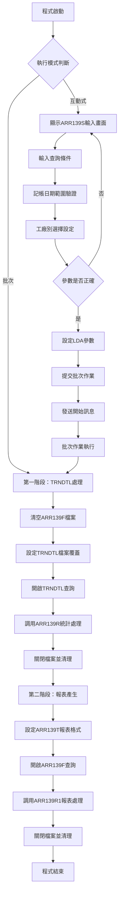
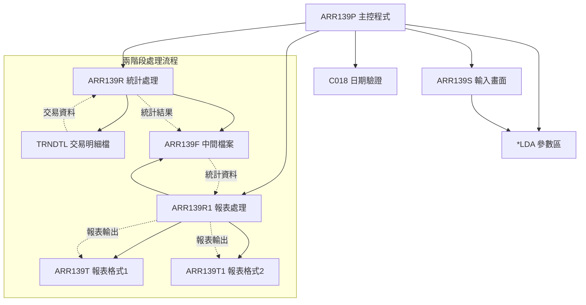
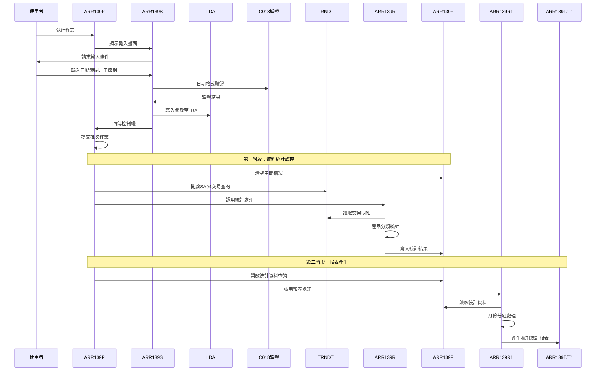

# ARR139P_U01 程式規格書

## 1. 基本資料

| 項目 | 內容 |
|------|------|
| **程式編號** | ARR139P |
| **程式名稱** | 稅制統計 |
| **程式類型** | CLP |
| **廠區** | U01 |
| **系統名稱** | 應收帳款系統 |
| **子系統** | 稅務統計分析 |
| **檔案位置** | 東鋼list/ARR139P_U01.txt |

## 2. 🎯 程式功能說明

### 主要功能描述
ARR139P是應收帳款系統的稅制統計程式，專門用於分析和統計各種產品的稅務相關交易資料。程式採用兩階段處理模式：第一階段從TRNDTL(交易明細檔)中篩選SA04交易類型的資料，按產品代碼進行分類統計並產生中間檔案ARR139F；第二階段從ARR139F讀取資料，依月份分組產生詳細的稅制統計報表，支援多種產品代碼格式顯示，協助管理層進行稅務分析和合規管理。

### 🎯 業務流程詳細說明

#### 完整業務流程圖


#### 業務流程關鍵階段說明

**1. 互動式參數輸入階段**
- 記帳日期範圍設定：必須輸入起始日期，結束日期可自動補齊
- 工廠別選擇：U(雲林)、Q(福建)、V(保稅)、R(鋼鐵會員)、X(雲嘉)、D(東興)、O(可樂)、空白(全部)
- 日期格式驗證：透過C018程式確保日期格式正確性

**2. 第一階段資料統計處理**
- 清空中間檔案：執行CLRPFM ARR139F清除舊資料
- TRNDTL查詢條件：TXCODE='SA04' AND TXACNT='2' AND 記帳日期範圍
- 產品分類統計：依據TXPDNM將數量累計到對應的產品統計欄位
- 工廠別篩選：依據交易號碼的第1位進行工廠別過濾

**3. 第二階段報表產生處理**
- 設定雙報表格式：ARR139T和ARR139T1支援不同的顯示格式
- 月份分組處理：依據F9DATE進行月份分組和小計統計
- 產品代碼顯示：支援新舊產品代碼對照顯示(21A↔2150等)
- 報表格式控制：透過指示器79控制顯示新舊產品代碼格式

**4. 稅制統計分析重點**
- SA04交易識別：專門處理稅務相關的交易類型
- 產品代碼對照：支援新舊產品代碼的對照分析
- 月份趨勢分析：按月份統計各產品的稅務交易變化
- 工廠別比較：多工廠的稅務統計比較分析

## 3. 🎯 檔案架構與關聯圖

### 使用檔案清單

| 檔案名稱 | 檔案類型 | 用途說明 | 存取模式 |
|----------|----------|----------|----------|
| ARR139S | DSPF | 互動式參數輸入畫面 | I/O |
| ARR139R | RPG程式 | 第一階段統計處理程式 | CALL |
| ARR139R1 | RPG程式 | 第二階段報表產生程式 | CALL |
| ARR139T | PRTF | 稅制統計報表格式1 | OUTPUT |
| ARR139T1 | PRTF | 稅制統計報表格式2 | OUTPUT |
| ARR139F | 實體檔案 | 統計資料中間檔案 | I/O |
| TRNDTL | 實體檔案 | 交易明細檔 | INPUT |
| C018 | RPG程式 | 日期格式驗證程式 | CALL |
| *LDA | 本地資料區 | 參數傳遞區域 | READ/WRITE |

### 🎯 檔案關聯詳細視覺化圖表



### 🎯 資料流向詳細說明

#### 稅制統計的兩階段資料流向


## 4. 🎯 檔案欄位規格說明

### 主要資料結構

#### LDA參數區域結構
| 位置 | 長度 | 欄位名稱 | 用途說明 |
|------|------|----------|----------|
| 1-8 | 8 | W#DAT1 | 起始記帳日期 |
| 11-18 | 8 | W#DAT2 | 結束記帳日期 |
| 21-21 | 1 | W#FACT | 工廠別 |

#### 程式變數定義表
| 變數名稱 | 類型 | 長度 | 說明 |
|----------|------|------|------|
| &DSPID | CHAR | 10 | 作業ID |
| &INT | CHAR | 1 | 作業類型識別 |
| &OUTQ | CHAR | 10 | 輸出佇列名稱 |
| &W#ERR | CHAR | 1 | 錯誤旗標 |
| &W#DAT1 | CHAR | 8 | 起始記帳日期 |
| &W#DAT2 | CHAR | 8 | 結束記帳日期 |
| &W#FACT | CHAR | 1 | 工廠別 |

### 🔍 重點欄位切割技術詳解

#### 切割技術總覽與邏輯分析
ARR139P程式運用了多種AS/400的欄位切割技術，包括CLP程式的LDA參數設定、RPG程式的UDS結構、DS欄位切割、MAPFLD映射和產品代碼分類處理。核心切割邏輯包括：

**1. CLP層級的LDA參數切割**
- CHGDTAARA固定位置寫入：`DTAARA(*LDA (1 8)) VALUE(&W#DAT1)`
- RTVDTAARA固定位置讀取：`DTAARA(*LDA (1 8)) RTNVAR(&W#DAT1)`
- 參數區域結構化管理：日期範圍和工廠別的分離儲存

**2. OPNQRYF層級的MAPFLD切割**
- TXACDT的日期格式切割：`MAPFLD((ACDT TXACDT *CHAR 8))`
- 交易條件的複合查詢：TXCODE='SA04' AND TXACNT='2'
- 日期範圍的動態條件組合

**3. RPG DS的欄位切割**
- TXNO的工廠別切割：`DS 1 8 TXNO, 1 1 D#FACT`
- F9DATE的年月切割：`DS 1 8 F9DATE, 1 6 D#YYMM`
- 複合欄位的位置定義切割

**4. RPG UDS的LDA參數切割**
- 跨程式的參數傳遞結構
- 工廠別篩選的UDS實現
- 固定位置的資料區域對應

#### LDA參數區域結構視覺化
```
LDA參數區域 (21字元)：[DAT1____|..|DAT2____|F]
位置:                  1-8     11-18   21
                        ↓        ↓      ↓
起始日期:              [DAT1____]              8位日期格式
結束日期:                       [DAT2____]     8位日期格式  
工廠別:                                   [F]  1位工廠代碼
```

#### LDA切割的UDS結構實現
```
RPG UDS (User Defined Structure) 定義：
I           UDS
I                                        1   80T#DAT1    (起始記帳日期)
I                                       11  180T#DAT2    (結束記帳日期)
I                                       21  21 T#FACT    (工廠別)

UDS切割邏輯詳解：
*LDA區域總長度：1024字元，其中：
位置1-8:   起始日期   → T#DAT1 (8字元)
位置11-18: 結束日期   → T#DAT2 (8字元)
位置21:    工廠別     → T#FACT (1字元)

UDS語法說明：
- 1 80T#DAT1：從LDA位置1開始讀取8個字元定義為T#DAT1
- 11 180T#DAT2：從LDA位置11開始讀取8個字元定義為T#DAT2
- 21 21 T#FACT：從LDA位置21讀取1個字元定義為T#FACT

實際切割案例：
*LDA內容 = "20240301...20240331U..."
  ↓
T#DAT1 = LDA[1-8] = "20240301"    (起始日期)
T#DAT2 = LDA[11-18] = "20240331"  (結束日期)
T#FACT = LDA[21] = "U"            (工廠別)
```

#### TRNDTL檔案欄位切割技術詳細分析

##### OPNQRYF的MAPFLD切割視覺化
```
TXACDT (8字元)：[YYYYMMDD] → ACDT [YYYYMMDD] (*CHAR 8)
                ↓                 ↓
原始記帳日期:   [20240301]       [20240301]
切割邏輯:      數值格式          字元格式轉換

MAPFLD切割定義：
MAPFLD((ACDT  TXACDT *CHAR 8))   // 記帳日期格式轉換
```

##### MAPFLD切割邏輯程式碼實現
```
CLP OPNQRYF語法：
OPNQRYF    FILE((TRNDTL)) QRYSLT(' +
           (ACDT *GE "' || &W#DAT1 || '") *AND +
           (ACDT *LE "' || &W#DAT2 || '") *AND +
           (TXCODE *EQ "SA04") *AND +
           (TXACNT *EQ "2")') +
           KEYFLD((TXACDT) (TXPDNM)) +
           MAPFLD((ACDT  TXACDT *CHAR 8))

切割處理邏輯：
1. ACDT = TXACDT *CHAR 8        // 將數值日期轉換為字元格式
2. 使用切割後的欄位作為查詢條件
3. 支援記帳日期範圍的精確篩選
4. 結合交易類型和帳戶別的複合查詢
```

#### TXNO的工廠別切割技術詳細分析

##### Data Structure切割視覺化
```
TXNO (8字元)：[UFACTXXX] → D#FACT [U] (工廠別)
              ↓                  ↓
原始交易號碼: [U1234567]        [U]
切割邏輯:    8字元號碼         第1位工廠

DS切割定義：
I            DS
I                                        1   8 TXNO      (完整交易號碼)
I                                        1   1 D#FACT    (第1位工廠別)
```

##### Data Structure切割邏輯實現
```
RPG Data Structure (DS) 定義：
I            DS
I                                        1   8 TXNO
I                                        1   1 D#FACT

DS切割邏輯詳解：
*TXNO總長度：8字元，其中：
位置1:     工廠別     → D#FACT (1字元)
位置2-8:   交易序號   → 餘下7字元

實際切割案例：
TXNO = "U1234567"
  ↓
D#FACT = TXNO[1] = "U"        (工廠別)
完整號碼 = "U1234567"         (用於其他處理)

工廠別篩選邏輯：
C           W#FACT    IFNE *BLANKS     // 有指定工廠別
C           D#FACT    ANDNE W#FACT     // 工廠別不符
C                     GOTO NOWRT       // 跳過此筆
C                     ENDIF

挪用原因：交易號碼包含工廠別和序號的複合資訊
業務邏輯：透過工廠別實現多工廠的分別統計
技術實現：透過DS的位置定義進行自動切割
程式邏輯：工廠別篩選支援特定工廠的統計分析
```

#### F9DATE的年月切割技術詳細分析

##### Data Structure的年月切割視覺化
```
F9DATE (8字元)：[YYYYMMDD] → D#YYMM [YYYYMM] (年月)
                ↓                   ↓
原始記帳日期:   [20240301]         [202403]
切割邏輯:      8字元日期           前6位年月

DS切割定義：
I            DS
I                                        1   80F9DATE    (完整日期)
I                                        1   60D#YYMM    (年月部分)
```

##### Data Structure年月切割邏輯實現
```
RPG Data Structure (DS) 定義：
I            DS  
I                                        1   80F9DATE
I                                        1   60D#YYMM

DS年月切割邏輯詳解：
*F9DATE總長度：8字元，其中：
位置1-6:   年月部分   → D#YYMM (6字元)
位置7-8:   日期部分   → 未定義切割

實際切割案例：
F9DATE = "20240301"
  ↓
D#YYMM = F9DATE[1-6] = "202403"  (年月)

月份分組邏輯：
C           W#YYMM    IFEQ 0             // 第一筆或新月份
C                     Z-ADDD#YYMM    W#YYMM
C                     ELSE
C                     EXSR SR1000        // 列印小計
C                     ENDIF

技術實現目的：
1. 月份分組報表：依據年月進行統計分組
2. 小計處理：月份變更時的小計統計
3. 趨勢分析：按月追蹤稅制統計變化
4. 報表格式：支援月份區間的清楚區分
```

### 🎯 欄位挪用詳細分析

#### 產品代碼分類的挪用機制

##### 產品代碼對照挪用處理
```
產品代碼分類挪用：
TXPDNM → 對應統計欄位的分派邏輯

產品代碼對照表：
舊代碼系列 → 新代碼系列    → 統計欄位      → 報表顯示
21A/2150   → F921AQ      → 21A數量      → 21A(2150)數量
211/2110   → F9211Q      → 211數量      → 211(2110)數量
212/2120   → F9212Q      → 212數量      → 212(2120)數量
...        → ...         → ...         → ...
2160       → F92160      → 2160數量     → 2160數量
2170       → F92170      → 2170數量     → 2170數量

SELEC條件分派案例：
C                     SELEC
C           TXPDNM    WHEQ '21A  '       // 舊代碼
C           TXPDNM    OREQ '2150 '       // 對應新代碼
C                     ADD  TXQTY     F921AQ  // 累計到對應欄位

挪用原因：產品代碼標準化過程中的新舊對照需求
業務邏輯：統一的產品分類統計，支援新舊代碼並存
技術實現：透過SELEC/WHEQ/OREQ的條件分派
程式邏輯：一個統計欄位對應多個可能的產品代碼
```

#### 工廠別篩選的挪用機制

##### 工廠別條件挪用處理
```
工廠別篩選挪用：
W#FACT (輸入工廠別) → D#FACT (交易工廠別) → 篩選決策

工廠別篩選案例：
輸入工廠別: 'U'              輸入工廠別: ' '(空白)
     ↓                           ↓
交易工廠別: 'U' → 符合          交易工廠別: 任何 → 全部符合
交易工廠別: 'Q' → 不符合        交易工廠別: 任何 → 全部符合

RPG篩選邏輯：
C           W#FACT    IFNE *BLANKS     // 有指定工廠別
C           D#FACT    ANDNE W#FACT     // 工廠別不符
C                     GOTO NOWRT       // 跳過此筆記錄
C                     ENDIF

工廠別代碼對照：
U = 雲林廠    Q = 福建廠    V = 保稅廠
R = 鋼鐵會員  X = 雲嘉廠區  D = 東興廠
O = 可樂廠    空白 = 全部工廠

挪用原因：多工廠管理需要工廠別的靈活篩選
業務邏輯：支援單一工廠和全部工廠的統計需求
技術實現：TXNO第1位工廠別的DS切割和條件比對
程式邏輯：工廠別不符時跳過統計，符合時繼續處理
```

#### 日期範圍處理的挪用機制

##### 日期自動補齊挪用處理
```
日期補齊條件組合：
IF S#DAT1≠0 AND S#DAT2=0 THEN
   S#DAT2 = S#DAT1

日期補齊案例：
輸入起始日期: 20240301    輸入結束日期: 0
                ↓                      ↓
自動補齊後:   20240301    自動設定:    20240301

程式邏輯：
C             IF      COND(&S#DAT1 *NE 0  *AND &S#DAT2 *EQ 0) THEN(DO)
C                   CHGVAR  VAR(&S#DAT2)  VALUE(&S#DAT1)
C             ENDDO

挪用原因：使用者輸入便利性，單日統計時無需重複輸入相同日期
業務邏輯：支援單日統計的便利設計
技術實現：透過條件判斷自動補齊結束日期
程式邏輯：提高使用者操作效率的人性化設計
```

#### 報表格式控制的挪用機制

##### 雙格式報表挪用處理
```
報表格式控制挪用：
*IN79 → 產品代碼顯示格式切換

格式切換控制：
*IN79 = '0' (舊格式)：顯示 21A, 211, 212, ... 25A, 251
*IN79 = '1' (新格式)：顯示 2150, 2110, 2120, ... 2250, 2111

報表欄位顯示邏輯：
A  79                                14
A                                      '  211 '    // 舊格式
A N79                                14' 2110 '    // 新格式

產品代碼顯示範例：
舊格式報表頭：21A~251 (傳統產品代碼)
新格式報表頭：2110~2121 (標準化產品代碼)

挪用原因：產品代碼標準化過程中的並存顯示需求
業務邏輯：支援新舊產品代碼的對照顯示
技術實現：透過指示器79控制DDS條件顯示
程式邏輯：同一個報表程式支援兩種格式輸出
```

#### TXPDNM的產品分類挪用

##### 產品分類統計挪用處理
```
TXPDNM產品分類挪用：
TXPDNM (5字元) → 產品分類 → 統計累計

產品分類邏輯：
TXPDNM = "21A  " OR "2150 " → F921AQ數量累計
TXPDNM = "211  " OR "2110 " → F9211Q數量累計
TXPDNM = "212  " OR "2120 " → F9212Q數量累計
...
TXPDNM = "2160 "            → F92160數量累計
TXPDNM = 其他               → F9OTHR數量累計

RPG分類邏輯：
C                     SELEC
C           TXPDNM    WHEQ '21A  '
C           TXPDNM    OREQ '2150 '
C                     ADD  TXQTY     F921AQ
C           TXPDNM    WHEQ '211  '
C           TXPDNM    OREQ '2110 '
C                     ADD  TXQTY     F9211Q
...
C                     OTHER
C                     ADD  TXQTY     F9OTHR
C                     ENDSL

統計累計案例：
交易1: TXPDNM="21A  ", TXQTY=100 → F921AQ += 100
交易2: TXPDNM="2150 ", TXQTY=50  → F921AQ += 50
交易3: TXPDNM="XXXX ", TXQTY=25  → F9OTHR += 25

挪用原因：產品代碼多樣化需要統一的分類統計
業務邏輯：新舊產品代碼合併統計的業務需求
技術實現：SELEC條件分派和ADD累計操作
程式邏輯：確保所有產品都能正確分類統計
```

#### SA04交易篩選的挪用機制

##### 交易類型篩選挪用處理
```
SA04交易篩選挪用：
TXCODE='SA04' AND TXACNT='2' → 稅務相關交易

交易類型篩選案例：
交易記錄: TXCODE="SA04", TXACNT="2" → 符合稅務統計
交易記錄: TXCODE="SA01", TXACNT="2" → 不符合
交易記錄: TXCODE="SA04", TXACNT="1" → 不符合

OPNQRYF篩選條件：
QRYSLT('(ACDT *GE "' || &W#DAT1 || '") *AND +
        (ACDT *LE "' || &W#DAT2 || '") *AND +
        (TXCODE *EQ "SA04") *AND +
        (TXACNT *EQ "2")')

SA04交易特性：
- 交易類型：銷售相關交易(SA04)
- 帳戶別：特定帳戶類型(2)
- 業務意義：稅務申報相關的交易項目
- 統計目的：稅制分析和合規管理

挪用原因：稅務統計需要特定交易類型的精確篩選
業務邏輯：只統計與稅務相關的特定交易類型
技術實現：OPNQRYF的複合查詢條件
程式邏輯：確保統計資料的業務相關性和準確性
```

### 重要變數定義表

| 變數名稱 | 類型 | 長度 | 說明 | 切割來源 | 挪用邏輯 |
|----------|------|------|------|----------|----------|
| &W#DAT1 | CHAR | 8 | 起始記帳日期 | S#DAT1 | 日期格式轉換 |
| &W#DAT2 | CHAR | 8 | 結束記帳日期 | S#DAT2 | 自動補齊邏輯 |
| &W#FACT | CHAR | 1 | 工廠別 | S#FACT | 直接使用 |
| T#FACT | CHAR | 1 | UDS工廠別 | LDA(21) | UDS位置切割 |
| D#FACT | CHAR | 1 | 交易工廠別 | TXNO(1) | DS位置切割 |
| D#YYMM | CHAR | 6 | 年月 | F9DATE(1-6) | DS位置切割 |
| F921AQ | NUM | 7 | 21A產品數量 | TXQTY累計 | 分類統計挪用 |
| F92160 | NUM | 7 | 2160產品數量 | TXQTY累計 | 新產品統計挪用 |

## 5. 🎯 輸出/入螢幕布局

### 互動式輸入畫面布局
ARR139S提供的參數輸入畫面：

```
+----------------------------------------------------------+
|          ARR139S        東鋼企業股份有限公司             |
+----------------------------------------------------------+
|      ****稅制統計****                                   |
+----------------------------------------------------------+
|                                                          |
|      記帳日期：[________] ~ [________]                   |
|                                                          |
|      工廠：[_] (U=雲林Q=福建 空白=全部                   |
|               V=保稅O=可樂D=東興                         |
|               R=鋼鐵會員X=雲嘉廠區                       |
|               空白=全部)                                 |
|                                                          |
|                                                          |
|                                                          |
|                                                          |
|                                                          |
| [錯誤訊息顯示區]                                          |
|                                                          |
| ENTER:處理        PF03:結束                              |
+----------------------------------------------------------+
```

### 🎯 畫面欄位詳細說明
| 欄位名稱 | 屬性 | 長度 | 輸入格式 | 驗證規則 |
|----------|------|------|----------|----------|
| 記帳起始日期 | 必填 | 8 | YYYYMMDD | C018程式驗證日期格式 |
| 記帳結束日期 | 選填 | 8 | YYYYMMDD | 為空時自動設為起始日期 |
| 工廠別 | 選填 | 1 | 英文字母 | 限定U、Q、V、R、X、D、O或空白 |

### 功能鍵詳細定義
| 功能鍵 | 功能說明 | 處理邏輯 |
|--------|----------|----------|
| Enter | 處理 | 執行輸入驗證，通過後進入批次處理 |
| F3 | 結束 | 設定IN03='1'，結束程式執行 |
| F12 | 回到上層 | 設定IN12='1'，回到主選單 |

### 報表輸出格式
ARR139T稅制統計報表的版面配置：

```
+=================================================================================================+
| 程式編號: ARR139T           東鋼企業股份有限公司           列印日期: YYYY/MM/DD                |
| 列印帳號: XXXXXXXXXX        稅制統計                       列印時間: HH:MM:SS                 |
|                                                           程式頁數: XXX                      |
+=================================================================================================+
| 查詢日期: YYYY/MM/DD ~ YYYY/MM/DD  工廠: X (空白表示全部)                                     |
+=================================================================================================+
| <---------------------- 產品             名稱 ---------------------->                        |
| 日期  211  212  213  218  2150 2160 2170  221  222  223  228 25A  251  252  253  258 26A    |
+=================================================================================================+
| YYYY/MM/DD XXX  XXX  XXX  XXX  XXX  XXX  XXX  XXX  XXX  XXX  XXX XXX  XXX  XXX  XXX  XXX XXX |
| YYYY/MM/DD XXX  XXX  XXX  XXX  XXX  XXX  XXX  XXX  XXX  XXX  XXX XXX  XXX  XXX  XXX  XXX XXX |
| YYYY/MM/DD XXX  XXX  XXX  XXX  XXX  XXX  XXX  XXX  XXX  XXX  XXX XXX  XXX  XXX  XXX  XXX XXX |
+-------------------------------------------------------------------------------------------------+
| 小計：    XXX  XXX  XXX  XXX  XXX  XXX  XXX  XXX  XXX  XXX  XXX XXX  XXX  XXX  XXX  XXX XXX  |
+=================================================================================================+
| 總計：    XXX  XXX  XXX  XXX  XXX  XXX  XXX  XXX  XXX  XXX  XXX XXX  XXX  XXX  XXX  XXX XXX  |
+=================================================================================================+
```

## 6. 🎯 處理流程程序說明

### 🎯 主程序邏輯深度分析

#### 程式執行流程圖
```mermaid
flowchart TD
    A[程式開始 PGM] --> B[宣告變數與檔案]
    B --> C[RTVJOBA 取得作業資訊]
    C --> D{INT='0'?}
    
    D -->|否 互動式| E[RTVDTAARA 取得裝置名稱]
    E --> F[START: SNDRCVF 顯示輸入畫面]
    F --> G[重置指示器與錯誤訊息]
    G --> H{IN03 OR IN12?}
    H -->|是| I[RETURN 結束]
    H -->|否| J[檢查起始日期]
    
    J --> K{S#DAT1=0?}
    K -->|是| L[設定錯誤訊息與IN41]
    K -->|否| M[C018日期格式驗證]
    L --> F
    
    M --> N{日期格式錯誤?}
    N -->|是| O[設定日期錯誤訊息與IN41]
    N -->|否| P[檢查結束日期]
    O --> F
    
    P --> Q{S#DAT2≠0?}
    Q -->|是| R[C018日期格式驗證]
    Q -->|否| S[日期自動補齊]
    R --> T{日期格式錯誤?}
    T -->|是| U[設定日期錯誤訊息與IN42]
    T -->|否| S
    U --> F
    
    S --> V[CHGVAR S#DAT2=S#DAT1 (if needed)]
    V --> W[檢查日期範圍]
    W --> X{S#DAT1>S#DAT2?}
    X -->|是| Y[設定範圍錯誤訊息與IN41,IN42]
    X -->|否| Z[設定LDA參數]
    Y --> F
    
    Z --> AA[CHGDTAARA 設定LDA參數]
    AA --> BB[SBMJOB 提交批次作業]
    BB --> CC[SNDBRKMSG 發送開始訊息]
    CC --> I
    
    D -->|是 批次| DD[BATCH: RTVDTAARA 讀取參數]
    DD --> EE[第一階段：清空ARR139F]
    EE --> FF[設定TRNDTL檔案覆蓋]
    FF --> GG[開啟TRNDTL查詢]
    GG --> HH[CALL ARR139R]
    HH --> II[CLOF & DLTOVR]
    
    II --> JJ[第二階段：設定報表格式]
    JJ --> KK[設定ARR139F檔案覆蓋]
    KK --> LL[開啟ARR139F查詢]
    LL --> MM[CALL ARR139R1]
    MM --> NN[CLOF & DLTOVR]
    NN --> OO[ENDPGM 程式結束]
```

#### 🎯 詳細處理步驟逐一分析

**步驟1：程式初始化階段**
- 宣告8個工作變數和ARR139S顯示檔案
- 透過RTVJOBA取得作業ID、輸出佇列和作業類型資訊
- 從LDA讀取裝置名稱

**步驟2：互動式處理流程**
- 透過SNDRCVF顯示ARR139S參數輸入畫面
- 重置所有錯誤指示器(IN41-IN42)和錯誤訊息
- 支援記帳日期範圍和工廠別的靈活設定

**步驟3：參數驗證處理**
- 起始日期檢查：必須輸入有效日期，不可為0
- 日期格式驗證：透過C018程式驗證起始和結束日期格式
- 日期自動補齊：起始日期有值而結束日期為0時自動補齊
- 日期範圍檢查：起始日期不可大於結束日期

**步驟4：LDA參數設定**
- 將驗證通過的參數寫入LDA區域
- 位置1-8：起始記帳日期
- 位置11-18：結束記帳日期
- 位置21：工廠別

**步驟5：批次作業提交**
- 透過SBMJOB提交批次作業到ARJOBD作業說明
- 發送開始處理訊息給使用者

**步驟6：第一階段處理-資料統計**
- 執行CLRPFM ARR139F清空中間檔案
- 設定TRNDTL檔案覆蓋為共享模式
- 開啟TRNDTL查詢：SA04交易、帳戶別2、記帳日期範圍
- 使用MAPFLD轉換TXACDT為字元日期格式
- 調用ARR139R進行產品分類統計處理

**步驟7：第二階段處理-報表產生**
- 設定ARR139T/ARR139T1報表格式：158字元寬度、12CPI、1份副本、HOLD輸出
- 設定ARR139F檔案覆蓋為共享模式
- 開啟ARR139F查詢：依F9DATE排序
- 調用ARR139R1進行月份分組報表產生

### 🎯 子程序邏輯分析

**ARR139R子程序功能（第一階段統計處理）**
- 從TRNDTL讀取SA04交易資料，依記帳日期和產品名稱排序
- 工廠別篩選：檢查TXNO第1位工廠別與輸入條件的比對
- 產品分類統計：依據TXPDNM將TXQTY累計到對應的產品統計欄位
- 支援新舊產品代碼並存：21A/2150同歸F921AQ統計
- 新增2160-2172產品代碼支援：配合最新產品分類需求

**ARR139R1子程序功能（第二階段報表產生）**
- 從ARR139F讀取統計資料，依F9DATE排序處理
- 月份分組處理：依據年月變更觸發小計統計(SR1000)
- 雙報表支援：同時產生ARR139T和ARR139T1兩種格式
- 產品代碼格式控制：透過指示器79切換新舊代碼顯示
- 累計統計：提供月份小計和總計的完整統計分析

### 🎯 特殊邏輯處理

**日期格式驗證邏輯**
- 使用C018程式進行日期格式和有效性驗證
- 支援起始和結束日期的獨立驗證
- 錯誤時精確定位到對應欄位(IN41/IN42)

**工廠別篩選邏輯**
- 空白工廠別表示處理全部工廠的資料
- 指定工廠別透過TXNO第1位進行精確篩選
- 支援多工廠統計的靈活需求

**產品代碼分類邏輯**
- 透過SELEC條件分派支援新舊產品代碼並存
- 2023年新增2160-2172產品代碼的統計支援
- 未定義產品代碼歸類到F9OTHR其他統計

**兩階段處理邏輯**
- 第一階段：原始交易資料的分類統計處理
- 第二階段：統計資料的報表格式化和月份分組
- 中間檔案ARR139F作為兩階段的資料橋樑

**月份分組報表邏輯**
- 依據F9DATE的年月部分進行分組統計
- 月份變更時自動輸出小計(SR1000)
- 最終輸出總計統計和完整的稅制分析

**雙報表格式的彈性支援**
- ARR139T和ARR139T1支援不同的輸出需求
- 透過指示器79控制產品代碼顯示格式
- 支援新舊產品代碼標準的對照顯示

**日期驗證的嚴格要求**
程式使用C018專用日期驗證程式，確保輸入日期的格式正確性和有效性。支援起始和結束日期的獨立驗證，錯誤時精確定位到對應欄位。

**MAPFLD技術的應用**
透過OPNQRYF的MAPFLD功能，將TXACDT數值日期轉換為字元格式進行範圍查詢，提高查詢效率和準確性。

**中間檔案的管理策略**
ARR139F作為兩階段處理的資料橋樑，每次執行前清空檔案確保資料純淨性。檔案結構包含多個產品統計欄位，支援豐富的產品分類分析。

**錯誤處理的精確設計**
使用IN41和IN42指示器分別控制起始和結束日期的錯誤顯示，讓使用者能精確知道哪個欄位需要修正。

**LDA參數傳遞的結構化設計**
使用固定位置的LDA區域傳遞參數，確保主程式和子程式間的參數傳遞準確性。位置設計考慮參數類型和長度的最佳化配置。

**批次處理的完整訊息機制**
提供開始處理的訊息通知，讓使用者了解處理進度。訊息發送到使用者的個人訊息佇列，確保訊息能正確接收。

## 7. 🎯 數據操作與轉換分析

### 檔案操作詳解

**TRNDTL檔案存取邏輯**
- READ操作：透過OPNQRYF建立的查詢檢視讀取交易明細資料
- 查詢條件：SA04交易類型、帳戶別2、記帳日期範圍
- 檔案鎖定：使用SHARE(*YES)允許多重存取
- 排序鍵值：記帳日期、產品名稱

**ARR139F檔案存取邏輯**
- 第一階段：UPDATE/WRITE模式，建立統計資料
- 第二階段：INPUT模式，讀取統計資料產生報表
- 存取模式：隨機存取和順序讀取的混合模式
- 排序處理：依F9DATE進行排序查詢

### 數據轉換邏輯

**日期格式轉換**
- 輸入格式：YYYYMMDD (8S 0數值格式)
- 查詢格式："YYYYMMDD" (*CHAR 8字元格式)
- 顯示格式：YYYY/MM/DD (帶斜線分隔)
- C018驗證：確保日期格式正確性和有效性

**產品代碼轉換**
- 原始代碼：TXPDNM的5位產品名稱
- 分類轉換：新舊產品代碼對照分類
- 統計處理：對應到ARR139F的特定統計欄位
- 顯示處理：依據指示器79控制顯示格式

**工廠別代碼處理**
- 輸入處理：空白表示全部工廠
- 提取處理：從TXNO第1位提取工廠別
- 比對處理：與輸入條件進行比對篩選
- 顯示處理：工廠別代碼和名稱的對應顯示

### 計算邏輯分析

**產品分類統計計算**
- 累計邏輯：ADD TXQTY到對應的產品統計欄位
- 分類條件：依據TXPDNM進行SELEC條件分派
- 新舊對照：同一統計欄位對應多個產品代碼
- 異常處理：未定義產品代碼歸類到其他統計

**月份分組計算**
- 分組依據：F9DATE的前6位年月部分
- 分組檢查：與前一筆的年月比較判斷分組變更
- 小計處理：月份變更時的累計統計輸出
- 總計計算：所有月份的最終累計統計

**工廠別篩選計算**
- 篩選條件：輸入工廠別與交易工廠別的比對
- 空白處理：空白工廠別不進行篩選
- 指定處理：精確比對指定工廠別
- 統計影響：只有符合條件的交易才參與統計

### 檢核機制詳解

**輸入資料檢核**
- 日期有效性：起始日期必須輸入，格式必須正確
- 日期範圍：確保起始日期不大於結束日期
- 工廠有效性：限定特定工廠代碼或空白
- 自動補齊：結束日期為0時的自動處理

**檔案存取檢核**
- 檔案存在性：使用指示器檢查TRNDTL和ARR139F檔案讀取狀態
- 資料完整性：確保交易檔案和統計檔案的資料結構正確性
- 範圍檢查：驗證查詢條件的合理性
- 權限檢查：確保檔案覆蓋和讀寫權限正確

**資料邏輯檢核**
- 交易類型：確保只處理SA04類型的交易
- 帳戶別：驗證TXACNT='2'的帳戶條件
- 工廠一致：確保工廠別代碼的正確性
- 日期邏輯：驗證記帳日期的時間順序正確性

**統計計算檢核**
- 分類邏輯：確保所有產品代碼都能正確分類
- 累計正確性：驗證數量累計的計算正確性
- 月份分組：檢查月份分組邏輯的正確性
- 報表一致：確保統計資料與報表顯示的一致性

## 8. 🎯 錯誤處理程序說明

### 🎯 詳細錯誤代碼清冊

| 錯誤代碼 | 錯誤訊息 | 原因說明 | 處理方式 | 預防措施 |
|----------|----------|----------|----------|----------|
| **USER001** | 查詢-起始日期不可空白! | 起始日期為必填欄位但輸入為空 | 1. 顯示錯誤訊息<br>2. 游標定位至起始日期欄位<br>3. 設定IN41指示器 | 提供日期輸入格式說明 |
| **USER002** | 查詢-輸入日期格式錯誤! | 日期格式不符YYYYMMDD格式 | 1. 顯示錯誤訊息<br>2. 設定IN41或IN42指示器<br>3. 要求重新輸入日期 | 增加日期格式檢查和提示 |
| **USER003** | 查詢-日期範圍輸入錯誤! | 起始日期大於結束日期 | 1. 顯示錯誤訊息<br>2. 設定IN41和IN42指示器<br>3. 要求重新輸入範圍 | 增加日期範圍邏輯檢查 |
| **FILE001** | TRNDTL檔案開啟失敗 | 交易明細檔無法開啟或損壞 | 1. 記錄錯誤日誌<br>2. 通知系統管理員<br>3. 終止處理程序 | 定期檢查檔案完整性 |
| **FILE002** | ARR139F檔案開啟失敗 | 統計中間檔無法開啟或損壞 | 1. 記錄錯誤日誌<br>2. 重新建立中間檔<br>3. 重新執行統計 | 確保中間檔案權限正確 |
| **FILE003** | TRNDTL檔案無資料 | 指定條件查詢無符合資料 | 1. 顯示"無符合資料"<br>2. 產生空白報表<br>3. 建議檢查查詢條件 | 提供查詢條件說明 |
| **DATA001** | 交易資料異常 | TRNDTL檔案資料格式錯誤 | 1. 記錄異常資料<br>2. 跳過異常記錄<br>3. 繼續處理其他資料 | 加強資料驗證機制 |
| **DATA002** | 產品代碼異常 | TXPDNM產品代碼格式錯誤 | 1. 歸類到其他統計<br>2. 記錄異常代碼<br>3. 繼續產品統計 | 建立產品代碼檢查 |
| **DATA003** | 工廠別代碼異常 | TXNO工廠別代碼不存在 | 1. 使用原始代碼<br>2. 記錄異常代碼<br>3. 繼續工廠處理 | 建立工廠別代碼檢查 |
| **CALC001** | 日期自動補齊失敗 | 日期補齊邏輯異常 | 1. 使用原始日期<br>2. 記錄補齊失敗<br>3. 繼續處理流程 | 加強日期邏輯檢查 |
| **CALC002** | 產品分類統計失敗 | 產品分類邏輯異常 | 1. 歸類到其他統計<br>2. 記錄分類錯誤<br>3. 繼續統計處理 | 檢查分類邏輯設定 |
| **CALC003** | 月份分組計算異常 | 月份分組邏輯錯誤 | 1. 重新計算分組<br>2. 記錄計算錯誤<br>3. 繼續報表處理 | 驗證分組計算邏輯 |
| **SYS001** | 批次作業提交失敗 | SBMJOB執行異常 | 1. 改為直接執行<br>2. 記錄提交錯誤<br>3. 繼續批次處理 | 檢查作業佇列狀態 |
| **SYS002** | 訊息發送失敗 | SNDBRKMSG執行失敗 | 1. 忽略訊息錯誤<br>2. 繼續程式執行<br>3. 記錄通信異常 | 檢查訊息佇列設定 |
| **RPT001** | 報表輸出異常 | ARR139T報表產生失敗 | 1. 檢查報表格式<br>2. 重新產生報表<br>3. 使用簡化格式 | 確保報表檔案正確性 |
| **RPT002** | 月份分組異常 | 月份分組處理失敗 | 1. 使用連續輸出<br>2. 記錄分組錯誤<br>3. 繼續報表處理 | 檢查分組邏輯設定 |
| **STAT001** | 統計累計異常 | 數量累計計算錯誤 | 1. 重新計算累計<br>2. 記錄統計錯誤<br>3. 繼續統計處理 | 驗證累計邏輯正確性 |
| **STAT002** | 工廠篩選異常 | 工廠別篩選邏輯錯誤 | 1. 使用全部工廠<br>2. 記錄篩選錯誤<br>3. 繼續統計處理 | 檢查篩選條件設定 |

### 🎯 系統異常處理邏輯

**檔案操作失敗處理**
- OPNQRYF操作失敗時自動執行CLOF清理資源
- TRNDTL檔案無法開啟時記錄錯誤並終止處理
- ARR139F檔案異常時嘗試重新建立中間檔案
- 查詢無資料時產生無資料報表並提示使用者
- 所有檔案操作完成後確實執行DLTOVR

**兩階段處理異常控制**
- 第一階段失敗時清理中間檔案並記錄錯誤
- 第二階段失敗時保留統計資料供手動處理
- 階段間的資料一致性檢查和恢復機制
- 確保部分階段失敗不影響整體系統穩定性

**使用者輸入錯誤處理**
- 所有輸入錯誤都回到輸入畫面重新輸入
- 錯誤指示器精確定位錯誤欄位(IN41/IN42)
- 提供詳細的錯誤說明和修正建議
- 保留正確輸入的資料，僅要求修正錯誤部分

**程式調用失敗處理**
- C018日期驗證失敗時提供清楚的錯誤訊息
- ARR139R調用失敗時確保檔案正確關閉
- ARR139R1調用失敗時保留統計資料
- 批次作業提交失敗時改為直接執行
- 所有程式調用都包含適當的錯誤恢復機制

## 9. 🎯 備註

### 🎯 特殊注意事項

**稅制統計的業務意義**
程式的核心功能是針對特定交易類型(SA04)和帳戶別(2)進行產品分類的稅務統計分析。SA04代表銷售相關的稅務交易，透過產品代碼分類統計，協助企業進行稅務申報和合規管理。

**兩階段處理的設計邏輯**
採用兩階段處理模式：第一階段進行原始資料的分類統計，第二階段進行報表格式化。這種設計提高處理效率，並允許中間結果的檢查和重複使用。

**產品代碼標準化支援**
程式支援新舊產品代碼並存，如21A和2150對應同一統計欄位。2023年更新增加2160-2172等新產品代碼，反映產品分類標準的演進。

**工廠別篩選的靈活設計**
支援單一工廠和全部工廠的靈活統計。工廠別從交易號碼TXNO的第1位提取，支援U(雲林)、Q(福建)、V(保稅)、R(鋼鐵會員)、X(雲嘉)、D(東興)、O(可樂)等多工廠管理。

**月份分組的報表設計**
報表依據記帳日期的年月部分進行分組，提供月份小計和總計統計。這種設計便於管理層進行月度稅務分析和趨勢追蹤。

**雙報表格式的彈性支援**
支援ARR139T和ARR139T1兩種報表格式，透過指示器79控制產品代碼的顯示方式，滿足新舊產品代碼標準的對照需求。

**日期驗證的嚴格要求**
程式使用C018專用日期驗證程式，確保輸入日期的格式正確性和有效性。支援起始和結束日期的獨立驗證，錯誤時精確定位到對應欄位。

**MAPFLD技術的應用**
透過OPNQRYF的MAPFLD功能，將TXACDT數值日期轉換為字元格式進行範圍查詢，提高查詢效率和準確性。

**中間檔案的管理策略**
ARR139F作為兩階段處理的資料橋樑，每次執行前清空檔案確保資料純淨性。檔案結構包含多個產品統計欄位，支援豐富的產品分類分析。

**錯誤處理的精確設計**
使用IN41和IN42指示器分別控制起始和結束日期的錯誤顯示，讓使用者能精確知道哪個欄位需要修正。

**LDA參數傳遞的結構化設計**
使用固定位置的LDA區域傳遞參數，確保主程式和子程式間的參數傳遞準確性。位置設計考慮參數類型和長度的最佳化配置。

**批次處理的完整訊息機制**
提供開始處理的訊息通知，讓使用者了解處理進度。訊息發送到使用者的個人訊息佇列，確保訊息能正確接收。 