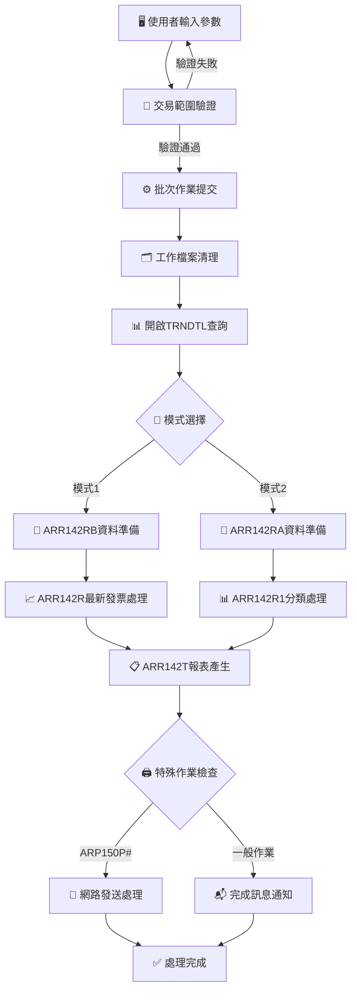
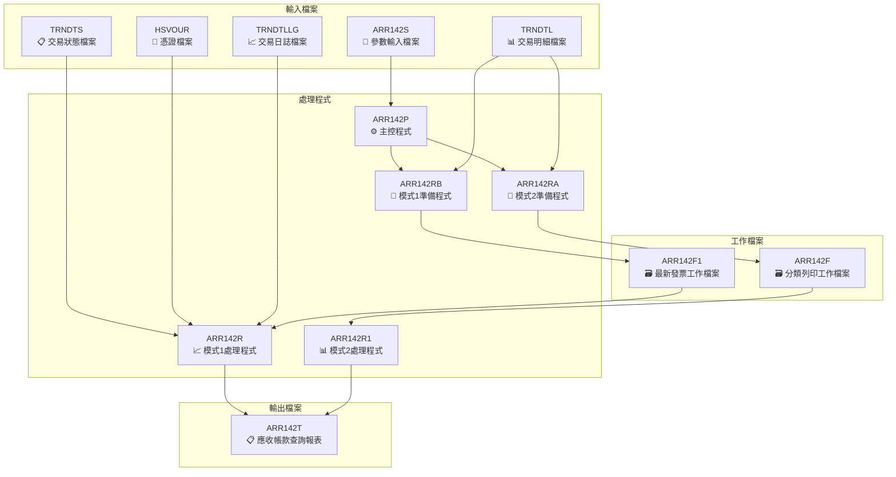
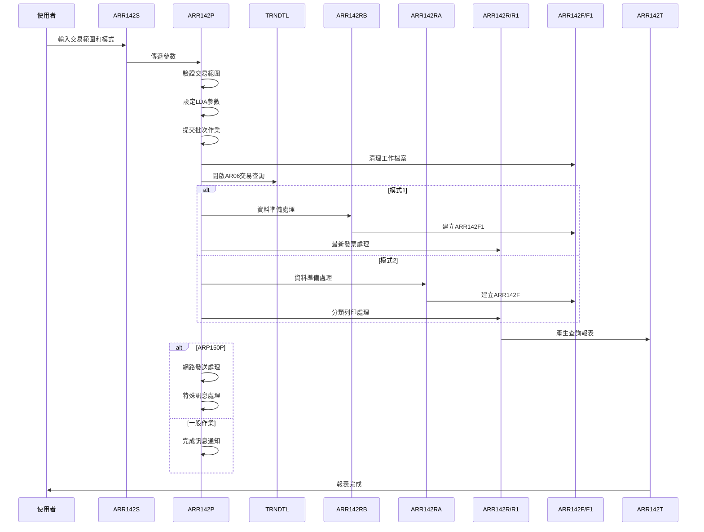
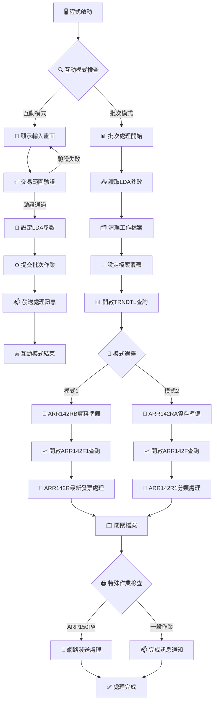

# ARR142P_P02 程式規格書

## 1. 基本資料

| 項目 | 內容 |
|------|------|
| **程式編號** | ARR142P |
| **程式名稱** | 應收帳款查詢系統控制程式 |
| **程式類型** | CLP |
| **廠區** | P02 |
| **系統名稱** | 應收帳款系統 |
| **子系統** | 應收帳款查詢子系統 |
| **檔案位置** | 東鋼list/ARR142P_P02.txt |

## 2. 🎯 程式功能說明

### 📋 核心功能

ARR142P_P02是一個功能強大的應收帳款查詢系統控制程式，主要功能為：

1. **雙模式查詢系統**
   - 模式1：最新發票應收帳目列印
   - 模式2：分類列印
   - 彈性的查詢條件設定

2. **交易明細資料處理**
   - 基於TRNDTL檔案的AR06應收帳款交易查詢
   - 支援交易號碼範圍查詢
   - 排除已刪除和已入帳的交易記錄

3. **多階段資料處理**
   - 第一階段：資料準備(ARR142RB/ARR142RA)
   - 第二階段：資料處理(ARR142R/ARR142R1)
   - 第三階段：報表產生(ARR142T)

4. **智能列印與發送機制**
   - 支援HOLD列印和SAVE功能
   - 針對ARP150P#作業的特殊網路發送
   - 自動化訊息通知機制

5. **工作檔案管理**
   - ARR142F：分類列印工作檔案
   - ARR142F1：最新發票列印工作檔案
   - 支援檔案清理和重建

### 🔄 業務流程



### 🎯 關鍵特色

**雙模式查詢架構**
- 模式1：專門處理最新發票應收帳目，使用ARR142F1工作檔案
- 模式2：提供分類列印功能，使用ARR142F工作檔案
- 不同模式調用不同的準備程式和處理程式

**智能交易過濾機制**
- 只處理TXCODE='AR06'的應收帳款交易
- 排除TXFLAG='D'的已刪除交易
- 排除TXACDT≠0的已入帳交易
- 支援交易號碼範圍查詢

**特殊作業自動化處理**
- 檢測ARP150P#作業自動啟用LOG記錄
- 自動化網路發送至B05CHM使用者
- 支援SNDNETSPLF跨系統報表發送
- 包含錯誤處理和監控機制

**複合檔案關聯查詢**
- TRNDTL：主要交易明細檔案
- TRNDTS：交易狀態檔案
- HSVOUR：憑證檔案
- TRNDTLLG：交易日誌檔案

## 3. 🎯 檔案架構與關聯圖

### 🗂️ 檔案關聯架構



### 🔄 資料流程序列圖



## 4. 🎯 檔案欄位規格說明

### 🔧 主要資料結構

#### **LDA參數區域結構**

| 位置 | 長度 | 欄位名稱 | 型態 | 說明 |
|------|------|----------|------|------|
| 501-506 | 6 | T#TXN1 | CHAR | 起始交易號碼 |
| 507-512 | 6 | T#TXN2 | CHAR | 結束交易號碼 |
| 517-526 | 10 | DSPID | CHAR | 顯示設備ID |
| 531 | 1 | T#CHSE | CHAR | 模式選擇(1/2) |
| 951-985 | 35 | S#COMP | CHAR | 公司名稱 |
| 1001-1010 | 10 | T#USID | CHAR | 使用者ID |
| 1011-1020 | 10 | S#DEVI | CHAR | 設備名稱 |

#### **程式變數定義表**

| 變數名稱 | 型態 | 長度 | 用途說明 |
|----------|------|------|----------|
| DSPID | CHAR | 10 | 顯示設備ID |
| OUTQ | CHAR | 10 | 輸出佇列名稱 |
| INT | CHAR | 1 | 互動式標識 |
| QDATE | CHAR | 8 | 系統日期 |
| S#TXN1 | CHAR | 6 | 起始交易號碼 |
| S#TXN2 | CHAR | 6 | 結束交易號碼 |
| PRINT | CHAR | 10 | 列印佇列名稱(PPB0004H) |
| USER | CHAR | 10 | 作業使用者ID |
| CURUSER | CHAR | 10 | 目前使用者ID |
| TADDR | CHAR | 10 | 目標系統位址 |
| TUSER | CHAR | 10 | 目標使用者ID |

### 🔍 重點欄位切割技術詳解

#### **LDA參數區域切割視覺化**

##### LDA參數區域切割視覺化：
```
LDA記錄：[........................TXN1__TXN2__.........DSPID_____.CHSE.....................COMP___________________________UUUUUUUUUUDDDDDDDDD]
位置:    001-500             501-6 507-12      517-526     531                        951-985                       1001-10   1011-20
         ↓                   ↓     ↓           ↓           ↓                          ↓                             ↓         ↓
前段保留: [...........................]                                                                                               500字元保留區域
起始交易:                 [P02001]                                                                                                 6字元起始交易號碼
結束交易:                        [P02999]                                                                                           6字元結束交易號碼
設備ID:                                  [TERM001WS_]                                                                              10字元設備識別
模式選擇:                                                  [1]                                                                      1字元模式選擇
公司名稱:                                                     [東莞鋼鐵股份有限公司_______________]                                   35字元公司名稱
使用者ID:                                                                                                   [S00WCJ____]             10字元使用者識別
設備名稱:                                                                                                             [TERM001WS]     10字元設備名稱
```

##### LDA切割邏輯說明
**切割策略**：LDA分段式多重參數切割法，透過CHGDTAARA/RTVDTAARA指令進行精確位置的資料讀寫
- **交易範圍區**：位置501-512存放起始和結束交易號碼
- **設備資訊區**：位置517-526存放設備ID
- **模式控制區**：位置531存放模式選擇標識
- **系統資訊區**：位置951-985存放公司名稱
- **使用者資訊區**：位置1001-1020存放使用者和設備資訊

#### **TRNDTL交易明細檔案查詢欄位切割視覺化**

##### TRNDTL查詢條件切割視覺化：
```
TRNDTL記錄：[F|CODE|TXNO____|IT|A|DATE____|ACDT____|CUNO__|CUNM______...]
位置:       001 002-5 006-013 014 015 016-023 024-031 032-037 038-047
            ↓   ↓     ↓       ↓   ↓   ↓       ↓       ↓       ↓
處理旗標:   [F]                                                         1字元處理狀態
交易代碼:       [AR06]                                                  4字元交易代碼
交易號碼:             [P0200123]                                        8字元交易號碼
項目序號:                     [01]                                      2字元項目序號
帳別代碼:                         [A]                                   1字元帳別代碼
交易日期:                           [20241230]                          8字元交易日期
入帳日期:                                   [00000000]                  8字元入帳日期
客戶代號:                                           [DM313_]            6字元客戶代號
客戶名稱:                                                   [東興企業___] 10字元客戶名稱
```

##### TRNDTL查詢切割邏輯詳細分析

**OPNQRYF複合查詢條件的欄位切割處理**
```
查詢條件切割：
1. 狀態條件: TXFLAG *NE "D" → 排除已刪除交易
2. 交易類型: TXCODE *EQ "AR06" → 僅查詢應收帳款交易
3. 入帳狀態: TXACDT *EQ 0 → 僅查詢未入帳交易
4. 交易範圍: TXNO *GE S#TXN1 *AND TXNO *LE S#TXN2 → 交易號碼範圍
```

#### **工作檔案結構切割視覺化**

##### ARR142F分類列印工作檔案切割視覺化：
```
ARR142F記錄：[DXNO____|DX|TXNO____|TX|CUNO__|ORNO__|IVNO______|PDNM|METL____|SPE1_|SPE2_|SPE5__|QTY___|UPRC|AMT_______|TAX_______|...]
位置:        001-008  009 010-017 018 019-024 025-030 031-040   041-5 046-053  054-8 059-63 064-69  070-76 077-9 080-090   091-101
             ↓        ↓   ↓        ↓   ↓       ↓       ↓         ↓     ↓        ↓     ↓      ↓       ↓      ↓     ↓         ↓
調整號碼:    [P0200123]                                                                                                        8字元調整號碼
調整項次:             [01]                                                                                                     2字元調整項次
交易號碼:                 [P0200124]                                                                                          8字元交易號碼
交易項次:                         [02]                                                                                        2字元交易項次
客戶代號:                             [DM313_]                                                                                6字元客戶代號
訂單號碼:                                     [OR123_]                                                                        6字元訂單號碼
發票號碼:                                             [INV0001234]                                                           10字元發票號碼
產品名稱:                                                       [P001]                                                     5字元產品名稱
材質代碼:                                                             [STEEL___]                                            8字元材質代碼
規格1:                                                                       [H100_]                                       5字元H/W/D規格
規格2:                                                                             [B50__]                                 5字元B/T規格
規格5:                                                                                   [SPEC01]                          6字元規格5
數量:                                                                                           [1000___]                    7字元數量
單價:                                                                                                   [500]              3位小數單價
金額:                                                                                                       [500000___]      11字元金額
稅額:                                                                                                                 [25000___] 11字元稅額
```

##### ARR142F1最新發票工作檔案切割視覺化：
```
ARR142F1記錄：[F|CODE|TXNO____|IT|A|DATE____|ACDT____|CUNO__|CUNM______|ORNO_____|IVNO______|PCNO____|VUNO___|RVID|SALE|...]
位置:         001 002-5 006-013 014 015 016-023 024-031 032-037 038-047  048-056  057-066   067-074  075-081 082-3 084-5
              ↓   ↓     ↓       ↓   ↓   ↓       ↓       ↓       ↓        ↓        ↓         ↓        ↓       ↓     ↓
處理旗標:     [F]                                                                                                           1字元處理狀態
交易代碼:         [AR06]                                                                                                    4字元交易代碼
交易號碼:               [P0200123]                                                                                          8字元交易號碼
項目序號:                       [01]                                                                                        2字元項目序號
帳別代碼:                           [A]                                                                                     1字元帳別代碼
交易日期:                             [20241230]                                                                            8字元交易日期
入帳日期:                                     [00000000]                                                                    8字元入帳日期
客戶代號:                                             [DM313_]                                                              6字元客戶代號
客戶名稱:                                                     [東興企業___]                                                 10字元客戶名稱
訂單號碼:                                                               [OR123____]                                       9字元訂單號碼
發票號碼:                                                                        [INV0001234]                              10字元發票號碼
採購號碼:                                                                                  [PC123___]                      8字元採購號碼
憑證號碼:                                                                                           [VOU123_]               7字元憑證號碼
審核人員:                                                                                                   [01]            2字元審核人員
銷售人員:                                                                                                       [02]        2字元銷售人員
```

#### **雙模式處理欄位切割對應表**
| 切割來源 | 切割目標 | 切割位置 | 切割邏輯 | 技術實現 |
|----------|----------|----------|----------|----------|
| **LDA參數** | T#TXN1 | 位置501-506 | 起始交易號碼參數傳遞 | CHGDTAARA/RTVDTAARA |
| **LDA參數** | T#TXN2 | 位置507-512 | 結束交易號碼參數傳遞 | CHGDTAARA/RTVDTAARA |
| **LDA參數** | DSPID | 位置517-526 | 設備ID參數傳遞 | CHGDTAARA/RTVDTAARA |
| **LDA參數** | T#CHSE | 位置531 | 模式選擇參數傳遞 | CHGDTAARA/RTVDTAARA |
| **LDA參數** | S#COMP | 位置951-985 | 公司名稱參數傳遞 | CHGDTAARA/RTVDTAARA |
| **LDA參數** | T#USID | 位置1001-1010 | 使用者ID參數傳遞 | CHGDTAARA/RTVDTAARA |
| **LDA參數** | S#DEVI | 位置1011-1020 | 設備名稱參數傳遞 | CHGDTAARA/RTVDTAARA |
| **模式邏輯** | S#CHSE | '1'/'2' | 雙模式切割邏輯 | IF COND檢查 |
| **TRNDTL** | TXFLAG | 排除條件 | 刪除狀態過濾 | QRYSLT TXFLAG *NE "D" |
| **TRNDTL** | TXCODE | 固定條件 | 交易類型過濾 | QRYSLT TXCODE *EQ "AR06" |
| **TRNDTL** | TXACDT | 固定條件 | 入帳狀態過濾 | QRYSLT TXACDT *EQ 0 |
| **TRNDTL** | TXNO | 範圍條件 | 交易號碼範圍切割 | QRYSLT TXNO範圍 |
| **ARR142F** | A4DXNO | 位置1-8 | 調整號碼切割 | RPG欄位對應 |
| **ARR142F** | A4TXNO | 位置10-17 | 交易號碼切割 | RPG欄位對應 |
| **ARR142F** | A4CUNO | 位置19-24 | 客戶代號切割 | RPG欄位對應 |
| **ARR142F1** | TXCUNO | L2欄位 | 客戶Level Break切割 | RPG Level Break |
| **ARR142F1** | TXIVEA | L2欄位 | 發票廠區Level Break切割 | RPG Level Break |
| **ARR142F1** | TXNO | L1欄位 | 交易號碼Level Break切割 | RPG Level Break |

### 🎯 欄位挪用詳細分析

#### **雙模式處理挪用機制**

**模式1：最新發票應收帳目處理挪用**
- `S#CHSE='1'` → 調用ARR142RB準備程式
- 使用ARR142F1工作檔案儲存處理結果
- 調用ARR142R進行最新發票處理
- 支援Level Break：TXCUNO(L2) + TXIVEA(L2) + TXNO(L1)

**模式2：分類列印處理挪用**
- `S#CHSE='2'` → 調用ARR142RA準備程式
- 使用ARR142F工作檔案儲存處理結果
- 調用ARR142R1進行分類列印處理
- 支援多維度排序：A4DXNO + A4DXIT + A4IVNO + A4PDNM + A4METL + A4SPE1 + A4SPE2

#### **特殊作業檢測挪用分析**

**ARP150P#作業特殊處理挪用**
```
作業檢測挪用：
IF COND(&DSPID *EQ 'ARP150P#') THEN(DO)
   - 自動啟用CHGJOB LOGCLPGM(*YES)
   - 自動設定TUSER='B05CHM'
   - 自動設定CURUSER='S00NOTES'
   - 執行SNDNETSPLF網路發送
   - 執行CHGSPLFA報表屬性變更
ENDDO
```

**網路發送參數挪用邏輯**
- `TUSER` = 'B05CHM' (目標使用者固定設定)
- `TADDR` = SYSNAME (系統名稱自動取得)
- `CURUSER` = 'S00NOTES' (發送使用者固定設定)
- `PRINT` = 'PPB0004H' (列印佇列固定設定)

#### **交易範圍驗證挪用邏輯**

**交易號碼範圍檢查挪用**
```
範圍驗證挪用：
1. 空白檢查: S#TXN1 *EQ ' ' → IN30='1' + 錯誤訊息
2. 範圍檢查: S#TXN1 *GT S#TXN2 → IN30='1' + IN32='1' + 錯誤訊息
3. 自動補齊: S#TXN2 *EQ ' ' → S#TXN2=S#TXN1
```

**錯誤處理指示器挪用**
- `IN30` → S#TXN1欄位錯誤指示器
- `IN32` → S#TXN2欄位錯誤指示器
- `S#ERR` → 錯誤訊息顯示區域

#### **檔案查詢條件挪用邏輯**

**OPNQRYF查詢條件組合挪用**
```
TRNDTL查詢條件挪用：
(TXFLAG *NE "D") *AND     // 排除已刪除記錄
(TXCODE *EQ "AR06") *AND  // 限定應收帳款交易
(TXACDT *EQ 0) *AND       // 限定未入帳交易
(TXNO *GE S#TXN1) *AND    // 交易號碼起始範圍
(TXNO *LE S#TXN2)         // 交易號碼結束範圍

排序鍵值挪用：
KEYFLD((TXNO) (TXIVNO))   // 依交易號碼和發票號碼排序
```

### 🔧 切割邏輯說明與技術實現

#### **CLP程式雙模式切割邏輯**

**模式選擇切割實現**
```
CLP主程式(ARR142P)中的模式處理：

批次階段模式判斷：
RTVDTAARA  DTAARA(*LDA (531 1))  RTNVAR(&S#CHSE)    // 取得模式選擇

模式1處理流程：
IF COND(&S#CHSE *EQ '1') THEN(DO)
   CALL      PGM(ARR142RB)                           // 資料準備
   OVRDBF    FILE(ARR142F1) TOFILE(ARR142F1) SHARE(*YES)
   OPNQRYF   FILE(ARR142F1) KEYFLD((TXIVEA) (TXCUNO) (TXNO) (TXIVNO))
   CALL      PGM(ARR142R)                            // 主要處理
ENDDO

模式2處理流程：
IF COND(&S#CHSE *EQ '2') THEN(DO)
   CALL      PGM(ARR142RA)                           // 資料準備
   OVRDBF    FILE(ARR142F) TOFILE(ARR142F) SHARE(*YES)
   OPNQRYF   FILE(ARR142F) KEYFLD((A4DXNO) (A4DXIT) (A4IVNO) (A4PDNM) (A4METL) (A4SPE1) (A4SPE2))
   CALL      PGM(ARR142R1)                           // 分類處理
ENDDO
```

#### **OPNQRYF複合查詢切割邏輯實現**

**TRNDTL主檔案查詢設定**
```
CLP主程式中的複合查詢邏輯：

OPNQRYF    FILE(TRNDTL) QRYSLT('                      +
           (TXFLAG *NE "D" ) *AND +                   // 排除刪除記錄
           (TXCODE *EQ "AR06") *AND +                 // 應收帳款交易
           (TXACDT *EQ 0) *AND +                      // 未入帳交易
           (TXNO  *GE "' || &S#TXN1 || '") *AND +     // 起始交易號碼
           (TXNO  *LE "' || &S#TXN2 || '")  +         // 結束交易號碼
           ') +
           KEYFLD((TXNO) (TXIVNO))                    // 排序鍵值

工作檔案查詢設定（模式1）：
OPNQRYF    FILE(ARR142F1) KEYFLD( +
           (TXIVEA) (TXCUNO) (TXNO) (TXIVNO))         // 多層級排序

工作檔案查詢設定（模式2）：
OPNQRYF    FILE(ARR142F) KEYFLD( +
           (A4DXNO) (A4DXIT) (A4IVNO) (A4PDNM) (A4METL) +
           (A4SPE1) (A4SPE2))                        // 多欄位排序
```

#### **RPG Level Break處理邏輯實現**

**ARR142R Level Break定義**
```
RPG程式中的Level Break定義：

模式1 Level Break結構：
I                                              TXCUNOL2      // 客戶代號L2
I                                              TXIVEAL2      // 發票廠區L2
I                                              TXNO  L1      // 交易號碼L1

Level Break處理邏輯：
CL2                   EXSR L2SR                             // L2 Break處理
CL1                   EXSR L1SR                             // L1 Break處理
CLR                   EXSR LRSR                             // LR 最後記錄處理

L2SR子程序（客戶/廠區變更）：
C           L2SR      BEGSR
C                     MOVE *OFF      *IN69                  // 重置頁面標記
C                     WRITEAR142TH                          // 輸出頁面標題
C                     ENDSR

L1SR子程序（交易號碼變更）：
C           L1SR      BEGSR
C                     WRITEAR142T2                          // 輸出交易小計
C                     WRITEAR142T6                          // 輸出分隔線
C                     ENDSR
```

#### **特殊作業處理邏輯實現**

**ARP150P#作業檢測與處理**
```
特殊作業檢測邏輯：

LOG啟用檢查：
IF COND(&DSPID *EQ 'ARP150P#') THEN(DO)
   CHGJOB     LOGCLPGM(*YES)                          // 啟用CLP日誌
ENDDO

網路發送處理：
IF COND(&DSPID *EQ 'ARP150P#') THEN(DO)
   CHGVAR     VAR(&TUSER)   VALUE('B05CHM')           // 設定目標使用者
   CHGVAR     VAR(&CURUSER) VALUE('S00NOTES')         // 設定發送使用者
   SNDNETSPLF FILE(ARR142T) TOUSRID((&TUSER &TADDR))  +
              JOB(*) SPLNBR(*LAST) DTAFMT(*ALLDATA)   // 網路發送
   CHGSPLFA   FILE(ARR142T) JOB(&TUSER/QPRTJOB)      +
              SPLNBR(*LAST) OUTQ(&PRINT)             // 變更報表屬性
   MONMSG     MSGID(CPF0000)                          // 錯誤監控
ENDDO

一般作業訊息：
IF COND(&DSPID *NE 'ARP150P#') THEN(DO)
   SNDBRKMSG  MSG('<<應收帳款查詢系統控制程式檢查處理完成，請列印...>>')
ENDDO
```

#### **工作檔案管理邏輯實現**

**檔案清理與重建邏輯**
```
工作檔案清理邏輯：

清理工作檔案：
CLRPFM     FILE(ARR142F)                              // 清理分類列印檔案
CLRPFM     FILE(ARR142F1)                             // 清理最新發票檔案

報表設定：
OVRPRTF    FILE(ARR142T) TOFILE(ARR142T) +
           USRDTA('應收明細') HOLD(*YES) +             // 報表使用者資料
           SAVE(*YES) OUTQ(&PRINT) COPIES(1) +         // 儲存和列印設定
           PAGESIZE(*N 158) CPI(12)                    // 頁面格式設定

檔案覆蓋設定：
OVRDBF     FILE(TRNDTL) TOFILE(TRNDTL) SHARE(*YES)   // 共享存取設定
```

### 📊 重要變數定義表

| 變數名稱 | 型態 | 長度 | 初始值 | 用途說明 |
|----------|------|------|--------|----------|
| IN30 | IND | 1 | *OFF | S#TXN1欄位錯誤指示器 |
| IN32 | IND | 1 | *OFF | S#TXN2欄位錯誤指示器 |
| IN03 | IND | 1 | *OFF | F3離開指示器 |
| IN12 | IND | 1 | *OFF | F12返回指示器 |
| S#CHSE | CHAR | 1 | '1' | 模式選擇(1/2) |
| S#ERR | CHAR | 70 | *BLANKS | 錯誤訊息顯示 |
| QDATE | CHAR | 8 | 系統日期 | 格式化日期變數 |
| PRINT | CHAR | 10 | 'PPB0004H' | 列印佇列名稱 |
| TUSER | CHAR | 10 | 'B05CHM' | 網路發送目標使用者 |
| TADDR | CHAR | 10 | SYSNAME | 目標系統位址 |
| CURUSER | CHAR | 10 | 'S00NOTES' | 目前發送使用者 |

## 5. 🎯 輸出/入螢幕布局

### 📝 輸入畫面規格 (ARR142S)

#### **畫面布局**

```
┌─────────────────────────────────────────────────────────────────────────────┐
│ 2024/12/30            東莞鋼鐵股份有限公司                        ARR142S   │
│ 15:30:25            應收帳款查詢系統控制程式                      devname   │
│                                                                             │
│                                                                             │
│                                                                             │
│                                                                             │
│                                                                             │
│        交易號碼: ______  至  ______                                        │
│                                                                             │
│        選項: _ (1=最新發票應收帳目列印 2=分類列印)                          │
│                                                                             │
│                                                                             │
│                                                                             │
│                                                                             │
│                                                                             │
│                                                                             │
│                                                                             │
│                                                                             │
│                                                                             │
│                                                                             │
│                                                                             │
│ ________________________________________________________________           │
│     PF03:離開              PF12:回到前頁                                   │
└─────────────────────────────────────────────────────────────────────────────┘
```

#### **欄位詳細規格**

| 欄位名稱 | 位置 | 型態 | 長度 | 屬性 | 說明 |
|----------|------|------|------|------|------|
| **S#TXN1** | 8,25 | 6A | 6 | 輸入欄位 | 起始交易號碼 |
| **S#TXN2** | 8,35 | 6A | 6 | 輸入欄位 | 結束交易號碼 |
| **S#CHSE** | 10,25 | 1A | 1 | 輸入欄位 | 模式選擇(1/2) |
| **S#COMP** | 1,23 | 35A | 35 | 輸出欄位 | 公司名稱 |
| **S#DEVI** | 2,70 | 10A | 10 | 輸出欄位 | 設備名稱 |
| **S#ERR** | 23,2 | 70A | 70 | 輸出欄位 | 錯誤訊息區域(高亮顯示) |

#### **功能鍵說明**

| 功能鍵 | 說明 | 對應指示器 |
|--------|------|------------|
| **ENTER** | 確認輸入，執行應收帳款查詢處理 | - |
| **F03** | 離開程式 | IN03 |
| **F12** | 回到前一個畫面 | IN12 |

#### **錯誤指示器說明**

| 指示器 | 欄位 | 錯誤類型 | 顯示效果 |
|--------|------|----------|----------|
| **IN30** | S#TXN1 | 交易號碼錯誤 | 反白+閃爍 |
| **IN32** | S#TXN2 | 交易範圍錯誤 | 反白+閃爍 |

#### **輸入驗證規則**

| 欄位 | 驗證規則 | 錯誤訊息 |
|------|----------|----------|
| **S#TXN1** | 不可空白 | 交易號碼起始不可空白! |
| **S#TXN1/S#TXN2** | 起始≤結束 | 交易號碼起始不可大於終止! |
| **S#CHSE** | 限定值1或2 | 系統自動驗證 |

### 📊 報表輸出格式

#### **應收帳款查詢報表布局**

```
┌─────────────────────────────────────────────────────────────────────────────────────────────────────────────────────────────────────────────────────────┐
│ 報表代號: ARR142T                             東莞鋼鐵股份有限公司                                                               列印日期: 2024/12/30│
│ 列印人員: S00WCJ                         應收帳款查詢系統控制程式                                                               列印時間: 15:30:25  │
│                                                                                                                                頁數: 1     │
│ 交易號碼: P02001 至 P02999   選項: 1 (1=最新發票應收帳目列印 2=分類列印)                                                                     │
│ ═══════════════════════════════════════════════════════════════════════════════════════════════════════════════════════════════════════════════════════  │
│                                                                                                                                              │
│ 交易號碼  客戶代號  訂單號碼    發票號碼     產品名稱 材質     H/W/D   B/T   T1  規格   單位量     單價            金額    稅額   │
│ ═══════════════════════════════════════════════════════════════════════════════════════════════════════════════════════════════════════════════════════  │
│ P0200123  DM313    OR123       INV0001234   P001    STEEL   H100    B50        SPEC01    1,000     500        500,000    25,000 │
│ P0200124  DM313    OR124       INV0001235   P002    ALLOY   H200    B75        SPEC02      500   1,000        500,000    25,000 │
│ P0200125  DM313    OR125       INV0001236   P001    STEEL   H100    B50        SPEC01      750     500        375,000    18,750 │
│                                                                                                                                              │
│ ────────────────────────────────────────────────────────────────────────────────────────────────────────────────────────────────────────────────────── │
│                                                            交易小計:                                                    1,375,000    68,750 │
│ ═══════════════════════════════════════════════════════════════════════════════════════════════════════════════════════════════════════════════════════  │
│                                                                                                                                              │
│ 模式1: 最新發票應收帳目處理結果                                                                                                               │
│ - 客戶Level Break: 依客戶代號分組                                                                                                          │
│ - 發票廠區Level Break: 依發票廠區分組                                                                                                       │
│ - 交易號碼Level Break: 依交易號碼分組                                                                                                       │
│                                                                                                                                              │
│ 模式2: 分類列印處理結果                                                                                                                     │
│ - 多維度排序: 調整號碼+項次+發票號碼+產品名稱+材質+規格                                                                                      │
│ - 支援產品分類統計和材質分析                                                                                                               │
│                                                                                                                                              │
│ ═══════════════════════════════════════════════════════════════════════════════════════════════════════════════════════════════════════════════════════  │
│ 總計記錄數: 3筆    總金額: 1,375,000    總稅額: 68,750                                                                                      │
└─────────────────────────────────────────────────────────────────────────────────────────────────────────────────────────────────────────────────────────┘
```

## 6. 🎯 處理流程程序說明

### 🔄 主要處理流程



### 📝 詳細處理步驟

**步驟1：程式初始化**
- 宣告檔案參考(ARR142S)和程式變數
- 檢查執行模式(互動式/批次)
- 取得作業資訊(使用者、輸出佇列、系統名稱)
- 特殊作業檢查：ARP150P#自動啟用LOG記錄

**步驟2：互動式參數輸入**
- 從LDA讀取公司名稱和設備名稱顯示
- 透過SNDRCVF顯示ARR142S參數輸入畫面
- 重置所有錯誤指示器(IN30、IN32)和錯誤訊息
- 支援交易號碼範圍和模式選擇輸入

**步驟3：參數驗證處理**
- 起始交易號碼檢查：必須輸入，不可空白
- 交易範圍檢查：起始號碼不可大於結束號碼
- 自動補齊功能：結束號碼空白時自動設定為起始號碼
- 模式選擇驗證：限定值1或2

**步驟4：LDA參數設定**
- 位置501-506：起始交易號碼(S#TXN1)
- 位置507-512：結束交易號碼(S#TXN2)
- 位置517-526：顯示設備ID(DSPID)
- 位置531：模式選擇(S#CHSE)

**步驟5：批次作業提交**
- 透過SBMJOB提交批次作業到ARJOBD作業說明
- 發送開始處理訊息給使用者
- 返回互動式作業

**步驟6：批次處理階段**
- 從LDA讀取所有處理參數
- 清理工作檔案(ARR142F、ARR142F1)
- 設定列印佇列和報表格式

**步驟7：檔案設定階段**
- 設定ARR142T報表：158字元寬度、12CPI、HOLD和SAVE
- 設定TRNDTL檔案為共享模式
- 建立OPNQRYF查詢：AR06交易、未刪除、未入帳、交易範圍

**步驟8：模式1處理流程**
- 調用ARR142RB進行資料準備，建立ARR142F1工作檔案
- 設定ARR142F1檔案為共享模式
- 建立ARR142F1的OPNQRYF：依發票廠區、客戶、交易號碼、發票號碼排序
- 調用ARR142R進行最新發票應收帳目處理

**步驟9：模式2處理流程**
- 調用ARR142RA進行資料準備，建立ARR142F工作檔案
- 設定ARR142F檔案為共享模式
- 建立ARR142F的OPNQRYF：依調整號碼、項次、發票號碼、產品、材質、規格排序
- 調用ARR142R1進行分類列印處理

**步驟10：報表處理與輸出**
- ARR142R/ARR142R1讀取工作檔案資料
- 整合TRNDTS、HSVOUR、TRNDTLLG檔案資訊
- Level Break處理(模式1)或多維度排序處理(模式2)
- 產生ARR142T應收帳款查詢報表

**步驟11：檔案清理階段**
- 關閉所有OPNQRYF查詢(TRNDTL、ARR142F/ARR142F1)
- 執行DLTOVR清理所有檔案覆蓋

**步驟12：特殊處理與通知**
- 檢查作業類型：ARP150P#執行網路發送，一般作業發送完成訊息
- ARP150P#處理：設定目標使用者B05CHM，執行SNDNETSPLF和CHGSPLFA
- 一般作業：發送處理完成訊息到使用者訊息佇列

### 🎯 子程序邏輯分析

**ARR142RB子程序功能（模式1資料準備）**
- 讀取TRNDTL交易明細資料
- 整合相關檔案資訊(TRNDTS、HSVOUR等)
- 建立ARR142F1最新發票工作檔案
- 設定Level Break欄位(TXCUNO、TXIVEA、TXNO)

**ARR142RA子程序功能（模式2資料準備）**
- 讀取TRNDTL交易明細資料
- 進行分類和排序處理
- 建立ARR142F分類列印工作檔案
- 設定多維度排序欄位

**ARR142R子程序功能（模式1主要處理）**
- 讀取ARR142F1工作檔案
- Level Break處理：客戶(L2)、發票廠區(L2)、交易號碼(L1)
- 產生最新發票應收帳目報表
- 支援小計和總計功能

**ARR142R1子程序功能（模式2主要處理）**
- 讀取ARR142F工作檔案
- 多維度分類處理
- 產生分類列印報表
- 支援產品、材質、規格分析

### 🎯 特殊邏輯處理

**特殊作業檢測邏輯**
- 檢查作業名稱是否為ARP150P#
- 符合條件時自動啟用CHGJOB LOGCLPGM(*YES)
- 執行特殊的網路發送和報表屬性變更
- 包含MONMSG錯誤監控機制

**雙模式處理邏輯**
- 模式1：著重於時間序列的最新發票處理
- 模式2：著重於分類和多維度分析
- 不同模式使用不同的工作檔案和處理程式
- 支援不同的排序和分組邏輯

**網路發送處理邏輯**
- 自動取得系統名稱(RTVNETA SYSNAME)
- 設定固定的目標使用者(B05CHM)和發送使用者(S00NOTES)
- 使用SNDNETSPLF進行跨系統報表發送
- 使用CHGSPLFA變更報表輸出佇列屬性

**錯誤處理與恢復邏輯**
- 網路發送包含MONMSG錯誤監控
- 參數驗證失敗自動回到輸入畫面
- 檔案操作失敗確保資源正確清理
- 提供詳細的錯誤訊息和修正建議

## 7. 🎯 數據操作與轉換分析

### 檔案操作詳解

**TRNDTL檔案存取邏輯**
- READ操作：透過OPNQRYF建立的複合查詢檢視讀取交易明細
- 查詢條件：TXCODE='AR06'、TXFLAG≠'D'、TXACDT=0、交易號碼範圍
- 檔案鎖定：使用SHARE(*YES)允許多重存取
- 排序鍵值：TXNO、TXIVNO

**ARR142F/ARR142F1工作檔案操作邏輯**
- WRITE操作：由準備程式(ARR142RB/ARR142RA)寫入
- READ操作：由處理程式(ARR142R/ARR142R1)讀取
- 檔案清理：每次執行前透過CLRPFM清空
- 排序查詢：透過OPNQRYF建立不同的排序檢視

**ARR142T報表檔案操作邏輯**
- WRITE操作：多種報表格式輸出
- 報表設定：158字元寬度、12CPI、HOLD(*YES)、SAVE(*YES)
- 網路發送：支援SNDNETSPLF跨系統發送
- 屬性控制：支援CHGSPLFA動態變更報表屬性

### 數據轉換邏輯

**交易號碼範圍轉換**
- 輸入格式：6字元交易號碼
- 查詢格式：字元串比較(TXNO *GE/*LE)
- 自動補齊：結束號碼空白時設定為起始號碼
- 範圍驗證：確保起始號碼不大於結束號碼

**模式選擇轉換**
- 輸入值：'1'或'2'
- 程式分支：IF COND檢查進行流程分支
- 工作檔案：模式1使用ARR142F1，模式2使用ARR142F
- 處理程式：模式1調用ARR142R，模式2調用ARR142R1

**日期格式轉換**
- 系統日期：RTVJOBA CYMDDATE取得YYYYMMDD格式
- 顯示格式：前補'0'形成9字元顯示格式
- 報表日期：使用DATE函數自動格式化
- 時間顯示：使用TIME函數顯示HH:MM:SS格式

**檔案資料結構轉換**
- TRNDTL → ARR142F1：完整欄位對應轉換
- TRNDTL → ARR142F：選擇性欄位轉換和重組
- 工作檔案 → 報表：格式化輸出轉換
- Level Break：多層級分組統計轉換

### 計算邏輯分析

**交易範圍計算**
- 範圍檢查：S#TXN1 *GT S#TXN2的邏輯判斷
- 空白補齊：S#TXN2 *EQ ' '時的自動設定
- 查詢範圍：TXNO *GE/*LE的範圍查詢條件
- 錯誤標記：IN30、IN32指示器的條件設定

**模式處理計算**
- 模式判斷：S#CHSE *EQ '1'/'2'的條件分支
- 程式調用：不同模式調用不同子程式的邏輯
- 檔案選擇：根據模式選擇不同工作檔案的計算
- 排序設定：不同模式設定不同排序鍵值的計算

**Level Break計算**
- L2 Break：客戶代號(TXCUNO)和發票廠區(TXIVEA)變更檢測
- L1 Break：交易號碼(TXNO)變更檢測
- 小計計算：每個Break層級的累計計算
- 總計計算：所有記錄的總計計算

**報表格式計算**
- 欄位對齊：數值欄位右對齊、文字欄位左對齊的計算
- 分隔線：使用固定字元填充的計算
- 頁面控制：SKIPB、SPACEA、SPACEB的行間距計算
- 條件顯示：使用指示器控制欄位顯示的計算

### 檢核機制詳解

**輸入資料檢核**
- 交易號碼：必須輸入，不可空白
- 交易範圍：起始號碼不可大於結束號碼
- 模式選擇：限定值1或2的檢查
- 格式驗證：確保輸入格式正確性

**檔案存取檢核**
- 檔案存在性：使用指示器檢查檔案開啟狀態
- 查詢結果驗證：確保OPNQRYF查詢設定正確
- 權限檢查：確保檔案讀寫和覆蓋權限正確
- 資源清理：確保所有檔案和查詢正確關閉

**交易資料檢核**
- 交易狀態：確保只處理非刪除交易(TXFLAG≠'D')
- 交易類型：確保只處理應收帳款交易(TXCODE='AR06')
- 入帳狀態：確保只處理未入帳交易(TXACDT=0)
- 資料完整性：驗證關聯檔案的資料一致性

**網路發送檢核**
- 作業檢查：確認是否為ARP150P#特殊作業
- 使用者設定：驗證目標使用者和發送使用者設定
- 系統名稱：確認目標系統位址正確性
- 錯誤監控：使用MONMSG監控發送過程錯誤

## 8. 🎯 錯誤處理程序說明

### 🎯 詳細錯誤代碼清冊

| 錯誤代碼 | 錯誤訊息 | 原因說明 | 處理方式 | 預防措施 |
|----------|----------|----------|----------|----------|
| **USER001** | 交易號碼起始不可空白! | 起始交易號碼為必填欄位但輸入為空 | 1. 顯示錯誤訊息<br>2. 設定IN30指示器<br>3. 游標定位至起始交易號碼欄位 | 提供交易號碼輸入格式說明 |
| **USER002** | 交易號碼起始不可大於終止! | 起始交易號碼大於結束交易號碼 | 1. 顯示錯誤訊息<br>2. 設定IN30和IN32指示器<br>3. 要求重新輸入範圍 | 增加範圍邏輯檢查和提示 |
| **USER003** | 模式選擇輸入錯誤! | 模式選擇不是1或2 | 1. 顯示錯誤訊息<br>2. 提供有效選項說明<br>3. 要求重新選擇 | 使用VALUES限制輸入範圍 |
| **FILE001** | TRNDTL檔案開啟失敗 | 交易明細檔無法開啟或損壞 | 1. 記錄錯誤日誌<br>2. 通知系統管理員<br>3. 終止處理程序 | 定期檢查檔案完整性 |
| **FILE002** | ARR142F工作檔案清理失敗 | 工作檔案無法清理或權限不足 | 1. 記錄錯誤資訊<br>2. 嘗試手動清理<br>3. 檢查檔案權限 | 確保工作檔案權限正確 |
| **FILE003** | ARR142F1工作檔案建立失敗 | 工作檔案無法建立或空間不足 | 1. 檢查磁碟空間<br>2. 清理暫存檔案<br>3. 重新嘗試建立 | 監控磁碟空間使用狀況 |
| **FILE004** | TRNDTL查詢無資料 | 指定交易範圍查詢無符合資料 | 1. 顯示"無符合資料"<br>2. 產生空白報表<br>3. 建議檢查交易範圍 | 提供交易範圍查詢說明 |
| **PROC001** | ARR142RB準備程式失敗 | 模式1資料準備程式執行異常 | 1. 記錄準備程式錯誤<br>2. 清理部分建立資料<br>3. 重新執行準備程序 | 加強準備程式錯誤處理 |
| **PROC002** | ARR142RA準備程式失敗 | 模式2資料準備程式執行異常 | 1. 記錄準備程式錯誤<br>2. 清理部分建立資料<br>3. 重新執行準備程序 | 加強準備程式錯誤處理 |
| **PROC003** | ARR142R處理程式失敗 | 模式1主要處理程式執行異常 | 1. 記錄處理程式錯誤<br>2. 檢查工作檔案狀態<br>3. 部分報表輸出 | 驗證工作檔案完整性 |
| **PROC004** | ARR142R1處理程式失敗 | 模式2主要處理程式執行異常 | 1. 記錄處理程式錯誤<br>2. 檢查工作檔案狀態<br>3. 部分報表輸出 | 驗證工作檔案完整性 |
| **OPNQF001** | TRNDTL查詢設定失敗 | OPNQRYF查詢語法錯誤 | 1. 檢查查詢語法<br>2. 驗證欄位名稱<br>3. 重新建立查詢 | 加強查詢語法驗證 |
| **OPNQF002** | ARR142F查詢設定失敗 | 工作檔案查詢設定異常 | 1. 檢查檔案結構<br>2. 驗證排序欄位<br>3. 重新設定查詢 | 確保檔案結構正確性 |
| **OPNQF003** | ARR142F1查詢設定失敗 | 工作檔案查詢設定異常 | 1. 檢查檔案結構<br>2. 驗證排序欄位<br>3. 重新設定查詢 | 確保檔案結構正確性 |
| **NET001** | 網路發送設定失敗 | SNDNETSPLF網路發送異常 | 1. 檢查網路連線<br>2. 驗證目標系統<br>3. 記錄發送錯誤 | 確保網路設定正確性 |
| **NET002** | 目標使用者設定錯誤 | 發送目標使用者不存在 | 1. 驗證使用者存在性<br>2. 檢查使用者權限<br>3. 使用預設設定 | 定期檢查使用者設定 |
| **NET003** | 報表屬性變更失敗 | CHGSPLFA執行異常 | 1. 檢查報表狀態<br>2. 驗證輸出佇列<br>3. 使用原始設定 | 確保報表屬性正確性 |
| **RPT001** | 報表產生異常 | ARR142T報表格式錯誤 | 1. 檢查報表定義<br>2. 驗證資料格式<br>3. 使用簡化格式 | 確保報表定義正確性 |
| **RPT002** | 報表輸出佇列異常 | 輸出佇列設定錯誤 | 1. 檢查佇列狀態<br>2. 使用預設佇列<br>3. 重新設定輸出 | 監控輸出佇列狀況 |
| **SYS001** | 批次作業提交失敗 | SBMJOB執行異常 | 1. 檢查作業佇列狀態<br>2. 改為直接執行<br>3. 記錄提交錯誤 | 監控作業佇列負載 |
| **SYS002** | 系統名稱取得失敗 | RTVNETA SYSNAME失敗 | 1. 使用預設系統名稱<br>2. 記錄取得錯誤<br>3. 檢查網路設定 | 確保系統網路設定正確 |
| **SYS003** | 使用者資訊取得失敗 | RTVJOBA執行異常 | 1. 使用預設使用者資訊<br>2. 記錄取得錯誤<br>3. 繼續程式執行 | 檢查系統使用者設定 |

### 🎯 系統異常處理邏輯

**檔案操作失敗處理**
- OPNQRYF操作失敗時自動執行CLOF清理資源
- 工作檔案建立失敗時清理部分資料
- 報表檔案異常時使用簡化格式輸出
- 所有檔案操作完成後確實執行DLTOVR
- 檔案鎖定衝突時等待重試機制

**程式調用失敗處理**
- 子程式調用失敗時記錄詳細錯誤資訊
- ARR142RB/ARR142RA失敗時清理工作檔案
- ARR142R/ARR142R1失敗時確保檔案正確關閉
- 網路發送失敗時使用MONMSG自動恢復
- 所有程式調用都包含適當的錯誤恢復機制

**使用者輸入錯誤處理**
- 所有輸入錯誤都回到輸入畫面重新輸入
- 錯誤指示器精確定位錯誤欄位(IN30/IN32)
- 提供詳細的錯誤說明和修正建議
- 保留正確輸入的資料，僅要求修正錯誤部分
- 支援範圍自動補齊功能減少輸入錯誤

**網路發送異常處理**
- 使用MONMSG監控網路發送過程
- 目標系統無法連線時記錄錯誤但繼續處理
- 使用者權限不足時使用預設設定
- 報表屬性變更失敗時保持原始設定
- 確保網路異常不影響主要處理流程

**特殊作業異常處理**
- ARP150P#作業檢測失敗時使用一般處理
- LOG啟用失敗時記錄錯誤但繼續執行
- 網路發送設定錯誤時跳過發送步驟
- 確保特殊作業異常不影響報表產生

## 9. 🎯 備註

### 🎯 特殊注意事項

**應收帳款查詢系統的業務意義**
程式的核心功能是提供靈活的應收帳款查詢和分析能力。透過雙模式設計(最新發票應收帳目/分類列印)，滿足不同業務需求的查詢分析。支援交易號碼範圍查詢，協助財務人員快速定位和分析特定期間的應收帳款狀況。

**雙模式處理架構的設計理念**
程式採用創新的雙模式處理架構，模式1專注於時間序列的最新發票處理，使用Level Break提供層級化的資料分析；模式2專注於多維度的分類分析，支援產品、材質、規格等多重分類統計。這種設計滿足不同角度的業務分析需求。

**特殊作業自動化處理的技術創新**
程式實現智能的作業檢測機制，自動識別ARP150P#特殊作業並啟用相應的自動化處理。包括LOG記錄啟用、網路發送設定、目標使用者配置等，大幅提升特殊作業的處理效率和自動化程度。

**AR06交易類型的專業定位**
程式專門處理TXCODE='AR06'的應收帳款交易，這是企業應收帳款管理的核心交易類型。透過TXFLAG≠'D'排除已刪除交易，TXACDT=0限定未入帳交易，確保查詢結果的準確性和時效性。

**工作檔案管理的效率優化**
程式使用ARR142F和ARR142F1兩個工作檔案分別支援不同模式的處理需求。每次執行前透過CLRPFM清理檔案，確保資料的乾淨性。透過OPNQRYF建立不同的排序檢視，提高資料存取效率。

**Level Break處理的多層級設計**
模式1採用三層Level Break設計：客戶代號(TXCUNO-L2)、發票廠區(TXIVEA-L2)、交易號碼(TXNO-L1)。這種設計提供精細的分組統計功能，支援客戶層級、廠區層級和交易層級的多重分析需求。

**網路發送機制的跨系統整合**
程式實現完整的跨系統報表發送機制，透過SNDNETSPLF支援網路發送，CHGSPLFA動態變更報表屬性，MONMSG提供錯誤監控。這種設計支援多系統環境下的報表分發和管理需求。

**OPNQRYF複合查詢的技術應用**
程式充分運用OPNQRYF的強大查詢能力，建立複合查詢條件和多重排序鍵值。主檔案查詢使用四重條件(狀態+類型+入帳+範圍)，工作檔案查詢使用多維度排序，提供高效的資料存取性能。

**報表格式的專業設計**
程式支援158字元寬度的專業報表格式，12CPI字體密度，HOLD和SAVE雙重保存機制。報表包含完整的標題資訊、參數顯示、明細內容和統計資料，滿足正式財務報表的格式要求。

**錯誤處理機制的完善設計**
程式實施多層次的錯誤處理機制，從輸入驗證到檔案操作，再到網路發送，每個環節都有相應的錯誤檢查和恢復機制。特別是網路發送使用MONMSG監控，確保異常時系統的穩定性。

**參數驗證的智能化設計**
程式提供智能的參數驗證功能，包括交易範圍檢查、自動補齊機制、錯誤指示器精確定位等。當結束交易號碼空白時自動設定為起始號碼，提升使用者操作的便利性。

**檔案關聯查詢的複雜性管理**
程式涉及多個檔案的關聯查詢：TRNDTL(主檔案)、TRNDTS(狀態檔案)、HSVOUR(憑證檔案)、TRNDTLLG(日誌檔案)。透過有序的檔案存取和適當的錯誤處理，確保複雜查詢的正確執行。

**批次處理與互動式的混合設計**
程式採用混合處理模式，互動式階段負責參數輸入和驗證，批次階段負責大量資料處理和報表產生。這種設計平衡了使用者互動性和處理效率的需求。

**LDA參數管理的精確控制**
程式使用LDA的多個區域進行參數傳遞，包括交易範圍(501-512)、設備資訊(517-526)、模式選擇(531)、系統資訊(951-985)、使用者資訊(1001-1020)等。精確的位置控制確保參數傳遞的可靠性。

**系統整合的前瞻性設計**
程式考慮了多系統環境的整合需求，支援RTVNETA取得系統名稱、SNDNETSPLF跨系統發送、使用者權限管理等。這種設計適應企業多系統環境的複雜需求，具備良好的擴展性和適應性。 