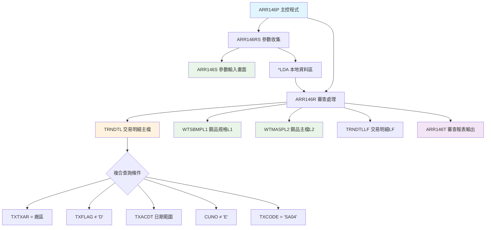
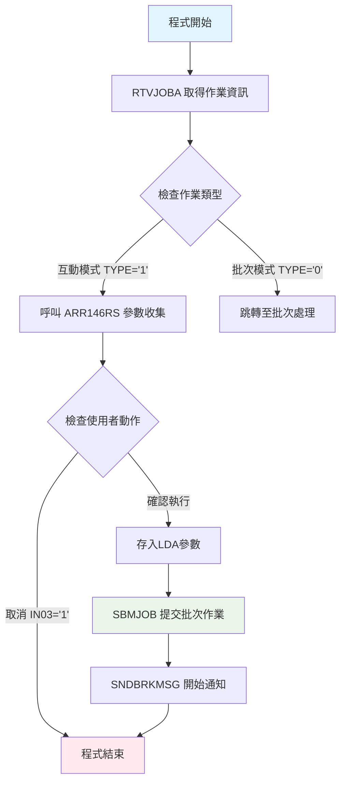
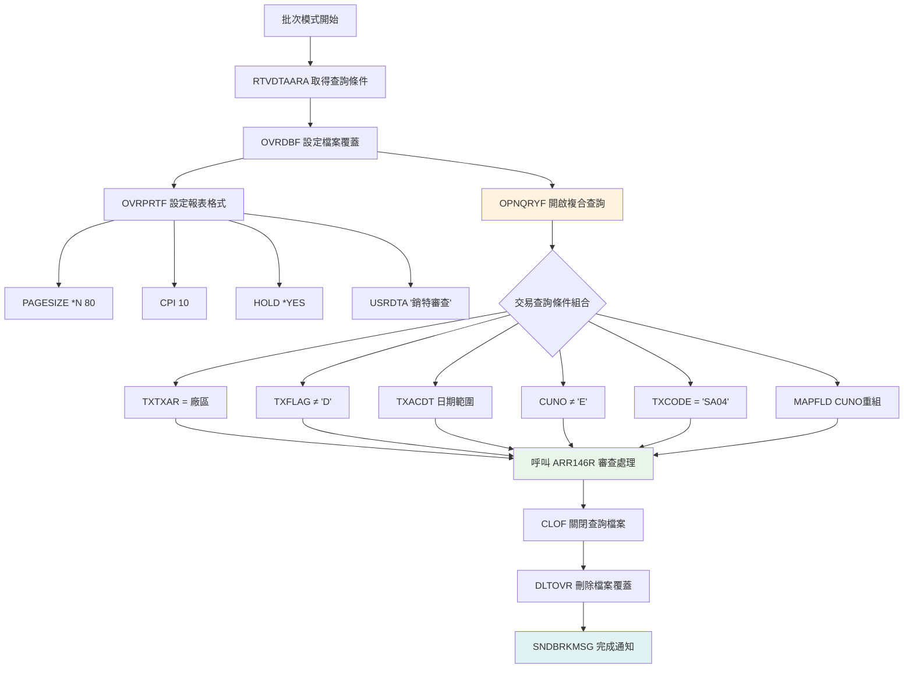
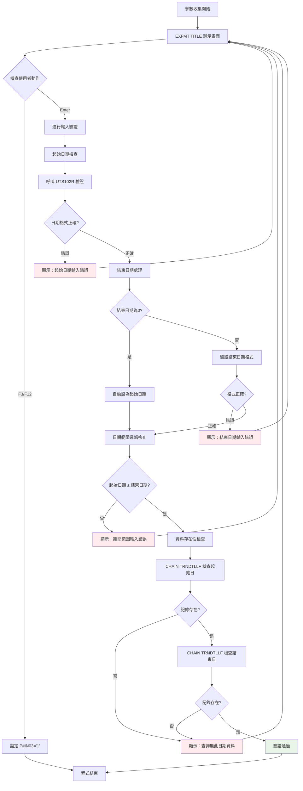

# ARR146P_U01 程式規格書

## 1. 基本資料

| 項目 | 內容 |
|------|------|
| **程式編號** | ARR146P |
| **程式名稱** | 銷貨金額及特級審查表系統 |
| **程式類型** | CLP (Control Language Program) |
| **廠區** | U01 |
| **系統名稱** | 應收帳款管理系統 |
| **子系統** | 應收帳款報表子系統 |
| **檔案位置** | U01CLSRC_THSRC/ARR146P.txt |

## 2. 程式功能說明

### 主要功能
ARR146P為銷貨金額及特級審查的報表系統，主要功能包括：

1. **銷貨交易審查**：根據指定日期範圍，審查交易明細檔（TRNDTL）中的SA04銷貨交易記錄
2. **條件篩選**：透過條件邏輯篩選需要審查的銷貨記錄
3. **產品規格驗證**：對照鋼品規格主檔（WTSBMPL1、WTMASPL2）驗證產品規格
4. **報表輸出**：產生80欄寬度的報表，協助品質管控

### 業務流程說明
此程式用於銷貨品質管控和審查作業，協助品質控制人員：
- 識別需要審查的銷貨交易記錄
- 驗證產品規格與標準規格的一致性
- 發現產品規格異常或錯誤
- 提供異常記錄清單
- 支援產品品質追蹤和管控決策

## 3. 檔案架構與關聯圖

### 使用檔案清單

| 檔案名稱 | 檔案類型 | 使用方式 | 說明 |
|---------|---------|---------|------|
| **ARR146S** | DSPF | 輸入 | 參數輸入畫面（入帳日期範圍）|
| **TRNDTL** | 主檔 | 讀取 | 交易明細主檔（主要數據源）|
| **WTSBMPL1** | 主檔 | 讀取 | 鋼品規格邏輯檔L1（規格驗證）|
| **WTMASPL2** | 主檔 | 讀取 | 鋼品主檔邏輯檔L2（規格驗證）|
| **TRNDTLLF** | 主檔 | 讀取 | 交易明細邏輯檔LF（輔助查詢）|
| **ARR146T** | PRTF | 輸出 | 特級審查報表輸出檔 |

### 檔案關聯視覺化圖表



### 資料流向說明

1. **參數收集階段**：ARR146RS 透過 ARR146S 畫面收集入帳日期範圍條件，並存入 *LDA
2. **資料篩選階段**：從 TRNDTL 主檔讀取符合條件的SA04銷貨交易記錄
3. **規格驗證階段**：ARR146R 將交易記錄與 WTSBMPL1、WTMASPL2 進行規格對照驗證
4. **報表產生階段**：產生 ARR146T 特級審查報表，列出需要審查的異常記錄

## 4. 檔案欄位規格說明

### 主要資料結構

#### TRNDTL 交易明細檔案關鍵欄位
```
關鍵欄位擷取：
- TXACDT：入帳日期（查詢條件）
- TXNO：交易單號（L1控制）
- TXCODE：交易代碼（限定SA04）
- TXTXAR：廠辦別（廠區篩選）
- TXFLAG：處理旗標（排除已刪除）
- TXCUNO：客戶號碼（排除外銷客戶E）
- TXORNO：訂單號碼
- TXPDNM：產品代號
- TXQTY：數量
- TXRESV：保留欄位（規格資訊）
```

#### 欄位切割技術詳解
```
TXNO 交易單號切割：
├── D#AREA (位置1)：廠區代碼
├── D#VNO1 (位置2-3)：單號前綴
└── D#VNO2 (位置4-8)：單號序號

TXORNO 訂單號碼切割：
├── D#ORNO (位置1-6)：訂單號碼主體

TXRESV 保留欄位切割：
├── D#VRTM (位置13-14)：版次代碼
├── D1VRTM (位置13-14)：版次代碼（修正版）
├── D#PDS1 (位置19-21)：產品規格1
└── D#WTMK (位置22)：標記碼
```

### 欄位定義表格

| 欄位名稱 | 資料型態 | 長度 | 說明 | 特殊處理 |
|---------|---------|------|------|---------|
| **TXACDT** | DECIMAL | 8,0 | 入帳日期 | 查詢條件 |
| **TXNO** | CHAR | 8 | 交易單號 | L1控制欄位 |
| **TXCODE** | CHAR | 4 | 交易代碼 | 限定'SA04'銷貨 |
| **TXTXAR** | CHAR | 1 | 廠辦別 | 廠區篩選條件 |
| **TXCUNO** | CHAR | 6 | 客戶號碼 | 排除'E'外銷客戶 |
| **TXORNO** | CHAR | 6 | 訂單號碼 | 規格驗證關聯 |
| **TXPDNM** | CHAR | 5 | 產品代號 | 規格驗證關聯 |
| **D#VRTM** | DECIMAL | 2,0 | 版次代碼 | 審查欄位 |
| **D#PDS1** | CHAR | 3 | 產品規格1 | 規格對照用 |
| **D#WTMK** | CHAR | 1 | 標記碼 | 'A'=需要審查 |

### 欄位挪用分析

#### LDA本地資料區使用
```
位置 1-8 (8位元): 查詢起始日期 (R#DATS)
位置 11-18 (8位元): 查詢結束日期 (R#DATE)
位置 21-30 (10位元): 設備名稱 (DEVNM)
位置 951-985 (35位元): 公司名稱 (COMP)
位置 1001-1010 (10位元): 使用者代號 (U#USID)
位置 1011-1020 (10位元): 設備名稱 (DEVNM)
位置 1021 (1位元): 廠區別 (R#AREA)
```

#### 特殊欄位處理邏輯
1. **版次代碼修正處理**（1105A修改）：
   ```rpg
   IF D1VRTM = *BLANKS THEN
       D#VRTM = 0
   ```

2. **MAPFLD動態欄位重組**：
   ```sql
   MAPFLD((CUNO '%SST(TXCUNO 1 1)'))  -- 提取客戶代碼首位
   ```

## 5. 輸出/入螢幕布局

### ARR146S 參數輸入畫面

```
┌─────────────────────────────────────────────────────────────────────────────┐
│ 12/26/24      東森鋼鐵股份有限公司各廠區                         ARR146S   │
│              銷貨金額及特級審查表系統                                      │
│                                                           DEVNAME01         │
│                                                                             │
│                                                                             │
│                                                                             │
│                廠區：U                                                      │
│                                                                             │
│                入帳起日：[____/__/__]                                       │
│                                                                             │
│                至    日：[____/__/__]                                       │
│                                                                             │
│                                                                             │
│                                                                             │
│                                                                             │
│                                                                             │
│                                                                             │
│                                                                             │
│                                                                             │
│                                                                             │
│                                                                             │
│ [錯誤訊息顯示區域]                                                          │
│ ENTER:確認     PF03:結束                                                   │
└─────────────────────────────────────────────────────────────────────────────┘
```

### 欄位配置說明
- **入帳起日輸入**：8位數字，格式 YYYY/MM/DD
- **至日輸入**：8位數字，格式 YYYY/MM/DD，預設與起日相同
- **日期驗證**：呼叫 UTS102R 進行日期格式驗證
- **邏輯驗證**：確保起日 ≤ 至日
- **資料存在驗證**：檢查TRNDTLLF中是否有對應日期的交易記錄

### 功能鍵定義
| 功能鍵 | 說明 | 處理方式 |
|--------|------|---------|
| **F3** | 結束作業 | 設定 *IN03='1'，返回上層 |
| **F12** | 回到上層 | 設定 *IN03='1'，返回上層 |
| **Enter** | 確認執行 | 驗證輸入後提交批次作業 |

## 6. 處理流程程序說明

### 主程序邏輯分析

#### 第一階段：作業模式判定與參數收集


#### 第二階段：交易數據篩選與處理


### 子程序邏輯分析

#### ARR146RS 參數收集程式邏輯


#### ARR146R 特級審查邏輯
1. **多層級Control Level處理**：
   - L2 Level：入帳日期層級（TXACDT）
   - L1 Level：交易單號層級（TXNO）
   - Detail Level：明細資料處理

2. **核心審查邏輯**（SR1000子程序）：
   ```rpg
   -- 版次代碼修正（1105A）
   IF D1VRTM = *BLANKS THEN D#VRTM = 0
   
   -- 標記碼檢查
   IF D#WTMK = 'A' THEN {
       構建查詢鍵值：
       W#AREA = D#AREA
       W#VNO1 = D#VNO1  
       W#VNO2 = D#VNO2
       W#SQIT = D#VRTM
       
       進行規格驗證查詢
   }
   ```

3. **規格驗證邏輯**：
   ```rpg
   -- 主要驗證：WTSBMPL1查詢
   KEY01 CHAIN WTSBMPL1
   IF NOT FOUND THEN EXSR SR1100 (列印異常)
   
   -- 次要驗證：WTMASPL2查詢  
   IF FOUND THEN {
       KEY02 CHAIN WTMASPL2
       IF NOT FOUND THEN EXSR SR1100 (列印異常)
       
       -- 進一步條件檢查
       檢查產品類型、重量、訂單號、產品名稱、規格編號
   }
   ```

4. **異常條件判定**（1108A強化邏輯）：
   ```rpg
   -- 特殊規格處理
   IF D#PDS1 = '130' AND W7SPE1 ≠ '01300' AND W7SPE1 ≠ '130  '
       THEN 列為異常
   IF D#PDS1 = '150' AND W7SPE1 ≠ '01500' AND W7SPE1 ≠ '150  '  
       THEN 列為異常
   IF D#PDS1 ≠ W7SPE1 AND D#PDS1 ≠ '130' AND D#PDS1 ≠ '150'
       THEN 列為異常
   ```

### 🎯 特殊邏輯處理

#### 複合查詢條件邏輯
```sql
-- TRNDTL 主要查詢條件
TXTXAR  *EQ "廠區代碼"         -- 廠區限定
*AND TXFLAG  *NE "D"          -- 排除已刪除記錄
*AND TXACDT *EQ %RANGE(起始日期 結束日期)  -- 日期範圍
*AND CUNO    *NE "E"          -- 排除外銷客戶  
*AND TXCODE *EQ "SA04"        -- 限定銷貨交易

-- 動態欄位重組
MAPFLD((CUNO '%SST(TXCUNO 1 1)'))  -- 客戶代碼首位提取
```

#### 版次代碼處理算法
```
版次代碼處理邏輯（1105A修改）：
├── 讀取 TXRESV 位置13-14 → D1VRTM
├── 檢查 D1VRTM 是否為空白
├── 如為空白：設定 D#VRTM = 0
└── 如非空白：D#VRTM = D1VRTM

用途：解決版次號碼無法正確判別的BUG
```

#### 產品規格驗證算法
```
規格驗證流程：
1. 標記碼檢查：D#WTMK = 'A' (需要審查標記)
2. 建立查詢鍵值：廠區+單號前綴+序號+版次
3. 主檔查詢：WTSBMPL1 (鋼品規格檔L1)
4. 輔助查詢：WTMASPL2 (鋼品主檔L2)  
5. 條件比對：產品類型、重量、規格編號
6. 異常識別：不符合條件的記錄列入報表

特殊處理（1108A強化）：
├── 130規格：允許'01300'或'130  '
├── 150規格：允許'01500'或'150  '
└── 其他規格：必須完全匹配
```

## 7. 備註

1. **異常識別機制**：
   - 標記檢查：透過D#WTMK='A'識別需審查記錄
   - 驗證邏輯：WTSBMPL1 + WTMASPL2雙重驗證
   - 規格處理：130/150規格的匹配邏輯

2. **資料驗證**：
   - 版次代碼修正：1105A修改解決版次判別問題
   - 存在性檢查：參數輸入時檢查資料存在性
   - 格式驗證：UTS102R日期格式驗證

3. **條件篩選邏輯**：
   - 排除外銷客戶：排除客戶代碼'E'開頭的記錄
   - 限定銷貨交易：處理SA04類型交易
   - 日期範圍：支援單日或期間範圍查詢

### 技術注意事項

1. **核心業務規則**：
   - 審查範圍：限定SA04銷貨交易，排除外銷客戶和已刪除記錄
   - 規格驗證：透過WTSBMPL1和WTMASPL2進行規格驗證
   - 異常識別：基於標記碼和規格比對結果識別異常記錄
   - 特殊規格：130/150規格的匹配邏輯

2. **系統整合**：
   - 檔案整合：整合TRNDTL、WTSBMPL1、WTMASPL2等檔案
   - 2022年程式：新開發的品質管理工具
   - 修改追蹤：完整的修改歷史和問題解決記錄 