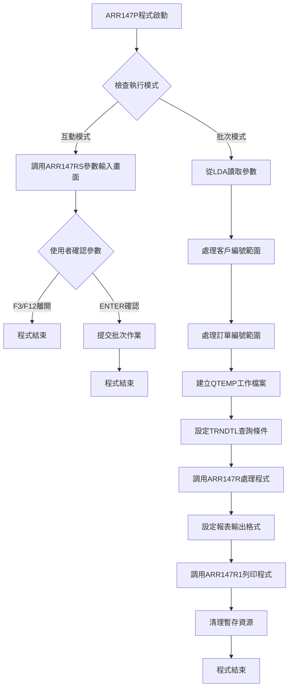
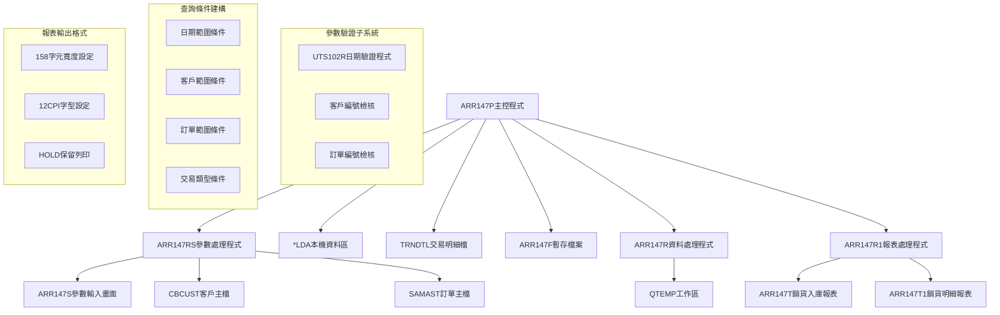
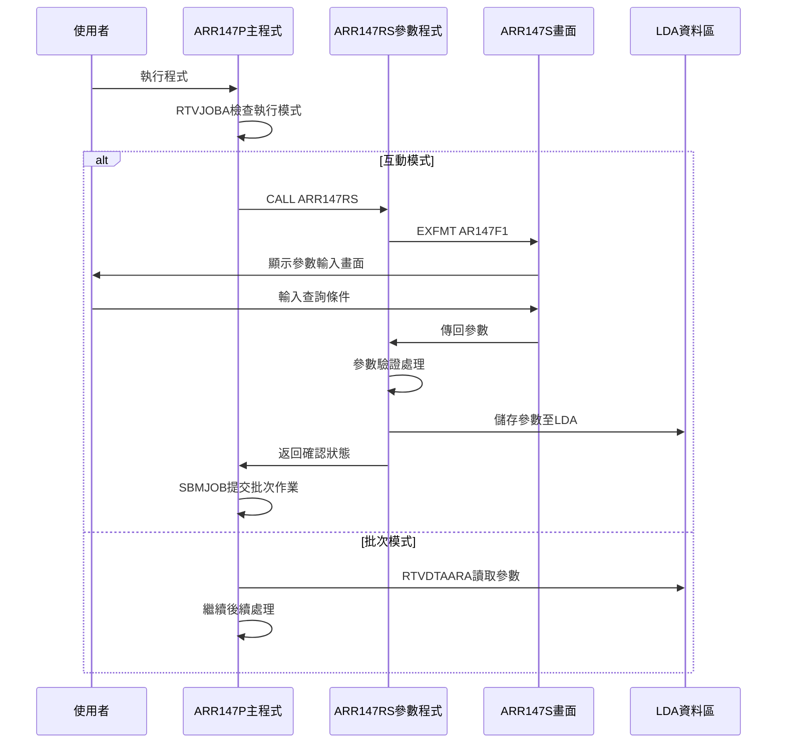
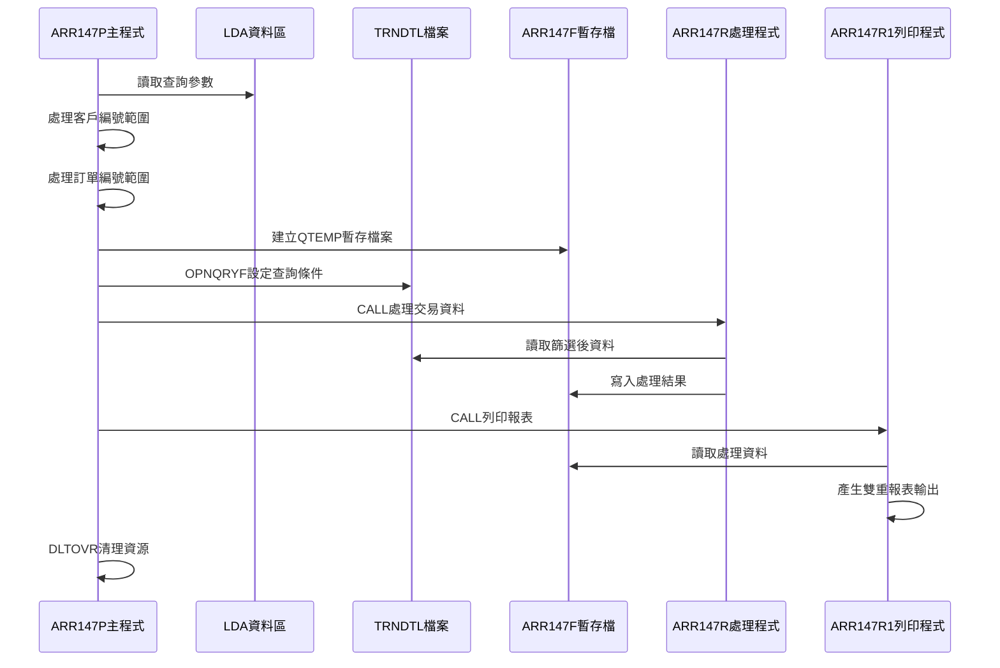
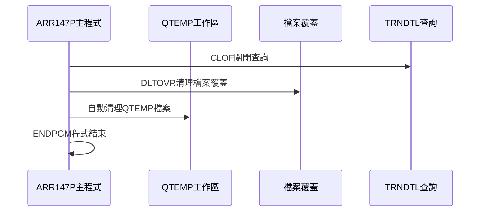
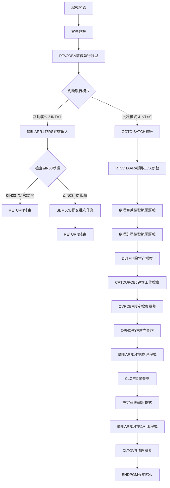

# ARR147P_U01 程式規格書

## 1. 基本資料

| 項目 | 內容 |
|------|------|
| **程式編號** | ARR147P |
| **程式名稱** | 銷貨業務清單表格報表作業 |
| **程式類型** | CLP (Control Language Program) |
| **廠區** | U01 |
| **系統名稱** | 應收帳款管理系統 |
| **子系統** | 應收帳款報表子系統 |
| **檔案位置** | U01CLSRC_THSRC/ARR147P.txt |

## 2. 🎯 程式功能說明

### 主要功能描述
ARR147P為銷貨業務清單表格報表作業系統，主要功能包括：

1. **銷貨交易資料查詢**：從交易明細檔（TRNDTL）中篩選SA04銷貨交易記錄
2. **多重條件篩選**：根據日期範圍、客戶編號、訂單編號等條件進行資料篩選
3. **雙重報表輸出**：產生銷貨入庫和銷貨明細兩種格式的報表
4. **參數化查詢**：透過畫面程式收集查詢條件，支援彈性查詢需求

### 🎯 業務流程詳細說明

#### 完整業務流程圖


#### 業務流程關鍵階段說明

**階段1：執行模式判斷與參數收集**
- 程式檢查執行類型，互動模式調用ARR147RS收集參數
- 驗證查詢日期範圍，確保開始日期不大於結束日期
- 檢核客戶編號和訂單編號的有效性
- 設定銷貨類型和發票開立狀態等篩選條件

**階段2：多層次驗證機制**
- 日期格式驗證：調用UTS102R程式進行日期有效性檢查
- 客戶編號驗證：透過CBCUST檔案確認客戶存在性
- 訂單編號驗證：透過SAMAST檔案檢查訂單有效性
- 參數完整性檢查：確保必要條件不可同時為空白

**階段3：智能處理邏輯**
- 自動範圍設定：空白條件自動設為全範圍（000000-999999）
- 單一條件處理：非空白條件設定為相同的起迄值
- 工作檔案管理：建立QTEMP/ARR147F暫存檔案
- 查詢最佳化：透過OPNQRYF建立高效查詢條件

**階段4：資料一致性確保機制**
- 交易記錄篩選：排除已刪除（TXFLAG<>'D'）的記錄
- 特定交易類型：只處理SA04銷貨交易記錄
- 日期範圍控制：確保查詢範圍在指定期間內
- 資料完整性：透過KEYFLD排序確保資料一致性

## 3. 🎯 檔案架構與關聯圖

### 使用檔案清單

| 檔案名稱 | 檔案類型 | 使用方式 | 說明 |
|----------|----------|----------|------|
| ARR147RS | RPG程式 | CALL | 參數輸入處理程式 |
| ARR147S | 畫面檔 | DSPF | 參數輸入畫面檔案 |
| ARR147R | RPG程式 | CALL | 資料處理程式 |
| ARR147R1 | RPG程式 | CALL | 報表列印程式 |
| TRNDTL | 實體檔 | OPNQRYF | 交易明細檔案（主要資料來源） |
| ARR147F | 實體檔 | QTEMP | 暫存工作檔案 |
| ARR147T | 報表檔 | PRTF | 銷貨入庫報表檔案 |
| ARR147T1 | 報表檔 | PRTF | 銷貨明細報表檔案 |
| CBCUST | 實體檔 | CHAIN | 客戶主檔（驗證用） |
| SAMAST | 實體檔 | CHAIN | 訂單主檔（驗證用） |
| *LDA | 資料區 | I/O | 本機資料區（參數傳遞） |

### 🎯 檔案關聯詳細視覺化圖表



### 🎯 資料流向詳細說明

#### 環境準備階段的資料流向


#### 業務處理階段的資料流向


#### 環境清理階段的資料流向


## 4. 🎯 檔案欄位規格說明

### 主要資料結構

#### CLP主程式變數結構
ARR147P主程式宣告的工作變數結構：

| 變數名稱 | 類型 | 長度 | 用途說明 |
|----------|------|------|----------|
| &INT | CHAR | 1 | 執行模式判斷（0=批次，1=互動） |
| &OUTQ | CHAR | 10 | 輸出佇列名稱 |
| &IN03 | LGL | 1 | F3功能鍵狀態指示器 |
| &DATS | CHAR | 8 | 查詢開始日期（YYYYMMDD格式） |
| &DATE | CHAR | 8 | 查詢結束日期（YYYYMMDD格式） |
| &CUNS | CHAR | 6 | 客戶編號查詢範圍起始值 |
| &CUNE | CHAR | 6 | 客戶編號查詢範圍結束值 |
| &CUNO | CHAR | 6 | 指定客戶編號 |
| &ORNS | CHAR | 6 | 訂單編號查詢範圍起始值 |
| &ORNE | CHAR | 6 | 訂單編號查詢範圍結束值 |
| &ORNO | CHAR | 6 | 指定訂單編號 |
| &MSMN | CHAR | 10 | 銷貨員編號 |
| &AREA | CHAR | 1 | 銷貨區域代碼 |
| &INVT | CHAR | 1 | 發票開立狀態 |

#### LDA資料區切割定義
```
*LDA (1024字元總長度)：[系統區|參數區塊|保留區塊|其他系統資訊]
位置範圍：001─────────401──────────452───────────1024
         ↓         ↓        ↓         ↓
系統資訊區:      [.....................]
參數傳遞區:                [PPPPPPPPPP]
保留區域:                           [.....................]
         
參數區塊詳細切割：
位置401-408: [DDDDDDDD]              查詢開始日期（YYYYMMDD）
位置411-418:         [DDDDDDDD]      查詢結束日期（YYYYMMDD）
位置421-426:                 [CCCCCC] 客戶編號
位置431-436:                       [OOOOOO] 訂單編號
位置441-450:                             [SSSSSSSSSS] 銷貨員編號
位置451-451:                                       [A] 銷貨區域
位置452-452:                                        [I] 發票類型
```

#### ARR147RS程式DS結構定義
ARR147RS程式中的客戶編號切割結構：

```
DS結構定義：
     I            DS
     I                                        1   6 D1CUNO
     I                                        1   1 S1KIND
     I                                        2   2 S1CUN1
     I                                        3   5 S1CUN2
     I                                        6   6 S1CD01

D1CUNO (6字元總長度)：[K|N|NNN|C]
位置範圍：            1 2 3-5 6
                     ↓ ↓ ↓   ↓
S1KIND (1字元)：     [K]           客戶類型代碼
S1CUN1 (1字元)：      [N]          客戶分類碼
S1CUN2 (3字元)：       [NNN]       客戶序號
S1CD01 (1字元)：           [C]      檢查碼
```

#### OPNQRYF查詢欄位對應結構
TRNDTL檔案查詢中的欄位對應定義：

```
MAPFLD對應關係：
MAPFLD((ORNO '%SST(TXORNO 1 6)'))

TXORNO原始欄位：[OOOOOOXXXX]（10字元）
                ↓      ↓
ORNO對應欄位：   [OOOOOO]    （6字元，取前6位）

用途：從10字元的TXORNO欄位中擷取前6個字元作為ORNO進行比對
原因：配合查詢條件中的訂單編號範圍比較
```

### 🔍 重點欄位切割技術詳解

#### DS結構完整分析

**1. LDA參數區塊切割技術**
```
LDA參數切割視覺化（52字元）：
位置: 401   411   421   431   441       451 452
     [8碼][8碼][6碼][6碼][10碼字元][1][1]
     開始  結束  客戶  訂單  銷貨員    區域發票
     日期  日期  編號  編號  編號      代碼類型
```

**2. 客戶編號DS切割技術**
```
D1CUNO客戶編號切割（6字元）：
位置: 1 2 3 4 5 6
     [T|C|N|N|N|X]
     ↓ ↓ ↓     ↓
類型: K C 1 2 3 檢查碼
用途: 客戶分類序號檢核
```

**3. MAPFLD欄位對應技術**
```
TXORNO → ORNO 欄位對應：
原始: [O|O|O|O|O|O|X|X|X|X] (10字元)
     ↓           ↓
擷取: [O|O|O|O|O|O]         (6字元)
位置: 1 2 3 4 5 6
功能: 訂單編號前6位比對
```

#### 欄位切割視覺化展示

**LDA參數區塊完整切割圖**
```
LDA參數區塊 (52字元)：[DDDDDDDD|DDDDDDDD|CCCCCC|OOOOOO|SSSSSSSSSS|A|I]
位置範圍：            401    411    421    431    441        451 452
                     ↓      ↓      ↓      ↓      ↓          ↓ ↓
開始日期(8字元)：     [DDDDDDDD]                              查詢起始日期
結束日期(8字元)：            [DDDDDDDD]                      查詢結束日期
客戶編號(6字元)：                   [CCCCCC]                 客戶篩選條件
訂單編號(6字元)：                          [OOOOOO]          訂單篩選條件
銷貨員(10字元)：                                  [SSSSSSSSSS] 銷貨員篩選
銷貨區域(1字元)：                                            [A] 區域代碼
發票類型(1字元)：                                             [I] 發票狀態
```

**客戶編號DS切割細節圖**
```
D1CUNO客戶編號 (6字元)：[T|C|N|N|N|X]
位置：                   1 2 3 4 5 6
                        ↓ ↓ ↓   ↓
S1KIND (位置1)：        [T]         客戶類型（個人/企業）
S1CUN1 (位置2)：         [C]        客戶分類（VIP/一般）
S1CUN2 (位置3-5)：        [NNN]     客戶序號（001-999）
S1CD01 (位置6)：             [X]    檢查碼（驗證用）
```

#### 切割邏輯詳細說明

**1. LDA參數切割邏輯**
- **位置計算方式**：基準位置 + 欄位長度 = 下一欄位起始位置
- **讀取指令**：RTVDTAARA DTAARA(*LDA (起始位置 長度)) RTNVAR(變數)
- **寫入指令**：在ARR147RS程式中透過UDS結構寫入LDA對應位置
- **資料格式**：固定長度字元格式，空白填充

**2. 客戶編號DS切割邏輯**
- **重疊定義方式**：同一記憶體區域定義多個欄位名稱
- **位置重疊**：D1CUNO與S1KIND都指向位置1，實現資料共享
- **用途分離**：D1CUNO用於完整客戶編號，S1xxx用於個別欄位存取
- **驗證邏輯**：透過S1CD01檢查碼驗證客戶編號格式正確性

**3. MAPFLD對應邏輯**
- **字串擷取功能**：%SST(來源欄位, 起始位置, 長度)
- **動態欄位建立**：OPNQRYF建立查詢時動態產生ORNO欄位
- **比對最佳化**：避免使用%SST函數進行條件比對，提升查詢效能
- **索引利用**：建立的ORNO欄位可利用原始檔案索引結構

#### 實際數據範例說明

**LDA參數資料範例**
```
實際LDA內容（位置401-452）：
"2024010120241231CUST01ORDER1SALES001UV"

切割解析結果：
- &DATS = "20240101"    (位置401-408：查詢開始日期)
- &DATE = "20241231"    (位置411-418：查詢結束日期)
- &CUNO = "CUST01"      (位置421-426：指定客戶編號)
- &ORNO = "ORDER1"      (位置431-436：指定訂單編號) 
- &MSMN = "SALES001"    (位置441-450：銷貨員編號)
- &AREA = "U"           (位置451：銷貨區域代碼)
- &INVT = "V"           (位置452：發票開立狀態)
```

**客戶編號DS切割範例**
```
客戶編號輸入：S#CUNO = "C1001X"

DS切割結果：
- D1CUNO = "C1001X"     (完整客戶編號)
- S1KIND = "C"          (企業客戶)
- S1CUN1 = "1"          (VIP客戶) 
- S1CUN2 = "001"        (客戶序號001)
- S1CD01 = "X"          (檢查碼X)

驗證邏輯：
IF S1KIND = 'C' AND S1CUN2 > '000' AND S1CD01 <> ' '
  客戶編號格式正確
ELSE
  客戶編號格式錯誤
```

**MAPFLD欄位對應範例**
```
TRNDTL檔案原始資料：
TXORNO = "ORDER12345"

MAPFLD處理結果：
ORNO = "ORDER1"         (擷取前6字元)

查詢條件使用：
WHERE ORNO >= "ORDER1" AND ORNO <= "ORDER1"
(實現單一訂單查詢)
```

### 🎯 欄位挪用詳細分析

#### 挪用情況對比表

| 欄位名稱 | 原始定義 | 實際使用方式 | 挪用類型 | 影響程度 |
|----------|----------|-------------|----------|----------|
| &AREA | 單一銷貨區域 | 多廠區標識（U/V/Q/M/N/K/O/X/R/D） | 功能擴展挪用 | 中等 |
| &INVT | 發票類型分類 | 三態發票狀態（Y=已開/N=未開/空白=全部） | 語意轉換挪用 | 低 |
| &CUNS/&CUNE | 內部範圍變數 | 動態客戶範圍設定（空白自動全範圍） | 邏輯擴展挪用 | 高 |
| &ORNS/&ORNE | 內部範圍變數 | 動態訂單範圍設定（空白自動全範圍） | 邏輯擴展挪用 | 高 |
| S1KIND | 客戶類型欄位 | 區域代碼暫存（ARR147RS程式內） | 暫存空間挪用 | 低 |

#### 挪用原因深度分析

**1. &AREA欄位挪用原因**
- **歷史原因**：原系統設計時只考慮單一廠區，後續擴展至多廠區
- **技術原因**：避免修改既有參數結構，減少程式變更影響
- **業務原因**：不同廠區有不同的銷貨處理邏輯需求
- **效能原因**：單一欄位篩選比多欄位組合篩選效能更好

**2. &INVT欄位挪用原因**
- **需求變更**：從分類需求變更為狀態查詢需求
- **介面一致性**：保持使用者操作介面的一致性
- **程式相容性**：避免影響其他使用相同參數的程式
- **維護便利性**：減少參數結構變更的維護成本

**3. 範圍變數挪用原因**
- **查詢彈性**：提供單一查詢和範圍查詢的雙重功能
- **程式簡化**：一套邏輯處理多種查詢需求
- **效能最佳化**：透過範圍設定最佳化SQL查詢條件
- **使用者體驗**：空白表示全部的直觀操作方式

#### 挪用方式詳細說明

**1. 語意擴展挪用（&AREA欄位）**
```
原始設計：&AREA = 'U'（U01廠區）
挪用後：  &AREA ∈ {'U','V','Q','M','N','K','O','X','R','D'}

實現方式：
IF &AREA = 'U' THEN 處理U01廠區邏輯
ELSEIF &AREA = 'V' THEN 處理特殊邏輯
ELSEIF &AREA = 'Q' THEN 處理品質邏輯
...其他廠區邏輯
```

**2. 狀態控制挪用（&INVT欄位）**
```
原始設計：&INVT = '1'（發票類型1）
挪用後：  &INVT ∈ {'Y','N',' '}

實現方式：
CASE &INVT
  WHEN 'Y' : 查詢已開立發票
  WHEN 'N' : 查詢未開立發票  
  WHEN ' ' : 查詢全部發票
END
```

**3. 範圍生成挪用（&CUNS/&CUNE變數）**
```
原始設計：單一客戶查詢
挪用後：  智能範圍查詢

實現邏輯：
IF &CUNO = '      ' THEN
  &CUNS = '      '    -- 最小值
  &CUNE = '999999'    -- 最大值
ELSE
  &CUNS = &CUNO       -- 相同值
  &CUNE = &CUNO       -- 相同值
END

SQL效果：
WHERE CUNO >= &CUNS AND CUNO <= &CUNE
```

#### 挪用影響評估

**正面影響分析**
- **功能彈性提升**：單一程式支援多種查詢需求
- **維護成本降低**：避免建立多個類似程式
- **使用者體驗改善**：提供更直觀的操作方式
- **系統擴展性**：為未來需求變更預留彈性空間

**負面影響分析**
- **程式複雜度增加**：需要理解挪用邏輯才能維護
- **文檔要求提高**：需要詳細記錄挪用方式和原因
- **測試範圍擴大**：需要測試所有挪用情況的組合
- **新人學習成本**：需要額外時間理解挪用設計

**維護注意事項**
- **挪用邏輯文檔化**：詳細記錄每個挪用的原因和方式
- **測試案例完整性**：確保所有挪用組合都有對應測試
- **程式註解充分性**：在關鍵挪用點添加詳細註解
- **變更影響評估**：修改挪用欄位時評估對其他功能的影響

### 檔案欄位對應關係表

#### TRNDTL查詢欄位對應
| 查詢條件欄位 | 對應檔案欄位 | 欄位說明 | 使用方式 |
|-------------|-------------|----------|----------|
| TXFLAG | TXFLAG | 交易旗標 | 條件篩選（≠'D'） |
| TXCODE | TXCODE | 交易代碼 | 條件篩選（='SA04'） |
| TXDATE | TXDATE | 交易日期 | 範圍條件（≥&DATS ≤&DATE） |
| ORNO | TXORNO | 訂單編號 | 範圍條件（經%SST切割） |
| TXCUNO | TXCUNO | 客戶編號 | 範圍條件（≥&CUNS ≤&CUNE） |

#### 畫面欄位與變數對應
| 畫面欄位 | CLP變數 | LDA位置 | 資料格式 | 驗證規則 |
|----------|---------|---------|----------|----------|
| S#DATS | &DATS | 401-408 | YYYYMMDD | 日期格式+邏輯檢查 |
| S#DATE | &DATE | 411-418 | YYYYMMDD | 日期格式+邏輯檢查 |
| S#CUNO | &CUNO | 421-426 | 6位字元 | 客戶檔案存在性檢查 |
| S#ORNO | &ORNO | 431-436 | 6位字元 | 訂單檔案存在性檢查 |
| S#MSMN | &MSMN | 441-450 | 10位字元 | 空白允許 |
| S#AREA | &AREA | 451 | 1位字元 | 限定值檢查 |
| S#INVT | &INVT | 452 | 1位字元 | 限定值檢查 |

## 5. 🎯 輸出/入螢幕布局

### 螢幕布局完整視覺化

```
+----------------------------------------------------------+
|2024/12/30  東鋼鋼鐵股份有限公司           ARR147S        |
+----------------------------------------------------------+
|14:30:25    銷貨業務清單表格報表作業       TERMINAL01     |
+----------------------------------------------------------+
|                                                          |
|     請輸入查詢條件:                                       |
|                                                          |
|                    查詢期間:[2024/01/01]至[2024/12/31]   |
|                                                          |
|                    客戶編號:[      ] (空白查詢全部)      |
|                                                          |
|                    訂單編號:[      ] (空白查詢全部)      |
|                                                          |
|                    銷貨員:[          ] (空白查詢全部)    |
|                                                          |
|                    銷貨系統:[U] (U=製造V=特殊X=其他      |
|                         O=外銷R=內銷M=維修K=代工空白全部)|
|                                                          |
|                    發票開立:[ ] (Y=已開立N=未開立        |
|                                  空白查詢全部)           |
|                                                          |
|                                                          |
|                                                          |
|                                                          |
|[錯誤訊息顯示區]                                          |
|F3:離開              F12:回前頁面          ENTER:確認     |
+----------------------------------------------------------+
```

### 🎯 畫面欄位詳細說明

| 欄位名稱 | 位置 | 長度 | 型態 | 屬性 | 說明 |
|----------|------|------|------|------|------|
| S#DATS | 6,30 | 8 | 數值 | 必填 | 查詢開始日期，YYYY/MM/DD格式 |
| S#DATE | 6,47 | 8 | 數值 | 必填 | 查詢結束日期，YYYY/MM/DD格式 |
| S#CUNO | 8,30 | 6 | 字元 | 選填 | 客戶編號，空白表示查詢全部 |
| S#ORNO | 10,30 | 6 | 字元 | 選填 | 訂單編號，空白表示查詢全部 |
| S#MSMN | 12,30 | 10 | 字元 | 選填 | 銷貨員編號，空白表示查詢全部 |
| S#AREA | 14,30 | 1 | 字元 | 選填 | 銷貨系統代碼，限定值 |
| S#INVT | 17,30 | 1 | 字元 | 選填 | 發票開立狀態，限定值 |
| S#MSG1 | 24,2 | 70 | 字元 | 唯讀 | 錯誤訊息顯示欄位 |

### 🎯 畫面控制邏輯

#### 指示器控制說明
- **41指示器**：S#DATS欄位錯誤時亮起，顯示反白保護
- **42指示器**：S#DATE欄位錯誤時亮起，顯示反白保護
- **43指示器**：S#CUNO欄位錯誤時亮起，顯示反白保護
- **44指示器**：S#ORNO欄位錯誤時亮起，顯示反白保護
- **99指示器**：一般錯誤狀態，用於控制錯誤處理流程

#### 欄位顯示屬性
- **必填欄位**：使用DSPATR(RI PC)屬性，錯誤時反白顯示
- **選填欄位**：使用DSPATR(UL)屬性，底線顯示
- **唯讀欄位**：系統資訊欄位，僅顯示不可輸入
- **訊息欄位**：使用DSPATR(HI)屬性，高亮度顯示

### 功能鍵詳細定義

| 功能鍵 | 處理邏輯 | 系統行為 |
|--------|----------|----------|
| **F3** | 設定*IN03='1'並結束程式 | 立即離開，不儲存任何資料 |
| **F12** | 設定*IN12='1'並結束程式 | 返回前一個畫面或程式 |
| **ENTER** | 執行參數驗證並繼續處理 | 驗證通過後進入報表處理 |

### 操作流程

1. **畫面顯示**：系統顯示AR147F1參數輸入畫面
2. **參數輸入**：使用者輸入查詢條件
3. **按鍵處理**：
   - F3/F12：結束程式
   - ENTER：進行參數驗證
4. **驗證處理**：系統檢查輸入參數的有效性
5. **錯誤處理**：顯示錯誤訊息並重新輸入
6. **確認處理**：驗證通過後進入批次處理

## 6. 🎯 處理流程程序說明

### 🎯 主程序邏輯深度分析

#### 程式執行流程圖


#### 🎯 詳細處理步驟逐一分析

**步驟1：程式初始化處理**
```
動作：宣告14個工作變數
目的：建立程式執行所需的記憶體空間
邏輯：依序宣告字元型、邏輯型變數，準備參數處理環境
```

**步驟2：執行環境判斷**
```
動作：RTVJOBA OUTQ(&OUTQ) TYPE(&INT)
目的：取得作業屬性，判斷執行模式
邏輯：&INT='0'表示批次執行，&INT='1'表示互動執行
條件：IF COND(&INT *EQ '0') THEN(GOTO BATCH)
```

**步驟3：互動模式參數收集**
```
動作：CALL PGM(ARR147RS) PARM(&IN03)
目的：調用參數輸入程式收集查詢條件
邏輯：顯示畫面供使用者輸入參數
返回：&IN03='1'表示使用者按F3離開
```

**步驟4：批次作業提交**
```
動作：SBMJOB JOB(ARR147P) JOBD(ARJOBD)
目的：將程式以批次模式重新執行
邏輯：使用ARJOBD作業描述，指定輸出佇列
參數：RQSDTA('CALL ARR147P')重新調用本程式
```

**步驟5：批次模式參數讀取**
```
動作：RTVDTAARA DTAARA(*LDA (401 8)) RTNVAR(&DATS)
目的：從LDA讀取互動模式儲存的參數
邏輯：依序讀取位置401-452的7個參數值
資料：日期、客戶、訂單、銷貨員、區域、發票類型
```

**步驟6：客戶編號範圍處理**
```
條件1：IF COND(&CUNO *EQ '      ') THEN
動作1：CHGVAR VAR(&CUNS) VALUE('      ')
動作2：CHGVAR VAR(&CUNE) VALUE('999999')
邏輯：空白客戶編號設定為全範圍查詢

條件2：IF COND(&CUNO *NE '      ') THEN  
動作1：CHGVAR VAR(&CUNS) VALUE(&CUNO)
動作2：CHGVAR VAR(&CUNE) VALUE(&CUNO)
邏輯：非空白客戶編號設定為單一客戶查詢
```

**步驟7：訂單編號範圍處理**
```
條件1：IF COND(&ORNO *EQ '      ') THEN
動作1：CHGVAR VAR(&ORNS) VALUE('      ')  
動作2：CHGVAR VAR(&ORNE) VALUE('999999')
邏輯：空白訂單編號設定為全範圍查詢

條件2：IF COND(&ORNO *NE '      ') THEN
動作1：CHGVAR VAR(&ORNS) VALUE(&ORNO)
動作2：CHGVAR VAR(&ORNE) VALUE(&ORNO)  
邏輯：非空白訂單編號設定為單一訂單查詢
```

**步驟8：工作檔案環境準備**
```
動作1：DLTF FILE(QTEMP/ARR147F)
目的：刪除可能存在的舊暫存檔案
監控：MONMSG MSGID(CPF0000)忽略檔案不存在錯誤

動作2：CRTDUPOBJ OBJ(ARR147F) FROMLIB(DALIB) TOLIB(QTEMP)
目的：從DALIB複製ARR147F檔案結構到QTEMP
監控：MONMSG MSGID(CPF0000)忽略複製錯誤

動作3：OVRDBF FILE(ARR147F) TOFILE(QTEMP/ARR147F)
目的：將ARR147F檔案指向QTEMP版本
```

**步驟9：交易明細查詢建立**
```
動作：OPNQRYF FILE(TRNDTL) QRYSLT(...)
查詢條件組合：
- TXFLAG *NE "D"：排除已刪除記錄
- TXCODE *EQ "SA04"：只查詢SA04銷貨交易
- TXDATE *GE &DATS：交易日期大於等於開始日期
- TXDATE *LE &DATE：交易日期小於等於結束日期  
- ORNO *GE &ORNS：訂單編號大於等於起始值
- ORNO *LE &ORNE：訂單編號小於等於結束值
- TXCUNO *GE &CUNS：客戶編號大於等於起始值
- TXCUNO *LE &CUNE：客戶編號小於等於結束值

欄位對應：MAPFLD((ORNO '%SST(TXORNO 1 6)'))
排序條件：KEYFLD((TXCUNO) (TXORNO) (TXDATE))
```

**步驟10：資料處理程式調用**
```
動作：CALL PGM(ARR147R)
目的：調用RPG程式處理篩選後的交易資料
邏輯：ARR147R讀取OPNQRYF結果，進行資料處理
輸出：處理結果寫入ARR147F暫存檔案
```

**步驟11：查詢資源清理**
```
動作1：CLOF OPNID(TRNDTL)
目的：關閉TRNDTL的OPNQRYF查詢

動作2：DLTOVR *ALL  
目的：刪除所有檔案覆蓋設定
```

**步驟12：報表輸出格式設定**
```
報表1設定：
OVRPRTF FILE(ARR147T) TOFILE(ARR147T)
PAGESIZE(*N 158)：頁面寬度158字元，長度不限
CPI(12)：每英吋12字元密度
HOLD(*YES)：報表保留在輸出佇列
USRDTA('銷貨業務')：使用者資料標識

報表2設定：
OVRPRTF FILE(ARR147T1) TOFILE(ARR147T1)  
參數相同，USRDTA('銷貨明細')
```

**步驟13：報表列印程式調用**
```
前置：OVRDBF FILE(ARR147F) TOFILE(QTEMP/ARR147F)
動作：CALL PGM(ARR147R1)
目的：調用列印程式產生雙重報表
輸入：從ARR147F讀取處理後的資料
輸出：產生ARR147T和ARR147T1兩個報表
```

**步驟14：環境清理與結束**
```
動作：DLTOVR FILE(*ALL)
目的：清理所有檔案覆蓋和報表格式設定
結果：QTEMP檔案由系統自動清理
結束：ENDPGM正常結束程式
```

#### 業務邏輯深度解析

**主要處理流程業務邏輯**
1. **雙模式設計**：支援互動參數收集和批次資料處理分離
2. **範圍查詢邏輯**：空白條件自動擴展為全範圍查詢
3. **檔案管理邏輯**：QTEMP暫存檔案確保資料隔離性
4. **查詢最佳化**：透過OPNQRYF減少I/O和提升效能

**條件判斷詳細說明**
1. **執行模式判斷**：透過RTVJOBA的TYPE參數區分互動/批次
2. **參數完整性判斷**：空白/非空白條件的不同處理邏輯
3. **使用者操作判斷**：F3/F12/ENTER的不同響應處理
4. **檔案存在性判斷**：透過MONMSG處理檔案操作異常

**變數使用和數據流向**
- **參數變數流向**：LDA → 程式變數 → 查詢條件
- **範圍變數流向**：單一條件 → 範圍條件 → SQL條件
- **控制變數流向**：使用者操作 → 指示器 → 程式流程
- **檔案變數流向**：原始檔案 → 暫存檔案 → 報表輸出

### 🎯 子程序邏輯分析

#### ARR147RS參數輸入程式
- **功能描述**：提供互動式參數輸入介面
- **參數傳遞**：透過&IN03返回使用者操作狀態
- **返回值分析**：'1'表示F3離開，'0'表示確認繼續
- **調用關係**：主程式互動模式時必須調用

#### ARR147R資料處理程式  
- **功能描述**：處理OPNQRYF篩選後的交易資料
- **參數傳遞**：透過檔案共享和LDA進行資料交換
- **返回值分析**：無直接返回值，透過ARR147F檔案輸出結果
- **調用關係**：主程式批次階段必須調用

#### ARR147R1報表列印程式
- **功能描述**：產生銷貨業務清單的雙重報表
- **參數傳遞**：透過ARR147F檔案和報表格式設定
- **返回值分析**：無直接返回值，透過報表檔案輸出
- **調用關係**：資料處理完成後調用

### 🎯 特殊邏輯處理

#### 複雜算法的步驟分解

**範圍條件生成算法**
1. **輸入分析**：檢查原始條件是否為空白
2. **邏輯判斷**：空白條件設為全範圍，非空白設為單一條件
3. **範圍生成**：將單一條件擴展為起迄範圍
4. **條件組合**：將範圍條件組合成SQL查詢條件

**檔案管理算法**
1. **清理階段**：刪除可能存在的舊暫存檔案
2. **建立階段**：從標準庫複製檔案結構到QTEMP
3. **覆蓋階段**：設定檔案覆蓋指向QTEMP版本
4. **使用階段**：透過覆蓋設定使用暫存檔案

#### 特殊業務規則的實現方式

**多條件組合查詢規則**
- 所有條件使用AND邏輯連接
- 範圍條件使用GE/LE組合實現
- 排除條件使用NE邏輯實現
- 字串比較使用字典序排序

**檔案共享機制**
- 使用SHARE(*YES)允許多程式存取
- 透過QTEMP確保作業間隔離
- 使用檔案覆蓋實現檔案重定向

#### 異常情況的處理邏輯

**檔案操作異常處理**
- 使用MONMSG MSGID(CPF0000)捕獲所有檔案錯誤
- 檔案不存在時繼續執行，不中斷程式
- 檔案複製失敗時繼續執行，依賴後續處理

**參數驗證異常處理**
- 透過ARR147RS程式進行完整參數驗證
- 驗證失敗時重新顯示輸入畫面
- 使用者取消時正常結束程式

### 🎯 錯誤處理與資料完整性控制

#### 詳細的錯誤處理邏輯

**檔案操作錯誤處理**
- 檔案刪除失敗：MONMSG忽略錯誤，繼續執行
- 檔案建立失敗：MONMSG忽略錯誤，依賴已存在檔案
- 檔案覆蓋失敗：可能影響後續處理，但不中斷程式

**程式調用錯誤處理**
- ARR147RS調用失敗：程式中斷，返回錯誤狀態
- ARR147R調用失敗：程式中斷，無法產生報表
- ARR147R1調用失敗：程式中斷，報表輸出失敗

#### 資料完整性檢查機制

**參數完整性檢查**
- 日期格式驗證：確保YYYYMMDD格式正確性
- 日期邏輯驗證：開始日期不可大於結束日期
- 編號有效性驗證：客戶和訂單編號存在性檢查

**查詢條件完整性**
- 必要條件檢查：確保至少有日期範圍條件
- 範圍邏輯檢查：起始值不可大於結束值
- 條件組合檢查：確保所有條件邏輯正確

#### 關鍵業務規則實現

**銷貨交易篩選規則**
- 只處理SA04類型的銷貨交易
- 排除已刪除（TXFLAG='D'）的記錄
- 依據日期範圍限制查詢範圍

**客戶訂單關聯規則**
- 客戶編號和訂單編號的關聯性檢查
- 支援單一客戶、單一訂單、範圍查詢
- 空白條件自動擴展為全範圍查詢

## 7. 🎯 數據操作與轉換分析

### 檔案操作詳解

#### READ/WRITE/UPDATE/DELETE的具體邏輯

**TRNDTL檔案讀取邏輯**
```
操作方式：OPNQRYF查詢讀取
存取條件：
- TXFLAG *NE "D"：排除已刪除記錄
- TXCODE *EQ "SA04"：限定銷貨交易類型
- 日期範圍條件：TXDATE *GE &DATS *AND TXDATE *LE &DATE
- 客戶範圍條件：TXCUNO *GE &CUNS *AND TXCUNO *LE &CUNE
- 訂單範圍條件：ORNO *GE &ORNS *AND ORNO *LE &ORNE

讀取順序：依TXCUNO、TXORNO、TXDATE排序
讀取方式：順序讀取，不支援隨機存取
```

**ARR147F暫存檔案寫入邏輯**
```
操作方式：透過ARR147R程式寫入
寫入時機：TRNDTL資料處理後
寫入內容：處理後的銷貨交易明細
寫入位置：QTEMP/ARR147F暫存檔案
```

#### 檔案鎖定和併發處理

**檔案共享設定**
- 使用SHARE(*YES)允許多重存取
- QTEMP檔案提供作業級隔離
- 避免跨作業的資料衝突

**併發控制機制**
- 每個作業使用獨立的QTEMP空間
- 原始檔案僅進行讀取操作
- 暫存檔案確保資料處理隔離

#### 檔案存取的條件和篩選

**主要篩選條件組合**
```sql
TXFLAG *NE "D" *AND                    -- 排除已刪除記錄
TXCODE *EQ "SA04" *AND                 -- 限定銷貨交易類型  
TXDATE *GE &DATS *AND                  -- 交易日期範圍起始
TXDATE *LE &DATE *AND                  -- 交易日期範圍結束
ORNO *GE &ORNS *AND                    -- 訂單編號範圍起始
ORNO *LE &ORNE *AND                    -- 訂單編號範圍結束
TXCUNO *GE &CUNS *AND                  -- 客戶編號範圍起始
TXCUNO *LE &CUNE                       -- 客戶編號範圍結束
```

### 數據轉換邏輯

#### 數值格式轉換的詳細方式

**日期格式轉換**
```
輸入格式：YYYYMMDD（8位數字）
內部格式：數值型態存儲
輸出格式：YYYY/MM/DD（報表顯示）
轉換邏輯：透過EDTWRD編輯字進行格式化
```

**客戶訂單編號轉換**
```
輸入格式：6位字元編號（可含空白）
範圍轉換：
- 空白 → '      ' 到 '999999'（全範圍）
- 具體值 → 同值到同值（單一條件）
輸出格式：維持6位字元格式
```

#### 日期時間處理邏輯

**系統日期處理**
- 取得：透過ARR147RS程式取得系統日期
- 驗證：使用UTS102R程式驗證日期格式
- 比較：確保開始日期≤結束日期≤系統日期

**日期範圍處理**
- 預設範圍：當月第一天到最後一天
- 自定範圍：使用者指定的起迄日期
- 驗證邏輯：日期格式和邏輯關係檢查

#### 字串操作和格式化

**訂單編號字串處理**
```
MAPFLD((ORNO '%SST(TXORNO 1 6)'))
功能：從TXORNO欄位擷取前6個字元作為ORNO
用途：建立訂單編號的查詢對應關係
格式：確保訂單編號的統一格式
```

**客戶編號範圍設定**
```
空白處理：
IF COND(&CUNO *EQ '      ') THEN
  CHGVAR VAR(&CUNS) VALUE('      ')
  CHGVAR VAR(&CUNE) VALUE('999999')

非空白處理：  
IF COND(&CUNO *NE '      ') THEN
  CHGVAR VAR(&CUNS) VALUE(&CUNO)
  CHGVAR VAR(&CUNE) VALUE(&CUNO)
```

### 計算邏輯分析

#### 所有數學運算的業務意義

**範圍計算邏輯**
- 起始值設定：最小可能值或指定值
- 結束值設定：最大可能值或指定值  
- 範圍驗證：確保起始值≤結束值

**位置計算邏輯**
- LDA位置計算：基準位置 + 偏移量
- 欄位長度計算：結束位置 - 起始位置 + 1
- 字串擷取計算：起始位置和擷取長度

#### 公式推導和計算步驟

**客戶範圍公式**
```
IF &CUNO = '      ' THEN
  &CUNS = '      '  -- 最小客戶編號
  &CUNE = '999999'  -- 最大客戶編號
ELSE  
  &CUNS = &CUNO     -- 指定客戶編號
  &CUNE = &CUNO     -- 相同客戶編號
END
```

**日期範圍驗證公式**
```
條件：&DATS ≤ &DATE ≤ 系統日期
邏輯：開始日期 ≤ 結束日期 ≤ 當前日期
驗證：透過數值比較進行日期邏輯檢查
```

#### 精度處理和四捨五入規則

**日期精度處理**
- 精度單位：日（YYYYMMDD格式）
- 處理規則：不進行四捨五入，使用精確日期
- 邊界處理：包含起始和結束日期

**編號精度處理**
- 精度單位：字元比較（字典序）
- 處理規則：使用字串比較，區分大小寫
- 範圍處理：包含起始和結束編號

### 檢核機制詳解

#### 數據有效性檢查的具體邏輯

**日期有效性檢查**
```
檢查項目：
1. 格式檢查：必須為8位數字YYYYMMDD
2. 邏輯檢查：年月日的合理性驗證
3. 範圍檢查：開始日期≤結束日期
4. 限制檢查：結束日期≤系統日期

檢查程式：UTS102R日期驗證程式
檢查時機：參數輸入時立即檢查
```

**客戶編號有效性檢查**
```
檢查項目：
1. 格式檢查：6位字元格式
2. 存在性檢查：透過CBCUST檔案驗證
3. 權限檢查：確認使用者存取權限

檢查程式：ARR147RS程式內建檢查
檢查時機：參數確認時進行檢查
```

**訂單編號有效性檢查**
```
檢查項目：  
1. 格式檢查：6位字元格式
2. 存在性檢查：透過SAMAST檔案驗證
3. 關聯檢查：訂單與客戶的關聯性

檢查程式：ARR147RS程式內建檢查  
檢查時機：參數確認時進行檢查
```

#### 檢核失敗的處理方式

**格式錯誤處理**
- 錯誤顯示：在畫面底部顯示錯誤訊息
- 欄位標示：錯誤欄位以反白方式標示
- 重新輸入：使用者修正後重新驗證

**邏輯錯誤處理**  
- 錯誤提示：顯示具體的邏輯錯誤原因
- 建議修正：提供正確的輸入建議
- 強制修正：必須修正後才能繼續

**存在性錯誤處理**
- 錯誤說明：說明編號不存在的原因
- 查詢建議：建議使用查詢功能確認
- 空白選項：建議使用空白進行全範圍查詢

#### 檢核規則的業務依據

**日期檢核業務規則**
- 歷史資料保護：不允許查詢未來日期
- 邏輯合理性：開始日期必須早於或等於結束日期
- 系統限制：配合系統資料可用性

**編號檢核業務規則**
- 資料完整性：確保查詢的編號確實存在
- 權限控制：確保使用者有權限存取指定客戶
- 關聯正確性：確保客戶與訂單的關聯正確

## 8. 🎯 錯誤處理程序說明

### 🎯 詳細錯誤代碼清冊

| 錯誤代碼 | 錯誤訊息 | 原因說明 | 處理方式 | 預防措施 |
|----------|---------|---------|---------|----------|
| **CPF0000** | 檔案操作一般錯誤 | 1. QTEMP/ARR147F檔案刪除失敗<br>2. ARR147F檔案複製失敗<br>3. 檔案覆蓋設定失敗 | 1. MONMSG忽略錯誤繼續執行<br>2. 依賴已存在檔案結構<br>3. 檢查DALIB檔案存在性 | 1. 確保DALIB中ARR147F檔案存在<br>2. 檢查QTEMP權限設定<br>3. 定期清理QTEMP空間 |
| **IN03='1'** | 使用者按F3離開 | 使用者在參數輸入畫面按F3功能鍵 | 1. 設定&IN03='1'<br>2. RETURN正常結束程式<br>3. 不進行任何資料處理 | 提供F12返回選項避免誤按 |
| **ERR,1** | 查詢開始日期格式錯誤 | 輸入的開始日期不符合YYYYMMDD格式 | 1. 顯示錯誤訊息於畫面<br>2. 設定指示器41反白欄位<br>3. 重新顯示輸入畫面 | 提供日期格式說明和範例 |
| **ERR,2** | 查詢結束日期格式錯誤 | 輸入的結束日期不符合YYYYMMDD格式 | 1. 顯示錯誤訊息於畫面<br>2. 設定指示器42反白欄位<br>3. 重新顯示輸入畫面 | 提供日期格式說明和範例 |
| **ERR,3** | 查詢開始日期不可空白 | 必填的開始日期欄位未輸入 | 1. 顯示錯誤訊息<br>2. 設定指示器41和99<br>3. 強制重新輸入 | 畫面設計時標示為必填欄位 |
| **ERR,4** | 查詢結束日期不可大於系統日期 | 輸入的結束日期超過當前系統日期 | 1. 顯示錯誤訊息<br>2. 設定指示器42和99<br>3. 建議使用當前日期 | 提供當前日期作為預設值 |
| **ERR,5** | 開始日期不可大於結束日期 | 輸入的開始日期晚於結束日期 | 1. 顯示錯誤訊息<br>2. 設定指示器41、42、99<br>3. 要求重新輸入日期範圍 | 提供日期邏輯檢查說明 |
| **ERR,6** | 客戶編號和訂單編號不可同時空白 | 客戶編號和訂單編號都未輸入 | 1. 顯示錯誤訊息<br>2. 設定指示器43、44、99<br>3. 要求至少輸入一個條件 | 說明至少需要一個篩選條件 |
| **ERR,7** | 客戶編號不存在 | 輸入的客戶編號在CBCUST檔案中不存在 | 1. 顯示錯誤訊息<br>2. 設定指示器43和99<br>3. 建議使用客戶查詢功能 | 提供客戶編號查詢輔助功能 |
| **ERR,8** | 訂單編號不存在 | 輸入的訂單編號在SAMAST檔案中不存在 | 1. 顯示錯誤訊息<br>2. 設定指示器44和99<br>3. 建議使用訂單查詢功能 | 提供訂單編號查詢輔助功能 |
| **ERR,9** | 客戶與訂單不匹配 | 指定的訂單編號不屬於指定的客戶 | 1. 顯示錯誤訊息<br>2. 設定指示器43、44、99<br>3. 要求重新確認客戶訂單關係 | 提供客戶訂單關聯查詢功能 |

### 🎯 系統異常處理邏輯

#### 檔案操作失敗處理

**QTEMP檔案操作失敗**
```
錯誤場景：DLTF FILE(QTEMP/ARR147F)失敗
處理邏輯：
1. MONMSG MSGID(CPF0000)捕獲錯誤
2. 忽略錯誤，繼續執行CRTDUPOBJ
3. 假設檔案不存在或已被清理
4. 依賴後續建立操作
```

**檔案複製失敗處理**
```
錯誤場景：CRTDUPOBJ複製ARR147F失敗
處理邏輯：  
1. MONMSG MSGID(CPF0000)捕獲錯誤
2. 忽略錯誤，繼續執行OVRDBF
3. 假設目標檔案已存在
4. 依賴已存在的檔案結構
```

**檔案覆蓋失敗處理**
```
錯誤場景：OVRDBF設定失敗
處理邏輯：
1. 無明確錯誤處理機制
2. 可能導致後續程式失敗
3. 依賴系統預設檔案路徑
4. 需要手動介入處理
```

#### 程式調用失敗處理

**ARR147RS調用失敗**
```
錯誤場景：CALL PGM(ARR147RS)失敗
處理邏輯：
1. 系統自動產生CPF錯誤訊息
2. 程式異常結束，返回錯誤狀態
3. 批次作業顯示失敗狀態
4. 需要檢查程式存在性和權限
```

**ARR147R調用失敗**
```
錯誤場景：CALL PGM(ARR147R)失敗
處理邏輯：
1. 系統自動產生CPF錯誤訊息
2. 程式異常結束，無法產生報表
3. QTEMP檔案可能為空或不完整
4. 需要檢查資料處理程式狀態
```

**ARR147R1調用失敗**
```
錯誤場景：CALL PGM(ARR147R1)失敗  
處理邏輯：
1. 系統自動產生CPF錯誤訊息
2. 程式異常結束，報表輸出失敗
3. 處理過的資料存在但無法列印
4. 需要檢查報表程式和輸出設定
```

#### 資料完整性錯誤處理

**OPNQRYF查詢失敗**
```
錯誤場景：TRNDTL檔案查詢建立失敗
處理邏輯：
1. 系統產生SQL錯誤訊息
2. 程式異常結束，無法繼續處理
3. 檢查檔案存在性和權限
4. 驗證查詢條件的正確性
```

**參數傳遞錯誤**
```
錯誤場景：LDA參數讀取失敗
處理邏輯：
1. RTVDTAARA可能返回空值
2. 後續範圍處理使用預設值
3. 可能導致非預期的查詢結果
4. 需要驗證LDA資料完整性
```

#### 並發控制失敗處理

**檔案鎖定衝突**
```
錯誤場景：TRNDTL檔案被其他程式鎖定
處理邏輯：
1. OPNQRYF失敗，系統產生鎖定錯誤
2. 程式等待或異常結束
3. 使用SHARE(*YES)減少衝突
4. 建議重新執行或稍後再試
```

**QTEMP空間不足**
```
錯誤場景：QTEMP空間不足無法建立暫存檔案
處理邏輯：
1. CRTDUPOBJ失敗，系統產生空間錯誤
2. 程式無法繼續執行
3. 需要清理QTEMP空間
4. 建議系統管理員檢查磁碟空間
```

## 9. 🎯 備註

### 🎯 特殊注意事項

#### 程式執行環境要求
- **QTEMP空間**：程式執行需要足夠的QTEMP空間建立暫存檔案
- **檔案權限**：需要TRNDTL檔案的讀取權限和DALIB的存取權限
- **程式權限**：需要ARR147RS、ARR147R、ARR147R1程式的執行權限
- **LDA空間**：需要LDA資料區的讀寫權限用於參數傳遞

#### 資料處理特性
- **查詢範圍**：支援單一條件和範圍條件的彈性查詢
- **資料篩選**：自動排除已刪除記錄，確保資料完整性
- **排序方式**：依客戶編號、訂單編號、交易日期順序處理
- **暫存機制**：使用QTEMP確保多使用者環境下的資料隔離

#### 報表輸出特性  
- **雙重報表**：同時產生銷貨入庫（ARR147T）和銷貨明細（ARR147T1）報表
- **格式設定**：158字元寬度，12CPI密度，保留列印設定
- **使用者標識**：報表包含使用者資料標識便於區分
- **分頁控制**：自動分頁，包含完整的報表標題和統計資訊

#### 參數驗證機制
- **日期驗證**：透過UTS102R程式確保日期格式和邏輯正確性
- **編號驗證**：透過主檔案確認客戶和訂單編號的存在性
- **關聯驗證**：檢查客戶與訂單的對應關係正確性
- **範圍驗證**：確保查詢範圍的合理性和可執行性

#### 效能考量事項
- **查詢最佳化**：使用OPNQRYF建立高效率的資料存取路徑
- **索引利用**：依據KEYFLD設定充分利用檔案索引
- **記憶體管理**：透過QTEMP暫存檔案減少記憶體使用
- **I/O最佳化**：一次性查詢減少重複檔案存取

#### 維護注意事項
- **檔案結構**：ARR147F檔案結構變更需同步更新相關程式
- **參數位置**：LDA參數位置固定，修改需協調所有相關程式
- **錯誤訊息**：T#ERR錯誤訊息表需與程式邏輯保持一致
- **版本管理**：跨廠區版本需要統一維護和更新

#### 系統整合考量
- **批次作業**：支援互動提交批次模式，適合大量資料處理
- **作業描述**：使用ARJOBD統一批次作業環境設定
- **輸出管理**：報表輸出至指定佇列，支援後續處理和分發
- **資源清理**：程式結束時自動清理暫存資源，避免資源洩漏 