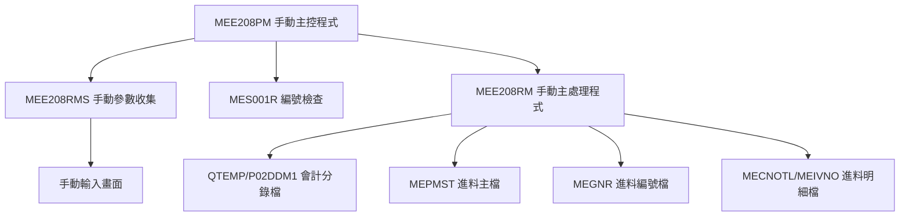
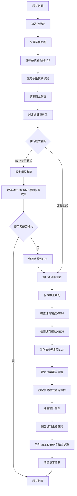

# MEE208PM_H05 程式規格書

## 1. 基本資料

| 項目 | 內容 |
|------|------|
| 程式編號 | MEE208PM |
| 程式名稱 | 進料會計傳票建立批次手動主控程式 |
| 程式類型 | CLP (Control Language Program) |
| 廠區 | H05 |
| 系統名稱 | 進料管理系統 |
| 子系統 | 會計傳票處理 |
| 檔案位置 | H05CLSRC_THSRC/MEE208PM.txt |

## 2. 程式功能說明

### 主要功能
MEE208PM為進料會計傳票建立批次系統的手動主控程式，H05廠區版本提供手動操作的進料傳票產生功能：

1. **手動參數設定**：提供預設參數並允許手動調整
2. **模式處理**：針對手動操作的業務需求進行處理
3. **編號管理**：檢查和管理進料編號的連續性
4. **處理控制**：呼叫手動版本的傳票產生程式
5. **資料區管理**：維護本地資料區(LDA)的參數資訊
6. **手動模式處理**：預設參數值，處理手動傳票建立

### 業務流程說明
此程式為進料管理與會計系統間的手動操作橋樑，處理進料傳票建立：

```
手動需求 → 手動模式 → 預設參數 → 手動調整 → 傳票產生 → 會計入帳
```

## 3. 檔案架構與關聯圖

### 系統架構圖


### 檔案使用清單
| 檔案名稱 | 使用方式 | 說明 | 手動模式差異 |
|----------|----------|------|-------------|
| **主要檔案** |
| MEPMST | INPUT | 進料主檔 | 手動模式'M'標記過濾 |
| QTEMP/P02DDM1 | UPDATE | 會計分錄檔 | 手動模式臨時檔案 |
| MEGNR | UPDATE | 進料編號檔 | 通用 |
| MECNOTL | UPDATE | 進料明細檔 | 通用 |
| MEIVNO | UPDATE | 進料發票檔 | 通用 |
| **輔助檔案** |
| MEORD | INPUT | 進料訂單檔 | 通用 |
| MERPM | INPUT | 進料退料檔 | 通用 |
| MXVNTR | INPUT | 供應商主檔 | 通用 |
| MERCF | INPUT | 進料收料檔 | 通用 |
| APCKDU | INPUT | 應付票據檔 | 通用 |
| **資料區** |
| *LDA | READ/WRITE | 本地資料區 | 手動模式標記 |
| ACCTLDTAH | READ | 會計主控資料區 | H05廠區固定 |

### 資料流向說明
1. **輸入流**：預設參數 → 手動調整 → 進料主檔（'M'標記過濾）
2. **處理流**：手動模式篩選 → 編號檢查 → 特殊檔案處理 → 傳票產生
3. **輸出流**：特殊會計分錄 → 報表輸出

## 4. 檔案欄位規格說明

### 主要資料結構

#### LDA (Local Data Area) 結構分析

##### LDA結構切割視覺化：
```
LDA (1024字元)：[NTNO1|NTNO2|NTNO3|NTNO4|NTNO5|NTNO6|BKNO|YMD|...RULE...|M|...SNAM...|AREA]
位置:            007    014   021   028   035   042   051  061    101    401    401      1021
                  ↓     ↓     ↓     ↓     ↓     ↓     ↓    ↓      ↓      ↓      ↓         ↓
位置007-013:    [NTNO1]                                                                   傳票編號1
位置014-020:          [NTNO2]                                                             傳票編號2  
位置021-027:                [NTNO3]                                                       傳票編號3
位置028-034:                      [NTNO4]                                                 傳票編號4
位置035-041:                            [NTNO5]                                           傳票編號5
位置042-048:                                  [NTNO6]                                     傳票編號6
位置051-060:                                        [BKNO____]                            帳冊編號
位置061-068:                                                 [YMD___]                     處理日期
位置101-105:                                                         [RULE_]             檢查規則
位置401:                                                                   [M]⭐手動模式 手動模式標記
位置401-410:                                                                 [SNAM____] 系統名稱
位置1021:                                                                             [H] 廠區代號
```

### 🎯 欄位切割技術詳解

#### 手動模式特有變數預設值分析

##### 預設參數設定：
```
&AREA = 'M'           手動模式標記
&BKNO = 'BN17566500'  預設帳冊編號
&NTNO1 = 1111111      預設起始傳票編號
&NTNO2 = 9999999      預設結束傳票編號
```

#### 手動模式欄位分析

##### CHAR1欄位的業務邏輯（手動模式特有）：
```
CHAR1 (1字元)：[X]
               ↓
'M'：     手動模式進料，查詢 CHAR1 *EQ "M"
其他值：   非手動模式進料，過濾排除
```

#### 詳細預設值結構定義
| 變數名稱 | 預設值 | 型態 | 說明 |
|---------|--------|------|------|
| &AREA | 'M' | CHAR(1) | 手動模式標記，覆蓋廠區代號 |
| &BKNO | 'BN17566500' | CHAR(10) | 預設帳冊編號，可手動調整 |
| &NTNO1 | 1111111 | DEC(7,0) | 預設起始傳票編號 |
| &NTNO2 | 9999999 | DEC(7,0) | 預設結束傳票編號 |
| &NTNO3-6 | 0 | DEC(7,0) | 其他傳票編號範圍 |

### 欄位挪用分析

#### 手動模式標記的設計
- **原始設計**：手動模式增加的處理功能
- **業務挪用**：
  - 'M'：手動模式進料資料處理
  - LDA位置401：儲存手動模式標記和系統名稱
  - **挪用原因**：區分手動模式與自動模式的處理邏輯
  - **業務邏輯**：手動操作支援

#### PMRESV欄位的手動模式應用
- **資料來源**：從PMRESV欄位的第1位元切割而來
- **查詢邏輯**：
  - CHAR1='M'時，處理手動模式標記的進料資料
- **技術實現**：單一欄位實現手動模式資料的篩選

#### 與MEE208P的差異
- **模式識別**：MEE208PM使用'M'標記，MEE208P使用'H'標記
- **預設值機制**：MEE208PM提供預設參數，MEE208P需輸入
- **檔案處理**：MEE208PM使用QTEMP/P02DDM1，MEE208P使用GLTRAN

### 欄位定義表格
| 欄位名稱 | 類型 | 長度 | 說明 | 預設值 | 挪用情況 |
|----------|------|------|------|--------|----------|
| &AREA | CHAR | 1 | 模式標記 | 'M' | 手動模式識別 |
| &BKNO | CHAR | 10 | 帳冊編號 | 'BN17566500' | 預設帳冊 |
| &NTNO1 | DEC | 7 | 起始編號 | 1111111 | 預設範圍起點 |
| &NTNO2 | DEC | 7 | 結束編號 | 9999999 | 預設範圍終點 |
| CHAR1 | CHAR | 1 | 手動模式識別 | 從PMRESV第1位切割 | 手動模式篩選標記 |

## 5. 輸出/入螢幕布局

### MEE208RMS 手動輸入畫面布局

#### 螢幕布局視覺化：
```
+----------------------------------------------------------+
|                APP001S                      公司名稱    日期|
+----------------------------------------------------------+
|           進料加工會計進料傳票建立(手動模式)              |
+----------------------------------------------------------+
|                                                          |
|                                                          |
| 處理模式：M (手動模式)                                    |
|                                                          |
| 建立日期：[____/__/__]  (可修改)                         |
|                                                          |
|                                                          |
| 進料帳戶：[BN17566500]  (預設值，可修改)                 |
|                                                          |
| 傳票範圍：[1111111]-[9999999]  (預設值，可修改)          |
|           [0000000]-[0000000]                           |
|           [0000000]-[0000000]                           |
|                                                          |
|                                                          |
| 注意：手動模式用於緊急或特殊情況處理                      |
|                                                          |
| [錯誤訊息顯示區]                                          |
| ENTER:執行    PF03:離開                                  |
+----------------------------------------------------------+
```

### 輸入欄位說明
| 欄位 | 名稱 | 類型 | 長度 | 必填 | 預設值 | 說明 |
|------|------|------|------|------|--------|------|
| YMD | 建立日期 | 8Y0 | 8 | 是 | 當前日期 | YYYY/MM/DD格式 |
| BKNO | 進料帳戶 | 10A | 10 | 是 | 'BN17566500' | 預設帳冊編號 |
| NTNO1 | 起始編號 | 7Y0 | 7 | 是 | 1111111 | 預設起始範圍 |
| NTNO2 | 結束編號 | 7Y0 | 7 | 是 | 9999999 | 預設結束範圍 |
| NTNO3-6 | 其他範圍 | 7Y0 | 7 | 選填 | 0 | 額外範圍設定 |

### 與MEE208P的畫面差異
- **模式標示**：標示為手動模式
- **預設值顯示**：所有欄位都有預設值
- **注意事項**：手動模式的使用場合
- **操作方式**：減少使用者輸入

### 功能鍵定義
- **ENTER**：確認輸入，開始手動處理
- **PF03**：取消作業，返回主選單

## 6. 處理流程程序說明

### 主程序邏輯分析

#### 整體處理流程圖


#### 條件判斷詳細邏輯

##### 1. 手動模式初始化
```
CHGDTAARA DTAARA(*LDA (401 1)) VALUE('M')
CHGVAR VAR(&AREA) VALUE('M')
```
- **觸發條件**：程式啟動時
- **處理邏輯**：設定手動模式標記
- **業務意義**：識別為手動處理模式

##### 2. 預設參數設定
```
CHGVAR VAR(&BKNO) VALUE('BN17566500')
CHGVAR VAR(&NTNO1) VALUE(1111111)
CHGVAR VAR(&NTNO2) VALUE(9999999)
```
- **觸發條件**：互動式執行模式
- **處理邏輯**：設定預設值
- **業務意義**：手動操作，提供預設範圍

##### 3. 手動模式查詢條件設定
```
QRYSLT('PMGLDT *EQ ' || &YMD || ' *AND PMCLFG *EQ "1" 
        *AND PMACD *NE "D" *AND CHAR1 *EQ "M"')
MAPFLD((CHAR1 '%SST(PMRESV 1 1)' *CHAR 1))
```
- **手動邏輯**：增加CHAR1 *EQ "M"條件
- **模式篩選**：處理手動模式的進料資料
- **切割技術**：使用PMRESV第1位元作為模式識別

##### 4. 會計檔案處理
```
DLTF QTEMP/P02DDM1
CRTDUPOBJ OBJ(P02DDM) FROMLIB(QGPL) TOLIB(QTEMP) NEWOBJ(P02DDM1)
CHGDDMF FILE(QTEMP/P02DDM1) RMTFILE(DALIB/GLPR)
OVRDBF FILE(GLTRAN) TOFILE(QTEMP/P02DDM1)
```
- **處理方式**：建立臨時會計分錄檔案
- **檔案重導**：將GLTRAN重導至檔案
- **業務目的**：手動模式的會計處理需求

### 子程序邏輯分析

#### MEE208RMS 手動參數收集邏輯
1. **畫面顯示**：展示手動模式輸入畫面（包含預設值）
2. **預設值載入**：自動載入預設參數值
3. **欄位驗證**：
   - 日期有效性檢查
   - 帳冊存在性驗證
   - 傳票編號邏輯檢查
4. **手動調整**：允許使用者調整預設值
5. **參數回傳**：將確認後的參數傳回主程式

#### MES001R 編號檢查邏輯
- **ME24檢查**：進料編號連續性檢查（手動模式）
- **ME25檢查**：進料編號連續性檢查（手動模式）
- **規則組成**：手動模式+年+月

#### MEE208RM 手動主處理邏輯
1. **傳票編號產生**：產生手動模式會計分錄編號
2. **手動模式處理**：專門處理手動模式的進料資料
3. **特殊分錄建立**：產生手動模式的借貸分錄
4. **特殊檔案更新**：更新手動模式相關檔案
5. **手動報表產生**：輸出手動處理報表

### 🎯 特殊邏輯處理

#### 手動模式篩選處理邏輯（手動特有）
- **查詢條件**：CHAR1 *EQ "M"
- **切割來源**：'%SST(PMRESV 1 1)'
- **模式識別**：手動模式標記識別
- **業務用途**：確保只處理手動模式的進料資料

#### 特殊會計檔案管理邏輯（手動特有）
- **臨時檔案建立**：QTEMP/P02DDM1
- **檔案複製**：從QGPL/P02DDM複製
- **遠端檔案設定**：指向DALIB/GLPR
- **檔案覆蓋**：GLTRAN重導至臨時檔案

#### 會計資料區固定處理（手動特有）
```
CHGVAR VAR(&DTARA) VALUE('ACCTLDTAH')
```
- **固定設定**：直接指定H05廠區會計資料區
- **簡化邏輯**：避免動態組成的複雜性
- **手動便利**：減少手動模式的設定複雜度

## 7. 🎯 數據操作與轉換分析

### 檔案操作詳解

#### 特殊檔案操作（手動特有）
```
DLTF QTEMP/P02DDM1
CRTDUPOBJ OBJ(P02DDM) FROMLIB(QGPL) OBJTYPE(*FILE) TOLIB(QTEMP) NEWOBJ(P02DDM1)
CHGDDMF FILE(QTEMP/P02DDM1) RMTFILE(DALIB/GLPR)
```
- **操作目的**：建立手動模式專用的會計分錄檔案
- **數據轉換**：將標準檔案結構轉換為手動模式需求
- **檢核機制**：MONMSG CPF0000 容錯處理

#### 預設值WRITE操作（手動特有）
```
CHGVAR VAR(&BKNO) VALUE('BN17566500')
CHGVAR VAR(&NTNO1) VALUE(1111111)
CHGVAR VAR(&NTNO2) VALUE(9999999)
```
- **操作目的**：設定手動模式的預設參數
- **數據轉換**：數值和字元的預設值設定
- **業務邏輯**：提供合理的操作預設範圍

### 數據轉換邏輯

#### 模式標記轉換
```
CHGDTAARA DTAARA(*LDA (401 1)) VALUE('M')
CHGVAR VAR(&AREA) VALUE('M')
```
- **轉換類型**：廠區代號 → 手動模式標記
- **轉換目的**：識別手動處理模式
- **業務意義**：區分手動與自動處理邏輯

#### 查詢條件動態組成（手動特有）
```
手動模式版本：
QRYSLT('PMGLDT *EQ ' || &YMD || ' *AND PMCLFG *EQ "1" 
        *AND PMACD *NE "D" *AND CHAR1 *EQ "M"')
MAPFLD((CHAR1 '%SST(PMRESV 1 1)' *CHAR 1))
```
- **手動特有條件**：增加手動模式識別條件
- **欄位對應**：CHAR1 = %SST(PMRESV 1 1)（第1位元）
- **篩選邏輯**：確保只處理手動模式資料

### 計算邏輯分析

#### 檢查規則組成計算（手動模式）
```
&W#DATE = &AREA + &Y + &M  // &AREA = 'M'
&W#KIND = 'ME24' / 'ME25'
```
- **計算目的**：組成手動模式編號檢查規則
- **組成邏輯**：手動模式(M) + 年(4) + 月(2) = 7位
- **業務意義**：確保手動模式編號檢查的準確性

### 檢核機制詳解

#### 手動模式專用檢核
- **預設值檢查**：驗證預設參數的合理性
- **模式標記檢查**：確保CHAR1='M'的資料篩選正確
- **特殊檔案檢查**：驗證QTEMP/P02DDM1的建立成功
- **手動範圍檢查**：確保1111111≤9999999的邏輯正確性

#### 檔案存取檢核
- **臨時檔案容錯**：MONMSG CPF0000 處理檔案不存在錯誤
- **層級檢查**：使用LVLCHK(*NO)略過版本檢查
- **特殊檔案覆蓋**：確保GLTRAN正確重導至臨時檔案

## 8. 錯誤處理程序說明

### 錯誤代碼與處理方式清冊

| 錯誤代碼 | 錯誤訊息 | 原因說明 | 處理方式 | 預防措施 |
|----------|---------|---------|---------|----------|
| **IN03='1'** | 使用者取消手動作業 | 使用者在手動參數輸入畫面按下F3功能鍵 | 1. 立即結束程式<br>2. 清除臨時檔案<br>3. 正常回傳狀態 | 提供清楚的手動操作說明 |
| **CPF0000** | 臨時檔案操作錯誤 | QTEMP/P02DDM1刪除或建立失敗 | 1. MONMSG容錯處理<br>2. 繼續執行後續操作<br>3. 記錄操作狀態 | 確保QTEMP空間充足，檢查檔案權限 |
| **預設值錯誤** | 手動模式預設參數異常 | 預設帳冊編號或傳票範圍設定錯誤 | 1. 顯示具體錯誤內容<br>2. 允許手動重新設定<br>3. 提供建議預設值 | 定期檢查預設值的業務合理性 |
| **CHAR1錯誤** | 手動模式識別錯誤 | PMRESV第1位元不是'M'，表示非手動模式資料 | 1. 跳過該筆資料<br>2. 記錄過濾統計<br>3. 繼續處理下一筆 | 確保進料主檔資料的手動模式標記正確 |
| **特殊檔案錯誤** | QTEMP/P02DDM1處理失敗 | 特殊會計檔案建立或覆蓋失敗 | 1. 檢查QTEMP空間<br>2. 重新建立檔案<br>3. 通知系統管理員 | 監控QTEMP空間使用，確保檔案權限 |
| **手動範圍錯誤** | 傳票編號範圍設定異常 | 手動設定的範圍超出合理範圍或邏輯錯誤 | 1. 顯示建議範圍<br>2. 要求重新設定<br>3. 提供預設值選項 | 建立手動操作的範圍指引 |
| **會計資料區錯誤** | ACCTLDTAH存取失敗 | H05廠區會計主控資料區無法正常存取 | 1. 檢查資料區存在性<br>2. 驗證存取權限<br>3. 通知財務部門 | 確保會計資料區的正常維護 |

### 處理方式說明

#### 使用者取消處理（手動模式）
```
IF (&IN03 *EQ '1') THEN(RETURN)
```
- **處理邏輯**：立即結束程式
- **清理作業**：自動清理臨時檔案
- **回傳狀態**：正常結束

#### 臨時檔案錯誤處理（手動特有）
```
DLTF QTEMP/P02DDM1
MONMSG CPF0000
```
- **容錯機制**：MONMSG CPF0000 忽略檔案不存在錯誤
- **恢復策略**：繼續建立新的臨時檔案
- **業務影響**：不影響主要處理流程

#### 手動模式識別錯誤處理
- **篩選邏輯**：CHAR1 *EQ "M"自動過濾非手動模式資料
- **錯誤記錄**：無需特殊錯誤處理，正常篩選邏輯
- **統計回饋**：在報表中顯示手動處理筆數統計

#### 預設值驗證錯誤處理
- **範圍檢查**：驗證1111111≤9999999的邏輯
- **帳冊檢查**：確認'BN17566500'帳冊的存在性
- **調整機制**：允許使用者修改預設值

## 9. 🎯 特殊技術實現說明

### 手動模式標記技術

#### 動態模式識別技術（手動特有）
```
手動模式篩選條件：
QRYSLT('PMGLDT *EQ ' || &YMD || ' *AND PMCLFG *EQ "1" 
        *AND PMACD *NE "D" *AND CHAR1 *EQ "M"')
MAPFLD((CHAR1 '%SST(PMRESV 1 1)' *CHAR 1))
```
- **技術特色**：使用PMRESV第1位元進行手動模式識別
- **實現方式**：透過MAPFLD動態擷取欄位片段
- **系統效益**：確保資料處理的手動模式專用性

#### 欄位切割技術對比
```
MAPFLD((CHAR1 '%SST(PMRESV 1 1)' *CHAR 1))  // 手動模式'M'
MAPFLD((CHAR1 '%SST(PMRESV 1 1)' *CHAR 1))  // H05廠區'H'
```
- **技術一致性**：使用相同位置但不同值
- **切割目的**：手動模式識別 vs 廠區識別
- **業務應用**：不同的業務場景需求

### 臨時檔案管理技術

#### 特殊會計檔案技術（手動特有）
```
DLTF QTEMP/P02DDM1
CRTDUPOBJ OBJ(P02DDM) FROMLIB(QGPL) OBJTYPE(*FILE) TOLIB(QTEMP) NEWOBJ(P02DDM1)
CHGDDMF FILE(QTEMP/P02DDM1) RMTFILE(DALIB/GLPR)
OVRDBF FILE(GLTRAN) TOFILE(QTEMP/P02DDM1) LVLCHK(*NO)
```
- **技術創新**：動態建立手動模式專用會計檔案
- **檔案操作**：複製→修改→覆蓋的完整流程
- **系統效益**：避免手動操作影響正常會計檔案

#### 檔案重導向技術
- **CRTDUPOBJ**：複製標準檔案結構
- **CHGDDMF**：修改遠端檔案指向
- **OVRDBF**：檔案覆蓋重導向
- **容錯處理**：MONMSG CPF0000 錯誤容忍

### 預設值管理技術

#### 智能預設值技術（手動特有）
```
CHGVAR VAR(&BKNO) VALUE('BN17566500')   // 預設帳冊
CHGVAR VAR(&NTNO1) VALUE(1111111)       // 預設起始編號
CHGVAR VAR(&NTNO2) VALUE(9999999)       // 預設結束編號
```
- **預設邏輯**：提供業務上合理的預設範圍
- **可調性**：允許使用者根據需要調整
- **效率提升**：減少手動輸入，提升操作效率

#### 會計資料區簡化技術
```
CHGVAR VAR(&DTARA) VALUE('ACCTLDTAH')  // 固定H05廠區
```
- **簡化策略**：避免動態組成的複雜性
- **固定設定**：手動模式專用於H05廠區
- **維護便利**：減少手動模式的設定複雜度

### 程式碼優化技巧

#### 手動模式專用優化
- **預設值前置**：在參數收集前就設定預設值
- **固定資料區**：避免動態組成，直接指定
- **特殊檔案隔離**：使用臨時檔案避免影響正常作業
- **容錯增強**：增加MONMSG處理臨時檔案操作

#### 與標準版本的差異化設計
- **標準版**：動態廠區識別，完整參數輸入
- **手動版**：固定手動識別，預設參數輸入
- **技術考量**：根據使用場景選擇適合的實現方式

## 10. 🎯 跨廠區版本分析

### 版本分布情況
| 廠區 | 程式版本 | 存在狀態 | 特殊功能 | 手動模式支援 |
|------|----------|----------|----------|-------------|
| **U01** | - | ❌不存在 | - | ❌無手動版本 |
| **H05** | 手動版 | ✅存在 | 手動模式專用 | ✅完整支援 |
| **K02** | - | ❌不存在 | - | - |
| **P02** | - | ❌不存在 | - | - |

### 程式碼差異分析

#### MEE208PM vs MEE208P 主要差異

##### 1. 模式識別差異
**MEE208PM（手動模式）**：
```
CHGVAR VAR(&AREA) VALUE('M')
QRYSLT('CHAR1 *EQ "M"')
```

**MEE208P（標準模式）**：
```
QRYSLT('CHAR1 *EQ "H"')
```

##### 2. 預設參數設定差異
**MEE208PM（提供預設值）**：
```
CHGVAR VAR(&BKNO) VALUE('BN17566500')
CHGVAR VAR(&NTNO1) VALUE(1111111)
CHGVAR VAR(&NTNO2) VALUE(9999999)
```

**MEE208P（無預設值）**：
```
無預設值設定，需完整輸入
```

##### 3. 會計檔案處理差異
**MEE208PM（特殊檔案）**：
```
DLTF QTEMP/P02DDM1
CRTDUPOBJ OBJ(P02DDM) TOLIB(QTEMP) NEWOBJ(P02DDM1)
CHGDDMF FILE(QTEMP/P02DDM1) RMTFILE(DALIB/GLPR)
OVRDBF FILE(GLTRAN) TOFILE(QTEMP/P02DDM1)
```

**MEE208P（標準檔案）**：
```
OVRDBF FILE(GLTRAN) TOFILE(('GL' || &AREA || 'R'))
```

##### 4. 會計資料區設定差異
**MEE208PM（固定設定）**：
```
CHGVAR VAR(&DTARA) VALUE('ACCTLDTAH')
```

**MEE208P（動態組成）**：
```
CHGVAR VAR(&DTARA) VALUE('ACCTLDTA' *CAT &AREA)
```

##### 5. 子程式呼叫差異
**MEE208PM（手動版子程式）**：
```
CALL PGM(MEE208RMS)  // 手動參數收集
CALL PGM(MEE208RM)   // 手動主處理
```

**MEE208P（標準版子程式）**：
```
CALL PGM(MEE208RS)   // 標準參數收集
CALL PGM(MEE208R)    // 標準主處理
```

##### 6. LDA標記差異
**MEE208PM（手動標記）**：
```
CHGDTAARA DTAARA(*LDA (401 1)) VALUE('M')
```

**MEE208P（系統名稱）**：
```
CHGDTAARA DTAARA(*LDA (401 10)) VALUE(&SNAM)
```

### 功能差異說明

#### 手動模式特點（MEE208PM）
1. **處理方式**：
   - **業務需求**：處理傳票建立
   - **實現方式**：提供預設參數，操作流程
   - **處理邏輯**：H05廠區，手動模式標記

2. **預設值機制**：
   - **帳冊預設**：'BN17566500'作為預設帳冊
   - **範圍預設**：1111111-9999999作為預設處理範圍
   - **操作方式**：減少手動輸入

3. **檔案處理**：
   - **臨時檔案**：使用QTEMP/P02DDM1
   - **檔案隔離**：手動處理與標準處理分離
   - **處理機制**：手動操作檔案處理

#### 標準模式特點（MEE208P）
1. **參數控制**：
   - **業務需求**：參數設定和控制
   - **實現方式**：使用者輸入參數
   - **處理邏輯**：廠區識別，邏輯處理

2. **檔案操作**：
   - **處理流程**：使用會計檔案處理流程
   - **廠區處理**：支援多廠區的處理
   - **作業方式**：日常作業

### 調用關係差異

#### 子程式調用鏈
**MEE208PM調用順序**：
```
MEE208PM → MEE208RMS (手動參數收集+預設值)
        → MES001R (編號檢查+手動模式)
        → MEE208RM (手動主處理+特殊檔案)
```

**MEE208P調用順序**：
```
MEE208P → MEE208RS (標準參數收集)
       → MES001R (編號檢查+廠區模式)
       → MEE208R (標準主處理+標準檔案)
```

## 7. 備註

### 手動模式處理機制

1. **手動模式操作**：
   - CHAR1='M'條件設定影響資料處理範圍
   - 手動模式使用場合為輔助處理
   - 手動處理與正常業務流程分離

2. **臨時檔案管理**：
   - QTEMP/P02DDM1檔案清理
   - QTEMP空間使用情況
   - 臨時檔案的建立權限

3. **預設值處理**：
   - 預設帳冊編號：'BN17566500'
   - 預設傳票範圍：1111111-9999999
   - 手動操作的業務邏輯

### 技術注意事項

1. **程式架構**：
   - 手動模式與標準模式的程式碼結構
   - 手動與標準模式的錯誤處理
   - 模式識別機制

2. **檔案處理**：
   - 臨時檔案的建立和管理
   - 檔案重導機制：GLTRAN → QTEMP/P02DDM1
   - 臨時檔案管理

3. **調用關係**：
   - MEE208PM調用順序：MEE208PM → MEE208RMS (手動參數收集+預設值) → MES001R (編號檢查+手動模式) → MEE208RM (手動主處理+檔案)
   - MEE208P調用順序：MEE208P → MEE208RS (標準參數收集) → MES001R (編號檢查+廠區模式) → MEE208R (標準主處理+檔案) 