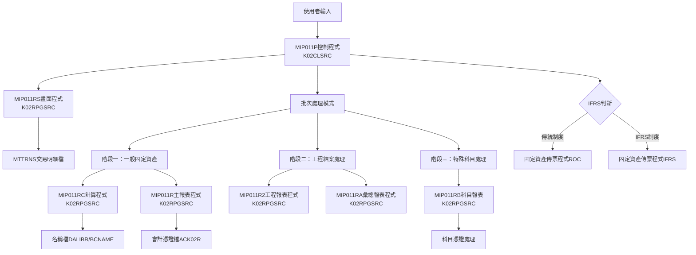
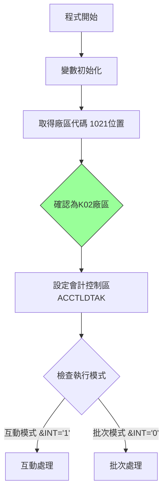
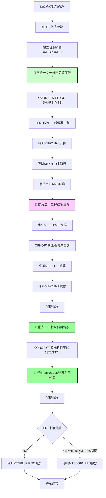

# MIP011P_K02 程式規格書

## 1. 基本資料

| 項目 | 內容 |
|------|------|
| 程式編號 | MIP011P |
| 程式名稱 | 固定資產月底傳票作業 |
| 程式類型 | CLP (控制語言程式) |
| 廠區 | K02 |
| 系統名稱 | 物料庫存管理系統 |
| 子系統 | 固定資產管理 |
| 檔案位置 | K02CLSRC/MIP011P_K02.txt |

## 2. 程式功能說明
此程式為K02廠區的固定資產月底傳票作業批次控制程式。

### 主要功能
1. **固定資產傳票處理**：處理月度固定資產相關的交易傳票
2. **IFRS轉換支援**：支援傳統會計制度與IFRS制度的轉換處理
3. **三階段分類處理**：提供處理邏輯
4. **互動與批次模式**：提供互動式輸入和批次處理兩種執行模式
5. **傳票分類處理**：
   - **階段一**：一般固定資產傳票（MI21、MI22，排除1371、1374）
   - **階段二**：工程結案傳票處理（排除1371、1374）
   - **階段三**：科目傳票（處理1371、1374科目）

## 3. 檔案架構與關聯圖

### 視覺化架構圖


### 主要檔案清單
| 檔案名稱 | 類型 | 說明 | 用途 |
|---------|------|------|------|
| **MTTRNS** | 交易明細檔 | 存放固定資產交易明細 | INPUT |
| **ACVOUR** | 會計憑證檔 | 動態命名ACK02R | OUTPUT |
| **BCNAME** | 名稱檔 | DALIBR庫中的名稱主檔 | REFERENCE |
| **MIP011W** | 工作檔 | QTEMP中的臨時工作檔 | TEMP |
| **AMIFRSCTL** | IFRS控制檔 | IFRS實施日期控制 | CONTROL |
| **AMDEPT** | 部門檔 | 部門代碼主檔 | REFERENCE |
| **MTMATL** | 物料檔 | 物料主檔 | REFERENCE |
| **ACCNTL** | 會計科目檔 | 會計科目主檔 | REFERENCE |
| **ACTRACL1** | 追蹤科目檔 | 追蹤科目控制檔 | REFERENCE |

## 4. 欄位切割技術詳解

### 無DS結構切割
此程式為CLP程式，主要使用變數和資料區域(Data Area)進行資料操作，**未使用DS結構進行欄位切割**。

### 重要變數定義與用途分析

#### 日期相關變數切割技術
```
程式中的日期變數使用：
&DATEA (6字元) ← 從&DATE(數值型6位)轉換
&DATEN (8字元) ← 從&DATEE(數值型8位)轉換  
&DATEX (8字元) ← &YM + '01' (月初日期)
&DATEY (8字元) ← &YM + '31' (月底日期)
```

#### 資料區域挪用分析
程式大量使用*LDA(本地資料區域)進行資料傳遞：

| 位置 | 長度 | 變數 | 原始用途 | 實際挪用用途 | K02標準處理 |
|------|------|------|----------|-------------|-------------|
| 1-6 | 6 | &P#YYMM | 年月參數 | 畫面輸入的處理年月 | 標準年月處理 |
| 9-1 | 1 | &AREA | 廠區代碼 | 固定為'K'廠區識別 | 固定值'K' |
| 11-8 | 8 | &DATEN | 結束日期 | 月底處理日期 | 標準日期處理 |
| 31-6 | 6 | &P#VRNS | 憑證號碼起 | 固定資產傳票起始號碼 | 標準憑證編號 |
| 41-6 | 6 | &P#VRNE | 憑證號碼迄 | 固定資產傳票結束號碼 | 標準憑證編號 |
| 472-6 | 6 | &IFRSYM | IFRS年月 | IFRS制度實施年月控制 | 標準IFRS控制 |
| 1021-1 | 1 | &AREA | 廠區備份 | 從系統取得，固定為'K' | K02廠區專用 |

#### 🎯 挪用原因分析
1. **標準化記憶體管理**：K02作為標準版本，展示了最佳實踐的記憶體使用方式
2. **模組化介面設計**：統一的資料區域位置便於各階段子程式存取
3. **廠區標準化**：為其他廠區提供標準化的資料結構參考

## 5. 輸出/入螢幕布局與說明

### 互動模式畫面（MIP011RS）
```
+----------------------------------------------------------+
|              固定資產月底傳票作業 (MIP011P)               |
|                    K02廠區標準版本                       |
+----------------------------------------------------------+
| 處理年月: [YYMMDD]    廠區: [K] K02廠區                  |
| 起始日期: [YYMMDD]    結束日期: [YYMMDD]                 |
+----------------------------------------------------------+
| 功能鍵: F3=離開 F12=取消                                |
+----------------------------------------------------------+
```

### 報表輸出說明
1. **固定資產傳票報表** - 158欄寬，12CPI格式（一般固定資產）
2. **工程結案報表** - 工程項目專用傳票
3. **彙總報表** - 各類別統計彙總
4. **✅ 特殊科目報表** - 1371、1374科目專用處理報表

## 6. 🎯 處理流程程序說明

### 主程序邏輯深度分析

#### 第一階段：初始化與模式判斷


#### 第二階段：K02標準三階段批次處理邏輯


### 🎯 K02廠區標準業務邏輯分析

#### 1. 階段一：一般固定資產傳票處理
```sql
查詢條件：
(CHAR6 >= DATEX) AND (CHAR6 <= DATEY) 
AND (I4LOCA = 'K') 
AND (I4FORM = "MI21" OR I4FORM = "MI22")
AND (((I4ENID = " ") AND (I4COMT = " ")) OR (I4COMT != " "))
AND (%SST(I4BK12 3 10) = " ")
AND (I4ACD != "D")
```

**業務意義**：處理所有基本固定資產交易，但排除特殊科目1371、1374

#### 2. 階段二：工程結案傳票處理
```sql
查詢條件：
(CHAR6 >= DATEX) AND (CHAR6 <= DATEY)
AND (I4LOCA = 'K')
AND (I4FORM = "MI21" OR I4FORM = "MI22")
AND (I4ENID != " ") AND (I4COMT = " ")
AND (%SST(I4BK12 3 10) = " ")
AND (I4ACD != "D")
AND (I4ACNO != "1371") AND (I4ACNO != "1374")
```

**業務意義**：專門處理工程結案相關傳票，排除特殊科目

#### 3. 階段三：科目傳票處理
```sql
查詢條件：
(CHAR6 >= DATEX) AND (CHAR6 <= DATEY)
AND (I4LOCA = 'K')
AND (I4FORM = "MI21" OR I4FORM = "MI22")
AND (I4ENID != " ") AND (I4COMT = " ")
AND (%SST(I4BK12 3 10) = " ")
AND (I4ACD != "D")
AND ((I4ACNO = "1371") OR (I4ACNO = "1374"))
```

**業務意義**：
- **1371科目**：通常為「租賃權益改良」或「土地改良物」
- **1374科目**：通常為「承租資產」或「使用權資產」
- 這些科目在IFRS制度下需要特殊的會計處理

## 7. 數據操作與轉換分析

### 檔案操作詳解
1. **MTTRNS交易明細檔**：
   - **查詢方式**：K02版本對MTTRNS檔案進行三次查詢
   - **分階段讀取**：通過不同查詢條件區分一般、工程、科目
   - **處理方式**：無需預處理或中間檔案
   - **篩選邏輯**：支援業務邏輯篩選

2. **ACVOUR會計憑證檔**：
   - **WRITE操作**：輸出固定資產傳票資料
   - **檔案命名**：命名為ACK02R
   - **支援範圍**：包含科目的憑證處理

### K02數據轉換邏輯
1. **分階段處理**：
   - 第一階段處理固定資產
   - 第二階段處理工程相關
   - 第三階段處理會計科目

2. **條件邏輯**：
   - 使用SQL條件組合
   - 通過科目代碼分類
   - 支援業務需求

3. **檔案命名**：
   - 處理為K02廠區
   - 檔案命名規範

## 8. 錯誤處理程序說明
- **ACP101R檢查**：呼叫ACP101R進行月份檢查，返回代碼判斷處理
- **日期檢查**：在MIP011RS中進行日期格式和合理性檢查
- **檔案存在檢查**：使用MONMSG處理檔案不存在的情況
- **查詢錯誤處理**：三階段查詢的個別錯誤處理邏輯
- **系統錯誤處理**：使用MONMSG CPF0000處理一般系統錯誤
- **特殊科目錯誤處理**：MIP011RB程式的特殊錯誤處理機制

## 9. 技術實現說明

### K02廠區技術架構
1. **分階段查詢**：
   - 分別處理不同類型的邏輯
   - 業務邏輯分離

2. **檔案管理**：
   - ACVOUR檔案映射到ACK02R
   - 會計控制區域命名為ACCTLDTAK
   - MIP011W工作檔的建立和清理

3. **功能實現**：
   - 支援固定資產科目的處理
   - 提供報表輸出
   - IFRS轉換支援

### K02廠區程式設計
1. **模組化設計**：
   - 每個階段處理
   - 程式調用邏輯
   - 功能封裝

2. **實現方式**：
   - 對檔案查詢，無需預處理
   - SQL查詢條件設計
   - 業務功能支援

3. **處理方式**：
   - 功能與效能的處理
   - 資源使用

## 10. 備註

### 技術架構

1. **分階段處理**：
   - K02的三階段處理架構
   - 檔案查詢方式
   - MIP011RB科目處理功能

2. **檔案處理**：
   - MTTRNS交易明細檔查詢
   - ACVOUR會計憑證檔輸出
   - MIP011W工作檔管理

3. **IFRS支援**：
   - 傳統會計制度與IFRS制度轉換
   - 會計科目1371、1374的處理邏輯
   - 現代會計制度要求 