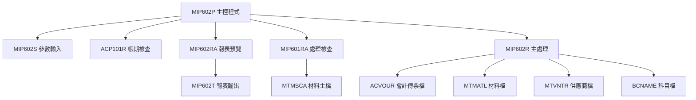
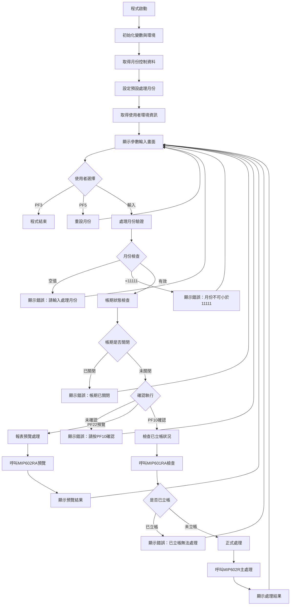

# MIP602P_U01 程式規格書

## 1. 基本資料

| 項目 | 內容 |
|------|------|
| 程式編號 | MIP602P |
| 程式名稱 | 材料出庫成本歸屬計算會計傳票 |
| 程式類型 | CLP (Control Language Program) |
| 廠區 | U01 |
| 系統名稱 | 庫存管理系統 |
| 子系統 | 材料成本計算 |
| 檔案位置 | U01CLSRC_THSRC/MIP602P.txt |

## 2. 程式功能說明

### 主要功能
MIP602P為材料出庫成本歸屬計算系統的主控制程式，處理材料出庫的成本計算並產生會計傳票：

1. **參數收集與驗證**：透過介面收集處理月份參數
2. **帳期檢查**：檢查指定月份的帳期狀態
3. **處理模式控制**：支援三種處理模式
   - **報表預覽模式**：預覽計算結果
   - **檢查模式**：檢查該月份是否已進行傳票處理  
   - **正式處理模式**：執行成本計算與傳票產生
4. **成本計算**：依據材料出庫資料進行成本歸屬計算
5. **會計傳票產生**：產生對應的借貸分錄

### 業務流程說明
此程式處理庫存管理與財務會計系統間的資料，處理材料出庫成本歸屬：

```
材料出庫 → 成本計算 → 成本歸屬 → 會計傳票 → 財務記錄
```

## 3. 檔案架構與關聯圖

### 系統架構圖


### 檔案使用清單
| 檔案名稱 | 使用方式 | 說明 |
|----------|----------|------|
| MTMSCA | INPUT/UPDATE | 材料主檔成本資料 |
| ACVOUR | OUTPUT | 會計傳票檔 |
| MTMATL | INPUT | 材料基本檔 |
| MTVNTR | INPUT | 供應商檔 |
| BCNAME | INPUT | 科目名稱檔 |
| MIP602W | UPDATE | 工作檔 |
| MIP602T | OUTPUT | 處理報表 |
| MIP602S | DISPLAY | 參數輸入畫面 |
| MIMONDTA | READ | 月份控制資料區 |
| *LDA | READ/WRITE | 本地資料區 |

### 資料流向說明
1. **輸入流**：材料出庫資料(MTMSCA) → 成本計算參數
2. **處理流**：成本歸屬計算 → 會計分錄產生
3. **輸出流**：會計傳票(ACVOUR) → 報表輸出(MIP602T)

## 4. 檔案欄位規格說明

### 主要資料結構

#### LDA (Local Data Area) 結構分析

##### LDA結構切割視覺化：
```
LDA (1024字元)：[AREA|YYMM|DDS|YYMM2|DDE|...COMP...|DEVN|TXAR]
位置:            017    018   024  026   032    951      1011  1021
                  ↓     ↓     ↓    ↓     ↓      ↓        ↓     ↓
位置017:        [A]                                                    廠區代號
位置018-023:          [YYMM__]                                         處理年月
位置024-025:                 [DD]                                      起始日期
位置026-031:                    [YYMM2_]                               處理年月副本
位置032-033:                           [DD]                           結束日期
位置951-985:                               [COMP________________...]    公司名稱
位置1011-1020:                                    [DEVN______]         設備名稱
位置1021:                                                       [T]    廠區代號
```

### 🎯 欄位切割技術詳解

#### MTMSCA檔案中的關鍵欄位切割

##### M2MLNO欄位切割 (8字元材料編號)：
```
M2MLNO (8字元)：[X|X|X|X|X|XXX]
                 ↓ ↓ ↓ ↓ ↓  ↓
G3NO1 (1字元)： [X]              材料大類
G3NO2 (1字元)：  [X]             材料中類
G3NO3 (1字元)：   [X]            材料小類
G3NO4 (1字元)：    [X]           規格代號1
G3NO5 (1字元)：     [X]          規格代號2
G3NO6 (3字元)：      [XXX]       流水編號
```

##### 傳票編號欄位切割 (ACVRNO - 6字元)：
```
ACVRNO (6字元)：[XX|XXXX]
                 ↓    ↓
NO1 (2字元)：   [XX]       傳票類型
VRNOX (4字元)：   [XXXX]   傳票序號
```

##### 會計科目欄位切割：
```
ACNO (9字元)：  [XXXXXX|XXX]
                ↓      ↓
R#ACNO (6字元)：[XXXXXX]     主科目代號
子科目 (3字元)：       [XXX]  子科目代號

ACDPNO (8字元)：[XXXX|XXXX]
                 ↓     ↓
R#DPNO (4字元)： [XXXX]      部門代號主體
延伸部門 (4字元)：     [XXXX] 部門延伸代號

ACRLNO (20字元)：[XXXXXXXXXX|XXXXXXXXXX]
                  ↓          ↓
R#RLNO (10字元)： [XXXXXXXXXX]          關係代號主體
延伸關係 (10字元)：           [XXXXXXXXXX] 關係延伸代號
```

#### 詳細DS結構定義
| 欄位名稱 | 位置 | 長度 | 型態 | 說明 |
|---------|------|------|------|------|
| **材料編號切割** |
| M2MLNO | 1-8 | 8 | 字元 | 材料編號，被切割為分類資訊 |
| G3NO1 | 1 | 1 | 字元 | 材料大類代號 |
| G3NO2 | 2 | 1 | 字元 | 材料中類代號 |
| G3NO3 | 3 | 1 | 字元 | 材料小類代號 |
| G3NO4 | 4 | 1 | 字元 | 規格代號1 |
| G3NO5 | 5 | 1 | 字元 | 規格代號2 |
| G3NO6 | 6-8 | 3 | 字元 | 流水編號 |
| **會計欄位切割** |
| ACNO | 1-9 | 9 | 字元 | 會計科目代號 |
| R#ACNO | 1-6 | 6 | 字元 | 主科目代號 |
| ACDPNO | 1-8 | 8 | 字元 | 部門代號 |
| R#DPNO | 1-4 | 4 | 字元 | 部門代號主體 |
| ACRLNO | 1-20 | 20 | 字元 | 關係代號 |
| R#RLNO | 1-10 | 10 | 字元 | 關係代號主體 |

### 🎯 欄位挪用分析

#### M2MLNO欄位的分類體系設計
- **原始設計**：儲存完整的材料編號
- **分類切割**：
  - G3NO1-G3NO5：材料分類階層
  - G3NO6：流水序號
  - **設計優勢**：一個欄位承載完整的材料分類體系
  - **業務邏輯**：便於材料分類管理和成本歸屬

#### 會計欄位的階層設計
- **ACNO切割**：主科目+子科目的二層結構
- **ACDPNO切割**：部門主體+延伸部門的彈性架構
- **ACRLNO切割**：關係主體+延伸關係的擴展設計

### 欄位定義表格
| 欄位名稱 | 類型 | 長度 | 說明 | 切割方式 | 挪用情況 |
|----------|------|------|------|----------|----------|
| M2MLNO | CHAR | 8 | 材料編號 | 1+1+1+1+1+3切割 | 分類體系+序號 |
| ACNO | CHAR | 9 | 會計科目 | 6+3切割 | 主科目+子科目 |
| ACDPNO | CHAR | 8 | 部門代號 | 4+4切割 | 主部門+延伸 |
| ACRLNO | CHAR | 20 | 關係代號 | 10+10切割 | 主關係+延伸 |
| M2SLQY | NUM | 11,2 | 數量欄位 | 4+7切割 | 整數+小數 |
| M2PRCE | NUM | 9,2 | 單價欄位 | 4+3+2切割 | 整數+小數+精度 |

## 5. 輸出/入螢幕布局

### MIP602S 參數輸入畫面布局

#### 螢幕布局視覺化：
```
+----------------------------------------------------------+
|                                      公司名稱    MIP602S |
+----------------------------------------------------------+
|          材料出庫成本歸屬計算會計傳票                     |
+----------------------------------------------------------+
|                                                          |
|                                                          |
|                                                          |
|                                                          |
| 說明：                                                   |
|       會計傳票建立程式                                   |
|       請先確認處理月份材料出庫成本計算處理完畢！          |
|                                                          |
| 傳票系統：U                                              |
|                                                          |
| 處理月份：[____/__]  (必填)                             |
|                                                          |
|                                                          |
|                                                          |
|                                                          |
|                                                          |
|                                                          |
|                                                          |
|                                                          |
|                                                          |
| [錯誤訊息顯示區]                                          |
| 可用功能：PF3=結束作業  PF5=重設處理月份  PF22=傳票預覽   |
+----------------------------------------------------------+
```

### 輸入欄位說明
| 欄位 | 名稱 | 類型 | 長度 | 必填 | 說明 |
|------|------|------|------|------|------|
| S#YYMM | 處理月份 | 6Y0 | 6 | 是 | YYY/MM格式，如111/11 |
| S#AREA | 系統別 | 1A | 1 | 自動 | 廠區代號，自動取得 |

### 功能鍵定義
- **PF3**：結束作業，返回主選單
- **PF5**：重設處理月份，清除輸入
- **PF10**：確認執行，開始處理
- **PF22**：傳票預覽，先行檢視處理結果

## 6. 處理流程程序說明

### 主程序邏輯分析

#### 整體處理流程圖


#### 條件判斷邏輯

##### 1. 功能鍵處理邏輯
```
IF (&IN03 *EQ '1') THEN(RETURN)     /* F3結束 */
IF (&IN05 *EQ '1') THEN(DO)         /* F5重設 */
  CHGVAR VAR(&IN26) VALUE('1')
  GOTO CMDLBL(START)
ENDDO
```

##### 2. 處理月份檢查邏輯
```
IF (&S#YYMM *EQ 0) THEN(DO)
  錯誤訊息：'請輸入處理月份！'
ENDDO
IF (&S#YYMM *LT 11111) THEN(DO)
  錯誤訊息：'處理月份不可小於11111'
ENDDO
```

##### 3. 帳期狀態檢查邏輯
```
CALL PGM(ACP101R) PARM(&P#YYMM &P#CODE)
IF (&P#CODE *EQ '1') THEN(DO)
  錯誤訊息：'帳期已關閉，請洽會計人員處理！'
ENDDO
```

##### 4. 執行確認檢查邏輯
```
IF ((&IN10 *EQ '0') *AND (&IN22 *EQ '0')) THEN(DO)
  錯誤訊息：'請按<PF10>確認執行！'
ENDDO
```

### 子程序邏輯分析

#### ACP101R 帳期檢查邏輯
- **輸入參數**：處理月份(P#YYMM)
- **輸出參數**：狀態代碼(P#CODE)
- **檢查邏輯**：
  - '0'：帳期開放，可進行處理
  - '1'：帳期已關閉，禁止處理
- **業務意義**：檢查在已關帳期間不進行傳票產生

#### MIP602RA 報表預覽邏輯
- **處理模式**：P#RUN='R' (Report模式)
- **查詢條件**：已有傳票編號的資料(M2VRNO *NE " ")
- **輸出內容**：預覽將產生的會計傳票內容
- **業務用途**：讓使用者先行確認處理結果

#### MIP601RA 立帳檢查邏輯  
- **處理模式**：P#RUN='C' (Check模式)
- **檢查目標**：指定月份是否已進行傳票處理
- **回傳狀態**：
  - 'Y'：已處理，不可重複執行
  - 'N'：未處理，可以執行
- **業務邏輯**：防止重複立帳

#### MIP602R 主處理邏輯
- **處理模式**：P#RUN='P' (Process模式)
- **查詢條件**：未有傳票編號的資料(M2VRNO *EQ " ")
- **主要作業**：
  1. 讀取材料出庫成本資料
  2. 計算成本歸屬金額
  3. 產生對應的會計分錄
  4. 更新傳票編號欄位
- **輸出結果**：ACVOUR會計傳票檔

### 特殊邏輯處理

#### 廠區別檔案處理
```
OVRDBF FILE(ACVOUR) TOFILE(('AC' || &S#AREA || 'R'))
```
- **動態檔案名稱**：依據廠區代號組成實際檔案名
- **檔案對應**：
  - U01廠區：ACU01R
  - H05廠區：ACH05R
  - 其他廠區：AC{廠區}R

#### 查詢條件動態組成
```
QRYSLT('(M2ACD *NE "D") *AND (M2VRNO *NE " ") *AND 
        (M2LOCA *EQ ''' || &S#AREA || ''') *AND 
        (CHAR6 *EQ ''' *CAT &W#YYMM *CAT ''')')
```
- **條件組合**：刪除標記+傳票狀態+廠區+月份
- **動態參數**：廠區代號與處理月份

## 7. 數據操作與轉換分析

### 檔案操作詳解

#### READ操作
```
RTVDTAARA DTAARA(MIMONDTA (1 6)) RTNVAR(&W#MON1)
```
- **操作目的**：取得當前處理月份
- **數據轉換**：無需轉換，直接使用
- **預設機制**：提供使用者預設的處理月份

#### WRITE操作
```
CHGDTAARA DTAARA(*LDA (17 1)) VALUE(&S#AREA)
CHGDTAARA DTAARA(*LDA (18 6)) VALUE(&W#YYMM)
```
- **操作目的**：儲存處理參數到LDA
- **位置對應**：對應LDA結構設計
- **參數傳遞**：供後續子程式使用

### 數據轉換邏輯

#### 字串組合轉換
```
'(M2LOCA *EQ ''' || &S#AREA || ''') *AND 
 (CHAR6 *EQ ''' *CAT &W#YYMM *CAT ''')'
```
- **轉換類型**：變數值嵌入SQL條件字串
- **轉換目的**：建立動態查詢條件
- **技術細節**：使用||和*CAT進行字串連接

#### 檔案名稱動態組成
```
('AC' || &S#AREA || 'R')
```
- **轉換邏輯**：字首+廠區代號+字尾
- **實際應用**：'AC' + 'U' + 'R' = 'ACUR'
- **系統效益**：單一程式支援多廠區環境

### 計算邏輯分析

#### 查詢排序邏輯
```
KEYFLD((M2LOCA) (M2YYMM) (M2OTCD) (M2DTTP *DESCEND) (M2MLNO))
```
- **排序目的**：確保處理順序的一致性
- **排序邏輯**：廠區→月份→單據類型→異動類型(降序)→材料編號
- **業務意義**：保證成本計算的正確性

#### 欄位對應計算
```
MAPFLD((CHAR6 M2YYMM *CHAR 6))
```
- **對應目的**：將數值月份轉換為字元格式
- **轉換規則**：6位數值→6位字元
- **使用場景**：查詢條件比對使用

### 檢核機制詳解

#### 參數有效性檢查
- **月份檢查**：不可為0，不可小於11111
- **帳期檢查**：呼叫ACP101R驗證帳期狀態
- **重複處理檢查**：呼叫MIP601RA確認未重複立帳

#### 檔案存取檢核
- **共享設定**：SHARE(*YES)允許多使用者讀取
- **覆蓋機制**：確保存取正確的廠區檔案
- **報表設定**：HOLD(*YES)保留報表供查看

## 8. 錯誤處理程序說明

### 錯誤代碼與處理方式清冊

| 錯誤代碼 | 錯誤訊息 | 原因說明 | 處理方式 | 預防措施 |
|----------|---------|---------|---------|----------|
| **IN03='1'** | 使用者取消作業 | 使用者在參數輸入畫面按下PF3功能鍵 | 1. 立即結束程式<br>2. 清除暫存資料<br>3. 正常回傳狀態 | 提供清楚的操作說明與功能鍵說明 |
| **YYMM=0** | 請輸入處理月份！ | 使用者未輸入處理月份就按確認 | 1. 顯示錯誤訊息<br>2. 欄位標記為必填<br>3. 要求重新輸入 | 在畫面上標示必填欄位 |
| **YYMM<11111** | 處理月份不可小於11111 | 輸入的月份早於系統可處理範圍 | 1. 顯示錯誤訊息<br>2. 說明最小可處理月份<br>3. 要求重新輸入 | 提供月份格式範例與說明 |
| **P#CODE='1'** | 帳期已關閉，請洽會計人員處理！ | 指定月份的帳期已經關閉 | 1. 顯示錯誤訊息<br>2. 建議聯絡會計人員<br>3. 返回參數輸入畫面 | 定期檢查帳期狀態，提前通知相關人員 |
| **未確認執行** | 請按<PF10>確認執行！ | 使用者未按確認鍵就嘗試處理 | 1. 顯示提示訊息<br>2. 等待使用者確認<br>3. 繼續等待輸入 | 在畫面上明確標示確認步驟 |
| **已立帳錯誤** | 處理月份會計已立帳無法處理，請檢查！ | 該月份已經進行過傳票處理 | 1. 顯示具體錯誤原因<br>2. 建議檢查處理記錄<br>3. 返回參數選擇 | 建立處理記錄查詢功能 |
| **處理成功** | 處理月份已立帳完成！ | 正常完成傳票產生處理 | 1. 顯示成功訊息<br>2. 提供處理統計資訊<br>3. 返回參數輸入畫面 | 建立處理日誌記錄 |
| **處理失敗** | 處理月份發生錯誤，請檢查！ | 處理過程中發生未預期錯誤 | 1. 記錄詳細錯誤資訊<br>2. 回復處理前狀態<br>3. 通知系統管理員 | 加強錯誤記錄與監控機制 |
| **無資料處理** | 處理月份無資料，請檢查！ | 指定月份沒有需要處理的出庫資料 | 1. 確認是否有出庫作業<br>2. 檢查資料完整性<br>3. 確認月份正確性 | 建立資料完整性檢查機制 |

### 處理方式說明

#### 使用者操作錯誤處理
```
IF (&S#YYMM *EQ 0) THEN(DO)
  CHGVAR VAR(&S#ERR) VALUE('請輸入處理月份！')
  CHGVAR VAR(&IN25) VALUE('1')
  GOTO CMDLBL(START)
ENDDO
```
- **處理策略**：立即顯示錯誤，要求重新輸入
- **使用者體驗**：清楚的錯誤說明與操作指引

#### 業務邏輯錯誤處理
```
IF (&P#CODE *EQ '1') THEN(DO)
  CHGVAR VAR(&S#ERR) VALUE('帳期已關閉，請洽會計人員處理！')
  GOTO CMDLBL(START)
ENDDO
```
- **處理策略**：提供具體的解決建議
- **業務連續性**：引導使用者找到正確的處理方式

#### 系統處理結果回饋
```
IF (&P#PRC *EQ 'Y') THEN(CHGVAR VAR(&S#ERR) VALUE('處理月份已立帳完成！'))
IF (&P#PRC *EQ 'N') THEN(CHGVAR VAR(&S#ERR) VALUE('處理月份發生錯誤，請檢查！'))
```
- **成功處理**：明確的完成通知
- **失敗處理**：具體的錯誤指引

## 9. 🎯 特殊技術實現說明

### 三階段處理架構

#### 階段式處理設計
```
階段1：報表預覽 (MIP602RA with P#RUN='R')
├── 目的：讓使用者預先檢視處理結果
├── 特點：僅產生報表，不異動資料
└── 查詢：已有傳票編號的資料 (M2VRNO *NE " ")

階段2：立帳檢查 (MIP601RA with P#RUN='C')  
├── 目的：檢查是否已經處理過
├── 特點：防止重複處理的安全機制
└── 邏輯：確認該月份處理狀態

階段3：正式處理 (MIP602R with P#RUN='P')
├── 目的：執行實際的成本計算與傳票產生
├── 特點：實際異動會計檔案
└── 查詢：未有傳票編號的資料 (M2VRNO *EQ " ")
```

#### 技術優勢分析
- **安全性**：三層檢查防止誤操作
- **可追蹤性**：每階段都有明確的處理記錄
- **使用者友善**：預覽機制降低操作風險

### 動態檔案處理技術

#### 廠區別檔案動態對應
```
OVRDBF FILE(ACVOUR) TOFILE(('AC' || &S#AREA || 'R'))
```
- **技術特色**：單一程式支援多廠區環境
- **實現方式**：字串連接動態組成檔案名稱
- **系統效益**：減少程式維護成本，提升系統彈性

#### 查詢條件動態組成
```
QRYSLT('(M2LOCA *EQ ''' || &S#AREA || ''') *AND 
        (CHAR6 *EQ ''' *CAT &W#YYMM *CAT ''')')
```
- **動態參數**：廠區代號與處理月份
- **SQL注入防護**：使用固定格式字串組成
- **效能優化**：精確的查詢條件減少資料掃描

### 程式碼優化技巧

#### 參數傳遞優化
```
LDA參數儲存策略：
位置017：廠區代號
位置018-023：處理年月  
位置024-025：起始日期
位置026-031：處理年月副本
位置032-033：結束日期
```
- **記憶體效率**：使用LDA統一管理參數
- **程式間通訊**：標準化的參數傳遞介面
- **維護性**：集中式的參數管理

#### 錯誤處理
- **錯誤顯示**：使用S#ERR欄位顯示錯誤
- **程式流程**：錯誤後回到輸入畫面

## 10. 技術架構

### 版本分布
| 廠區 | 程式版本 | 存在狀態 | 建立日期 |
|------|----------|----------|----------|
| U01 | 2022MT00025 | 存在 | 2022/11/15 |
| H05 | - | 不存在 | - |
| K02 | - | 不存在 | - |
| P02 | - | 不存在 | - |

### 程式特性

#### U01廠區特點
1. **程式架構**：
   - 主控程式+多個處理子程式
   - 三階段處理：預覽→檢查→執行
   - 檔案處理：支援廠區環境

2. **系統整合**：
   - 庫存系統：MTMSCA、MTMATL、MTVNTR
   - 會計系統：ACVOUR、BCNAME、ACU01R
   - 報表系統：MIP602T

2. **參數配置**：
   - 廠區別參數設定
   - 成本計算公式設定
   - 會計分錄模板

3. **系統整合**：
   - 資料交換介面
   - 報表格式
   - 錯誤處理機制

## 11. 備註

### 技術要點

1. **執行流程**：
   - PF22預覽功能檢視結果
   - PF10正式處理
   - 帳期狀態檢查

2. **廠區環境**：
   - LDA中廠區代號設定
   - 會計檔案(ACU01R)對應
   - 材料主檔(MTMSCA)資料

3. **月份設定**：
   - 處理月份不可早於11111
   - 材料出庫作業完成狀況 