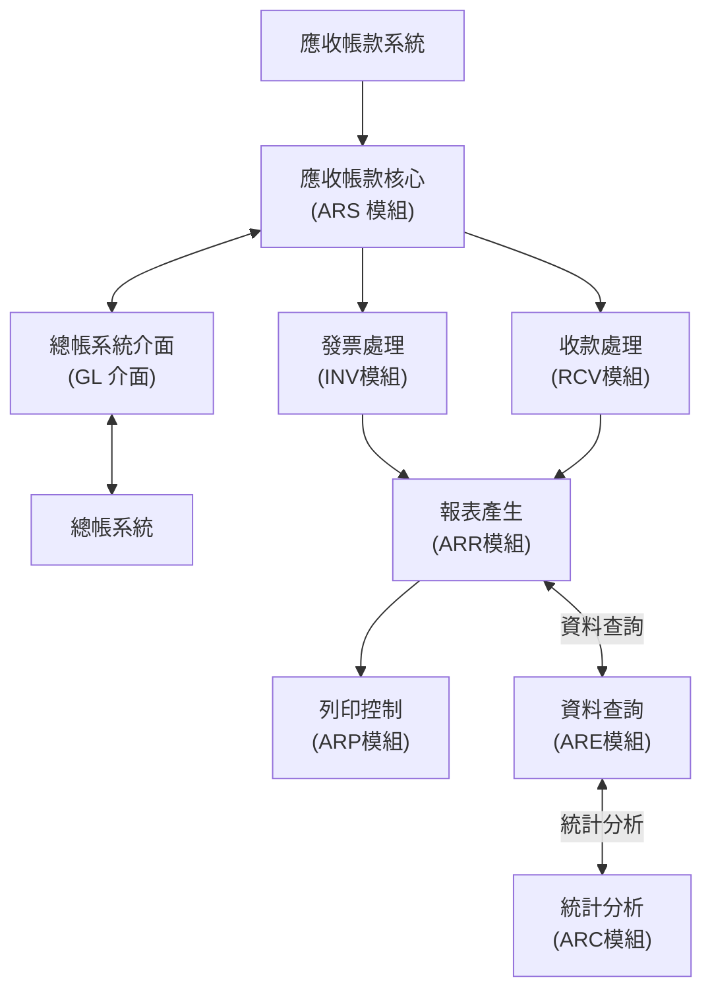
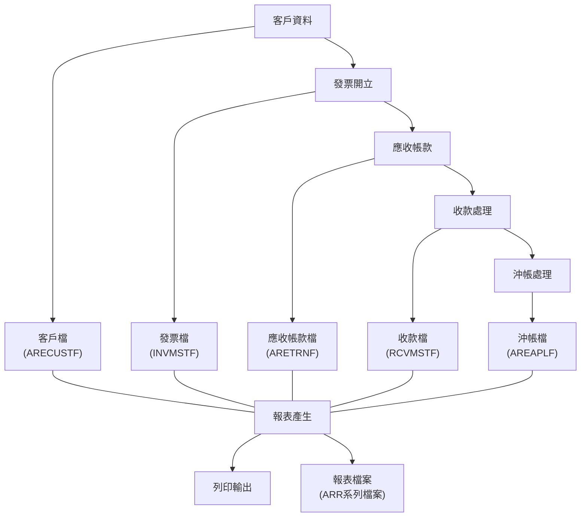
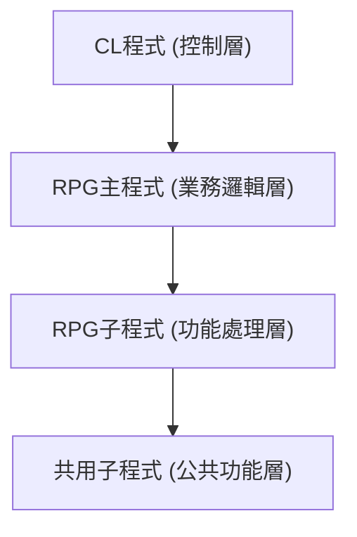
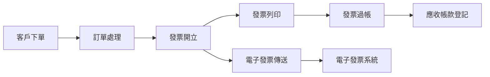

# 應收帳款系統規格書

## 文件資訊

| 項目 | 內容 |
|------|------|
| 系統名稱 | 應收帳款系統 |
| 系統環境 | IBM AS/400 |
| 開發語言 | 傳統 RPG 固定格式、CL |
| 檔案總數 | 5912個檔案 (RPG: 2962, DDS: 1606, CL: 1344) |
| 文件版本 | 1.0 |
| 文件日期 | 2024/06/01 |

## 目錄

1. [系統概述](#1-系統概述)
2. [系統架構](#2-系統架構)
3. [功能模組說明](#3-功能模組說明)
4. [資料庫設計](#4-資料庫設計)
5. [程式模組結構](#5-程式模組結構)
6. [系統流程](#6-系統流程)
7. [安全與權限控制](#7-安全與權限控制)
8. [特殊考量與限制](#8-特殊考量與限制)
9. [錯誤處理機制](#9-錯誤處理機制)
10. [附錄](#10-附錄)

## 1. 系統概述

### 1.1 系統目的與範圍

此應收帳款系統是以 IBM AS/400 傳統 RPG 固定格式開發的企業級應用系統，專為管理公司的應收帳款業務而設計。系統主要負責應收帳款管理、電子發票狀態查詢及列印、報表產生等功能，確保公司財務資料的準確性與完整性，提高應收帳款管理效率。

### 1.2 系統背景

此系統是資訊系統的核心組成部分，與其他系統（如總帳系統、庫存系統等）有密切的資料交換關係。系統使用傳統 RPG 固定格式開發，符合公司長期使用 AS/400 平台的技術策略，確保與既有系統的良好整合性。

### 1.3 主要使用者

- **財務部門**：負責日常應收帳款管理、發票開立與收款確認
- **會計部門**：進行帳務處理與報表分析
- **業務部門**：查詢客戶帳款狀態與信用資訊
- **管理階層**：檢視財務報表與統計分析資訊
- **系統管理員**：負責系統維護與使用者權限管理

### 1.4 主要功能概述

- **應收帳款管理**：客戶資料維護、信用額度控管、帳款追蹤
- **發票處理**：電子發票開立、列印與管理
- **收款處理**：帳款收取登記、沖帳處理
- **報表生成**：應收帳款報表、帳齡分析、收款統計等
- **資料查詢**：發票資訊、帳款餘額、交易明細查詢
- **系統管理**：使用者權限設定、系統參數維護

## 2. 系統架構

### 2.1 硬體環境

| 項目 | 規格 |
|------|------|
| 主機 | IBM AS/400 |
| 處理器 | Power Systems |
| 記憶體 | 16GB 以上 |
| 儲存空間 | 500GB 以上 |
| 終端設備 | 5250 模擬終端機 |
| 印表機 | 高階雷射印表機 (支援 SCS 格式) |

### 2.2 軟體環境

| 項目 | 規格 |
|------|------|
| 作業系統 | IBM i (OS/400) V7R2 以上 |
| 資料庫 | DB2 for i |
| 開發語言 | 傳統 RPG 固定格式 (OPM RPG) |
| 控制語言 | CL (Control Language) |
| 檔案定義 | DDS (Data Description Specifications) |
| 報表工具 | Native RPG 報表功能 |

### 2.3 系統架構圖

### 2.4 系統模組關係

應收帳款系統由多個功能模組組成，各模組間具有明確的功能分工和資料流轉關係：

- **核心模組 (ARS)**：負責系統控制與核心功能
- **發票模組 (INV/INE)**：處理發票相關業務
- **收款模組 (RCV)**：處理收款與沖帳業務
- **報表模組 (ARR)**：提供各類財務報表功能
- **資料查詢模組 (ARE)**：提供查詢與編輯功能
- **列印模組 (ARP)**：管理各類列印輸出功能
- **資料轉換模組 (CNV)**：負責資料轉換與匯入匯出
- **交易模組 (TRN)**：管理各類交易處理

## 3. 功能模組說明

### 3.1 應收帳款核心模組 (ARS系列)

此模組是系統的核心，負責整體控制與管理：

- **系統初始設定 (ARS000-ARS020)**
  - 系統參數設定
  - 帳務期間設定
  - 使用者權限管理

- **帳款控制功能 (ARS030-ARS090)**
  - 應收帳款主檔維護
  - 客戶信用額度控管
  - 帳務狀態監控

- **系統整合功能 (ARS100-ARS200)**
  - 與總帳系統介面
  - 與庫存系統資料交換
  - 批次作業處理

### 3.2 發票處理模組 (INV/INE系列)

負責發票相關的所有處理：

- **發票開立功能**
  - 一般發票開立
  - 特殊發票處理
  - 發票異動管理

- **電子發票功能**
  - 電子發票開立與傳送
  - 電子發票狀態查詢
  - 電子發票作廢與折讓

- **發票管理功能**
  - 發票號碼管理
  - 發票明細維護
  - 未結發票追蹤

### 3.3 收款處理模組 (RCV/SAR系列)

負責收款與沖帳相關功能：

- **收款登記功能**
  - 收款資料輸入
  - 收據產生
  - 收款批次處理

- **沖帳處理功能**
  - 發票沖帳處理
  - 部分收款處理
  - 預收款管理

- **退款處理功能**
  - 退款申請處理
  - 退款沖帳處理
  - 退款單列印

### 3.4 報表產生模組 (ARR系列)

負責產生各種財務報表：

- **應收帳款報表**
  - 應收帳款明細表
  - 應收帳款餘額表
  - 帳款帳齡分析表

- **發票統計報表**
  - 發票開立統計表
  - 發票金額分析表
  - 電子發票狀態表

- **收款統計報表**
  - 收款明細表
  - 客戶收款分析表
  - 收款方式統計表

### 3.5 資料查詢與編輯模組 (ARE系列)

負責各類資料的查詢與編輯功能：

- **客戶資料維護**
  - 客戶基本資料管理
  - 客戶信用資訊維護
  - 客戶帳款查詢

- **發票資料查詢**
  - 發票狀態查詢
  - 發票明細查詢
  - 發票歷史記錄

- **交易資料編輯**
  - 交易資料維護
  - 批次交易處理
  - 交易歷史查詢

### 3.6 列印控制模組 (ARP系列)

負責系統各類報表與單據的列印輸出：

- **發票列印功能**
  - 電子發票列印
  - 銷售發票列印
  - 特殊發票格式列印

- **對帳單列印功能**
  - 客戶對帳單列印
  - 定期對帳單產生
  - 對帳單格式設定

- **報表列印控制**
  - 報表格式設定
  - 報表批次列印
  - 列印參數控制

## 4. 資料庫設計

### 4.1 主要資料檔案

| 檔案代號 | 功能說明 | 檔案類型 | 主要欄位數 |
|---------|---------|---------|----------|
| ARECUSTF | 客戶主檔 | PF | 45 |
| AREINVF | 發票主檔 | PF | 65 |
| ARETRNF | 交易主檔 | PF | 55 |
| ARERCVF | 收款主檔 | PF | 50 |
| AREAPLF | 沖帳主檔 | PF | 75 |
| INVMSTF | 發票主檔 | PF | 85 |
| INVDTLF | 發票明細檔 | PF | 45 |
| RCVMSTF | 收據主檔 | PF | 42 |
| RCVDTLF | 收據明細檔 | PF | 35 |
| TRNMSTF | 交易主檔 | PF | 48 |
| TRNDTLF | 交易明細檔 | PF | 38 |

### 4.2 邏輯檔案

| 檔案代號 | 功能說明 | 基於主檔 | 存取路徑 |
|---------|---------|---------|---------|
| ARECUSTLF | 客戶主檔邏輯檔案 | ARECUSTF | 客戶代號 |
| AREINVLF1 | 發票客戶邏輯檔案 | AREINVF | 客戶代號 |
| AREINVLF2 | 發票日期邏輯檔案 | AREINVF | 發票日期 |
| ARETRNLF | 交易主檔邏輯檔案 | ARETRNF | 交易編號 |
| INVLF1 | 發票客戶邏輯檔案 | INVMSTF | 客戶代號 |
| INVLF2 | 發票日期邏輯檔案 | INVMSTF | 發票日期 |
| INVLF3 | 發票號碼邏輯檔案 | INVMSTF | 發票號碼 |
| RCVLF1 | 收據客戶邏輯檔案 | RCVMSTF | 客戶代號 |
| TRNLF1 | 交易客戶邏輯檔案 | TRNMSTF | 客戶代號 |
| TRNLF2 | 交易日期邏輯檔案 | TRNMSTF | 交易日期 |

### 4.3 顯示檔案

| 檔案代號 | 功能說明 | 關聯程式 |
|---------|---------|---------|
| ARECUST10D | 客戶資料維護畫面 | ARECUST10R |
| AREINV20D | 發票資料維護畫面 | AREINV20R |
| ARETRN30D | 交易資料編輯畫面 | ARETRN30R |
| ARERCV40D | 收款資料處理畫面 | ARERCV40R |
| AREAPL50D | 沖帳處理畫面 | AREAPL50R |
| ARS010D | 應收帳款主檔維護畫面 | ARS010R |
| ARS020D | 應收帳款初始設定畫面 | ARS020R |
| ARS030D | 應收帳款批次處理畫面 | ARS030R |
| ARS090D | 應收帳款系統管理畫面 | ARS090R |
| SARCVD10D | 銷售收據畫面 | SARCVD10R |

### 4.4 資料流程圖

### 4.5 資料字典

所有系統使用的欄位均遵循統一的命名與定義標準：

- **客戶代號 (CUST#)**: 10位文數字代碼，唯一識別客戶
- **發票號碼 (INV#)**: 10位文數字，符合稅務格式規範
- **交易代號 (TRN#)**: 8位文數字，唯一識別交易
- **收款號碼 (RCV#)**: 8位文數字，唯一識別收款記錄
- **日期欄位 (DATE)**: 8位數字 (YYYYMMDD)
- **金額欄位 (AMT)**: 13位數字 (XXX,XXX,XXX.XX)
- **狀態代碼 (STS)**: 1位文數字，表示記錄狀態
- **使用者代碼 (USER)**: 10位文數字，記錄操作者

## 5. 程式模組結構

### 5.1 RPG程式架構

應收帳款系統中的RPG程式採用傳統固定格式結構，主要的程式群組包括：

- **ARP系列**：列印相關程式 (1086個檔案，佔36.6%)
- **ARR系列**：報表相關程式 (1027個檔案，佔34.7%)
- **ARE系列**：編輯處理程式 (729個檔案，佔24.6%)
- **其他系列**：特殊功能程式 (120個檔案，佔4.1%)

### 5.2 CL程式架構

CL程式負責系統的控制流程和執行環境設定：

- **ARP系列**：列印控制程式 (625個檔案，佔46.5%)
- **ARR系列**：報表控制程式 (477個檔案，佔35.5%)
- **ARE系列**：編輯控制程式 (130個檔案，佔9.7%)
- **CNV系列**：資料轉換控制程式 (45個檔案，佔3.3%)
- **ARS系列**：應收帳款控制程式 (28個檔案，佔2.1%)
- **其他系列**：其他控制程式 (39個檔案，佔2.9%)

### 5.3 DDS檔案架構

DDS檔案定義了系統中所有資料結構和界面：

- **ARR系列**：報表相關DDS (602個檔案，佔37.5%)
- **ARE系列**：編輯相關DDS (364個檔案，佔22.7%)
- **ARP系列**：列印相關DDS (194個檔案，佔12.1%)
- **INE/INV系列**：發票相關DDS (102個檔案，佔6.3%)
- **其他系列**：其他功能DDS (344個檔案，佔21.4%)

### 5.4 程式呼叫關係

應收帳款系統的程式呼叫結構採用層次化設計：

典型的程式呼叫流程：
1. CL程式設定執行環境和參數
2. CL程式呼叫RPG主程式
3. RPG主程式處理主要業務邏輯
4. RPG主程式呼叫特定功能子程式
5. 子程式調用共用功能模組
6. 處理完成後返回結果

## 6. 系統流程

### 6.1 主要業務流程

#### 6.1.1 發票處理流程

#### 6.1.2 收款處理流程

#### 6.1.3 月結處理流程

### 6.2 系統作業流程

#### 6.2.1 日常作業流程

- **晨間處理**：系統啟動檢查、日誌檢視
- **日常交易**：發票處理、收款處理、查詢服務
- **日結作業**：交易資料備份、日報表產生
- **特殊處理**：異常處理、資料修正作業

#### 6.2.2 月結作業流程

- **月結準備**：月結前檢查、資料確認
- **月結處理**：月結程式執行、應收帳款結轉
- **報表產生**：月報表產生、財務分析報表
- **資料歸檔**：歷史資料歸檔、月結資料備份

#### 6.2.3 年度作業流程

- **年度結轉**：年度帳務結轉、帳款狀態更新
- **年度報表**：年度財務報表、趨勢分析報表
- **年度資料歸檔**：歷史資料歸檔、系統檔案重組

## 7. 安全與權限控制

### 7.1 使用者權限結構

- **系統管理員**：完整系統管理與維護權限
- **財務主管**：系統參數設定、特殊處理權限
- **財務人員**：日常交易處理、報表產生權限
- **業務人員**：客戶資料查詢、訂單處理權限
- **查詢使用者**：唯讀查詢權限

### 7.2 交易安全控制

- **交易授權控制**：依金額級別進行授權控制
- **操作紀錄追蹤**：記錄所有資料變更與操作
- **異常交易檢測**：監控並標示異常交易模式
- **資料輸入驗證**：嚴格的資料輸入與格式檢查

### 7.3 系統安全機制

- **登入安全控制**：帳號密碼驗證，登入失敗限制
- **作業權限控制**：功能與資料存取權限控管
- **資料備份機制**：定時自動備份與手動備份機制
- **災難復原計劃**：系統故障復原程序與機制

## 8. 特殊考量與限制

### 8.1 系統限制

- **處理容量限制**：
  - 每日最大交易處理量：約10,000筆交易
  - 客戶主檔最大容量：約50,000筆客戶記錄
  - 歷史資料保留期限：線上資料保留24個月

- **效能限制**：
  - 交易處理回應時間：一般應在3秒內
  - 報表產生時間：一般報表應在5分鐘內完成
  - 批次處理時間：夜間批次不超過4小時

### 8.2 技術限制

- **傳統RPG限制**：
  - 固定格式RPG程式碼結構限制
  - 程序式程式設計模式限制
  - 程式段落大小限制

- **AS/400平台限制**：
  - 舊版作業系統功能限制
  - 終端顯示格式限制 (24x80字符)
  - 系統資源使用限制

### 8.3 整合考量

- **與其他系統整合**：
  - 與總帳系統的資料交換機制
  - 與庫存系統的整合介面
  - 與電子發票系統的連線處理

- **資料轉換考量**：
  - 歷史資料轉換機制
  - 特殊資料格式處理
  - 跨系統資料一致性維護

## 9. 錯誤處理機制

### 9.1 錯誤代碼結構

應收帳款系統採用標準化的錯誤代碼結構：
- **E開頭**：表示嚴重錯誤，需立即處理
- **W開頭**：表示警告訊息，可繼續但需注意
- **I開頭**：表示資訊訊息，純粹通知用途

### 9.2 常見錯誤處理

| 錯誤代碼 | 說明 | 處理方式 |
|---------|------|---------|
| E0001 | 資料庫存取錯誤 | 檢查資料庫連線與權限 |
| E0002 | 交易處理失敗 | 檢查交易資料完整性 |
| E0003 | 系統參數錯誤 | 檢查系統參數設定 |
| W0001 | 客戶信用額度警告 | 檢查客戶信用狀態 |
| W0002 | 發票日期異常 | 確認發票日期有效性 |
| I0001 | 交易完成通知 | 確認交易結果 |

### 9.3 故障復原機制

- **交易復原機制**：交易異常中斷時的回滾機制
- **系統重啟流程**：系統崩潰後的重啟與恢復步驟
- **資料修復工具**：資料損壞時的修復工具與程序
- **緊急應變程序**：系統嚴重故障時的應變措施

## 10. 附錄

### 10.1 術語表

| 術語 | 定義 |
|------|------|
| 應收帳款 | 公司因銷售商品或提供服務而尚未收回的款項 |
| 沖帳 | 將收到的款項與對應的應收項目進行配對處理 |
| 帳齡分析 | 依據應收帳款時間長短進行的分析報表 |
| 電子發票 | 符合電子發票格式規範的數位化發票 |
| 月結 | 每月固定進行的帳務結算作業 |

### 10.2 相關文件清單

- [RPG程式清單](./RPG程式清單.md)
- [DDS檔案清單](./DDS檔案清單.md)
- [CL程式清單](./CL程式清單.md)
- 使用者操作手冊 (另冊)
- 系統維護手冊 (另冊)

### 10.3 系統發展歷程

| 版本 | 發布日期 | 主要更新內容 |
|------|---------|------------|
| 1.0 | 1995/01 | 系統初版發布 |
| 2.0 | 2000/03 | 增加電子發票功能 |
| 2.5 | 2005/06 | 強化報表功能與查詢介面 |
| 3.0 | 2010/09 | 整合外部系統介面 |
| 3.5 | 2015/12 | 優化效能與資料結構 |
| 4.0 | 2020/03 | 符合最新法規與稅務需求 |

### 10.4 未來發展計劃

- **系統現代化**：評估RPG轉換至現代化語言的可能性
- **功能擴充**：計劃增加行動查詢與報表功能
- **雲端整合**：研究與雲端服務整合的可行方案
- **AI應用**：評估AI技術在應收帳款預測中的應用 