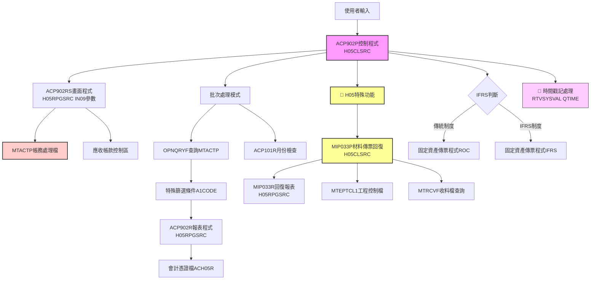
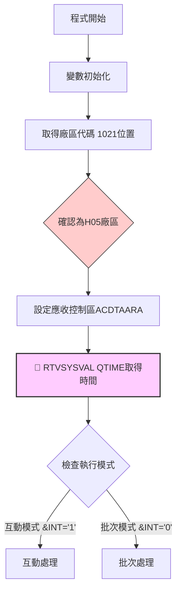
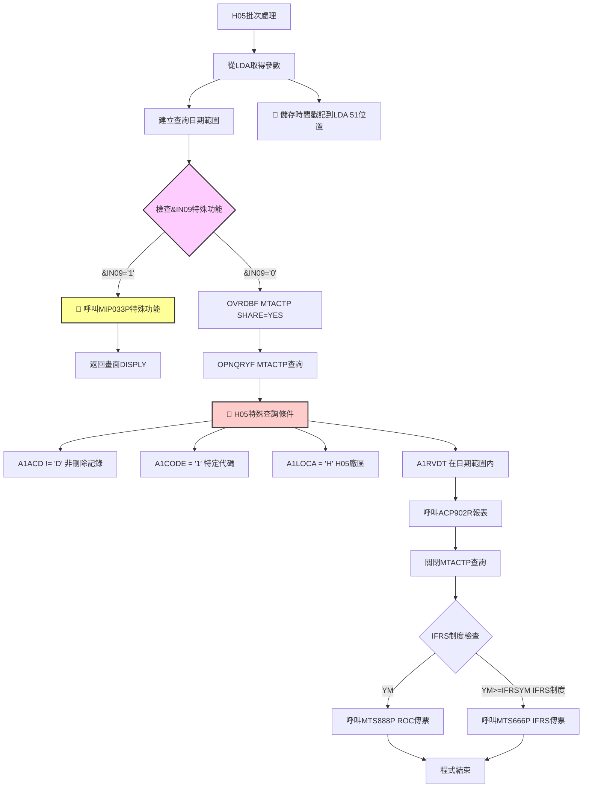
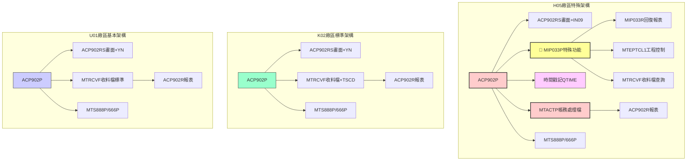
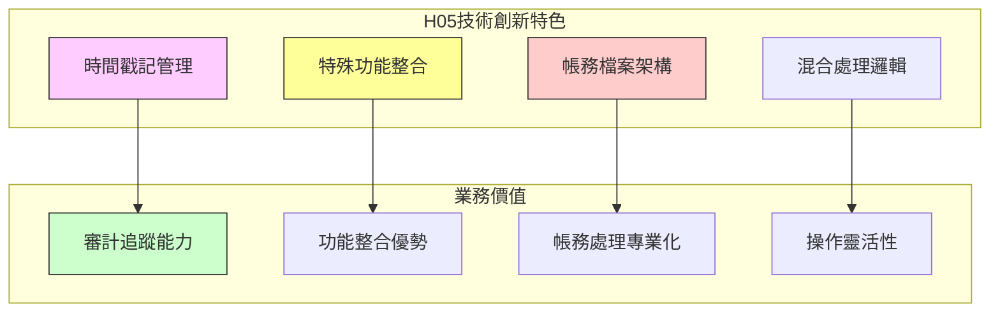

# ACP902P_H05 程式規格書

## 1. 基本資料
- **程式編號**：ACP902P
- **程式名稱**：材料收料傳票作業
- **程式類型**：CLP (控制語言程式)
- **程式位置**：H05CLSRC/ACP902P_H05.txt
- **開發人員**：S00TPC（多次修改）
- **系統名稱**：應收帳款管理系統
- **子系統**：材料收料帳務處理
- **開發日期**：97/06/11
- **最後修改**：113/08/15 2024MT00017 S00TPC(1308A)

## 2. 程式功能說明
此程式為H05廠區的材料收料傳票作業批次控制程式，**採用與其他廠區完全不同的檔案架構和處理邏輯**，是三個廠區中最具特色的實現版本。

### 主要功能
1. **帳務處理傳票作業**：使用MTACTP帳務處理檔而非標準收料檔
2. **IFRS轉換支援**：支援傳統會計制度與IFRS制度的轉換處理
3. **特殊功能整合**：整合MIP033P材料傳票回復作業
4. **時間戳記管理**：獨有的時間戳記處理機制
5. **互動與批次模式**：提供互動式輸入和批次處理兩種執行模式

### 🔍 H05廠區特殊功能架構
- **MTACTP檔案處理**：使用帳務處理檔而非標準材料收料檔
- **MIP033P特殊功能**：材料傳票回復作業整合
- **時間戳記控制**：獨有的&TIME變數和時間管理機制
- **&IN09參數控制**：特殊的功能選擇參數（取代標準&YN參數）
- **A1CTRL分類邏輯**：帳務處理的控制碼分類系統

## 3. 檔案架構與關聯圖

### 視覺化架構圖


### 主要檔案清單
| 檔案名稱 | 類型 | 說明 | 用途 | H05特殊性 |
|---------|------|------|------|-----------|
| **MTACTP** | 帳務處理檔 | 帳務處理主檔，H05專用 | INPUT | 完全不同的檔案架構 |
| **MTEPTCL1** | 工程控制檔 | MIP033P使用的工程控制檔 | CONTROL | H05特殊功能專用 |
| **MTRCVF** | 材料收料檔 | MIP033P中用於回復處理 | REFERENCE | 僅在特殊功能中使用 |
| **ACVOUR** | 會計憑證檔 | 動態命名ACH05R | OUTPUT | 帳務傳票輸出 |
| **ACDTAARA** | 應收控制區 | 應收帳款系統控制資料區 | CONTROL | 系統控制參數 |
| **AMIFRSCTL** | IFRS控制檔 | IFRS實施日期控制 | CONTROL | 共用控制檔 |

## 4. 🎯 欄位切割技術詳解

### 無DS結構切割
此程式為CLP程式，主要使用變數和資料區域(Data Area)進行資料操作，**未使用DS結構進行欄位切割**。

### 🎯 重要變數定義與用途分析

#### H05特有變數架構
```
H05特殊變數系統：
&P#YM (6字元) ← H05特有的年月處理變數
&IN09 (邏輯型) ← H05特殊功能選擇參數（替代&YN）
&TIME (6字元) ← 時間戳記處理變數
&S#TYPE (1字元) ← 處理類型控制變數
```

#### 🎯 資料區域挪用分析
程式大量使用*LDA(本地資料區域)進行資料傳遞：

| 位置 | 長度 | 變數 | 原始用途 | 實際挪用用途 | H05特殊處理 |
|------|------|------|----------|-------------|-------------|
| 1-8 | 8 | &DATEA | 主處理日期 | 畫面輸入的處理日期 | 標準日期處理 |
| 9-1 | 1 | &AREA | 廠區代碼 | 固定為'H'廠區識別 | 固定值'H' |
| 10-8 | 8 | &DATE1A | 起始日期 | 查詢範圍起始日期 | 帳務處理日期範圍 |
| 18-8 | 8 | &DATE2A | 結束日期 | 查詢範圍結束日期 | 帳務處理日期範圍 |
| 31-6 | 6 | &P#VRNS | 憑證號碼起 | 固定資產傳票起始號碼 | 標準憑證編號 |
| 41-6 | 6 | &P#VRNE | 憑證號碼迄 | 固定資產傳票結束號碼 | 標準憑證編號 |
| 51-6 | 6 | &TIME | **時間戳記** | **H05特有時間戳記控制** | **H05獨有功能** |
| 472-6 | 6 | &IFRSYM | IFRS年月 | IFRS制度實施年月控制 | 標準IFRS控制 |
| 1021-1 | 1 | &AREA | 廠區備份 | 從系統取得，固定為'H' | H05廠區專用 |

#### 🎯 挪用原因分析
1. **帳務系統專用化**：針對帳務處理的特殊需求設計資料結構
2. **時間戳記管理**：H05獨有的時間戳記控制機制，用於審計追蹤
3. **特殊功能支援**：為MIP033P等特殊功能預留資料區域空間

## 5. 輸出/入螢幕布局與說明

### 互動模式畫面（ACP902RS）
```
+----------------------------------------------------------+
|              材料收料傳票作業 (ACP902P)                   |
|                  H05廠區特殊架構版本                      |
+----------------------------------------------------------+
| 起始日期: [YYYYMMDD]    結束日期: [YYYYMMDD]             |
| 處理日期: [YYYYMMDD]    廠區: [H] H05廠區                |
| 特殊功能: [0/1]         0=一般處理 1=材料傳票回復        |
| 時間戳記: [HHMMSS]      系統自動取得                    |
+----------------------------------------------------------+
| 功能鍵: F7=取消 F9=特殊功能 F12=離開                    |
+----------------------------------------------------------+
```

### 報表輸出說明
1. **帳務處理傳票報表** - 156欄寬，12CPI格式
2. **應收帳款憑證** - 輸出至ACH05R檔案
3. **材料傳票回復報表** - MIP033P特殊功能輸出
4. **IFRS制度對應** - 依制度選擇適當的傳票程式

## 6. 🎯 處理流程程序說明

### 主程序邏輯深度分析

#### 第一階段：H05特殊初始化與模式判斷


#### 第二階段：H05特殊帳務處理邏輯


### 🎯 H05廠區特殊業務邏輯分析

#### 1. MTACTP帳務處理檔查詢條件
```sql
查詢條件：
A1ACD *NE "D"                     -- 非刪除記錄
AND A1CODE *EQ "1"                -- 特定處理代碼
AND A1LOCA *EQ "H"                -- H05廠區限定
AND A1RVDT *EQ %RANGE(DATE1A DATE2A)  -- 收料日期範圍
排序：(A1CTRL)(A1RVDT)(A1RVNO)    -- 控制碼、日期、單號排序
```

**業務意義**：
- **帳務導向處理**：使用帳務處理檔而非收料檔
- **代碼分類管理**：A1CODE='1'表示特定的帳務處理類別
- **控制碼排序**：A1CTRL提供帳務處理的分類控制

#### 2. MIP033P特殊功能處理（&IN09='1'）
```
IF (&IN09 = '1') THEN
    呼叫 MIP033P 材料傳票回復作業
    GOTO DISPLY (返回畫面重新選擇)
```

**MIP033P功能分析**：
- **月份特殊轉換**：10月→X, 11月→Y, 12月→Z
- **傳票號碼範圍**：YM0001 到 YM9999
- **雙檔案處理**：同時處理MTEPTCL1和MTRCVF
- **回復作業**：材料傳票的回復處理機制

#### 3. 時間戳記管理機制
```
RTVSYSVAL SYSVAL(QTIME) RTNVAR(&TIME)
CHGDTAARA DTAARA(*LDA (51 6)) VALUE(&TIME)
```

**業務意義**：
- **審計追蹤**：記錄程式執行的精確時間
- **處理追蹤**：便於問題追查和效能分析
- **H05獨有**：其他廠區無此功能

## 7. 🎯 數據操作與轉換分析

### 檔案操作詳解
1. **MTACTP帳務處理檔**：
   - **READ操作**：使用OPNQRYF對MTACTP進行條件查詢
   - **帳務邏輯**：基於帳務處理而非物料收料的邏輯
   - **控制碼排序**：依A1CTRL進行分類處理
   - **特殊代碼篩選**：A1CODE='1'的特定業務邏輯

2. **ACVOUR會計憑證檔**：
   - **WRITE操作**：輸出帳務相關的應收帳款傳票
   - **檔案命名**：固定命名為ACH05R
   - **傳票格式**：遵循H05廠區的會計憑證格式

### H05特殊數據轉換邏輯
1. **帳務vs收料處理**：
   - 從物料收料邏輯轉換為帳務處理邏輯
   - 使用帳務控制碼而非收料單號分類

2. **時間戳記處理**：
   - 系統時間的自動取得和儲存
   - 作為處理追蹤的重要資訊

3. **特殊功能整合**：
   - MIP033P的材料傳票回復功能
   - 雙檔案同時處理的複雜邏輯

## 8. 錯誤處理程序說明
- **ACP101R檢查**：呼叫ACP101R進行月份檢查，返回代碼判斷處理
- **日期檢查**：在ACP902RS中進行日期格式和合理性檢查
- **檔案存在檢查**：使用MONMSG處理檔案不存在的情況
- **查詢錯誤處理**：OPNQRYF操作的錯誤處理邏輯
- **特殊功能錯誤處理**：MIP033P調用的錯誤處理機制
- **時間取得錯誤處理**：RTVSYSVAL操作的錯誤處理
- **系統錯誤處理**：使用MONMSG CPF0000處理一般系統錯誤

## 9. 🎯 特殊技術實現說明

### H05廠區獨有技術架構
1. **帳務檔案架構**：
   - 使用MTACTP帳務處理檔替代標準MTRCVF收料檔
   - 基於帳務邏輯而非物料邏輯的處理方式
   - A1CTRL控制碼的分類管理系統

2. **時間戳記系統**：
   - 自動取得系統時間並儲存至LDA
   - 提供精確的處理時間追蹤
   - 便於審計和效能分析

3. **特殊功能整合**：
   - MIP033P材料傳票回復作業的無縫整合
   - &IN09參數的特殊功能選擇機制
   - 互動式的功能切換設計

### H05廠區程式設計特色
1. **混合架構設計**：
   - 主程式使用帳務檔案架構
   - 特殊功能仍使用標準收料檔案
   - 雙重架構的靈活運用

2. **增強審計功能**：
   - 時間戳記的詳細記錄
   - 處理類型的明確分類
   - 追蹤友好的設計

3. **功能整合最佳化**：
   - 單一程式整合多種功能
   - 互動式的功能選擇
   - 流程導向的使用體驗

## 10. 🎯 跨廠區版本分析

### 版本分布情況與架構差異
| 程式名稱 | H05 | K02 | U01 | P02 | H05特殊性說明 |
|---------|-----|-----|-----|-----|---------------|
| **ACP902P** | ✅ | ✅ | ✅ | ❌ | **完全不同的檔案架構** |
| **ACP902RS** | ✅ | ✅ | ✅ | ❌ | **&IN09參數vs&YN參數** |
| **ACP902R** | ✅ | ✅ | ✅ | ❌ | 基本一致，但資料來源不同 |
| **MIP033P** | ✅ | ❌ | ❌ | ❌ | **H05獨有特殊功能** |
| **MIP033R** | ✅ | ❌ | ❌ | ❌ | **H05獨有報表程式** |

### 程式碼差異分析

#### 🔍 重大架構差異比較

**1. 檔案架構根本差異**
| 廠區 | 主要檔案 | 檔案性質 | 查詢條件核心 | 業務邏輯 |
|------|----------|----------|-------------|----------|
| **H05** | **MTACTP** | **帳務處理檔** | **A1CODE='1', A1CTRL** | **帳務導向** |
| **K02** | MTRCVF | 材料收料檔 | I2TSCD*NE'0F' | 收料導向+交易分類 |
| **U01** | MTRCVF | 材料收料檔 | I2VRNO='空白', I2VRSQ=0 | 標準收料導向 |

**2. 特殊功能對比分析**
| 特殊功能 | H05版本 | K02版本 | U01版本 | 功能說明 |
|---------|---------|---------|---------|----------|
| **特殊程式調用** | ✅ **MIP033P回復作業** | ❌ 無 | ❌ 無 | H05獨有材料傳票回復 |
| **參數控制** | ✅ **&IN09特殊功能** | ✅ &YN選擇性處理 | ✅ &YN選擇性處理 | H05使用不同參數 |
| **時間管理** | ✅ **&TIME時間戳記** | ❌ 無 | ❌ 無 | H05獨有審計功能 |
| **檔案覆寫** | ✅ **MTACTP帳務檔** | ✅ MTRCVF收料檔 | ✅ MTRCVF收料檔 | H05使用不同檔案 |

**3. 歷史演進對比**
| 版本差異 | H05版本 | K02版本 | U01版本 | H05特殊性 |
|---------|---------|---------|---------|-----------|
| 9905A更新 | ✅ 99/05/27 | ❌ 無 | ❌ 無 | H05特有功能演進 |
| 9810A更新 | ❌ 無 | ✅ 98/10/16 | ❌ 無 | K02特有更新 |
| 9911A更新 | ❌ 無 | ❌ 無 | ✅ 99/11/18 | U01特有更新 |
| **1308A更新** | ✅ **113/08/15** | ❌ 無 | ❌ 無 | **H05最新功能增強** |

**4. 完整功能架構對比圖**


### 功能差異說明

#### 🎯 H05廠區作為特殊架構版本的特色
1. **完全不同的業務邏輯**：
   - ✅ **帳務處理導向而非收料導向**
   - ✅ **A1CTRL控制碼分類系統**
   - ✅ **帳務檔案架構設計**

2. **獨有功能最豐富**：
   - ✅ **MIP033P材料傳票回復作業**
   - ✅ **時間戳記審計功能**
   - ✅ **特殊功能整合設計**

3. **最新技術實現**：
   - ✅ **1308A最新更新（113/08/15）**
   - ✅ **混合檔案架構運用**
   - ✅ **增強審計追蹤能力**

#### 🎯 與其他廠區的根本差異
1. **檔案架構差異**：
   - **H05**：✅ **MTACTP帳務檔+特殊功能**
   - **K02**：MTRCVF收料檔+交易分類
   - **U01**：MTRCVF收料檔標準處理

2. **業務邏輯差異**：
   - **H05**：✅ **帳務處理+材料回復雙重邏輯**
   - **K02**：收料處理+交易分類邏輯
   - **U01**：標準收料處理邏輯

3. **功能豐富度差異**：
   - **H05**：✅ **基本功能+特殊功能+審計功能**
   - **K02**：基本功能+增強篩選
   - **U01**：基本功能

### 調用關係與技術創新分析


### 系統整合影響評估
1. **跨廠區資料一致性挑戰**：
   - H05使用帳務檔案架構，與其他廠區資料結構根本不同
   - 需要特殊的資料轉換機制進行跨廠區整合

2. **維護複雜度最高**：
   - H05版本包含最多特殊功能和獨有邏輯
   - 需要專門的技術人員維護

3. **業務功能最全面**：
   - H05提供最完整的帳務處理和材料管理功能
   - 特殊功能滿足H05廠區的獨特業務需求

4. **技術創新標竿**：
   - H05的設計可作為功能整合和審計追蹤的參考
   - 時間戳記管理機制具有推廣價值

## 11. 備註
- **獨特架構地位**：
  - H05版本採用完全不同的檔案架構和業務邏輯
  - 是三個廠區中最具創新性和專業化的實現
  - 帳務導向的設計滿足H05廠區的特殊業務需求

- **版本更新記錄**：
  - **1308A (113/08/15)**：最新功能增強，顯示持續演進
  - 0112A (101/12/07)：新增IFRS制度支援
  - 0011A (100/11/11)：新增傳票號碼範圍控制
  - 9905A (99/05/27)：H05特有功能更新
  - 9706A (97/06/11)：初始版本建立

- **技術創新特色**：
  - 帳務檔案架構的創新運用
  - MIP033P特殊功能的無縫整合
  - 時間戳記審計系統的實現
  - 混合處理邏輯的靈活設計

- **跨廠區整合建議**：
  - H05的帳務架構邏輯可供其他廠區參考
  - 時間戳記管理機制建議推廣到其他廠區
  - MIP033P的特殊功能需評估其他廠區的適用性
  - 建立H05與其他廠區的資料轉換標準 