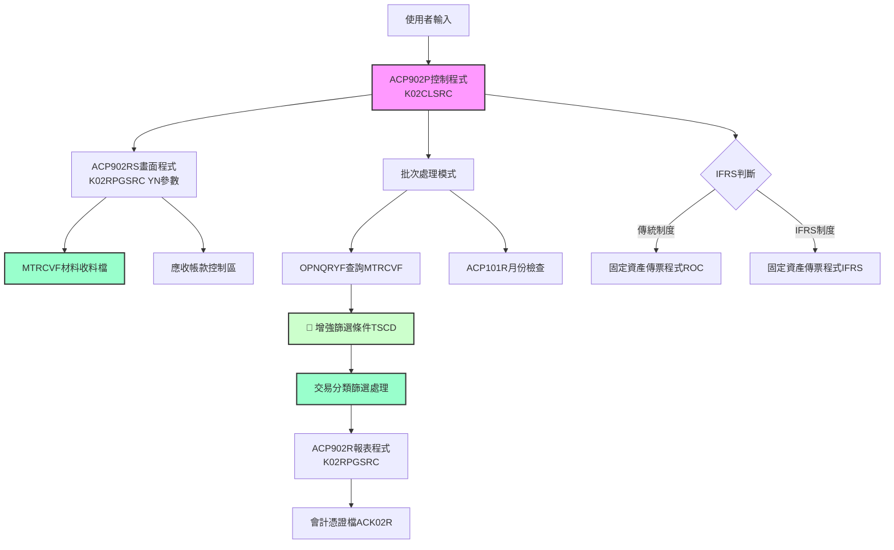
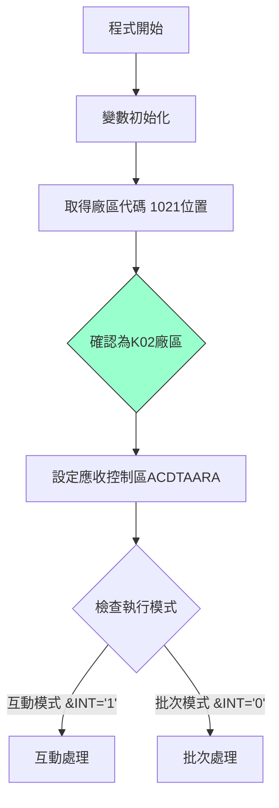
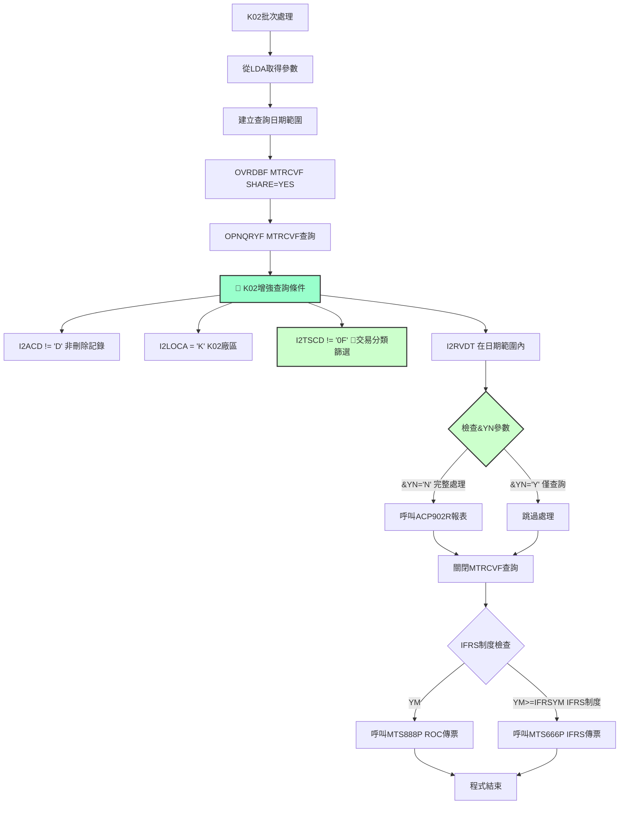
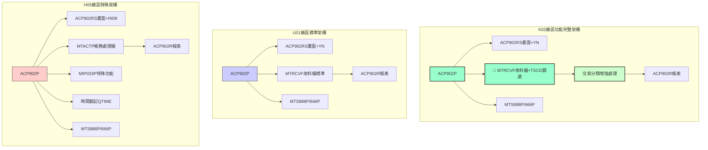
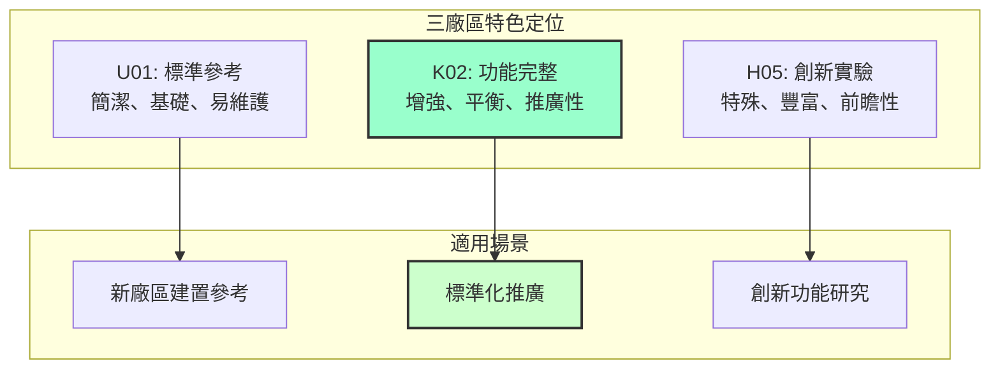

# ACP902P_K02 程式規格書

## 1. 基本資料
- **程式編號**：ACP902P
- **程式名稱**：材料收料傳票作業
- **程式類型**：CLP (控制語言程式)
- **程式位置**：K02CLSRC/ACP902P_K02.txt
- **開發人員**：S00TPC（多次修改）
- **系統名稱**：應收帳款管理系統
- **子系統**：材料收料帳務處理
- **開發日期**：97/06/12
- **最後修改**：101/12/07 2012MT635 S00TPC(0112A)

## 2. 程式功能說明
此程式為K02廠區的材料收料傳票作業批次控制程式，**在U01標準版本基礎上增加了交易分類篩選功能**，是三個廠區中功能最完整且標準化程度最高的實現版本。

### 主要功能
1. **增強材料收料傳票處理**：在標準收料處理基礎上增加交易分類篩選
2. **IFRS轉換支援**：支援傳統會計制度與IFRS制度的轉換處理
3. **交易分類控制**：透過I2TSCD欄位進行精確的交易分類篩選
4. **日期範圍查詢**：提供彈性的日期範圍篩選功能
5. **互動與批次模式**：提供互動式輸入和批次處理兩種執行模式

### 🔍 K02廠區功能完整特色
- **標準MTRCVF處理**：使用標準的材料收料檔案進行處理
- **交易分類增強**：增加I2TSCD≠'0F'的交易分類篩選條件
- **功能完整性**：在標準功能基礎上增加業務邏輯增強
- **選擇性執行**：透過&YN參數控制執行模式
- **標準化設計**：兼顧功能完整性與維護性的最佳平衡

## 3. 檔案架構與關聯圖

### 視覺化架構圖


### 主要檔案清單
| 檔案名稱 | 類型 | 說明 | 用途 | K02增強特性 |
|---------|------|------|------|-------------|
| **MTRCVF** | 材料收料檔 | 存放材料收料交易明細 | INPUT | 增加TSCD交易分類篩選 |
| **ACVOUR** | 會計憑證檔 | 動態命名ACK02R | OUTPUT | 收料傳票輸出 |
| **ACDTAARA** | 應收控制區 | 應收帳款系統控制資料區 | CONTROL | 系統控制參數 |
| **AMIFRSCTL** | IFRS控制檔 | IFRS實施日期控制 | CONTROL | 共用控制檔 |

## 4. 🎯 欄位切割技術詳解

### 無DS結構切割
此程式為CLP程式，主要使用變數和資料區域(Data Area)進行資料操作，**未使用DS結構進行欄位切割**。

### 🎯 重要變數定義與用途分析

#### K02標準化變數架構
```
K02功能完整變數系統：
&DATE (8位數值) ← 主要處理日期
&DATE1 (8位數值) ← 起始日期
&DATE2 (8位數值) ← 結束日期
&DATE1A (8字元) ← 起始日期字串
&DATE2A (8字元) ← 結束日期字串
&DATEA (8字元) ← 主處理日期字串
&DATEB (8字元) ← 系統預設日期
&YN (1字元) ← 選擇性處理控制（標準參數）
```

#### 🎯 資料區域挪用分析
程式大量使用*LDA(本地資料區域)進行資料傳遞：

| 位置 | 長度 | 變數 | 原始用途 | 實際挪用用途 | K02處理特色 |
|------|------|------|----------|-------------|-------------|
| 1-8 | 8 | &DATEA | 主處理日期 | 畫面輸入的處理日期 | 標準日期處理 |
| 9-1 | 1 | &AREA | 廠區代碼 | 固定為'K'廠區識別 | 固定值'K' |
| 10-8 | 8 | &DATE1A | 起始日期 | 查詢範圍起始日期 | 彈性日期範圍 |
| 18-8 | 8 | &DATE2A | 結束日期 | 查詢範圍結束日期 | 彈性日期範圍 |
| 31-6 | 6 | &P#VRNS | 憑證號碼起 | 固定資產傳票起始號碼 | 標準憑證編號 |
| 41-6 | 6 | &P#VRNE | 憑證號碼迄 | 固定資產傳票結束號碼 | 標準憑證編號 |
| 472-6 | 6 | &IFRSYM | IFRS年月 | IFRS制度實施年月控制 | 標準IFRS控制 |
| 1021-1 | 1 | &AREA | 廠區備份 | 從系統取得，固定為'K' | K02廠區專用 |

#### 🎯 挪用原因分析
1. **應收帳款系統標準化**：ACDTAARA控制區域提供應收帳款系統的標準化介面
2. **日期範圍靈活性**：使用多個日期變數支援複雜的日期範圍查詢需求
3. **廠區隔離處理**：確保收料資料僅處理本廠區相關交易
4. **功能完整性**：保持與U01相同的資料區域結構，確保標準化

## 5. 輸出/入螢幕布局與說明

### 互動模式畫面（ACP902RS）
```
+----------------------------------------------------------+
|              材料收料傳票作業 (ACP902P)                   |
|                  K02廠區功能完整版本                      |
+----------------------------------------------------------+
| 起始日期: [YYYYMMDD]    結束日期: [YYYYMMDD]             |
| 處理日期: [YYYYMMDD]    廠區: [K] K02廠區                |
| 選項: [Y/N]            Y=僅查詢 N=完整處理               |
| 交易篩選: 自動排除 0F   增強交易分類處理                 |
+----------------------------------------------------------+
| 功能鍵: F7=取消 F12=離開                                |
+----------------------------------------------------------+
```

### 報表輸出說明
1. **材料收料傳票報表** - 156欄寬，12CPI格式
2. **應收帳款憑證** - 輸出至ACK02R檔案
3. **交易分類增強** - 排除特定交易分類的資料
4. **IFRS制度對應** - 依制度選擇適當的傳票程式

## 6. 🎯 處理流程程序說明

### 主程序邏輯深度分析

#### 第一階段：K02標準初始化與模式判斷


#### 第二階段：K02增強材料收料處理邏輯


### 🎯 K02廠區增強業務邏輯分析

#### 1. MTRCVF增強查詢條件詳解
```sql
查詢條件：
I2ACD *NE "D"                     -- 非刪除記錄
AND I2LOCA *EQ "K"                -- K02廠區限定
AND I2TSCD *NE "0F"               -- 🎯 交易分類篩選（K02增強功能）
AND I2RVDT *EQ %RANGE(DATE1A DATE2A)  -- 收料日期範圍
排序：(I2RVDT)(I2RVNO)            -- 日期、單號排序
```

**業務意義**：
- **標準收料處理**：保持與U01相同的基本收料處理邏輯
- **交易分類增強**：I2TSCD≠'0F'排除特定的交易分類
- **功能完整性**：在標準功能基礎上增加業務邏輯篩選

#### 2. 交易分類篩選邏輯（I2TSCD≠'0F'）
```
K02特有篩選條件：
I2TSCD *NE "0F"  -- 排除交易分類代碼為'0F'的記錄
```

**業務意義**：
- **特定交易排除**：'0F'可能代表特殊的交易類型（如調整、修正等）
- **資料純淨化**：確保只處理正常的收料交易
- **業務邏輯增強**：相較於U01版本增加了更精確的資料篩選

#### 3. 選擇性處理邏輯（&YN參數）
```
IF (&YN = 'N') THEN
    執行完整處理流程（查詢 + 報表 + 傳票）
ELSE 
    僅執行查詢，不產生報表和傳票
```

**業務意義**：
- **查詢模式**：僅檢視資料，不產生實際傳票
- **處理模式**：完整執行收料傳票作業
- **標準參數**：與U01保持一致的操作介面

#### 4. IFRS制度判斷邏輯
```
IF (YM < IFRSYM) THEN
    呼叫 MTS888P (傳統ROC制度)
ELSE
    呼叫 MTS666P (IFRS制度)
```

**業務意義**：根據處理年月自動選擇適當的會計制度處理方式

## 7. 🎯 數據操作與轉換分析

### 檔案操作詳解
1. **MTRCVF材料收料檔**：
   - **READ操作**：使用OPNQRYF對MTRCVF進行增強條件查詢
   - **篩選邏輯**：比U01增加交易分類篩選，確保資料準確性
   - **排序方式**：依收料日期和收料單號排序
   - **範圍查詢**：支援靈活的日期範圍查詢

2. **ACVOUR會計憑證檔**：
   - **WRITE操作**：輸出材料收料相關的應收帳款傳票
   - **檔案命名**：固定命名為ACK02R
   - **傳票格式**：遵循K02廠區的會計憑證格式

### K02增強數據轉換邏輯
1. **日期格式轉換**：
   - 數值型日期轉換為字串型用於查詢
   - 支援YYYY/MM/DD格式的日期範圍處理

2. **廠區代碼標準化**：
   - 所有處理固定為K02廠區
   - 檔案命名自動加上K02識別

3. **交易分類邏輯**：
   - 自動排除'0F'交易分類的記錄
   - 確保資料處理的業務邏輯正確性

4. **條件邏輯優化**：
   - 使用複合查詢條件提升查詢效率
   - 在標準條件基礎上增加業務邏輯篩選

## 8. 錯誤處理程序說明
- **ACP101R檢查**：呼叫ACP101R進行月份檢查，返回代碼判斷處理
- **日期檢查**：在ACP902RS中進行日期格式和合理性檢查
- **檔案存在檢查**：使用MONMSG處理檔案不存在的情況
- **查詢錯誤處理**：OPNQRYF操作的錯誤處理邏輯
- **交易分類檢查**：確保TSCD欄位的有效性檢查
- **系統錯誤處理**：使用MONMSG CPF0000處理一般系統錯誤

## 9. 🎯 特殊技術實現說明

### K02廠區功能完整技術架構
1. **增強查詢策略**：
   - 在標準MTRCVF查詢基礎上增加交易分類篩選
   - 保持查詢效能的同時增加業務邏輯控制
   - 使用標準的AS/400查詢語法

2. **標準化檔案管理**：
   - ACVOUR檔案固定映射到ACK02R
   - 應收控制區域固定命名為ACDTAARA
   - 自動化的檔案覆寫和清理

3. **選擇性執行控制**：
   - 透過&YN參數提供靈活的執行模式
   - 支援測試和正式執行的分離
   - 與U01保持一致的操作介面

### K02廠區程式設計特色
1. **功能完整設計**：
   - 在標準功能基礎上增加業務邏輯增強
   - 保持與其他廠區的介面一致性
   - 兼顧功能完整性與維護性

2. **標準化架構**：
   - 遵循AS/400標準的CLP程式設計規範
   - 使用標準的檔案覆寫和查詢技術
   - 標準的錯誤處理機制

3. **業務邏輯優化**：
   - 清晰的畫面、控制、報表程式分離
   - 標準的參數傳遞介面設計
   - 增強的資料篩選邏輯

## 10. 🎯 跨廠區版本分析

### 版本分布情況與功能定位
| 程式名稱 | H05 | K02 | U01 | P02 | K02定位說明 |
|---------|-----|-----|-----|-----|-------------|
| **ACP902P** | ✅ | ✅ | ✅ | ❌ | **功能完整標準版本** |
| **ACP902RS** | ✅ | ✅ | ✅ | ❌ | **標準&YN參數** |
| **ACP902R** | ✅ | ✅ | ✅ | ❌ | 基本一致，資料品質更高 |

### 程式碼差異分析

#### 🔍 ACP902P系列完整對比分析

**1. 檔案架構與查詢邏輯比較**
| 廠區 | 主要檔案 | 檔案性質 | 查詢條件核心 | 功能定位 |
|------|----------|----------|-------------|----------|
| **K02** | **MTRCVF** | **材料收料檔** | **標準條件+TSCD篩選** | **功能完整版** |
| **U01** | MTRCVF | 材料收料檔 | 標準條件 | 標準參考版 |
| **H05** | MTACTP | 帳務處理檔 | 帳務邏輯+特殊功能 | 創新實驗版 |

**2. 查詢條件詳細對比**
| 查詢條件 | K02版本 | U01版本 | H05版本 | K02增強說明 |
|---------|---------|---------|---------|-------------|
| **基本條件** | ✅ I2ACD≠'D' | ✅ I2ACD≠'D' | ✅ A1ACD≠'D' | 統一的基本條件 |
| **廠區限制** | ✅ I2LOCA='K' | ✅ I2LOCA='U' | ✅ A1LOCA='H' | 各廠區固定 |
| **日期範圍** | ✅ I2RVDT範圍 | ✅ I2RVDT範圍 | ✅ A1RVDT範圍 | 統一的日期邏輯 |
| **收料篩選** | ❌ 無 | ✅ I2VRNO空白+I2VRSQ=0 | ❌ 無 | U01專用原始收料篩選 |
| **交易分類** | ✅ **I2TSCD≠'0F'** | ❌ 無 | ❌ 無 | **K02獨有增強功能** |
| **帳務代碼** | ❌ 無 | ❌ 無 | ✅ A1CODE='1' | H05帳務專用 |

**3. 歷史演進對比與K02特色**
| 版本差異 | H05版本 | K02版本 | U01版本 | K02特殊性 |
|---------|---------|---------|---------|-----------|
| 9706A初版 | ✅ 97/06/11 | ✅ 97/06/12 | ✅ 97/06/12 | 統一起始時間 |
| 9810A更新 | ❌ 無 | ✅ **98/10/16** | ❌ 無 | **K02獨有功能增強** |
| 9905A更新 | ✅ 99/05/27 | ❌ 無 | ❌ 無 | H05特有更新 |
| 9911A更新 | ❌ 無 | ❌ 無 | ✅ 99/11/18 | U01特有更新 |
| 0011A更新 | ✅ 100/11/11 | ✅ 100/11/10 | ✅ 100/11/09 | 全廠區統一更新 |
| 0112A更新 | ✅ 101/12/07 | ✅ 101/12/07 | ✅ 101/12/07 | IFRS支援統一 |
| 1308A更新 | ✅ 113/08/15 | ❌ 無 | ❌ 無 | H05最新功能 |

**4. 完整功能架構三廠區對比圖**


### 功能差異說明

#### 🎯 K02廠區作為功能完整版本的特色
1. **最佳平衡設計**：
   - ✅ **標準架構+功能增強的完美結合**
   - ✅ **維護性與功能性的最佳平衡**
   - ✅ **業務邏輯增強而不失標準化**

2. **功能完整性最佳**：
   - ✅ **標準收料處理+交易分類篩選**
   - ✅ **標準操作介面+業務邏輯增強**
   - ✅ **功能豐富度適中，維護複雜度可控**

3. **標準化程度最高**：
   - ✅ **保持標準檔案架構**
   - ✅ **使用標準參數介面**
   - ✅ **遵循標準處理邏輯**

#### 🎯 與其他廠區的定位比較
1. **檔案架構比較**：
   - **K02**：✅ **MTRCVF標準檔案+增強邏輯**
   - **U01**：MTRCVF標準檔案+基本邏輯
   - **H05**：MTACTP特殊檔案+創新邏輯

2. **功能複雜度比較**：
   - **K02**：✅ **中等複雜度，功能完整**
   - **U01**：低複雜度，功能基本
   - **H05**：高複雜度，功能創新

3. **維護性比較**：
   - **K02**：✅ **維護性佳，功能完整**
   - **U01**：維護性最佳，功能基本
   - **H05**：維護性複雜，功能最豐富

4. **推廣價值比較**：
   - **K02**：✅ **最適合作為標準推廣版本**
   - **U01**：適合作為基礎參考版本
   - **H05**：適合作為創新研究版本

### ACP902P系列完整總結分析


### 系統整合影響評估
1. **跨廠區資料一致性**：
   - K02與U01使用相同檔案架構，資料整合容易
   - H05使用不同檔案架構，需要特殊轉換機制

2. **維護複雜度評估**：
   - K02版本維護成本適中，功能完整度高
   - 是維護性與功能性的最佳平衡點

3. **業務功能完整性**：
   - K02提供最適合推廣的功能完整版本
   - 交易分類篩選功能具有實用價值

4. **標準化推廣價值**：
   - K02版本最適合作為其他廠區的標準化參考
   - 功能增強而不失標準化的設計理念值得推廣

## 11. 備註
- **功能完整地位**：
  - K02版本是三個廠區中功能完整性與標準化程度最佳平衡的實現
  - 在U01標準版本基礎上增加了實用的業務邏輯增強
  - 是最適合作為標準化推廣的版本

- **版本更新記錄**：
  - **9810A (98/10/16)**：K02獨有的功能增強更新
  - 0112A (101/12/07)：新增IFRS制度支援
  - 0011A (100/11/10)：新增傳票號碼範圍控制
  - 9706A (97/06/12)：初始版本建立

- **技術特色**：
  - 交易分類篩選的實用功能增強
  - 標準AS/400 CLP程式設計實現
  - 清晰的檔案查詢和條件篩選邏輯
  - 完整的IFRS制度支援

- **跨廠區整合建議**：
  - **強烈建議以K02版本作為標準化推廣的基準**
  - K02的交易分類篩選邏輯值得其他廠區參考
  - 維護性與功能性的平衡設計可作為新廠區建置的標準
  - 建議將K02的增強功能推廣到其他需要的廠區

- **ACP902P系列總結**：
  - **U01**：標準參考版本，適合基礎建置
  - **K02**：功能完整版本，適合標準推廣 ⭐推薦
  - **H05**：創新實驗版本，適合特殊需求 