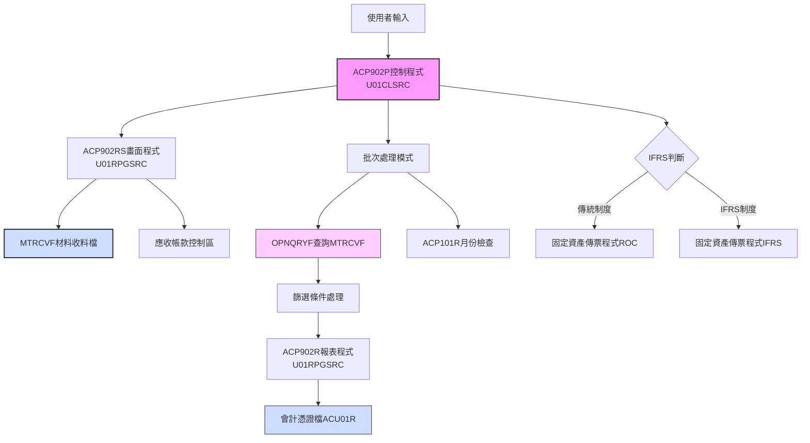
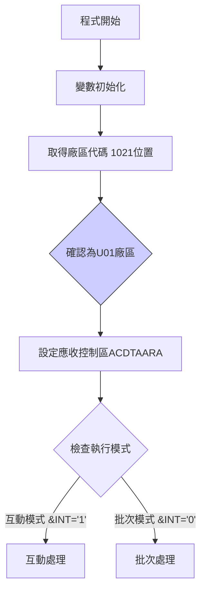
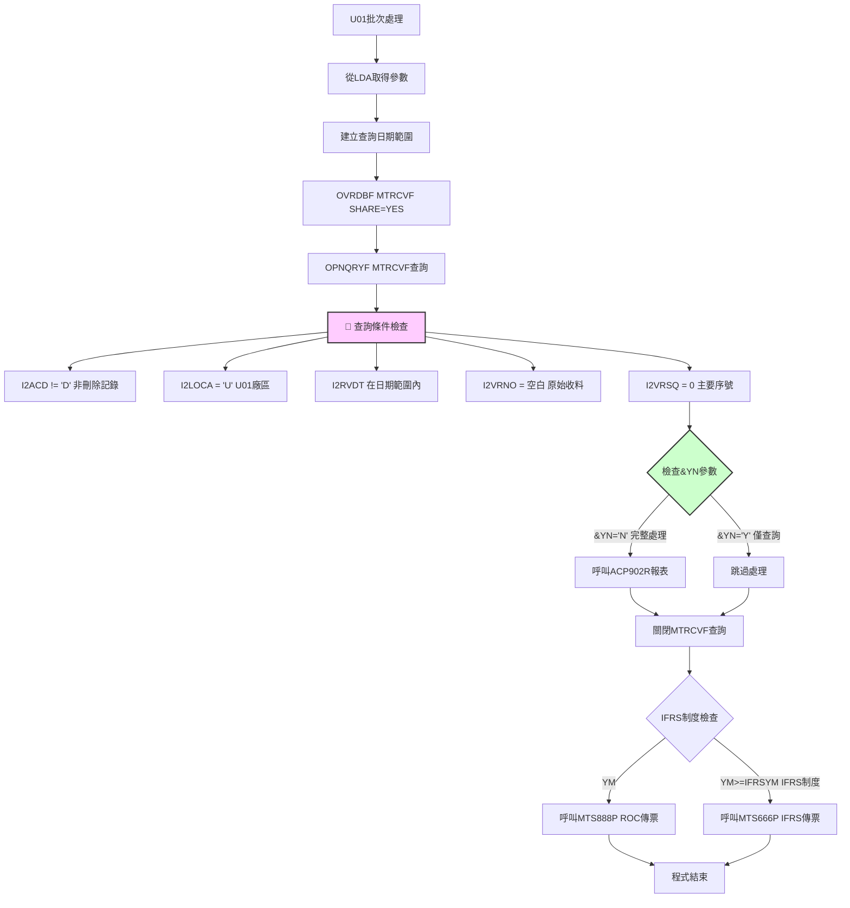
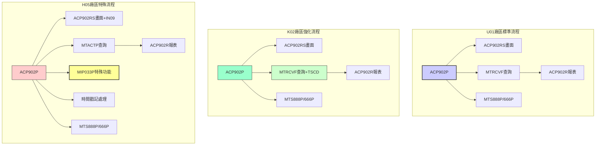
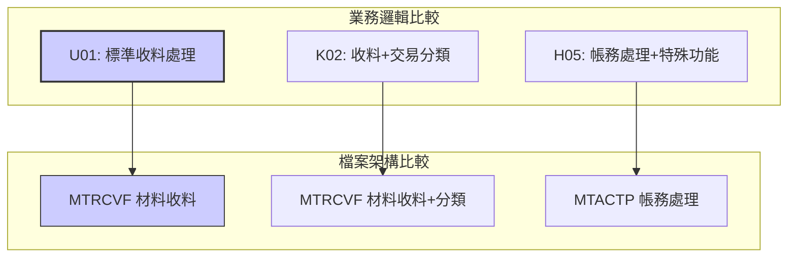

# ACP902P_U01 程式規格書

## 1. 基本資料
- **程式編號**：ACP902P
- **程式名稱**：材料收料傳票作業
- **程式類型**：CLP (控制語言程式)
- **程式位置**：U01CLSRC/ACP902P_U01.txt
- **開發人員**：S00TPC（多次修改）
- **系統名稱**：應收帳款管理系統
- **子系統**：材料收料帳務處理
- **開發日期**：97/06/12
- **最後修改**：101/12/07 2012MT635 S00TPC(0112A)

## 2. 程式功能說明
此程式為U01廠區的材料收料傳票作業批次控制程式，專門處理材料收料相關的應收帳款傳票作業。

### 主要功能
1. **材料收料傳票處理**：處理材料收料相關的應收帳款傳票
2. **IFRS轉換支援**：支援傳統會計制度與IFRS制度的轉換處理
3. **日期範圍查詢**：提供彈性的日期範圍篩選功能
4. **互動與批次模式**：提供互動式輸入和批次處理兩種執行模式
5. **條件性處理**：支援特定條件的資料篩選和處理

### 🔍 U01廠區功能特色
- **標準MTRCVF處理**：使用標準的材料收料檔案進行處理
- **簡潔查詢邏輯**：直接對MTRCVF檔案進行條件查詢
- **彈性日期控制**：支援自定義日期範圍的收料資料處理
- **選擇性執行**：透過&YN參數控制執行模式

## 3. 檔案架構與關聯圖

### 視覺化架構圖


### 主要檔案清單
| 檔案名稱 | 類型 | 說明 | 用途 | U01特性 |
|---------|------|------|------|---------|
| **MTRCVF** | 材料收料檔 | 存放材料收料交易明細 | INPUT | 標準查詢處理 |
| **ACVOUR** | 會計憑證檔 | 動態命名ACU01R | OUTPUT | 收料傳票輸出 |
| **ACDTAARA** | 應收控制區 | 應收帳款系統控制資料區 | CONTROL | 系統控制參數 |
| **AMIFRSCTL** | IFRS控制檔 | IFRS實施日期控制 | CONTROL | 共用控制檔 |

## 4. 🎯 欄位切割技術詳解

### 無DS結構切割
此程式為CLP程式，主要使用變數和資料區域(Data Area)進行資料操作，**未使用DS結構進行欄位切割**。

### 🎯 重要變數定義與用途分析

#### 日期相關變數切割技術
```
程式中的日期變數使用：
&DATE (8位數值) ← 主要處理日期
&DATE1 (8位數值) ← 起始日期
&DATE2 (8位數值) ← 結束日期
&DATE1A (8字元) ← 起始日期字串
&DATE2A (8字元) ← 結束日期字串
&DATEA (8字元) ← 主處理日期字串
&DATEB (8字元) ← 系統預設日期
```

#### 🎯 資料區域挪用分析
程式大量使用*LDA(本地資料區域)進行資料傳遞：

| 位置 | 長度 | 變數 | 原始用途 | 實際挪用用途 | U01處理特色 |
|------|------|------|----------|-------------|-------------|
| 1-8 | 8 | &DATEA | 主處理日期 | 畫面輸入的處理日期 | 標準日期處理 |
| 9-1 | 1 | &AREA | 廠區代碼 | 固定為'U'廠區識別 | 固定值'U' |
| 10-8 | 8 | &DATE1A | 起始日期 | 查詢範圍起始日期 | 彈性日期範圍 |
| 18-8 | 8 | &DATE2A | 結束日期 | 查詢範圍結束日期 | 彈性日期範圍 |
| 31-6 | 6 | &P#VRNS | 憑證號碼起 | 固定資產傳票起始號碼 | 標準憑證編號 |
| 41-6 | 6 | &P#VRNE | 憑證號碼迄 | 固定資產傳票結束號碼 | 標準憑證編號 |
| 472-6 | 6 | &IFRSYM | IFRS年月 | IFRS制度實施年月控制 | 標準IFRS控制 |
| 1021-1 | 1 | &AREA | 廠區備份 | 從系統取得，固定為'U' | U01廠區專用 |

#### 🎯 挪用原因分析
1. **應收帳款系統標準化**：ACDTAARA控制區域提供應收帳款系統的標準化介面
2. **日期範圍靈活性**：使用多個日期變數支援複雜的日期範圍查詢需求
3. **廠區隔離處理**：確保收料資料僅處理本廠區相關交易

## 5. 輸出/入螢幕布局與說明

### 互動模式畫面（ACP902RS）
```
+----------------------------------------------------------+
|              材料收料傳票作業 (ACP902P)                   |
|                    U01廠區標準版本                       |
+----------------------------------------------------------+
| 起始日期: [YYYYMMDD]    結束日期: [YYYYMMDD]             |
| 處理日期: [YYYYMMDD]    廠區: [U] U01廠區                |
| 選項: [Y/N]            Y=僅查詢 N=完整處理               |
+----------------------------------------------------------+
| 功能鍵: F7=取消 F12=離開                                |
+----------------------------------------------------------+
```

### 報表輸出說明
1. **材料收料傳票報表** - 156欄寬，12CPI格式
2. **應收帳款憑證** - 輸出至ACU01R檔案
3. **IFRS制度對應** - 依制度選擇適當的傳票程式

## 6. 🎯 處理流程程序說明

### 主程序邏輯深度分析

#### 第一階段：初始化與模式判斷


#### 第二階段：U01標準材料收料處理邏輯


### 🎯 U01廠區材料收料業務邏輯分析

#### 1. MTRCVF查詢條件詳解
```sql
查詢條件：
I2ACD *NE "D"                     -- 非刪除記錄
AND I2LOCA *EQ "U"                -- U01廠區限定
AND I2RVDT *EQ %RANGE(DATE1A DATE2A)  -- 收料日期範圍
AND I2VRNO *EQ "    "             -- 原始收料單號（空白）
AND I2VRSQ *EQ 0                  -- 主要收料序號
```

**業務意義**：
- **原始收料篩選**：只處理原始收料資料，排除修正或調整資料
- **主序號限定**：僅處理主要收料記錄，避免重複處理
- **日期範圍控制**：提供彈性的時間範圍選擇

#### 2. 選擇性處理邏輯（&YN參數）
```
IF (&YN = 'N') THEN
    執行完整處理流程（查詢 + 報表 + 傳票）
ELSE 
    僅執行查詢，不產生報表和傳票
```

**業務意義**：
- **查詢模式**：僅檢視資料，不產生實際傳票
- **處理模式**：完整執行收料傳票作業

#### 3. IFRS制度判斷邏輯
```
IF (YM < IFRSYM) THEN
    呼叫 MTS888P (傳統ROC制度)
ELSE
    呼叫 MTS666P (IFRS制度)
```

**業務意義**：根據處理年月自動選擇適當的會計制度處理方式

## 7. 🎯 數據操作與轉換分析

### 檔案操作詳解
1. **MTRCVF材料收料檔**：
   - **READ操作**：使用OPNQRYF對MTRCVF進行條件查詢
   - **篩選邏輯**：多重條件篩選確保資料準確性
   - **排序方式**：依收料日期和收料單號排序
   - **範圍查詢**：支援靈活的日期範圍查詢

2. **ACVOUR會計憑證檔**：
   - **WRITE操作**：輸出材料收料相關的應收帳款傳票
   - **檔案命名**：固定命名為ACU01R
   - **傳票格式**：遵循標準會計憑證格式

### U01標準數據轉換邏輯
1. **日期格式轉換**：
   - 數值型日期轉換為字串型用於查詢
   - 支援YYYY/MM/DD格式的日期範圍處理

2. **廠區代碼標準化**：
   - 所有處理固定為U01廠區
   - 檔案命名自動加上U01識別

3. **條件邏輯優化**：
   - 使用複合查詢條件提升查詢效率
   - 原始收料資料的精確篩選

## 8. 錯誤處理程序說明
- **ACP101R檢查**：呼叫ACP101R進行月份檢查，返回代碼判斷處理
- **日期檢查**：在ACP902RS中進行日期格式和合理性檢查
- **檔案存在檢查**：使用MONMSG處理檔案不存在的情況
- **查詢錯誤處理**：OPNQRYF操作的錯誤處理邏輯
- **系統錯誤處理**：使用MONMSG CPF0000處理一般系統錯誤

## 9. 🎯 特殊技術實現說明

### U01廠區標準化技術架構
1. **簡潔查詢策略**：
   - 直接對MTRCVF進行單一複雜查詢
   - 避免多次檔案掃描，提升效能
   - 使用標準的AS/400查詢語法

2. **動態檔案管理**：
   - ACVOUR檔案固定映射到ACU01R
   - 應收控制區域固定命名為ACDTAARA
   - 自動化的檔案覆寫和清理

3. **選擇性執行控制**：
   - 透過&YN參數提供靈活的執行模式
   - 支援測試和正式執行的分離

### U01廠區程式設計特色
1. **標準化設計**：
   - 遵循AS/400標準的CLP程式設計規範
   - 使用標準的檔案覆寫和查詢技術
   - 標準的錯誤處理機制

2. **模組化架構**：
   - 清晰的畫面、控制、報表程式分離
   - 標準的參數傳遞介面設計

## 10. 🎯 跨廠區版本分析

### 版本分布情況
| 程式名稱 | H05 | K02 | U01 | P02 | 功能差異說明 |
|---------|-----|-----|-----|-----|-------------|
| **ACP902P** | ✅ | ✅ | ✅ | ❌ | 主控制程式，各廠區有不同實現 |
| **ACP902RS** | ✅ | ✅ | ✅ | ❌ | 畫面程式，參數略有不同 |
| **ACP902R** | ✅ | ✅ | ✅ | ❌ | 報表程式，基本一致 |

### 程式碼差異分析

#### 🔍 主要差異點詳細比較

**1. 檔案使用差異**
| 廠區 | 主要檔案 | 查詢條件特色 | 特殊功能 |
|------|----------|-------------|----------|
| **U01** | MTRCVF | I2VRNO='空白', I2VRSQ=0 | &YN選擇性處理 |
| **K02** | MTRCVF | 增加I2TSCD*NE'0F'條件 | &YN選擇性處理 |
| **H05** | MTACTP | A1CODE='1', A1CTRL分類 | MIP033P特殊功能，時間戳記 |

**2. 歷史更新記錄比較**
| 版本差異 | H05版本 | K02版本 | U01版本 | 差異說明 |
|---------|---------|---------|---------|----------|
| 9905A更新 | ✅ 99/05/27 | ❌ 無 | ❌ 無 | H05特有更新 |
| 9810A更新 | ❌ 無 | ✅ 98/10/16 | ❌ 無 | K02特有更新 |
| 9911A更新 | ❌ 無 | ❌ 無 | ✅ 99/11/18 | U01特有更新 |
| 1308A更新 | ✅ 113/08/15 | ❌ 無 | ❌ 無 | H05最新功能更新 |

**3. 功能架構差異對比**


### 功能差異說明

#### 🎯 U01廠區作為標準版本特色
1. **簡潔標準化**：
   - ✅ 使用標準MTRCVF檔案結構
   - ✅ 清晰的查詢條件邏輯
   - ✅ 標準的選擇性處理機制

2. **適中複雜度**：
   - 無需特殊檔案處理（相較於H05）
   - 查詢條件簡潔明瞭（相較於K02）
   - 功能完整但不複雜

#### 🎯 與其他廠區的功能比較
1. **檔案處理方式對比**：
   - **U01**：✅ **標準MTRCVF處理，查詢條件簡潔**
   - **K02**：MTRCVF處理，增加TSCD篩選條件
   - **H05**：MTACTP處理，完全不同的檔案結構

2. **特殊功能對比**：
   - **U01**：✅ **標準選擇性處理（&YN參數）**
   - **K02**：標準選擇性處理（&YN參數）
   - **H05**：MIP033P特殊功能，時間戳記處理，&IN09參數

3. **查詢複雜度對比**：
   - **U01**：✅ **5個標準查詢條件，邏輯清晰**
   - **K02**：6個查詢條件，增加TSCD篩選
   - **H05**：4個查詢條件，但檔案結構不同

### 調用關係與業務邏輯差異


### 系統整合影響評估
1. **跨廠區資料一致性**：
   - U01使用標準收料檔案，資料結構清晰
   - H05使用不同檔案架構，可能影響跨廠區資料整合

2. **維護複雜度評估**：
   - U01版本維護成本最低，邏輯簡潔
   - H05版本維護複雜度最高，有特殊功能和時間處理

3. **業務功能完整性**：
   - U01提供標準的材料收料處理功能
   - 各廠區因業務需求不同而有不同的實現方式

## 11. 備註
- **標準化建議**：
  - U01版本可作為材料收料處理的標準參考
  - 查詢邏輯清晰，適合作為其他廠區的功能基準
  - &YN選擇性處理提供了良好的操作彈性

- **版本更新記錄**：
  - 0112A (101/12/07)：新增IFRS制度支援
  - 0011A (100/11/09)：新增傳票號碼範圍控制
  - 9911A (99/11/18)：U01特有的日期範圍處理更新
  - 9706A (97/06/12)：初始版本建立

- **技術特色**：
  - 標準的AS/400 CLP程式設計實現
  - 清晰的檔案查詢和條件篩選邏輯
  - 完整的IFRS制度支援
  - 彈性的選擇性處理機制

- **跨廠區整合建議**：
  - U01版本的查詢邏輯可作為標準化參考
  - 建議統一使用MTRCVF檔案結構
  - K02的TSCD條件可評估是否適用於其他廠區
  - H05的特殊功能需要個別評估整合可行性 