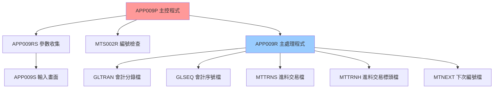
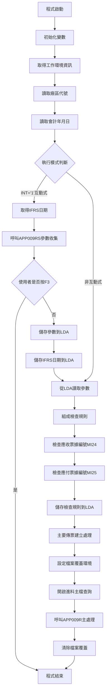

# APP009P_H05 程式規格書

## 1. 基本資料

| 項目 | 內容 |
|------|------|
| **程式編號** | APP009P |
| **程式名稱** | 會計傳票建立批次主控程式 |
| **程式類型** | CLP (Control Language Program) |
| **廠區** | H05 |
| **系統名稱** | 應收帳款管理系統 (AR) |
| **子系統** | 會計傳票處理 |
| **作者** | S02SWJ |
| **建立日期** | 1994/04/01 |
| **檔案位置** | H05CLSRC_THSRC/APP009P.txt |

### 修改記錄
| 日期 | 版本 | 修改者 | 修改內容 |
|------|------|--------|----------|
| 1997/06/19 | 9706A | S00TPC | 加入會計分錄檔覆蓋功能，支援多廠區架構 |
| 1999/05/06 | 9905A | S00TPC | 加入YMDD變數處理，優化日期處理邏輯 |
| 2012/12/10 | 0112A | S00TPC | 加入IFRS相關處理，支援國際財務報告準則 |
| 2013/11/14 | 0211A | S00TPC | 修改MTPMST查詢條件，優化進料資料篩選 |

## 2. 程式功能說明

### 主要功能
APP009P是會計傳票建立批次系統的主控制程式，H05廠區版本提供基本但完整的傳票產生功能：

1. **參數收集與驗證**：透過互動式介面收集使用者輸入的處理參數
2. **系統環境設定**：設定檔案覆蓋環境，確保正確的資料存取路徑
3. **編號管理**：檢查和管理傳票編號的連續性
4. **主要處理控制**：呼叫實際的傳票產生程式
5. **資料區管理**：維護本地資料區(LDA)的參數資訊
6. **🎯 H05廠區特色**：簡化版本，專注於核心傳票建立功能

### 業務流程說明
此程式是進料管理與會計系統間的重要橋樑，H05廠區版本專注於基本的傳票產生流程：

```
進料完成 → 參數設定 → 傳票產生 → 會計入帳
```

## 3. 檔案架構與關聯圖

### 系統架構圖


### 檔案使用清單
| 檔案名稱 | 使用方式 | 說明 | 廠區差異 |
|----------|----------|------|----------|
| **主要檔案** |
| MTPMST | INPUT | 進料主檔 | 通用 |
| GLTRAN | UPDATE | 會計分錄檔 | 廠區別命名：GL{廠區}R |
| GLSEQ | UPDATE | 會計序號檔 | 通用 |
| MTTRNS | UPDATE | 進料交易檔 | 通用 |
| MTTRNH | UPDATE | 進料交易標頭檔 | 通用 |
| MTNEXT | UPDATE | 下次編號檔 | 通用 |
| **資料區** |
| *LDA | READ/WRITE | 本地資料區 | 通用 |
| ACCTLDTA{廠區} | READ | 會計主控資料區 | 廠區別：ACCTLDTAH |
| AMIFRSCTL | READ | IFRS控制資料區 | 通用 |

### 資料流向說明
1. **輸入流**：LDA參數 → 使用者輸入 → 進料主檔
2. **處理流**：編號檢查 → 傳票產生
3. **輸出流**：會計分錄 → 報表輸出

## 4. 檔案欄位規格說明

### 🎯 主要資料結構

#### LDA (Local Data Area) 結構分析

##### LDA結構切割視覺化：
```
LDA (1024字元)：[NTNO1|NTNO2|NTNO3|NTNO4|NTNO5|NTNO6|BKNO|YMD|...RULE...|...IFRS...|AREA]
位置:            007    014   021   028   035   042   051  061    101      472     1021
                  ↓     ↓     ↓     ↓     ↓     ↓     ↓    ↓      ↓        ↓       ↓
位置007-013:    [NTNO1]                                                            傳票編號1
位置014-020:          [NTNO2]                                                      傳票編號2  
位置021-027:                [NTNO3]                                                傳票編號3
位置028-034:                      [NTNO4]                                          傳票編號4
位置035-041:                            [NTNO5]                                    傳票編號5
位置042-048:                                  [NTNO6]                              傳票編號6
位置051-060:                                        [BKNO____]                     帳冊編號
位置061-068:                                                 [YMD___]              處理日期
位置063-064:                                                   [YY]                年份切割
位置065-066:                                                    [MM]               月份切割
位置101-112:                                                         [U#RULE____] 檢查規則
位置472-479:                                                                [IFRS] IFRS日期
位置1021:                                                                        [H] 廠區代號
```

### 🎯 欄位切割技術詳解

#### APP009RS中的AADS結構欄位切割視覺化

##### 傳票編號切割 (NTNO - 10字元)：
```
NTNO (10字元)：[XX|XXXXXXXX]
                ↓      ↓
NTHD (2字元)： [XX]           傳票類型識別
NTBD (8字元)：   [XXXXXXXX]   傳票編號主體
```

##### 帳冊資訊切割 (BKNO1 - 10字元)：
```
BKNO1 (10字元)：[X|X|XXXXXXXX]
                 ↓ ↓      ↓
TYPE (1字元)：  [X]             帳冊類型
CURR (1字元)：   [X]            幣別代號
ACNO (8字元)：    [XXXXXXXX]    實際帳號
```

##### 日期資訊切割 (DATE - 6字元)：
```
DATE (6字元)：  [XX|XX|XX]
                ↓  ↓  ↓
DATE2 (2字元)： [XX]        年份
DATE1 (4字元)： [XXXX]      年月組合
DATE (6字元)：  [XXXXXX]    完整日期
```

#### 詳細DS結構定義
| 欄位名稱 | 位置 | 長度 | 型態 | 說明 |
|---------|------|------|------|------|
| NTNO | 1-10 | 10 | 字元 | 傳票編號，被切割儲存其他資料 |
| NTHD | 1-2 | 2 | 字元 | 切割自NTNO的第1-2位元作為傳票類型 |
| NTBD | 3-10 | 8 | 字元 | 切割自NTNO的第3-10位元作為傳票編號主體 |
| BKNO1 | 11-20 | 10 | 字元 | 帳冊編號，被切割儲存其他資料 |
| TYPE | 11 | 1 | 字元 | 切割自BKNO1的第1位元作為帳冊類型 |
| CURR | 12 | 1 | 字元 | 切割自BKNO1的第2位元作為幣別 |
| ACNO | 13-20 | 8 | 字元 | 切割自BKNO1的第3-10位元作為帳號 |
| DATE | 21-26 | 6 | 字元 | 日期資訊，被切割儲存其他資料 |
| DATE1 | 21-24 | 4 | 字元 | 切割自DATE的第1-4位元作為年月 |
| DATE2 | 21-22 | 2 | 字元 | 切割自DATE的第1-2位元作為年份 |

### 🎯 欄位挪用分析

#### NTNO欄位的多重用途
- **原始設計**：單純儲存傳票編號
- **實際挪用**：
  - 前2位 (NTHD)：傳票類型識別
  - 後8位 (NTBD)：實際序號
  - **挪用原因**：節省記憶體空間，一個欄位承載多重資訊
  - **業務邏輯**：便於傳票分類管理

#### BKNO1欄位的巧妙設計
- **原始設計**：帳冊編號儲存
- **切割用途**：
  - TYPE (位置11)：帳冊類型
  - CURR (位置12)：幣別代號
  - ACNO (位置13-20)：實際帳號
  - **技術優勢**：一次讀取獲得完整帳戶資訊

### 欄位定義表格
| 欄位名稱 | 類型 | 長度 | 說明 | 切割方式 | 挪用情況 |
|----------|------|------|------|----------|----------|
| NTNO | CHAR | 10 | 傳票編號 | 2+8切割 | 類型+序號 |
| BKNO1 | CHAR | 10 | 帳冊資訊 | 1+1+8切割 | 類型+幣別+帳號 |
| DATE | CHAR | 6 | 日期資訊 | 2+2+2切割 | 年+月+日 |
| YMD | CHAR | 8 | 處理日期 | 無切割 | 標準日期格式 |
| YMDD | CHAR | 8 | 處理日期副本 | 無切割 | H05版本特有(9905A) |
| IFRSYMD | CHAR | 8 | IFRS日期 | 無切割 | 通用功能 |

## 5. 輸出/入螢幕布局

### APP009S 輸入畫面布局

#### 螢幕布局視覺化：
```
+----------------------------------------------------------+
|                APP001S                      公司名稱    日期|
+----------------------------------------------------------+
|             會計傳票建立批次處理系統                      |
+----------------------------------------------------------+
|                                                          |
|                                                          |
|                                                          |
| 系統別：H (P:台灣K:高雄T:天津H:河北)                      |
|                                                          |
| 系統日期：[____/__/__]  (可修改)                         |
|                                                          |
| 應收帳戶：[__________]  (必填)                           |
|                                                          |
| 傳票範圍：[_______]-[_______]                           |
|           [_______]-[_______]                           |
|           [_______]-[_______]                           |
|                                                          |
|                                                          |
|                                                          |
|                                                          |
|                                                          |
|                                                          |
|                                                          |
| [錯誤訊息顯示區]                                          |
| ENTER:執行    PF03:離開                                  |
+----------------------------------------------------------+
```

### 輸入欄位說明
| 欄位 | 名稱 | 類型 | 長度 | 必填 | 說明 |
|------|------|------|------|------|------|
| YMD | 系統日期 | 8Y0 | 8 | 是 | YYYY/MM/DD格式 |
| BKNO | 應收帳戶 | 10A | 10 | 是 | 帳冊編號 |
| NTNO1-6 | 傳票範圍 | 7Y0 | 7 | 部分 | 三組範圍設定 |

### 功能鍵定義
- **ENTER**：確認輸入，開始處理
- **PF03**：取消作業，返回主選單

## 6. 處理流程程序說明

### 🎯 主程序邏輯深度分析

#### 整體處理流程圖


#### 🎯 條件判斷詳細邏輯

##### 1. 執行模式判斷
```
IF (&INT *EQ '1') THEN(DO)
```
- **觸發條件**：工作類型為互動式 ('1')
- **處理邏輯**：執行參數收集流程
- **業務意義**：區分互動式執行與批次執行

##### 2. 使用者取消檢查
```
IF (&IN03 *EQ '1') THEN(RETURN)
```
- **觸發條件**：使用者按下F3功能鍵
- **處理邏輯**：立即結束程式
- **業務意義**：提供使用者中斷機制

##### 3. 查詢條件設定（H05版本標準）
```
主要傳票建立查詢：
PMGLDT *EQ 處理日期
*AND PMCLFG *EQ "1"
*AND PMACD *NE "D"
```

### 🎯 子程序邏輯分析

#### APP009RS 參數收集邏輯
1. **畫面顯示**：展示輸入畫面
2. **欄位驗證**：
   - 日期有效性檢查
   - 帳冊存在性驗證
   - 傳票編號邏輯檢查
3. **範圍驗證**：確保起始編號≤結束編號
4. **參數回傳**：將驗證後的參數傳回主程式

#### MTS002R 編號檢查邏輯
- **MI24檢查**：應收票據編號連續性
- **MI25檢查**：應付票據編號連續性
- **規則組成**：廠區+年+月+空白

#### APP009R 主處理邏輯
1. **傳票編號產生**：產生會計分錄編號
2. **分錄資料建立**：產生借貸分錄
3. **檔案更新**：更新會計相關檔案
4. **報表產生**：輸出處理報表

### 🎯 特殊邏輯處理

#### IFRS相關處理邏輯
- **取得IFRS日期**：從AMIFRSCTL資料區讀取
- **儲存位置**：LDA位置472-479
- **業務用途**：支援國際財務報告準則

#### 廠區別處理邏輯
- **會計分錄檔**：動態組成檔案名稱 'GL' + 廠區 + 'R'
- **會計主控資料區**：'ACCTLDTA' + 廠區代號
- **處理差異**：依廠區不同採用不同檔案路徑

## 7. 🎯 數據操作與轉換分析

### 檔案操作詳解

#### READ操作
```
RTVDTAARA DTAARA(*LDA (1021 1)) RTNVAR(&AREA)
```
- **操作目的**：讀取廠區代號
- **數據轉換**：無需轉換，直接使用
- **檢核機制**：無特殊檢核

#### WRITE操作
```
CHGDTAARA DTAARA(*LDA (7 07)) VALUE(&NTNO)
```
- **操作目的**：儲存傳票編號到LDA
- **數據轉換**：DEC轉CHAR格式
- **位置對應**：精確對應LDA結構

### 數據轉換邏輯

#### 數值格式轉換
```
CHGVAR VAR(&NTNO) VALUE(&NTNO1)
```
- **轉換類型**：DEC(7,0) → CHAR(7)
- **轉換目的**：儲存到資料區需要字元格式
- **精度處理**：保持原始精度，無小數位

#### 日期格式處理
```
YMD: CHAR(8) - YYYYMMDD格式
YMDD: CHAR(8) - H05版本特有的日期副本(9905A)
Y: CHAR(2) - 年份後兩位
M: CHAR(2) - 月份
```
- **切割邏輯**：從完整日期切割年月資訊
- **業務用途**：組成檢查規則使用

### 計算邏輯分析

#### 檢查規則組成計算
```
&W#RULE = &AREA + &Y + &M + &W#BLK
```
- **計算目的**：組成編號檢查規則
- **組成邏輯**：廠區(1) + 年(2) + 月(2) + 空白(7) = 12位
- **業務意義**：確保編號檢查的準確性

### 檢核機制詳解

#### 參數有效性檢查
- **日期檢查**：呼叫C018程式驗證日期格式
- **帳冊檢查**：查詢BANKAC檔案確認帳冊存在
- **範圍檢查**：確保傳票編號起始≤結束

#### 檔案存取檢核
- **層級檢查**：使用LVLCHK(*NO)略過版本檢查
- **共享設定**：SHARE(*YES)允許多使用者存取

## 8. 錯誤處理程序說明

### 錯誤代碼與處理方式清冊

| 錯誤代碼 | 錯誤訊息 | 原因說明 | 處理方式 | 預防措施 |
|----------|---------|---------|---------|----------|
| **IN03='1'** | 使用者取消作業 | 使用者在參數輸入畫面按下F3功能鍵 | 1. 立即結束程式<br>2. 清除暫存資料<br>3. 正常回傳狀態 | 提供清楚的操作說明，避免誤按 |
| **FLAG≠'0'** | 日期格式錯誤 | 輸入的日期不符合YYYYMMDD格式或為無效日期 | 1. 顯示錯誤訊息在畫面上<br>2. 欄位標記為錯誤<br>3. 要求重新輸入 | 加強日期輸入的格式檢查與提示 |
| **97** | 帳冊編號不存在 | 在BANKAC檔案中找不到對應的帳冊資料 | 1. 顯示錯誤訊息<br>2. 欄位標記為錯誤<br>3. 提供有效帳冊清單供參考 | 定期更新帳冊主檔，提供帳冊查詢功能 |
| **DTAARA錯誤** | 資料區存取失敗 | LDA或會計主控資料區無法正常存取 | 1. 記錄詳細錯誤資訊<br>2. 檢查資料區權限<br>3. 通知系統管理員 | 確保程式執行者具備適當的資料區存取權限 |
| **檔案鎖定** | 檔案被其他程式使用中 | MTPMST或相關檔案被其他程式鎖定 | 1. 等待30秒後重試<br>2. 連續3次失敗後通知使用者<br>3. 建議稍後再試 | 避免同時執行多個相關程式 |
| **IFRS資料區錯誤** | IFRS控制資料區異常 | AMIFRSCTL資料區無法存取或資料異常 | 1. 使用預設日期繼續處理<br>2. 記錄異常狀況<br>3. 通知相關人員檢查 | 定期檢查IFRS相關資料區的完整性 |
| **編號範圍錯誤** | 傳票編號範圍設定錯誤 | 起始編號大於結束編號或編號為0 | 1. 顯示具體錯誤內容<br>2. 標記相關欄位<br>3. 提供正確設定範例 | 在輸入時即時檢查編號邏輯性 |

### 處理方式說明

#### 使用者取消處理
```
IF COND(&IN03 *EQ '1') THEN(RETURN)
```
- **處理邏輯**：立即結束程式
- **清理作業**：無需特殊清理
- **回傳狀態**：正常結束

#### 檔案錯誤處理
- **策略**：使用LVLCHK(*NO)容錯機制
- **恢復**：檔案覆蓋確保環境正確
- **記錄**：無特殊錯誤記錄機制

## 9. 🎯 特殊技術實現說明

### 記憶體優化技術

#### 變數重複使用
```
CHGVAR VAR(&NTNO) VALUE(&NTNO1)
CHGDTAARA DTAARA(*LDA (7 07)) VALUE(&NTNO)
CHGVAR VAR(&NTNO) VALUE(&NTNO2)
CHGDTAARA DTAARA(*LDA (14 07)) VALUE(&NTNO)
```
- **優化技巧**：使用單一&NTNO變數重複轉換不同傳票編號
- **記憶體節省**：避免宣告多個轉換變數
- **效能影響**：微幅提升記憶體使用效率

#### 檔案覆蓋技術
```
OVRDBF FILE(GLTRAN) TOFILE(('GL' || &AREA || 'R'))
```
- **技術特色**：動態組成檔案名稱
- **實現方式**：字串連接組成實體檔案名
- **系統效益**：支援多廠區環境無需修改程式

### 程式碼優化技巧

#### 條件執行優化
```
註解化的SBMJOB段落：
/* SBMJOB JOB(APP009P) JOBD(MTJOBD) OUTQ(&OUTQ) + */
/* RQSDTA('CALL APP009P') */
/* RETURN */
```
- **設計考量**：保留批次提交功能但暫不使用
- **彈性設計**：需要時可快速啟用批次模式
- **維護友善**：註解保留歷史功能參考

#### 向下相容性處理
- **版本兼容**：支援多個廠區不同版本需求
- **參數擴展**：預留IFRS等新功能參數位置
- **功能漸進**：新功能以選擇性方式加入

## 10. 🎯 跨廠區版本分析

### 版本分布情況
| 廠區 | 程式版本 | 最後修改 | 存在狀態 | 特殊功能 |
|------|----------|----------|----------|----------|
| **H05** | 0211A | 2013/11/14 | ✅存在 | 基本版本 |
| **U01** | 0211B | 2013/11/29 | ✅存在 | 應收帳款到期日計算 |
| **K02** | - | - | ❌不存在 | - |
| **P02** | - | - | ❌不存在 | - |

### 程式碼差異分析

#### H05 vs U01 主要差異

##### 1. 修改版本差異
**H05版本(0211A)**：
- 基本版本，不包含應收帳款到期日計算功能
- 查詢條件較簡化
- 報表設定使用彈性頁面大小

**U01版本(0211B)**：
```
0211B    /***應收帳款到期日計算相關功能***/
0211B    OVRDBF FILE(MTPMST) TOFILE(MTPMST) SHARE(*YES)
0211B    OPNQRYF FILE((MTPMST)) OPTION(*ALL) QRYSLT('   +
             PMGLDT *EQ   ' || &YMDD || '         +
             *AND  PMCLFG *EQ  "1"                +
             *AND  PMACD  *NE  "D"                +
             *AND %SST(PMRESV 13 1) *EQ           +
              %VALUES("2" "3" "4" "5" "7" "8")')  +
             KEYFLD((PMVNTR) (PMPYNO))
0211B    CALL PGM(APP009RA)
```

##### 2. 變數宣告差異
- **H05特點**：`&YMDD`變數 (9905A版本)
- **U01版本**：使用`&YMDD` (9911A版本)
- **差異說明**：H05使用較早的版本實現

##### 3. 報表設定差異
**H05版本**：
```
OVRPRTF FILE(QPRINT) TOFILE(QPRINT) PAGESIZE(*N 132)
OVRPRTF FILE(QPRINT1) TOFILE(QPRINT) PAGESIZE(*N 132)
```

**U01版本**：
```
OVRPRTF FILE(QPRINT) TOFILE(QPRINT) PAGESIZE(66 132)
OVRPRTF FILE(QPRINT1) TOFILE(QPRINT) PAGESIZE(66 132)
```

##### 4. 功能範圍差異
**H05版本查詢條件**：
```
PMGLDT *EQ 處理日期 
*AND PMCLFG *EQ "1"
*AND PMACD *NE "D"
```

**U01版本查詢條件**（包含額外應收帳款處理）：
```
PMGLDT *EQ 處理日期 
*AND PMCLFG *EQ "1"
*AND PMACD *NE "D"
*AND %SST(PMRESV 13 1) *EQ %VALUES("2" "3" "4" "5" "7" "8")
```

### 功能差異說明

#### H05廠區特點
1. **簡化處理流程**：
   - **業務需求**：H05廠區業務相對簡單，基本功能即可滿足需求
   - **實現方式**：專注於核心傳票建立功能
   - **處理重點**：標準的進料轉傳票流程

2. **報表彈性設定**：
   - **H05設定**：彈性頁面大小(*N)
   - **原因分析**：適應不同的列印環境和設備
   - **技術優勢**：提供更好的列印相容性

3. **版本演進策略**：
   - **保持穩定**：使用較穩定的9905A版本
   - **避免複雜化**：不加入過多額外功能
   - **專注核心**：確保基本功能的可靠性

### 調用關係差異

#### 子程式調用鏈
**H05版本調用順序**：
```
APP009P → APP009RS (參數收集)
       → MTS002R (編號檢查)
       → APP009R (主處理)
```

**U01版本調用順序**：
```
APP009P → APP009RS (參數收集)
       → MTS002R (編號檢查)
       → APP009RA (到期日計算) ⭐U01特有
       → APP009R (主處理)
```

### 系統整合差異

#### 廠區特定需求分析
1. **H05廠區**：
   - 基本功能即可滿足需求
   - 列印環境較多樣化
   - 簡化處理流程
   - 注重系統穩定性

2. **U01廠區**：
   - 客戶信用管理較嚴格
   - 需要精確的到期日計算
   - 報表格式標準化
   - 業務邏輯較複雜

#### 版本選擇策略
- **H05策略**：採用穩定版本，避免過度複雜化
- **U01策略**：採用最新版本，支援完整功能
- **技術考量**：根據廠區業務特性選擇適合的版本

## 11. 備註

### 特殊注意事項

1. **執行順序重要性**：
   - 必須先執行互動式參數收集
   - 再執行批次處理流程
   - 不可跳過編號檢查步驟

2. **廠區環境設定**：
   - 確保LDA中廠區代號設定為'H'
   - 檢查會計主控資料區ACCTLDTAH存在性
   - 驗證IFRS控制資料區可存取性

3. **檔案權限需求**：
   - 需要MTPMST檔案讀取權限
   - 需要會計分錄檔寫入權限
   - 需要資料區存取權限

### 技術債務

1. **程式架構**：
   - CLP與RPG混合架構較複雜
   - 建議未來統一為單一語言架構

2. **錯誤處理**：
   - 缺乏詳細的錯誤記錄機制
   - 建議加入標準化錯誤處理

3. **文檔維護**：
   - 程式內註解多為中文，需要英文化
   - 建議建立完整的業務邏輯文檔

### 改善建議

1. **短期改善**：
   - 考慮是否需要U01的到期日計算功能
   - 統一報表格式設定標準
   - 建立操作手冊

2. **長期規劃**：
   - 考慮重構為現代化架構
   - 整合到ERP系統框架
   - 建立自動化測試機制

### 跨廠區整合建議

1. **功能標準化**：
   - 評估是否需要將U01的到期日計算功能推廣至H05
   - 統一報表格式設定
   - 建立共同的業務邏輯標準

2. **技術整合**：
   - 建立統一的廠區參數配置
   - 統一檔案命名規則
   - 建立跨廠區資料交換機制

3. **版本管理**：
   - 建立統一的版本更新策略
   - 考慮各廠區的特殊需求
   - 保持向下相容性

---
**文件版本**: 1.0  
**製作日期**: 2024年12月26日  
**製作者**: Claude AI  
**審核狀態**: 待審核  
**遵循標準**: 東鋼程式規格書建立計畫書模板 