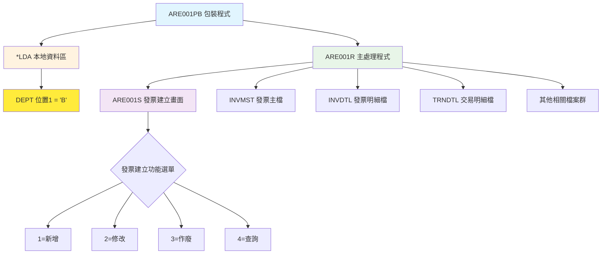
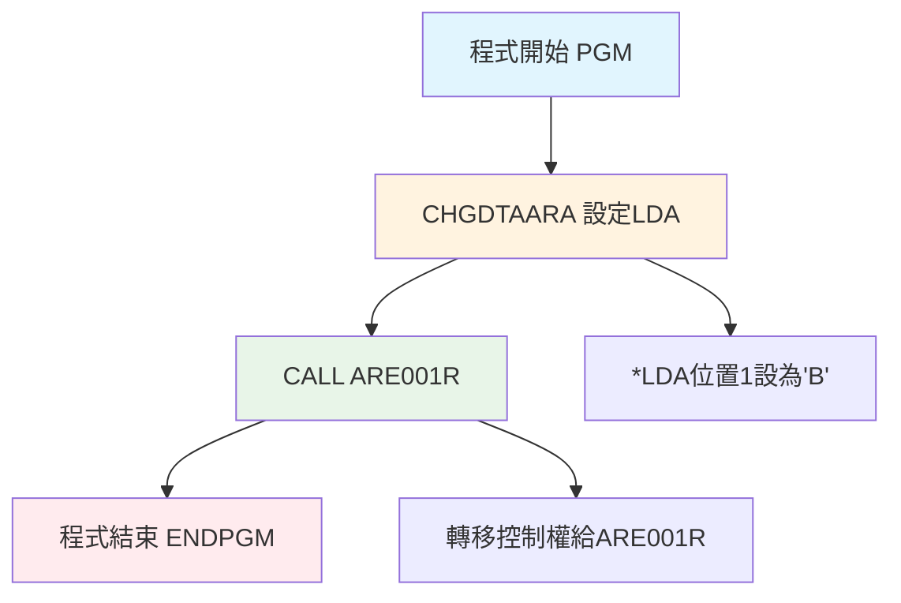
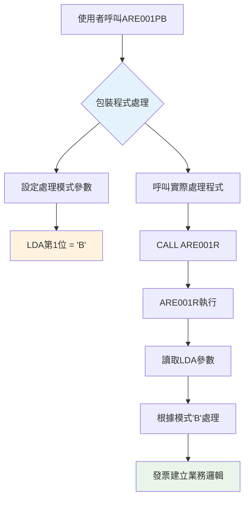

# ARE001PB_P02 程式規格書

## 📋 基本資料

| 項目 | 內容 |
|------|------|
| **程式編號** | ARE001PB |
| **程式名稱** | 發票建立作業系統（模式B包裝程式）|
| **程式類型** | CLP (Control Language Program) |
| **系統名稱** | 應收帳款管理系統 (AR) |
| **子系統** | 發票建立子系統 |
| **廠區** | P02 |
| **開發人員** | 系統標準 |
| **建立日期** | 1980年代（歷史程式）|
| **最後修改** | 無（穩定版本）|
| **程式路徑** | `P02CLSRC_THSRC/ARE001PB.txt` |

## 📖 程式功能說明

### 主要功能
ARE001PB是一個**極簡化的包裝程式**，專門用於啟動發票建立作業的特定模式，主要功能包括：

1. **模式參數設定**：設定LDA本地資料區第1位為'B'，指定發票建立作業的處理模式
2. **核心程式呼叫**：呼叫ARE001R主要發票建立處理程式
3. **透明化介面**：提供統一的程式入口點，隱藏複雜的參數設定細節
4. **標準化包裝**：確保所有廠區使用一致的發票建立作業介面

### 業務流程說明
此程式是**發票建立作業系統的標準入口點**，協助業務人員：
- 透過統一的程式名稱進入發票建立作業
- 自動設定正確的處理模式參數
- 確保發票建立流程的一致性和標準化
- 支援複雜的發票管理業務需求

## 🗂️ 檔案架構與關聯圖

### 使用檔案清單

| 檔案名稱 | 檔案類型 | 使用方式 | 說明 |
|---------|---------|---------|------|
| **ARE001R** | RPG | 呼叫 | 主要發票建立處理程式 |
| ***LDA** | 系統 | 寫入 | 本地資料區（模式參數傳遞）|

### 檔案關聯視覺化圖表



### 資料流向說明

1. **參數設定階段**：ARE001PB 設定 *LDA 第1位為 'B'，指定處理模式
2. **程式轉移階段**：呼叫 ARE001R 主要處理程式
3. **模式識別階段**：ARE001R 讀取 LDA 中的模式參數進行相應處理
4. **業務處理階段**：根據模式'B'執行對應的發票建立業務邏輯

## 📊 檔案欄位規格說明

### 主要資料結構

#### LDA 本地資料區使用
```
位置1 (1位元): DEPT = 'B' (處理模式標識)
用途：指定ARE001R程式的處理模式
意義：'B'模式代表特定的發票建立處理方式
```

#### 程式碼結構分析
```clp
PGM                               -- 程式開始
CHGDTAARA DTAARA(*LDA (1 1)) VALUE('B')  -- 設定LDA第1位為'B'
CALL PGM(ARE001R)                -- 呼叫主要處理程式
ENDPGM                           -- 程式結束
```

### 欄位定義表格

| 欄位名稱 | 資料型態 | 長度 | 說明 | 特殊處理 |
|---------|---------|------|------|---------|
| **LDA位置1** | CHAR | 1 | 處理模式 | 🎯核心參數：設定為'B' |

### 🎯 跨廠區一致性分析

#### 多廠區程式比較
所有廠區（H05、K02、P02、U01）的ARE001PB程式完全相同：
- **程式碼一致性**：5行程式碼完全相同
- **參數設定一致**：均設定LDA第1位為'B'  
- **呼叫目標一致**：均呼叫ARE001R
- **標準化設計**：展現良好的系統架構標準化

## 🖥️ 輸出/入螢幕布局

### 程式流程圖

```
ARE001PB 執行流程：

┌─────────────────────────────────────────────┐
│  ARE001PB 包裝程式啟動                      │
│  ┌─────────────────────────────────────────┐ │
│  │  1. 設定 LDA 第1位 = 'B'                │ │
│  │  2. 呼叫 ARE001R 主程式                 │ │
│  │  3. 程式結束                           │ │
│  └─────────────────────────────────────────┘ │
│                    ↓                        │
│  ARE001R 主要處理程式                       │
│  ┌─────────────────────────────────────────┐ │
│  │  讀取 LDA DEPT = 'B'                   │ │
│  │  顯示 ARE001S 發票建立畫面              │ │
│  │  執行發票相關業務邏輯                   │ │
│  └─────────────────────────────────────────┘ │
└─────────────────────────────────────────────┘
```

### 實際使用介面
ARE001PB本身無使用者介面，執行後會自動轉入ARE001R的發票建立畫面：

```
┌─────────────────────────────────────────────────────────────────────────────┐
│ 12/26/24      東森鋼鐵股份有限公司各廠區                         ARE001S-1 │
│              *** 作廢發票作業 ***                                          │
│                                                           DEVNAME01         │
│                                                                             │
│                功能代碼：[_] (1:新增2:修改3:作廢4:查詢)                     │
│                                                                             │
│                發票號碼：[__________]                                       │
│                                                                             │
│                發票種類：[_] (2:二聯式3:三聯式)                             │
│                                                                             │
│                發票年月：[______]                                           │
│                                                                             │
│                                                                             │
│                                                                             │
│                                                                             │
│                                                                             │
│                                                                             │
│                                                                             │
│                                                                             │
│                                                                             │
│ [錯誤訊息顯示區域]                                                          │
│ ENTER:確認     PF03:結束                                                   │
└─────────────────────────────────────────────────────────────────────────────┘
```

### 功能鍵定義
ARE001PB為包裝程式，無直接功能鍵，功能鍵由ARE001R處理：
| 功能鍵 | 說明 | 處理程式 |
|--------|------|---------|
| **F3** | 結束作業 | ARE001R |
| **F10** | 特殊功能 | ARE001R |
| **F12** | 回到上層 | ARE001R |
| **Enter** | 確認執行 | ARE001R |

## ⚙️ 處理流程程序說明

### 🎯 極簡化程式邏輯

#### 主程序邏輯（僅5行程式碼）


#### 包裝程式設計模式


### 🎯 模式參數分析

#### LDA參數設定邏輯
```clp
CHGDTAARA DTAARA(*LDA (1 1)) VALUE('B')
```

**技術細節說明：**
- **CHGDTAARA**：修改資料區指令
- **DTAARA(*LDA (1 1))**：指定本地資料區第1位，長度1位元
- **VALUE('B')**：設定值為字元'B'
- **用途**：為ARE001R程式提供處理模式識別

#### ARE001R模式識別機制
```rpg
-- UDS定義中的DEPT變數
I           UDS
I                                        1   1 DEPT

-- 程式中DEPT='B'會影響處理邏輯
```

### 🎯 包裝程式設計理念

#### 設計模式：Wrapper Pattern（包裝者模式）
1. **封裝複雜性**：隱藏ARE001R的複雜參數設定
2. **標準化介面**：提供統一的程式呼叫方式
3. **模式控制**：透過參數控制不同的處理模式
4. **維護簡化**：集中化的參數管理

#### 系統架構優勢
1. **程式分離**：界面控制與業務邏輯分離
2. **參數化設計**：透過LDA進行靈活的模式控制
3. **標準化實施**：多廠區使用相同的包裝程式
4. **維護便利性**：修改處理邏輯只需調整ARE001R

## 🔧 技術特點分析

### 程式設計特色

1. **🎯 極簡包裝設計**
   - **最小化程式碼**：僅5行程式碼實現功能
   - **單一職責**：專注於參數設定和程式呼叫
   - **透明化處理**：使用者無感知的參數傳遞

2. **📊 標準化架構**
   - **跨廠區一致性**：所有廠區使用相同程式碼
   - **統一介面設計**：標準化的程式入口點
   - **參數化控制**：透過LDA實現靈活的模式管理

3. **🔍 模式驅動設計**
   - **參數傳遞機制**：LDA作為程式間通訊媒介
   - **模式識別**：'B'模式代表特定處理方式
   - **靈活性保持**：支援未來擴展其他模式

4. **🏭 系統整合特性**
   - **無縫銜接**：與ARE001R完美整合
   - **歷史相容性**：支援長期穩定運行
   - **維護友善**：簡單的程式結構易於維護

### 與相關程式比較

| 特性比較 | ARE001PB | ARE001PF | ARE001R |
|---------|---------|----------|---------|
| **程式類型** | CLP包裝 | CLP包裝 | RPG主程式 |
| **程式複雜度** | 極簡(5行) | 極簡(5行) | 高複雜(1900+行) |
| **LDA設定** | 'B'模式 | 'F'模式 | 讀取模式 |
| **主要功能** | 模式設定 | 模式設定 | 業務處理 |
| **使用者介面** | 無 | 無 | 完整介面 |
| **業務邏輯** | 無 | 無 | 完整邏輯 |
| **維護需求** | 極低 | 極低 | 高 |

### 業務價值分析

1. **🎯 系統架構價值**
   - **設計模式應用**：展現良好的軟體工程實踐
   - **標準化實施**：確保跨廠區的一致性
   - **維護成本降低**：簡化的程式結構

2. **📋 營運效率提升**
   - **使用者友善**：透明化的參數設定
   - **操作一致性**：統一的程式呼叫方式
   - **錯誤減少**：自動化的參數管理

3. **🔧 技術債務管控**
   - **複雜性封裝**：隱藏ARE001R的複雜性
   - **介面穩定性**：提供穩定的外部介面
   - **未來擴展性**：支援新模式的擴展

## 📝 重要商業邏輯摘要

### 核心業務規則
1. **模式參數設定**：LDA第1位固定設為'B'，指定發票建立的處理模式
2. **程式委派機制**：所有實際業務邏輯由ARE001R處理
3. **透明化操作**：使用者無需了解內部參數設定細節
4. **標準化介面**：提供統一的程式入口點

### 系統整合要點
1. **包裝程式定位**：作為ARE001R的標準化入口點
2. **參數傳遞機制**：透過LDA進行程式間參數傳遞
3. **跨廠區一致性**：所有廠區使用相同的包裝程式
4. **歷史穩定性**：長期穩定運行的系統元件

### 設計哲學
1. **簡約原則**：用最少的程式碼達成明確的目標
2. **分離關注點**：介面控制與業務邏輯分離
3. **標準化優先**：確保系統的一致性和可維護性
4. **使用者中心**：提供簡潔透明的使用體驗

此程式體現了**「簡約、標準、透明」**的設計理念，雖然程式碼極其簡單，但在系統架構中扮演重要的標準化和封裝角色，是企業級系統設計的經典範例。 