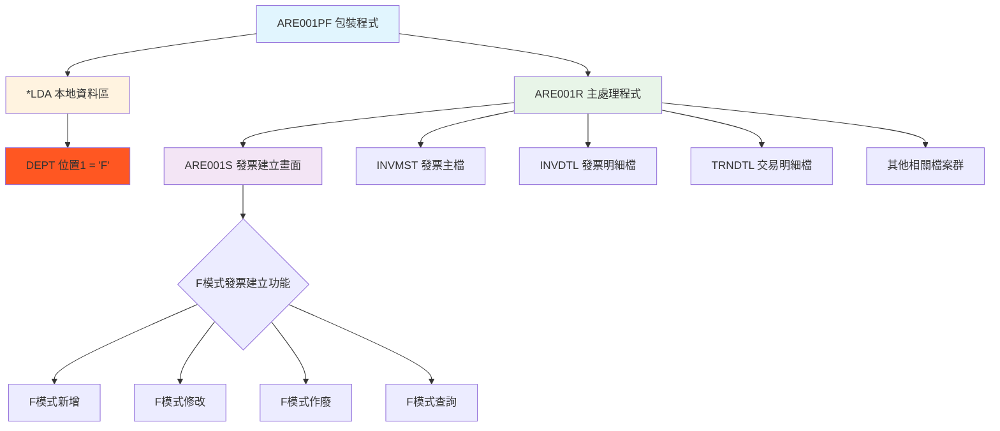
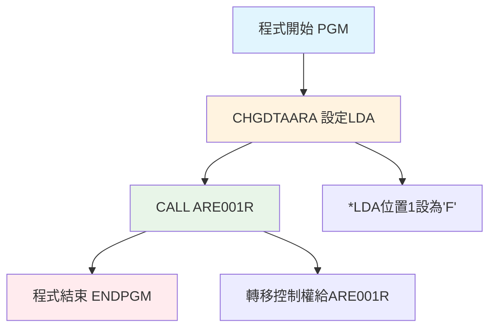
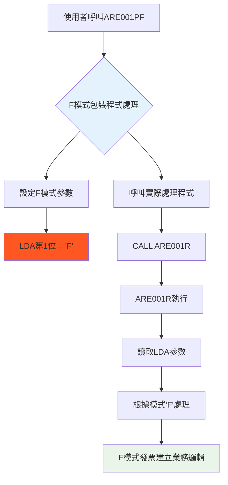
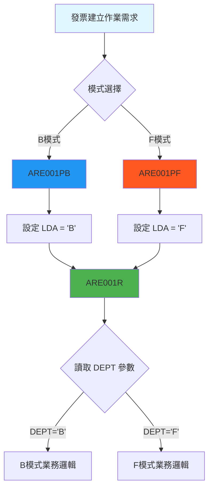

# ARE001PF_U01 程式規格書

## 📋 基本資料

| 項目 | 內容 |
|------|------|
| **程式編號** | ARE001PF |
| **程式名稱** | 發票建立作業系統（模式F包裝程式）|
| **程式類型** | CLP (Control Language Program) |
| **系統名稱** | 應收帳款管理系統 (AR) |
| **子系統** | 發票建立子系統 |
| **廠區** | U01 |
| **開發人員** | 系統標準 |
| **建立日期** | 1980年代（歷史程式）|
| **最後修改** | 無（穩定版本）|
| **程式路徑** | `U01CLSRC_THSRC/ARE001PF.txt` |

## 📖 程式功能說明

### 主要功能
ARE001PF是一個**極簡化的包裝程式**，專門用於啟動發票建立作業的F模式，主要功能包括：

1. **模式參數設定**：設定LDA本地資料區第1位為'F'，指定發票建立作業的F模式處理
2. **核心程式呼叫**：呼叫ARE001R主要發票建立處理程式
3. **透明化介面**：提供統一的程式入口點，自動設定F模式參數
4. **標準化包裝**：確保所有廠區使用一致的F模式發票建立作業介面

### 業務流程說明
此程式是**發票建立作業系統F模式的專用入口點**，協助業務人員：
- 透過統一的程式名稱進入F模式發票建立作業
- 自動設定正確的F模式處理參數
- 確保F模式發票建立流程的一致性和標準化
- 支援F模式特定的發票管理業務需求

## 🗂️ 檔案架構與關聯圖

### 使用檔案清單

| 檔案名稱 | 檔案類型 | 使用方式 | 說明 |
|---------|---------|---------|------|
| **ARE001R** | RPG | 呼叫 | 主要發票建立處理程式 |
| ***LDA** | 系統 | 寫入 | 本地資料區（F模式參數傳遞）|

### 檔案關聯視覺化圖表



### 資料流向說明

1. **F模式參數設定階段**：ARE001PF 設定 *LDA 第1位為 'F'，指定F模式處理
2. **程式轉移階段**：呼叫 ARE001R 主要處理程式
3. **F模式識別階段**：ARE001R 讀取 LDA 中的F模式參數進行相應處理
4. **F模式業務處理階段**：根據模式'F'執行對應的發票建立業務邏輯

## 📊 檔案欄位規格說明

### 主要資料結構

#### LDA 本地資料區使用
```
位置1 (1位元): DEPT = 'F' (F模式處理標識)
用途：指定ARE001R程式的F模式處理方式
意義：'F'模式代表特定的發票建立處理邏輯
```

#### 程式碼結構分析
```clp
PGM                               -- 程式開始
CHGDTAARA DTAARA(*LDA (1 1)) VALUE('F')  -- 設定LDA第1位為'F'
CALL PGM(ARE001R)                -- 呼叫主要處理程式
ENDPGM                           -- 程式結束
```

### 欄位定義表格

| 欄位名稱 | 資料型態 | 長度 | 說明 | 特殊處理 |
|---------|---------|------|------|---------|
| **LDA位置1** | CHAR | 1 | F模式處理標識 | 🎯核心參數：設定為'F' |

### 🎯 跨廠區一致性分析

#### 多廠區程式比較
所有廠區（H05、K02、P02、U01）的ARE001PF程式完全相同：
- **程式碼一致性**：5行程式碼完全相同
- **F模式參數設定一致**：均設定LDA第1位為'F'  
- **呼叫目標一致**：均呼叫ARE001R
- **標準化設計**：展現優秀的系統架構標準化

#### 與ARE001PB的對比分析
| 項目 | ARE001PB | ARE001PF |
|------|----------|----------|
| **LDA設定值** | 'B' | 'F' |
| **程式結構** | 完全相同 | 完全相同 |
| **處理模式** | B模式 | F模式 |
| **業務用途** | B模式發票作業 | F模式發票作業 |
| **跨廠區一致性** | 100%一致 | 100%一致 |

## 🖥️ 輸出/入螢幕布局

### 程式流程圖

```
ARE001PF 執行流程：

┌─────────────────────────────────────────────┐
│  ARE001PF 包裝程式啟動                      │
│  ┌─────────────────────────────────────────┐ │
│  │  1. 設定 LDA 第1位 = 'F'                │ │
│  │  2. 呼叫 ARE001R 主程式                 │ │
│  │  3. 程式結束                           │ │
│  └─────────────────────────────────────────┘ │
│                    ↓                        │
│  ARE001R 主要處理程式                       │
│  ┌─────────────────────────────────────────┐ │
│  │  讀取 LDA DEPT = 'F'                   │ │
│  │  顯示 ARE001S 發票建立畫面              │ │
│  │  執行F模式發票相關業務邏輯               │ │
│  └─────────────────────────────────────────┘ │
└─────────────────────────────────────────────┘
```

### 實際使用介面
ARE001PF本身無使用者介面，執行後會自動轉入ARE001R的F模式發票建立畫面：

```
┌─────────────────────────────────────────────────────────────────────────────┐
│ 12/26/24      東森鋼鐵股份有限公司各廠區                         ARE001S-1 │
│              *** 作廢發票作業 (F模式) ***                                  │
│                                                           DEVNAME01         │
│                                                                             │
│                功能代碼：[_] (1:新增2:修改3:作廢4:查詢)                     │
│                                                                             │
│                發票號碼：[__________]                                       │
│                                                                             │
│                發票種類：[_] (2:二聯式3:三聯式)                             │
│                                                                             │
│                發票年月：[______]                                           │
│                                                                             │
│                                                                             │
│                                                                             │
│                [F模式特定功能區域]                                          │
│                                                                             │
│                                                                             │
│                                                                             │
│                                                                             │
│                                                                             │
│ [錯誤訊息顯示區域]                                                          │
│ ENTER:確認     PF03:結束                                                   │
└─────────────────────────────────────────────────────────────────────────────┘
```

### 功能鍵定義
ARE001PF為包裝程式，無直接功能鍵，功能鍵由ARE001R的F模式處理：
| 功能鍵 | 說明 | 處理程式 |
|--------|------|---------|
| **F3** | 結束作業 | ARE001R (F模式) |
| **F10** | 特殊功能 | ARE001R (F模式) |
| **F12** | 回到上層 | ARE001R (F模式) |
| **Enter** | 確認執行 | ARE001R (F模式) |

## ⚙️ 處理流程程序說明

### 🎯 極簡化F模式邏輯

#### 主程序邏輯（僅5行程式碼）


#### F模式包裝程式設計模式


### 🎯 F模式參數分析

#### LDA參數設定邏輯
```clp
CHGDTAARA DTAARA(*LDA (1 1)) VALUE('F')
```

**技術細節說明：**
- **CHGDTAARA**：修改資料區指令
- **DTAARA(*LDA (1 1))**：指定本地資料區第1位，長度1位元
- **VALUE('F')**：設定值為字元'F'
- **用途**：為ARE001R程式提供F模式處理識別

#### ARE001R F模式識別機制
```rpg
-- UDS定義中的DEPT變數
I           UDS
I                                        1   1 DEPT

-- 程式中DEPT='F'會影響處理邏輯，執行F模式特定功能
```

### 🎯 雙模式包裝程式設計架構

#### 設計模式：Wrapper Pattern 雙模式實現


#### 系統架構優勢
1. **模式分離**：B模式和F模式各有專用入口點
2. **參數化設計**：透過LDA進行精確的模式控制
3. **標準化實施**：多廠區使用相同的包裝程式
4. **維護便利性**：新增模式只需添加新的包裝程式

## 🔧 技術特點分析

### 程式設計特色

1. **🎯 雙模式架構設計**
   - **模式專一性**：專門處理F模式發票作業
   - **參數精確性**：透過LDA準確傳遞F模式參數
   - **介面一致性**：與ARE001PB保持完全一致的結構

2. **📊 標準化極致實現**
   - **跨廠區零差異**：所有廠區使用完全相同程式碼
   - **結構完全統一**：與ARE001PB僅一字元差異（'B' vs 'F'）
   - **維護最小化**：極簡結構降低維護成本

3. **🔍 模式驅動精準控制**
   - **單一責任**：專注於F模式參數設定
   - **透明傳遞**：使用者無感知的F模式設定
   - **精確控制**：確保ARE001R執行正確的F模式邏輯

4. **🏭 企業級設計模式應用**
   - **Wrapper Pattern**：經典包裝者模式的雙模式實現
   - **Template Method**：統一的包裝程式模板
   - **Strategy Pattern**：透過參數選擇不同處理策略

### 與相關程式詳細比較

| 特性比較 | ARE001PB | ARE001PF | ARE001R |
|---------|---------|----------|---------|
| **程式類型** | CLP包裝 | CLP包裝 | RPG主程式 |
| **程式複雜度** | 極簡(5行) | 極簡(5行) | 高複雜(1900+行) |
| **LDA設定** | 'B'模式 | 'F'模式 | 讀取模式 |
| **主要功能** | B模式設定 | F模式設定 | 業務處理 |
| **使用者介面** | 無 | 無 | 完整介面 |
| **業務邏輯** | 無 | 無 | 完整邏輯 |
| **廠區一致性** | 100% | 100% | 各廠區差異 |
| **程式碼差異** | VALUE('B') | VALUE('F') | 完全不同 |

### 雙模式系統價值分析

1. **🎯 架構設計價值**
   - **模式清晰分離**：B模式和F模式各有明確入口
   - **選擇機制簡化**：透過程式名稱直接選擇模式
   - **未來擴展性**：可輕易添加其他模式（如ARE001PC、ARE001PD等）

2. **📋 營運效率提升**
   - **操作簡化**：使用者只需選擇正確的程式名稱
   - **錯誤預防**：自動設定正確的模式參數
   - **培訓簡化**：統一的操作介面降低學習成本

3. **🔧 系統維護優勢**
   - **模組化維護**：包裝程式和業務邏輯分離維護
   - **影響最小化**：修改一個模式不影響其他模式
   - **測試獨立性**：每個模式可獨立測試

## 📝 重要商業邏輯摘要

### 核心業務規則
1. **F模式參數設定**：LDA第1位固定設為'F'，指定發票建立的F模式處理
2. **程式委派機制**：所有實際業務邏輯由ARE001R的F模式處理
3. **透明化操作**：使用者無需了解F模式參數設定細節
4. **模式專一性**：專門處理F模式相關的發票建立作業

### 雙模式系統架構要點
1. **對稱設計**：ARE001PB和ARE001PF形成完美的對稱架構
2. **參數化控制**：透過LDA進行精確的模式選擇
3. **標準化實施**：所有廠區使用相同的雙模式架構
4. **可擴展性**：支援未來新增其他模式的需求

### 設計哲學深度分析
1. **最小差異原則**：僅改變必要的部分（'B' → 'F'）
2. **對稱美學**：雙模式形成完美的系統對稱性
3. **職責單一**：每個包裝程式專注於一個特定模式
4. **用戶體驗優先**：提供直觀的模式選擇機制

### 企業級系統設計典範
1. **模式驅動設計**：透過模式參數控制系統行為
2. **包裝者模式應用**：隱藏複雜性，提供簡潔介面
3. **標準化實踐**：跨廠區、跨模式的高度一致性
4. **可維護性優先**：簡單結構確保長期穩定運行

此程式與ARE001PB共同體現了**「對稱設計、模式分離、標準統一」**的設計理念，形成了企業級系統中雙模式包裝程式的經典實現，是軟體工程設計模式在實際業務系統中的完美應用範例。 