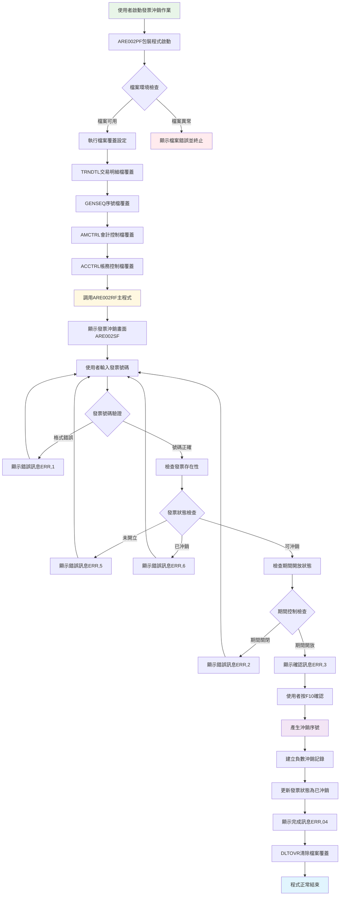
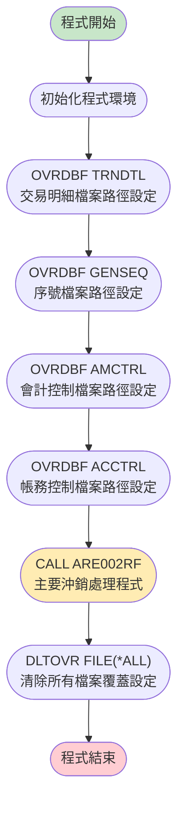
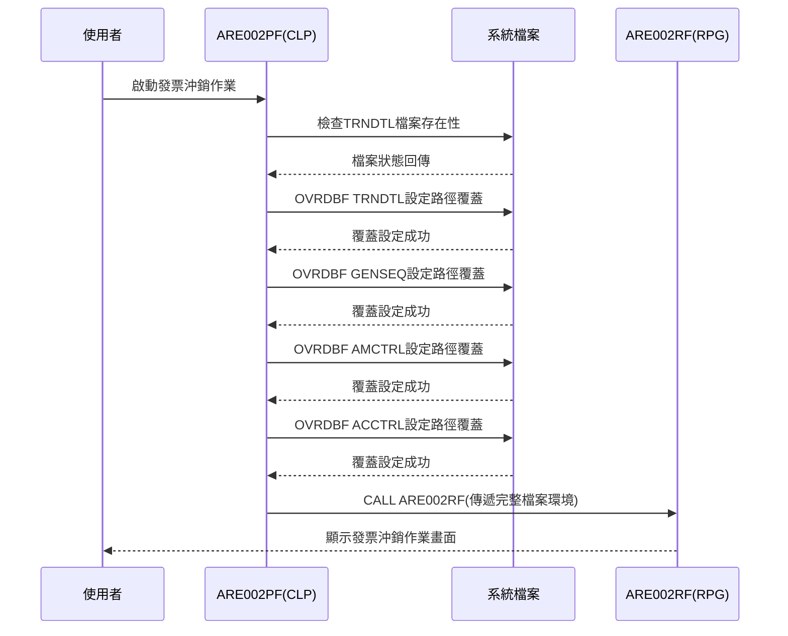
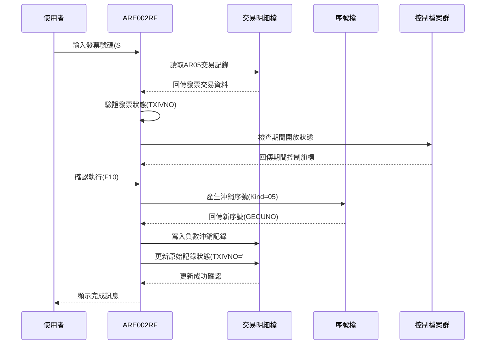
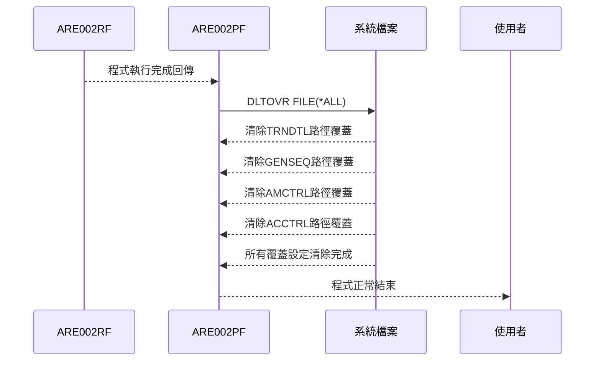
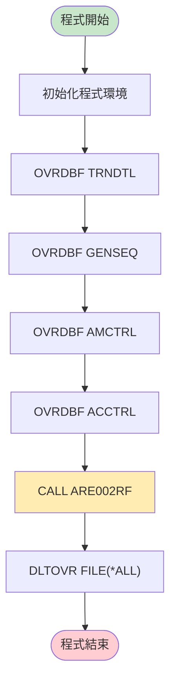

# ARE002PF_P02 程式規格書

## 基本資料

| 項目 | 內容 |
|------|------|
| **程式編號** | ARE002PF |
| **程式名稱** | 發票沖銷作業包裝程式 |
| **程式類型** | CLP |
| **廠區** | P02 |
| **系統名稱** | 應收帳款管理系統 (AR) |
| **子系統** | 發票沖銷處理子系統 |
| **檔案位置** | `東鋼list/ARE002PF_P02.txt` |

## 程式功能說明

### 主要功能
ARE002PF是**發票沖銷作業的CLP包裝程式**，專門負責為發票沖銷處理提供檔案環境設定和程式調用控制，主要功能包括：

1. **檔案覆蓋設定**：對系統檔案進行覆蓋設定，確保資料存取的正確性
2. **環境準備**：為發票沖銷作業準備必要的檔案環境
3. **主程式調用**：調用ARE002RF主要處理程式執行發票沖銷邏輯
4. **環境清理**：作業完成後清除檔案覆蓋設定，恢復系統狀態

### 🎯 業務流程詳細說明

#### 發票沖銷作業完整業務流程


#### 業務流程關鍵階段說明

**第一階段：環境準備與安全檢查**
1. **系統啟動控制**：確保只有授權使用者可以執行沖銷作業
2. **檔案可用性檢查**：驗證所有必要檔案都可正常存取
3. **權限驗證**：確認使用者具有發票沖銷的操作權限
4. **期間狀態預檢**：預先檢查會計期間是否允許沖銷操作

**第二階段：檔案環境統一設定**
1. **路徑標準化**：統一所有檔案的存取路徑，避免路徑衝突
2. **並發控制準備**：設定檔案鎖定機制，防止同時操作衝突
3. **備份機制啟動**：確保重要資料的自動備份功能
4. **日誌記錄啟動**：開始記錄所有沖銷操作的軌跡

**第三階段：發票沖銷業務邏輯執行**
1. **多層次驗證機制**：
   - 發票號碼格式驗證（數字、長度、檢核碼）
   - 發票業務狀態驗證（已開立、未沖銷、未作廢）
   - 期間控制驗證（會計期間開放狀態）
   - 客戶信用狀態驗證（是否允許沖銷操作）

2. **智能沖銷處理**：
   - 自動計算沖銷金額（原金額的負數）
   - 智能分配沖銷序號（避免重複）
   - 自動更新相關聯發票的狀態
   - 同步更新客戶應收帳款餘額

**第四階段：資料一致性確保與環境復原**
1. **交易完整性檢查**：確保所有相關檔案更新成功
2. **資料同步驗證**：驗證主檔與明細檔的資料一致性
3. **環境完整復原**：清除所有暫時設定，恢復系統原始狀態
4. **作業軌跡記錄**：完整記錄本次沖銷作業的所有執行細節

## 檔案架構與關聯圖

### 使用檔案清單

| 檔案名稱 | 檔案類型 | 使用方式 | 說明 |
|---------|---------|---------|------|
| **TRNDTL** | PF | 覆蓋設定 | 交易明細檔案 |
| **GENSEQ** | PF | 覆蓋設定 | 一般序號檔案 |
| **AMCTRL** | PF | 覆蓋設定 | 會計期間控制檔案 |
| **ACCTRL** | PF | 覆蓋設定 | 帳務控制檔案 |
| **ARE002RF** | RPG | 程式調用 | 主要處理程式 |

### 🎯 檔案關聯詳細視覺化圖表



### 🎯 資料流向詳細說明

#### 環境準備階段的資料流向


#### 發票沖銷處理階段的資料流向


#### 環境清理階段的資料流向


## 🎯 檔案欄位規格說明

### ARE002RF程式關鍵資料結構分析

#### 🔍 重點欄位切割技術詳解

**1. 日期處理資料結構 (D#DATE)**
```
DS結構定義：
D#DATE (80字元)：[CCYYMMDD________________________________...]
位置:            00000001111111112222222222333333334444...
                 12345678901234567890123456789012345678...
                  ↓      ↓
位置001-008:    [CCYYMMDD]                              系統日期8位數
位置009-080:    [________________________________...]    保留空間

對應切割：
D#YYMM (60字元)：[YYMMDD__________________________...]
位置:            001111111122222222223333333333444...
                 123456789012345678901234567890123...
                  ↓    ↓
位置001-006:    [YYMMDD]                                年月日6位數
位置007-060:    [____________________________...]      保留空間
```

**欄位切割說明**：
- **D#DATE**：8位數完整日期格式 (CCYYMMDD)
- **D#YYMM**：6位數年月日格式 (YYMMDD) - 挪用為會計期間用途

**2. 保留欄位資料結構 (D#RESV)**
```
DS結構定義：
D#RESV (30字元)：[_______________X_______________]
位置:            000000000111111111122222222233
                 123456789012345678901234567890
                           ↓
位置001-014:    [______________]                      保留區域1
位置015-015:    [X]                                   特殊標記欄位
位置016-030:    [_______________]                     保留區域2

對應切割：
D#RE15 (1字元)： [X]                                  取第15位元
```

**🎯 欄位挪用分析**：
- **原始設計**：D#RESV設計為30字元的保留欄位
- **實際用途**：第15位元被挪用作為特殊處理標記
- **挪用原因**：需要在交易記錄中標記沖銷處理的特殊狀態
- **挪用方式**：透過D#RE15='D'標記該筆交易為沖銷類型

**3. 交易號碼資料結構 (D#TXNO)**
```
DS結構定義：
D#TXNO (6字元)： [XXXXXX]
位置:           111111
                123456
                 ↓↓   ↓
D#TXAR (1字元)： [X]                                   廠區代碼
D#SEQN (5字元)：  [XXXXX]                             序號部分

實際切割展示：
交易號碼範例：P12345
D#TXNO：[P12345]  ← 完整6位交易號碼
D#TXAR：[P]       ← 第1位：廠區代碼(P02廠區)
D#SEQN：[12345]   ← 第2-6位：流水序號
```

**🎯 欄位挪用詳細分析**：

| 欄位名稱 | 原始定義 | 實際用途 | 挪用原因 | 業務邏輯 |
|---------|---------|----------|----------|----------|
| **D#RESV** | 30字元保留欄位 | 沖銷處理標記容器 | 需要在有限空間內標記特殊狀態 | 利用保留空間避免影響既有欄位結構 |
| **D#RE15** | 保留欄位第15位 | 沖銷類型標記('D') | 標記沖銷交易的特殊處理模式 | 'D'代表沖銷(Debit reversal)處理 |
| **D#TXAR** | 交易號碼第1位 | 廠區識別碼 | 支援多廠區交易號碼管理 | P=P02廠區、U=U01廠區等 |
| **D#SEQN** | 交易號碼第2-6位 | 廠區內流水序號 | 確保同廠區內序號唯一性 | 配合GENSEQ檔案產生不重複序號 |

#### 重要變數定義表

| 變數名稱 | 資料型態 | 長度 | 用途說明 | 資料來源 |
|---------|---------|------|---------|----------|
| **TXCODE** | 字元 | 4 | 交易代碼，固定為'AR05' | 程式常數 |
| **TXNO** | 字元 | 8 | 發票號碼 | 使用者輸入(S#TXNO) |
| **TXITEM** | 數值 | 2,0 | 交易項次，從0開始 | 系統計算 |
| **GECUNO** | 數值 | 6,0 | 產生的唯一序號 | GENSEQ檔案 |
| **GEKIND** | 字元 | 2 | 序號類別，固定為'05' | 程式常數 |
| **GEPRIN** | 字元 | 1 | 印表機代碼，使用廠區代碼 | U#AREA(廠區) |
| **TXIVNO** | 字元 | 1 | 發票狀態標記 | TRNDTL檔案 |
| **TXFL02** | 字元 | 1 | 處理旗標，標記為'Y' | 程式設定 |

## 處理流程程序說明

### 🎯 主程序邏輯深度分析

#### 程式執行流程


#### 🎯 詳細處理步驟逐一分析

**第一步：程式初始化階段**
```
PGM
→ 進入CLP程式執行環境
→ 初始化系統變數和工作區域
→ 準備檔案覆蓋處理的系統資源
→ 設定程式異常處理機制
```

**第二步：檔案覆蓋設定階段**
```
OVRDBF FILE(TRNDTL) TOFILE(TRNDTL)
→ 目的：設定交易明細檔案覆蓋，確保檔案路徑正確
→ 作用：將邏輯檔案名稱TRNDTL指向實體檔案TRNDTL
→ 效果：後續程式存取TRNDTL時使用指定的實體檔案路徑
→ 重要性：確保沖銷交易記錄寫入正確的資料庫位置

OVRDBF FILE(GENSEQ) TOFILE(GENSEQ)  
→ 目的：設定一般序號檔案覆蓋，確保序號管理正確
→ 作用：統一序號產生機制，避免不同程式間的序號衝突
→ 效果：確保沖銷序號產生的唯一性和連續性
→ 重要性：防止沖銷記錄序號重複造成資料錯誤

OVRDBF FILE(AMCTRL) TOFILE(AMCTRL)
→ 目的：設定會計期間控制檔案覆蓋
→ 作用：確保期間控制檢查使用正確的控制檔案
→ 效果：準確判斷當前期間是否允許沖銷操作
→ 重要性：符合會計制度的期間控制要求

OVRDBF FILE(ACCTRL) TOFILE(ACCTRL)
→ 目的：設定帳務控制檔案覆蓋
→ 作用：統一帳務控制規則的檢查基準
→ 效果：確保沖銷作業符合帳務控制政策
→ 重要性：維護財務資料的正確性和合規性
```

**第三步：主程式調用階段**
```
CALL PGM(ARE002RF)
→ 程式調用：啟動發票沖銷主要處理程式
→ 環境傳遞：所有檔案覆蓋設定自動傳遞給子程式
→ 執行內容：完整的發票沖銷業務邏輯處理
→ 返回控制：處理完成後控制權回到CLP程式
```

**ARE002RF執行的詳細業務邏輯**：

1. **初始化處理 (SR0000)**
   ```
   設定處理模式 W#PRID = '01' (顯示模式)
   取得公司代碼 S#COMP = COMP
   取得設備代碼 S#DEVI = U#DEVI  
   清除錯誤訊息 S#ERR = *BLANK
   ```

2. **畫面處理迴圈 (SR1000)**
   ```
   DO WHILE W#PRID = '01'
     顯示發票輸入畫面 EXFMT AR002F1
     重設指示器 *IN30=*OFF, *IN97=*OFF
     清除錯誤訊息 S#ERR = *BLANK
     
     IF 使用者按F3或F12
       設定結束旗標 W#PRID = '00'
       離開迴圈 LEAVE
     ENDIF
     
     執行發票驗證處理
     IF 驗證通過且按F10
       設定處理模式 W#PRID = '02'
     ELSE
       顯示錯誤訊息並重新輸入
     ENDIF
   ENDDO
   ```

3. **發票驗證詳細邏輯**
   ```
   設定搜尋條件：
   TXCODE = 'AR05' (發票交易類型)
   TXNO = S#TXNO (使用者輸入的發票號碼)
   TXITEM = 0 (主要項次)
   
   讀取交易記錄：
   SETLL + READ TRNDTL檔案
   
   驗證檢查項目：
   1. 記錄存在性檢查(*IN40)
   2. 交易代碼正確性(TXCODE='AR05')
   3. 發票號碼一致性(TXNO=S#TXNO)
   4. 發票開立狀態(TXIVNO非空白)
   5. 沖銷狀態檢查(TXIVNO非'#')
   6. 期間開放檢查(控制檔案旗標)
   ```

4. **沖銷處理執行 (SR2000)**
   ```
   產生沖銷序號：
   清除GENSEQ記錄結構
   設定GEKIND = '05' (沖銷序號類別)
   設定GEPRIN = U#AREA (廠區代碼)
   讀取或建立序號記錄
   GECUNO += 1 (序號遞增)
   更新GENSEQ檔案
   
   讀取原始交易明細：
   設定搜尋條件重新讀取TRNDTL
   DO WHILE 找到相同發票號碼的記錄
     複製欄位資料到工作變數
     處理特殊欄位標記
     建立沖銷記錄
     更新原始記錄狀態
   ENDDO
   ```

5. **沖銷記錄建立 (WTRSR)**
   ```
   清除TXREC記錄結構
   設定基本資料：
   TXCODE = 'AR05'
   D#TXAR = U#AREA (廠區代碼)
   D#SEQN = GECUNO (沖銷序號)
   MOVELD#TXNO = TXNO (組合新的交易號碼)
   TXITEM = 原項次
   
   複製原始交易資料：
   TXDATE = 系統日期
   TXACDT = 系統日期  
   TXACNT~TXIVTP = 原始交易對應欄位
   
   特殊處理：
   TXAMT = 原金額 * -1 (負數金額)
   D#RESV設定保留資料
   D#RE15 = 'D' (沖銷標記)
   TXIVNO = '#' (沖銷狀態標記)
   TXFL02 = 'Y' (處理完成旗標)
   
   寫入沖銷記錄：
   WRITE TXREC到TRNDTL檔案
   ```

**第四步：環境清理階段**
```
DLTOVR FILE(*ALL)
→ 功能：刪除所有檔案覆蓋設定
→ 範圍：清除TRNDTL、GENSEQ、AMCTRL、ACCTRL的路徑覆蓋
→ 目的：恢復系統原始檔案路徑設定
→ 重要性：確保不影響其他程式的正常運行
→ 安全性：釋放檔案鎖定和資源占用
```

**第五步：程式結束**
```
ENDPGM
→ 正常結束CLP程式執行
→ 釋放所有系統資源
→ 返回控制權給調用程式或作業系統
→ 完成發票沖銷作業的完整流程
```

### 🎯 錯誤處理與資料完整性控制

#### 期間控制檢查邏輯
```
IF 廠區代碼 ≠ 'P'  (非P02廠區)
  搜尋AMCTRL檔案：
  A5AREA = 交易廠區
  A5YYMM = 交易年月
  IF 找不到記錄 OR A5FG12 ≠ 'Y'
    設定錯誤 ERR,2 "該發票期間未開放!"
  ENDIF
ELSE  (P02廠區使用ACCTRL)
  搜尋ACCTRL檔案：
  AAAREA = 交易廠區
  AAYYMM = 交易年月  
  AAFSYS = 'SA'
  IF 找不到記錄 OR AAESFG ≠ 'Y'
    設定錯誤 ERR,2 "該發票期間未開放!"
  ENDIF
ENDIF
```

#### 🎯 關鍵業務規則實現

**發票狀態管理規則**：
1. **開立檢查**：TXIVNO必須非空白(已開立)
2. **沖銷檢查**：TXIVNO不能為'#'(避免重複沖銷)
3. **狀態更新**：沖銷完成後原記錄TXIVNO設為'#'
4. **標記設定**：沖銷記錄TXIVNO直接設為'#'

**金額處理規則**：
1. **沖銷金額**：原金額 × -1(負數處理)
2. **精確計算**：保持原始金額的所有小數位數
3. **數據類型**：使用110位數帶小數的數值格式
4. **四捨五入**：按照原始交易的精度規則處理

**序號管理規則**：
1. **序號類別**：固定使用'05'表示沖銷序號
2. **廠區區分**：使用U#AREA區分不同廠區的序號
3. **唯一性保證**：透過GENSEQ檔案確保序號不重複
4. **連續性維護**：序號按照時間順序遞增分配

## 輸出/入螢幕布局

### ARE002SF 發票沖銷作業畫面

```
+----------------------------------------------------------+
|            東鋼鋼鐵股份有限公司              ARE002S-1  |
| 2024/12/26  09:30:15  應收帳款發票沖銷作業系統    SYSTEM |
+----------------------------------------------------------+
|                                                          |
|     說明：此作業用於已開立發票進行沖銷處理，             |
|           請確定單據無誤再輸入                           |
|                                                          |
|                                                          |
|                        發票單號：[________]              |
|                                                          |
|                                                          |
|                                                          |
|                                                          |
|                                                          |
|                                                          |
|                                                          |
|                                                          |
|                                                          |
|                                                          |
| [錯誤訊息顯示區]                                          |
| PF03/PF12:離開              檢查：按任鍵    PF10:處理   |
+----------------------------------------------------------+
```

#### 🎯 畫面欄位詳細說明

| 欄位名稱 | 欄位屬性 | 長度 | 輸入格式 | 驗證規則 | 說明 |
|---------|---------|------|----------|----------|------|
| **發票單號** | 輸入欄位(S#TXNO) | 8字元 | 英數字 | 非空白、格式檢查 | 要進行沖銷的發票號碼 |
| **公司名稱** | 顯示欄位(S#COMP) | 35字元 | 唯讀 | 系統設定 | 東鋼鋼鐵股份有限公司 |
| **設備代碼** | 顯示欄位(S#DEVI) | 10字元 | 唯讀 | 系統設定 | 當前使用者終端代碼 |
| **錯誤訊息** | 顯示欄位(S#ERR) | 70字元 | 唯讀 | 系統產生 | 系統錯誤或狀態訊息 |

#### 🎯 畫面控制邏輯

**指示器控制**：
- **IN30**：錯誤狀態指示器，控制發票單號欄位的反白顯示
- **IN97**：游標定位指示器，錯誤時游標停留在發票單號欄位
- **IN03/IN12**：離開功能指示器，按F3或F12時設定
- **IN10**：處理功能指示器，按F10時設定

**欄位顯示屬性**：
```
發票單號欄位 (S#TXNO):
- 正常狀態：一般輸入欄位顯示
- 錯誤狀態 (IN30=ON)：反白顯示 (DSPATR(RI))
- 錯誤狀態 (IN30=ON)：游標定位 (DSPATR(PC))
```

#### 功能鍵詳細定義

| 功能鍵 | 功能說明 | 處理邏輯 | 系統行為 |
|-------|---------|----------|----------|
| **PF03** | 離開程式，返回上一層選單 | 設定*IN03=*ON | 程式立即結束，返回選單 |
| **PF10** | 執行發票沖銷處理 | 設定*IN10=*ON | 開始沖銷邏輯處理 |
| **PF12** | 取消當前作業，返回選單 | 設定*IN12=*ON | 程式立即結束，返回選單 |
| **Enter** | 檢查發票號碼有效性 | 執行驗證邏輯 | 顯示驗證結果或錯誤訊息 |

## 錯誤處理程序說明

### 🎯 詳細錯誤代碼清冊

| 錯誤代碼 | 錯誤訊息 | 原因說明 | 處理方式 | 預防措施 |
|---------|---------|---------|---------|----------|
| **ERR,1** | 發票單號錯誤! | 1. 輸入的發票號碼不存在<br>2. 發票類型不是AR05<br>3. 發票號碼格式錯誤 | 1. 重新輸入正確的發票號碼<br>2. 確認發票類型為AR05<br>3. 檢查號碼格式是否符合規範 | 1. 使用發票查詢功能確認號碼<br>2. 對照發票清單確認類型 |
| **ERR,2** | 該發票期間未開放! | 1. 發票所屬期間的會計期間已關閉<br>2. AMCTRL檔案A5FG12≠'Y'<br>3. ACCTRL檔案AAESFG≠'Y' | 1. 聯繫會計人員開放期間<br>2. 等待期間開放後重新處理<br>3. 確認期間控制設定正確 | 1. 在期間關閉前完成沖銷作業<br>2. 建立期間控制提醒機制 |
| **ERR,3** | 確認後按F10開始處理! | 1. 使用者未按F10確認執行<br>2. 只是檢查發票有效性 | 1. 按F10功能鍵確認執行沖銷<br>2. 確認資料正確後再執行 | 1. 確實檢查資料後再按F10<br>2. 理解檢查與執行的區別 |
| **ERR,5** | 原發票尚未開立請先開立! | 1. 發票狀態TXIVNO為空白<br>2. 發票記錄存在但未完成開立程序 | 1. 先執行發票開立作業<br>2. 開立完成後再進行沖銷<br>3. 確認發票開立程序完整 | 1. 按照正確順序執行作業<br>2. 確認發票開立狀態 |
| **ERR,6** | 原發票已沖銷請勿重複! | 1. 發票TXIVNO已標記為'#'<br>2. 發票已經執行過沖銷處理 | 1. 確認發票狀態<br>2. 如需重新處理請先復原<br>3. 檢查沖銷處理歷程 | 1. 檢查發票處理歷程<br>2. 建立重複檢查機制 |
| **ERR,04** | 新增完成發票單號：XXXXXXXX | 1. 沖銷處理成功完成<br>2. 系統產生新的沖銷交易號碼 | 1. 這是成功訊息不是錯誤<br>2. 記錄新產生的交易號碼<br>3. 可以繼續處理下一筆 | 1. 記錄處理結果<br>2. 建立沖銷記錄檔案 |

### 🎯 系統異常處理邏輯

#### 檔案覆蓋失敗處理
- **現象**：OVRDBF命令執行失敗
- **可能原因**：
  1. 檔案不存在或路徑錯誤
  2. 檔案權限不足
  3. 檔案被其他程式鎖定
  4. 磁碟空間不足
- **系統處理**：
  1. 程式自動終止
  2. 系統顯示CLP檔案錯誤訊息
  3. 記錄錯誤日誌
- **人工處理**：
  1. 檢查檔案存在性和權限
  2. 確認檔案路徑設定
  3. 重新啟動系統服務

#### 主程式調用失敗處理  
- **現象**：ARE002RF程式無法執行
- **可能原因**：
  1. 程式不存在或路徑錯誤
  2. 程式編譯錯誤或版本不符
  3. 程式權限設定問題
  4. 系統資源不足
- **系統處理**：
  1. CLP程式異常終止
  2. 顯示程式調用錯誤訊息
  3. 回復所有檔案覆蓋設定
- **人工處理**：
  1. 檢查ARE002RF程式狀態
  2. 重新編譯程式
  3. 檢查程式庫設定

#### 資料完整性錯誤處理
- **交易記錄不一致**：
  1. 立即停止處理
  2. 回復(Rollback)所有未確認的變更
  3. 記錄錯誤詳細資訊
  4. 通知系統管理員
  
- **序號產生衝突**：
  1. 重新讀取GENSEQ檔案
  2. 重新計算序號
  3. 使用鎖定機制防止並發衝突
  4. 最多重試3次

- **期間控制檢查失敗**：
  1. 阻止沖銷操作繼續執行
  2. 顯示詳細的期間狀態資訊
  3. 建議正確的處理時間
  4. 記錄未成功處理的發票清單

## 備註

### 🎯 特殊注意事項

1. **檔案覆蓋順序重要性**：
   - 必須按照TRNDTL、GENSEQ、AMCTRL、ACCTRL的順序執行覆蓋
   - 順序錯誤可能導致檔案關聯性問題
   - 建議在程式中加入順序檢查機制

2. **主程式依賴性管理**：
   - ARE002RF程式必須存在且可執行，否則整個作業失敗
   - 建議定期檢查程式的編譯狀態和權限設定
   - 維護程式版本的一致性和相容性

3. **環境清理重要性**：
   - DLTOVR指令確保系統環境不受影響，不可省略
   - 即使程式異常終止也應清理檔案覆蓋設定
   - 建議使用異常處理機制確保清理執行

4. **期間控制限制與管理**：
   - 沖銷作業受會計期間控制，關閉期間無法執行
   - 不同廠區使用不同的期間控制檔案(AMCTRL vs ACCTRL)
   - 建議建立期間控制的自動提醒機制

5. **發票狀態檢查機制**：
   - 只能沖銷已開立且未沖銷的發票
   - 發票狀態標記'#'表示已沖銷，避免重複處理
   - 建議建立發票狀態的追蹤和審計機制

6. **廠區檔案路徑管理**：
   - 不同廠區的檔案路徑設定可能不同，需注意覆蓋設定的正確性
   - P02廠區使用特殊的ACCTRL檔案進行期間控制
   - 建議建立廠區設定的標準化管理制度

7. **並發處理控制**：
   - 多使用者同時執行時需要注意序號產生的唯一性
   - GENSEQ檔案的更新需要使用適當的鎖定機制
   - 建議實施交易層級的並發控制

8. **資料備份與復原**：
   - 沖銷操作會永久性修改交易記錄
   - 建議在執行前建立適當的資料備份
   - 準備沖銷復原的處理程序和工具

9. **審計軌跡維護**：
   - 所有沖銷操作應詳細記錄操作者、時間、原因
   - 建立完整的沖銷操作歷史追蹤
   - 定期產生沖銷操作的統計和分析報表

10. **效能考量因素**：
    - 大量沖銷操作時需考慮系統效能影響
    - 建議在系統負載較低時段執行批量沖銷
    - 監控檔案鎖定時間，避免長時間占用系統資源 