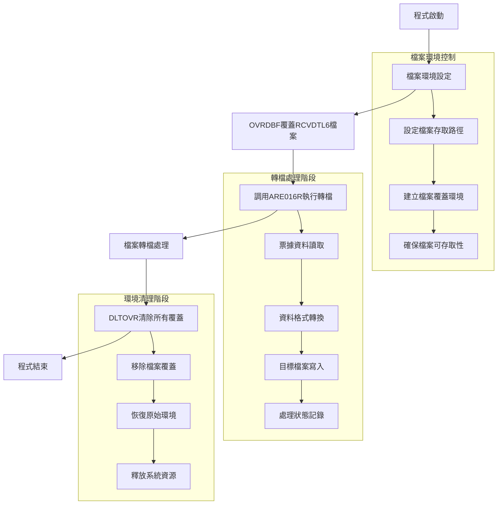
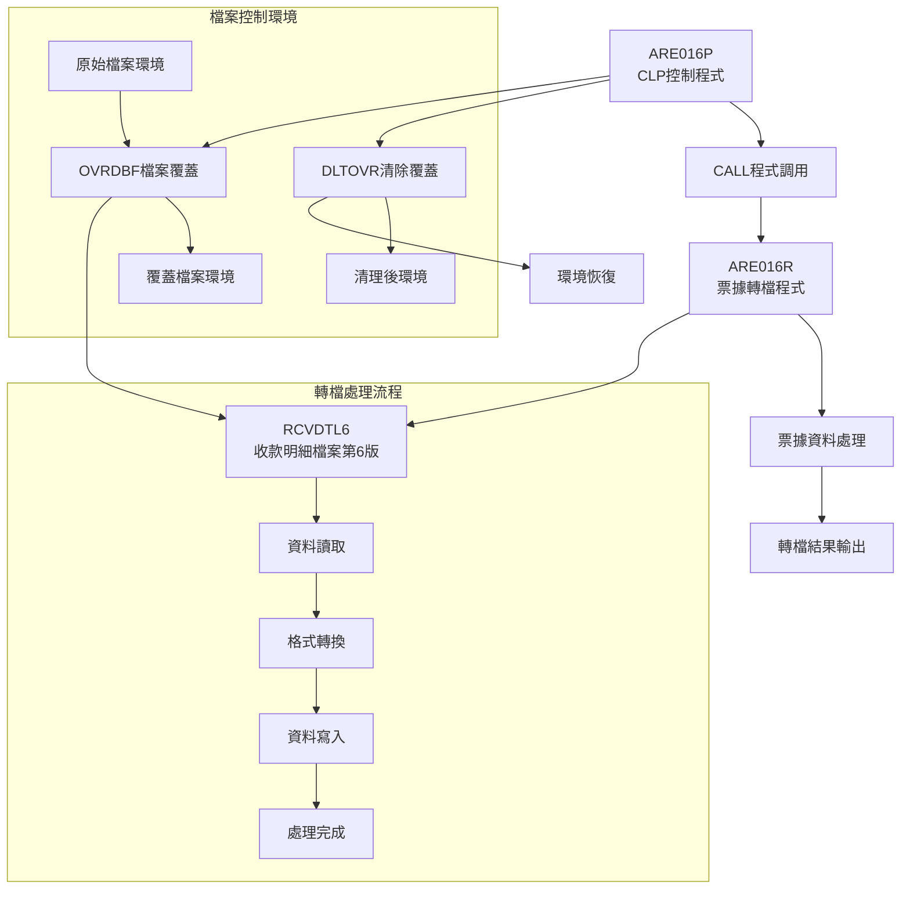
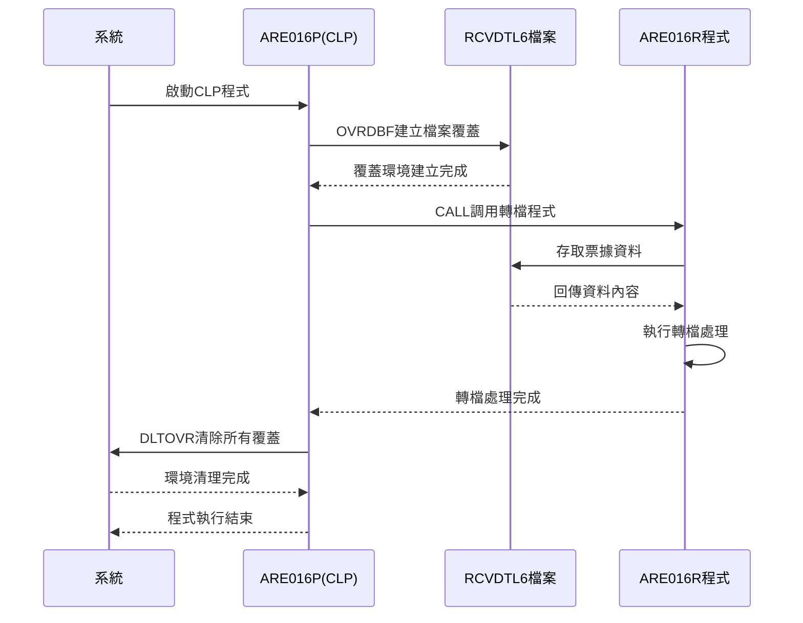
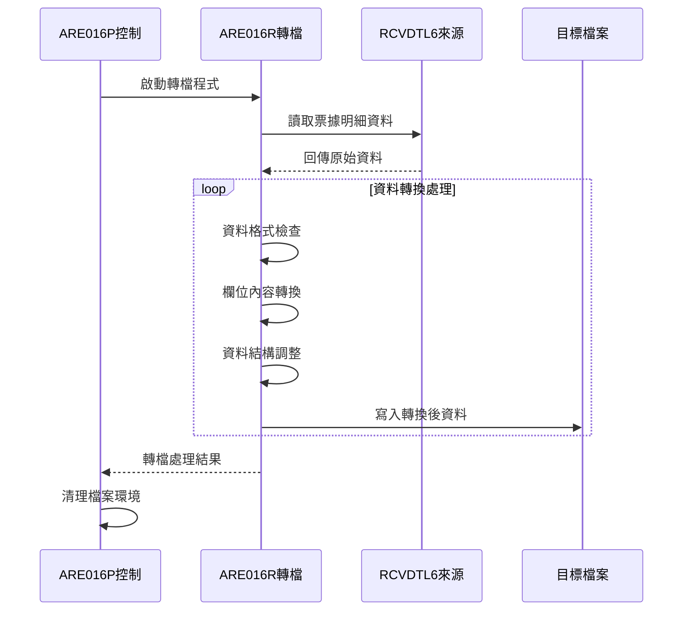
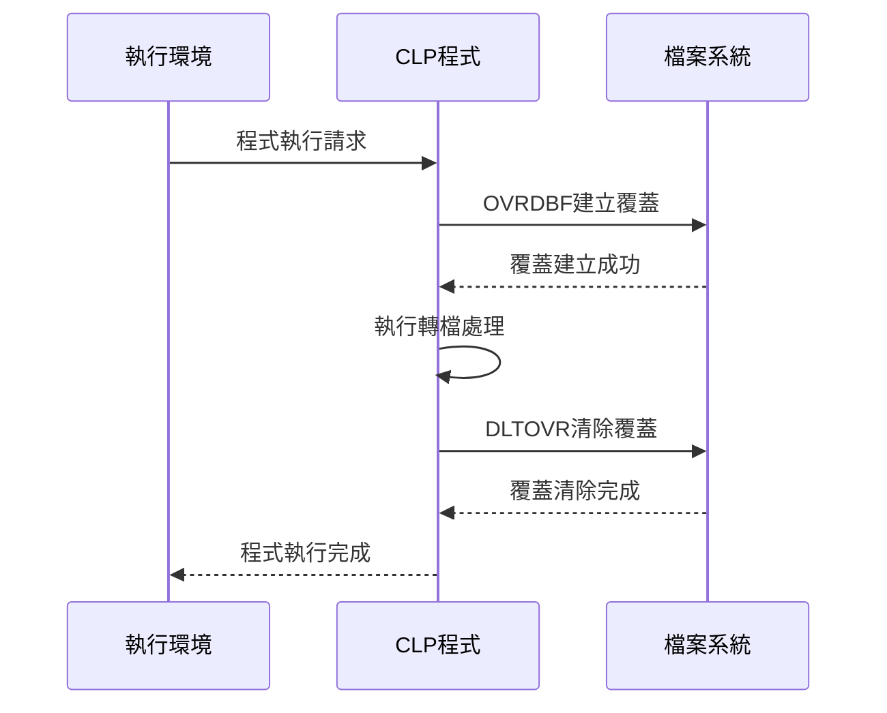
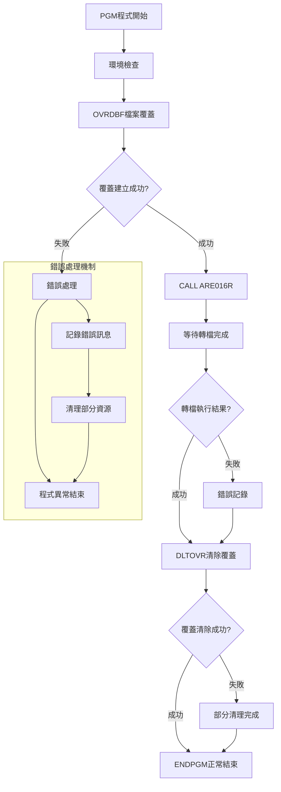

# ARE016P_K02 程式規格書

## 1. 基本資料

| 項目 | 內容 |
|------|------|
| **程式編號** | ARE016P |
| **程式名稱** | 票據資料轉檔設定 |
| **程式類型** | CLP |
| **廠區** | K02 |
| **系統名稱** | 應收帳款系統 |
| **子系統** | 票據資料轉檔子系統 |
| **檔案位置** | 東鋼list/ARE016P_K02.txt |

## 2. 🎯 程式功能說明

### 主要功能描述
ARE016P為票據資料轉檔設定程式，專門負責票據資料的檔案環境設定和轉檔處理控制。程式透過檔案覆蓋機制設定RCVDTL6檔案的存取環境，調用ARE016R執行實際的票據資料轉檔作業，並在處理完成後清除所有檔案覆蓋設定。

### 🎯 業務流程詳細說明

#### 完整業務流程圖


#### 業務流程關鍵階段說明

**階段1: 檔案環境設定階段**
- 執行OVRDBF檔案覆蓋指令
- 設定RCVDTL6檔案的存取環境
- 建立檔案處理的專用環境
- 確保檔案路徑和權限正確

**階段2: 轉檔處理調用階段**
- 調用ARE016R程式執行轉檔作業
- 傳遞檔案環境設定給子程式
- 等待轉檔處理完成
- 接收處理結果狀態

**階段3: 環境清理階段**
- 執行DLTOVR清除所有檔案覆蓋
- 恢復系統原始檔案環境
- 釋放檔案控制資源
- 確保環境清潔無殘留

#### CLP程式控制機制
- **檔案覆蓋控制**: 透過OVRDBF建立檔案存取環境
- **程式調用控制**: 調用ARE016R執行實際轉檔作業
- **環境清理控制**: 透過DLTOVR確保環境復原
- **錯誤處理控制**: 確保程式執行的穩定性

#### 票據資料轉檔處理
- **來源檔案**: RCVDTL6收款明細檔案第6版
- **處理方式**: 透過檔案覆蓋機制控制存取
- **轉檔程式**: ARE016R負責實際資料轉換
- **環境管理**: CLP負責檔案環境的建立和清理

## 3. 🎯 檔案架構與關聯圖

### 使用檔案清單

| 檔案名稱 | 檔案用途 | 存取方式 | 控制方式 |
|----------|---------|---------|----------|
| **RCVDTL6** | 收款明細檔案第6版 | 覆蓋 | OVRDBF指令 |
| **ARE016R** | 票據轉檔執行程式 | 調用 | CALL指令 |

### 🎯 檔案關聯詳細視覺化圖表



### 🎯 資料流向詳細說明

#### 檔案環境控制流向


#### 轉檔處理資料流向


#### 環境管理流向


## 4. 🎯 檔案欄位規格說明

### 主要指令結構

#### CLP指令詳細分析

**OVRDBF指令結構**
```
OVRDBF FILE(RCVDTL6) TOFILE(RCVDTL6)
├── 指令名稱: OVRDBF (Override Database File)
├── FILE參數: RCVDTL6 (來源檔案名稱)
└── TOFILE參數: RCVDTL6 (目標檔案名稱)
```

**CALL指令結構**
```
CALL PGM(ARE016R)
├── 指令名稱: CALL (Call Program)
├── PGM參數: ARE016R (被調用程式名稱)
└── 執行方式: 同步調用等待返回
```

**DLTOVR指令結構**
```
DLTOVR FILE(*ALL)
├── 指令名稱: DLTOVR (Delete Override)
├── FILE參數: *ALL (所有檔案覆蓋)
└── 清理範圍: 程式內所有覆蓋設定
```

### 🔍 重點參數技術詳解

#### 檔案覆蓋機制分析

**RCVDTL6檔案覆蓋邏輯**
```
檔案覆蓋設定：
原始檔案: RCVDTL6 → 覆蓋目標: RCVDTL6
覆蓋類型: 同名覆蓋 (路徑重導向)
覆蓋範圍: 檔案存取路徑和權限
覆蓋期間: 程式執行期間有效
```

#### 程式調用參數

**ARE016R調用參數**
- **調用方式**: 同步調用
- **參數傳遞**: 透過檔案環境設定
- **返回處理**: 等待程式完成後繼續
- **錯誤處理**: 依賴被調用程式的錯誤處理

#### 環境清理參數

***ALL檔案清理範圍**
- **清理對象**: 程式內建立的所有檔案覆蓋
- **清理時機**: 轉檔處理完成後
- **清理方式**: 一次性全部清除
- **影響範圍**: 僅限本程式建立的覆蓋

### 重要變數定義表

| 指令類型 | 指令名稱 | 參數 | 用途說明 |
|----------|---------|------|----------|
| **檔案覆蓋** | OVRDBF | FILE(RCVDTL6) | 指定要覆蓋的檔案名稱 |
| **檔案覆蓋** | OVRDBF | TOFILE(RCVDTL6) | 指定覆蓋目標檔案名稱 |
| **程式調用** | CALL | PGM(ARE016R) | 指定要調用的轉檔程式 |
| **覆蓋清除** | DLTOVR | FILE(*ALL) | 清除所有檔案覆蓋設定 |

## 5. 🎯 輸出/入螢幕布局

### CLP程式執行介面

#### 程式執行狀態顯示
```
+----------------------------------------------------------+
|                    ARE016P 票據資料轉檔設定              |
|                                                          |
| 程式狀態: 執行中                                         |
| 處理階段: [■■■□□□□□□□] 30%                           |
|                                                          |
| 目前處理: 建立檔案覆蓋環境                               |
| 檔案名稱: RCVDTL6                                        |
| 覆蓋狀態: 設定完成                                       |
|                                                          |
| 調用程式: ARE016R                                        |
| 執行狀態: 處理中...                                      |
|                                                          |
| 處理時間: 00:01:25                                       |
| 預估剩餘: 00:02:30                                       |
|                                                          |
+----------------------------------------------------------+
```

#### 程式完成狀態顯示
```
+----------------------------------------------------------+
|                    ARE016P 票據資料轉檔設定              |
|                                                          |
| 程式狀態: 執行完成                                       |
| 處理階段: [■■■■■■■■■■] 100%                        |
|                                                          |
| 檔案覆蓋: 已建立並清除                                   |
| 程式調用: ARE016R 執行完成                               |
| 環境清理: 所有覆蓋已清除                                 |
|                                                          |
| 總處理時間: 00:03:45                                     |
| 執行結果: 成功                                           |
|                                                          |
| 按任意鍵繼續...                                          |
+----------------------------------------------------------+
```

### 🎯 執行階段詳細說明

#### 執行階段表
| 階段 | 階段名稱 | 執行內容 | 預估時間 | 狀態指示 |
|------|---------|---------|---------|----------|
| **1** | 環境初始化 | 程式啟動和參數檢查 | 5秒 | 進度條10% |
| **2** | 檔案覆蓋建立 | OVRDBF執行 | 10秒 | 進度條30% |
| **3** | 程式調用執行 | CALL ARE016R | 180秒 | 進度條90% |
| **4** | 環境清理 | DLTOVR執行 | 5秒 | 進度條100% |

#### 系統訊息顯示格式
| 訊息類型 | 訊息格式 | 訊息內容範例 |
|----------|---------|-------------|
| **資訊訊息** | ARE016P-I001 | 檔案覆蓋建立成功: RCVDTL6 |
| **警告訊息** | ARE016P-W001 | 檔案已存在覆蓋設定 |
| **錯誤訊息** | ARE016P-E001 | 檔案覆蓋建立失敗 |
| **完成訊息** | ARE016P-C001 | 票據轉檔處理完成 |

## 6. 🎯 處理流程程序說明

### 🎯 主程序邏輯深度分析

#### 程式執行流程圖


#### 🎯 詳細處理步驟逐一分析

**步驟1: 程式環境初始化**
- PGM指令啟動CLP程式執行環境
- 檢查系統資源和檔案存取權限
- 初始化程式執行所需的系統變數
- 準備檔案覆蓋和程式調用環境

**步驟2: 檔案覆蓋環境建立**
- 執行OVRDBF FILE(RCVDTL6) TOFILE(RCVDTL6)
- 建立RCVDTL6檔案的專用存取環境
- 設定檔案路徑重導向機制
- 確保後續程式能正確存取檔案

**步驟3: 轉檔程式執行調用**
- 執行CALL PGM(ARE016R)指令
- 將檔案環境設定傳遞給ARE016R
- 等待轉檔程式完成所有處理
- 接收程式執行結果和狀態碼

**步驟4: 環境清理和程式結束**
- 執行DLTOVR FILE(*ALL)清除所有覆蓋
- 恢復系統原始檔案環境設定
- 釋放程式執行佔用的系統資源
- 執行ENDPGM正常結束程式

#### 業務邏輯深度解析

**檔案覆蓋控制機制**
```
檔案覆蓋邏輯:
1. 檢查RCVDTL6檔案的存在性和存取權限
2. 建立檔案覆蓋設定重導向存取路徑
3. 確保覆蓋設定在程式執行期間有效
4. 提供檔案環境給被調用程式使用
```

**程式調用控制機制**
```
程式調用邏輯:
1. 確認ARE016R程式的存在性和執行權限
2. 傳遞檔案環境設定給被調用程式
3. 採用同步調用方式等待程式完成
4. 接收程式執行結果和錯誤狀態
```

**環境清理控制機制**
```
環境清理邏輯:
1. 檢查程式執行期間建立的所有覆蓋
2. 使用*ALL參數一次性清除所有覆蓋
3. 確保系統環境恢復到執行前狀態
4. 釋放檔案控制和系統資源
```

#### 執行時序詳細說明

**時序控制特性**
- **同步執行**: 每個指令依序執行完成後才執行下一個
- **等待機制**: CALL指令會等待ARE016R完全執行完成
- **環境依賴**: 後續指令依賴前面指令的執行結果
- **清理保證**: 無論成功或失敗都會執行環境清理

**資源管理機制**
- **檔案控制**: 透過覆蓋機制控制檔案存取
- **記憶體管理**: CLP自動管理程式執行記憶體
- **權限控制**: 依賴系統檔案和程式存取權限
- **錯誤恢復**: 確保異常狀況下的環境清理

#### 條件判斷詳細說明

**檔案存取條件判斷**
- 檢查RCVDTL6檔案是否存在且可存取
- 確認檔案覆蓋權限是否足夠
- 驗證檔案格式和結構是否正確
- 檢查檔案鎖定狀態和共享模式

**程式調用條件判斷**
- 確認ARE016R程式存在且可執行
- 檢查程式執行權限和系統資源
- 驗證程式參數和環境設定
- 確保程式版本和相依性正確

**環境清理條件判斷**
- 檢查需要清理的覆蓋設定清單
- 確認清理操作的執行權限
- 驗證清理操作不會影響其他程式
- 確保清理完成後環境狀態正確

### 🎯 指令執行分析

#### OVRDBF指令執行邏輯
**功能**: 建立資料庫檔案覆蓋
**參數分析**:
- FILE(RCVDTL6): 指定要覆蓋的檔案名稱
- TOFILE(RCVDTL6): 指定覆蓋目標檔案
- 覆蓋類型: 同名檔案路徑重導向

#### CALL指令執行邏輯
**功能**: 調用票據轉檔程式
**參數分析**:
- PGM(ARE016R): 指定被調用程式名稱
- 調用方式: 同步調用等待返回
- 環境傳遞: 檔案覆蓋設定自動傳遞

#### DLTOVR指令執行邏輯
**功能**: 刪除檔案覆蓋設定
**參數分析**:
- FILE(*ALL): 清除所有檔案覆蓋
- 清理範圍: 程式執行期間建立的覆蓋
- 清理時機: 程式結束前執行

### 🎯 特殊邏輯處理

#### 檔案環境控制邏輯
**環境隔離機制**:
```
檔案環境控制:
1. 建立程式專用的檔案存取環境
2. 確保檔案操作不影響其他程式
3. 提供一致的檔案存取介面
4. 在程式結束時完全清理環境
```

#### 程式調用整合邏輯
**調用控制機制**:
```
程式調用整合:
1. 確保被調用程式能存取設定的檔案環境
2. 採用同步調用確保處理順序正確
3. 等待程式完成避免環境衝突
4. 接收執行結果進行後續處理
```

#### 錯誤處理和恢復邏輯
**錯誤恢復機制**:
```
錯誤處理邏輯:
1. 檔案覆蓋失敗時記錄錯誤並停止執行
2. 程式調用失敗時嘗試清理已建立環境
3. 環境清理失敗時記錄警告但繼續結束
4. 任何階段失敗都確保資源釋放
```

## 7. 🎯 錯誤處理程序說明

### 🎯 詳細錯誤代碼清冊

| 錯誤代碼 | 錯誤訊息 | 原因說明 | 處理方式 | 預防措施 |
|----------|---------|---------|---------|----------|
| **CPF2105** | 物件&1在&2中找不到 | RCVDTL6檔案不存在 | 1. 檢查檔案存在性<br>2. 確認檔案路徑<br>3. 重新建立檔案 | 檔案存在性檢查機制 |
| **CPF4101** | 檔案&1未正確建立覆蓋 | 檔案覆蓋建立失敗 | 1. 檢查檔案權限<br>2. 確認系統資源<br>3. 重新執行覆蓋 | 檔案權限預檢機制 |
| **CPF0001** | 程式&1在程式庫&2中找不到 | ARE016R程式不存在 | 1. 檢查程式存在性<br>2. 確認程式路徑<br>3. 重新編譯程式 | 程式相依性檢查 |
| **CPF0999** | 程式&1執行時發生錯誤 | ARE016R執行失敗 | 1. 檢查程式日誌<br>2. 確認輸入資料<br>3. 檢查系統狀態 | 程式執行前檢查 |
| **CPF2110** | 程式庫&1不存在 | 程式庫路徑錯誤 | 1. 檢查程式庫設定<br>2. 確認系統路徑<br>3. 重新設定環境 | 程式庫路徑驗證 |
| **CPF4138** | 檔案&1已被另一個工作使用 | 檔案被鎖定無法覆蓋 | 1. 等待檔案釋放<br>2. 檢查鎖定程式<br>3. 強制解除鎖定 | 檔案鎖定狀態檢查 |
| **CPF9801** | 物件&1類型&2已損壞 | 檔案結構損壞 | 1. 檢查檔案完整性<br>2. 重新建立檔案<br>3. 從備份恢復 | 檔案完整性監控 |
| **CPF9810** | 程式庫&1已損壞 | 程式庫損壞 | 1. 檢查程式庫狀態<br>2. 重新建立程式庫<br>3. 從備份恢復 | 程式庫完整性檢查 |
| **CPF2817** | 複製到物件&2時發生錯誤 | 檔案複製或覆蓋錯誤 | 1. 檢查磁碟空間<br>2. 確認檔案權限<br>3. 清理暫存檔案 | 磁碟空間監控 |
| **CPF9999** | 功能檢查 | 一般功能執行錯誤 | 1. 檢查系統日誌<br>2. 確認系統狀態<br>3. 重新啟動作業 | 系統狀態監控 |

### 🎯 系統異常處理邏輯

#### 檔案操作失敗處理
**OVRDBF失敗處理**:
```
檔案覆蓋失敗處理邏輯:
1. 檢查檔案存在性和權限設定
2. 確認檔案未被其他程式鎖定
3. 驗證系統資源是否充足
4. 記錄錯誤資訊並中止程式執行
```

**檔案權限錯誤處理**:
```
權限錯誤處理邏輯:
1. 檢查使用者對檔案的存取權限
2. 確認檔案的共享模式設定
3. 驗證程式庫的存取權限
4. 提供權限設定建議和修正方式
```

#### 程式調用失敗處理
**ARE016R調用失敗處理**:
```
程式調用失敗處理邏輯:
1. 檢查被調用程式的存在性和權限
2. 確認程式參數和環境設定正確性
3. 檢查系統資源和相依程式庫
4. 清理已建立的檔案覆蓋環境
```

**程式執行錯誤處理**:
```
程式執行錯誤處理邏輯:
1. 接收被調用程式的錯誤返回碼
2. 分析錯誤類型和嚴重程度
3. 決定是否繼續執行或中止處理
4. 記錄詳細錯誤資訊供後續分析
```

#### 環境清理失敗處理
**DLTOVR失敗處理**:
```
環境清理失敗處理邏輯:
1. 檢查需要清理的覆蓋設定清單
2. 嘗試逐個清理各項覆蓋設定
3. 記錄無法清理的項目和原因
4. 在程式結束時發出警告訊息
```

**資源釋放錯誤處理**:
```
資源釋放錯誤處理邏輯:
1. 檢查系統資源的佔用狀況
2. 強制釋放可以釋放的資源
3. 記錄無法釋放的資源清單
4. 提供手動清理的操作建議
```

#### 系統資源錯誤處理
**記憶體不足處理**:
```
記憶體不足處理邏輯:
1. 檢查系統可用記憶體容量
2. 嘗試釋放非必要的記憶體資源
3. 調整程式執行參數和優先權
4. 建議系統管理員增加記憶體
```

**磁碟空間不足處理**:
```
磁碟空間不足處理邏輯:
1. 檢查磁碟可用空間容量
2. 清理暫存檔案和不必要檔案
3. 建議轉移檔案到其他磁碟
4. 暫停處理直到空間充足
```

#### 網路和連線錯誤處理
**檔案伺服器連線錯誤**:
```
連線錯誤處理邏輯:
1. 檢查網路連線狀態和穩定性
2. 嘗試重新建立檔案伺服器連線
3. 使用備用路徑或本地檔案
4. 記錄連線錯誤供網路管理員分析
```

**檔案共享錯誤處理**:
```
共享錯誤處理邏輯:
1. 檢查檔案共享設定和權限
2. 確認網路檔案系統的運作狀態
3. 嘗試使用替代的檔案存取方式
4. 提供本地處理的替代方案
```

## 8. 🎯 備註

### 🎯 特殊注意事項

**CLP程式控制特性**:
- 程式作為票據轉檔處理的控制層
- 負責檔案環境的建立、維護和清理
- 提供ARE016R轉檔程式的執行環境
- 確保檔案存取環境的一致性和穩定性

**檔案覆蓋機制特性**:
- 使用OVRDBF建立RCVDTL6檔案的專用存取環境
- 覆蓋設定僅在程式執行期間有效
- 不影響其他程式對原始檔案的存取
- 提供檔案路徑重導向和權限控制

**程式調用整合特性**:
- ARE016R為實際執行票據轉檔的RPG程式
- CLP負責提供執行環境和資源管理
- 採用同步調用確保處理順序正確
- 檔案環境設定自動傳遞給被調用程式

**環境清理保證機制**:
- DLTOVR FILE(*ALL)確保所有覆蓋被清理
- 防止檔案環境設定殘留影響其他程式
- 即使程式異常結束也會嘗試清理環境
- 提供完整的資源釋放和環境恢復

**系統整合特性**:
- 程式設計簡潔專注於控制邏輯
- 與ARE016R形成完整的轉檔處理架構
- 提供標準化的檔案環境管理模式
- 確保轉檔處理的穩定性和可靠性

**執行時序控制**:
- 嚴格按照建立→執行→清理的順序進行
- 每個階段完成後才進行下一階段
- 錯誤發生時立即停止並清理已建立環境
- 確保系統資源的正確使用和釋放

**檔案存取安全**:
- 檔案覆蓋設定提供額外的存取控制層
- 防止多個程式同時修改同一檔案
- 確保檔案存取的一致性和完整性
- 提供檔案操作的隔離性保護

**程式維護便利性**:
- CLP程式結構簡單易於維護和修改
- 檔案覆蓋設定集中管理便於調整
- 程式調用參數化便於擴展和重用
- 錯誤處理機制完整便於問題診斷 