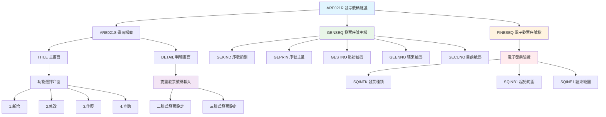
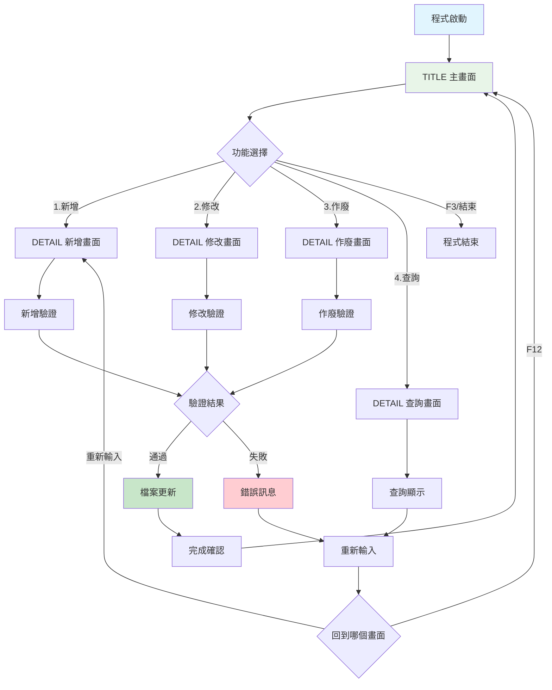
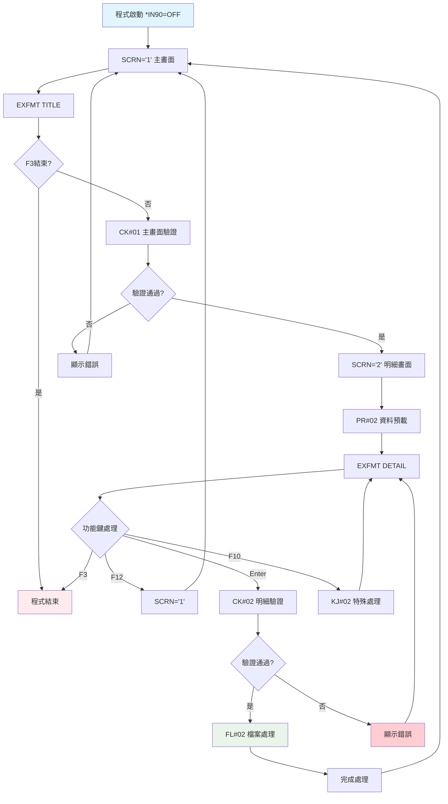
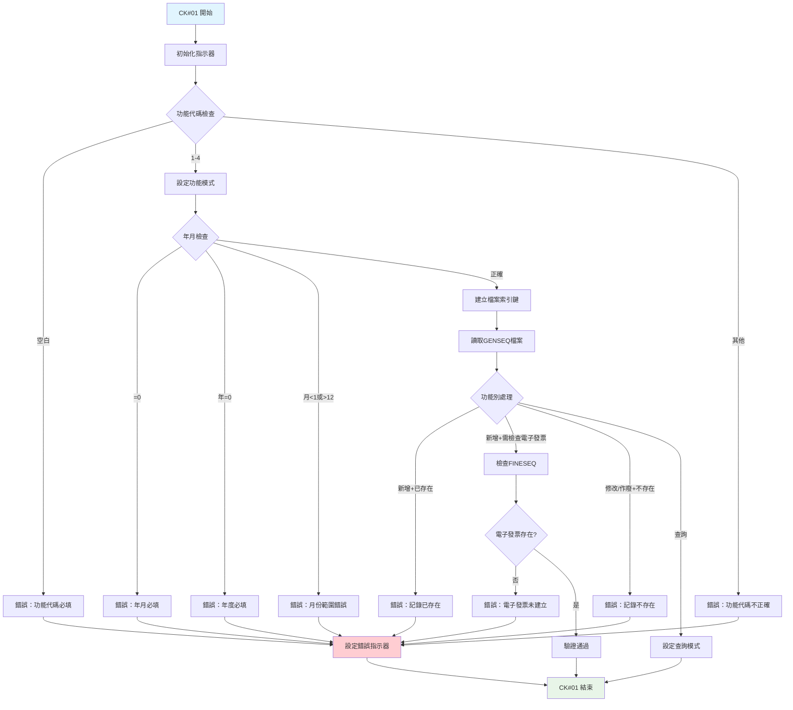
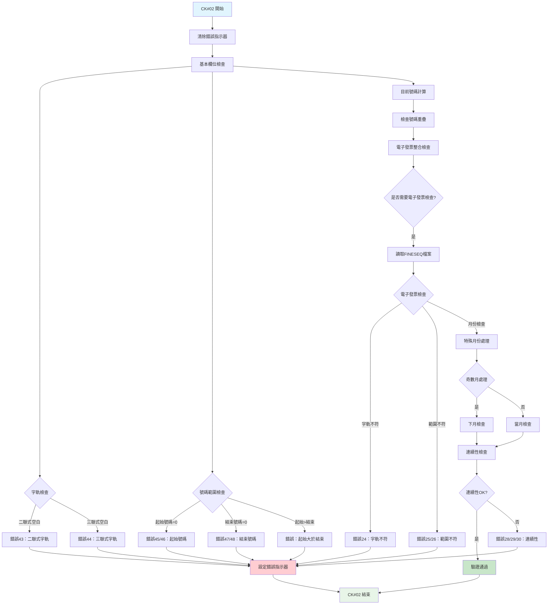
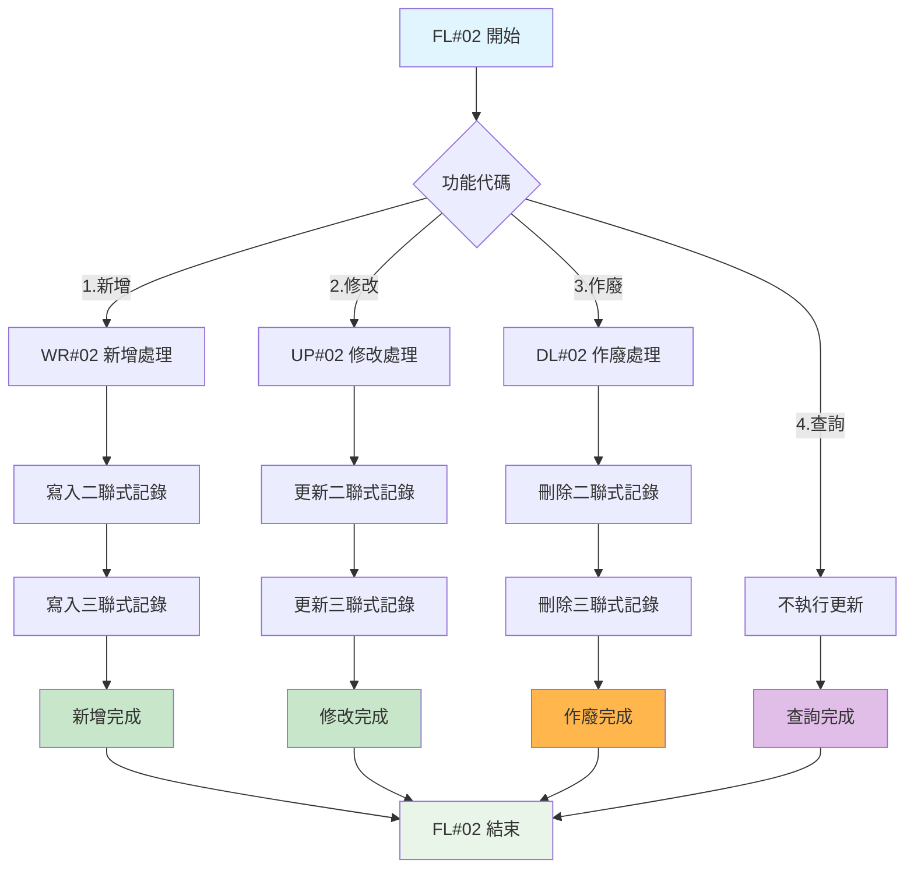

# ARE021R_K02 程式規格書

## 📋 基本資料

| 項目 | 內容 |
|------|------|
| **程式編號** | ARE021R |
| **程式名稱** | 發票號碼建立維護作業|
| **程式類型** | RPG/400 |
| **系統名稱** | 應收帳款管理系統 (AR) |
| **子系統** | 發票號碼序號管理子系統 |
| **廠區** | K02 |
| **開發人員** | S00WCJ |
| **建立日期** | 1987年代（歷史程式）|
| **最後修改** | 2018/12/20 (2018AR00039) |
| **程式路徑** | `K02RPGSRC_THSRC/ARE021R.txt` |

## 📖 程式功能說明

### 主要功能
ARE021R是**發票號碼序號管理系統的核心維護程式**，專門負責管理二聯式及三聯式發票號碼的分配與控制，主要功能包括：

1. **發票號碼序號建立**：新增年度月份的發票號碼起迄範圍
2. **發票號碼序號修改**：修改現有的發票號碼序號設定
3. **發票號碼序號作廢**：作廢不需要的發票號碼序號
4. **發票號碼序號查詢**：查詢現有的發票號碼序號設定
5. **電子發票整合檢查**：與電子發票系統的號碼範圍同步驗證
6. **雙重號碼管理**：同時管理二聯式和三聯式發票號碼

### 業務流程說明
此程式是**發票作業系統的基礎設定程式**，為發票建立作業提供必要的號碼範圍控制：
- **年月度設定**：按年月建立發票號碼使用範圍
- **雙軌並行管理**：二聯式和三聯式發票號碼獨立管理
- **連續性檢查**：確保發票號碼的連續性和不重複
- **電子發票對接**：與電子發票系統進行號碼範圍整合驗證
- **政府法規遵循**：符合台灣發票號碼管理法規要求

### 歷史修改記錄
- **2017/03/27 (2017AR1112)**：新增檢查年度發票號碼產生時是否已開立
- **2018/12/20 (2018AR00039)**：新增檢查發票號碼是否在年度發票號碼範圍內

## 🗂️ 檔案架構與關聯圖

### 使用檔案清單

| 檔案名稱 | 檔案類型 | 使用方式 | 說明 |
|---------|---------|---------|------|
| **ARE021S** | DSPF | 讀寫 | 發票號碼維護畫面檔案 |
| **GENSEQ** | PF | 讀寫更新 | 一般發票號碼序號主檔 |
| **FINESEQ** | PF | 讀取 | 電子發票號碼序號檔案 |

### 檔案關聯視覺化圖表



### 資料流向說明

1. **功能選擇階段**：使用者在TITLE畫面選擇操作功能（新增/修改/作廢/查詢）
2. **資料輸入階段**：在DETAIL畫面輸入年月及二聯式、三聯式發票號碼範圍
3. **驗證處理階段**：程式執行多層次的資料驗證
4. **電子發票檢查階段**：與FINESEQ檔案比對電子發票號碼範圍
5. **檔案更新階段**：更新GENSEQ檔案中的發票號碼序號記錄

## 📊 檔案欄位規格說明

### ARE021S 畫面檔案

#### TITLE 主畫面格式
```
┌─────────────────────────────────────────────────────────────────────────────┐
│ 12/26/24      東森鋼鐵股份有限公司                           ARE021S-1      │
│                     *** 發票號碼建立作業 ***                               │
│                                                           DEVNAME01         │
│                                                                             │
│               功能代碼：[_] (1:新增 2:修改                                  │
│                                                                             │
│                             3:作廢 4:查詢)                                  │
│                                                                             │
│                                                                             │
│                                                                             │
│               年月代碼：[______]                                            │
│                                                                             │
│                                                                             │
│                                                                             │
│                                                                             │
│                                                                             │
│                                                                             │
│                                                                             │
│                                                                             │
│                                                                             │
│                                                                             │
│ [錯誤訊息顯示區域]                                                          │
│ ENTER:確認     PF03:結束                                                   │
└─────────────────────────────────────────────────────────────────────────────┘
```

#### DETAIL 明細畫面格式
```
┌─────────────────────────────────────────────────────────────────────────────┐
│ 12/26/24      東森鋼鐵股份有限公司                           ARE021S-2      │
│ 新增          *** 發票號碼建立作業 ***                     DEVNAME01         │
│                                                                             │
│                                                                             │
│                 年月代碼：113012                                            │
│                                                                             │
│                                                                             │
│              二聯式                      三聯式                            │
│                                                                             │
│        字軌：[__]                       [__]                               │
│   檢查起始號碼：[________]               [________]                        │
│                                                                             │
│    起始號碼：[________]                  [________]                        │
│   檢查結束號碼：[________]               [________]                        │
│                                                                             │
│    結束號碼：[________]                  [________]                        │
│                                                                             │
│    目前號碼：[________]                  [________]                        │
│                                                                             │
│                                                                             │
│                                                                             │
│ [錯誤訊息顯示區域]                                                          │
│ ENTER:確認   PF03:結束   PF10:取消   PF12:回到前畫面                      │
└─────────────────────────────────────────────────────────────────────────────┘
```

### GENSEQ 發票序號主檔

| 欄位名稱 | 資料型態 | 長度 | 說明 | 特殊處理 |
|---------|---------|------|------|---------|
| **GEKIND** | CHAR | 2 | 序號類別：'01'=二聯式, '02'=三聯式 | 🎯關鍵欄位 |
| **GEPRIN** | CHAR | 10 | 序號主鍵：廠區+年月+群組 | 🔑主要索引 |
| **GEPRE** | CHAR | 2 | 發票字軌 | 📝必填欄位 |
| **GESTNO** | NUMERIC | 8,0 | 起始號碼 | 🎯範圍控制 |
| **GEENNO** | NUMERIC | 8,0 | 結束號碼 | 🎯範圍控制 |
| **GECUNO** | NUMERIC | 8,0 | 目前號碼 | 🔄動態更新 |

### FINESEQ 電子發票序號檔

| 欄位名稱 | 資料型態 | 長度 | 說明 | 特殊處理 |
|---------|---------|------|------|---------|
| **YY** | NUMERIC | 3,0 | 年度 | 🎯檢查關鍵 |
| **TXAR** | CHAR | 1 | 廠區代碼 | 🏭廠區識別 |
| **SQINTK** | CHAR | 2 | 發票種類 | 🔗對應字軌 |
| **SQINB1** | NUMERIC | 8,0 | 電子發票起始號碼 | ⚡電子發票範圍 |
| **SQINE1** | NUMERIC | 8,0 | 電子發票結束號碼 | ⚡電子發票範圍 |

### 欄位切割視覺化

```
GEPRIN 主鍵結構 (10位元)：
┌──┬──────┬──┐
│廠區│年月  │群組│
│1位│6位   │3位│
│K  │113012│   │
└──┴──────┴──┘

GEKIND + GEPRIN 完整索引：
┌────┬──┬──────┬──┐
│類別│廠區│年月  │群組│
│01/02│K │113012│   │
└────┴──┴──────┴──┘
```

## 🖥️ 輸出/入螢幕布局

### 畫面流程圖



### 功能鍵定義

#### TITLE 主畫面
| 功能鍵 | 說明 | 處理邏輯 |
|--------|------|---------|
| **Enter** | 確認功能代碼 | 執行輸入驗證，進入DETAIL畫面 |
| **F3** | 結束作業 | 結束程式執行 |

#### DETAIL 明細畫面
| 功能鍵 | 說明 | 處理邏輯 |
|--------|------|---------|
| **Enter** | 確認資料 | 執行完整驗證並更新檔案 |
| **F3** | 結束作業 | 結束程式執行 |
| **F10** | 取消 | 清除目前輸入，重新開始 |
| **F12** | 回到前畫面 | 回到TITLE主畫面 |

## ⚙️ 處理流程程序說明

### 🎯 主要程序流程

#### 程式主控迴圈


### 🎯 資料驗證流程 (CK#01 & CK#02)

#### CK#01 主畫面驗證


#### CK#02 明細驗證


### 🎯 檔案處理流程 (FL#02)

#### 檔案操作分派


### 🎯 電子發票整合機制

#### 電子發票號碼範圍檢查
此程式具備**創新的電子發票整合機制**，確保傳統發票與電子發票號碼範圍的一致性：

1. **雙軌號碼系統**：
   - 傳統發票號碼（GENSEQ）
   - 電子發票號碼（FINESEQ）

2. **同步檢查機制**：
   - 字軌必須一致（GEPRE = SQINTK）
   - 起始號碼同步驗證
   - 結束號碼範圍檢查
   - 連續性保證機制

3. **特殊月份處理**：
   - 奇數月（1,3,5,7,9,11）：檢查下月連續性
   - 偶數月：檢查當月一致性

4. **跨月連續性**：
   - 前月結束號碼+1 = 當月起始號碼
   - 確保全年度號碼無間隙

## 🔧 技術特點分析

### 程式設計特色

1. **🎯 雙軌發票號碼管理**
   - **二聯式與三聯式並行**：同時管理兩種發票類型的號碼序號
   - **統一介面操作**：單一畫面同時處理兩種發票號碼
   - **關聯性驗證**：確保二聯式與三聯式號碼的邏輯關係

2. **📊 政府法規完全遵循**
   - **台灣發票法規對應**：完全符合財政部發票號碼管理規定
   - **電子發票整合**：與電子發票系統無縫對接
   - **稽核軌跡完整**：提供完整的號碼分配與使用記錄

3. **🔍 高強度資料驗證**
   - **30種錯誤檢查**：涵蓋各種可能的輸入錯誤情況
   - **跨檔案驗證**：GENSEQ與FINESEQ雙重檢查
   - **連續性保證**：確保號碼分配的連續性與完整性

4. **🏭 多年份演進設計**
   - **2017年電子發票支援**：增加年度發票開立檢查
   - **2018年範圍管控**：強化發票號碼範圍驗證
   - **向下相容性**：保持與舊有系統的完全相容

### 錯誤處理機制

#### 完整錯誤訊息對照表 (30種錯誤類型)

| 錯誤編號 | 錯誤訊息 | 觸發條件 | 處理建議 |
|---------|---------|---------|---------|
| **ERR,1** | 功能代碼輸入錯誤 | 功能代碼空白 | 輸入1-4功能代碼 |
| **ERR,2** | 功能代碼輸入錯誤,請重新輸入 | 功能代碼非1-4 | 重新選擇正確功能 |
| **ERR,3** | 年月必須輸入 | YYMM=0 | 輸入正確年月 |
| **ERR,4** | 年度錯誤 | YY=0 | 輸入正確年度 |
| **ERR,5** | 月份錯誤 | MM<1或>12 | 輸入1-12月份 |
| **ERR,6** | 資料已建立發票號碼,請重新選擇 | 新增時記錄已存在 | 選擇修改功能 |
| **ERR,7** | 資料尚未建立發票號碼 | 修改/作廢時記錄不存在 | 先新增記錄 |
| **ERR,8** | 二聯式發票字軌請輸入填寫 | PRE2空白 | 輸入二聯式字軌 |
| **ERR,9** | 三聯式發票字軌請輸入填寫 | PRE3空白 | 輸入三聯式字軌 |
| **ERR,10** | 二聯式發票起始號碼請輸入填寫 | SNO2=0 | 輸入起始號碼 |
| **ERR,11** | 三聯式發票起始號碼請輸入填寫 | SNO3=0 | 輸入起始號碼 |
| **ERR,12** | 二聯式發票結束號碼請輸入填寫 | ENO2=0 | 輸入結束號碼 |
| **ERR,13** | 三聯式發票結束號碼請輸入填寫 | ENO3=0 | 輸入結束號碼 |
| **ERR,14** | 二聯式發票起始號碼請小於結束號碼 | SNO2>ENO2 | 調整號碼範圍 |
| **ERR,15** | 三聯式發票起始號碼請小於結束號碼 | SNO3>ENO3 | 調整號碼範圍 |
| **ERR,16** | 資料無法作廢發票號碼已開立發票,請重新 | 作廢時號碼已使用 | 無法作廢 |
| **ERR,17** | 二聯式發票結束號碼請小於目前號碼 | ENO2<CNO2 | 調整結束號碼 |
| **ERR,18** | 三聯式發票結束號碼請小於目前號碼 | ENO3<CNO3 | 調整結束號碼 |
| **ERR,19-22** | 檢查起始/結束號碼與輸入不符 | 檢查欄位不符 | 確認檢查號碼 |
| **ERR,23** | 尚未建立年度電子發票號碼序號 | FINESEQ記錄不存在 | 先建立電子發票 |
| **ERR,24** | 字軌與年度電子發票序號不符 | 字軌不一致 | 確認字軌設定 |
| **ERR,25** | 發票號碼與年度電子發票序號起始不一致 | 起始號碼不符 | 調整起始號碼 |
| **ERR,26** | 發票號碼超過年度電子發票序號範圍 | 超出電子發票範圍 | 調整號碼範圍 |
| **ERR,27** | 年度電子發票序號未建立 | 當月電子發票未建 | 建立電子發票序號 |
| **ERR,28** | 發票號碼與年度電子發票序號連續性錯誤 | 連續性檢查失敗 | 調整連續性 |
| **ERR,29-30** | 各種連續性檢查錯誤 | 號碼連續性問題 | 重新規劃號碼 |

### 跨廠區一致性分析

所有廠區（H05、K02、P02、U01）的ARE021R程式完全相同：
- **程式碼一致性**：507行程式碼完全相同
- **功能完全統一**：所有功能、驗證邏輯完全一致
- **錯誤處理統一**：30種錯誤訊息完全相同
- **電子發票整合統一**：所有廠區使用相同的電子發票檢查機制

## 📝 重要商業邏輯摘要

### 核心業務規則

1. **發票號碼唯一性**：每個年月的發票號碼序號必須唯一，不可重複建立
2. **雙軌並行管理**：二聯式和三聯式發票號碼獨立管理，但需要協調一致
3. **連續性保證**：發票號碼必須連續分配，不可有間隙
4. **電子發票同步**：傳統發票號碼必須與電子發票號碼範圍同步
5. **政府法規遵循**：所有號碼分配必須符合台灣財政部相關規定

### 關鍵業務流程

1. **年月度準備作業**：
   - 每月月初需建立當月發票號碼範圍
   - 必須先建立電子發票序號再建立傳統發票序號
   - 需考慮跨月號碼連續性

2. **號碼範圍規劃**：
   - 起始號碼通常為前月結束號碼+1
   - 結束號碼需預估當月發票開立量
   - 二聯式與三聯式號碼範圍需分別規劃

3. **電子發票整合**：
   - 字軌必須與電子發票系統一致
   - 號碼範圍必須在電子發票核准範圍內
   - 奇數月需特別檢查下月連續性

4. **稽核與管控**：
   - 已開立發票的號碼範圍不可作廢
   - 號碼範圍縮小時不可小於目前使用號碼
   - 所有異動均有完整記錄

### 系統整合要點

1. **與ARE001系列整合**：提供發票建立作業所需的號碼範圍
2. **與電子發票系統整合**：確保號碼分配的合規性
3. **與財務系統整合**：支援發票相關的財務作業流程
4. **與稽核系統整合**：提供完整的號碼分配軌跡

此程式是**台灣發票管理法規遵循的核心系統**，體現了複雜商業法規在資訊系統中的完美實現，是企業級法規遵循系統的典型範例。 