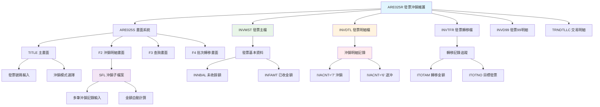
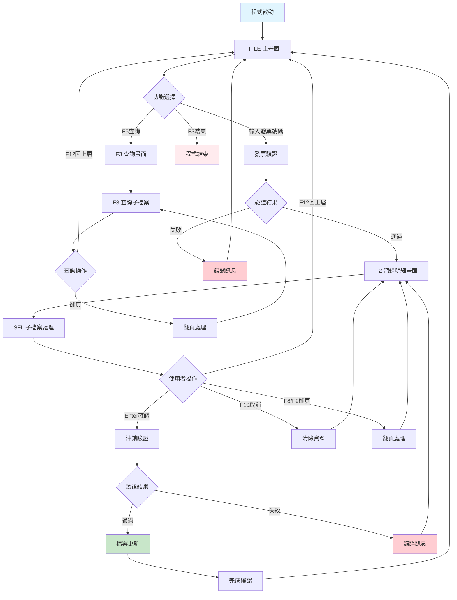
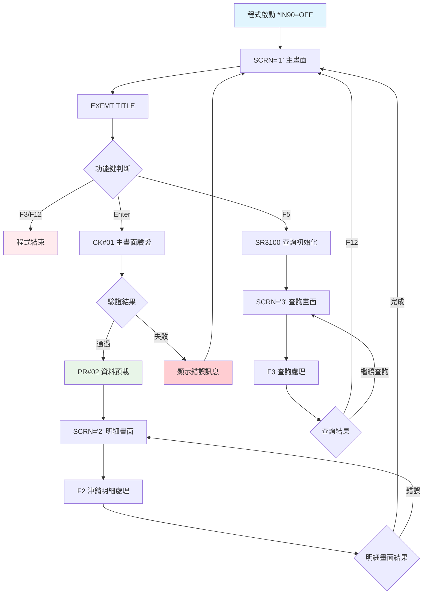
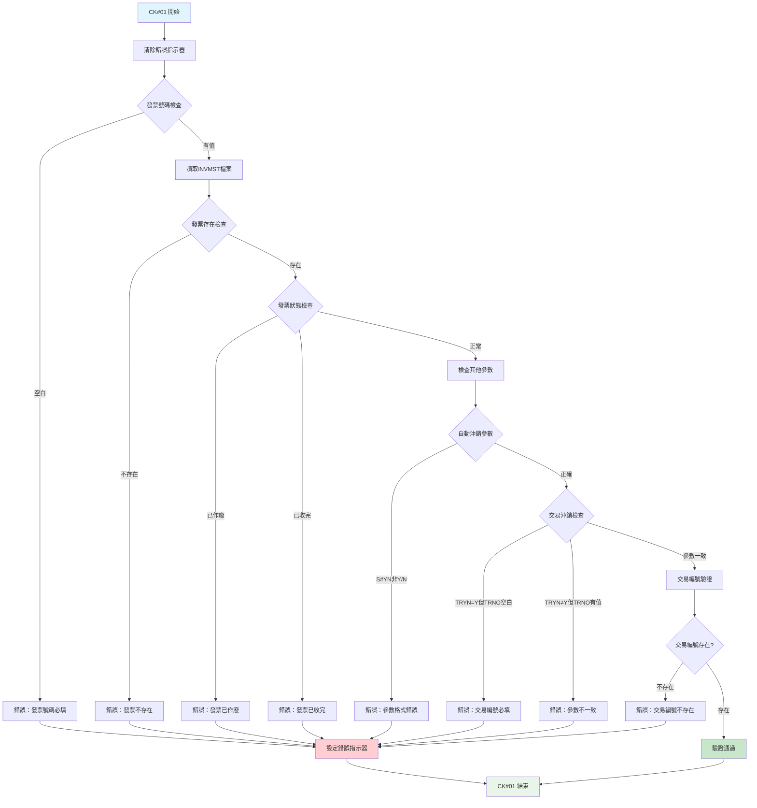
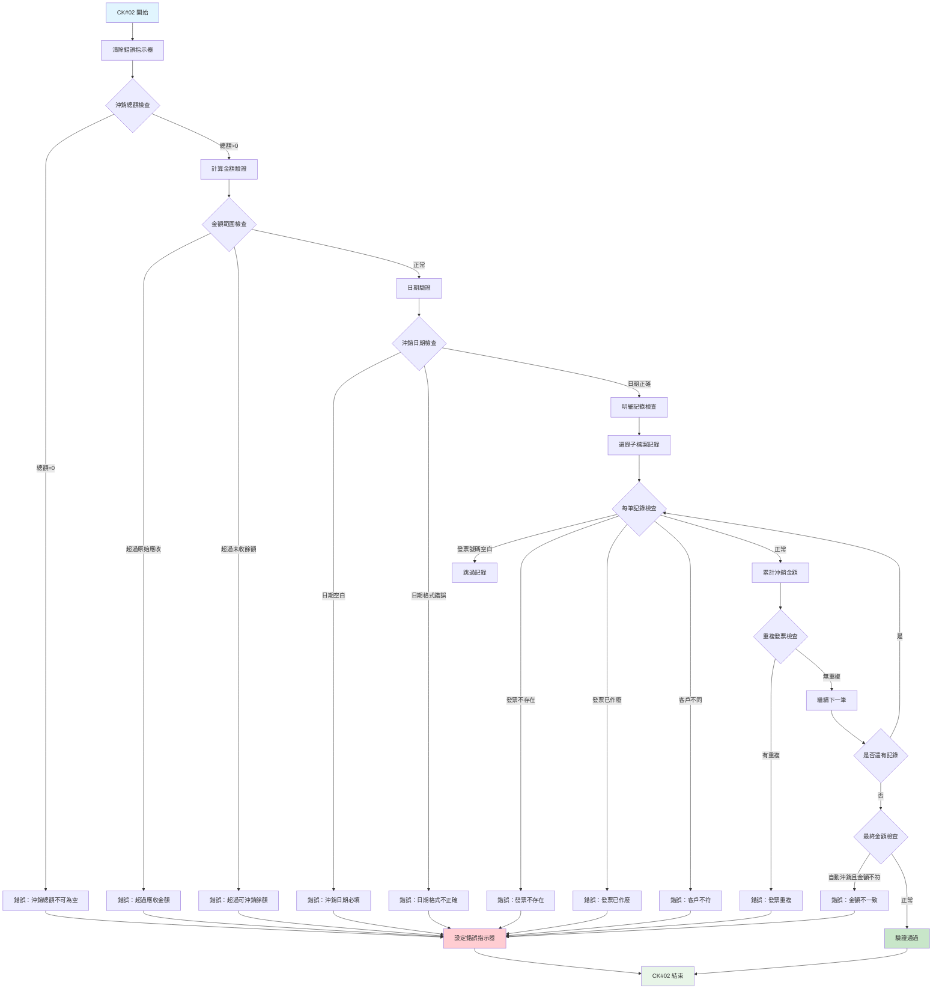
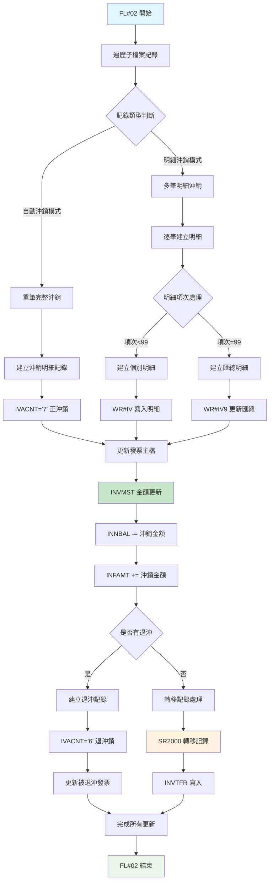
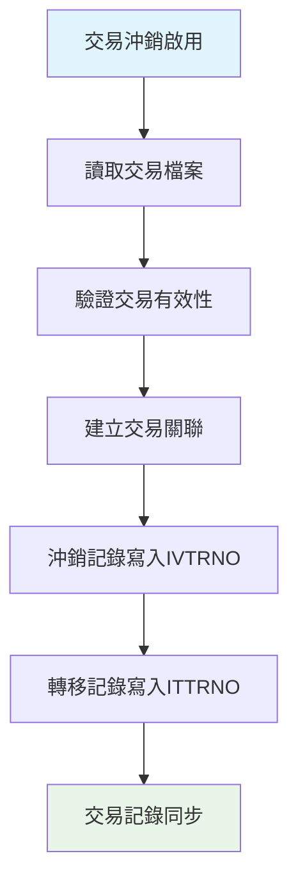

# ARE025R_U01 程式規格書

## 📋 基本資料

| 項目 | 內容 |
|------|------|
| **程式編號** | ARE025R |
| **程式名稱** | 發票沖銷維護作業|
| **程式類型** | RPG/400 |
| **系統名稱** | 應收帳款管理系統 (AR) |
| **子系統** | 發票沖銷管理子系統 |
| **廠區** | U01 |
| **開發人員** | S00WCJ |
| **建立日期** | 1980年代（歷史程式）|
| **最後修改** | 2023/11/02 (2023AR00046) |
| **程式路徑** | `U01RPGSRC_THSRC/ARE025R.txt` |

## 📖 程式功能說明

### 主要功能
ARE025R是**發票沖銷維護作業的核心程式**，專門負責處理應收帳款發票的沖銷作業，主要功能包括：

1. **發票沖銷處理**：將已收到的帳款與相關發票進行沖銷配對
2. **多種沖銷模式**：支援完全沖銷和部分沖銷處理
3. **沖銷記錄查詢**：查詢已執行的沖銷記錄和明細
4. **發票餘額管理**：動態維護發票未收餘額
5. **沖銷轉移作業**：支援沖銷記錄的轉移處理
6. **交易記錄整合**：與交易明細檔案同步記錄

### 業務流程說明
此程式是**應收帳款管理的核心業務程式**，處理企業日常的收款沖銷作業：
- **收款確認**：確認客戶付款並與對應發票沖銷
- **餘額控制**：確保沖銷金額不超過發票未收餘額
- **帳務整合**：自動更新發票主檔和交易明細記錄
- **追溯查詢**：提供完整的沖銷歷史記錄查詢
- **轉移處理**：支援沖銷記錄在不同發票間的轉移

### 歷史修改記錄
- **1999/10/26 (2010AR517)**：基礎版本建立
- **2003/04/22 (2014AR822)**：新增ARE059R程式呼叫，自動產生發票號碼
- **2004/05/07**：DTAARA位置調整，從401改為391
- **2007/12/24 (2018AR00042)**：新增重複沖銷檢查機制
- **2009/08/03**：修正多張發票重複輸入的BUG
- **2023/11/02 (2023AR00046)**：新增發票輸入時相同客戶檢查確認

## 🗂️ 檔案架構與關聯圖

### 使用檔案清單

| 檔案名稱 | 檔案類型 | 使用方式 | 說明 |
|---------|---------|---------|------|
| **ARE025S** | DSPF | 讀寫 | 發票沖銷維護畫面檔案 |
| **INVMST** | PF | 讀寫更新 | 發票主檔 |
| **INVMSTL5** | LF | 讀取 | 發票主檔邏輯檔案5 |
| **INVMSTL6** | LF | 讀取 | 發票主檔邏輯檔案6 |
| **INVDTL** | PF | 讀寫更新 | 發票明細檔 |
| **INVD99** | PF | 寫入 | 發票99明細檔 |
| **INVTFR** | PF | 讀寫 | 發票轉移檔 |
| **TRNDTLLC** | PF | 讀取 | 交易明細檔案 |

### 檔案關聯視覺化圖表



### 資料流向說明

1. **沖銷輸入階段**：使用者在主畫面輸入待沖銷發票號碼
2. **發票驗證階段**：檢查發票存在性、作廢狀態、餘額狀況
3. **沖銷明細處理**：進入子檔案畫面輸入多筆沖銷明細
4. **金額驗證階段**：檢查沖銷總額是否超過發票餘額
5. **檔案更新階段**：同步更新INVMST、INVDTL、INVTFR檔案

## 📊 檔案欄位規格說明

### ARE025S 畫面檔案

#### TITLE 主畫面格式
```
┌─────────────────────────────────────────────────────────────────────────────┐
│ 12/26/24      東森鋼鐵股份有限公司                           ARE025S-1      │
│                     *** 發票沖銷維護作業 ***                               │
│                                                           DEVNAME01         │
│                                                                             │
│                發票號碼：[__________]                                       │
│                                                                             │
│            是否自動沖銷：[_] (Y/N)                                          │
│                                                                             │
│            是否交易沖銷：[_] (Y/N)                                          │
│                                                                             │
│                交易編號：[________]                                         │
│                                                                             │
│                                                                             │
│                                                                             │
│                                                                             │
│                                                                             │
│                                                                             │
│                                                                             │
│                                                                             │
│                                                                             │
│ [錯誤訊息顯示區域]                                                          │
│ ENTER:確認   PF03:結束   PF05:查詢沖銷明細                                │
└─────────────────────────────────────────────────────────────────────────────┘
```

#### F2 沖銷明細畫面格式
```
┌─────────────────────────────────────────────────────────────────────────────┐
│ 12/26/24      東森鋼鐵股份有限公司                           ARE025S-2      │
│ 發票：IV113120001  客戶：東鋼公司        餘額：125,000                     │
│                                                           DEVNAME01         │
│                                                                             │
│   項次   沖銷發票號碼   沖銷金額    目標訂單    餘額                        │
│    01   [__________]   [________]   [______]   [________]                  │
│    02   [__________]   [________]   [______]   [________]                  │
│    03   [__________]   [________]   [______]   [________]                  │
│    ...                                                                     │
│                                                                             │
│                                                                             │
│                                   沖銷日期：[________]                     │
│                                                                             │
│                                   總沉銷額：125,000                       │
│                                                                             │
│                                                                             │
│                                                                             │
│                                                                             │
│ [錯誤訊息顯示區域]                                                          │
│ ENTER:確認   PF03:結束   PF10:取消   PF12:回上層                          │
└─────────────────────────────────────────────────────────────────────────────┘
```

### INVMST 發票主檔

| 欄位名稱 | 資料型態 | 長度 | 說明 | 特殊處理 |
|---------|---------|------|------|---------|
| **INNO** | CHAR | 10 | 發票號碼 | 🔑主要索引 |
| **INCUNO** | CHAR | 5 | 客戶編號 | 🏢客戶識別 |
| **INCUNM** | CHAR | 24 | 客戶名稱 | 📝客戶名稱 |
| **INORNO** | CHAR | 6 | 訂單號碼 | 🎯關聯訂單 |
| **INAAMT** | NUMERIC | 11,2 | 應收金額 | 💰原始金額 |
| **INATAX** | NUMERIC | 9,2 | 應收稅額 | 💰稅額 |
| **INNBAL** | NUMERIC | 11,2 | 未收餘額 | 🔄動態更新 |
| **INEAMT** | NUMERIC | 11,2 | 已收金額 | 🔄累計金額 |
| **INDECD** | CHAR | 1 | 作廢代碼 | ⚠️狀態控制 |
| **INFLAG** | CHAR | 1 | 處理標誌 | 🎯處理狀態 |

### INVDTL 發票明細檔

| 欄位名稱 | 資料型態 | 長度 | 說明 | 特殊處理 |
|---------|---------|------|------|---------|
| **IVNO** | CHAR | 10 | 發票號碼 | 🔑主要索引 |
| **IVACNT** | CHAR | 1 | 帳戶代碼 | 🎯功能區分 |
| **IVITEM** | NUMERIC | 2,0 | 項次 | 📝序號 |
| **IVAMT** | NUMERIC | 11,2 | 沖銷金額 | 💰金額 |
| **IVACDT** | NUMERIC | 8,0 | 沖銷日期 | 📅處理日期 |
| **IVORNO** | CHAR | 6 | 訂單號碼 | 🎯關聯訂單 |
| **IVFLAG** | CHAR | 1 | 處理標誌 | 🎯狀態控制 |
| **IVTRNO** | CHAR | 8 | 交易編號 | 🔗交易追蹤 |

### INVTFR 發票轉移檔

| 欄位名稱 | 資料型態 | 長度 | 說明 | 特殊處理 |
|---------|---------|------|------|---------|
| **ITINNO** | CHAR | 10 | 來源發票號碼 | 🔑主要索引 |
| **ITACIT** | NUMERIC | 4,0 | 轉移項次 | 📝序號 |
| **ITOTAM** | NUMERIC | 11,2 | 轉移金額 | 💰轉移金額 |
| **ITOTNO** | CHAR | 10 | 目標發票號碼 | 🎯目標發票 |
| **ITFLAG** | CHAR | 1 | 處理標誌 | 🎯狀態控制 |
| **ITTRNO** | CHAR | 8 | 交易編號 | 🔗交易追蹤 |

### 欄位切割視覺化

```
IVACNT 帳戶代碼功能區分：
┌─────────────────────────────────────────┐
│ '6' = 退沖記錄 (金額為負值)              │
│ '7' = 沖銷記錄 (金額為正值)              │
│ '9' = 特殊處理記錄                      │
└─────────────────────────────────────────┘

沖銷流程金額變化：
原始發票餘額：100,000
─ 沖銷 30,000 (IVACNT='7') → 餘額：70,000
─ 沖銷 20,000 (IVACNT='7') → 餘額：50,000
─ 退沖 10,000 (IVACNT='6') → 餘額：60,000
```

## 🖥️ 輸出/入螢幕布局

### 畫面流程圖



### 功能鍵定義

#### TITLE 主畫面
| 功能鍵 | 說明 | 處理邏輯 |
|--------|------|---------|
| **Enter** | 確認發票號碼 | 執行發票驗證，進入沖銷明細畫面 |
| **F3** | 結束作業 | 結束程式執行 |
| **F5** | 查詢沖銷明細 | 進入查詢畫面 |

#### F2 沖銷明細畫面
| 功能鍵 | 說明 | 處理邏輯 |
|--------|------|---------|
| **Enter** | 確認沖銷 | 執行沖銷驗證並更新檔案 |
| **F3** | 結束作業 | 結束程式執行 |
| **F10** | 取消 | 清除目前輸入，重新開始 |
| **F12** | 回到上層 | 回到TITLE主畫面 |
| **F8/F9** | 翻頁 | 上下翻頁瀏覽子檔案 |

#### F3 查詢畫面
| 功能鍵 | 說明 | 處理邏輯 |
|--------|------|---------|
| **F3** | 結束查詢 | 結束程式執行 |
| **F12** | 回到上層 | 回到TITLE主畫面 |

## ⚙️ 處理流程程序說明

### 🎯 主要程序流程

#### 程式主控迴圈


### 🎯 沖銷驗證流程 (CK#01 & CK#02)

#### CK#01 主畫面驗證


#### CK#02 沖銷明細驗證


### 🎯 檔案更新流程 (FL#02)

#### 沖銷記錄更新處理


### 🎯 特殊功能處理

#### 批次轉移功能 (F4畫面)
U01版本獨有的**批次轉移功能**，允許將多筆沖銷記錄批次轉移：

1. **批次選擇機制**：透過子檔案勾選多筆記錄
2. **轉移驗證**：檢查轉移金額和目標發票
3. **批次更新**：一次性處理多筆轉移作業
4. **記錄追蹤**：完整記錄轉移軌跡

#### 交易整合機制


## 🔧 技術特點分析

### 程式設計特色

1. **🎯 多模式沖銷架構**
   - **自動沖銷模式**：單一發票完整沖銷處理
   - **明細沖銷模式**：多筆發票部分沖銷處理
   - **批次轉移模式**：沖銷記錄批次轉移處理

2. **📊 完整的金額控制機制**
   - **餘額驗證**：確保沖銷金額不超過未收餘額
   - **累計金額追蹤**：動態維護已收和未收金額
   - **重複檢查**：防止同一發票重複沖銷
   - **交叉驗證**：原始應收與沖銷總額的多重檢查

3. **🔍 高度彈性的子檔案設計**
   - **150筆明細容量**：支援大量沖銷明細輸入
   - **動態項次管理**：自動分配明細項次編號
   - **智能匯總機制**：項次99作為匯總記錄
   - **互動式操作**：即時金額計算和餘額顯示

4. **🏭 跨廠區版本差異化**
   - **U01完整版**：1084行，包含完整功能和批次轉移
   - **H05簡化版**：505行，基本沖銷功能
   - **版本演進**：從基礎版本逐步擴展功能

### 錯誤處理機制

#### 完整錯誤訊息對照表 (29種錯誤類型)

| 錯誤編號 | 錯誤訊息 | 觸發條件 | 處理建議 |
|---------|---------|---------|---------|
| **ERR,1** | 請輸入發票號碼輸入錯誤 | 發票號碼空白 | 輸入正確發票號碼 |
| **ERR,2** | 請輸入發票號碼不存在 | 發票記錄不存在 | 確認發票號碼正確性 |
| **ERR,3** | 請留意發票已作廢，請查看 | 發票已作廢 | 選擇正常發票 |
| **ERR,5** | 請留意發票金額已收完，請查看 | 發票已收完 | 檢查發票狀態 |
| **ERR,6** | 請確認是否要進行自動沖銷 | 自動沖銷確認 | 確認沖銷參數 |
| **ERR,7** | 沖銷總額請勿空白 | 沖銷總額為0 | 輸入沖銷金額 |
| **ERR,8** | 沖銷總額請勿大於原始應收總額 | 超過應收金額 | 調整沖銷金額 |
| **ERR,9** | 輸入發票號碼不存在 | 沖銷明細發票不存在 | 確認發票號碼 |
| **ERR,10** | 輸入發票號碼已作廢，請查看 | 沖銷明細發票已作廢 | 選擇正常發票 |
| **ERR,11** | 輸入發票號碼餘額小於沖銷金額 | 超過可沖銷餘額 | 調整沖銷金額 |
| **ERR,12** | 沖銷日期請勿空白 | 沖銷日期未填 | 輸入沖銷日期 |
| **ERR,13** | 沖銷日期輸入錯誤 | 日期格式錯誤 | 輸入正確日期格式 |
| **ERR,15** | 沖銷總額請勿大於可沖銷餘額 | 超過發票餘額 | 調整沖銷金額 |
| **ERR,16** | 尚無資料存在 | 查詢無結果 | 確認查詢條件 |
| **ERR,17** | 明細已超過最大項次 | 超過150筆限制 | 分批處理 |
| **ERR,18** | 已成功沖銷，共計：XX筆 | 批次處理完成訊息 | 完成確認 |
| **ERR,19** | 輸入發票金額請勿空白 | 沖銷金額空白 | 輸入金額 |
| **ERR,20** | 發票號碼重複 | 重複沖銷檢查 | 移除重複項目 |
| **ERR,21** | 請留意自動和手動沖銷總額不符 | 金額不一致 | 調整沖銷金額 |
| **ERR,22** | 功能選項輸入錯誤，請查看 | 參數格式錯誤 | 輸入Y或N |
| **ERR,23** | 輸入發票時請勿重複輸入 | 明細重複 | 移除重複發票 |
| **ERR,24** | 請輸入交易編號應填寫!! | 交易編號必填 | 輸入交易編號 |
| **ERR,25** | 請輸入交易編號應留空!! | 交易參數不一致 | 清空交易編號 |
| **ERR,26** | 請輸入交易編號不存在!! | 交易記錄不存在 | 確認交易編號 |
| **ERR,27** | 請輸入交易檔案資料確認，請查看!! | 交易檔案錯誤 | 檢查交易資料 |
| **ERR,28** | 請輸入交易檔案確認，請查看!! | 交易驗證失敗 | 確認交易內容 |
| **ERR,29** | 請輸入發票輸入時客戶編號相同，請確認!! | 客戶不一致 | 確認客戶編號 |

### 跨廠區功能差異分析

| 功能特性 | U01 (1084行) | H05 (505行) | 差異說明 |
|---------|-------------|-------------|---------|
| **基礎沖銷功能** | ✅ | ✅ | 完全相同 |
| **子檔案容量** | 150筆 | 基本容量 | U01支援更多明細 |
| **批次轉移功能** | ✅ | ❌ | U01獨有F4批次轉移 |
| **交易整合** | ✅完整 | ✅基本 | U01有更完整交易支援 |
| **錯誤檢查** | 29種 | 15種 | U01有更詳細錯誤處理 |
| **歷史查詢** | ✅完整 | ✅基本 | U01有增強查詢功能 |
| **版本演進** | 2023年最新 | 1999年版本 | U01持續更新 |

## 📝 重要商業邏輯摘要

### 核心業務規則

1. **沖銷金額控制**：沖銷總額不可超過發票未收餘額
2. **發票狀態檢查**：只能沖銷未作廢且有餘額的發票
3. **客戶一致性**：同一筆沖銷中所有發票必須屬於同一客戶
4. **重複防護**：防止同一發票在同一次作業中重複沖銷
5. **交易追蹤**：所有沖銷記錄均可追溯到原始交易

### 關鍵業務流程

1. **標準沖銷流程**：
   - 輸入待沖銷發票號碼
   - 系統驗證發票狀態和餘額
   - 輸入沖銷明細（單筆或多筆）
   - 系統執行金額驗證
   - 更新相關檔案記錄

2. **自動沖銷處理**：
   - 系統自動計算可沖銷金額
   - 自動分配到發票未收餘額
   - 自動建立沖銷明細記錄
   - 適用於完整收款情況

3. **批次轉移作業**（U01獨有）：
   - 選擇多筆沖銷記錄
   - 批次驗證轉移條件
   - 一次性執行轉移更新
   - 生成轉移軌跡記錄

4. **交易整合機制**：
   - 與外部交易系統對接
   - 沖銷記錄關聯交易編號
   - 支援交易驅動的自動沖銷
   - 提供完整的交易追蹤

### 系統整合要點

1. **與ARE001系列整合**：提供發票建立後的後續沖銷處理
2. **與財務系統整合**：自動更新應收帳款餘額和收款記錄
3. **與交易系統整合**：支援交易驅動的自動沖銷機制
4. **與客戶管理整合**：維護客戶應收帳款狀況

### U01版本特殊價值

1. **批次處理能力**：支援大量沖銷記錄的批次轉移
2. **完整功能覆蓋**：包含所有可能的沖銷業務情境
3. **持續演進優化**：2023年仍在持續功能增強
4. **企業級穩定性**：經過多年實際使用驗證

此程式體現了**「業務需求驅動技術演進」**的設計理念，從基礎的發票沖銷功能逐步發展為功能完備的應收帳款管理平台，是企業級應收帳款系統的核心組件。 