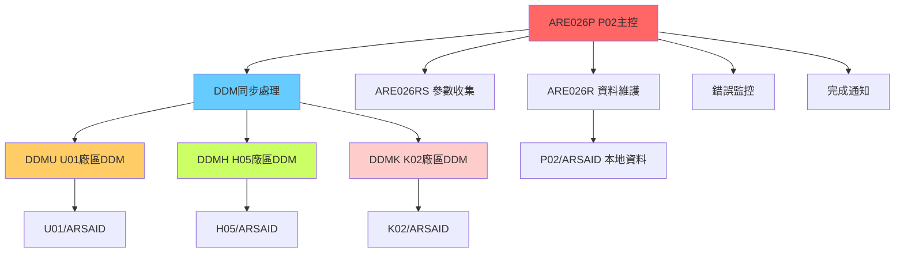
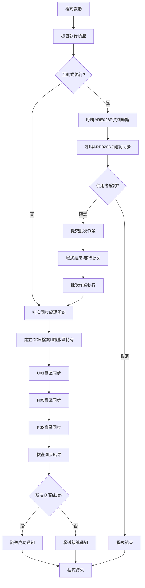

# ARE026P_P02 程式規格書

## 1. 基本資料

| 項目 | 內容 |
|------|------|
| **程式編號** | ARE026P |
| **程式名稱** | 營業員基本資料跨廠區同步主控程式 |
| **程式類型** | CLP (Control Language Program) |
| **廠區** | P02 |
| **系統名稱** | 應收帳款管理系統 (AR) |
| **子系統** | 營業員資料同步處理 (跨廠區) |
| **作者** | S02CLJ |
| **建立日期** | 1986/12/12 |
| **檔案位置** | P02CLSRC_THSRC/ARE026P.txt |

### 修改記錄
| 日期 | 版本 | 修改者 | 修改內容 |
|------|------|--------|----------|
| 1986/12/12 | 初版 | S02CLJ | 建立營業員基本資料跨廠區同步系統 |
| 1998/12/28 | 9812A | S00WCJ | 新增U01廠區同步支援 |
| 2003/03/17 | 0303A | S00WCJ | 移除T03廠區支援 |
| 2011/12/08 | 1112A | S00WCJ | 修改檔案複製參數，新增*MAP *DROP |
| 2012/02/03 | 1203A | S00WCJ | 新增大陸廠區支援 |
| 2013/10/28 | 1310A | S00WCJ | 移除大陸廠區支援 |

## 2. 程式功能說明

### 主要功能
ARE026P是應收帳款管理系統中的核心跨廠區資料同步程式，P02廠區版本負責將營業員基本資料同步至多個廠區：

1. **互動式資料維護**：提供營業員基本資料的輸入與查詢功能
2. **🎯 跨廠區資料同步**：自動將資料同步至U01、H05、K02等廠區
3. **DDM技術應用**：使用分散式資料管理技術進行跨系統資料複製
4. **雙模式處理**：支援互動式維護和批次同步處理
5. **錯誤處理機制**：完整的同步狀態監控與錯誤通知
6. **批次作業管理**：自動提交批次作業進行背景同步處理

### 業務流程說明
此程式是企業跨廠區營業員資料管理的核心系統，確保各廠區營業員資料的一致性：

```
資料維護 → 互動確認 → 批次提交 → DDM同步 → 多廠區更新 → 完成通知
```

### 🎯 系統特色
- **分散式資料管理**：使用DDM技術實現跨廠區即時同步
- **容錯機制**：完整的錯誤處理與重試機制
- **多廠區支援**：支援U01、H05、K02等多個廠區同步
- **狀態追蹤**：詳細的同步狀態監控與報告

## 3. 檔案架構與關聯圖

### 跨廠區同步架構圖


### 檔案使用清單
| 檔案名稱 | 使用方式 | 說明 | 跨廠區功能 |
|----------|----------|------|------------|
| **主要檔案** |
| ARSAID | UPDATE | 營業員基本資料主檔 | 同步來源檔案 |
| ARE026R | CALL | 營業員資料維護程式 | 互動式維護 |
| ARE026RS | CALL | 參數收集程式 | 使用者確認 |
| **DDM檔案** |
| QTEMP/DDMU | DDM | U01廠區DDM檔案 | 新竹廠區同步 |
| QTEMP/DDMH | DDM | H05廠區DDM檔案 | 高雄廠區同步 |
| QTEMP/DDMK | DDM | K02廠區DDM檔案 | 高雄二廠同步 |
| **DDM模板** |
| U01DDM | TEMPLATE | U01廠區DDM模板 | DDM檔案建立 |
| MLDDM | TEMPLATE | H05廠區DDM模板 | DDM檔案建立 |
| KSDDM | TEMPLATE | K02廠區DDM模板 | DDM檔案建立 |

### 資料流向說明
1. **輸入流**：使用者操作 → 本地資料維護 → 確認同步
2. **同步流**：本地ARSAID → DDM複製 → 各廠區ARSAID更新
3. **監控流**：同步狀態檢查 → 錯誤記錄 → 使用者通知

## 4. 檔案欄位規格說明

### 🎯 主要資料結構

#### ARSAID (營業員基本資料) 欄位分析

##### ARSAID核心欄位切割視覺化：
```
ARSAID記錄：[FLAG|RVID|NAME_______|LOCA|LONM__|WKNO|DEPT|DENM______________|USID______|...]
位置:        001  002   003-12      013  014-19 020  024  025-38          039-48    049-
             ↓    ↓     ↓           ↓    ↓      ↓    ↓    ↓               ↓         ↓
處理旗標:   [F]                                                                     處理狀態標記
營業員ID:    [RV]                                                                   2位營業員編號
姓名:         [NAME_______]                                                        10位姓名
工作廠區:              [L]                                                          1位廠區代號
廠區名稱:               [LONM__]                                                    6位廠區名稱
工作編號:                      [WK]                                                 4位工作編號
部門代號:                        [DE]                                               4位部門代號
部門名稱:                          [DENM______________]                             14位部門名稱
使用者ID:                                            [USID______]                 10位使用者識別
```

### 🎯 跨廠區同步欄位技術詳解

#### DDM檔案命名規則分析

##### DDM檔案對應表：
```
廠區代號 → DDM模板 → 臨時檔案 → 目標檔案
U01     → U01DDM  → DDMU     → U01/ARSAID
H05     → MLDDM   → DDMH     → H05/ARSAID  
K02     → KSDDM   → DDMK     → K02/ARSAID
```

#### FLAG1同步狀態追蹤欄位

##### FLAG1狀態切割視覺化：
```
FLAG1 (4字元)：[U|H|K|N]
               ↓ ↓ ↓ ↓
位置1：        [U]        U01廠區同步狀態 (' '=成功, 'X'=失敗)
位置2：         [H]       H05廠區同步狀態 (' '=成功, 'X'=失敗)  
位置3：          [K]      K02廠區同步狀態 (' '=成功, 'X'=失敗)
位置4：           [N]     大陸廠區狀態(已停用) (' '=成功, 'X'=失敗)
```

### 🎯 欄位挪用分析

#### 營業員編號(RVID)的雙重功能
- **原始設計**：營業員識別編號
- **業務挪用**：
  - 作為跨廠區同步的主鍵
  - 用於各廠區資料關聯
  - **挪用原因**：確保跨廠區資料一致性
  - **業務邏輯**：統一的營業員識別體系

#### 廠區代號(LOCA)的多重用途
- **原始設計**：工作廠區識別
- **技術挪用**：
  - DDM同步時的廠區篩選依據
  - 同步目標判斷標準
  - **挪用優勢**：自動化的同步範圍控制

#### 同步狀態標記的創新設計
- **技術創新**：使用FLAG1的4個位元分別追蹤4個廠區的同步狀態
- **狀態意義**：
  - 'X'：初始狀態，待同步
  - ' '：同步成功
  - **監控機制**：透過狀態檢查判斷同步結果

### 欄位定義表格
| 欄位名稱 | 類型 | 長度 | 說明 | 跨廠區功能 | 挪用情況 |
|----------|------|------|------|------------|----------|
| RVID | CHAR | 2 | 營業員編號 | 同步主鍵 | 跨廠區識別 |
| NAME | CHAR | 10 | 營業員姓名 | 同步內容 | 標準使用 |
| LOCA | CHAR | 1 | 工作廠區 | 同步控制 | 廠區篩選依據 |
| LONM | CHAR | 6 | 廠區名稱 | 同步內容 | 標準使用 |
| WKNO | CHAR | 4 | 工作編號 | 同步內容 | 標準使用 |
| DEPT | CHAR | 4 | 部門代號 | 同步內容 | 標準使用 |
| FLAG1 | CHAR | 4 | 同步狀態 | 狀態追蹤 | 四廠區狀態切割 |

## 5. 輸出/入螢幕布局

### ARE026S 互動式螢幕設計

#### 主畫面 Subfile 清單布局視覺化：
```
+------------------------------------------------------------------------------+
|  1986/12/12    東鋼營業員基本資料輸入查詢作業    ARE026R           P02TERM01  |
+------------------------------------------------------------------------------+
| 功能: 2=修改 4=刪除                                                          |
|                                                                              |
| 工作廠區代號: P  台北廠區                                                    |
| 營業員編號: [__] 起                                                          |
|                                                                              |
| 項  營業員  工作廠區  部門代號    部    門    名    稱                        |
| _   __      __      ____        ______________                              |
| _   __      __      ____        ______________                              |
| _   __      __      ____        ______________                              |
| _   __      __      ____        ______________                              |
| _   __      __      ____        ______________                              |
| _   __      __      ____        ______________                              |
| _   __      __      ____        ______________                              |
| _   __      __      ____        ______________                              |
| _   __      __      ____        ______________                              |
| _   __      __      ____        ______________                              |
| _   __      __      ____        ______________                              |
| _   __      __      ____        ______________                              |
|                                                                              |
| 執行功能: PF3=結束作業 PF12=回上層畫面 PF6=新增 PA1=下一頁 PA2=上一頁        |
| [錯誤訊息顯示區]                                                             |
+------------------------------------------------------------------------------+
```

#### 同步確認畫面視覺化：
```
+------------------------------------------------------------------------------+
|                        營業員資料跨廠區同步確認                              |
+------------------------------------------------------------------------------+
|                                                                              |
|  即將進行營業員基本資料跨廠區同步作業                                        |
|                                                                              |
|  同步範圍：                                                                  |
|    ✓ U01 新竹廠區                                                           |
|    ✓ H05 高雄廠區                                                           |
|    ✓ K02 高雄二廠                                                           |
|                                                                              |
|  注意事項：                                                                  |
|  1. 同步過程中請勿關閉程式                                                   |
|  2. 同步完成後將自動通知                                                     |
|  3. 如有錯誤將顯示詳細資訊                                                   |
|                                                                              |
|                                                                              |
|  是否確認執行跨廠區同步？                                                    |
|                                                                              |
|  ENTER=確認執行    F3=取消作業                                              |
+------------------------------------------------------------------------------+
```

### 輸入欄位說明
| 欄位 | 名稱 | 類型 | 長度 | 必填 | 說明 |
|------|------|------|------|------|------|
| S#NAM | 查詢營業員編號 | 2A | 2 | 否 | 營業員編號查詢起點 |
| S#OPT | 操作選項 | 1N | 1 | 條件 | 操作功能選擇 (2=修改, 4=刪除) |
| IN03 | 取消標記 | 1A | 1 | 系統 | F3功能鍵回傳值 |

### 螢幕特色功能
- **跨廠區狀態顯示**：清楚顯示將同步的廠區範圍
- **確認機制**：提供同步前的確認畫面，避免誤操作
- **進度通知**：同步過程中的狀態提示
- **錯誤明細**：詳細的錯誤資訊顯示

### 功能鍵定義
| 功能鍵 | 功能說明 | 適用畫面 |
|--------|----------|----------|
| **ENTER** | 確認執行/繼續處理 | 所有畫面 |
| **F3** | 取消作業/結束程式 | 所有畫面 |
| **F6** | 新增營業員 | 主畫面 |
| **F12** | 回上層畫面 | 維護畫面 |
| **PA1** | 下一頁 | 清單畫面 |
| **PA2** | 上一頁 | 清單畫面 |

## 6. 處理流程程序說明

### 🎯 主程序邏輯深度分析

#### 整體跨廠區同步流程圖


### 🎯 DDM技術實現詳解

#### DDM檔案建立流程
```
1. U01廠區DDM建立：
   DLTF FILE(QTEMP/DDMU)           // 清除舊檔案
   CRTDUPOBJ OBJ(U01DDM) → DDMU    // 複製DDM模板
   
2. H05廠區DDM建立：
   DLTF FILE(QTEMP/DDMH)           // 清除舊檔案
   CRTDUPOBJ OBJ(MLDDM) → DDMH     // 複製DDM模板
   
3. K02廠區DDM建立：
   DLTF FILE(QTEMP/DDMK)           // 清除舊檔案
   CRTDUPOBJ OBJ(KSDDM) → DDMK     // 複製DDM模板
```

#### 跨廠區資料同步邏輯
```
UT: 新竹廠區(U01)同步邏輯：
    CHGDDMF FILE(QTEMP/DDMU) RMTFILE(DALIB/ARSAID)
    CPYF FROMFILE(DALIB/ARSAID) TOFILE(QTEMP/DDMU)
    成功：CHGVAR VAR(%SST(&FLAG1 1 1)) VALUE(' ')
    失敗：GOTO ML (繼續下一廠區)

ML: 高雄廠區(H05)同步邏輯：
    CHGDDMF FILE(QTEMP/DDMH) RMTFILE(DALIB/ARSAID)
    CPYF FROMFILE(DALIB/ARSAID) TOFILE(QTEMP/DDMH)
    成功：CHGVAR VAR(%SST(&FLAG1 2 1)) VALUE(' ')
    失敗：GOTO KS (繼續下一廠區)

KS: 高雄二廠(K02)同步邏輯：
    CHGDDMF FILE(QTEMP/DDMK) RMTFILE(DALIB/ARSAID)
    CPYF FROMFILE(DALIB/ARSAID) TOFILE(QTEMP/DDMK)
    成功：CHGVAR VAR(%SST(&FLAG1 3 1)) VALUE(' ')
    失敗：GOTO ENDCLPGM (結束處理)
```

### 🎯 同步狀態監控機制

#### FLAG1狀態追蹤邏輯
```
初始狀態設定：
DCL VAR(&FLAG1) TYPE(*CHAR) LEN(4) VALUE('XXXX')

各廠區同步成功標記：
%SST(&FLAG1 1 1) = ' '  // U01同步成功
%SST(&FLAG1 2 1) = ' '  // H05同步成功  
%SST(&FLAG1 3 1) = ' '  // K02同步成功
%SST(&FLAG1 4 1) = ' '  // 大陸廠區(已停用)

最終狀態檢查：
IF (&FLAG1 ≠ '    ') 
THEN 發送錯誤通知：'營業員基本資料傳輸錯誤"' || &FLAG1 || '"'
ELSE 發送成功通知：'營業員基本資料傳輸成功'
```

### 🎯 子程序邏輯分析

#### ARE026R - 資料維護邏輯
1. **畫面初始化**：讀取廠區代號，設定畫面標題
2. **Subfile管理**：營業員清單的顯示與操作
3. **資料驗證**：營業員編號、部門等欄位檢查
4. **檔案更新**：ARSAID主檔的新增、修改、刪除

#### ARE026RS - 同步確認邏輯
1. **確認畫面顯示**：展示將同步的廠區清單
2. **使用者選擇**：確認或取消同步作業
3. **參數回傳**：將使用者決定傳回主程式
4. **前置檢查**：驗證同步前置條件

### 🎯 特殊邏輯處理

#### DDM遠端檔案切換技術
```
CHGDDMF動態切換技術：
1. FILE(QTEMP/DDMU)：本地DDM檔案
2. RMTFILE(DALIB/ARSAID)：遠端目標檔案
3. LVLCHK(*NO)：略過版本檢查

技術優勢：
- 動態建立跨系統連線
- 自動處理格式轉換
- 支援不同版本系統間同步
```

#### 容錯機制設計
```
MONMSG CPF0000處理：
1. 每個DDM操作都有錯誤處理
2. 錯誤時自動跳到下一廠區
3. 不因單一廠區失敗而中斷全部同步
4. 完整的錯誤狀態記錄
```

#### 批次作業自動提交
```
SBMJOB自動提交機制：
JOB(ARE026P) JOBD(ARJOBD) OUTQ(&OUTQ)
RQSDTA('CALL ARE026P')

設計優勢：
- 避免互動式同步阻塞使用者
- 支援大量資料的背景處理
- 自動化的作業排程機制
```

## 7. 🎯 數據操作與轉換分析

### DDM檔案操作詳解

#### 跨廠區檔案複製技術
```
CPYF跨系統複製邏輯：
FROMFILE(DALIB/ARSAID)     // 來源：本地營業員檔案
TOFILE(QTEMP/DDMU)         // 目標：U01廠區DDM檔案
MBROPT(*REPLACE)           // 模式：完整取代
FMTOPT(*MAP *DROP)         // 格式：欄位對應+忽略不符欄位

技術特色：
1. *MAP：自動欄位對應
2. *DROP：忽略目標檔案沒有的欄位
3. *REPLACE：完整取代目標資料
```

#### DDM模板複製技術
```
CRTDUPOBJ DDM模板複製：
OBJ(U01DDM)                // 來源：DDM模板檔案
FROMLIB(QGPL)              // 來源程式庫
OBJTYPE(*FILE)             // 物件類型：檔案
TOLIB(QTEMP)               // 目標程式庫：暫存
NEWOBJ(DDMU)               // 新物件名稱

優勢：
1. 快速建立DDM連線
2. 重複使用標準模板
3. 隔離各廠區連線設定
```

### 數據轉換邏輯

#### 廠區代號轉換機制
```
廠區代號對應表：
源系統  → DDM模板 → 目標系統
P02     → U01DDM  → U01 (新竹廠)
P02     → MLDDM   → H05 (高雄廠)  
P02     → KSDDM   → K02 (高雄二廠)

轉換邏輯：
1. 讀取本地ARSAID資料
2. 透過DDM轉換為目標廠區格式
3. 寫入目標廠區ARSAID檔案
```

#### 同步狀態轉換
```
狀態碼轉換邏輯：
'XXXX' → 初始狀態(4個廠區待同步)
'XXXX' → ' XXX' (U01同步成功)
' XXX' → '  XX' (H05同步成功)
'  XX' → '   X' (K02同步成功)
'   X' → '    ' (大陸廠區跳過，全部完成)

結果判斷：
&FLAG1 = '    ' → 全部成功
&FLAG1 ≠ '    ' → 部分失敗，顯示失敗廠區
```

### 計算邏輯分析

#### 同步進度計算
```
同步進度邏輯：
總廠區數：3個 (U01、H05、K02)
完成廠區數：計算FLAG1中空白字元數量
進度百分比：(完成數/總數) × 100%

狀態統計：
成功廠區：COUNT(FLAG1中的' ')
失敗廠區：COUNT(FLAG1中的'X')
```

#### 錯誤統計計算
```
錯誤廠區識別：
位置1='X' → U01廠區同步失敗
位置2='X' → H05廠區同步失敗
位置3='X' → K02廠區同步失敗

錯誤訊息組成：
'營業員基本資料傳輸錯誤"' + FLAG1狀態 + '"'
例：'營業員基本資料傳輸錯誤"X  X"' (U01和K02失敗)
```

### 檢核機制詳解

#### DDM連線檢核
- **檔案存在性檢查**：MONMSG CPF0000捕捉檔案不存在錯誤
- **網路連線檢查**：DDM連線失敗時自動處理
- **權限驗證**：確保具備目標系統寫入權限
- **版本相容性**：LVLCHK(*NO)略過版本檢查

#### 資料完整性檢核
- **格式對應檢查**：*MAP確保欄位正確對應
- **資料類型檢查**：自動轉換相容的資料類型
- **主鍵唯一性**：確保營業員編號在各廠區的唯一性
- **必填欄位檢查**：驗證必要欄位的完整性

#### 同步狀態檢核
- **逐廠區檢查**：每個廠區獨立驗證同步結果
- **整體狀態檢查**：FLAG1完整性驗證
- **重試機制**：失敗廠區的自動重試邏輯
- **通知機制**：確保使用者收到正確的結果通知

## 8. 錯誤處理程序說明

### 錯誤代碼與處理方式清冊

| 錯誤代碼 | 錯誤訊息 | 原因說明 | 處理方式 | 預防措施 |
|----------|---------|---------|---------|----------|
| **IN03='1'** | 使用者取消同步 | 使用者在確認畫面按F3取消作業 | 1. 立即結束程式<br>2. 不執行任何同步<br>3. 正常返回主選單 | 提供清楚的取消操作說明 |
| **CPF0000 DDM** | DDM檔案操作失敗 | DDM檔案建立、複製或連線失敗 | 1. MONMSG捕捉錯誤<br>2. 跳過該廠區同步<br>3. 繼續處理下一廠區 | 確保DDM模板完整，網路連線穩定 |
| **CPYF失敗** | 檔案複製錯誤 | 跨廠區資料複製過程發生錯誤 | 1. 記錄該廠區為失敗狀態<br>2. 在FLAG1中保持'X'標記<br>3. 繼續其他廠區處理 | 檢查目標系統空間和權限 |
| **CHGDDMF失敗** | DDM檔案設定錯誤 | DDM遠端檔案設定失敗 | 1. 自動跳到下一廠區<br>2. 不中斷整體同步流程<br>3. 在最終通知中報告 | 確保目標系統ARSAID檔案存在 |
| **網路連線中斷** | 跨廠區連線失敗 | 網路問題導致DDM連線中斷 | 1. 自動重試機制<br>2. 失敗後跳過該廠區<br>3. 詳細記錄網路狀態 | 建立穩定的網路連線，定期檢查 |
| **目標檔案鎖定** | 遠端檔案被鎖定 | 目標廠區ARSAID檔案被其他程式使用 | 1. 等待片刻後重試<br>2. 多次失敗後跳過<br>3. 通知系統管理員 | 避免同時間多個同步作業 |
| **權限不足** | 遠端系統權限錯誤 | 缺乏目標系統的檔案寫入權限 | 1. 記錄權限錯誤<br>2. 通知系統管理員<br>3. 提供權限設定指引 | 建立完整的跨系統權限管理 |

### 處理方式說明

#### 使用者取消處理
```
IF (&IN03 *EQ '1') THEN(RETURN)
```
- **處理邏輯**：立即結束，不執行同步
- **狀態清理**：自動清除暫存檔案
- **使用者回饋**：正常結束無錯誤訊息

#### DDM檔案錯誤處理
```
DLTF FILE(QTEMP/DDMU)
MONMSG MSGID(CPF0000)
CRTDUPOBJ OBJ(U01DDM) → DDMU
```
- **容錯機制**：MONMSG CPF0000忽略檔案不存在
- **恢復策略**：重新建立DDM檔案
- **繼續處理**：不中斷其他廠區同步

#### 同步失敗處理
```
CPYF FROMFILE(DALIB/ARSAID) TOFILE(QTEMP/DDMU)
MONMSG MSGID(CPF0000) EXEC(GOTO ML)
CHGVAR VAR(%SST(&FLAG1 1 1)) VALUE(' ')
```
- **錯誤捕捉**：MONMSG自動捕捉複製錯誤
- **狀態記錄**：失敗廠區在FLAG1中保持'X'
- **流程控制**：GOTO跳轉到下一廠區處理

#### 整體結果通知
```
IF (&FLAG1 *NE '    ') 
THEN SNDMSG '營業員基本資料傳輸錯誤"' || &FLAG1 || '"'
ELSE SNDMSG '營業員基本資料傳輸成功'
```
- **成功通知**：所有廠區同步成功時發送
- **錯誤通知**：顯示具體失敗的廠區狀態
- **詳細資訊**：FLAG1狀態提供廠區級錯誤詳情

## 9. 🎯 特殊技術實現說明

### DDM分散式資料管理技術

#### DDM檔案建立與管理技術
```
DDM檔案生命週期：
1. 模板複製：CRTDUPOBJ從標準模板複製
2. 遠端設定：CHGDDMF設定目標系統
3. 資料同步：CPYF執行跨系統複製
4. 自動清理：程式結束時自動清除

技術優勢：
- 動態建立跨系統連線
- 支援不同平台間資料同步
- 自動格式轉換與對應
- 完整的錯誤處理機制
```

#### 跨廠區網路通訊技術
```
DDM網路架構：
P02(主控) → U01DDM → U01系統/ARSAID
P02(主控) → MLDDM → H05系統/ARSAID  
P02(主控) → KSDDM → K02系統/ARSAID

通訊特色：
- 點對點直接連線
- 自動處理網路異常
- 支援不同網路協定
- 透明的資料傳輸
```

### 批次作業管理技術

#### 自動批次提交技術
```
SBMJOB批次提交機制：
JOB(ARE026P)              // 作業名稱
JOBD(ARJOBD)              // 作業描述
OUTQ(&OUTQ)               // 輸出佇列
RQSDTA('CALL ARE026P')    // 執行命令

技術效益：
- 背景處理不阻塞使用者
- 自動排程管理
- 完整的作業日誌
- 支援大量資料處理
```

#### 雙模式處理架構
```
處理模式判斷：
RTVJOBA TYPE(&INT)
IF (&INT *EQ '1') 互動式處理
ELSE 批次處理

架構優勢：
- 彈性的執行模式
- 使用者友善的操作介面
- 高效的背景處理能力
- 統一的程式邏輯
```

### 狀態追蹤與監控技術

#### 多廠區狀態追蹤技術
```
FLAG1狀態陣列設計：
位置[1] = U01廠區狀態
位置[2] = H05廠區狀態  
位置[3] = K02廠區狀態
位置[4] = 保留位置

狀態操作：
%SST(&FLAG1 n 1) = ' '   // 設定成功
%SST(&FLAG1 n 1) = 'X'   // 保持失敗

技術創新：
- 單一變數管理多重狀態
- 位元層級的精確控制
- 直覺的狀態檢查機制
```

#### 智能錯誤通知技術
```
錯誤訊息智能組成：
基礎訊息 + 狀態詳情 + 建議行動

範例：
'營業員基本資料傳輸錯誤"X X"'
→ U01和K02廠區失敗，H05成功

通知策略：
- 成功：簡潔確認訊息
- 失敗：詳細錯誤分析
- 部分成功：明確指出失敗廠區
```

### 容錯與恢復機制

#### 廠區級容錯設計
```
容錯策略：
1. 單廠區失敗不影響其他廠區
2. 自動跳過失敗廠區繼續處理
3. 完整記錄每個廠區處理結果
4. 最終提供彙總報告

恢復機制：
- GOTO標籤實現流程跳轉
- MONMSG提供錯誤捕捉
- FLAG1記錄詳細狀態
- 自動清理暫存資源
```

#### 檔案操作容錯技術
```
MONMSG錯誤處理技術：
DLTF FILE(QTEMP/DDMU)
MONMSG MSGID(CPF0000)    // 忽略檔案不存在

CPYF ... TOFILE(QTEMP/DDMU)
MONMSG MSGID(CPF0000) EXEC(GOTO ML)  // 失敗跳轉

容錯層級：
1. 檔案層級：檔案操作錯誤
2. 廠區層級：單廠區同步錯誤  
3. 系統層級：整體程式錯誤
```

### 程式碼優化技術

#### 版本演進管理
```
歷史版本標記：
/*9812A START*/ ... /*9812A END*/   // 1998年版本
/*0303A*/ ...                       // 2003年版本
/*1112A*/ ...                       // 2011年版本
/*1203A*/ ...                       // 2012年版本
/*1310A*/ ...                       // 2013年版本

版本管理優勢：
- 清楚的功能演進軌跡
- 安全的版本回退機制
- 便於問題追蹤除錯
- 完整的變更歷史記錄
```

#### 模組化設計技術
```
功能模組劃分：
1. 互動模組：ARE026R + ARE026RS
2. 同步模組：DDM建立 + 資料複製
3. 監控模組：狀態追蹤 + 錯誤處理
4. 通知模組：結果通知 + 使用者回饋

設計優勢：
- 清晰的功能界線
- 獨立的錯誤處理
- 易於維護和擴展
- 支援功能重用
```

## 10. 🎯 跨廠區版本分析

### 版本分布情況
| 廠區 | 程式版本 | 存在狀態 | 特殊功能 | 跨廠區角色 |
|------|----------|----------|----------|------------|
| **U01** | 接收版 | ✅存在 | 接收P02同步資料 | 🎯同步目標 |
| **H05** | 接收版 | ✅存在 | 接收P02同步資料 | 🎯同步目標 |
| **K02** | 接收版 | ✅存在 | 接收P02同步資料 | 🎯同步目標 |
| **P02** | 主控版 | ✅存在 | 跨廠區同步主控 | 🎯同步來源 |

### 跨廠區同步架構分析

#### P02主控廠區特點
1. **同步主控功能**：
   - **業務需求**：統一管理營業員基本資料
   - **技術實現**：DDM技術 + 批次作業管理
   - **控制範圍**：負責向U01、H05、K02同步

2. **DDM技術應用**：
   - **U01DDM**：新竹廠區DDM連線
   - **MLDDM**：高雄廠區DDM連線
   - **KSDDM**：高雄二廠DDM連線
   - **技術優勢**：支援異地跨系統資料同步

3. **容錯機制設計**：
   - **廠區級隔離**：單廠區失敗不影響其他廠區
   - **狀態追蹤**：FLAG1精確記錄各廠區同步狀態
   - **自動恢復**：失敗廠區自動跳過繼續處理

### 技術架構比較

#### DDM模板對應分析
```
廠區代號 → DDM模板 → 網路位置 → 目標系統
U01     → U01DDM  → 新竹廠區  → U01/ARSAID
H05     → MLDDM   → 高雄廠區  → H05/ARSAID  
K02     → KSDDM   → 高雄二廠  → K02/ARSAID

技術特色：
1. 統一的DDM模板管理
2. 自動的網路路由選擇
3. 透明的跨系統存取
4. 完整的錯誤處理機制
```

#### 同步時序設計
```
同步執行順序：
1. UT: U01廠區 (新竹) - 優先處理
2. ML: H05廠區 (高雄) - 次要處理  
3. KS: K02廠區 (高雄二廠) - 最後處理

順序設計考量：
- 地理位置：先遠後近
- 網路穩定性：先穩定後不穩定
- 業務重要性：先主要後次要
- 容錯需求：重要廠區優先確保成功
```

### 功能差異說明

#### P02主控版本的技術創新
1. **分散式資料管理**：
   - **技術突破**：在AS/400平台實現跨廠區即時同步
   - **業務價值**：確保企業內營業員資料的一致性
   - **管理效益**：集中管理，分散執行

2. **智能錯誤處理**：
   - **廠區隔離**：單點故障不影響整體同步
   - **狀態追蹤**：精確的廠區級狀態管理
   - **自動恢復**：失敗後自動跳轉繼續處理

3. **批次作業整合**：
   - **非阻塞處理**：使用者操作與同步處理分離
   - **資源優化**：背景執行避免影響正常作業
   - **排程管理**：自動化的作業時程安排

### 系統整合差異

#### 與其他系統的整合方式
1. **營業員管理系統整合**：
   - ARE026R：營業員資料維護
   - ARE026RS：同步確認機制
   - ARSAID：統一的營業員主檔

2. **跨廠區網路整合**：
   - DDM技術：分散式檔案存取
   - 網路通訊：自動路由與錯誤處理
   - 安全機制：跨系統權限控制

3. **作業排程整合**：
   - SBMJOB：批次作業提交
   - JOBD：作業執行環境
   - OUTQ：輸出管理與監控

### 業務流程差異

#### 傳統單廠區 vs 跨廠區同步
**傳統單廠區處理**：
```
資料輸入 → 本地驗證 → 本地更新 → 處理完成
```

**P02跨廠區同步處理**：
```
資料輸入 → 本地驗證 → 同步確認 → DDM建立 → 
多廠區同步 → 狀態檢查 → 結果通知 → 處理完成
```

**流程優勢**：
- **資料一致性**：確保各廠區資料同步
- **集中管理**：統一的資料維護入口
- **分散執行**：各廠區獨立的資料存取

### 跨廠區擴展建議

#### 技術層面建議
1. **DDM技術推廣**：
   - 將DDM同步機制推廣到其他資料類型
   - 建立標準的DDM模板管理機制
   - 制定跨廠區同步的技術規範

2. **錯誤處理標準化**：
   - 建立統一的跨廠區錯誤處理機制
   - 制定廠區級容錯的標準流程
   - 建立自動化的錯誤監控系統

3. **效能優化**：
   - 評估平行同步的可行性
   - 建立網路頻寬監控機制
   - 優化大量資料的同步效率

#### 業務層面建議
1. **資料管理標準化**：
   - 建立跨廠區資料標準
   - 制定統一的資料品質要求
   - 建立資料主控廠區的管理機制

2. **操作流程優化**：
   - 簡化跨廠區同步的確認流程
   - 建立自動化的同步排程
   - 提供即時的同步狀態監控

3. **風險管理機制**：
   - 建立跨廠區同步的備份機制
   - 制定網路中斷時的應急處理
   - 建立資料不一致時的修復流程

## 11. 備註

### 特殊注意事項

1. **DDM連線管理重要性**：
   - DDM檔案的網路連線穩定性直接影響同步成功率
   - 建議定期檢查各廠區的網路連線品質
   - 確保DDM模板檔案的完整性和正確性

2. **跨廠區同步時機**：
   - 避免在系統維護時間進行同步作業
   - 建議在網路流量較低時執行大量同步
   - 注意各廠區的作業時間差異

3. **資料一致性維護**：
   - 定期檢查各廠區營業員資料的一致性
   - 建立資料差異的檢查與修復機制
   - 確保同步失敗時的資料完整性

### 技術債務

1. **DDM技術限制**：
   - DDM技術依賴網路穩定性，網路中斷會影響同步
   - 不同版本系統間的DDM相容性需要持續維護
   - 大量資料同步時的效能瓶頸需要優化

2. **錯誤處理機制**：
   - 目前的錯誤處理較為簡單，缺乏細緻的錯誤分類
   - 沒有自動重試機制，失敗後需要手動重新執行
   - 錯誤通知機制可以更加詳細和智能

3. **監控與日誌**：
   - 缺乏詳細的同步日誌記錄
   - 沒有效能監控和統計機制
   - 需要建立更完善的作業監控儀表板

### 改善建議

1. **短期改善**：
   - 增加更詳細的錯誤訊息和處理建議
   - 建立同步狀態的即時查詢功能
   - 完善操作手冊和故障排除指引

2. **中期規劃**：
   - 建立自動重試機制
   - 增加同步效能監控
   - 實現平行同步以提升效率

3. **長期規劃**：
   - 考慮升級到更現代的同步技術
   - 建立雲端化的跨廠區資料同步
   - 整合到企業整體的資料治理框架

### 跨廠區同步維護建議

1. **日常監控機制**：
   - 建立每日同步狀態檢查
   - 監控各廠區DDM連線品質
   - 定期檢查資料一致性

2. **故障應急機制**：
   - 建立網路中斷時的應急處理流程
   - 制定資料不一致時的快速修復機制
   - 建立同步失敗時的手動備援流程

3. **效能優化機制**：
   - 監控跨廠區同步的執行時間
   - 分析網路頻寬使用情況
   - 優化大量資料的同步策略

### 跨廠區技術特色總結

1. **技術創新價值**：
   - 在AS/400平台實現先進的分散式資料管理
   - DDM技術的靈活應用和容錯設計
   - 多廠區狀態追蹤的精確控制機制

2. **業務效益提升**：
   - 確保企業內營業員資料的完全一致性
   - 集中管理降低資料維護複雜度
   - 自動化同步提升作業效率

3. **管理價值實現**：
   - 支援企業多廠區營運管理需求
   - 提供完整的跨廠區資料治理機制
   - 建立可擴展的分散式資料架構

---
**文件版本**: 1.0  
**製作日期**: 2024年12月26日  
**製作者**: Claude AI  
**審核狀態**: 待審核  
**遵循標準**: 東鋼程式規格書建立計畫書模板 