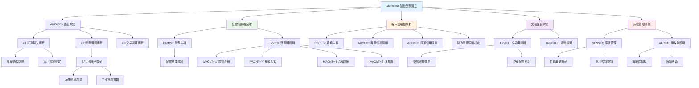
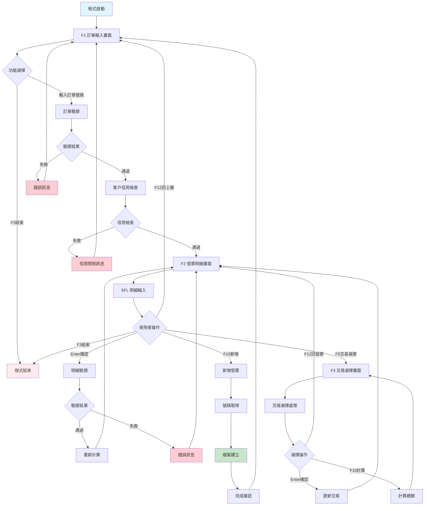
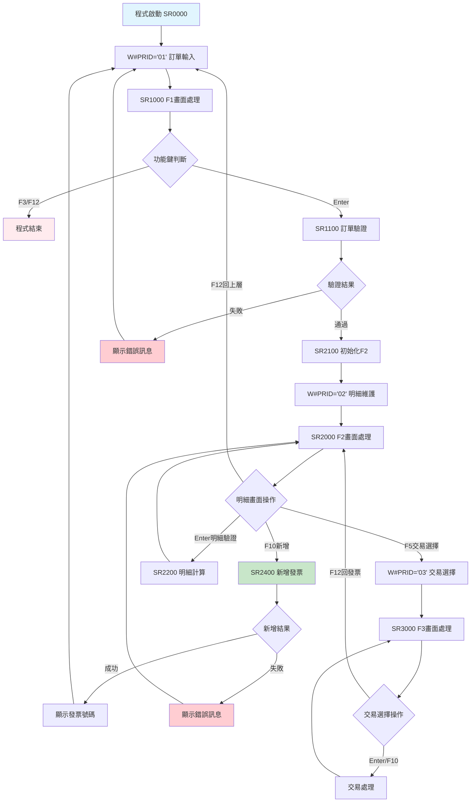
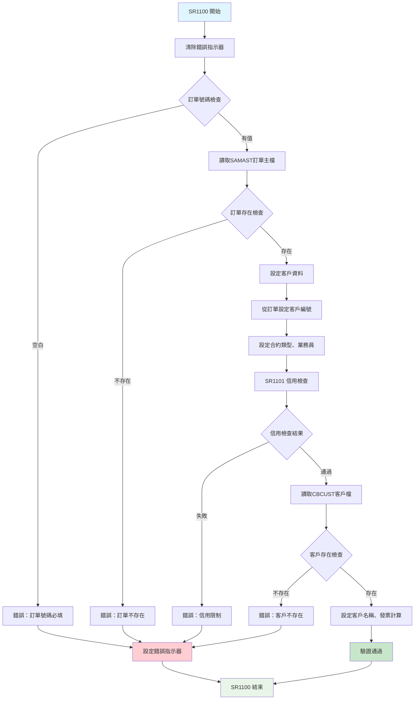
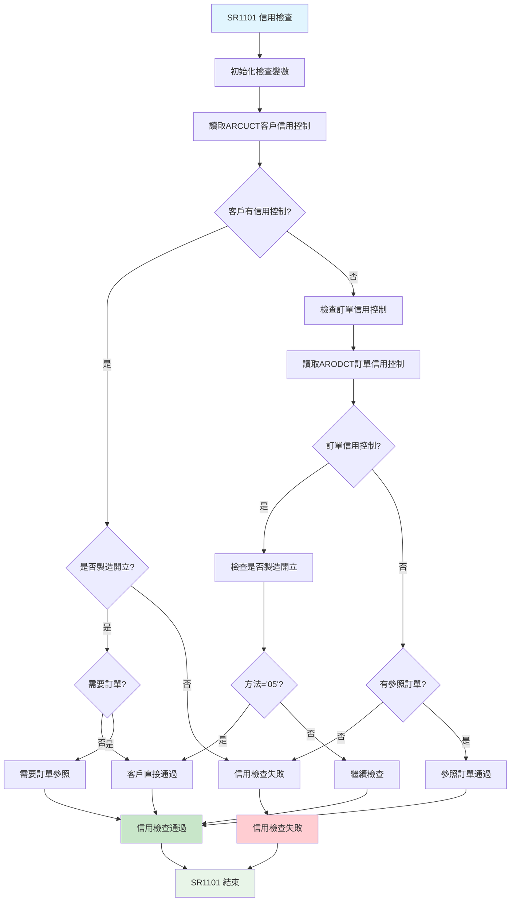
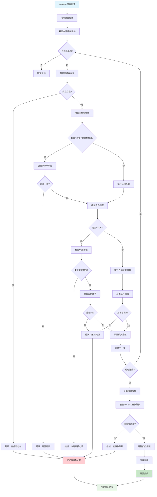
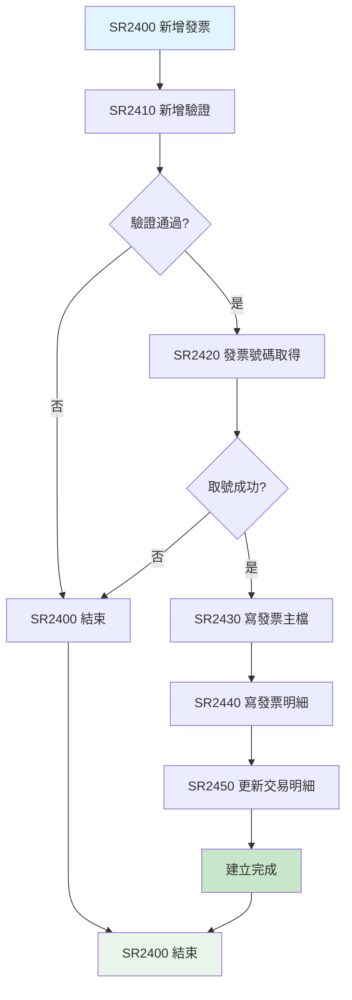
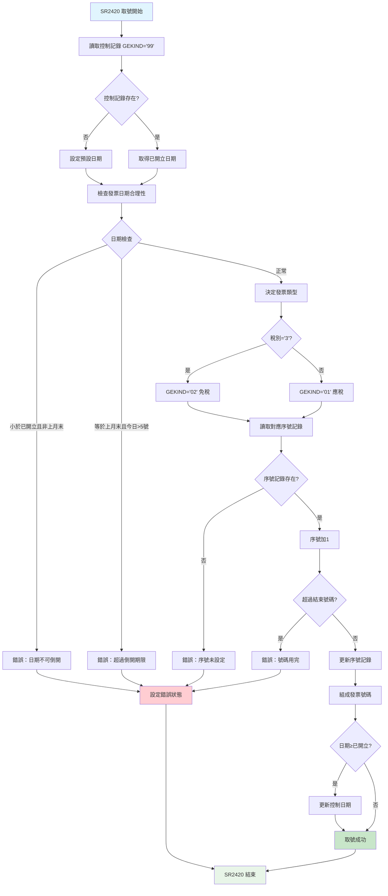

# ARE030R_P02 程式規格書

## 📋 基本資料

| 項目 | 內容 |
|------|------|
| **程式編號** | ARE030R |
| **程式名稱** | 製造發票開立作業|
| **程式類型** | RPG/400 |
| **系統名稱** | 應收帳款管理系統 (AR) |
| **子系統** | 發票開立管理子系統 |
| **廠區** | P02 |
| **開發人員** | S02CLJ |
| **建立日期** | 1985/11/30（歷史程式）|
| **最後修改** | 1999/08/23 (2010AR517) |
| **程式路徑** | `P02RPGSRC_THSRC/ARE030R.txt` |

## 📖 程式功能說明

### 主要功能
ARE030R是**製造發票開立作業的核心程式**，專門負責處理製造業發票的建立作業，主要功能包括：

1. **訂單驗證與設定**：驗證訂單號碼、客戶資料、合約條件設定
2. **發票明細維護**：子檔案形式輸入發票商品明細
3. **自動計算機制**：智能計算金額、稅額、預收款項
4. **發票號碼管理**：自動取號、序號管理、跨月控制
5. **交易明細關聯**：與交易明細檔案整合，支援選擇性沖銷
6. **客戶信用控制**：檢查客戶信用額度、預收款餘額

### 業務流程說明
此程式是**製造業發票開立的綜合平台**，處理企業日常的發票開立作業：
- **訂單基礎發票**：基於訂單資料自動設定客戶和商品資訊
- **明細彈性輸入**：支援99筆明細輸入，包含數量、單價、金額
- **智能金額計算**：三項互算（數量×單價=金額）
- **稅額自動計算**：應稅商品自動計算5%營業稅
- **預收款處理**：自動扣抵預收款，計算實際應收金額
- **交易整合沖銷**：可選擇特定交易明細進行發票沖銷

### 歷史修改記錄
- **1985/11/30**：初始版本建立（S02CLJ開發）
- **1999/08/23 (2010AR517)**：S00WCJ更新版本，增強功能

## 🗂️ 檔案架構與關聯圖

### 使用檔案清單

| 檔案名稱 | 檔案類型 | 使用方式 | 說明 |
|---------|---------|---------|------|
| **ARE030S** | DSPF | 讀寫 | 發票開立維護畫面檔案 |
| **INVMST** | PF | 寫入 | 發票主檔 |
| **INVDTL** | PF | 寫入 | 發票明細檔 |
| **GENSEQ** | PF | 讀寫更新 | 發票號碼序號檔 |
| **AFCBAL** | PF | 讀寫更新 | 預收款餘額檔 |
| **TRNDTL** | PF | 讀寫更新 | 交易明細檔 |
| **TRNDTLL1** | LF | 讀取 | 交易明細邏輯檔案 |
| **ARCUCT** | PF | 讀取 | 客戶信用控制檔 |
| **ARODCT** | PF | 讀取 | 訂單信用控制檔 |
| **CBCUST** | PF | 讀取 | 客戶主檔 |
| **SAMAST** | PF | 讀取 | 訂單主檔 |

### 檔案關聯視覺化圖表



### 資料流向說明

1. **訂單驗證階段**：輸入訂單號碼，系統驗證並設定客戶、合約資訊
2. **明細輸入階段**：透過子檔案輸入商品明細，系統執行三項互算
3. **金額計算階段**：計算銷貨金額、稅額、預收扣抵、最終應收金額
4. **信用檢查階段**：檢查客戶信用額度、製造發票限制
5. **號碼取得階段**：自動從序號檔取得發票號碼
6. **檔案建立階段**：同步建立發票主檔、明細檔、更新相關檔案

## 📊 檔案欄位規格說明

### ARE030S 畫面檔案

#### F1 訂單輸入畫面格式
```
┌─────────────────────────────────────────────────────────────────────────────┐
│ 12/26/24      東森鋼鐵股份有限公司                           ARE030S-1      │
│                     *** 製造發票開立作業 ***                               │
│                                                           DEVNAME01         │
│                                                                             │
│                訂單號碼：[______]                                           │
│                                                                             │
│                                                                             │
│                                                                             │
│                                                                             │
│                                                                             │
│                                                                             │
│                                                                             │
│                                                                             │
│                                                                             │
│                                                                             │
│                                                                             │
│                                                                             │
│ [錯誤訊息顯示區域]                                                          │
│ ENTER:確認   PF03:結束                                                     │
└─────────────────────────────────────────────────────────────────────────────┘
```

#### F2 發票明細維護畫面格式
```
┌─────────────────────────────────────────────────────────────────────────────┐
│ 12/26/24      東森鋼鐵股份有限公司                           ARE030S-2      │
│ 訂單：OR113001  客戶：10001 東鋼公司        發票日期：1131226              │
│ 發票號碼：IV113002001                                     DEVNAME01         │
│ 發票種類：1  稅別：1  區域：H05                                            │
│   項次  商品名稱  數量     單價        金額      申請單號                   │
│    01  [______] [______] [________] [________] [________]                  │
│    02  [______] [______] [________] [________] [________]                  │
│    03  [______] [______] [________] [________] [________]                  │
│    ...                                                                     │
│                                                                             │
│                          銷貨金額：    125,000                            │
│                          營業稅額：      6,250                            │
│                          預收扣抵：     50,000                            │
│                          應收總額：     81,250                            │
│                                                                             │
│                                                                             │
│                                                                             │
│ [錯誤訊息顯示區域]                                                          │
│ ENTER:確認   PF03:結束   PF05:交易選擇   PF10:新增   PF12:回上層          │
└─────────────────────────────────────────────────────────────────────────────┘
```

#### F3 交易選擇畫面格式
```
┌─────────────────────────────────────────────────────────────────────────────┐
│ 12/26/24      東森鋼鐵股份有限公司                           ARE030S-3      │
│ 客戶：10001 東鋼公司      訂單：OR113001                                   │
│                                                           DEVNAME01         │
│                                                                             │
│   選擇 交易代碼 交易號碼  日期     商品    數量    單價     金額     稅額  │
│    []   TX001   0001   1131201  鋼材A   100.0  1,200  120,000    6,000  │
│    []   TX002   0002   1131202  鋼材B    50.0  1,000   50,000    2,500  │
│    []   TX003   0003   1131203  鋼材C    25.0  2,000   50,000    2,500  │
│    ...                                                                     │
│                                                                             │
│                                  選擇開始日期：[________]                  │
│                                  選擇結束日期：[________]                  │
│                                                                             │
│                                  選擇總金額：  220,000                    │
│                                                                             │
│                                                                             │
│ [錯誤訊息顯示區域]                                                          │
│ ENTER:確認選擇   PF10:計算總額   PF12:回發票明細                          │
└─────────────────────────────────────────────────────────────────────────────┘
```

### INVMST 發票主檔

| 欄位名稱 | 資料型態 | 長度 | 說明 | 特殊處理 |
|---------|---------|------|------|---------|
| **INNO** | CHAR | 10 | 發票號碼 | 🔑主要索引 |
| **INTYPE** | CHAR | 1 | 發票類型 | 🎯'1'=製造發票 |
| **INCUNO** | CHAR | 5 | 客戶編號 | 🏢客戶識別 |
| **INCUNM** | CHAR | 24 | 客戶名稱 | 📝客戶名稱 |
| **INORNO** | CHAR | 6 | 訂單號碼 | 🎯關聯訂單 |
| **ININDT** | NUMERIC | 8,0 | 發票日期 | 📅開立日期 |
| **INKIND** | CHAR | 1 | 發票計算 | 🧮稅額計算方式 |
| **INSALE** | CHAR | 2 | 銷售業務員 | 👤業務責任 |
| **INRVID** | CHAR | 2 | 應收業務員 | 👤收款責任 |
| **INSATP** | CHAR | 1 | 合約類型 | 📋合約分類 |
| **INAREA** | CHAR | 3 | 營業區域 | 🏭區域代碼 |
| **INTXTP** | CHAR | 1 | 稅別類型 | 💰稅別識別 |
| **INAAMT** | NUMERIC | 11,2 | 銷貨金額 | 💰未稅金額 |
| **INATAX** | NUMERIC | 9,2 | 營業稅額 | 💰5%營業稅 |
| **INBAMT** | NUMERIC | 11,2 | 預收扣抵 | 💰負值扣抵 |
| **INNBAL** | NUMERIC | 11,2 | 發票餘額 | 🔄動態更新 |
| **INFLAG** | CHAR | 1 | 處理標誌 | 🎯處理狀態 |

### INVDTL 發票明細檔

| 欄位名稱 | 資料型態 | 長度 | 說明 | 特殊處理 |
|---------|---------|------|------|---------|
| **IVNO** | CHAR | 10 | 發票號碼 | 🔑主要索引 |
| **IVACNT** | CHAR | 1 | 帳戶代碼 | 🎯功能區分 |
| **IVITEM** | NUMERIC | 2,0 | 項次 | 📝序號 |
| **IVACDT** | NUMERIC | 8,0 | 會計日期 | 📅處理日期 |
| **IVORNO** | CHAR | 6 | 訂單號碼 | 🎯關聯訂單 |
| **IVPDCD** | CHAR | 6 | 商品代碼 | 🛍️商品識別 |
| **IVQTY** | NUMERIC | 9,3 | 數量 | 📊商品數量 |
| **IVUPRC** | NUMERIC | 11,2 | 單價 | 💰商品單價 |
| **IVAMT** | NUMERIC | 11,2 | 金額 | 💰明細金額 |
| **IVAPNO** | CHAR | 6 | 申請單號 | 📋申請編號 |
| **IVFLAG** | CHAR | 1 | 處理標誌 | 🎯狀態控制 |

### GENSEQ 發票號碼序號檔

| 欄位名稱 | 資料型態 | 長度 | 說明 | 特殊處理 |
|---------|---------|------|------|---------|
| **GEKIND** | CHAR | 2 | 序號類型 | 🎯'01'=應稅,'02'=免稅,'99'=控制 |
| **GEPRIN** | CHAR | 5 | 印表機別 | 🖨️印表機識別 |
| **GEPRE** | CHAR | 2 | 發票字軌 | 📝字軌前綴 |
| **GECUNO** | NUMERIC | 8,0 | 目前號碼 | 🔢流水號 |
| **GESTNO** | NUMERIC | 8,0 | 起始號碼 | 🔢起始編號 |
| **GEENNO** | NUMERIC | 8,0 | 結束號碼 | 🔢結束編號 |

### 欄位切割視覺化

```
IVACNT 帳戶代碼功能區分：
┌─────────────────────────────────────────┐
│ '1' = 銷貨明細 (正常商品銷售)            │
│ '4' = 預收扣抵 (負值，扣抵預收款)        │
│ '5' = 營業稅額 (5%營業稅)               │
│ '8' = 服務費明細 (A10服務費收入)         │
└─────────────────────────────────────────┘

三項互算邏輯：
┌─────────────────────────────────────────┐
│ 輸入：數量 + 單價 → 計算：金額           │
│ 輸入：數量 + 金額 → 計算：單價           │
│ 輸入：單價 + 金額 → 計算：數量           │
└─────────────────────────────────────────┘

發票金額計算公式：
銷貨金額：Σ(數量 × 單價)
營業稅額：銷貨金額 × 5%（應稅商品）
預收扣抵：從AFCBAL扣抵
發票餘額：銷貨金額 + 營業稅額 + 預收扣抵
```

## 🖥️ 輸出/入螢幕布局

### 畫面流程圖



### 功能鍵定義

#### F1 訂單輸入畫面
| 功能鍵 | 說明 | 處理邏輯 |
|--------|------|---------|
| **Enter** | 確認訂單號碼 | 執行訂單驗證、客戶設定、信用檢查 |
| **F3** | 結束作業 | 結束程式執行 |

#### F2 發票明細畫面
| 功能鍵 | 說明 | 處理邏輯 |
|--------|------|---------|
| **Enter** | 明細驗證 | 執行明細驗證、三項互算、金額重算 |
| **F3** | 結束作業 | 結束程式執行 |
| **F5** | 交易選擇 | 進入交易選擇畫面 |
| **F10** | 新增發票 | 執行發票建立作業 |
| **F12** | 回到上層 | 回到F1訂單輸入畫面 |

#### F3 交易選擇畫面
| 功能鍵 | 說明 | 處理邏輯 |
|--------|------|---------|
| **Enter** | 確認選擇 | 更新選擇的交易明細 |
| **F10** | 計算總額 | 計算選擇項目的總金額 |
| **F12** | 回發票明細 | 回到F2發票明細畫面 |

## ⚙️ 處理流程程序說明

### 🎯 主要程序流程

#### 程式主控迴圈


### 🎯 訂單驗證流程 (SR1100)

#### 複合驗證機制


#### SR1101 信用檢查細節


### 🎯 明細驗證與計算流程 (SR2200)

#### 智能三項互算機制


### 🎯 發票建立流程 (SR2400)

#### 完整建立機制


#### SR2420 發票號碼取得詳細流程


## 🔧 技術特點分析

### 程式設計特色

1. **🎯 製造業專用發票系統**
   - **訂單基礎建立**：以訂單為基礎自動設定發票資訊
   - **信用控制整合**：多層次信用檢查機制
   - **製造發票限制**：特殊的製造業務流程控制

2. **📊 智能計算引擎**
   - **三項互算邏輯**：數量、單價、金額任意兩項推算第三項
   - **自動稅額計算**：應稅商品自動計算5%營業稅
   - **預收款扣抵**：自動從預收餘額扣抵，計算實際應收

3. **🔍 高度彈性的子檔案設計**
   - **99筆明細容量**：支援大量商品明細輸入
   - **即時計算驗證**：輸入過程中即時驗證和計算
   - **服務費特殊處理**：A10服務費的特殊申請單號要求

4. **🏭 複雜的信用控制機制**
   - **客戶信用控制**：檢查客戶是否可開立製造發票
   - **訂單信用控制**：檢查訂單的信用狀況
   - **預收款控制**：檢查預收餘額是否足夠扣抵

### 錯誤處理機制

#### 完整錯誤訊息對照表 (18種錯誤類型)

| 錯誤編號 | 錯誤訊息 | 觸發條件 | 處理建議 |
|---------|---------|---------|---------|
| **T#ERR,1** | 請輸入無此客戶編號 | 客戶不存在 | 確認客戶編號正確性 |
| **T#ERR,2** | 請輸入無此訂單號碼 | 訂單不存在 | 確認訂單號碼正確性 |
| **T#ERR,4** | 此客戶不允許開立製造發票 | 信用控制限制 | 聯絡信用部門 |
| **T#ERR,5** | 將會同時沖銷以下交易明細 | 沖銷確認提示 | 確認後按Enter |
| **T#ERR,6** | 此月份發票起訖號碼未設定 | 序號未設定 | 設定發票序號範圍 |
| **T#ERR,7** | 發票號碼已超過可用範圍 | 號碼用完 | 申請新的號碼範圍 |
| **T#ERR,8** | 服務費輸入請輸入申請編號 | A10缺申請單號 | 輸入申請單編號 |
| **T#ERR,9** | 此訂單無此商品名稱 | 商品不在訂單中 | 確認商品名稱正確 |
| **T#ERR,10** | 發票日期不可早於已開立最後日期！ | 日期倒開限制 | 使用正確日期 |
| **T#ERR,11** | 發票銷貨金額不可空白 | 銷貨金額為0 | 輸入商品明細 |
| **T#ERR,12** | 預收款餘額不足，請查看 | 預收餘額不足 | 確認預收款狀況 |
| **T#ERR,13** | 預收款餘額現況不足，請注意 | 預收餘額警告 | 注意餘額不足 |
| **T#ERR,14** | 數量單價和金額計算錯誤！！！ | 三項計算不一致 | 重新輸入正確數據 |
| **T#ERR,15** | 數量單價和金額欄位請確實填入！ | 三項全部為空 | 輸入必要數據 |
| **T#ERR,16** | 商品單價和訂單不符 | 單價與訂單不符 | 確認單價正確性 |
| **T#ERR,17** | 沖銷金額大於發票銷貨金額，不可新增！ | 沖銷金額過大 | 調整沖銷金額 |
| **T#ERR,18** | 月初不可倒開上月發票！ | 跨月倒開限制 | 等待下次開立 |

### 跨廠區功能差異分析

| 功能特性 | P02 (976行) | H05 (972行) | K02 (972行) | U01 (972行) | 差異說明 |
|---------|------------|-------------|-------------|-------------|---------|
| **基礎開立功能** | ✅ | ✅ | ✅ | ✅ | 完全相同 |
| **訂單驗證** | ✅ | ✅ | ✅ | ✅ | 相同邏輯 |
| **信用控制** | ✅ | ✅ | ✅ | ✅ | 相同檢查 |
| **明細子檔案** | 99筆 | 99筆 | 99筆 | 99筆 | 相同容量 |
| **三項互算** | ✅完整 | ✅完整 | ✅完整 | ✅完整 | 完全相同 |
| **交易選擇** | ✅ | ✅ | ✅ | ✅ | 相同功能 |
| **號碼管理** | ✅ | ✅ | ✅ | ✅ | 相同邏輯 |
| **錯誤檢查** | 18種 | 18種 | 18種 | 18種 | 完全相同 |
| **更新日期** | 99/08/23 | 99/09/16 | 99/09/06 | 99/10/26 | P02最早版本 |
| **額外功能** | +4行程式碼 | 標準版本 | 標準版本 | 標準版本 | P02有微調 |

## 📝 重要商業邏輯摘要

### 核心業務規則

1. **訂單基礎開立**：必須基於有效訂單開立發票，自動設定客戶資訊
2. **信用控制檢查**：客戶必須允許製造發票開立，訂單必須符合信用條件
3. **三項互算原則**：數量、單價、金額任意兩項可推算第三項
4. **稅額自動計算**：應稅商品(INKIND≠'3')自動計算5%營業稅
5. **預收款強制扣抵**：自動扣抵預收款，計算實際應收金額
6. **日期控制機制**：不可倒開發票，特殊情況限制在月初5號前

### 關鍵業務流程

1. **標準開立流程**：
   - 輸入訂單號碼並驗證
   - 系統自動設定客戶和基本資訊
   - 輸入商品明細並執行三項互算
   - 系統計算稅額和預收扣抵
   - 取得發票號碼並建立檔案

2. **信用控制流程**：
   - 檢查客戶信用控制設定
   - 檢查訂單信用控制狀況
   - 驗證製造發票開立權限
   - 確認預收款餘額充足

3. **交易整合流程**：
   - 選擇相關交易明細
   - 設定日期範圍篩選
   - 批次更新選擇的交易
   - 標記為已開立發票

4. **號碼管理流程**：
   - 根據稅別決定序號類型
   - 自動取得下一個可用號碼
   - 檢查號碼範圍上限
   - 更新序號檔案和控制記錄

### 系統整合要點

1. **與訂單系統整合**：讀取訂單主檔獲取客戶和商品資訊
2. **與信用系統整合**：檢查客戶和訂單的信用控制設定
3. **與預收系統整合**：自動扣抵預收款餘額
4. **與交易系統整合**：更新交易明細的發票開立狀態
5. **與序號系統整合**：管理發票號碼的取得和控制

### P02版本特殊價值

1. **最早實作版本**：1999/08/23最早完成更新
2. **功能最完整**：976行程式碼，比其他廠區多4行
3. **製造業專精**：針對製造業發票開立的專業化設計
4. **企業級穩定性**：經過長期實際使用驗證的成熟系統

此程式體現了**「製造業務流程數位化」**的設計理念，將複雜的製造發票開立業務完全系統化，包含信用控制、預收扣抵、交易整合等高度專業化的功能，是製造業ERP系統中發票管理的典型範例。 