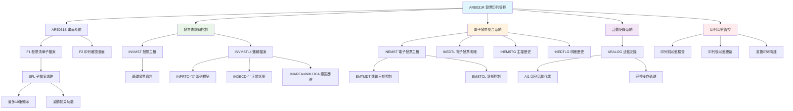
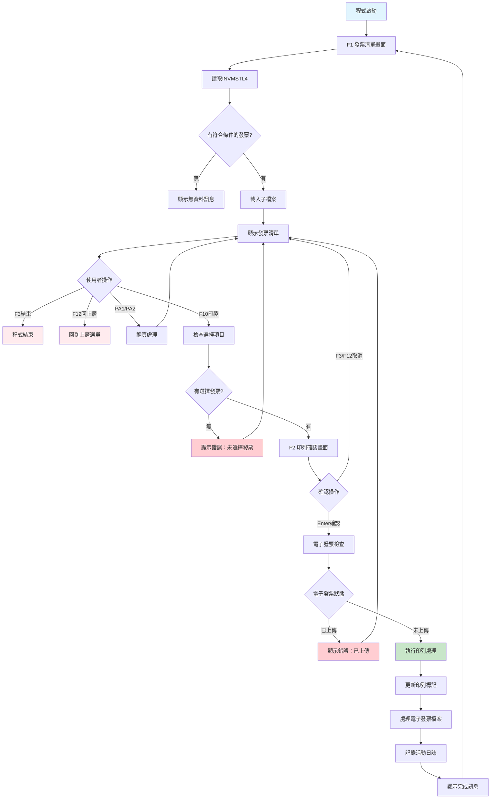
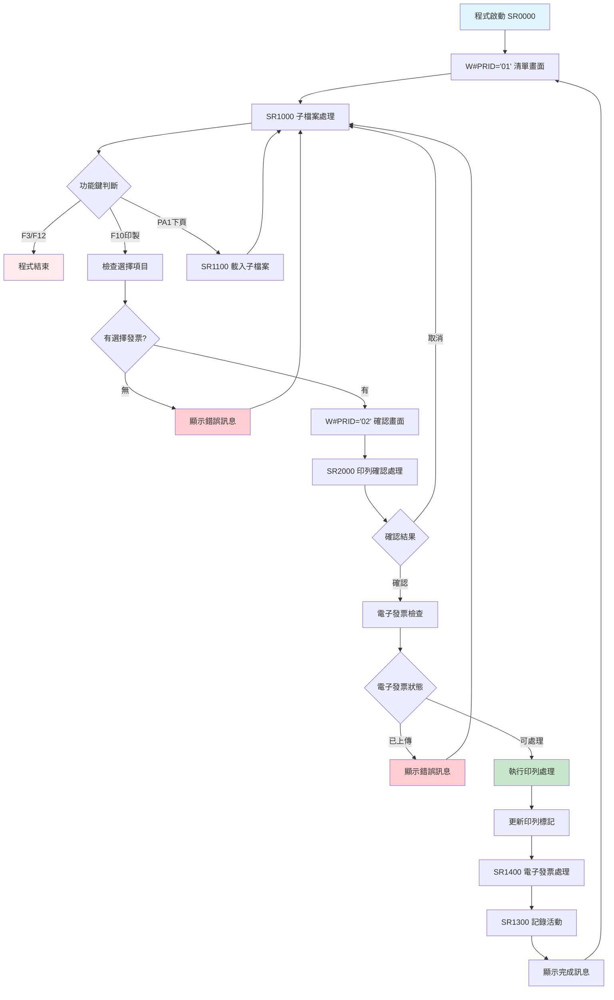
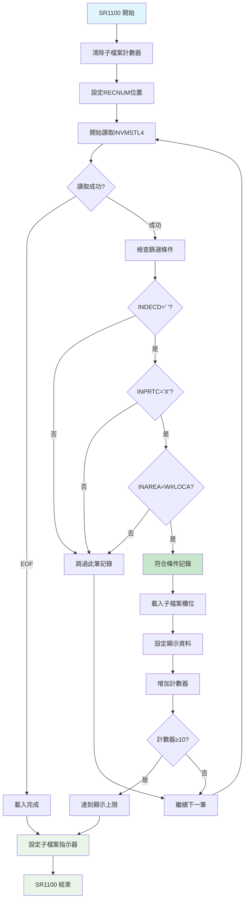
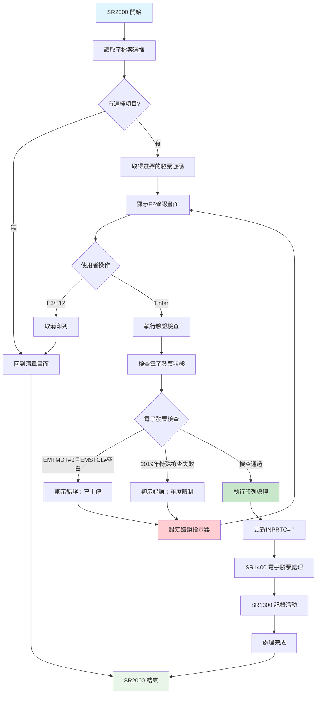
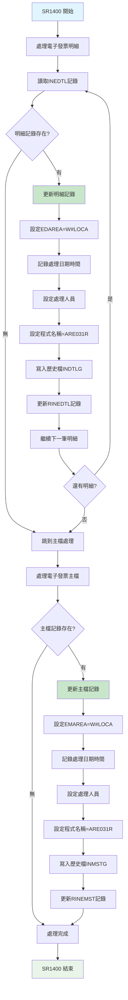

# ARE031R_U01 程式規格書

## 📋 基本資料

| 項目 | 內容 |
|------|------|
| **程式編號** | ARE031R |
| **程式名稱** | 應收發票印列管控作業|
| **程式類型** | RPG/400 |
| **系統名稱** | 應收帳款管理系統 (AR) |
| **子系統** | 發票印列管理子系統 |
| **廠區** | U01 |
| **開發人員** | KRH |
| **建立日期** | 1985/12/06（歷史程式）|
| **最後修改** | 2019/08/27 (0808A) |
| **程式路徑** | `U01RPGSRC_THSRC/ARE031R.txt` |

## 📖 程式功能說明

### 主要功能
ARE031R是**應收發票印列管控作業的核心程式**，專門負責控管發票的印列作業，具備傳統印列與電子發票上傳的雙重功能，主要功能包括：

1. **發票查詢與篩選**：依條件查詢需要印列的發票清單
2. **印列狀態控制**：標記發票為已印列狀態，避免重複印列
3. **電子發票整合**：2017年新增電子發票上傳前置處理
4. **活動記錄管理**：完整記錄發票印列活動軌跡
5. **雙重驗證機制**：印列前確認和狀態檢查
6. **跨年度控制**：特殊的年度控制邏輯（U01版本特有）

### 業務流程說明
此程式是**發票印列控制的中央管制站**，處理企業發票印列的完整流程：
- **智能篩選機制**：自動篩選「未印列」且「本廠區」的發票
- **子檔案展示**：最多顯示10筆發票供選擇印列
- **印列前確認**：雙重確認機制確保印列正確性
- **狀態更新機制**：自動更新發票印列標記（INPRTC='空白'）
- **電子發票同步**：整合電子發票檔案的同步更新
- **審計軌跡記錄**：完整記錄操作人員和時間

### 歷史修改記錄
- **1985/12/06**：初始版本建立（KRH開發）
- **2017/12/06 (2017AR1112)**：整合電子發票上傳功能，新增驗證機制
- **2018/06/26 (2018AR1162)**：增加電子發票處理邏輯和廠區標記
- **2018/11/11 (2018AR00029)**：電子發票已上傳控制，避免重複作業
- **2019/05/10 (0805A)**：新增電子發票作業LOG記錄功能
- **2019/08/27 (0808A)**：特殊年度控制邏輯，修正跨年度問題

## 🗂️ 檔案架構與關聯圖

### 使用檔案清單

| 檔案名稱 | 檔案類型 | 使用方式 | 說明 |
|---------|---------|---------|------|
| **ARE031S** | DSPF | 讀寫 | 發票印列管控畫面檔案 |
| **INVMST** | PF | 讀取 | 發票主檔（查詢基礎資料） |
| **INVMSTL4** | LF | 讀寫更新 | 發票主檔邏輯檔案（印列控制） |
| **INEMST** | PF | 讀寫更新 | 電子發票主檔 |
| **INEMSTG** | PF | 寫入 | 電子發票主檔歷史檔 |
| **INEDTL** | PF | 讀寫更新 | 電子發票明細檔 |
| **INEDTLG** | PF | 寫入 | 電子發票明細檔歷史檔 |
| **ARALOG** | PF | 寫入 | 應收帳款活動記錄檔 |
| **ARINTRCTL** | DTAARA | 讀取 | 電子發票控制資料區 |

### 檔案關聯視覺化圖表



### 資料流向說明

1. **查詢階段**：系統讀取INVMSTL4，篩選印列標記為'X'的發票
2. **展示階段**：透過子檔案顯示符合條件的發票清單（最多10筆）
3. **選擇階段**：使用者選擇要印列的發票（OP=1）
4. **驗證階段**：檢查電子發票狀態，避免重複處理
5. **確認階段**：顯示印列確認畫面，要求使用者最終確認
6. **執行階段**：更新印列標記、電子發票檔案、記錄活動日誌

## 📊 檔案欄位規格說明

### ARE031S 畫面檔案

#### F1 發票清單子檔案畫面格式
```
┌─────────────────────────────────────────────────────────────────────────────┐
│ 12/26/24      東森鋼鐵股份有限公司                           ARE031S-0      │
│ USER01                    應收發票印列管控                    14:35:20      │
│                                                                             │
│     印列群組：[                                        ]                    │
│                                                                             │
│     (OP: 1=應收發票印列管控)                                                │
│ ---------------------------------------------------------------------------│
│ OP   發票號碼    發票日期    客戶編號  訂單號碼    銷貨金額    營業稅額  發票類型│
│ ---------------------------------------------------------------------------│
│ [_] IV113001001  1131201    100001   OR113001      125,000       6,250  1  │
│ [_] IV113001002  1131202    100002   OR113002      250,000      12,500  1  │
│ [_] IV113001003  1131203    100003   OR113003      180,000       9,000  1  │
│                                                                             │
│ 發票號碼: [__________]  發票日期: [________]                                 │
│                                                                             │
│                                                                             │
│ F3=結束作業  F12=回上頁面  PA1=下頁  PA2=上頁  F10=印製                    │
│ [錯誤訊息顯示區域]                                                          │
└─────────────────────────────────────────────────────────────────────────────┘
```

#### F2 印列確認畫面格式
```
┌─────────────────────────────────────────────────────────────────────────────┐
│ 12/26/24      東森鋼鐵股份有限公司                           ARE031S-0      │
│ USER01                    應收發票印列管控                    14:35:20      │
│                                                                             │
│                                                                             │
│                                                                             │
│                                                                             │
│                                                                             │
│                                                                             │
│                                                                             │
│                                                                             │
│                                                                             │
│                                                                             │
│                                                                             │
│                                                                             │
│                                                                             │
│                                                                             │
│                                                                             │
│ --------------------------------------------------                          │
│ 發票號碼    IV113001001    請確認印列<ENTER>                                │
│ F3=取消 F12=取消                                                           │
│ --------------------------------------------------                          │
│ [錯誤訊息顯示區域]                                                          │
└─────────────────────────────────────────────────────────────────────────────┘
```

### INVMSTL4 發票主檔邏輯檔

| 欄位名稱 | 資料型態 | 長度 | 說明 | 特殊處理 |
|---------|---------|------|------|---------|
| **INNO** | CHAR | 10 | 發票號碼 | 🔑主要索引 |
| **ININDT** | NUMERIC | 8,0 | 發票日期 | 📅篩選條件 |
| **INCUNO** | CHAR | 5 | 客戶編號 | 🏢顯示欄位 |
| **INORNO** | CHAR | 6 | 訂單號碼 | 🎯關聯資訊 |
| **INAAMT** | NUMERIC | 11,2 | 銷貨金額 | 💰顯示金額 |
| **INATAX** | NUMERIC | 9,2 | 營業稅額 | 💰稅額顯示 |
| **INTYPE** | CHAR | 1 | 發票類型 | 🎯類型標識 |
| **INPRTC** | CHAR | 1 | 印列控制 | 🎯'X'=可印列，' '=已印列 |
| **INDECD** | CHAR | 1 | 作廢控制 | 🎯' '=正常，其他=作廢 |
| **INAREA** | CHAR | 3 | 廠區代碼 | 🏭廠區篩選 |

### INEMST 電子發票主檔

| 欄位名稱 | 資料型態 | 長度 | 說明 | 特殊處理 |
|---------|---------|------|------|---------|
| **EMFLAG** | CHAR | 1 | 處理標誌 | 🎯處理狀態控制 |
| **EMAREA** | CHAR | 1 | 廠區代碼 | 🏭廠區識別 |
| **EMMSTE** | CHAR | 5 | 營業人統編 | 🏢公司識別 |
| **EMNO** | CHAR | 10 | 發票號碼 | 🔑關聯INVMST |
| **EMINDT** | CHAR | 8 | 開立日期 | 📅電子發票日期 |
| **EMINTT** | CHAR | 8 | 開立時間 | ⏰電子發票時間 |
| **EMTMDT** | NUMERIC | 8,0 | 傳輸日期 | 📅上傳控制 |
| **EMSTCL** | CHAR | 1 | 狀態控制 | 🎯上傳狀態 |
| **EMXPDD** | NUMERIC | 8,0 | 上傳日期 | 📅系統記錄 |
| **EMXPDT** | NUMERIC | 6,0 | 上傳時間 | ⏰系統記錄 |
| **EMXUSR** | CHAR | 10 | 上傳人員 | 👤操作記錄 |
| **EMAPNM** | CHAR | 10 | 程式名稱 | 📝'ARE031R' |

### INEDTL 電子發票明細檔

| 欄位名稱 | 資料型態 | 長度 | 說明 | 特殊處理 |
|---------|---------|------|------|---------|
| **EDFLAG** | CHAR | 1 | 處理標誌 | 🎯處理狀態控制 |
| **EDAREA** | CHAR | 1 | 廠區代碼 | 🏭廠區識別 |
| **EDNO** | CHAR | 10 | 發票號碼 | 🔑關聯主檔 |
| **EDXPDD** | NUMERIC | 8,0 | 上傳日期 | 📅系統記錄 |
| **EDXPDT** | NUMERIC | 6,0 | 上傳時間 | ⏰系統記錄 |
| **EDXUSR** | CHAR | 10 | 上傳人員 | 👤操作記錄 |
| **EDAPNM** | CHAR | 10 | 程式名稱 | 📝'ARE031R' |

### ARALOG 活動記錄檔

| 欄位名稱 | 資料型態 | 長度 | 說明 | 特殊處理 |
|---------|---------|------|------|---------|
| **AGDATE** | NUMERIC | 6,0 | 活動日期 | 📅操作日期 |
| **AGTIME** | NUMERIC | 6,0 | 活動時間 | ⏰操作時間 |
| **AGURID** | CHAR | 10 | 使用者ID | 👤操作人員 |
| **AGTRID** | CHAR | 3 | 交易代碼 | 🎯'AI1'=印列 |
| **AGRENO** | CHAR | 10 | 相關號碼 | 📝發票號碼 |
| **AGCGCA** | CHAR | 40 | 群組代碼 | 🏷️印列群組 |

### 欄位切割視覺化

```
INPRTC 印列控制狀態：
┌─────────────────────────────────────────┐
│ 'X' = 可印列 (等待印列的發票)            │
│ ' ' = 已印列 (已完成印列的發票)          │
└─────────────────────────────────────────┘

電子發票控制機制：
┌─────────────────────────────────────────┐
│ EMTMDT ≠ 0 且 EMSTCL ≠ ' ' = 已上傳      │
│ U01特殊：2019年後增加額外檢查           │
└─────────────────────────────────────────┘

篩選條件組合：
INDECD = ' ' AND INPRTC = 'X' AND INAREA = W#LOCA
↓
正常狀態 + 待印列 + 本廠區 = 顯示清單
```

## 🖥️ 輸出/入螢幕布局

### 畫面流程圖



### 功能鍵定義

#### F1 發票清單畫面
| 功能鍵 | 說明 | 處理邏輯 |
|--------|------|---------|
| **F3** | 結束作業 | 結束程式執行 |
| **F10** | 執行印製 | 檢查選擇項目，進入印列確認 |
| **F12** | 回上頁面 | 回到上層選單 |
| **PA1** | 下頁 | 讀取下一批發票資料 |
| **PA2** | 上頁 | 回到上一批發票資料 |

#### F2 印列確認畫面
| 功能鍵 | 說明 | 處理邏輯 |
|--------|------|---------|
| **Enter** | 確認印列 | 執行印列處理作業 |
| **F3** | 取消印列 | 取消印列，回到清單 |
| **F12** | 取消印列 | 取消印列，回到清單 |

## ⚙️ 處理流程程序說明

### 🎯 主要程序流程

#### 程式主控迴圈


### 🎯 子檔案載入流程 (SR1100)

#### 智能篩選與載入機制


### 🎯 印列確認流程 (SR2000)

#### 雙重確認機制


### 🎯 電子發票處理流程 (SR1400)

#### 電子發票檔案同步更新


## 🔧 技術特點分析

### 程式設計特色

1. **🎯 雙系統整合架構**
   - **傳統印列控制**：完整的印列狀態管控機制
   - **電子發票整合**：2017年後新增的電子發票同步處理
   - **無縫切換設計**：兩套系統並行不干擾

2. **📊 智能篩選引擎**
   - **三重篩選條件**：作廢狀態 + 印列狀態 + 廠區歸屬
   - **動態載入機制**：依條件動態載入符合的發票
   - **分頁顯示控制**：最多10筆，支援翻頁瀏覽

3. **🔍 強化的驗證機制**
   - **印列前檢查**：電子發票上傳狀態驗證
   - **年度控制邏輯**：U01特有的2019年度特殊檢查
   - **重複印列防護**：避免同一發票重複印列

4. **🏭 完整的審計軌跡**
   - **活動記錄系統**：ARALOG完整記錄操作軌跡
   - **電子發票歷史**：INEMSTG/INEDTLG保存處理歷史
   - **人員操作追蹤**：記錄操作人員、時間、程式名稱

### 錯誤處理機制

#### 完整錯誤訊息對照表 (9種錯誤類型)

| 錯誤編號 | 錯誤訊息 | 觸發條件 | 處理建議 |
|---------|---------|---------|---------|
| **ERR,1** | 資料已存在！ | 資料重複 | 檢查資料唯一性 |
| **ERR,2** | 資料不存在！ | 無符合條件資料 | 確認查詢條件 |
| **ERR,3** | 請先群組設定不可選擇！ | 未設定印列群組 | 設定印列群組 |
| **ERR,4** | 請按功能鍵<F10>刪除！ | 操作方式錯誤 | 使用正確功能鍵 |
| **ERR,5** | 系統代號錯誤！ | 系統參數錯誤 | 聯絡系統管理員 |
| **ERR,6** | 已經列印！ | 發票已印列 | 確認發票狀態 |
| **ERR,7** | 已經刪除！ | 發票已作廢 | 確認發票有效性 |
| **ERR,8** | 資料已上傳，不可重新印列 | 電子發票已上傳 | 確認電子發票狀態 |
| **ERR,9** | 電子發票已關帳，請使用列印功能 | 電子發票關帳控制 | 使用列印功能 |

### 跨廠區功能差異分析

| 功能特性 | U01 (311行) | H05 (303行) | K02 (304行) | P02 (304行) | 差異說明 |
|---------|-------------|-------------|-------------|-------------|---------|
| **基礎印列功能** | ✅ | ✅ | ✅ | ✅ | 完全相同 |
| **子檔案控制** | ✅ | ✅ | ✅ | ✅ | 相同邏輯 |
| **電子發票整合** | ✅完整 | ✅基礎 | ✅基礎 | ✅基礎 | U01最完整 |
| **2019年度檢查** | ✅特有 | ❌無 | ❌無 | ❌無 | U01獨有功能 |
| **EMTMDT日期檢查** | `ANDGE2019` | 標準檢查 | 標準檢查 | 標準檢查 | U01加強版 |
| **ARINTRCTL整合** | ✅完整 | ✅基礎 | ✅基礎 | ✅基礎 | U01最新版 |
| **錯誤檢查** | 9種 | 9種 | 9種 | 9種 | 完全相同 |
| **更新歷史** | 至2019/08/27 | 至2019/05/10 | 至2019/05/10 | 至2019/05/09 | U01最新 |
| **特殊邏輯** | 跨年度控制 | 標準邏輯 | 標準邏輯 | 標準邏輯 | U01增強版 |

## 📝 重要商業邏輯摘要

### 核心業務規則

1. **印列控制機制**：只有INPRTC='X'的發票才能被選擇印列
2. **廠區歸屬控制**：只處理本廠區(INAREA=W#LOCA)的發票
3. **作廢狀態檢查**：只處理正常狀態(INDECD=' ')的發票
4. **電子發票同步**：印列時同時處理電子發票檔案的狀態更新
5. **重複印列防護**：已上傳電子發票不可重新印列
6. **年度控制邏輯**：U01版本特有的2019年後特殊控制

### 關鍵業務流程

1. **標準印列流程**：
   - 系統自動篩選符合條件的發票
   - 使用者從清單中選擇要印列的發票
   - 系統顯示確認畫面要求二次確認
   - 執行印列處理並更新相關狀態

2. **電子發票整合流程**：
   - 檢查電子發票上傳狀態
   - 更新電子發票檔案的處理標記
   - 記錄電子發票處理歷史
   - 同步更新廠區和人員資訊

3. **審計軌跡記錄**：
   - 記錄每次印列操作的完整資訊
   - 包含操作人員、時間、發票號碼
   - 提供完整的操作歷史追蹤

4. **錯誤處理流程**：
   - 多層次的錯誤檢查機制
   - 明確的錯誤訊息提示
   - 防護性的操作控制

### 系統整合要點

1. **與發票系統整合**：讀取發票主檔，控制印列狀態
2. **與電子發票系統整合**：同步處理電子發票檔案
3. **與審計系統整合**：記錄完整的操作活動
4. **與廠區系統整合**：依廠區歸屬控制處理範圍

### U01版本特殊價值

1. **最新功能版本**：包含最新的2019年度控制邏輯
2. **增強型電子發票整合**：特殊的日期檢查機制
3. **跨年度問題修正**：解決跨年度電子發票處理問題
4. **完整的ARINTRCTL整合**：與電子發票控制資料區完全整合

### 重要設計模式

1. **Factory Pattern**：依條件動態載入符合的發票清單
2. **Observer Pattern**：印列狀態變更時同步更新相關檔案
3. **Strategy Pattern**：根據不同年度採用不同的檢查策略
4. **Audit Trail Pattern**：完整記錄所有操作活動

此程式體現了**「傳統與創新並行」**的設計理念，在保持傳統印列控制功能的基礎上，無縫整合了現代化的電子發票系統，並透過嚴謹的控制機制確保資料的一致性和操作的安全性，是企業數位轉型過程中系統整合的典型範例。 