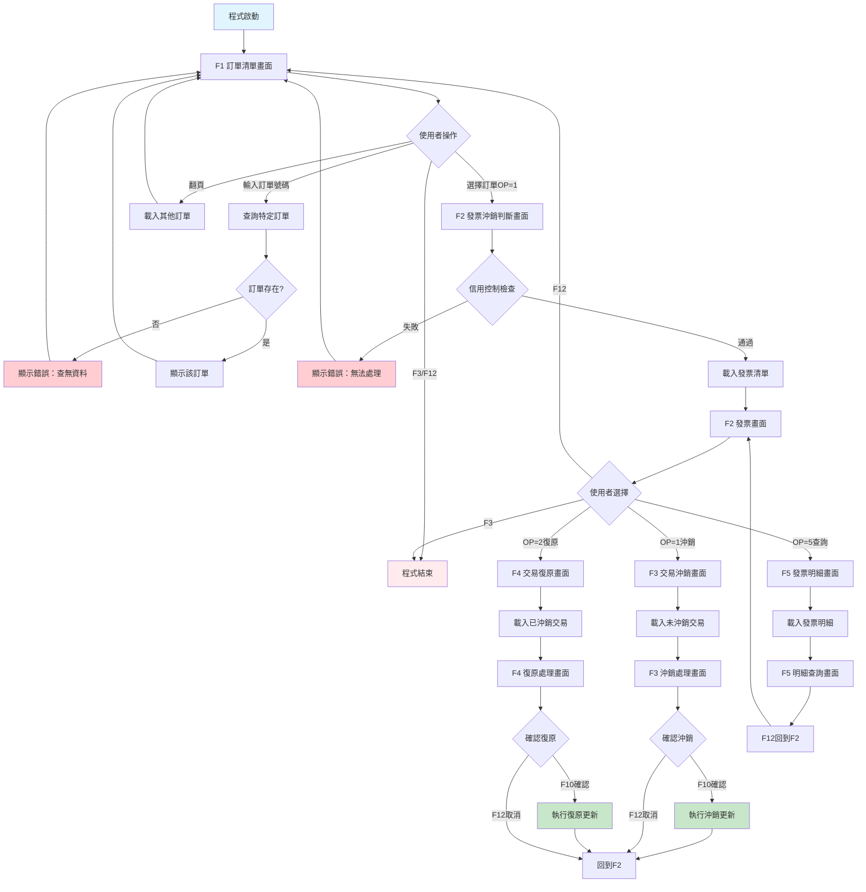
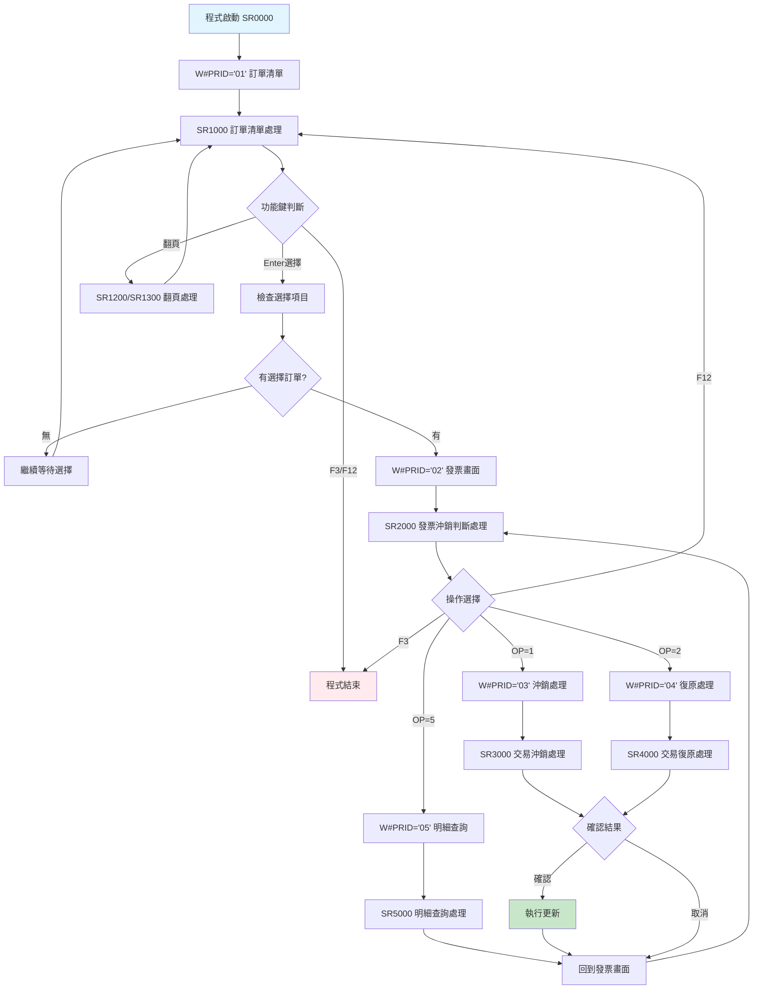
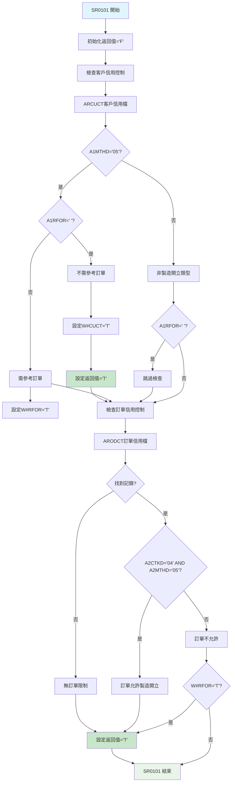
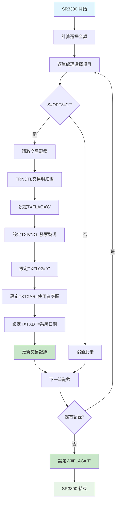
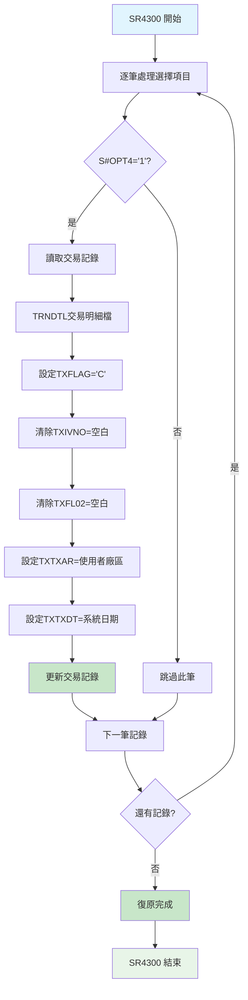

# ARE032R_P02 程式規格書

## 📋 基本資料

| 項目 | 內容 |
|------|------|
| **程式編號** | ARE032R |
| **程式名稱** | 製造發票開立與交易沖銷判斷管控作業 |
| **程式類型** | RPG/400 |
| **系統名稱** | 應收帳款管理系統 (AR) |
| **子系統** | 製造發票沖銷管理子系統 |
| **廠區** | P02 |
| **開發人員** | S02CLJ |
| **建立日期** | 1986/01/20（歷史程式）|
| **最後修改** | 1999/08/23 (9908A) |
| **程式路徑** | `P02RPGSRC_THSRC/ARE032R.txt` |

## 📖 程式功能說明

### 主要功能
ARE032R是**製造發票開立與交易沖銷判斷管控作業的核心程式**，專門負責製造類型發票的沖銷控制和交易管理，主要功能包括：

1. **訂單選擇與管理**：瀏覽和選擇製造訂單清單
2. **發票沖銷判斷**：智能判斷發票與交易的沖銷關係
3. **交易沖銷處理**：執行交易明細的沖銷作業
4. **交易復原處理**：執行已沖銷交易的復原作業
5. **發票明細查詢**：查詢發票的詳細項目資訊
6. **信用控制整合**：結合客戶和訂單信用控制機制
7. **製造開立驗證**：確保只處理製造類型的發票開立

### 業務流程說明
此程式是**製造發票沖銷控制的中央管制站**，處理製造業特有的發票與交易沖銷流程：
- **智能訂單篩選**：自動篩選符合條件的製造訂單
- **五層式操作介面**：漸進式的操作流程設計
- **雙重信用控制**：客戶信用+訂單信用的複合控制
- **沖銷與復原機制**：靈活的交易狀態管理
- **製造專用邏輯**：專為製造業設計的發票處理邏輯
- **完整的審計軌跡**：記錄所有沖銷和復原操作

### 歷史修改記錄
- **1986/01/20**：初始版本建立（S02CLJ開發）
- **1999/08/23 (2010AR517)**：P02版本功能增強（S00WCJ修改）

## 🗂️ 檔案架構與關聯圖

### 使用檔案清單

| 檔案名稱 | 檔案類型 | 使用方式 | 說明 |
|---------|---------|---------|------|
| **ARE032S** | DSPF | 讀寫 | 五層式作業畫面檔案 |
| **SAMAST** | PF | 讀取 | 銷售訂單主檔 |
| **INVMSTL2** | LF | 讀取 | 發票主檔邏輯檔案2 |
| **INVDTL** | PF | 讀取 | 發票明細檔 |
| **TRNDTL** | PF | 讀寫更新 | 交易明細檔（沖銷處理）|
| **TRNDTLL4** | LF | 讀取 | 交易明細邏輯檔案4 |
| **ARCUCT** | PF | 讀取 | 客戶信用控制檔 |
| **ARODCT** | PF | 讀取 | 訂單信用控制檔 |

### 檔案關聯視覺化圖表

```mermaid
graph TD
    A[ARE032R 製造發票沖銷管控] --> B[五層式畫面系統]
    A --> C[訂單管理系統]
    A --> D[發票沖銷系統]
    A --> E[信用控制系統]
    A --> F[交易處理系統]
    
    B --> G[F1 訂單清單畫面]
    B --> H[F2 發票沖銷判斷畫面]
    B --> I[F3 交易沖銷處理畫面]
    B --> J[F4 交易復原處理畫面]
    B --> K[F5 發票明細查詢畫面]
    
    C --> L[SAMAST 銷售訂單主檔]
    L --> M[S1OREA 廠區代碼]
    L --> N[S1ORNO 訂單號碼]
    L --> O[S1DATE 訂單日期]
    L --> P[S1CTNO 合約號碼]
    L --> Q[S1CUNO 客戶編號+名稱]
    
    D --> R[INVMSTL2 發票主檔LF2]
    D --> S[INVDTL 發票明細檔]
    R --> T[INNO 發票號碼]
    R --> U[ININDT 發票日期]
    R --> V[INAAMT+INATAX+INBAMT 金額]
    S --> W[IVACNT+IVITEM+IVPDCD 項目]
    S --> X[IVQTY+IVUPRC+IVAMT 數量價格]
    
    E --> Y[ARCUCT 客戶信用控制]
    E --> Z[ARODCT 訂單信用控制]
    Y --> AA[A1MTHD='05' 製造開立]
    Y --> BB[A1RFOR 參考訂單控制]
    Z --> CC[A2MTHD='05' 製造開立]
    
    F --> DD[TRNDTL 交易明細檔]
    F --> EE[TRNDTLL4 交易明細LF4]
    DD --> FF[TXFLAG='C' 沖銷標記]
    DD --> GG[TXIVNO 發票號碼]
    DD --> HH[TXFL02='Y' 已開發票]
    DD --> II[TXTXAR+TXTXDT 異動記錄]
    
    style A fill:#e1f5fe
    style D fill:#e8f5e8
    style E fill:#fff3e0
    style F fill:#f3e5f5
```



### 資料流向說明

1. **訂單選擇階段**：從SAMAST讀取符合條件的製造訂單清單
2. **發票關聯階段**：透過INVMSTL2查詢訂單相關的發票資訊
3. **信用檢查階段**：透過ARCUCT和ARODCT進行雙重信用控制驗證
4. **交易分析階段**：從TRNDTLL4分析交易與發票的沖銷關係
5. **沖銷執行階段**：更新TRNDTL的沖銷標記和發票關聯
6. **明細查詢階段**：透過INVDTL提供詳細的發票項目資訊

## 📊 檔案欄位規格說明

### ARE032S 畫面檔案系統

#### F1 訂單清單畫面格式
```
┌─────────────────────────────────────────────────────────────────────────────┐
│ 08/23/99      東森鋼鐵股份有限公司                          ARE032S-1       │
│ P02USER                   製造發票開立與交易沖銷判斷                14:35:20│
│                                                                             │
│ 訂單號碼：[______] (輸入特定訂單號碼查詢)                                   │
│                                                                             │
│ OP   訂單號碼    訂單日期    合約號碼      客戶編號  客戶名稱               │
│ ---------------------------------------------------------------------------│
│ [_] SA123001    990815      CT123456      100001   東鋼企業股份有限公司     │
│ [_] SA123002    990816      CT123457      100002   鋼鐵工業股份有限公司     │
│ [_] SA123003    990817      CT123458      100003   機械製造股份有限公司     │
│                                                                             │
│                                                                             │
│ F3=結束  F12=取消  ROLLUP=下頁  ROLLDOWN=上頁  ENTER=選擇                  │
│ [錯誤訊息顯示區域]                                                          │
└─────────────────────────────────────────────────────────────────────────────┘
```

#### F2 發票沖銷判斷畫面格式
```
┌─────────────────────────────────────────────────────────────────────────────┐
│ 08/23/99      東森鋼鐵股份有限公司                          ARE032S-2       │
│ P02USER                   製造發票開立與交易沖銷判斷                14:35:20│
│                                                                             │
│ 訂單：SA123001  廠區：P02                                                   │
│ 已開立發票總金額：1,250,000                                                │
│                                                                             │
│ OP   發票號碼      發票廠區  發票日期    銷貨金額      稅額      預收金額   │
│ ---------------------------------------------------------------------------│
│ [_] IV123001001    P02       990820      1,000,000    50,000    200,000   │
│ [_] IV123001002    P02       990821        250,000    12,500         0   │
│                                                                             │
│ 1=交易沖銷  2=交易復原  5=發票明細查詢                                      │
│                                                                             │
│ F3=結束  F12=回上頁  ENTER=執行                                            │
│ [錯誤訊息顯示區域]                                                          │
└─────────────────────────────────────────────────────────────────────────────┘
```

#### F3 交易沖銷處理畫面格式
```
┌─────────────────────────────────────────────────────────────────────────────┐
│ 08/23/99      東森鋼鐵股份有限公司                          ARE032S-3       │
│ P02USER                   製造發票開立與交易沖銷判斷                14:35:20│
│                                                                             │
│ 發票：IV123001001  未沖銷金額：800,000  已沖銷金額：200,000                │
│ 總計選擇金額：0                                                            │
│                                                                             │
│ OP 交易代碼 交易號碼    項次  交易日期    商品名稱      數量    單價    金額│
│ ---------------------------------------------------------------------------│
│ [_] SA001   T1230001    001   990815     鋼板產品      100   8,000  800,000│
│ [_] SA002   T1230002    002   990816     加工費用        1   50,000  50,000│
│                                                                             │
│                                                                             │
│ F10=確認沖銷  F12=取消  ENTER=計算選擇金額                                 │
│ [錯誤訊息顯示區域]                                                          │
└─────────────────────────────────────────────────────────────────────────────┘
```

### SAMAST 銷售訂單主檔

| 欄位名稱 | 資料型態 | 長度 | 說明 | 特殊處理 |
|---------|---------|------|------|---------|
| **S1OREA** | CHAR | 1 | 廠區代碼 | 🏭與U#AREA比對 |
| **S1ORNO** | CHAR | 6 | 訂單號碼 | 🔑主要索引 |
| **S1DATE** | NUMERIC | 6,0 | 訂單日期 | 📅顯示欄位 |
| **S1CTNO** | CHAR | 10 | 合約號碼 | 📝關聯資訊 |
| **S1CUNO** | CHAR | 6 | 客戶編號 | 🏢客戶關聯 |
| **S1CUNM** | CHAR | 24 | 客戶名稱 | 🏢顯示用途 |

### INVMSTL2 發票主檔邏輯檔案

| 欄位名稱 | 資料型態 | 長度 | 說明 | 特殊處理 |
|---------|---------|------|------|---------|
| **INNO** | CHAR | 10 | 發票號碼 | 🔑發票識別 |
| **INAREA** | CHAR | 3 | 發票廠區 | 🏭廠區標識 |
| **ININDT** | NUMERIC | 8,0 | 發票日期 | 📅開立日期 |
| **INAAMT** | NUMERIC | 11,2 | 銷貨金額 | 💰主要金額 |
| **INATAX** | NUMERIC | 9,2 | 營業稅額 | 💰稅額 |
| **INBAMT** | NUMERIC | 11,2 | 預收金額 | 💰預收款 |
| **INFLAG** | CHAR | 1 | 處理旗標 | 🎯'D'=刪除 |
| **INDECD** | CHAR | 1 | 作廢控制 | 🎯'D'=作廢 |

### TRNDTL 交易明細檔

| 欄位名稱 | 資料型態 | 長度 | 說明 | 特殊處理 |
|---------|---------|------|------|---------|
| **TXFLAG** | CHAR | 1 | 處理旗標 | 🎯'C'=沖銷,'D'=刪除 |
| **TXCODE** | CHAR | 5 | 交易代碼 | 🔑交易類型 |
| **TXNO** | CHAR | 8 | 交易號碼 | 🔑交易識別 |
| **TXITEM** | NUMERIC | 3,0 | 項次 | 🔑項目序號 |
| **TXDATE** | NUMERIC | 6,0 | 交易日期 | 📅交易日期 |
| **TXORNO** | CHAR | 6 | 訂單號碼 | 🔗關聯訂單 |
| **TXIVNO** | CHAR | 10 | 發票號碼 | 🔗關聯發票 |
| **TXPDNM** | CHAR | 16 | 商品名稱 | 📝商品說明 |
| **TXQTY** | NUMERIC | 7,2 | 數量 | 📊交易數量 |
| **TXUPRC** | NUMERIC | 8,3 | 單價 | 💰單位價格 |
| **TXAMT** | NUMERIC | 11,2 | 金額 | 💰交易金額 |
| **TXTAX** | NUMERIC | 9,2 | 稅額 | 💰稅金 |
| **TXFL02** | CHAR | 1 | 已開發票 | 🎯'Y'=已開發票 |
| **TXTXAR** | CHAR | 3 | 異動廠區 | 🏭操作廠區 |
| **TXTXDT** | NUMERIC | 6,0 | 異動日期 | 📅最後異動 |

### ARCUCT 客戶信用控制檔

| 欄位名稱 | 資料型態 | 長度 | 說明 | 特殊處理 |
|---------|---------|------|------|---------|
| **A1CUNO** | CHAR | 6 | 客戶編號 | 🔑客戶識別 |
| **A1CTKD** | CHAR | 2 | 控制種類 | 🎯'04'=製造發票 |
| **A1MTHD** | CHAR | 2 | 開立方式 | 🎯'05'=製造開立 |
| **A1RFOR** | CHAR | 1 | 參考訂單 | 🎯' '=不需參考 |

### ARODCT 訂單信用控制檔

| 欄位名稱 | 資料型態 | 長度 | 說明 | 特殊處理 |
|---------|---------|------|------|---------|
| **A2ORNO** | CHAR | 6 | 訂單號碼 | 🔑訂單識別 |
| **A2CTKD** | CHAR | 2 | 控制種類 | 🎯'04'=製造發票 |
| **A2MTHD** | CHAR | 2 | 開立方式 | 🎯'05'=製造開立 |

### 欄位切割視覺化

```
信用控制層級架構：
┌─────────────────────────────────────────┐
│ 客戶層級 (ARCUCT)                        │
│ ├─ A1MTHD='05' = 製造開立               │
│ ├─ A1RFOR=' ' = 不需參考訂單             │
│ └─ A1RFOR≠' ' = 需參考訂單              │
└─────────────────────────────────────────┘
          ↓
┌─────────────────────────────────────────┐
│ 訂單層級 (ARODCT)                        │
│ ├─ A2MTHD='05' = 製造開立               │
│ └─ A2CTKD='04' = 製造發票               │
└─────────────────────────────────────────┘

交易沖銷狀態控制：
┌─────────────────────────────────────────┐
│ TXFLAG='C' + TXIVNO=發票號碼 = 已沖銷    │
│ TXFLAG='C' + TXIVNO=' ' = 復原可用       │
│ TXFL02='Y' = 已開發票標記               │
└─────────────────────────────────────────┘

廠區控制機制：
訂單廠區(S1OREA) = 使用者廠區(U#AREA) = 處理範圍
交易廠區(D#TWNO) = 使用者廠區(U#AREA) = 可處理 (除非P廠)
```

## 🖥️ 輸出/入螢幕布局

### 畫面流程圖



### 功能鍵定義

#### F1 訂單清單畫面
| 功能鍵 | 說明 | 處理邏輯 |
|--------|------|---------|
| **F3** | 結束作業 | 結束程式執行 |
| **F12** | 取消作業 | 結束程式執行 |
| **ROLLUP(91)** | 下頁 | 載入下一批訂單資料 |
| **ROLLDOWN(92)** | 上頁 | 回到上一批訂單資料 |
| **Enter** | 確認選擇 | 處理選擇的訂單 |

#### F2 發票沖銷判斷畫面
| 功能鍵 | 說明 | 處理邏輯 |
|--------|------|---------|
| **F3** | 結束程式 | 直接結束程式 |
| **F12** | 回上頁 | 回到F1訂單清單 |
| **Enter** | 執行選項 | 根據OP執行對應功能 |

#### F3/F4 沖銷/復原處理畫面
| 功能鍵 | 說明 | 處理邏輯 |
|--------|------|---------|
| **F10** | 確認執行 | 執行沖銷或復原處理 |
| **F12** | 取消操作 | 回到F2發票畫面 |
| **Enter** | 計算金額 | 計算選擇項目總金額 |

#### F5 發票明細查詢畫面
| 功能鍵 | 說明 | 處理邏輯 |
|--------|------|---------|
| **F12** | 回上頁 | 回到F2發票畫面 |

## ⚙️ 處理流程程序說明

### 🎯 主要程序流程

#### 程式主控迴圈


### 🎯 信用控制檢查流程 (SR0101)

#### 雙重信用控制機制


### 🎯 交易沖銷處理流程 (SR3300)

#### 沖銷更新機制


### 🎯 交易復原處理流程 (SR4300)

#### 復原更新機制


## 🔧 技術特點分析

### 程式設計特色

1. **🎯 五層式漸進操作設計**
   - **訂單選擇層**：F1提供訂單清單瀏覽
   - **發票判斷層**：F2顯示發票與沖銷狀態
   - **沖銷處理層**：F3執行交易沖銷作業
   - **復原處理層**：F4執行交易復原作業
   - **明細查詢層**：F5提供發票明細查詢

2. **📊 雙重信用控制架構**
   - **客戶層級控制**：透過ARCUCT檢查客戶開立權限
   - **訂單層級控制**：透過ARODCT檢查訂單製造權限
   - **製造專用邏輯**：專門處理A1MTHD='05'和A2MTHD='05'
   - **參考訂單機制**：A1RFOR控制是否需參考訂單

3. **🔍 智能沖銷判斷機制**
   - **廠區歸屬檢查**：確保只處理本廠區交易
   - **製造類型篩選**：專門處理製造業務類型
   - **沖銷狀態追蹤**：TXFLAG和TXIVNO的狀態管理
   - **金額統計功能**：自動計算沖銷和未沖銷金額

4. **🏭 完整的交易追蹤**
   - **沖銷軌跡記錄**：TXTXAR和TXTXDT記錄操作軌跡
   - **雙向操作支援**：沖銷和復原的完整支援
   - **狀態一致性**：TXFL02發票標記的同步更新

### 錯誤處理機制

#### 完整錯誤訊息對照表 (7種錯誤類型)

| 錯誤編號 | 錯誤訊息 | 觸發條件 | 處理建議 |
|---------|---------|---------|---------|
| **ERR,1** | 查無資料！ | 無符合條件訂單 | 確認查詢條件 |
| **ERR,2** | 資料已到檔尾！ | 翻頁到最後 | 使用上翻功能 |
| **ERR,3** | 資料已到檔頭！ | 翻頁到最前 | 使用下翻功能 |
| **ERR,4** | 此訂單編號無法與開立方式開立發票 | 信用控制失敗 | 檢查客戶開立權限 |
| **ERR,5** | 此發票非本廠區所開立，無法沖銷與復原 | 廠區權限錯誤 | 確認廠區歸屬 |
| **ERR,6** | 訂單號碼輸入錯誤 | 訂單格式錯誤 | 輸入正確訂單號碼 |
| **ERR,7** | 沖銷金額超過可沖銷金額 | 金額驗證失敗 | 檢查沖銷金額 |

### 跨廠區功能差異分析

| 功能特性 | P02 (942行) | H05 (941行) | K02 (941行) | U01 (939行) | 差異說明 |
|---------|-------------|-------------|-------------|-------------|---------|
| **基礎沖銷功能** | ✅ | ✅ | ✅ | ✅ | 完全相同 |
| **五層式畫面** | ✅ | ✅ | ✅ | ✅ | 相同架構 |
| **雙重信用控制** | ✅ | ✅ | ✅ | ✅ | 相同邏輯 |
| **系統日期處理** | U#SYSD計算 | U#SYSD計算 | U#SYSD計算 | UDATE直接 | U01使用舊方式 |
| **更新歷史** | 1999/08/23 | 1999/09/16 | 1999/09/06 | 無特殊更新 | P02最早 |
| **程式行數** | 942行 | 941行 | 941行 | 939行 | P02最完整 |
| **特殊功能** | 標準邏輯 | 標準邏輯 | 標準邏輯 | 簡化版本 | P02為基準版 |

## 📝 重要商業邏輯摘要

### 核心業務規則

1. **製造開立專用控制**：只處理A1MTHD='05'和A2MTHD='05'的製造開立方式
2. **雙重信用控制機制**：客戶和訂單層級的複合信用控制
3. **廠區歸屬嚴格控制**：只能處理本廠區的訂單和交易
4. **沖銷狀態完整追蹤**：TXFLAG、TXIVNO、TXFL02的同步更新
5. **參考訂單機制**：A1RFOR控制是否需要參考訂單進行控制
6. **製造業務特化**：專門針對製造業的發票沖銷需求設計

### 關鍵業務流程

1. **標準沖銷流程**：
   - 選擇製造訂單
   - 檢查雙重信用控制
   - 選擇要沖銷的發票
   - 選擇相關交易明細
   - 執行沖銷更新作業

2. **交易復原流程**：
   - 選擇已沖銷的發票
   - 檢查復原權限
   - 選擇要復原的交易
   - 執行復原更新作業

3. **信用控制流程**：
   - 客戶層級：檢查A1MTHD開立方式
   - 訂單層級：檢查A2MTHD開立權限
   - 參考控制：根據A1RFOR決定檢查深度

4. **明細查詢流程**：
   - 選擇發票號碼
   - 顯示詳細項目資訊
   - 提供完整明細檢視

### 系統整合要點

1. **與訂單系統整合**：讀取SAMAST獲取製造訂單資訊
2. **與發票系統整合**：讀取INVMSTL2和INVDTL獲取發票資訊
3. **與交易系統整合**：更新TRNDTL完成沖銷和復原處理
4. **與信用系統整合**：透過ARCUCT和ARODCT進行權限控制

### P02版本特殊價值

1. **最早實現版本**：1999/08/23是所有廠區中最早的功能完整版
2. **程式行數最多**：942行為所有廠區中最完整的實現
3. **系統日期優化**：使用U#SYSD計算方式，提供更好的日期處理
4. **基準版本地位**：其他廠區都基於P02版本進行調整

### 重要設計模式

1. **State Machine Pattern**：五層式畫面的狀態轉換機制
2. **Template Method Pattern**：沖銷和復原使用相同的處理模板
3. **Strategy Pattern**：根據信用控制設定採用不同的檢查策略
4. **Observer Pattern**：交易狀態變更時同步更新相關標記

此程式體現了**「製造業特化設計」**的理念，專門針對製造業的複雜發票沖銷需求，透過五層式漸進操作介面，提供直觀且功能完整的沖銷管控機制，並透過雙重信用控制確保業務安全性，是製造業ERP系統中發票管理的典型實現。 