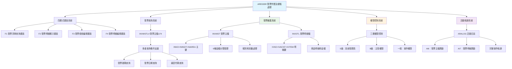
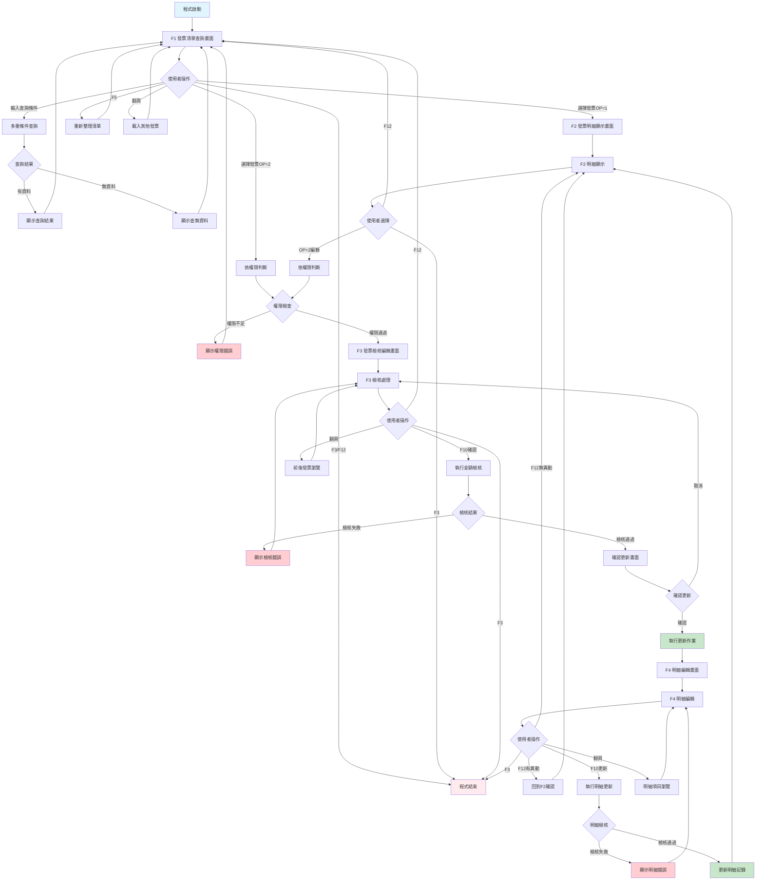
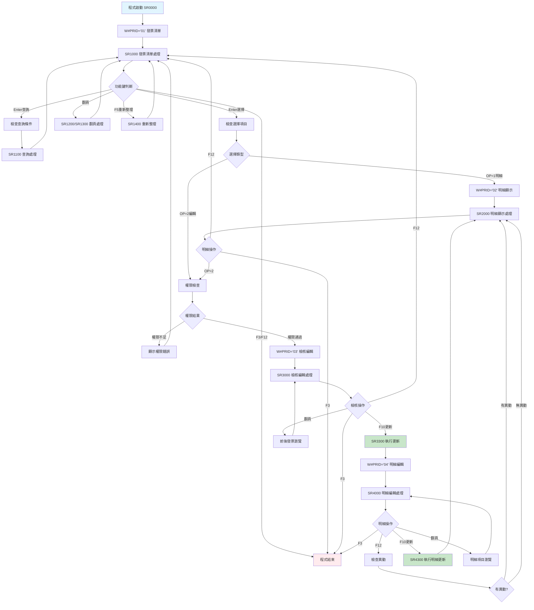
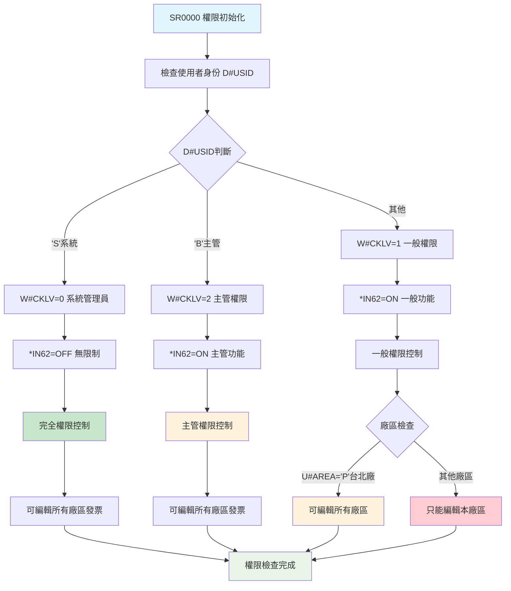
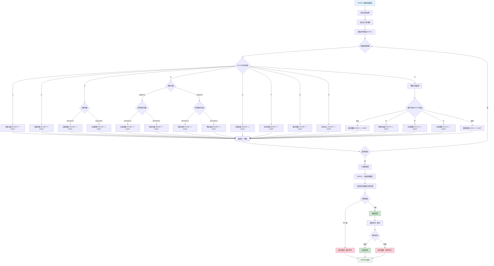
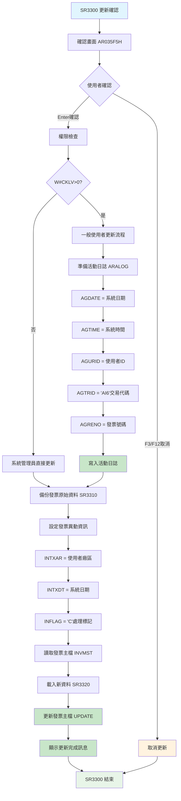

# ARE035R_P02 程式規格書

## 📋 基本資料

| 項目 | 內容 |
|------|------|
| **程式編號** | ARE035R |
| **程式名稱** | 發票作業及總帳處理程式 |
| **程式類型** | RPG/400 |
| **系統名稱** | 應收帳款管理系統 (AR) |
| **子系統** | 發票資料維護管理子系統 |
| **廠區** | P02 |
| **開發人員** | S02CLJ |
| **建立日期** | 1986/03/29（歷史程式）|
| **主要修改** | 1990/06/01 (S02YSH), 1999/08/23 (9908A), 2000/05/04 (0005A), 2001/05/16 (0105A), 2015/09/18 (0409A) |
| **程式路徑** | `P02RPGSRC_THSRC/ARE035R.txt` |

## 📖 程式功能說明

### 主要功能
ARE035R是**發票作業及總帳處理的核心維護程式**，專門負責發票資料的全方位管理和處理，主要功能包括：

1. **發票主檔瀏覽與查詢**：提供多重查詢條件的發票清單瀏覽
2. **發票明細維護管理**：完整的發票明細資料編輯和維護
3. **發票資料檢核處理**：智能的發票金額和稅別檢核機制
4. **權限分級管理控制**：三層次使用者權限控制系統
5. **活動軌跡追蹤記錄**：完整的操作日誌和異動追蹤
6. **總帳介面整合處理**：與總帳系統的資料同步機制
7. **多類型金額分類處理**：支援9種不同類型的金額分類
8. **扣繳稅額專業處理**：完整的扣繳稅額計算和管理

### 業務流程說明
此程式是**發票管理系統的中央控制平台**，處理企業發票管理的完整生命週期：
- **多維度查詢系統**：支援發票號碼、發票日期、廠區等多重查詢
- **四層式操作介面**：F1查詢→F2明細→F3檢核→F4編輯的漸進式流程
- **智能權限控制**：S級（系統）、B級（主管）、一般級的三層權限控制
- **完整資料檢核**：金額平衡檢核、稅別一致性檢核、扣繳處理檢核
- **專業稅務處理**：支援多種稅別代碼和扣繳稅額的專業處理
- **活動日誌完整性**：AI6/AI7交易代碼的完整操作軌跡記錄

### 歷史修改記錄
- **1986/03/29**：初始版本建立（S02CLJ開發）
- **1990/06/01**：功能性增強（S02YSH修改）
- **1999/08/23 (2010AR517)**：P02版本系統優化（S00WCJ修改）
- **2000/05/04 (0005A)**：異動日期欄位擴充至8位
- **2001/05/16 (0105A)**：批准日期欄位擴充至8位
- **2015/09/18 (2015AR953, 0409A)**：稅別代碼擴充至3位和5位支援

## 🗂️ 檔案架構與關聯圖

### 使用檔案清單

| 檔案名稱 | 檔案類型 | 使用方式 | 說明 |
|---------|---------|---------|------|
| **ARE035S** | DSPF | 讀寫 | 四層式作業畫面檔案 |
| **INVMSTL4** | LF | 讀取 | 發票主檔邏輯檔案4（查詢用）|
| **INVMST** | PF | 讀寫更新 | 發票主檔（主要維護檔案）|
| **INVDTL** | PF | 讀寫更新 | 發票明細檔（明細維護檔案）|
| **ARALOG** | PF | 新增 | 活動日誌檔（軌跡記錄）|

### 檔案關聯視覺化圖表



### 資料流向說明

1. **查詢階段**：從INVMSTL4讀取符合條件的發票清單
2. **顯示階段**：透過INVMST和INVDTL顯示完整發票資訊
3. **檢核階段**：執行金額平衡、稅別一致性等多重檢核
4. **更新階段**：根據權限控制更新INVMST和INVDTL
5. **記錄階段**：在ARALOG記錄完整的操作軌跡

## 📊 檔案欄位規格說明

### ARE035S 畫面檔案系統

#### F1 發票清單查詢畫面格式
```
┌─────────────────────────────────────────────────────────────────────────────┐
│ 08/23/99      東森鋼鐵股份有限公司                          ARE035S-1       │
│ P02USER                      發票作業及總帳處理                     14:35:20│
│                                                                             │
│ 發票號碼：[__________] 發票日期：[______] 廠區：[_]                         │
│                                                                             │
│ OP 廠區 類型 發票號碼      發票日期  種類 作廢  銷貨金額      營業稅額      │
│ ---------------------------------------------------------------------------│
│ [_] P02   1  IV12300001   990815    1     D   1,000,000      50,000      │
│ [_] P02   2  IV12300002   990816    2         1,250,000      62,500      │
│ [_] P02   1  IV12300003   990817    1           800,000      40,000      │
│                                                                             │
│ 1=明細 2=編輯                                                               │
│                                                                             │
│ F3=結束 F5=重新整理 F12=取消 ROLLUP=下頁 ROLLDOWN=上頁 ENTER=選擇          │
│ [錯誤訊息顯示區域]                                                          │
└─────────────────────────────────────────────────────────────────────────────┘
```

#### F2 發票明細顯示畫面格式
```
┌─────────────────────────────────────────────────────────────────────────────┐
│ 08/23/99      東森鋼鐵股份有限公司                          ARE035S-2       │
│ P02USER                      發票作業及總帳處理                     14:35:20│
│                                                                             │
│ 客戶：100001 東鋼企業股份有限公司  訂單：SA123001                           │
│ 發票：IV12300001 類型：1 日期：990815 稅別：1 種類：1                       │
│ 銷貨：東鋼鋼材事業部  收款：P02                                             │
│                                                                             │
│ OP 作廢 科目 項次    商品名稱        數量      單價        金額             │
│ ---------------------------------------------------------------------------│
│ [_]     1    001     鋼板產品        100     8,000     800,000            │
│ [_]  D  5    002     營業稅           1    40,000      40,000            │
│                                                                             │
│ 2=編輯                                                                      │
│                                                                             │
│ F3=結束 F12=回上頁 ENTER=執行                                              │
│ [錯誤訊息顯示區域]                                                          │
└─────────────────────────────────────────────────────────────────────────────┘
```

#### F3 發票檢核編輯畫面格式
```
┌─────────────────────────────────────────────────────────────────────────────┐
│ 08/23/99      東森鋼鐵股份有限公司                          ARE035S-3       │
│ P02USER                      發票作業及總帳處理                     14:35:20│
│                                                                             │
│ 發票號碼：IV12300001                                                        │
│ 銷貨金額：  1,000,000  營業稅額：    50,000  預收金額：   200,000         │
│ 折讓金額：     50,000  折讓稅額：     2,500  預收退還：         0         │
│ 呆帳金額：          0  利息金額：         0  其他金額：         0         │
│ 總餘額：   1,302,500                                                       │
│ 扣繳金額：     20,000                                                      │
│                                                                             │
│ 計算檢核：銷貨+稅額+預收+折讓+呆帳+利息+其他 = 總餘額                       │
│ 檢核結果：✓ 金額平衡正確                                                   │
│                                                                             │
│ F10=確認更新 F12=取消 ENTER=重新計算                                       │
│ [錯誤訊息顯示區域]                                                          │
└─────────────────────────────────────────────────────────────────────────────┘
```

### INVMST 發票主檔

| 欄位名稱 | 資料型態 | 長度 | 說明 | 特殊處理 |
|---------|---------|------|------|---------|
| **INFLAG** | CHAR | 1 | 處理旗標 | 🎯'C'=處理,'D'=刪除 |
| **INNO** | CHAR | 10 | 發票號碼 | 🔑主要識別 |
| **INTYPE** | CHAR | 1 | 發票類型 | 📝1=一般,2=預開 |
| **INDECD** | CHAR | 1 | 作廢控制 | 🎯'D'=作廢 |
| **INDEDT** | NUMERIC | 8,0 | 作廢日期 | 📅8位元日期 |
| **INCUNO** | CHAR | 6 | 客戶編號 | 🏢客戶關聯 |
| **INCUNM** | CHAR | 24 | 客戶名稱 | 🏢客戶資訊 |
| **INORNO** | CHAR | 6 | 訂單號碼 | 🔗訂單關聯 |
| **ININDT** | NUMERIC | 8,0 | 發票日期 | 📅開立日期 |
| **INKIND** | CHAR | 1 | 發票種類 | 📝1=內銷,2=外銷 |
| **INRVID** | CHAR | 2 | 收款員 | 👤收款人員 |
| **INSALE** | CHAR | 2 | 銷貨員 | 👤銷售人員 |
| **INSATP** | CHAR | 1 | 銷貨類型 | 📝銷貨分類 |
| **INAREA** | CHAR | 1 | 開立廠區 | 🏭廠區標識 |
| **INTXTP** | CHAR | 1 | 稅別 | 📊稅務分類 |
| **INAAMT** | NUMERIC | 11,2 | 銷貨金額 | 💰主要金額 |
| **INATAX** | NUMERIC | 11,2 | 營業稅額 | 💰稅額 |
| **INBAMT** | NUMERIC | 11,2 | 預收金額 | 💰預收款 |
| **INCAMT** | NUMERIC | 11,2 | 折讓金額 | 💰折讓 |
| **INCTAX** | NUMERIC | 11,2 | 折讓稅額 | 💰折讓稅 |
| **INDAMT** | NUMERIC | 11,2 | 預收退還 | 💰退還金額 |
| **INDTAX** | NUMERIC | 11,2 | 預收稅退還 | 💰退還稅額 |
| **INEAMT** | NUMERIC | 11,2 | 呆帳金額 | 💰呆帳 |
| **INFAMT** | NUMERIC | 11,2 | 其他金額 | 💰其他 |
| **INNBAL** | NUMERIC | 11,2 | 總餘額 | 💰總計金額 |
| **INMAMT** | NUMERIC | 11,2 | 扣繳金額 | 💰扣繳稅額 |
| **INAPNO** | CHAR | 7 | 批准文號 | 📝政府批准 |
| **INAPDT** | NUMERIC | 8,0 | 批准日期 | 📅8位元日期 |
| **INRCNO** | CHAR | 6 | 收據號碼 | 📝收據關聯 |
| **INRCDT** | NUMERIC | 8,0 | 收據日期 | 📅8位元日期 |
| **INFL01** | CHAR | 1 | 旗標1 | 🎯特殊標記 |
| **INTXAR** | CHAR | 1 | 異動廠區 | 🏭操作廠區 |
| **INTXDT** | NUMERIC | 8,0 | 異動日期 | 📅最後異動 |
| **INPRTC** | CHAR | 1 | 列印控制 | 🖨️列印狀態 |
| **INRESV** | CHAR | 6 | 保留欄位 | 📝預留使用 |

### INVDTL 發票明細檔

| 欄位名稱 | 資料型態 | 長度 | 說明 | 特殊處理 |
|---------|---------|------|------|---------|
| **IVFLAG** | CHAR | 1 | 處理旗標 | 🎯'C'=處理,'D'=刪除 |
| **IVNO** | CHAR | 10 | 發票號碼 | 🔑發票關聯 |
| **IVACNT** | CHAR | 1 | 科目代碼 | 📊會計科目 |
| **IVITEM** | NUMERIC | 3,0 | 項次 | 🔢明細序號 |
| **IVACDT** | NUMERIC | 8,0 | 科目日期 | 📅8位元日期 |
| **IVORNO** | CHAR | 9 | 訂單號碼 | 🔗訂單關聯 |
| **IVPDCD** | CHAR | 5 | 商品代碼 | 📦商品識別 |
| **IVQTY** | NUMERIC | 7,2 | 數量 | 📊商品數量 |
| **IVUPRC** | NUMERIC | 8,3 | 單價 | 💰單位價格 |
| **IVAMT** | NUMERIC | 11,2 | 金額 | 💰明細金額 |
| **IVDECD** | CHAR | 1 | 作廢控制 | 🎯'D'=作廢 |
| **IVDEDT** | NUMERIC | 8,0 | 作廢日期 | 📅8位元日期 |
| **IVAPNO** | CHAR | 8 | 批准文號 | 📝詳細批准 |
| **IVACNO** | CHAR | 7 | 科目號碼 | 📊會計編號 |
| **IVFL01** | CHAR | 1 | 旗標1 | 🎯特殊用途1 |
| **IVFL02** | CHAR | 1 | 旗標2 | 🎯特殊用途2 |
| **IVFL03** | CHAR | 1 | 旗標3 | 🎯'K'=扣繳項目 |
| **IVTXAR** | CHAR | 1 | 異動廠區 | 🏭操作廠區 |
| **IVTXDT** | NUMERIC | 8,0 | 異動日期 | 📅最後異動 |
| **IVRESV** | CHAR | 5 | 保留欄位 | 📝預留使用 |

### ARALOG 活動日誌檔

| 欄位名稱 | 資料型態 | 長度 | 說明 | 特殊處理 |
|---------|---------|------|------|---------|
| **AGDATE** | NUMERIC | 6,0 | 異動日期 | 📅操作日期 |
| **AGTIME** | NUMERIC | 6,0 | 異動時間 | ⏰操作時間 |
| **AGURID** | CHAR | 3 | 使用者ID | 👤操作者 |
| **AGTRID** | CHAR | 3 | 交易代碼 | 🎯AI6/AI7 |
| **AGRENO** | CHAR | 10 | 相關號碼 | 🔗發票號碼 |
| **AGCGCA** | CHAR | 1 | 異動原因 | 📝異動說明 |

### 欄位切割視覺化

```
發票金額分類架構：
┌─────────────────────────────────────────┐
│ 主要金額類別                              │
│ ├─ INAAMT = 銷貨金額（主要收入）          │
│ ├─ INATAX = 營業稅額（銷項稅額）          │
│ ├─ INBAMT = 預收金額（預收款項）          │
│ └─ INNBAL = 總餘額（計算結果）            │
└─────────────────────────────────────────┘
          ↓
┌─────────────────────────────────────────┐
│ 調整金額類別                              │
│ ├─ INCAMT = 折讓金額（銷貨折讓）          │
│ ├─ INCTAX = 折讓稅額（折讓稅額）          │
│ ├─ INDAMT = 預收退還（退還款項）          │
│ ├─ INDTAX = 預收稅退還（退還稅額）        │
│ ├─ INEAMT = 呆帳金額（壞帳損失）          │
│ ├─ INFAMT = 其他金額（雜項收入）          │
│ └─ INMAMT = 扣繳金額（扣繳稅額）          │
└─────────────────────────────────────────┘

發票明細科目分類：
┌─────────────────────────────────────────┐
│ IVACNT科目代碼分類                        │
│ ├─ '1' = 銷貨科目                        │
│ ├─ '2' = 折讓科目                        │
│ ├─ '3' = 運費科目（K=扣繳項目）           │
│ ├─ '4' = 預收科目（正負值判斷）           │
│ ├─ '5' = 稅額科目（多稅別支援）           │
│ ├─ '6' = 呆帳科目                        │
│ ├─ '7' = 其他科目                        │
│ ├─ '8' = 雜項科目                        │
│ └─ '9' = 其他收入                        │
└─────────────────────────────────────────┘

權限控制機制：
┌─────────────────────────────────────────┐
│ D#USID='S' → W#CKLV=0 → 系統管理員        │
│ D#USID='B' → W#CKLV=2 → 主管權限          │
│ 其他       → W#CKLV=1 → 一般權限          │
│                                         │
│ 跨廠區控制：                              │
│ W#CKLV=1 AND U#AREA='P' → 台北廠可編輯    │
│ W#CKLV>0 AND INAREA≠U#AREA → 權限限制    │
└─────────────────────────────────────────┘
```

## 🖥️ 輸出/入螢幕布局

### 畫面流程圖



### 功能鍵定義

#### F1 發票清單查詢畫面
| 功能鍵 | 說明 | 處理邏輯 |
|--------|------|---------|
| **F3** | 結束作業 | 結束程式執行 |
| **F5** | 重新整理 | 重新載入發票清單 |
| **F12** | 取消作業 | 結束程式執行 |
| **ROLLUP(91)** | 下頁 | 載入下一批發票資料 |
| **ROLLDOWN(92)** | 上頁 | 回到上一批發票資料 |
| **Enter** | 確認選擇 | 處理選擇的發票 |

#### F2 發票明細顯示畫面
| 功能鍵 | 說明 | 處理邏輯 |
|--------|------|---------|
| **F3** | 結束程式 | 直接結束程式 |
| **F12** | 回上頁 | 回到F1發票清單 |
| **Enter** | 執行選項 | 根據OP執行對應功能 |

#### F3 發票檢核編輯畫面
| 功能鍵 | 說明 | 處理邏輯 |
|--------|------|---------|
| **F3** | 結束程式 | 直接結束程式 |
| **F10** | 確認更新 | 執行發票主檔更新 |
| **F12** | 回上頁 | 回到F1發票清單 |
| **ROLLUP(91)** | 下一發票 | 瀏覽下一張發票 |
| **ROLLDOWN(92)** | 上一發票 | 瀏覽上一張發票 |
| **Enter** | 重新計算 | 重新執行金額檢核 |

#### F4 發票明細編輯畫面
| 功能鍵 | 說明 | 處理邏輯 |
|--------|------|---------|
| **F3** | 結束程式 | 直接結束程式 |
| **F10** | 確認更新 | 執行發票明細更新 |
| **F12** | 回上頁 | 回到F2明細顯示（檢查是否有異動）|
| **ROLLUP(91)** | 下一明細 | 瀏覽下一筆明細 |
| **ROLLDOWN(92)** | 上一明細 | 瀏覽上一筆明細 |
| **Enter** | 重新計算 | 重新執行明細檢核 |

## ⚙️ 處理流程程序說明

### 🎯 主要程序流程

#### 程式主控迴圈


### 🎯 權限控制檢查流程 (SR0000)

#### 三層權限控制機制


### 🎯 發票金額檢核流程 (SR3200)

#### 九類金額分類檢核機制


### 🎯 發票更新處理流程 (SR3300)

#### 活動日誌記錄機制


## 🔧 技術特點分析

### 程式設計特色

1. **🎯 四層式漸進操作設計**
   - **查詢層**：F1提供多重條件的發票清單查詢
   - **顯示層**：F2顯示完整的發票和明細資訊
   - **檢核層**：F3執行金額檢核和主檔編輯
   - **編輯層**：F4提供明細項目的詳細編輯

2. **📊 三層權限控制架構**
   - **系統管理員**：W#CKLV=0，完全權限，無廠區限制
   - **主管權限**：W#CKLV=2，管理權限，可跨廠區操作
   - **一般權限**：W#CKLV=1，基本權限，廠區限制（P廠例外）

3. **🔍 九類金額智能分類**
   - **主要收入**：銷貨金額(1,8,9)、稅額(5)
   - **調整項目**：折讓金額(2,3非K)、預收(4)
   - **特殊項目**：扣繳(3K)、呆帳(6)、其他(7)
   - **自動計算**：總餘額 = 各類金額總和

4. **🏭 完整的軌跡追蹤**
   - **操作記錄**：ARALOG記錄所有異動操作
   - **交易代碼**：AI6(主檔異動)、AI7(明細異動)
   - **時間戳記**：精確的日期時間記錄
   - **使用者追蹤**：完整的操作者身份記錄

### 錯誤處理機制

#### 完整錯誤訊息對照表 (11種錯誤類型)

| 錯誤編號 | 錯誤訊息 | 觸發條件 | 處理建議 |
|---------|---------|---------|---------|
| **ERR,1** | 查無資料！ | 無符合條件發票 | 確認查詢條件 |
| **ERR,2** | 資料已到檔尾！ | 翻頁到最後 | 使用上翻功能 |
| **ERR,3** | 資料已到檔頭！ | 翻頁到最前 | 使用下翻功能 |
| **ERR,4** | 此發票非本廠區所開立，無法修改 | 廠區權限錯誤 | 確認廠區歸屬 |
| **ERR,5** | 此發票明細的數量和單價相乘結果與金額不符，請檢查 | 明細計算錯誤 | 檢查數量單價金額 |
| **ERR,6** | 資料已經修改完畢 | 更新完成訊息 | 確認更新成功 |
| **ERR,7** | 資料已到本發票明細的最後一筆 | 明細翻頁結束 | 使用上翻功能 |
| **ERR,8** | 資料已到本發票明細的第一筆 | 明細翻頁開始 | 使用下翻功能 |
| **ERR,9** | 發票各項總計之結果與原儲存不同，檢查無誤請重新存檔 | 金額檢核失敗 | 重新檢查金額計算 |
| **ERR,10** | 此發票稅別為免稅，但發票明細有稅，請檢查 | 稅別不一致 | 檢查稅別設定 |
| **ERR,11** | 此發票明細已申報扣繳，無法修改，請先取消申報處理 | 扣繳限制 | 取消扣繳申報 |

### 跨廠區功能差異分析

| 功能特性 | P02 (1069行) | H05 (超時) | K02 (超時) | U01 (1066行) | 差異說明 |
|---------|-------------|-----------|-----------|-------------|---------|
| **基礎維護功能** | ✅ | ✅ | ✅ | ✅ | 完全相同 |
| **四層式畫面** | ✅ | ✅ | ✅ | ✅ | 相同架構 |
| **權限控制系統** | ✅ | ✅ | ✅ | ✅ | 相同邏輯 |
| **系統日期處理** | *DATE計算 | *DATE計算 | *DATE計算 | U#SYSD預算 | U01使用預算日期 |
| **稅別代碼支援** | 5位元 2015/09/18 | 未知 | 未知 | 5位元 2015/01/22 | 都支援5位元 |
| **更新歷史** | 2015/09/18 (0409A) | 未確認 | 未確認 | 2015/01/22 (0401A) | P02較新 |
| **程式行數** | 1069行 | 未確認 | 未確認 | 1066行 | P02最完整 |
| **特殊功能** | 完整邏輯 | 標準邏輯 | 標準邏輯 | 預算日期整合 | P02為標準版 |

## 📝 重要商業邏輯摘要

### 核心業務規則

1. **九類金額分類系統**：完整的發票金額分類和自動計算機制
2. **三層權限控制機制**：系統、主管、一般三層權限的精密控制
3. **廠區歸屬嚴格控制**：除台北廠外，只能處理本廠區發票
4. **金額平衡檢核機制**：總餘額必須等於各分類金額總和
5. **稅別一致性檢核**：發票稅別與明細稅額的一致性驗證
6. **扣繳稅額專業處理**：IVFL03='K'的扣繳項目特殊處理
7. **完整軌跡記錄機制**：AI6/AI7交易代碼的詳細操作記錄

### 關鍵業務流程

1. **標準查詢流程**：
   - 多重條件發票查詢
   - 分頁瀏覽和排序
   - 實時資料重新整理

2. **發票維護流程**：
   - 權限驗證和廠區檢查
   - 發票主檔資料編輯
   - 金額檢核和平衡驗證
   - 活動日誌記錄

3. **明細編輯流程**：
   - 明細項目逐筆編輯
   - 數量單價金額檢核
   - 扣繳稅額特殊處理
   - 科目分類自動歸納

4. **檢核驗證流程**：
   - 九類金額自動分類
   - 總餘額平衡檢核
   - 稅別一致性驗證
   - 扣繳申報狀態檢查

### 系統整合要點

1. **與總帳系統整合**：提供完整的會計科目分類和金額資訊
2. **與稅務系統整合**：支援多種稅別和扣繳稅額的專業處理
3. **與權限系統整合**：完整的使用者權限和廠區控制整合
4. **與軌跡系統整合**：詳細的操作軌跡和活動日誌記錄

### P02版本特殊價值

1. **最新功能實現**：2015/09/18是最新的功能完整版
2. **程式行數最多**：1069行為各廠區中最完整的實現
3. **稅別支援最完整**：支援最新的5位元稅別代碼處理
4. **標準版本地位**：其他廠區都基於P02版本進行調整

### 重要設計模式

1. **State Machine Pattern**：四層式畫面的狀態轉換機制
2. **Strategy Pattern**：根據權限級別採用不同的操作策略
3. **Observer Pattern**：資料異動時同步更新軌跡記錄
4. **Template Method Pattern**：主檔和明細使用相同的更新模板
5. **Factory Pattern**：根據科目代碼工廠化產生金額分類

### 九類金額分類商業邏輯

```
金額分類處理矩陣：

IVACNT → 金額歸類 → 檢核規則
  '1'  → INAAMT   → 主要銷貨收入
  '2'  → INCAMT   → 銷貨折讓調整
  '3K' → S#GAMT   → 扣繳稅額（特殊）
  '3'  → INCAMT   → 運費折讓
  '4-' → INCAMT/INBAMT → 預收退還/預收
  '4+' → INAAMT/INDAMT → 預開發票/預收退還
  '5'  → 多稅別分類 → 依IVPDCD細分
  '6'  → INEAMT   → 呆帳損失
  '7'  → INFAMT   → 其他收入
  '8'  → INAAMT   → 雜項收入
  '9'  → INAAMT   → 其他銷貨
```

### 權限控制商業規則

```
權限控制決策樹：

D#USID判斷 → W#CKLV設定 → 操作權限
    'S'    →    0      → 無限制（系統）
    'B'    →    2      → 主管權限
   其他    →    1      → 一般權限

廠區控制：
W#CKLV=0 → 無廠區限制
W#CKLV>0 + U#AREA='P' → 台北廠特權
W#CKLV>0 + INAREA≠U#AREA → 權限拒絕
```

此程式體現了**「企業級發票管理系統」**的理念，透過四層式漸進操作介面，提供完整的發票生命週期管理，並透過三層權限控制確保資料安全性，結合九類金額智能分類和完整的軌跡記錄，是企業財務管理系統中發票處理的專業典範。 