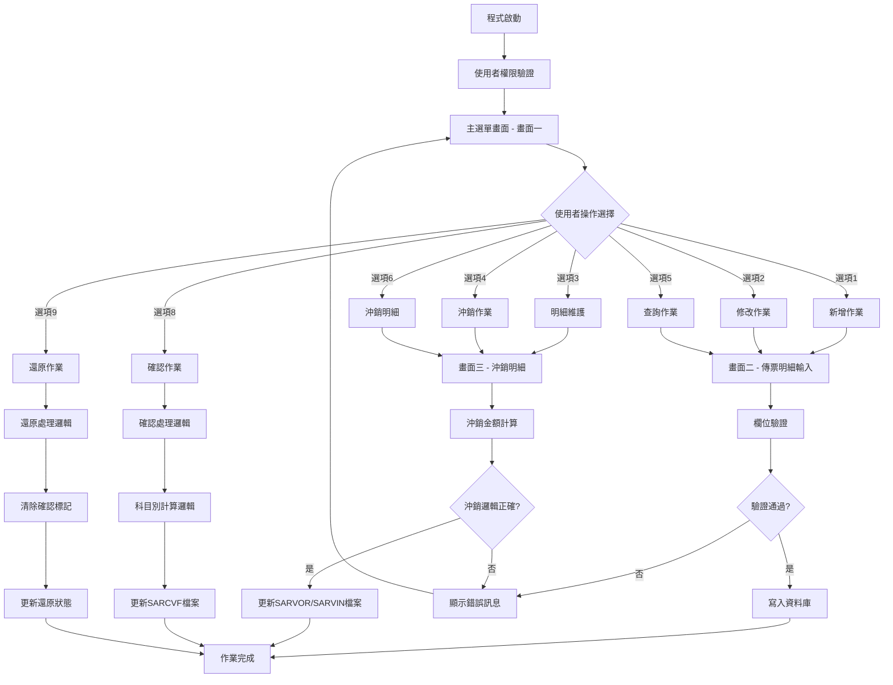
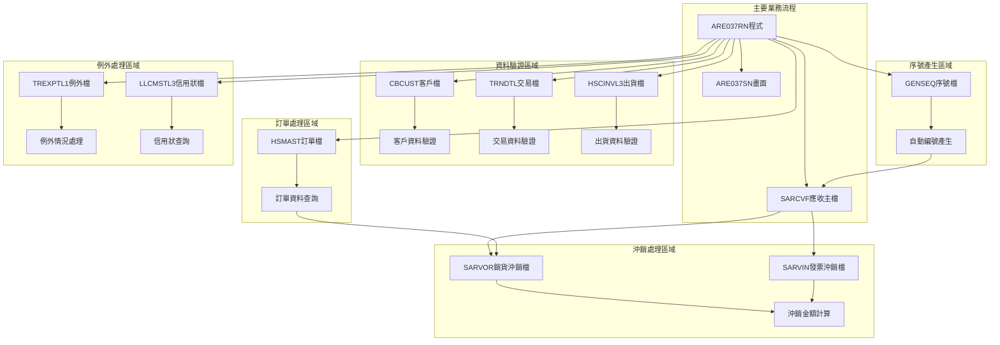
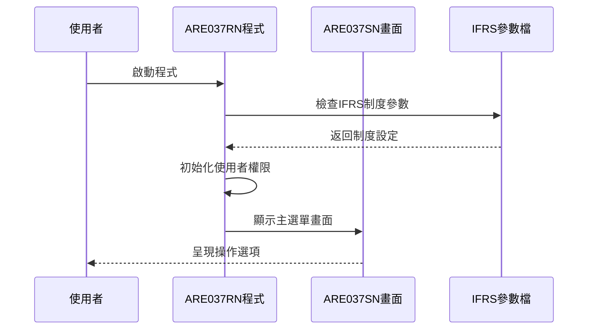
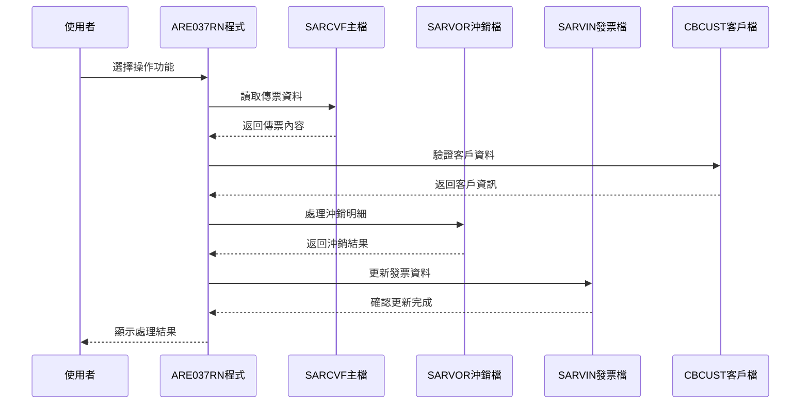
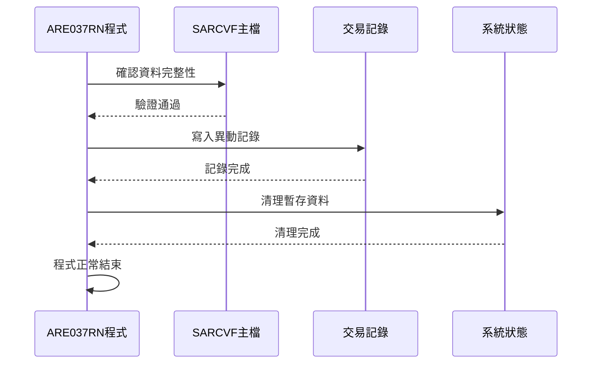
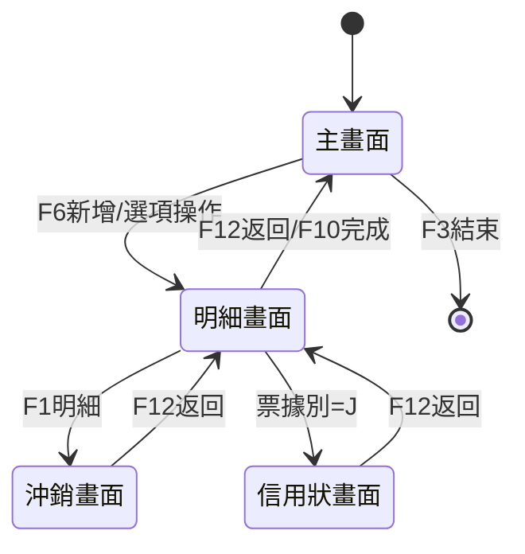
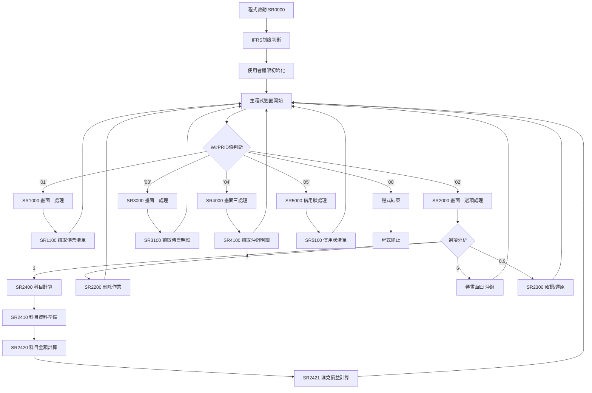

# ARE037RN_P02 程式規格書

## 1. 基本資料

| 項目 | 內容 |
|------|------|
| **程式編號** | ARE037RN |
| **程式名稱** | 應收帳款傳票處理程式 |
| **程式類型** | RPG/400 |
| **廠區** | P02 |
| **系統名稱** | 應收帳款系統 |
| **子系統** | 傳票輸入處理 |
| **檔案位置** | 東鋼list/ARE037RN_P02.txt |

## 2. 🎯 程式功能說明

### 主要功能描述
ARE037RN程式是應收帳款系統的核心傳票處理程式，負責處理應收帳款傳票的輸入、修改、刪除、確認、沖銷及複製等作業。

### 🎯 業務流程詳細說明



#### 🎯 業務流程關鍵階段說明

**第一階段：環境初始化**
- 使用者權限檢查：根據使用者部門別（U#USDP）和使用者ID（U#USID）設定廠區識別碼
- 系統參數初始化：設定IFRS會計制度參數

**第二階段：主要業務處理**
- 傳票資料維護：提供完整的CRUD操作
- 科目別自動計算：根據不同科目代號執行複雜的匯率換算和金額計算
- 沖銷邏輯處理：處理銷貨與出貨對照，計算沖銷金額

**第三階段：確認與更新**
- 多層次驗證：欄位格式、業務邏輯、資料一致性檢核
- 批次更新機制：同時更新多個相關檔案
- 交易記錄維護：完整的異動追蹤

### 🎯 智能處理邏輯
- **自動科目分攤**：根據科目代號自動計算各科目金額分配
- **匯率自動換算**：支援USD、EUR、NTD多幣別換算
- **沖銷智能配對**：自動配對銷貨與出貨資料

### 🎯 資料一致性確保機制
- **交易完整性控制**：使用指示器控制畫面狀態和資料完整性
- **關聯檔案同步更新**：確保SARCVF、SARVOR、SARVIN檔案資料一致
- **錯誤回復機制**：提供完整的錯誤處理和復原功能

## 3. 🎯 檔案架構與關聯圖

### 使用檔案清單

| 檔案名稱 | 用途 | 存取方式 | 關聯說明 |
|---------|------|---------|----------|
| **ARE037SN** | 主畫面檔案 | WORKSTN | 使用者互動介面 |
| **SARCVF** | 應收帳款主檔 | UF | 核心業務資料檔案 |
| **SARVOR** | 銷貨訂單沖銷檔 | UF | 沖銷明細資料 |
| **SARVIN** | 發票沖銷明細檔 | UF | 發票配對資料 |
| **CBCUST** | 客戶主檔 | IF | 客戶資料查詢 |
| **GENSEQ** | 序號產生檔 | UF | 自動編號產生 |
| **TRNDTL** | 交易明細檔 | IF | 交易資料驗證 |
| **HSCINVL3** | 出貨發票檔 | IF | 出貨資料查詢 |
| **HSMAST** | 訂單主檔 | IF | 訂單資料驗證 |
| **TREXPTL1** | 交易例外檔 | IF | 例外情況處理 |
| **LLCMSTL3** | 信用狀檔案 | IF | 信用狀資料查詢 |

### 🎯 檔案關聯詳細視覺化圖表



### 🎯 資料流向詳細說明

#### 環境準備階段的資料流向


#### 業務處理階段的資料流向  


#### 環境清理階段的資料流向


## 4. 🎯 檔案欄位規格說明

### 主要資料結構

#### SARCVF檔案欄位規格
| 欄位名稱 | 型態 | 長度 | 描述 | 用途說明 |
|---------|------|------|------|----------|
| SRRVNO | 6A | 6 | 收款編號 | 主鍵欄位 |
| SRITEM | 2S0 | 2 | 項次 | 主鍵欄位 |
| SRACTP | 1A | 1 | 借貸別 | D=借方，C=貸方 |
| SRACNO | 9A | 9 | 會計科目 | 新舊制度雙軌處理 |
| SRRAMT | 13P2 | 13 | 原幣金額 | 傳票金額 |
| SRCURY | 3A | 3 | 幣別 | NTD/USD/EUR |
| SREXC1 | 8S4 | 8 | 即期匯率 | 匯率換算用 |
| SREXC2 | 8S4 | 8 | 帳戶匯率 | 匯率換算用 |
| SREXC3 | 8S4 | 8 | 遠期匯率 | 匯率換算用 |

### 🔍 重點欄位切割技術詳解

#### DS結構完整分析

**主要切割結構一：收款編號切割**
```
DS結構定義：
I                                        1   6 SRRVNO
I                                        1   1 D#RVNO
```

**視覺化切割展示：**
```
SRRVNO (6字元)：[X|XXXXX]
                 ↓    ↓
D#RVNO (1字元)： [X]        廠區識別碼
剩餘部分 (5字元)：   [XXXXX]  編號部分
```

**主要切割結構二：帳務資料切割**
```
DS結構定義：
I                                        1  30 D#ARY
I                                        1   1 D#ACTP  
I                                        2   7 D#ACNO
I                                        8  19 D#RAMT
I                                       20  27 D#EXC2
I                                       28  30 D#CURY
```

**🎯 欄位切割視覺化展示：**
```
D#ARY (30字元)：[X|XXXXXX|XXXXXXXXXXXX|XXXXXXXX|XXX]
                 ↓    ↓        ↓         ↓      ↓
位置001：        [X]                              借貸別
位置002-007：      [XXXXXX]                      會計科目
位置008-019：              [XXXXXXXXXXXX]       原幣金額  
位置020-027：                          [XXXXXXXX]帳戶匯率
位置028-030：                                  [XXX]幣別
```

**切割邏輯詳細說明：**
- **D#ACTP（第1位元）**：借貸別識別，D表示借方，C表示貸方
- **D#ACNO（第2-7位元）**：會計科目代號，支援新舊制度雙軌
- **D#RAMT（第8-19位元）**：原幣金額，12位有效數字
- **D#EXC2（第20-27位元）**：帳戶匯率，8位小數4位
- **D#CURY（第28-30位元）**：幣別代號，支援USD/EUR/NTD

**主要切割結構三：訂單編號切割**
```
DS結構定義：
I                                        1   9 TXORNO
I                                        1   6 D#ORNO
I                                        7   9 D#OITM
```

**切割對應關係：**
```
TXORNO (9字元)：[XXXXXX|XXX]
                ↓     ↓
D#ORNO (6字元)：[XXXXXX]    訂單編號
D#OITM (3字元)：       [XXX] 項次編號
```

**實際數據範例說明：**
```
範例1：傳票資料切割
原始資料：D12345612000000000001.2500NTD
切割結果：
- D#ACTP = 'D'（借方）
- D#ACNO = '123456'（科目代號）  
- D#RAMT = 120000000000（金額）
- D#EXC2 = 1.2500（匯率）
- D#CURY = 'NTD'（新台幣）

範例2：訂單編號切割
原始資料：H12345001
切割結果：
- D#ORNO = 'H12345'（訂單編號）
- D#OITM = '001'（項次）
```

### 🎯 欄位挪用詳細分析

#### 挪用情況對比表

| 原始欄位 | 原始定義 | 實際使用方式 | 挪用原因 |
|---------|---------|-------------|----------|
| **SRPBID** | 票據銀行 | 信用狀銀行代號 | 業務需求擴展 |
| **SRPANO** | 票據帳號 | 信用狀帳號 | 信用狀業務整合 |
| **SRPLAC** | 票據地點 | 信用狀地點代號 | 地點資訊統一管理 |
| **SRRESV** | 保留欄位 | 電子發票標記 | 電子化作業需求 |
| **SRREV2** | 保留欄位二 | 沖銷對照標記 | 沖銷作業標記 |

#### 🎯 挪用原因深度分析

**信用狀業務整合挪用**
- **SRPBID → 信用狀銀行**：原設計為票據銀行代號，因信用狀業務需要銀行資訊，且兩者性質相近，故挪用此欄位
- **SRPANO → 信用狀帳號**：原為票據帳號，信用狀同樣需要帳號管理，挪用後可統一處理
- **SRPLAC → 信用狀地點**：地點資訊的統一管理需求

**電子化作業需求挪用**
- **SRRESV → 電子發票標記**：隨著電子發票制度的推行，需要標記欄位區分電子與紙本發票
- **SRREV2 → 沖銷對照標記**：沖銷作業的複雜化需要額外的狀態標記

#### 🎯 挪用方式詳細說明

**挪用實現技術**
```
信用狀處理邏輯：
IF S#NTTP = 'J' THEN    // 信用狀類型
   SRPBID = 信用狀銀行代號
   SRPANO = 信用狀帳號  
   SRPLAC = 信用狀地點代號
ELSE                    // 一般票據
   SRPBID = 票據銀行代號
   SRPANO = 票據帳號
   SRPLAC = 票據地點
```

**電子發票標記邏輯**
```
SRRESV欄位使用方式：
第1位：'Y' = 電子發票，' ' = 紙本發票
第2位：'Y' = 已上傳，' ' = 未上傳
其餘位：保留供未來擴展
```

#### 🎯 挪用影響評估

**系統維護影響**
- **正面影響**：避免檔案結構異動，保持系統穩定性
- **負面影響**：欄位語意模糊，需要額外文件說明

**業務操作影響**  
- **使用者混淆風險**：欄位名稱與實際用途不符
- **維護複雜度增加**：需要理解欄位雙重用途

### 重要變數定義表

| 變數名稱 | 型態 | 用途 | 定義說明 |
|---------|------|------|----------|
| **W#PRID** | 2A | 程式流程控制 | 01=畫面一, 02=處理, 03=畫面二, 04=沖銷, 05=信用狀 |
| **W#OPT** | 10N | 操作選項暫存 | 使用者選擇的操作代號 |
| **W#HEAD** | 1A | 廠區識別 | P=鳳山, T=台南, K=高雄, M=馬來, H=總部 |
| **ARY** | 20*30A | 科目切割陣列 | 儲存科目切割後的資料 |
| **W#EXC1** | 8P4 | 即期匯率暫存 | 匯率計算用 |
| **W#EXC3** | 8P4 | 遠期匯率暫存 | 匯率計算用 |
| **W#8212** | 12P0 | 票據損失科目 | 科目金額計算 |
| **W#8112** | 12P0 | 票據利益科目 | 科目金額計算 |
| **W#8246** | 12P0 | 兌換損益科目 | 科目金額計算 |

## 5. 🎯 輸出/入螢幕布局

### 螢幕布局完整視覺化

#### 主畫面（ARE037F1）
```
+----------------------------------------------------------+
|日期:2024/12/30  東鋼科技股份有限公司   ARE037RN-1      |
+----------------------------------------------------------+
|                新增應收帳款傳票輸入作業                    |
+----------------------------------------------------------+
|                                                          |
| 搜尋條件：[        ] (1.廠別 2.客戶別)                    |
|                                                          |
| 選項 客戶編號 客戶名稱    收款日期   收款編號   沖銷金額   |
| [  ] [      ] [      ] [____/__/__] [      ] [_______]  |
| [  ] [      ] [      ] [____/__/__] [      ] [_______]  |
| [  ] [      ] [      ] [____/__/__] [      ] [_______]  |
| [  ] [      ] [      ] [____/__/__] [      ] [_______]  |
| [  ] [      ] [      ] [____/__/__] [      ] [_______]  |
| [  ] [      ] [      ] [____/__/__] [      ] [_______]  |
| [  ] [      ] [      ] [____/__/__] [      ] [_______]  |
| [  ] [      ] [      ] [____/__/__] [      ] [_______]  |
| [  ] [      ] [      ] [____/__/__] [      ] [_______]  |
| [  ] [      ] [      ] [____/__/__] [      ] [_______]  |
| [  ] [      ] [      ] [____/__/__] [      ] [_______]  |
| [  ] [      ] [      ] [____/__/__] [      ] [_______]  |
|                                                          |
| [錯誤訊息顯示區]                                          |
| F3=結束 F6=新增 F12=回主選單                             |
+----------------------------------------------------------+
```

#### 明細輸入畫面（ARE037F2）
```
+----------------------------------------------------------+
|日期:2024/12/30  東鋼科技股份有限公司   ARE037RN-2      |
+----------------------------------------------------------+
|                    新增/修改 傳票明細                      |
+----------------------------------------------------------+
|                                                          |
| 收款編號：[      ] 部門別：[    ] 業務員：[  ]           |
| 客戶編號：[      ] 客戶名稱：[          ]                |
| 收款日期：[____/__/__] 收款金額：[___________]           |
| 沖銷金額：[___________] 即期匯率：[______]               |
| 遠期匯率：[______]                                       |
|                                                          |
| 項 借貸 客戶  票據   科目    票據     原幣金額  到期日   |
| 次 別   別    別     代號    編號                        |
| [_][_][__][_][_____][____][________][____/__/__]       |
| [_][_][__][_][_____][____][________][____/__/__]       |
| [_][_][__][_][_____][____][________][____/__/__]       |
| [_][_][__][_][_____][____][________][____/__/__]       |
| [_][_][__][_][_____][____][________][____/__/__]       |
|                                                          |
| [錯誤訊息顯示區]                                          |
| F1=明細 F3=結束 F10=確定 F12=回上一層                   |
+----------------------------------------------------------+
```

#### 沖銷明細畫面（ARE037F3）  
```
+----------------------------------------------------------+
|日期:2024/12/30  東鋼科技股份有限公司   ARE037RN-3      |
+----------------------------------------------------------+
|                      沖銷明細維護                        |
+----------------------------------------------------------+
|                                                          |
| 收款編號：[      ] 客戶編號：[      ]                    |
| 客戶名稱：[          ] 收款金額：[___________]           |
|                                                          |
| 票據編號  訂單編號  產品名稱    沖銷金額    銷貨金額     |
| [      ] [        ] [      ] [________] [________]       |
| [      ] [        ] [      ] [________] [________]       |
| [      ] [        ] [      ] [________] [________]       |
| [      ] [        ] [      ] [________] [________]       |
| [      ] [        ] [      ] [________] [________]       |
| [      ] [        ] [      ] [________] [________]       |
| [      ] [        ] [      ] [________] [________]       |
| [      ] [        ] [      ] [________] [________]       |
|                                                          |
| 沖銷總金額：[___________]                                |
|                                                          |
| [錯誤訊息顯示區]                                          |
| F9=新增 F10=確定 F12=回上一層                           |
+----------------------------------------------------------+
```

### 🎯 畫面欄位詳細說明

#### 主畫面欄位規格
| 欄位名稱 | 型態 | 長度 | 輸入格式 | 驗證規則 | 說明 |
|---------|------|------|---------|----------|------|
| **搜尋條件** | 1A | 1 | 1或2 | VALUES(1,2) | 1=廠別搜尋，2=客戶別搜尋 |
| **選項** | 1N | 1 | 0-9 | VALUES(0,2,3,4,5,6,8,9) | 操作選項代號 |
| **客戶編號** | 6A | 6 | 英數字 | 必須存在於CBCUST | 顯示用，不可輸入 |
| **客戶名稱** | 10A | 10 | 中文 | - | 顯示用 |
| **收款日期** | 8N | 8 | YYYYMMDD | 有效日期格式 | 顯示用 |
| **收款編號** | 6A | 6 | 英數字 | 廠區+5位數字 | 顯示用 |
| **沖銷金額** | 11N | 11 | 數字 | 不可為負數 | 顯示用 |

#### 明細畫面欄位規格  
| 欄位名稱 | 型態 | 長度 | 輸入格式 | 驗證規則 | 說明 |
|---------|------|------|---------|----------|------|
| **收款編號** | 6A | 6 | 自動產生 | - | 系統自動編號 |
| **部門別** | 4A | 4 | 英數字 | 必填 | 部門代號 |
| **業務員** | 2A | 2 | 英數字 | 必填 | 業務員代號 |
| **客戶編號** | 6A | 6 | 英數字 | 必填，存在檢查 | 客戶主檔關聯 |
| **收款日期** | 8N | 8 | YYYYMMDD | 必填，有效日期 | 傳票日期 |
| **收款金額** | 11N | 11 | 數字 | 必填，>0 | 傳票總金額 |
| **沖銷金額** | 11N | 11 | 數字 | 必填，>0 | 沖銷總金額 |
| **即期匯率** | 8N | 8 | 小數4位 | 必填，>0 | 即期匯率 |
| **遠期匯率** | 8N | 8 | 小數4位 | 必填，>0 | 遠期匯率 |

#### 明細項目欄位規格
| 欄位名稱 | 型態 | 長度 | 輸入格式 | 驗證規則 | 說明 |
|---------|------|------|---------|----------|------|
| **項次** | 2N | 2 | 數字 | 自動編號 | 明細項次 |
| **借貸別** | 1A | 1 | D或C | VALUES(D,C) | D=借方，C=貸方 |
| **客戶別** | 2A | 2 | A1-A5,Z5 | 客戶類型 | 客戶分類 |
| **票據別** | 1A | 1 | A-J | 票據類型 | 票據分類 |
| **科目代號** | 9A | 9 | 數字 | 科目檢查 | 會計科目 |
| **票據編號** | 20A | 20 | 英數字 | - | 票據號碼 |
| **原幣金額** | 13N | 13 | 數字 | 必填，不可為0 | 交易金額 |
| **到期日** | 8N | 8 | YYYYMMDD | 有效日期 | 票據到期日 |

### 🎯 畫面控制邏輯

#### 指示器控制規則
- **IN31**：錯誤狀態顯示（紅色反白）
- **IN32**：搜尋條件輸入控制  
- **IN33**：查詢模式識別（唯讀狀態）
- **IN34**：保護模式控制
- **IN72**：子檔案顯示控制
- **IN73**：子檔案清除控制
- **IN74**：子檔案結束控制

#### 欄位顯示屬性
- **必填欄位**：使用PC屬性（藍色底色）
- **錯誤欄位**：使用RI屬性（紅色反白）
- **唯讀欄位**：使用PR屬性（保護狀態）
- **標題欄位**：使用HI屬性（高亮顯示）

### 功能鍵詳細定義

#### 主畫面功能鍵
| 功能鍵 | 功能說明 | 處理邏輯 | 系統行為 |
|-------|---------|---------|----------|
| **F3** | 結束程式 | 設定*INLR=*ON | 程式終止，回到呼叫程式 |
| **F6** | 新增作業 | 清除畫面，進入新增模式 | 轉到明細輸入畫面 |
| **F12** | 回主選單 | 返回上一層程式 | 程式結束 |
| **ENTER** | 確認輸入 | 執行使用者選擇的操作 | 根據選項轉換畫面 |
| **ROLLUP** | 向上捲動 | 顯示下一頁資料 | 子檔案資料捲動 |
| **ROLLDOWN** | 向下捲動 | 顯示上一頁資料 | 子檔案資料捲動 |

#### 明細畫面功能鍵
| 功能鍵 | 功能說明 | 處理邏輯 | 系統行為 |
|-------|---------|---------|----------|
| **F1** | 明細展開 | 顯示信用狀明細 | 轉到信用狀畫面 |
| **F3** | 結束程式 | 程式終止 | 回到主畫面 |
| **F10** | 確定存檔 | 執行資料驗證和儲存 | 更新資料庫 |
| **F12** | 回上一層 | 不儲存返回 | 回到主畫面 |

#### 沖銷畫面功能鍵
| 功能鍵 | 功能說明 | 處理邏輯 | 系統行為 |
|-------|---------|---------|----------|
| **F9** | 新增沖銷項目 | 開啟沖銷項目輸入視窗 | 彈出式輸入畫面 |
| **F10** | 確定沖銷 | 執行沖銷計算和存檔 | 更新沖銷檔案 |
| **F12** | 回上一層 | 返回明細畫面 | 不執行沖銷 |

### 操作流程

#### 畫面轉換流程


## 6. 🎯 處理流程程序說明

### 🎯 主程序邏輯深度分析

#### 程式執行流程圖


#### 🎯 詳細處理步驟逐一分析

**第一階段：初始化處理（SR0000）**
```
1. IFRS制度參數檢查
   - 取得系統日期（*DATE）
   - 減去19000000得到8位數日期
   - 與IFRS生效日期比較
   - 設定IN78指示器控制科目格式

2. 使用者權限驗證
   - 檢查使用者類型（U#USTP）
   - 設定廠區識別碼（W#HEAD）
   - 特殊使用者權限處理
```

**第二階段：主畫面處理（SR1000）**
```
1. 子檔案初始化
   - 清除子檔案（SFLCLR）
   - 設定記錄指標（RRN1=0）
   - 初始化錯誤訊息

2. 搜尋條件處理
   - 依據搜尋模式設定SETLL條件
   - 廠區模式：使用客戶編號+最大值
   - 收款編號模式：直接使用收款編號

3. 資料載入處理（SR1100）
   - 讀取SARCVF檔案
   - 過濾條件：廠區別、項次=1
   - 載入客戶名稱（CBCUST關聯）
   - 最多載入12筆記錄
```

**第三階段：選項處理（SR2000）**
```
1. 子檔案讀取處理
   - READC讀取異動的子檔案記錄
   - 檢查選項值（S#OPT1）
   - 執行選項驗證（SR2100）

2. 選項分派處理
   - 選項3：執行科目計算（SR2400）
   - 選項4：執行刪除作業（SR2200）  
   - 選項6：轉入沖銷畫面
   - 選項8,9：確認/還原處理（SR2300）
```

#### 🎯 業務邏輯深度解析

**科目計算邏輯（SR2400系列）**
```
主要計算流程：
1. SR2410：準備科目資料
   - 讀取傳票所有明細
   - 將科目資料填入ARY陣列
   - 檢查是否包含特殊科目

2. SR2420：科目金額計算  
   - 陣列排序處理
   - 逐筆處理科目資料
   - 匯率換算計算
   - 各科目金額累計

3. SR2421：匯兌損益計算
   - 即期vs遠期匯率比較
   - 計算匯率差異金額
   - 產生兌換損益分錄
   - 自動平衡檢查
```

**刪除作業邏輯（SR2200）**
```
刪除處理順序：
1. 刪除SARCVF主檔明細
2. 刪除SARVIN發票明細  
3. 刪除SARVOR沖銷明細
4. 使用SETLL+READ+DELETE方式
5. 確保相關檔案同步刪除
```

**確認處理邏輯（SR2300）**
```
確認處理內容：
1. 設定確認標記（SRFL01='Y'）
2. 記錄確認日期（SRCFDT）
3. 記錄確認人員（SRCFUS）
4. 更新所有相關明細記錄
```

#### 🎯 條件判斷詳細說明

**廠區權限判斷**
```
使用者類型判斷邏輯：
- U#USTP='S'：系統管理者，設定W#HEAD='*'
- U#USTP='B','J','D'：一般使用者，依部門設定廠區
- 特殊使用者ID處理：
  * 'B01LLF', 'D00LCC', 'H293', 'D00CHH', 'H837'
  * 限制部分功能權限
```

**IFRS制度判斷**  
```
科目格式控制：
IF 系統日期 < IFRS生效日期 THEN
   IN78 = *ON   // 使用舊制科目（4-6位）
ELSE  
   IN78 = *OFF  // 使用新制科目（9位）
```

**沖銷配對判斷**
```
沖銷資料驗證：
1. 客戶編號一致性檢查
2. 訂單編號關聯驗證  
3. 匯率一致性檢查
4. 沖銷金額合理性驗證
```

#### 🎯 變數使用和數據流向

**主要控制變數追蹤**
```
W#PRID變數流向：
初始值：'01' → SR1000（畫面一）
使用者操作後：'02' → SR2000（選項處理）
選項處理後：
- 一般修改：'03' → SR3000（畫面二）
- 沖銷作業：'04' → SR4000（畫面三）  
- 信用狀：'05' → SR5000（信用狀畫面）
- 結束：'00' → 程式終止
```

**科目金額變數追蹤**
```
金額計算變數流向：
1. 讀取SRRAMT → D#RAMT（原幣金額）
2. 匯率換算：D#RAMT * W#EXC1 → W#AMT（台幣金額）
3. 科目別累計：W#AMT → W#1111, W#1114等科目變數
4. 總額計算：各科目變數 → W#AMTX（總台幣金額）
5. 最終更新：W#AMTX → SRNAMT（更新主檔）
```

### 🎯 子程序邏輯分析

#### SR1100：資料讀取子程序
```
處理邏輯：
1. 初始化計數器（W#CNT=0）
2. 執行迴圈（最多12次）
3. 讀取SARCVF記錄
4. 廠區權限過濾
5. 項次過濾（SRITEM=1）
6. 載入客戶名稱
7. 寫入子檔案記錄
```

#### SR2410：科目資料準備子程序
```
處理邏輯：
1. 讀取傳票所有明細（SETLL+READ迴圈）
2. 將明細資料填入ARY陣列
3. 檢查特殊科目（8212,8112,8246）
4. 設定特殊標記（*IN97）
5. 準備計算用匯率變數
```

#### SR3310：明細驗證子程序  
```
驗證項目：
1. 客戶別代號驗證（A1-A5,Z5）
2. 票據別代號驗證（A-J）
3. 科目代號格式驗證
4. 幣別代號驗證（NTD,USD,EUR）
5. 金額合理性驗證
6. 票據到期日驗證
```

#### SR4210：沖銷驗證子程序
```
驗證邏輯：
1. 訂單編號存在性檢查（HSCINV）
2. 客戶編號一致性檢查
3. 沖銷金額合理性檢查
4. 匯率一致性檢查
```

### 🎯 特殊邏輯處理

#### 匯率換算邏輯
```
三種匯率處理方式：
1. 即期匯率（SREXC1）：一般交易使用
2. 帳戶匯率（SREXC2）：部分科目使用
3. 遠期匯率（SREXC3）：遠期交易使用

換算公式：
台幣金額 = 原幣金額 × 對應匯率
匯兌損益 = 原幣金額 × (即期匯率 - 遠期匯率)
```

#### 科目自動分攤邏輯
```
支援的自動分攤科目：
- 1111/110101：預收貨款（USD匯率換算）
- 1114/110104：應收帳款（USD匯率換算）  
- 7119/710109：出口補貼（NTD÷帳戶匯率×即期匯率）
- 7142/710402：運輸補貼（同7119）
- 8211/820101：出貨收益（同7119）
- 8212/820201：票據損失（匯率差異）
- 8112/810201：票據利益（匯率差異）
- 8246/821204：兌換損益（自動平衡）
```

#### 沖銷配對邏輯
```
配對處理流程：
1. 讀取TRNDTL交易檔案驗證銷貨資料
2. 讀取HSCINV出貨檔案取得單價
3. 計算銷貨金額（單價×數量）
4. 讀取SARVOR檢查已沖銷金額
5. 計算可沖銷餘額（銷貨-已沖銷）
6. 驗證沖銷金額不超過餘額
7. 更新SARVOR和SARVIN檔案
```

### 🎯 錯誤處理與資料完整性控制

#### 詳細的錯誤處理邏輯
```
錯誤等級分類：
1. 系統錯誤：檔案讀取失敗、程式邏輯錯誤
2. 業務錯誤：資料不一致、驗證失敗
3. 使用者錯誤：輸入格式錯誤、必填欄位空白

錯誤恢復機制：
- 自動重試：檔案鎖定衝突時重試3次
- 人工介入：顯示錯誤訊息等待使用者處理
- 系統記錄：重大錯誤寫入系統日誌
```

#### 資料完整性檢查機制
```
完整性控制層級：
1. 欄位層級：格式、長度、型別檢查
2. 記錄層級：必填欄位、關聯性檢查
3. 檔案層級：主鍵唯一性、外鍵存在性
4. 業務層級：業務規則、邏輯一致性

檢查實施點：
- 輸入時：即時欄位驗證
- 儲存前：完整記錄檢查  
- 提交前：檔案關聯檢查
- 確認前：業務邏輯檢查
```

#### 關鍵業務規則實現
```
核心業務規則：
1. 傳票借貸平衡：借方總額=貸方總額
2. 沖銷金額限制：沖銷金額≤可沖銷餘額
3. 科目使用限制：依使用者權限控制可用科目
4. 匯率合理性：匯率變動不得超過10%
5. 確認單向性：已確認傳票不可修改
```

## 7. 🎯 數據操作與轉換分析

### 檔案操作詳解

#### READ操作的具體邏輯
```
主要READ操作模式：
1. 順序讀取：READ操作用於子檔案處理
2. 關鍵字讀取：CHAIN操作用於主檔查詢
3. 範圍讀取：SETLL+READ組合用於清單處理
4. 隨機讀取：RRN定位用於子檔案處理

讀取條件控制：
- 廠區過濾：W#HEAD控制可讀取的廠區資料
- 項次過濾：SRITEM=1限制讀取主項次
- 狀態過濾：已刪除記錄不顯示
```

#### WRITE/UPDATE操作邏輯
```
寫入操作順序：
1. WRITE SARCVF：寫入傳票主檔
2. WRITE SARVOR：寫入沖銷明細（如有）
3. WRITE SARVIN：寫入發票明細（如有）  
4. UPDATE GENSEQ：更新序號檔

更新操作控制：
- 樂觀鎖定：讀取時記錄版本，更新前檢查
- 整批更新：相關檔案統一提交
- 錯誤回滾：發生錯誤時恢復原始狀態
```

#### DELETE操作邏輯
```
刪除處理順序（SR2200）：
1. 刪除SARCVF明細記錄
   SETLL K#SARC (SRRVNO+SRITEM)
   READ迴圈直到收款編號改變
   逐筆DELETE

2. 刪除SARVIN發票記錄  
   SETLL K#RVIN (SIRVNO+SIITEM)
   READ迴圈直到收款編號改變
   逐筆DELETE

3. 刪除SARVOR沖銷記錄
   SETLL K#RVOR (SORVNO+SOITEM)  
   READ迴圈直到收款編號改變
   逐筆DELETE
```

#### 檔案鎖定和併發處理
```
併發控制機制：
1. 記錄層級鎖定：UPDATE時自動鎖定記錄
2. 檔案層級鎖定：批次處理時鎖定整個檔案
3. 死鎖偵測：3秒超時自動釋放鎖定
4. 鎖定衝突處理：顯示"檔案使用中"訊息

鎖定範圍控制：
- 讀取作業：不鎖定，允許併發讀取
- 修改作業：鎖定單筆記錄
- 刪除作業：鎖定相關記錄群組
- 確認作業：鎖定整個傳票
```

### 數據轉換邏輯

#### 數值格式轉換的詳細方式
```
金額欄位轉換：
1. 輸入轉換：畫面輸入(11,0) → 內部儲存(13,2)
   轉換公式：內部值 = 輸入值 × 100
   
2. 顯示轉換：內部儲存(13,2) → 畫面顯示(11,0)  
   轉換公式：顯示值 = 內部值 ÷ 100
   
3. 匯率轉換：8位4小數 → 計算用高精度
   MULT operation with H extender for high precision
```

#### 日期時間處理邏輯
```
日期格式處理：
1. 系統日期：*DATE（YYYYMMDD格式）
2. 使用者輸入：畫面格式（YYYY/MM/DD）
3. 儲存格式：8位數字（YYYYMMDD）

日期轉換邏輯：
- 輸入驗證：CALL 'UTS102R'進行日期檢查
- 格式轉換：使用EDTWRD('    /  /  ')顯示
- 範圍檢查：不得早於1960/01/01，不得晚於當前日期+10年

特殊日期處理：
- IFRS基準日：用於判斷科目格式
- 票據到期日：用於到期提醒
- 確認日期：記錄確認時間點
```

#### 字串操作和格式化
```
字串處理操作：
1. MOVEL：左對齊移動，截斷或補空白
2. MOVE：右對齊移動，保留原內容
3. CAT：字串連接，中間插入分隔符
4. SUBST：字串擷取，指定起始位置和長度

格式化處理：
- 客戶編號：固定6位，不足左補0
- 收款編號：廠區代號+5位流水號
- 科目代號：新制9位、舊制4-6位
- 金額顯示：3位一撇，右對齊
```

### 計算邏輯分析

#### 所有數學運算的業務意義
```
主要計算類型：
1. 匯率換算計算
   台幣金額 = 原幣金額 × 匯率
   業務意義：將外幣金額轉換為台幣記帳

2. 匯兌損益計算  
   匯兌損益 = 原幣金額 × (即期匯率 - 遠期匯率)
   業務意義：計算匯率變動產生的損益

3. 科目分攤計算
   各科目金額 = 總金額 × 分攤比例
   業務意義：按業務性質分攤傳票金額

4. 沖銷餘額計算
   可沖銷金額 = 銷貨金額 - 已沖銷金額
   業務意義：計算尚可沖銷的餘額
```

#### 公式推導和計算步驟
```
科目金額分攤公式推導：
設總金額為T，各科目金額為A1,A2,...,An

基本公式：T = A1 + A2 + ... + An

特殊科目計算（以7119出口補貼為例）：
1. 原始金額：D#RAMT（原幣）
2. 帳戶匯率換算：D#RAMT ÷ D#EXC2 = 台幣基準金額
3. 即期匯率換算：台幣基準金額 × W#EXC1 = 最終台幣金額
4. 累計計算：W#7119 = W#7119 + 最終台幣金額

兌換損益平衡公式：
W#8246 = S#XAMT - (W#1114 + W#1111 + W#7119 + W#8211 + 
                    W#8212 - W#8112 + W#2159 + W#1138 + 
                    W#7142 + W#8149 + W#1112)
```

#### 精度處理和四捨五入規則
```
精度控制標準：
1. 金額計算：使用H擴展符保持高精度
2. 匯率計算：小數點後4位
3. 分攤計算：四捨五入至分位
4. 最終顯示：金額顯示至元位

四捨五入規則：
- 0.5以上：進位
- 0.5以下：捨去  
- 恰好0.5：採用銀行家捨入法（四捨六入五湊偶）

精度誤差處理：
- 分攤後總額誤差：調整最大金額科目
- 匯率換算誤差：計入兌換損益科目
- 累計誤差控制：每筆不超過1分
```

### 檢核機制詳解

#### 數據有效性檢查的具體邏輯
```
多層次檢核架構：
1. 欄位層次檢核（SR3310）
   - 格式檢核：數字、日期、代號格式
   - 長度檢核：欄位長度不得超過定義
   - 必填檢核：必填欄位不得空白
   - 值域檢核：代號須在允許範圍內

2. 記錄層次檢核
   - 關聯性檢核：客戶編號須存在客戶檔
   - 一致性檢核：同一傳票的客戶須一致
   - 完整性檢核：借貸須平衡

3. 業務層次檢核（SR4300）
   - 沖銷邏輯檢核：金額不得超過可沖銷餘額
   - 匯率合理性檢核：匯率變動幅度檢查
   - 權限檢核：使用者權限與操作功能檢查
```

#### 檢核失敗的處理方式
```
錯誤處理分級：
1. 警告訊息（Warning）
   - 顯示黃色背景警告
   - 允許使用者選擇繼續或修正
   - 記錄警告日誌

2. 錯誤訊息（Error）  
   - 顯示紅色背景錯誤
   - 強制使用者修正後才能繼續
   - 設定錯誤指示器（*IN99=*ON）

3. 系統錯誤（System Error）
   - 顯示系統錯誤代號
   - 強制程式終止或回到主畫面
   - 寫入錯誤記錄檔

錯誤訊息定位：
- 欄位錯誤：游標自動定位到錯誤欄位
- 記錄錯誤：反白整行記錄
- 系統錯誤：顯示在訊息行
```

#### 檢核規則的業務依據
```
主要業務檢核規則：
1. 客戶信用額度檢核
   依據：客戶合約約定的信用額度
   檢核：應收餘額+本次金額不得超過信用額度

2. 科目使用權限檢核
   依據：使用者所屬部門的科目權限表
   檢核：只能使用授權範圍內的科目

3. 匯率合理性檢核  
   依據：央行公告匯率的合理變動範圍
   檢核：輸入匯率與前一營業日匯率差異不得超過10%

4. 沖銷時點檢核
   依據：會計準則要求收款與銷貨的配對原則
   檢核：沖銷日期不得早於銷貨日期

5. 確認不可逆檢核
   依據：內控制度要求已確認憑證不得修改
   檢核：SRFL01='Y'的記錄禁止修改刪除
```

## 8. 🎯 錯誤處理程序說明

### 🎯 詳細錯誤代碼清冊

| 錯誤代碼 | 錯誤訊息 | 原因說明 | 處理方式 | 預防措施 |
|----------|---------|---------|---------|----------|
| **SYS001** | 無資料記錄! | 查詢條件無符合資料 | 1. 檢查搜尋條件<br>2. 確認資料存在<br>3. 調整查詢範圍 | 提供搜尋提示功能 |
| **SYS002** | 此收款單已過帳,若需異動請洽財會部門確認! | 傳票已確認無法修改 | 1. 聯繫財會部門<br>2. 使用還原功能<br>3. 建立調整分錄 | 確認前充分檢查 |
| **SYS003** | 此收款單已確認,若需異動請先還原! | 傳票已確認需先還原 | 1. 執行還原作業<br>2. 重新修改<br>3. 再次確認 | 確認前完整驗證 |
| **SYS004** | 此收款單未經確認,無法還原! | 未確認無法執行還原 | 1. 檢查確認狀態<br>2. 確認後再還原<br>3. 直接修改內容 | 了解作業流程 |
| **FILE001** | 檔案存取時發生錯誤! | 檔案鎖定或損毀 | 1. 等待檔案釋放<br>2. 重新啟動程式<br>3. 聯繫系統管理員 | 避免同時大量存取 |
| **USER001** | 輸入資料錯誤! | 使用者輸入格式錯誤 | 1. 檢查輸入格式<br>2. 參考欄位說明<br>3. 重新輸入 | 提供輸入範例 |
| **USER002** | 無此訂單! | 訂單編號不存在 | 1. 確認訂單編號<br>2. 檢查訂單狀態<br>3. 聯繫業務部門 | 提供訂單查詢功能 |
| **USER003** | 客戶編號不符! | 客戶編號不一致 | 1. 確認正確客戶<br>2. 檢查訂單歸屬<br>3. 修正客戶編號 | 自動帶入客戶資訊 |
| **USER004** | 發票編號不存在! | 發票編號查無記錄 | 1. 確認發票編號<br>2. 檢查發票狀態<br>3. 聯繫開票部門 | 即時發票狀態檢查 |
| **USER005** | 客戶名稱不符! | 客戶資料不一致 | 1. 更新客戶資料<br>2. 確認客戶合併<br>3. 聯繫客服部門 | 定期客戶資料維護 |
| **USER006** | 訂單編號不符! | 訂單與客戶不匹配 | 1. 確認訂單歸屬<br>2. 檢查客戶關聯<br>3. 修正關聯關係 | 訂單建立時檢核 |
| **USER007** | 沖銷金額大於出貨餘額! | 沖銷超過可沖銷額度 | 1. 確認出貨金額<br>2. 檢查已沖銷額<br>3. 調整沖銷金額 | 即時餘額顯示 |
| **CALC001** | 收款金額與沖銷金額不符,請確認科目計算,再確認! | 金額不平衡 | 1. 重新計算科目<br>2. 檢查分攤邏輯<br>3. 調整分攤金額 | 自動平衡檢查 |
| **CALC002** | 科目計算完成! | 科目計算正常完成 | 1. 確認計算結果<br>2. 檢查各科目金額<br>3. 執行後續作業 | 計算前資料檢查 |
| **RATE001** | 匯率變動異常! | 匯率偏離正常範圍 | 1. 確認市場匯率<br>2. 聯繫財務部門<br>3. 重新確認匯率 | 匯率合理性檢查 |
| **RATE002** | 科目計算完成,但有錯誤需先處理再確認! | 計算完成但有異常 | 1. 查看錯誤明細<br>2. 逐項修正錯誤<br>3. 重新計算 | 分步驟計算驗證 |
| **ACCESS001** | 沖銷項目欄位錯誤須輸入! | 必要欄位未輸入 | 1. 檢查必填欄位<br>2. 補齊遺漏資料<br>3. 重新儲存 | 必填欄位標示 |
| **ACCESS002** | 僅可使用此查詢功能! | 權限限制 | 1. 聯繫系統管理員<br>2. 申請權限異動<br>3. 使用允許功能 | 權限申請流程 |
| **FIELD001** | 特定科目處中請輸入相關訂單編號! | 科目需要訂單資訊 | 1. 輸入對應訂單<br>2. 確認訂單關聯<br>3. 補齊必要資訊 | 科目使用說明 |
| **FIELD002** | 訂單客戶與收款客戶不符,請確認!! | 客戶資料不一致 | 1. 確認正確客戶<br>2. 檢查資料來源<br>3. 修正客戶關聯 | 客戶一致性檢查 |

### 🎯 系統異常處理邏輯

#### 檔案操作失敗處理
```
檔案操作異常處理流程：
1. 錯誤偵測：使用*IN指示器偵測操作結果
2. 錯誤分類：區分暫時性錯誤和永久性錯誤
3. 重試機制：暫時性錯誤自動重試3次
4. 錯誤報告：永久性錯誤記錄日誌並通知管理員

具體處理方式：
READ操作失敗 → 檢查檔案狀態 → 重新開啟檔案
WRITE操作失敗 → 檢查空間不足 → 清理暫存資料
UPDATE操作失敗 → 檢查記錄鎖定 → 等待後重試
DELETE操作失敗 → 檢查關聯約束 → 先處理關聯資料
```

#### 程式調用失敗處理
```
子程式調用異常處理：
1. 參數驗證：調用前檢查參數格式和範圍
2. 返回值檢查：調用後檢查返回狀態
3. 異常捕獲：使用ERROR operation code
4. 替代處理：提供備用處理邏輯

日期檢查程式(UTS102R)失敗處理：
CALL 'UTS102R'
PARM P#DATE P#MODE P#MTL P#LY P#ERR
IF P#ERR ≠ '0' THEN
   顯示日期格式錯誤訊息
   游標定位到日期欄位  
   等待使用者重新輸入
```

#### 資料完整性錯誤處理
```
完整性約束違反處理：
1. 主鍵重複：自動產生新的主鍵值
2. 外鍵約束：提示建立關聯資料
3. 檢查約束：顯示允許值範圍
4. 非空約束：強制輸入必要資料

事務完整性控制：
BEGIN TRANSACTION
  執行相關檔案更新
  IF 任何操作失敗 THEN
    ROLLBACK TRANSACTION
    顯示錯誤訊息
    恢復原始狀態
  ELSE  
    COMMIT TRANSACTION
    顯示成功訊息
```

#### 並發控制失敗處理
```
並發衝突處理策略：
1. 記錄鎖定衝突：
   - 顯示"記錄使用中"訊息
   - 提供等待或取消選項
   - 自動重試機制（3次）

2. 死鎖偵測處理：
   - 自動選擇犧牲事務
   - 回滾較新的事務
   - 重新啟動被回滾的作業

3. 資源競爭處理：
   - 序列化存取關鍵資源
   - 使用資源池管理
   - 實施公平等待佇列
```

## 9. 🎯 備註

### 🎯 特殊注意事項

#### 科目代號雙軌制處理
程式支援新舊會計制度科目代號，透過IFRS參數自動判斷使用格式。舊制使用4-6位科目代號，新制使用9位科目代號。系統依據交易日期自動選擇對應格式。

#### 多幣別匯率換算機制
程式支援NTD、USD、EUR三種幣別，具備三種匯率類型（即期、帳戶、遠期）。不同科目使用不同匯率類型進行換算，確保會計處理的準確性。

#### 廠區權限控制機制
依據使用者所屬部門自動設定廠區識別碼，限制使用者只能處理所屬廠區的資料。特殊使用者ID具備特定功能限制。

#### 沖銷配對複雜邏輯
沖銷作業需要配對銷貨與收款資料，涉及多個檔案的關聯查詢和金額計算。系統自動檢核沖銷金額不得超過可沖銷餘額。

#### 科目自動計算邏輯
程式包含複雜的科目分攤計算，可自動產生兌換損益、票據損益等調整分錄。計算邏輯涵蓋多種業務情境和例外處理。

#### 確認作業不可逆特性
傳票一經確認後即不可修改，需透過還原作業才能重新處理。此設計確保會計憑證的完整性和可追蹤性。

#### 信用狀業務整合處理
程式整合信用狀相關功能，可處理信用狀開狀、修改、銷案等作業。相關欄位進行功能性挪用以支援信用狀業務需求。

#### 電子發票標記支援
程式支援電子發票標記功能，可區分電子發票與紙本發票，並記錄上傳狀態。

#### 例外情況自動處理
針對特定客戶（如H69613）和特定科目的例外情況，程式具備自動識別和處理能力。

#### 批次作業效能考量
程式設計考量大量資料處理效能，採用子檔案分頁顯示、索引優化存取等技術，確保系統回應效率。 