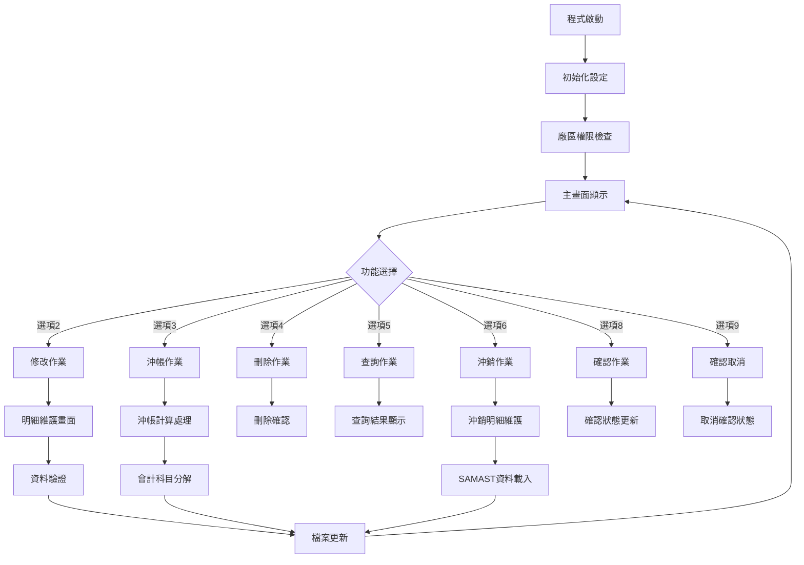

# ARE037RS_P02 程式規格書

## 1. 基本資料

| 項目 | 內容 |
|------|------|
| **程式編號** | ARE037RS |
| **程式名稱** | 票據異動應收帳款轉入程式 |
| **程式類型** | RPG |
| **廠區** | P02 |
| **系統名稱** | 應收帳款系統 |
| **子系統** | 票據異動處理子系統 |
| **檔案位置** | 東鋼list/ARE037RS_P02.txt |

## 2. 🎯 程式功能說明

### 主要功能描述
ARE037RS為票據異動應收帳款轉入程式，處理票據異動作業並轉入SARCVF檔案。程式提供票據資料的新增、修改、刪除、查詢、沖銷及確認功能，並支援複雜的會計科目分解計算與沖銷處理。

### 🎯 業務流程詳細說明



## 3. 🎯 檔案結構與關聯圖

### 檔案關聯圖


### 資料流向序列圖


## 4. 🎯 檔案欄位規格說明

### 主要資料結構分析

#### SARCVF（應收帳款主檔）關鍵欄位
```
SRRVNO - 票據編號（6A）：P+5位序號
SRITEM - 項次（2,0）
SRCUNO - 客戶編號（6A）
SRRVDT - 票據日期（8,0）
SRNAMT - 票據金額（11,0）
SRXAMT - 沖銷金額（11,0）
SRACTP - 會計類別（1A）：C=貸項，D=借項
SRACNO - 會計科目（6A）
SRFL01 - 已確認旗標（1A）：Y=已確認
SRFL02 - 已過帳旗標（1A）
SRFL03 - 已列印旗標（1A）
SRCURY - 幣別（3A）：NTD/USD/EUR
SREXC1 - 本期匯率（8,4）
SREXC2 - 當時匯率（8,4）
SREXC3 - 結算匯率（8,4）
```

#### SAMAST（出貨主檔）整合欄位
```
D#CUNO - 客戶編號（6A）
D#PRIC - 價格資料（10位，除以1000）
S1ADDL - 地址資料（10A，用於價格計算）
```

### 🔍 重點欄位切割技術詳解

#### DS結構完整分析
```
D#ARY (30字元)：[X|XXXXXX|XXXXXXXXXXXX|XXXXXXXX|XXX]
                  ↓    ↓        ↓         ↓      ↓ 
D#ACTP (1字元)：  [X]                             會計類別
D#ACNO (6字元)：    [XXXXXX]                      會計科目
D#RAMT (12字元)：          [XXXXXXXXXXXX]        票據金額
D#EXC2 (8字元)：                       [XXXXXXXX] 當時匯率
D#CURY (3字元)：                               [XXX] 幣別
```

#### 票據編號切割結構
```
SRRVNO (6字元)：[XXXXXX]
                 ↓
D#RVNO (1字元)： [X]      票據前綴(P)

D#RVNX (6字元)：[XXXXXX]
                 ↓    ↓
D#RVN1 (1字元)： [X]      前綴字元
D#RVN2 (5字元)：  [XXXXX] 5位序號
```

#### 訂單號碼切割結構
```
TXORNO (9字元)：[XXXXXXXXX]
                 ↓      ↓
D#ORNO (6字元)： [XXXXXX]   訂單編號
D#OREA (1字元)： [X]        地區別
D#TXOR (5字元)：  [XXXXX]   訂單尾碼
D#OITM (3字元)：       [XXX] 項次
```

### 🎯 欄位挪用詳細分析

#### 票據類型分類挪用
```
S#TYPE (1字元) - 票據類型分類
  原始定義：未定義此欄位
  實際用途：1=台幣票據，2=外幣票據
  挪用方式：依結算匯率=1判斷為台幣票據
  挪用原因：區分台幣與外幣票據處理邏輯
```

#### 科目編號IFRS轉換挪用
```
SRACNO - 會計科目編號
  原始格式：4位舊制科目（如8212）
  IFRS格式：6位新制科目（如820201）
  挪用機制：依IFRS旗標(*IN78)決定使用格式
  轉換邏輯：
    8112 → 810201
    8212 → 820201  
    8246 → 821204
    1111 → 110101
    1114 → 110104
    7119 → 710109
    7142 → 710402
    2159 → 211301
    1138 → 111202
```

## 5. 🎯 輸出/入螢幕布局

### AR037F1 - 主要票據清單畫面（SFLCTL）
```
+--------------------------------------------------------------------------+
|日期 2024/12/30  東鋼實業股份有限公司    票據異動應收帳款轉入作業 ARE037S-1|
|時間 14:32:55                                                    TERMINAL|
|                                                                          |
|功能: 2:修改 3:複製 4:刪除 5:查詢 6:沖銷 8:確認 9:確認取消               |
|--------------------------------------------------------------------------|
|                                                                          |
|客戶編號查詢: [______]                                                   |
|                                                                          |
|--------------------------------------------------------------------------|
|功能 客戶   客戶名稱   日期     票據編號  沖銷合計   票據合計    業確過列 |
|--------------------------------------------------------------------------|
| [_] [____] [________] [__/__/__] [____] [_______] [_______] [_][_][_][_] |
| [_] [____] [________] [__/__/__] [____] [_______] [_______] [_][_][_][_] |
| [_] [____] [________] [__/__/__] [____] [_______] [_______] [_][_][_][_] |
| [_] [____] [________] [__/__/__] [____] [_______] [_______] [_][_][_][_] |
| [_] [____] [________] [__/__/__] [____] [_______] [_______] [_][_][_][_] |
| [_] [____] [________] [__/__/__] [____] [_______] [_______] [_][_][_][_] |
| [_] [____] [________] [__/__/__] [____] [_______] [_______] [_][_][_][_] |
| [_] [____] [________] [__/__/__] [____] [_______] [_______] [_][_][_][_] |
| [_] [____] [________] [__/__/__] [____] [_______] [_______] [_][_][_][_] |
|                                                                          |
|--------------------------------------------------------------------------|
|F03:離開      F12:回前      F17:詢問      F18:說明      F05:重新整理    |
|F06:新增      PGUP:上頁      PGDN:下頁      ENTER:執行                   |
|[錯誤訊息顯示區]                                                        |
+--------------------------------------------------------------------------+
```

#### 主畫面欄位說明
- **S#OPT1**：功能選項（1字元）- 2=修改, 3=複製, 4=刪除, 5=查詢, 6=沖銷, 8=確認, 9=確認取消
- **S#CUNO**：客戶編號（6字元）
- **S#CUNM**：客戶名稱（10字元）
- **S#RVDT**：票據日期（8字元，格式YYYY/MM/DD）
- **S#RVNO**：票據編號（6字元）
- **S#XAMT**：沖銷合計（11位數字，3位小數）
- **S#NAMT**：票據合計（11位數字，3位小數）
- **S#SALE**：業務代號（1字元）
- **S#FL01**：確認旗標（1字元）- Y=已確認
- **S#FL02**：過帳旗標（1字元）- Y=已過帳
- **S#FL03**：列印旗標（1字元）- Y=已列印

### AR037F2 - 明細維護畫面（票據明細輸入）
```
+--------------------------------------------------------------------------+
|日期 2024/12/30  東鋼實業股份有限公司    票據異動應收帳款轉入作業 ARE037S-2|
|時間 14:32:55                                                    TERMINAL|
|新增                                                                      |
|                                                                          |
|票據編號: [______]  票據部門: [____]  票據業務代號: [_]                  |
|客戶編號: [______]  客戶名稱: [________]    票據日期: [____/__/__]       |
|請輸入會計借貸項目，項目項次與刪除                                        |
|                                                票據金額合計: [_________] |
|--------------------------------------------------------------------------|
|會帳帳戶               票                  當                          |
|計戶類科目編號        據銀行帳號      時匯率    新增帳號                  |
|項號別票據憑證號碼    幣別  票據金額    到期日                          |
|--------------------------------------------------------------------------|
|[_][__][_][______][______________][__________][____.__][__________]       |
|         [____________________] [___] [_________] [____/__/__]            |
|[_][__][_][______][______________][__________][____.__][__________]       |
|         [____________________] [___] [_________] [____/__/__]            |
|[_][__][_][______][______________][__________][____.__][__________]       |
|         [____________________] [___] [_________] [____/__/__]            |
|[_][__][_][______][______________][__________][____.__][__________]       |
|         [____________________] [___] [_________] [____/__/__]            |
|[_][__][_][______][______________][__________][____.__][__________]       |
|         [____________________] [___] [_________] [____/__/__]            |
|                                                                          |
|--------------------------------------------------------------------------|
|F01:說明      F03:離開      F12:回前      ENTER:檢核                     |
|                                          ENTER:檢核      F10:更新       |
|[錯誤訊息顯示區]                                                        |
+--------------------------------------------------------------------------+
```

#### 明細維護畫面欄位說明
- **S#RVNO**：票據編號（6字元，唯讀）
- **S#DPNO**：票據部門（4字元）
- **S#RVID**：票據業務代號（1字元）
- **S#CUNO**：客戶編號（6字元）
- **S#CUNM**：客戶名稱（10字元，唯讀）
- **S#RVDT**：票據日期（8字元，格式YYYY/MM/DD）
- **S#NAMT**：票據金額合計（11位數字，自動計算）
- **S#ACTP**：會計項（1字元）- C=貸項, D=借項
- **S#USTP**：帳戶號（2字元）- A1~A5,Z5等
- **S#NTTP**：帳戶類別（1字元）- A~J
- **S#ACNO**：科目編號（6字元）
- **S#PBID**：票據銀行帳號（14字元）
- **S#PANO**：票據帳號（10字元）
- **S#PLAC**：票據地（1字元）- D=本地, E=外地
- **S#RLNO**：增新增帳號（10字元）
- **S#RAMT**：票據金額（11位數字）
- **S#NTNO**：票據憑證號碼（20字元）
- **S#SANO**：新增帳號（10字元）
- **S#DUDT**：到期日（8字元，格式YYYY/MM/DD）

### AR037F2W - 科目代碼說明視窗
```
┌──────────── 科目說明 ────────────┐
│帳戶類型          票據類型          │
│                                  │
│A1:一般存款       A:匯票           │
│A2:定期存款       B:期票匯票       │
│A3:支票定期       C:本票           │
│A4:存款準備       D:期票本票       │
│A5:國際帳戶       E:國際匯票       │
│Z5:其他           F:匯票           │
│                  G:支票           │
│                  H:現金           │
│                  I:信用狀         │
│                  J:國外票據       │
│                                  │
│     常見會計科目                 │
│                                  │
│110101預收款項    110102國外票據  │
│110104外匯存款    111001銀行存款  │
│210902銀行保證    211301國際匯款  │
│110104外匯存款    111101銀行帳戶  │
│811210其他應收    821204差額調整  │
│111407可轉換票    710101進口代理保證│
│710102進口代理保證 710104進口代理保證│
│710402進口代理成品保 710509進口代理其他保證│
└──────────────────────────────────┘
```

### AR037F3 - 發票沖銷明細畫面
```
+--------------------------------------------------------------------------+
|日期 2024/12/30  東鋼實業股份有限公司 票據異動發票沖銷票據作業    ARE037S-3|
|時間 14:32:55                                                    TERMINAL|
|沖銷                                                                      |
|                                                                          |
|票據編號: [______]  票據部門: [____]  票據業務代號: [_]                  |
|客戶編號: [______]  客戶名稱: [________]    票據日期: [____/__/__]       |
|沖銷金額合計: [_________]                票據金額合計: [_________]       |
|--------------------------------------------------------------------------|
|請點選發票編號或輸入項目與刪除                                            |
|                                                                          |
|  發票編號    沖銷金額  訂單   發票金額   發票成本  特別   應收已過沖銷   |
|------------------+---+---+--------+---+---+---+---+---+--------+---+---+|
|[__________] [_] [_________] [______] [_________] [_________]  [_]         |
|[__________] [_] [_________] [______] [_________] [_________]  [_]         |
|[__________] [_] [_________] [______] [_________] [_________]  [_]         |
|[__________] [_] [_________] [______] [_________] [_________]  [_]         |
|[__________] [_] [_________] [______] [_________] [_________]  [_]         |
|[__________] [_] [_________] [______] [_________] [_________]  [_]         |
|[__________] [_] [_________] [______] [_________] [_________]  [_]         |
|[__________] [_] [_________] [______] [_________] [_________]  [_]         |
|[__________] [_] [_________] [______] [_________] [_________]  [_]         |
|[__________] [_] [_________] [______] [_________] [_________]  [_]         |
|                                                                          |
|------------------+---+--------+---+---+---+---+---+--------+---+---+    |
|F03:離開          F12:回前      ENTER:檢核                               |
|F06:詢問  F08:客特別編號輸入  F09:客訂單輸入      ENTER:檢核  F10:更新   |
|[錯誤訊息顯示區]                                                        |
+--------------------------------------------------------------------------+
```

#### 沖銷明細畫面欄位說明
- **S#INNO**：發票編號（10字元）
- **S#INXA**：沖銷金額（11位數字，4位小數）
- **S#INOR**：訂單編號（6字元，唯讀）
- **S#INAM**：發票金額（11位數字，4位小數，唯讀）
- **S#INBA**：發票成本（11位數字，4位小數，唯讀）
- **S#INAP**：特別（6字元，唯讀）
- **S#INRA**：應收已過沖銷（11位數字，4位小數，唯讀）

### AR037F6 - 信用狀查詢視窗
```
┌─────── 相關信用狀查詢 ARE037S-6 ───────┐
│                                        │
│ 請點選欲選擇的筆，按確認鍵即可。        │
│                                        │
│ 信用狀編號         開狀銀行     到期日  │
│ ──────────────────────────────── │
│ [__________________] [____________] [__/__/__] │
│ [__________________] [____________] [__/__/__] │
│ [__________________] [____________] [__/__/__] │
│ [__________________] [____________] [__/__/__] │
│ [__________________] [____________] [__/__/__] │
│ [__________________] [____________] [__/__/__] │
│ [__________________] [____________] [__/__/__] │
│ [__________________] [____________] [__/__/__] │
│ [__________________] [____________] [__/__/__] │
│ [__________________] [____________] [__/__/__] │
│                                        │
│ ──────────────────────────────── │
│ F03:取消    F12:回上                    │
└────────────────────────────────┘
```

#### 信用狀查詢視窗欄位說明
- **S#LLNO**：信用狀編號（20字元）
- **S#BANK**：開狀銀行（14字元）
- **S#ENDT**：到期日（8字元，格式YYYY/MM/DD）

### 畫面流程控制
#### 功能鍵定義
- **F03**：離開程式
- **F06**：新增票據（僅主畫面）
- **F10**：更新資料
- **F12**：回到上一層畫面
- **F17/F18**：詢問/說明功能
- **CF01**：信用狀查詢（明細畫面）
- **PGUP/PGDN**：分頁控制
- **ENTER**：執行選擇的功能

#### 畫面轉換流程
1. **AR037F1** → 選擇功能 → **AR037F2**（明細維護）
2. **AR037F1** → 選擇功能 → **AR037F3**（沖銷明細）
3. **AR037F2** → F01 → **AR037F6**（信用狀查詢）
4. **AR037F2** → F01 → **AR037F2W**（科目說明）

## 6. 🎯 處理流程程序說明

### 主程式邏輯流程架構

#### 程式執行控制結構


### 詳細子程序邏輯分析

#### SR0000 - 系統初始化邏輯
```
處理步驟：
1. 設定W#PRID='01'（主畫面）
2. 重置錯誤旗標(*IN99=*OFF)
3. 清空結束旗標(W#OEOF)

廠區權限檢查邏輯：
IF U#USTP = 'S' (系統程式)
   W#HEAD = '*' (所有廠區)
ELSE
   SELEC U#USTP
   WHEN 'B','J','D' AND (部門='B01','J00','B00','D00LCC','H293','D00CHH','H837')
      W#HEAD = 'P' (P02廠區)
   WHEN 部門='B02'
      W#HEAD = 'T' (T廠)
   WHEN 部門='B03'  
      W#HEAD = 'K' (K02廠區)
   WHEN 部門='B04'
      W#HEAD = 'M' (M廠)
   WHEN 部門='B05'
      W#HEAD = 'H' (H05廠區)
   WHEN U#USDP='TYB'
      W#HEAD = 'T' (T廠)
   OTHER
      W#PRID = '00' (無權限，程式結束)
   ENDSL
ENDIF

IFRS制度檢查：
計算系統日期：U#SYSD = *DATE - 19000000
IF U#SYSD < D#IFRS (IFRS啟用日期)
   *IN78 = *ON (使用舊制科目)
ELSE  
   *IN78 = *OFF (使用IFRS科目)
ENDIF
```

#### SR1000 - 主畫面顯示邏輯
```
畫面初始化：
1. 清空SFL記錄計數器(RRN1=0)
2. 設定SFLRCDNBR = S#NBR1 - 12
3. 執行SFLCLR(*IN73=*ON)
4. 寫入AR037F1C控制記錄
5. 設定DSPATR(PC)(*IN30=*ON)

資料查詢邏輯：
設定查詢KEY：
SRCUNO = S#KEY1 (客戶編號查詢條件)
SRRVDT = *HIVAL
SRRVNO = *HIVAL  
SRITEM = 0

執行SETLL SARCVFL4 with K#SAR4
呼叫SR1100載入資料

畫面顯示控制：
DO WHILE W#PRID = '01'
   IF RRN1 = 0 (無資料)
      *IN72 = *ON (SFLDSP OFF)
      S#ERR1 = ERR,1 (無資料發現)
      IF S#KEY1 = *BLANK
         *IN32 = *OFF (DSPATR(RI) OFF)
      ELSE
         *IN32 = *ON (DSPATR(RI) ON)
      ENDIF
   ELSE
      *IN72 = *OFF (SFLDSP ON)
   ENDIF
   
   IF W#CNT >= 13
      *IN74 = *ON (SFLEND OFF - 還有更多資料)
   ELSE  
      *IN74 = *OFF (SFLEND ON - 最後一頁)
   ENDIF
   
   寫入AR037F1M主畫面
   執行EXFMT AR037F1C
   
   處理功能鍵：
   IF *IN03 OR *IN12 = *ON
      W#PRID = '00' (結束程式)
   ENDIF
   
   IF *IN06 = *ON AND 權限檢查通過
      W#OPT = 1 (新增)
      W#PRID = '03' (明細維護)
   ENDIF
   
   IF *IN91 = *ON (ROLLUP)
      執行SR1100繼續載入資料
   ENDIF
   
   W#PRID = '02' (選項處理)
ENDDO
```

#### SR2400-SR2421 - 複雜沖帳計算邏輯
```
SR2400主控邏輯：
*IN97 = *OFF (計算標記)
清空ARY陣列為*ALL'9'

執行SR2410讀取票據明細到ARY陣列
IF *IN97 = *OFF (無需特殊計算)
   執行SR2420進行帳務分解計算
ENDIF

SR2420帳務分解計算：
初始化科目金額變數：
W#1114 = 0 (外匯存款)
W#1111 = 0 (預收款項)  
W#7119 = 0 (出口保險)
W#7142 = 0 (成品保險)
W#8211 = 0 (出險機)
W#AMTX = 0 (累計總額)
W#2122 = 0 (央行準備金)

科目別處理邏輯：
DO I = 1 TO 20
   SELEC D#ACNO
   WHEN '1111','110101' (預收款項)
      IF D#CURY = 'USD'
         W#AMT = D#RAMT * W#EXC1
         W#1111 = W#1111 + W#AMT
         W#AMTX = W#AMTX + D#RAMT
      ELSE
         W#AMTX = W#AMTX + D#RAMT
      ENDIF
      
   WHEN '210801' (央行準備金)
      IF D#CURY = 'USD'
         W#AMT = D#RAMT * W#EXC1  
         W#2122 = W#2122 + W#AMT
         W#AMTX = W#AMTX + D#RAMT
      ELSE
         W#AMTX = W#AMTX + D#RAMT
         W#2122 = W#2122 + D#RAMT
      ENDIF
      
   WHEN '1114','110104' (外匯存款)
      W#AMT = D#RAMT * W#EXC1
      W#1114 = W#1114 + W#AMT
      W#AMTX = W#AMTX + D#RAMT
      
   WHEN '7119','710109' (出口保險)
      IF D#CURY = 'NTD' OR *BLANK
         W#AMT1 = D#RAMT / D#EXC2
         W#AMTX = W#AMTX + W#AMT1
         W#AMT = W#AMT1 * W#EXC1
         W#7119 = W#7119 + W#AMT
      ELSE
         W#AMT = D#RAMT * W#EXC1
         W#7119 = W#7119 + W#AMT
         W#AMTX = W#AMTX + D#RAMT
      ENDIF
   ENDSL
ENDDO

執行SR2421平衡計算

SR2421平衡調整計算：
匯率差異計算：
IF W#EXC1 >= W#EXC3 (本期匯率>=結算匯率)
   W#EXCG = W#EXC1 - W#EXC3
   W#8112 = W#AMTX * W#EXCG (出險貨款=匯率差*總額)
ELSE
   W#EXCG = W#EXC3 - W#EXC1  
   W#8212 = W#AMTX * W#EXCG (成品保證金=匯率差*總額)
ENDIF

差額調整計算(平衡公式)：
W#8246 = S#XAMT - W#1114 - W#1111 - W#7119 - W#8211 - W#8212 + W#8112 - W#2122
```

#### SR3000-SR3400 - 明細維護邏輯
```
SR3000畫面控制：
設定畫面模式：
IF W#OPT = 5 (查詢)
   *IN33 = *ON (唯讀模式)
   S#SF2T = '查詢'
ELSE
   *IN33 = *OFF (編輯模式)  
ENDIF

SELEC W#OPT
WHEN 1: S#SF2T = '新增'
WHEN 2: S#SF2T = '修改'  
WHEN 5: S#SF2T = '查詢'
ENDSL

SR3300驗證邏輯：
基本欄位驗證：
- 客戶編號存在性檢查(CBCUST)
- 日期格式驗證(UTS102R)
- 票據類型驗證(S#TYPE='1'或'2')
- 匯率邏輯檢查

SFL明細驗證：
- 帳戶類型('A1','A2','A3','A4','A5','Z5')
- 票據類型('A'-'J')
- 科目編號合法性
- 金額與匯率邏輯

SR3400新增更新處理：
IF W#OPT = 1 (新增)
   產生新票據編號：
   GEKIND = '04'
   GEPRIN = 'P'
   鏈結GENSEQ
   S#RVNO = 'P' + GECUNO+1
ENDIF

刪除舊明細記錄
寫入新明細記錄
```

#### SR4000-SR4400 - 沖銷處理邏輯
```
SR4000沖銷畫面控制：
載入票據標頭資料
初始化SFL(RRN3=0)
設定畫面模式

SR4200沖銷明細處理：
發票編號驗證：
鏈結SADSAL進行發票存在性檢查
客戶編號交叉驗證

SR4220 SAMAST整合處理：
特殊X系列訂單處理：
IF 訂單編號 IN ('X00163','X00166','X00174','X00173','X00177','X00188','X00197')
   使用特殊數量計算邏輯
   價格計算：直接使用TXUPRC或TXAMT
ELSE
   一般訂單處理邏輯
ENDIF

容量控制：
支援最多800筆沖銷記錄
超過容量時分批處理
```

### 重要變數與控制邏輯

#### 程式控制變數
- **W#PRID**：程式畫面ID（2字元）
  - '00'：程式結束
  - '01'：主畫面(SR1000)
  - '02'：選項處理(SR2000)  
  - '03'：明細維護(SR3000)
  - '04'：沖銷處理(SR4000)
  - '05'：信用狀查詢(SR5000)

#### 重要指示器控制
- **\*IN78**：IFRS制度控制
  - *ON：使用舊制4位科目
  - *OFF：使用IFRS 6位科目
- **\*IN33**：畫面模式控制  
  - *ON：查詢模式(唯讀)
  - *OFF：編輯模式
- **\*IN99**：錯誤發生旗標
- **\*IN97**：沖帳計算提前終止旗標

#### 關鍵計算變數
- **ARY(20,30)**：帳務分解資料暫存陣列
- **W#HEAD**：廠區代碼控制('*','P','T','K','M','H')
- **W#OPT**：功能選項暫存(1-9)
- **W#EXC1/W#EXC2/W#EXC3**：匯率控制變數
- **W#AMTX**：沖銷總額累計變數

#### 科目金額控制變數
- **W#1111**：預收款項金額
- **W#1114**：外匯存款金額
- **W#7119**：出口保險金額
- **W#7142**：成品保險金額
- **W#8211**：出險機金額
- **W#8212**：成品保證金金額
- **W#8112**：出險貨款金額
- **W#8246**：差額調整金額
- **W#2122**：央行準備金金額

## 7. 🎯 數據操作與轉換分析

### 檔案操作詳解

#### READ操作
- **SARCVFL4**：循序讀取票據記錄
- **SAMAST**：隨機讀取出貨資料
- **TRNDTLL4**：讀取交易明細

#### WRITE操作
- **SARCVF**：新增票據記錄
- **SARVIN**：新增發票記錄
- **SARVOR**：新增沖銷記錄

#### UPDATE操作
- **SARCVF**：更新票據狀態和金額
- **GENSEQ**：更新序號檔

#### DELETE操作
- **SARCVF**：刪除票據記錄（選項4）
- **SARVIN**：刪除發票記錄
- **SARVOR**：刪除沖銷記錄

### 數據轉換邏輯

#### 匯率轉換
```
外幣金額 × 本期匯率 = 台幣金額
台幣金額 ÷ 當時匯率 = 外幣金額（特殊科目）
```

#### 日期格式轉換
```
UDATE格式 - 1900000 = 系統日期格式
```

#### 價格計算
```
SAMAST價格 ÷ 1000 × 匯率 = 實際價格
TXQTY × 單價 = 特料金額
```

### 計算邏輯分析

#### 差額平衡計算
```
8246科目 = 沖銷總額 - (1114+1111+7119+8211+8212-8112+2159+1138+7142+210801)
```

#### 匯率差異計算
```
本期匯率 >= 結算匯率：匯率差異 = (本期匯率-結算匯率) × 外幣金額 → 8112
本期匯率 < 結算匯率：匯率差異 = (結算匯率-本期匯率) × 外幣金額 → 8212
```

### 檢核機制詳解

#### 業務邏輯檢核
- 票據總額與沖銷總額必須相符
- 已確認票據不可修改
- 已過帳票據不可修改
- 客戶編號必須存在於CBCUST

#### 資料格式檢核
- 日期格式驗證（呼叫UTS102R）
- 幣別限制：NTD、USD、EUR
- 會計科目限制特定值
- 匯率必須大於0（外幣票據）

## 8. 🎯 錯誤處理程序說明

### 詳細錯誤代碼清冊

| 錯誤代碼 | 錯誤訊息 | 原因說明 | 處理方式 | 預防措施 |
|---------|---------|---------|---------|----------|
| **ERR,1** | 無資料發現！ | 查詢條件無符合記錄 | 1. 重新輸入查詢條件<br>2. 檢查客戶編號格式<br>3. 確認資料是否存在 | 輸入前確認客戶編號正確性 |
| **ERR,2** | 該票據已過帳,請勿修改程式取消後再過帳！ | SRFL02='Y'已過帳 | 1. 取消過帳狀態<br>2. 重新執行修改<br>3. 聯絡會計人員 | 修改前檢查過帳狀態 |
| **ERR,3** | 該票據已確認,請勿修改程式取消後再確認！ | SRFL01='Y'已確認 | 1. 執行確認取消（選項9）<br>2. 重新修改<br>3. 再次確認 | 修改前檢查確認狀態 |
| **ERR,4** | 該票據未確認,無法取消！ | SRFL01=' '未確認 | 1. 先執行確認（選項8）<br>2. 再執行取消 | 取消前檢查確認狀態 |
| **ERR,6** | 資料輸入錯誤！ | 欄位格式或內容錯誤 | 1. 檢查輸入格式<br>2. 重新輸入正確資料<br>3. 參考欄位說明 | 按照欄位格式要求輸入 |
| **ERR,7** | 無此訂單！ | SAMAST查無訂單記錄 | 1. 檢查訂單編號格式<br>2. 確認訂單是否存在<br>3. 聯絡業務確認 | 輸入前確認訂單存在 |
| **ERR,8** | 客戶不符！ | SAMAST客戶與票據客戶不符 | 1. 檢查客戶編號<br>2. 確認訂單歸屬<br>3. 重新選擇正確訂單 | 確認訂單與客戶關聯性 |
| **ERR,9** | 發票編號不存在！ | TRNDTL查無發票記錄 | 1. 檢查發票編號<br>2. 確認發票是否開立<br>3. 聯絡開票人員 | 確認發票已正確開立 |
| **ERR,10** | 客戶編號不符！ | 交易明細客戶與票據客戶不符 | 1. 重新選擇正確客戶<br>2. 檢查交易明細<br>3. 確認業務歸屬 | 確認交易明細正確性 |
| **ERR,11** | 訂單編號不符！ | 訂單編號與交易明細不符 | 1. 重新輸入正確訂單<br>2. 檢查訂單格式<br>3. 確認訂單狀態 | 確認訂單編號格式 |
| **ERR,12** | 沖銷金額不得大於特料成本！ | 沖銷金額超過允許範圍 | 1. 調整沖銷金額<br>2. 檢查成本計算<br>3. 確認業務邏輯 | 計算前確認成本金額 |
| **ERR,13** | 票據總額與沖銷總額不符 | 金額不平衡 | 1. 重新計算各項金額<br>2. 檢查沖銷明細<br>3. 確認帳務平衡 | 輸入時即時檢查金額 |
| **ERR,15** | 結算匯率錯誤！ | 匯率格式或值異常 | 1. 重新輸入匯率<br>2. 檢查匯率格式<br>3. 確認當日匯率 | 使用正確的匯率資料 |
| **ERR,17** | 沖銷項目尚未輸入！ | 沖銷明細遺漏 | 1. 完成沖銷明細輸入<br>2. 檢查必要欄位<br>3. 確認資料完整 | 確保沖銷明細完整 |
| **ERR,18** | 無可使用查詢功能！ | 特定使用者權限限制 | 1. 聯絡系統管理員<br>2. 申請權限開放<br>3. 使用其他功能 | 確認使用者權限範圍 |

### 系統異常處理邏輯

#### 檔案操作錯誤
- **SAMAST檔案存取失敗**：顯示錯誤訊息並返回主畫面
- **記錄容量超限**：800筆上限控制，超過時停止處理
- **權限不足**：特定使用者限制查詢功能使用

#### 資料完整性控制
- **主外鍵關聯檢查**：確保SAMAST與SARCVF客戶編號一致
- **帳務平衡驗證**：票據總額必須等於沖銷總額
- **狀態檢查**：確認、過帳狀態的邏輯控制

## 9. 🎯 備註

### 特殊注意事項

#### 序號處理機制
- **序號前綴**：使用GEPRIN='P'產生P序列票據編號
- **序號格式**：P+5位數字（P00001-P99999）
- **序號循環**：達到99999後回到00001

#### 檔案整合處理
- **SAMAST檔案**：取代HSCINV進行出貨資料驗證
- **價格計算**：SAMAST價格除以1000後進行計算
- **客戶驗證**：SAMAST客戶編號必須與票據客戶一致

#### 容量處理規格
- **沖銷記錄上限**：支援最多800筆記錄
- **明細記錄上限**：支援最多799筆明細
- **畫面顯示**：主畫面最多顯示13筆

#### 科目處理規格
- **210801科目**：央行準備金科目支援USD轉換
- **IFRS轉換**：依*IN78旗標決定科目格式
- **舊制格式**：4位科目編號（如8212）
- **新制格式**：6位科目編號（如820201）

#### 特殊X訂單處理機制
- **支援訂單**：X00163、X00166、X00174、X00173、X00177、X00188、X00197
- **價格處理**：TXUPRC直接使用或TXAMT金額
- **數量處理**：特定訂單（X00177、X00188、X00197）使用TXQTY數量
- **匯率驗證**：X00173以外訂單需進行匯率驗證

#### 票據類型分類功能
- **分類依據**：結算匯率=1判斷為台幣票據
- **S#TYPE=1**：台幣票據，本期匯率可為0
- **S#TYPE=2**：外幣票據，本期匯率必須>0
- **畫面顯示**：明確顯示票據類型選擇

#### IFRS會計制度處理
- **檢查機制**：開機時檢查IFRS制度啟用狀態
- **科目轉換**：自動執行新舊制科目轉換
- **旗標控制**：*IN78控制科目格式選擇
- **相容處理**：新舊制科目並存處理

#### 廠區權限控制
- **廠區代碼**：P=P02、T=T廠、K=K02、M=M廠、H=H05
- **權限檢查**：依使用者部門設定可處理廠區
- **資料過濾**：僅顯示所屬廠區票據資料
- **特殊權限**：系統管理員可處理所有廠區 