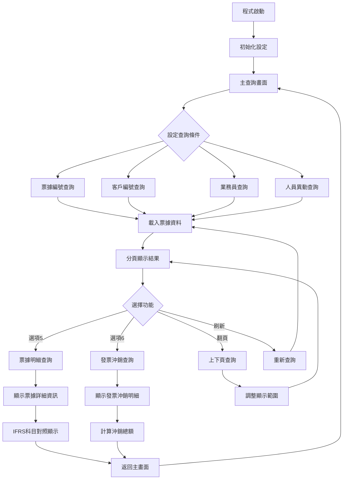
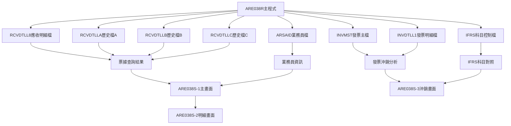
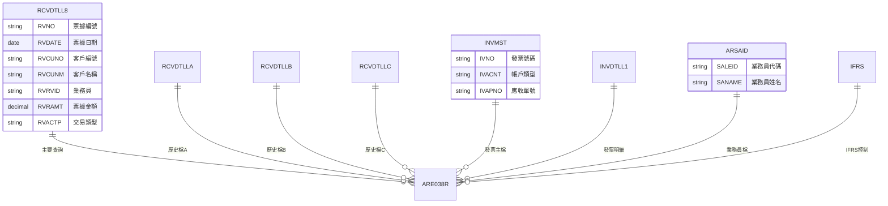

# ARE038R_P02 程式規格書

## 1. 基本資料

| 項目 | 內容 |
|------|------|
| **程式編號** | ARE038R |
| **程式名稱** | 票據異動應收帳款查詢程式 |
| **程式類型** | RPG |
| **廠區** | P02 |
| **系統名稱** | 應收帳款系統 |
| **子系統** | 票據異動查詢子系統 |
| **檔案位置** | 東鋼list/ARE038R_P02.txt |

## 2. 🎯 程式功能說明

### 主要功能描述
ARE038R為票據異動應收帳款查詢程式，提供完整的票據異動歷史查詢功能。程式支援多條件查詢、分頁顯示、明細查看和發票沖銷追蹤，具備IFRS會計制度整合能力，可處理人員異動流程的歷史資料查詢和業務資料關聯分析。

### 🎯 業務流程詳細說明



### 🔄 資料流向關係圖



## 3. 📋 檔案結構與關聯圖



## 4. 📊 資料欄位規格說明

### 🔍 UDS使用者資料結構
| 欄位名稱 | 位置 | 長度 | 類型 | 說明 |
|----------|------|------|------|------|
| S#COMP | 951-985 | 35 | 文字 | 公司名稱 |
| S#DEVI | 1011-1020 | 10 | 文字 | 設備名稱 |
| U#USID | 1001-1010 | 10 | 文字 | 使用者ID |
| U#USDP | 1001-1003 | 3 | 文字 | 使用者部門 |
| U#USTP | 1001-1001 | 1 | 文字 | 使用者類型 |
| U#AREA | 1021-1021 | 1 | 文字 | 區域代碼 |

### 🔢 工作變數與資料結構
| 變數名稱 | 類型 | 長度 | 說明 | 欄位切割說明 |
|----------|------|------|------|-------------|
| SRRVNO | 文字 | 6 | 票據編號完整結構 | D#RVNO(1位)票據類型 |
| W#ARYE | 文字 | 14 | 應收年度結構 | D#ARIN(1-10)年度+D#ARRN(11-14)序號 |
| S#SANO | 文字 | 10 | 業務帳號結構 | D#BKTP(1)銀行類型+D#BKCR(2)幣別+D#BKNO(3-10)帳號 |
| W#YMD | 文字 | 80 | 日期結構 | D#DD(7-80)日期描述 |
| D#IFRS | 文字 | 80 | IFRS控制結構 | IFRS會計制度識別欄位 |

### 🗂️ 查詢條件欄位規格
| 欄位名稱 | 類型 | 長度 | 說明 | 使用方式 |
|----------|------|------|------|----------|
| S#SFK1 | 文字 | 6 | 票據編號查詢鍵 | 主要查詢條件 |
| S#SFK2 | 數值 | 8 | 客戶編號查詢鍵 | 次要查詢條件 |
| S#SFK3 | 文字 | 6 | 業務員查詢鍵 | 業務分析查詢 |
| S#SFK4 | 文字 | 2 | 人員異動查詢鍵 | 歷史資料查詢 |

## 5. 💻 輸出/入螢幕布局

### 🖥️ ARE038S-1 主查詢畫面
```
    1         2         3         4         5         6         7         8
    01234567890123456789012345678901234567890123456789012345678901234567890123456789
 1  99/99/99                           東鋼鋼鐵股份有限公司                  ARE038S-1
 2  99:99:99                      【桃廠已建置】票據異動查詢                   P02DEV01
    
 4  選項:    5:查詢票據明細      6:查詢沖銷明細
 5  -------------------------------------------------------------------------------
 6  選項   編號     日期      客戶名稱        票據金額        業務
 7  -------------------------------------------------------------------------------
 8        ______  99/99/99  ______  __                                    __
    
    [子檔案顯示區域 - 12行]
    
21  -------------------------------------------------------------------------------
22     F03:結束    F12:返回    F17:最前    F18:最後    F05:重新查詢
23               PGUP:上頁    PGDN:下頁    ENTER:確認
24  ___________________________________________________________________
```

### 🖥️ ARE038S-2 票據明細畫面
```
    1         2         3         4         5         6         7         8
    01234567890123456789012345678901234567890123456789012345678901234567890123456789
 1  99/99/99                           東鋼鋼鐵股份有限公司                  ARE038S-2
 2  99:99:99                        票據異動明細查詢                       P02DEV01
    
 4        票據編號: ______    票據批號: ____    明細業務員: _
 5        客戶編號: ______    客戶名稱: __________    票據日期: 99/99/99
 6                                              票據金額總計: _,___,___,__0
 7  -------------------------------------------------------------------------------
 8   借 交 帳 票  票據帳戶                   票據號碼      原票據編   金      額
 9   貸 收 單 別  訂 折讓號碼                              銀行號碼      差額  金額
10   碼 狀 券 號  訂貸付帳戶                               入帳帳號   到期日  保留欄
11  -------------------------------------------------------------------------------
    
    [子檔案顯示區域 - 5行]
    
22  -------------------------------------------------------------------------------
23     F01:說明    F03:結束    F12:返回    ENTER:確認
24  ___________________________________________________________________
```

### 🖥️ ARE038S-3 發票沖銷畫面  
```
    1         2         3         4         5         6         7         8
    01234567890123456789012345678901234567890123456789012345678901234567890123456789
 1  99/99/99                           東鋼鋼鐵股份有限公司                  ARE038S-3
 2  99:99:99                      票據異動發票沖銷查詢                     P02DEV01
    
 4        票據編號: ______    票據批號: ____    明細業務員: _
 5        客戶編號: ______    客戶名稱: __________    票據日期: 99/99/99
 6        發票沖銷總計: _,___,___,__0          票據金額總計: _,___,___,__0
 7  -------------------------------------------------------------------------------
 9        發票號碼   訂單   應帳號       發票金額    沖銷金額    發票餘額
10  -------+-----+-----+----------+----------+----------+---------
    
    [子檔案顯示區域 - 10行]
    
21  -------+-----+-----+----------+----------+----------+---------
22     F03:結束       F12:返回       ENTER:確認
24  ___________________________________________________________________
```

## 6. 🔄 處理流程說明

### 🚀 主程式邏輯流程
1. **程式初始化**（SR0000）
   - 設定分頁參數：SF1(12筆)、SF2(90筆)、SF3(99筆)
   - 初始化子檔案控制變數
   - 清空查詢條件欄位
   - 設定預設查詢模式（票據編號查詢）

2. **主畫面處理**（SR1000）
   - 顯示查詢條件輸入畫面
   - 處理功能鍵操作（F03/F12結束、F17/F18翻頁、F05刷新）
   - 驗證查詢條件輸入
   - 執行相應的查詢或明細功能

3. **查詢條件驗證**（SR1100）
   - 檢查查詢條件互斥性（四種查詢條件只能選擇一種）
   - 驗證票據編號存在性（RCVDTLL8檔案）
   - 驗證客戶編號存在性（RCVDTLLA檔案）
   - 驗證業務員存在性（RCVDTLLB檔案）
   - 驗證人員異動條件（RCVDTLLC檔案）

### 🔍 查詢處理詳細步驟
1. **載入查詢結果**（SR1120）
   - 根據查詢條件設定檔案定位
   - 循序讀取符合條件的記錄
   - 計算票據金額累計（借貸方向處理）
   - 載入業務員姓名（ARSAID檔案）
   - 填充子檔案記錄至分頁上限

2. **分頁控制機制**
   - 向下翻頁（SR1200）：從目前位置繼續載入下一批記錄
   - 向上翻頁（SR1300）：從目前位置往前載入上一批記錄
   - 最前頁（SR1400）：重設檔案指標到最前面
   - 最後頁（SR1500）：設定檔案指標到最後面

3. **明細查詢處理**
   - 票據明細查詢（SR2000-SR2102）：顯示選定票據的完整明細資訊
   - 發票沖銷查詢（SR3000-SR3110）：顯示票據相關的發票沖銷記錄

### 💼 業務邏輯與條件控制
1. **IFRS會計制度整合**
   - 程式啟動時檢查系統日期與IFRS導入日期（110/01/01）
   - 設定*IN77控制IFRS科目對照窗口顯示
   - 支援新舊科目代碼並存查詢

2. **多重歷史檔案查詢**
   - 0104A版本新增RCVDTLLA、RCVDTLLB、RCVDTLLC三個歷史檔案
   - 支援人員異動流程的歷史資料追蹤
   - 提供跨時期的票據異動完整軌跡

3. **錯誤處理與訊息控制**
   - T#MSG陣列提供4種標準錯誤訊息
   - 查詢條件互斥錯誤提示
   - 檔案結束位置提示訊息

### 🔄 變數生命週期管理
1. **查詢狀態變數**
   - W#SFE1：控制子檔案1結束狀態
   - W#SFB1：控制子檔案1開始狀態  
   - W#SCN1：控制畫面切換狀態
   - W#RTNV：控制程式返回狀態

2. **分頁控制變數**
   - RRN1/RRN2/RRN3：各子檔案的記錄指標
   - S#SFN1/S#SFN2/S#SFN3：各子檔案記錄數量
   - N#PAG1/N#PAG2/N#PAG3：各子檔案分頁大小

### 🎯 子程序功能說明
1. **SR1121**：載入票據基本資訊（編號、日期、客戶、業務員）
2. **SR1122**：計算票據金額（處理借貸方向）
3. **SR2101**：載入票據明細標題資訊
4. **SR2102**：載入票據明細內容資訊
5. **SR3101**：載入發票沖銷明細並計算沖銷總額

## 7. 🚨 錯誤處理

### 📋 錯誤代碼清單
| 錯誤代碼 | 錯誤訊息 | 觸發條件 | 處理方式 |
|----------|----------|----------|----------|
| T#MSG,1 | 查詢條件不存在 | 查詢條件對應記錄不存在 | 提示重新輸入 |
| T#MSG,2 | 查詢已到最後頁 | 向下翻頁已無資料 | 提示已到結尾 |
| T#MSG,3 | 查詢已到最前頁 | 向上翻頁已無資料 | 提示已到開頭 |
| T#MSG,4 | 查詢條件互斥錯誤 | 同時輸入多種查詢條件 | 提示選擇單一條件 |

### 🔧 系統異常處理
1. **檔案讀取異常**
   - 使用*IN69指示器檢查檔案操作狀態
   - 檔案不存在時自動跳轉到適當的處理邏輯
   - 提供友善的錯誤訊息給使用者

2. **記憶體管理**
   - 子檔案記錄數量控制，避免記憶體溢出
   - 適當的記錄清除機制（CLEAR指令）
   - 變數初始化確保資料正確性

3. **使用者操作異常**
   - 無效選項輸入的捕捉與處理
   - 功能鍵衝突檢查
   - 游標位置異常的復原機制

## 8. 📝 備註

### ⚡ 程式特色功能
1. **多條件查詢支援**：同時支援票據編號、客戶編號、業務員編號、人員異動等四種查詢方式
2. **歷史資料整合**：整合RCVDTLL8主檔及RCVDTLLA/B/C歷史檔案的完整查詢
3. **IFRS制度相容**：根據系統日期自動切換新舊會計科目顯示方式
4. **發票沖銷追蹤**：提供完整的發票與票據沖銷關聯查詢功能

### 🔧 技術實作細節
1. **檔案定位策略**：使用SETLL/SETGT指令進行精確的檔案定位，提升查詢效率
2. **分頁載入機制**：採用動態載入方式，根據使用者操作載入適當數量的記錄
3. **金額計算邏輯**：根據RVACTP欄位判斷借貸方向，正確計算票據金額累計
4. **業務員資訊整合**：自動載入業務員姓名，提供完整的業務資訊顯示

### 📊 版本更新歷程
1. **0104A版本**：新增人員異動流程和歷史查詢功能，增加RCVDTLLA/B/C檔案支援
2. **0109A版本**：整合IFRS會計制度，新增科目對照窗口顯示
3. **1308A版本**：修正110/01/01前票據查詢BUG，確保歷史資料查詢正確性

### 🎯 使用注意事項
1. **查詢條件限制**：四種查詢條件（票據編號、客戶、業務員、人員異動）為互斥關係，不可同時輸入
2. **分頁顯示限制**：主畫面最多顯示12筆記錄，明細畫面分別限制5筆和10筆記錄
3. **IFRS制度影響**：110/01/01後的票據會顯示新版科目代碼對照窗口
4. **歷史資料範圍**：人員異動查詢僅適用於0104A版本後建立的異動記錄 