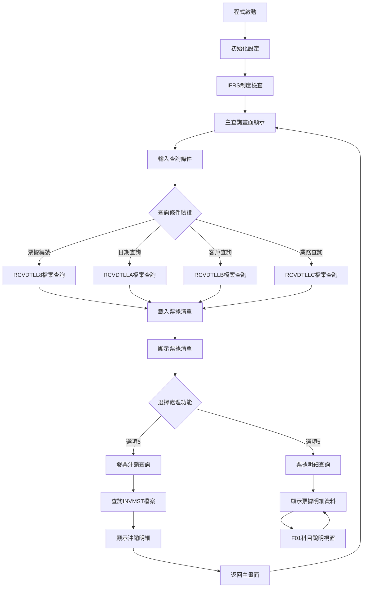
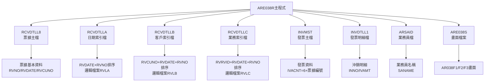
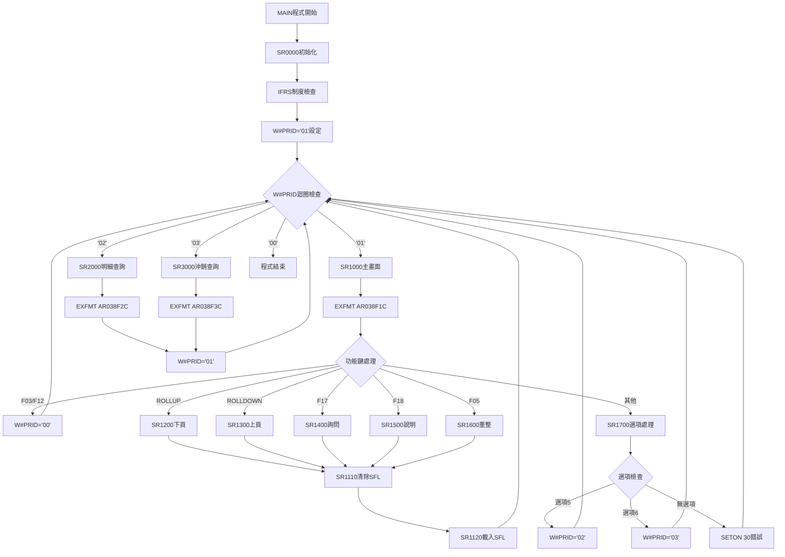

# ARE038R_P02 程式規格書

## 1. 基本資料

| 項目 | 內容 |
|------|------|
| **程式編號** | ARE038R |
| **程式名稱** | 票據異動查詢程式 |
| **程式類型** | RPG/400 |
| **廠區** | P02 |
| **系統名稱** | 應收帳款系統 |
| **子系統** | 票據異動查詢子系統 |
| **檔案位置** | 東鋼list/ARE038R_P02.txt |

## 2. 🎯 程式功能說明

### 主要功能描述
ARE038R程式提供票據異動資料的查詢功能。程式支援票據編號、日期、客戶編號、業務代號四種查詢方式，顯示票據基本資料清單，並提供票據明細查詢和發票沖銷明細查詢功能。

### 🎯 業務流程詳細說明



### 🎯 主要功能特點

#### 查詢條件處理
程式提供四種互斥的查詢方式，透過指示器*IN50-53控制查詢模式切換。

#### 票據金額累計
程式依據RVACTP欄位判斷借貸項目，借項（'D'）加算，貸項減算，計算票據淨額。

#### IFRS制度相容
程式檢查系統日期與IFRS啟用日期，控制*IN77指示器，決定科目顯示格式。

#### 三層查詢結構
第一層顯示票據清單，第二層顯示票據明細，第三層顯示發票沖銷明細。

## 3. 🎯 檔案架構與關聯圖

### 🎯 檔案關聯詳細視覺化圖表



### 使用檔案清單

| 檔案名稱 | 檔案類型 | 使用方式 | 關鍵欄位 | 用途說明 |
|----------|----------|----------|----------|----------|
| RCVDTLL8 | 實體檔案 | INPUT | RVNO | 票據主檔，依票據編號查詢 |
| RCVDTLLA | 邏輯檔案 | INPUT | RVDATE+RVNO | 日期查詢使用，重新命名為RVLA |
| RCVDTLLB | 邏輯檔案 | INPUT | RVCUNO+RVDATE+RVNO | 客戶查詢使用，重新命名為RVLB |
| RCVDTLLC | 邏輯檔案 | INPUT | RVRVID+RVDATE+RVNO | 業務查詢使用，重新命名為RVLC |
| INVMST | 實體檔案 | INPUT | IVACNT+IVAPNO | 發票主檔，查詢沖銷資料 |
| INVDTLL1 | 實體檔案 | INPUT | INNO | 發票明細檔，顯示沖銷明細 |
| ARSAID | 實體檔案 | INPUT | 業務代碼 | 業務員檔，取得業務員姓名 |
| ARE038S | 畫面檔案 | WORKSTN | - | 互動式畫面檔案 |

### 🎯 資料流向詳細說明

#### 查詢處理階段
1. **條件輸入**：使用者輸入S#SFK1-S#SFK4查詢條件
2. **檔案定位**：依查詢條件使用SETLL定位檔案
3. **資料讀取**：使用READ/READE循序讀取符合條件記錄
4. **資料累計**：同票據編號記錄進行金額累計

#### 畫面顯示階段
1. **SFL載入**：將查詢結果載入AR038F1 SUBFILE
2. **分頁控制**：N#PAG1控制每頁12筆記錄
3. **畫面顯示**：EXFMT AR038F1C顯示查詢結果

#### 明細查詢階段
1. **票據選擇**：依S#OPT1選項值執行對應功能
2. **明細載入**：讀取票據所有明細記錄
3. **畫面顯示**：EXFMT AR038F2C或AR038F3C

## 4. 🎯 檔案欄位規格說明

### 主要資料結構

#### RCVDTLL8票據主檔欄位規格
| 欄位代號 | 欄位名稱 | 位置 | 長度 | 型態 | 屬性 | 檢核說明 |
|----------|----------|------|------|------|------|----------|
| RVNO | 票據編號 | 1-6 | 6 | CHAR | KEY | 票據唯一識別碼 |
| RVDATE | 票據日期 | 7-14 | 8 | NUMERIC | - | YYYYMMDD格式 |
| RVCUNO | 客戶編號 | 15-20 | 6 | CHAR | - | 客戶代碼 |
| RVCUNM | 客戶名稱 | 21-30 | 10 | CHAR | - | 客戶名稱 |
| RVRVID | 業務代號 | 31-32 | 2 | CHAR | - | 業務員代碼 |
| RVDPNO | 部門編號 | 33-36 | 4 | CHAR | - | 部門代碼 |
| RVACTP | 會計項目 | 37-37 | 1 | CHAR | - | D=借項,C=貸項 |
| RVUSTP | 帳戶類型 | 38-39 | 2 | CHAR | - | A1-A5,Z5 |
| RVNTTP | 票據類型 | 40-40 | 1 | CHAR | - | A-J類型 |
| RVACNO | 科目編號 | 41-46 | 6 | CHAR | - | 會計科目 |
| RVPBID | 銀行帳號 | 47-60 | 14 | CHAR | - | 票據銀行帳號 |
| RVPANO | 票據帳號 | 61-70 | 10 | CHAR | - | 票據帳號 |
| RVNTNO | 憑證號碼 | 71-90 | 20 | CHAR | - | 票據憑證號碼 |
| RVRAMT | 票據金額 | 91-101 | 11 | PACKED | - | 含2位小數 |
| RVRLNO | 流水號 | 102-111 | 10 | CHAR | - | 系統流水號 |
| RVSANO | 新增帳號 | 112-121 | 10 | CHAR | - | 新增使用者帳號 |
| RVDUDT | 到期日 | 122-129 | 8 | NUMERIC | - | YYYYMMDD格式 |
| RVRESV | 保留欄位 | 130-141 | 12 | CHAR | - | 系統保留 |

#### INVDTLL1發票明細檔欄位規格
| 欄位代號 | 欄位名稱 | 位置 | 長度 | 型態 | 屬性 | 檢核說明 |
|----------|----------|------|------|------|------|----------|
| INNO | 發票編號 | 1-10 | 10 | CHAR | KEY | 發票唯一識別碼 |
| INORNO | 訂單編號 | 11-16 | 6 | CHAR | - | 相關訂單編號 |
| INAPNO | 特殊編號 | 17-22 | 6 | CHAR | - | 特殊用途編號 |
| INAAMT | 發票金額A | 23-33 | 11 | PACKED | - | 發票本體金額 |
| INATAX | 營業稅額 | 34-44 | 11 | PACKED | - | 營業稅金額 |
| INBAMT | 發票金額B | 45-55 | 11 | PACKED | - | 其他費用金額 |
| INNBAL | 發票餘額 | 56-66 | 11 | PACKED | - | 未沖銷餘額 |

### 🔍 重點欄位切割技術詳解

#### UDS使用者資料結構
```
UDS (使用者資料結構)：
位置 951-985：S#COMP (35字元) - 公司名稱
位置1011-1020：S#DEVI (10字元) - 終端機代號
位置1001-1010：U#USID (10字元) - 使用者ID
位置1001-1003：U#USDP (3字元) - 使用者部門
位置1001-1001：U#USTP (1字元) - 使用者類型
位置1021-1021：U#AREA (1字元) - 廠區代碼
```

#### DS資料結構定義
```
SRRVNO資料結構 (6字元)：
位置1-6：SRRVNO - 完整票據編號
位置1-1：D#RVNO - 票據編號第1位
```

```
W#ARYE資料結構 (14字元)：
位置1-14：W#ARYE - 完整應收帳款資料
位置1-10：D#ARIN - 應收帳款編號 (10字元)
位置11-14：D#ARRN - 應收帳款參考號 (4字元)
```

```
S#SANO資料結構 (10字元)：
位置1-10：S#SANO - 完整帳號資料
位置1-1：D#BKTP - 銀行類型 (1字元)
位置2-2：D#BKCR - 銀行代碼 (1字元)
位置3-10：D#BKNO - 銀行帳號 (8字元)
```

#### 日期處理資料結構
```
W#YMD資料結構 (80字元)：
位置1-80：W#YMD - 完整日期資料
位置7-80：D#DD - 日期部分 (74字元)
```

### 🎯 欄位挪用詳細分析

#### S#SANO欄位挪用分析
**原始定義**：新增帳號欄位，用於記錄建立票據的使用者帳號
**實際使用方式**：
- 位置1：銀行類型代碼
- 位置2：銀行分類代碼  
- 位置3-10：實際銀行帳號

**挪用原因**：票據處理需要記錄詳細的銀行資訊，包含銀行類型分類，原有欄位空間不足，因此將10字元的帳號欄位重新切割使用。

#### 畫面欄位重複使用
多個邏輯檔案使用相同的實體欄位名稱，透過RENAME重新命名區分：
- RVREC：原始票據記錄
- RVLA：按日期排序的邏輯檔案
- RVLB：按客戶排序的邏輯檔案
- RVLC：按業務排序的邏輯檔案

### 重要變數定義表

| 變數名稱 | 資料型態 | 長度 | 用途說明 |
|----------|----------|------|----------|
| W#PRID | CHAR | 2 | 程式畫面控制ID |
| W#RTNV | CHAR | 1 | 程式回傳值旗標 |
| W#SFE1 | CHAR | 1 | SFL結束旗標 |
| W#SFB1 | CHAR | 1 | SFL開始旗標 |
| W#RVNO | CHAR | 6 | 目前處理票據編號 |
| W#SCN1 | CHAR | 1 | 選擇處理旗標 |
| N#PAG1 | NUMERIC | 2 | 第一頁記錄數 |
| N#PAG2 | NUMERIC | 2 | 第二頁記錄數 |
| N#PAG3 | NUMERIC | 2 | 第三頁記錄數 |
| RRN1 | NUMERIC | 4 | 第一畫面記錄編號 |
| RRN2 | NUMERIC | 4 | 第二畫面記錄編號 |
| RRN3 | NUMERIC | 4 | 第三畫面記錄編號 |

## 5. 🎯 輸出/入螢幕布局

### AR038F1 - 主查詢畫面
```
+--------------------------------------------------------------------------+
|2024/12/30  東鋼實業股份有限公司    會計帳款異動票據查詢      ARE038S-1  |
|14:32:55                                                      TERMINAL   |
|                                                                          |
|功能: 5:查詢票據明細   6:查詢沖銷明細                                    |
|--------------------------------------------------------------------------|
|功能 票據編號  日期     客戶  客戶名稱    票據金額  業務 業務員姓名       |
|--------------------------------------------------------------------------|
| [_] [______] [__/__/__] [____] [________] [_______] [__] [__________]    |
| [_] [______] [__/__/__] [____] [________] [_______] [__] [__________]    |
| [_] [______] [__/__/__] [____] [________] [_______] [__] [__________]    |
| [_] [______] [__/__/__] [____] [________] [_______] [__] [__________]    |
| [_] [______] [__/__/__] [____] [________] [_______] [__] [__________]    |
| [_] [______] [__/__/__] [____] [________] [_______] [__] [__________]    |
| [_] [______] [__/__/__] [____] [________] [_______] [__] [__________]    |
| [_] [______] [__/__/__] [____] [________] [_______] [__] [__________]    |
|                                                                          |
|查詢條件: 票據編號[______] 日期[____/__/__] 客戶[______] 業務[__]        |
|                                                                          |
|--------------------------------------------------------------------------|
|F03:離開      F12:回前      F17:詢問      F18:說明      F05:重新整理    |
|      PGUP:上頁      PGDN:下頁      ENTER:執行                          |
|[錯誤訊息顯示區]                                                        |
+--------------------------------------------------------------------------+
```

#### 🎯 畫面欄位詳細說明
**SFL明細區欄位**：
- **S#OPT1** (1字元)：功能選項，可輸入' '、'5'、'6'
- **S#RVNO** (6字元)：票據編號，唯讀顯示
- **S#RVDT** (8字元)：票據日期，格式YYYY/MM/DD
- **S#CUNO** (6字元)：客戶編號，唯讀顯示
- **S#CUNM** (10字元)：客戶名稱，唯讀顯示
- **S#NAMT** (11字元)：票據金額，EDTCDE(3)格式化
- **S#SALE** (2字元)：業務代號，唯讀顯示
- **S#SANM** (10字元)：業務員姓名，唯讀顯示

**查詢條件欄位**：
- **S#SFK1** (6字元)：票據編號查詢條件
- **S#SFK2** (8字元)：日期查詢條件，格式YYYY/MM/DD
- **S#SFK3** (6字元)：客戶編號查詢條件
- **S#SFK4** (2字元)：業務代號查詢條件

### AR038F2 - 票據明細查詢畫面
```
+--------------------------------------------------------------------------+
|2024/12/30  東鋼實業股份有限公司    票據異動明細查詢        ARE038S-2    |
|14:32:55                                                      TERMINAL   |
|                                                                          |
|票據編號: [______]  票據部門: [____]  票據業務代號: [_]                  |
|客戶編號: [______]  客戶名稱: [________]    票據日期: [____/__/__]       |
|                                                票據金額合計: [_________] |
|--------------------------------------------------------------------------|
|會帳帳戶               票                                                |
|計戶類科目編號        據憑證號碼      原票據編 流水號 金額    保留欄位     |
|項號別                 票據銀行帳號  票據帳號  新增帳號  到期日          |
|--------------------------------------------------------------------------|
|[_][__][_][______] [____________________] [______] [______] [_________]   |
|               [______________] [__________] [__________] [____/__/__]    |
|[_][__][_][______] [____________________] [______] [______] [_________]   |
|               [______________] [__________] [__________] [____/__/__]    |
|[_][__][_][______] [____________________] [______] [______] [_________]   |
|               [______________] [__________] [__________] [____/__/__]    |
|[_][__][_][______] [____________________] [______] [______] [_________]   |
|               [______________] [__________] [__________] [____/__/__]    |
|                                                                          |
|--------------------------------------------------------------------------|
|F01:說明      F03:離開      F12:回前      ENTER:確認                     |
|[錯誤訊息顯示區]                                                        |
+--------------------------------------------------------------------------+
```

#### 🎯 畫面欄位詳細說明
**標頭資料欄位**：
- **S#RVNO** (6字元)：票據編號，唯讀
- **S#DPNO** (4字元)：票據部門，唯讀
- **S#RVID** (1字元)：票據業務代號，唯讀
- **S#CUNO** (6字元)：客戶編號，唯讀
- **S#CUNM** (10字元)：客戶名稱，唯讀
- **S#RVDT** (8字元)：票據日期，唯讀
- **S#NAMT** (11字元)：票據金額合計，EDTCDE(1)格式

**SFL明細欄位**：
- **S#SFI2** (2字元)：序號，唯讀
- **S#ACTP** (1字元)：會計項目，C/D
- **S#USTP** (2字元)：帳戶類型，A1-A5,Z5
- **S#NTTP** (1字元)：票據類型，A-J
- **S#ACNO** (6字元)：科目編號
- **S#NTNO** (20字元)：票據憑證號碼
- **S#OLRV** (6字元)：原票據編號
- **S#RLNO** (10字元)：流水號
- **S#RAMT** (10字元)：票據金額，EDTWRD格式
- **S#PBID** (14字元)：票據銀行帳號
- **S#PANO** (10字元)：票據帳號
- **S#SANO** (10字元)：新增帳號
- **S#DUDT** (8字元)：到期日，格式YYYY/MM/DD
- **S#RESV** (12字元)：保留欄位

### AR038F3 - 發票沖銷明細查詢畫面
```
+--------------------------------------------------------------------------+
|2024/12/30  東鋼實業股份有限公司 票據異動發票沖銷查詢      ARE038S-3    |
|14:32:55                                                      TERMINAL   |
|                                                                          |
|票據編號: [______]  票據部門: [____]  票據業務代號: [_]                  |
|客戶編號: [______]  客戶名稱: [________]    票據日期: [____/__/__]       |
|票據金額合計: [_________]                發票沖銷合計: [_________]       |
|--------------------------------------------------------------------------|
|  發票編號  訂單編號 特殊編號   發票金額   沖銷金額   發票餘額            |
|---------------------------------+---+---+---+---+---+---+---+----------|
| [__________] [______] [______] [_________] [_________] [_________]        |
| [__________] [______] [______] [_________] [_________] [_________]        |
| [__________] [______] [______] [_________] [_________] [_________]        |
| [__________] [______] [______] [_________] [_________] [_________]        |
| [__________] [______] [______] [_________] [_________] [_________]        |
| [__________] [______] [______] [_________] [_________] [_________]        |
| [__________] [______] [______] [_________] [_________] [_________]        |
| [__________] [______] [______] [_________] [_________] [_________]        |
|                                                                          |
|---------------------------------+---+---+---+---+---+---+---+----------|
|F03:離開          F12:回前      ENTER:確認                               |
|[錯誤訊息顯示區]                                                        |
+--------------------------------------------------------------------------+
```

#### 🎯 畫面欄位詳細說明
**SFL沖銷明細欄位**：
- **S#SFI3** (2字元)：序號，唯讀
- **S#INNO** (10字元)：發票編號，唯讀
- **S#INOR** (6字元)：訂單編號，唯讀
- **S#INAP** (6字元)：特殊編號，唯讀
- **S#INAM** (11字元)：發票金額，EDTCDE(3)格式
- **S#INXA** (11字元)：沖銷金額，EDTCDE(3)格式
- **S#INBA** (11字元)：發票餘額，EDTCDE(3)格式
- **S#XAMT** (11字元)：沖銷合計，EDTCDE(1)格式

### AR038F2W/AR038F3W - 科目說明視窗
```
┌──────────── 科目說明 ────────────┐
│帳戶類型          票據類型          │
│                                  │
│A1:一般存款       A:匯票           │
│A2:定期存款       B:期票匯票       │
│A3:支票定期       C:本票           │
│A4:存款準備       D:期票本票       │
│A5:國際帳戶       E:國際匯票       │
│Z5:其他           F:匯票           │
│                  G:支票           │
│                  H:現金           │
│                  I:信用狀         │
│                  J:國外票據       │
│                                  │
│     常見會計科目                 │
│                                  │
│1111預收款項      1112國外票據    │
│1114外匯存款      1131銀行存款    │
│2125銀行保證      2159國際匯款    │
│1134銀行帳戶      1137可轉換票    │
│8149其他應收      8246差額調整    │
│7111進口代理保證  7112進口代理保證│
│7142進口代理成品保                │
└──────────────────────────────────┘
```

### 🎯 畫面控制邏輯

#### 指示器控制
- ***IN50***：票據編號查詢模式
- ***IN51***：日期查詢模式  
- ***IN52***：客戶查詢模式
- ***IN53***：業務查詢模式
- ***IN71***：SFLDSPCTL
- ***IN72***：SFLDSP
- ***IN73***：SFLCLR
- ***IN74***：SFLEND
- ***IN77***：IFRS制度控制

#### SFL顯示控制
```
IF S#SFN1 = 0 (無資料)
   SETOF 72,73 (SFLDSP/SFLCLR OFF)
   SETON 71 (SFLDSPCTL ON)
ELSE (有資料)
   SETOF 73 (SFLCLR OFF)  
   SETON 71,72 (SFLDSPCTL/SFLDSP ON)
ENDIF

IF W#SFE1 = 'T' (檔案結尾)
   SETON 74 (SFLEND ON)
ELSE
   SETOF 74 (SFLEND OFF)
ENDIF
```

### 功能鍵詳細定義

#### 主畫面功能鍵
- **F03**：離開程式，設定W#PRID='00'
- **F05**：重新整理，執行SR1600
- **F12**：離開程式，設定W#PRID='00'
- **F17**：詢問功能，執行SR1400
- **F18**：說明功能，執行SR1500
- **ROLLUP**：向下翻頁，執行SR1200
- **ROLLDOWN**：向上翻頁，執行SR1300
- **ENTER**：執行選項處理，執行SR1700

#### 明細畫面功能鍵
- **F01**：科目說明，顯示AR038F2W或AR038F3W視窗
- **F03**：離開程式，設定W#PRID='00'
- **F12**：回主畫面，設定W#PRID='01'
- **ENTER**：確認操作

## 6. 🎯 處理流程程序說明

### 🎯 主程序邏輯深度分析



### 🎯 詳細處理步驟逐一分析

#### SR0000 - 系統初始化處理
```
1. 程式控制變數初始化
   W#RTNV = 'F'
   N#PAG1 = 12
   N#PAG2 = 90  
   N#PAG3 = 99

2. SFL控制變數初始化
   W#SFE1 = 'F'
   W#SFB1 = 'F' 
   RRN1 = 0
   RRN2 = 0
   RRN3 = 0

3. 查詢條件變數初始化
   S#SFK1 = *BLANK
   S#SFK2 = *BLANK
   S#SFK3 = *BLANK 
   S#SFK4 = *BLANK

4. 查詢模式初始化
   *IN50 = *ON (票據編號查詢)
   *IN51-53 = *OFF (其他查詢)

5. IFRS制度檢查
   U#SYSD = *DATE - 19000000
   讀取IFRS控制檔案
   IF U#SYSD < D#IFRS
      *IN77 = *ON (舊制)
   ELSE
      *IN77 = *OFF (IFRS)
   ENDIF

6. 執行SR1100查詢條件設定
7. 執行SR1500檔案定位
8. 設定W#PRID = '01'
```

#### SR1000 - 主畫面顯示處理
```
1. 寫入AR038F1M標題畫面

2. SFL顯示控制設定
   IF S#SFN1 = 0
      SETOF 72,73
      SETON 71
   ELSE
      SETOF 73
      SETON 71,72
   ENDIF

3. SFL結束標記設定
   IF W#SFE1 = 'T'
      SETON 74
   ELSE
      SETOF 74
   ENDIF

4. 執行EXFMT AR038F1C

5. 清除錯誤指示器
   SETOF 30
   S#MSG1 = *BLANK

6. 游標位置處理
   IF S#CRN1 <> 0
      S#NBR1 = S#CRN1
   ENDIF

7. 功能鍵處理分派
   SELECT
   WHEN *IN03 OR *IN12 = '1'
      W#PRID = '00'
   WHEN *IN91 = '1'
      執行SR1200
   WHEN *IN92 = '1'
      執行SR1300
   WHEN *IN17 = '1'
      執行SR1400
   WHEN *IN18 = '1'
      執行SR1500
   WHEN *IN05 = '1'
      執行SR1600
   OTHER
      執行SR1700
   ENDSL
```

#### SR1100 - 查詢條件驗證處理
```
1. 查詢條件互斥檢查
   IF S#SFK1 <> *BLANK AND (S#SFK2<>0 OR S#SFK3<>*BLANK OR S#SFK4<>*BLANK)
      S#MSG1 = T#MSG,4
      GOTO ES1100
   ENDIF

2. 查詢模式設定
   IF S#SFK1 <> *BLANK
      *IN50 = *ON
      SETOF 51,52,53
   ENDIF
   
   IF S#SFK2 <> 0
      *IN51 = *ON
      SETOF 50,52,53
   ENDIF
   
   IF S#SFK3 <> *BLANK
      *IN52 = *ON
      SETOF 50,51,53
   ENDIF
   
   IF S#SFK4 <> *BLANK
      *IN53 = *ON
      SETOF 50,51,52
   ENDIF

3. 檔案定位處理
   IF *IN50 = *ON
      IF S#SFK1 <> *BLANK
         S#SFK1 SETLL RVREC
         IF *IN69 = '1'
            S#MSG1 = T#MSG,1
            SETON 30,31
            GOTO ES1100
         ENDIF
         S#SFK1 = *BLANK
      ELSE
         *LOVAL SETLL RVREC
      ENDIF
   ENDIF

4. 類似處理適用於其他三種查詢模式

5. 執行SR1110清除SFL
6. 執行SR1120載入SFL
7. S#NBR1 = 1
```

#### SR1120 - SFL資料載入處理
```
1. 初始化變數
   W#RVNO = *BLANK
   S#SFN1 = 0
   RRN1 = 0
   W#SFE1 = 'F'

2. 主要讀取迴圈
   DO WHILE 1 = 1
      依查詢模式讀取資料
      IF *IN50: READ RVREC
      IF *IN51: READ RVLA
      IF *IN52: READ RVLB  
      IF *IN53: READ RVLC
      
      IF *IN69 = '1'
         W#SFE1 = 'T'
         LEAVE
      ENDIF

3. 票據記錄分組處理
      IF RVNO = W#RVNO
         執行SR1122累計金額
      ELSE
         IF W#RVNO <> *BLANK
            S#SFN1 + 1
            RRN1 + 1
            WRITE AR038F1
         ENDIF
         
         W#RVNO = RVNO
         CLEAR AR038F1
         執行SR1121設定標頭
         執行SR1122累計金額
      ENDIF

4. 分頁控制
      IF S#SFN1 = N#PAG1
         LEAVE
      ENDIF
   ENDDO
```

#### SR1121 - 票據標頭資料設定
```
欄位對應設定：
S#RVNO = RVNO
S#RVDT = RVDATE
S#CUNO = RVCUNO
S#CUNM = RVCUNM
S#SALE = RVRVID

業務員名稱查詢：
S#SALE CHAIN ARSAID
IF *IN69 = '1'
   S#SANM = *BLANK
ELSE
   S#SANM = SANAME
ENDIF
```

#### SR1122 - 票據金額累計處理
```
借貸項目判斷累計：
IF RVACTP = 'D'
   S#NAMT = S#NAMT + RVRAMT
ELSE
   S#NAMT = S#NAMT - RVRAMT
ENDIF
```

### 🎯 子程序邏輯分析

#### SR1200 - 向下翻頁處理
```
1. 檔案結尾檢查
   IF W#SFE1 = 'T'
      S#MSG1 = T#MSG,2
      GOTO ES1200
   ENDIF

2. 目前位置定位
   IF S#SFN1 <> 0
      RRN1 = S#SFN1
      RRN1 CHAIN AR038F1
      依查詢模式設定檔案位置
      IF *IN50: S#RVNO SETGT RVREC
      IF *IN51: KEY01 SETGT RVLA
      IF *IN52: KEY02 SETGT RVLB
      IF *IN53: KEY03 SETGT RVLC
   ENDIF

3. 重新載入SFL
   執行SR1110
   執行SR1120
   
4. 游標位置調整
   IF S#NBR1 > S#SFN1
      S#NBR1 = 1
   ENDIF
```

#### SR1300 - 向上翻頁處理
```
1. 資料檢查
   IF S#SFN1 <> 0
      RRN1 = 1
      RRN1 CHAIN AR038F1
      依查詢模式設定檔案位置到前面
   ENDIF

2. 向前讀取處理
   執行SR1130
   執行SR1110
   執行SR1120

3. 檔案開頭檢查
   IF W#SFB1 = 'T'
      S#MSG1 = T#MSG,3
   ENDIF
```

#### SR1700 - 選項處理邏輯
```
1. 查詢條件重新設定檢查
   IF S#SFK1 <> *BLANK OR S#SFK2 <> 0 OR S#SFK3 <> *BLANK OR S#SFK4 <> *BLANK
      執行SR1100
      GOTO ES1700
   ENDIF

2. 選項掃描迴圈
   RRN1 = 0
   W#SCN1 = 'F'
   
   DO S#SFN1 TIMES
      RRN1 + 1
      RRN1 CHAIN AR038F1
      
      SELECT
      WHEN S#OPT1 = ' '
         ITER
      WHEN S#OPT1 = '5'
         W#PRID = '02'
         執行SR2100
      WHEN S#OPT1 = '6'
         W#PRID = '03'
         執行SR3100
      ENDSL
      
      W#SCN1 = 'T'
      S#NBR1 = RRN1
      S#OPT1 = *BLANK
      UPDATE AR038F1
      LEAVE
   ENDDO

3. 選項驗證
   IF W#SCN1 = 'F'
      SETON 30
   ENDIF
```

#### SR2000 - 票據明細查詢處理
```
1. 畫面標頭寫入
   WRITE AR038F2M

2. SFL控制設定
   IF S#SFN2 = 0
      SETOF 72,73
      SETON 71,74
   ELSE
      SETOF 73
      SETON 71,72,74
   ENDIF

3. 畫面顯示
   EXFMT AR038F2C

4. 功能鍵處理
   SELECT
   WHEN *IN01 = '1'
      IF *IN77 = *ON
         EXFMT AR038F2W
      ELSE
         EXFMT AR038F3W
      ENDIF
   WHEN *IN03 = '1'
      W#PRID = '00'
   WHEN *IN12 = '1'
      W#PRID = '01'
   OTHER
      W#PRID = '01'
   ENDSL
```

#### SR2100 - 明細資料載入
```
1. 初始化設定
   S#MSG2 = *BLANK
   S#NBR2 = 1
   SETOF 71,72
   SETON 73
   WRITE AR038F2C
   
   S#SFN2 = 0
   RRN2 = 0

2. 票據標頭讀取
   S#RVNO CHAIN RVREC
   執行SR2101設定標頭

3. 明細資料迴圈載入
   RRN2 = 0
   DO WHILE *IN69 = '0'
      RRN2 + 1
      CLEAR AR038F2
      S#SFI2 = RRN2
      執行SR2102設定明細
      WRITE AR038F2
      S#RVNO READE RVREC
   ENDDO
   
   S#SFN2 = RRN2
```

#### SR3000 - 沖銷查詢處理
```
處理邏輯與SR2000類似，差異在於：
1. 使用AR038F3相關畫面
2. 呼叫SR3100進行沖銷資料載入
3. 顯示發票沖銷明細而非票據明細
```

#### SR3110 - 沖銷明細載入
```
1. 標頭設定
   執行SR2101設定票據標頭
   S#XAMT = 0

2. 發票查詢條件設定
   IVACNT = '6'
   IVAPNO = S#RVNO
   K#IV CHAIN IVREC

3. 沖銷明細迴圈載入
   RRN3 = 0
   DO WHILE *IN69 = '0'
      日期檢查
      IF IVACDT < 1100101
         GOTO SR310
      ENDIF
      
      RRN3 + 1
      CLEAR AR038F3
      執行SR3101設定沖銷明細
      S#SFI3 = RRN3
      WRITE AR038F3
      
      SR310 TAG
      K#IV READE IVREC
   ENDDO
   
   S#SFN3 = RRN3
```

#### SR3101 - 沖銷明細欄位設定
```
1. 發票資料讀取
   IVNO CHAIN INREC

2. 欄位對應設定
   S#INNO = INNO
   S#INOR = INORNO
   S#INAP = INAPNO
   S#INAM = INAAMT + INATAX + INBAMT
   S#INBA = INNBAL
   S#INXA = -IVAMT
   S#XAMT = S#XAMT - IVAMT
```

### 🎯 特殊邏輯處理

#### IFRS制度相容處理
```
程式啟動時檢查IFRS啟用狀態：
1. 計算系統日期：U#SYSD = *DATE - 19000000
2. 讀取IFRS控制檔：*NAMVAR DEFN ARIFRSCTL IFRS
3. 比較日期：IF U#SYSD < D#IFRS
4. 設定指示器：*IN77控制新舊制顯示
5. 科目說明視窗：*IN77決定顯示AR038F2W或AR038F3W
```

#### 查詢條件互斥控制
```
程式限制同時只能使用一種查詢條件：
1. 檢查多重條件輸入
2. 顯示錯誤訊息T#MSG,4
3. 強制使用者修正輸入
4. 透過*IN50-53控制查詢模式
```

#### 票據金額計算邏輯
```
同一票據編號的多筆記錄進行借貸平衡計算：
1. 借項（RVACTP='D'）：S#NAMT + RVRAMT
2. 貸項（RVACTP='C'）：S#NAMT - RVRAMT
3. 最終顯示淨額
```

#### 發票金額計算
```
發票總金額 = 本體金額 + 營業稅 + 其他費用
S#INAM = INAAMT + INATAX + INBAMT

沖銷累計 = 各筆沖銷金額總和（負數）
S#XAMT = S#XAMT - IVAMT
```

#### SFL分頁計算
```
記錄計數：
S#SFN1 = S#SFN1 + 1：增加SFL記錄數
RRN1 = RRN1 + 1：增加相對記錄編號

分頁控制：
IF S#SFN1 = N#PAG1：檢查是否達到分頁上限
```

### 檢核機制詳解

#### 查詢條件檢核
```
互斥條件檢核：
IF (條件1存在 AND 其他條件存在)
   顯示錯誤訊息
   返回重新輸入
ENDIF

存在性檢核：
SETLL檔案
IF *IN69 = '1'
   顯示查無資料
   返回重新輸入
ENDIF
```

#### 檔案記錄檢核
```
業務員檔案檢核：
S#SALE CHAIN ARSAID
IF *IN69 = '1'
   S#SANM = *BLANK
ELSE
   S#SANM = SANAME
ENDIF

發票檔案檢核：
IVNO CHAIN INREC
確保發票記錄存在才進行處理
```

#### 日期有效性檢核
```
IFRS日期檢核：
U#SYSD IFLT D#IFRS：比較系統日期與IFRS啟用日期

版本日期檢核：
IVACDT IFLT 1100101：檢查是否為110/01/01之前記錄
```

#### SFL狀態檢核
```
選項驗證：
IF S#OPT1 = ' '
   ITER：跳過處理
ENDIF

記錄存在檢核：
IF S#SFN1 = 0
   設定空白SFL顯示
ENDIF
```

## 7. 🎯 數據操作與轉換分析

### 檔案操作詳解

#### READ操作邏輯
```
順序讀取操作：
1. READ RVREC：讀取票據主檔下一筆記錄
2. READ RVLA：讀取日期排序邏輯檔案
3. READ RVLB：讀取客戶排序邏輯檔案
4. READ RVLC：讀取業務排序邏輯檔案

條件讀取操作：
1. READE RVREC：讀取相同票據編號記錄
2. READE IVREC：讀取相同科目+票據編號記錄

隨機讀取操作：
1. CHAIN RVREC：依票據編號直接讀取
2. CHAIN ARSAID：依業務代號讀取業務員資料
3. CHAIN INREC：依發票編號讀取發票明細
4. CHAIN AR038F1：依RRN讀取SFL記錄
```

#### WRITE/UPDATE操作邏輯
```
SFL記錄寫入：
1. WRITE AR038F1：寫入票據清單SFL記錄
2. WRITE AR038F2：寫入票據明細SFL記錄
3. WRITE AR038F3：寫入沖銷明細SFL記錄

畫面控制記錄：
1. WRITE AR038F1M：寫入主畫面標題
2. WRITE AR038F1C：寫入主畫面控制
3. WRITE AR038F2M：寫入明細畫面標題
4. WRITE AR038F2C：寫入明細畫面控制

SFL記錄更新：
1. UPDATE AR038F1：更新選項欄位清空
```

#### 檔案定位邏輯
```
SETLL定位操作：
1. S#SFK1 SETLL RVREC：依票據編號定位
2. S#SFK2 SETLL RVLA：依日期定位
3. S#SFK3 SETLL RVLB：依客戶定位
4. S#SFK4 SETLL RVLC：依業務定位
5. *LOVAL/*HIVAL SETLL：檔案開頭/結尾定位

SETGT定位操作：
1. S#RVNO SETGT RVREC：定位到下一票據
2. KEY01-03 SETGT：依複合鍵定位下一筆
```

### 數據轉換邏輯

#### 日期格式轉換
```
YYYYMMDD數值 → YYYY/MM/DD顯示：
使用EDTWRD('    /  /  ')編輯字碼

範例：
20241230 → 2024/12/30
```

#### 金額格式轉換
```
數值型態 → 顯示格式：
1. EDTCDE(1)：千分位逗號，1位小數
2. EDTCDE(3)：千分位逗號，無小數
3. EDTWRD(' ,   ,   ,  0')：自訂千分位格式

範例：
1234567 → 1,234,567.0
```

#### 字元欄位處理
```
MOVE/MOVEL操作：
1. MOVEL：由左側開始移動字元
2. MOVE：由右側開始移動字元
3. CLEAR：清空記錄結構

範例：
MOVEL RVNO S#RVNO：票據編號左對齊移動
```

### 計算邏輯分析

#### 票據金額計算
```
借貸平衡計算：
淨額 = Σ(借項金額) - Σ(貸項金額)

程式實作：
IF RVACTP = 'D'
   S#NAMT = S#NAMT + RVRAMT
ELSE
   S#NAMT = S#NAMT - RVRAMT
ENDIF
```

#### 發票金額計算
```
發票總金額 = 本體金額 + 營業稅 + 其他費用
S#INAM = INAAMT + INATAX + INBAMT

沖銷累計 = 各筆沖銷金額總和（負數）
S#XAMT = S#XAMT - IVAMT
```

#### SFL分頁計算
```
記錄計數：
S#SFN1 = S#SFN1 + 1：增加SFL記錄數
RRN1 = RRN1 + 1：增加相對記錄編號

分頁控制：
IF S#SFN1 = N#PAG1：檢查是否達到分頁上限
```

### 檢核機制詳解

#### 查詢條件檢核
```
互斥條件檢核：
IF (條件1存在 AND 其他條件存在)
   顯示錯誤訊息
   返回重新輸入
ENDIF

存在性檢核：
SETLL檔案
IF *IN69 = '1'
   顯示查無資料
   返回重新輸入
ENDIF
```

#### 檔案記錄檢核
```
業務員檔案檢核：
S#SALE CHAIN ARSAID
IF *IN69 = '1'
   S#SANM = *BLANK
ELSE
   S#SANM = SANAME
ENDIF

發票檔案檢核：
IVNO CHAIN INREC
確保發票記錄存在才進行處理
```

#### 日期有效性檢核
```
IFRS日期檢核：
U#SYSD IFLT D#IFRS：比較系統日期與IFRS啟用日期

版本日期檢核：
IVACDT IFLT 1100101：檢查是否為110/01/01之前記錄
```

#### SFL狀態檢核
```
選項驗證：
IF S#OPT1 = ' '
   ITER：跳過處理
ENDIF

記錄存在檢核：
IF S#SFN1 = 0
   設定空白SFL顯示
ENDIF
```

## 8. 🎯 錯誤處理程序說明

### 🎯 詳細錯誤代碼清冊

| 錯誤代碼 | 錯誤訊息 | 發生條件 | 處理方式 | 相關欄位 |
|----------|---------|---------|---------|---------|
| **T#MSG,1** | 查詢無資料！ | SETLL檔案後*IN69='1' | 清空查詢條件，重新輸入 | S#SFK1-4 |
| **T#MSG,2** | 已到檔案結尾 | W#SFE1='T'時執行下頁 | 顯示訊息，維持目前頁面 | - |
| **T#MSG,3** | 已到檔案開頭 | W#SFB1='T'時執行上頁 | 顯示訊息，維持目前頁面 | - |
| **T#MSG,4** | 只能選擇一種查詢條件 | 多重查詢條件同時輸入 | 清空多餘條件，保留一種 | S#SFK1-4 |
| ***IN30*** | 未選擇處理選項 | W#SCN1='F'無選項選擇 | SETON 30，要求選擇選項 | S#OPT1 |

### 🎯 系統異常處理邏輯

#### 檔案操作失敗處理
```
檔案不存在處理：
IF 檔案開啟失敗
   程式異常終止
   返回呼叫程式
ENDIF

記錄鎖定失敗：
IF CHAIN操作*IN69='1'
   顯示記錄不存在訊息
   返回上級處理
ENDIF
```

#### 程式調用失敗處理
```
子程序調用錯誤：
程式採用EXSR內部子程序調用
無外部程式調用失敗風險

畫面檔案錯誤：
IF EXFMT執行失敗
   程式異常終止
ENDIF
```

#### 資料完整性錯誤處理
```
票據編號重複檢查：
程式僅進行查詢，無重複問題

金額計算溢位：
使用PACKED decimal型態
自動處理數值溢位

日期格式錯誤：
使用EDTWRD自動格式化
系統自動處理格式錯誤
```

#### 併發控制失敗處理
```
多使用者併發：
程式僅進行檢視查詢
無併發控制需求

檔案鎖定衝突：
使用INPUT檔案開啟
無鎖定衝突問題
```

### 錯誤處理流程

#### 查詢條件錯誤處理
```
SR1100子程序處理：
1. 檢查查詢條件互斥
2. 設定錯誤訊息T#MSG,4
3. GOTO ES1100跳到結尾
4. 返回主畫面重新輸入
5. SETON 30,31錯誤指示器
```

#### 檔案定位錯誤處理
```
SETLL操作後檢查：
1. 檢查*IN69指示器
2. IF *IN69='1'設定錯誤訊息
3. 顯示T#MSG,1查無資料
4. 清空查詢條件
5. 返回重新輸入
```

#### 翻頁邊界錯誤處理
```
下頁處理：
IF W#SFE1='T'
   S#MSG1 = T#MSG,2
   GOTO ES1200
   維持目前畫面
ENDIF

上頁處理：
IF W#SFB1='T'
   S#MSG1 = T#MSG,3
   維持目前畫面
ENDIF
```

#### 選項驗證錯誤處理
```
SR1700選項掃描：
1. 掃描所有SFL記錄
2. 檢查S#OPT1欄位值
3. IF 無有效選項
   W#SCN1='F'
   SETON 30
   要求重新選擇
ENDIF
```

### 訊息顯示機制

#### 訊息欄位控制
```
畫面訊息欄位：
S#MSG1：主畫面訊息（AR038F1，70字元）
S#MSG2：明細畫面訊息（AR038F2，70字元）
S#MSG3：沖銷畫面訊息（AR038F3，70字元）

顯示屬性：
DSPATR(HI)：高亮度顯示
位置：第24行第2欄
```

#### 錯誤指示器控制
```
錯誤狀態指示器：
*IN30：一般錯誤指示器
*IN31：附加錯誤指示器

清除時機：
每次畫面顯示前：SETOF 30
每次輸入處理前：MOVEL *BLANK S#MSG1
```

#### 系統訊息來源
```
T#MSG訊息陣列：
T#MSG,1：「查詢無資料！」
T#MSG,2：「已到檔案結尾」
T#MSG,3：「已到檔案開頭」
T#MSG,4：「只能選擇一種查詢條件」

訊息載入：
MOVE T#MSG,n S#MSG1
```

## 9. 🎯 備註

### 🎯 特殊注意事項

#### 查詢模式切換
程式透過*IN50-53四個指示器控制不同的查詢模式，同時只能啟動一個指示器，確保查詢條件的唯一性。

#### SFL記錄管理
程式對於同一票據編號的多筆記錄進行分組處理，在SFL中僅顯示一筆匯總記錄，金額為借貸項目的淨額。

#### IFRS制度相容
程式啟動時自動檢測IFRS制度啟用狀態，動態決定科目顯示格式和說明視窗內容。

#### 檔案重新命名機制
程式使用四個相同欄位結構的邏輯檔案，透過RENAME語法重新命名為RVREC、RVLA、RVLB、RVLC，避免欄位名稱衝突。

#### 日期檢核版本控制
1308A版本增加的日期檢核機制，過濾110/01/01之前的票據異動記錄，修正系統BUG。

#### 三層查詢架構
程式採用三層查詢結構：票據清單 → 票據明細 → 發票沖銷，提供完整的票據異動查詢功能。

#### 金額計算方式
票據金額採用借貸平衡原理計算，借項加算、貸項減算，顯示最終淨額。發票沖銷金額以負數方式累計。

#### 業務員資料關聯
程式透過ARSAID檔案查詢業務員姓名，若查無資料則顯示空白，不影響主要查詢功能。

#### 分頁控制機制
三個畫面分別設定不同的分頁大小：主畫面12筆、明細畫面90筆、沖銷畫面99筆。

#### 科目說明視窗
程式依據IFRS制度狀態顯示不同的科目說明視窗，新制顯示6位科目代碼，舊制顯示4位科目代碼。

