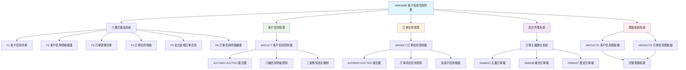
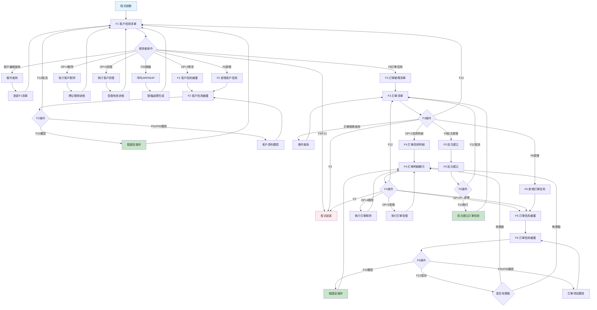
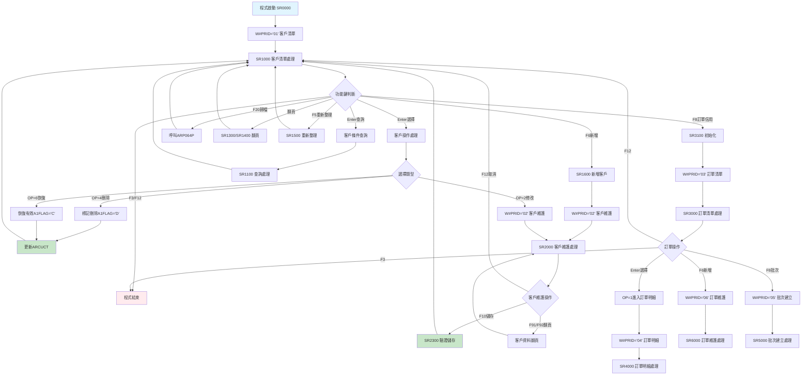
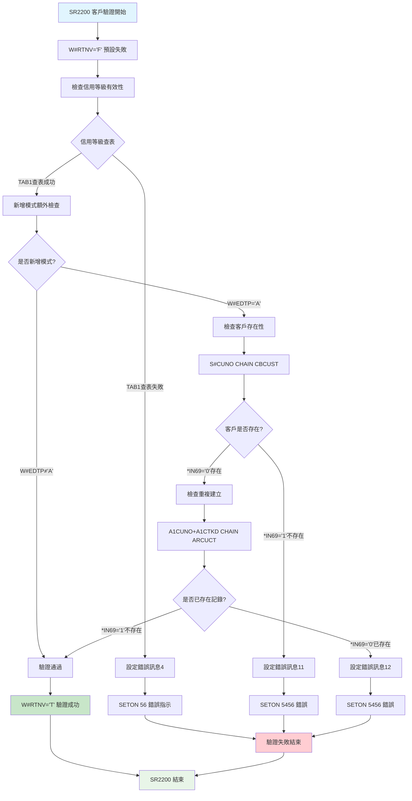
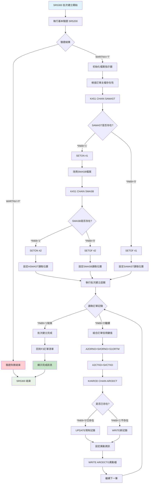
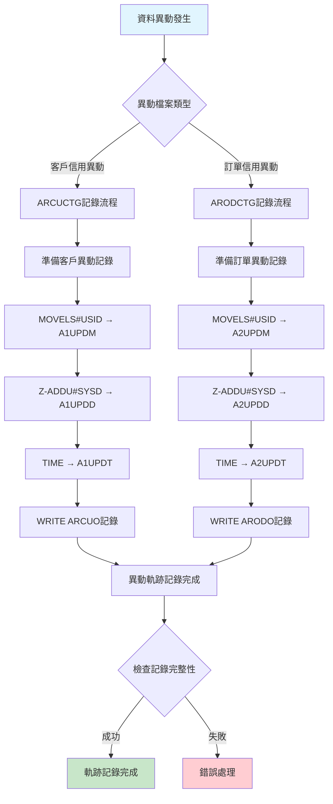

# ARE039R_P02 程式規格書

## 📋 基本資料

| 項目 | 內容 |
|------|------|
| **程式編號** | ARE039R |
| **程式名稱** | 新增客戶信用控制作業 |
| **程式類型** | RPG/400 |
| **系統名稱** | 應收帳款管理系統 (AR) |
| **子系統** | 客戶與訂單信用控制管理子系統 |
| **廠區** | P02 |
| **開發人員** | S02CLJ |
| **建立日期** | 1988/10/28（歷史程式）|
| **主要修改** | 2013/11/14 (0211A), 2023/11/17 (1210A) |
| **程式路徑** | `P02RPGSRC_THSRC/ARE039R.txt` |

## 📖 程式功能說明

### 主要功能
ARE039R是**客戶信用控制作業的核心維護程式**，專門負責客戶和訂單信用控制的全方位管理，主要功能包括：

1. **客戶信用控制管理**：維護客戶信用等級和參數設定
2. **訂單信用控制管理**：管理各別訂單的信用控制設定
3. **批次訂單信用建立**：從訂單主檔批次產生信用控制記錄
4. **六層式漸進操作**：完整的階層式信用控制作業流程
5. **雙重信用檔案維護**：同時管理ARCUCT和ARODCT檔案
6. **信用等級分類管理**：支援6種信用控制類型 
7. **三重信用審核機制**：支援三層信用審核和費率設定
8. **完整異動軌跡記錄**：詳細的操作日誌和異動追蹤

### 業務流程說明
此程式是**企業信用風險管控的中央平台**，處理客戶和訂單的完整信用生命週期：
- **六層式階層架構**：F1客戶→F2明細→F3訂單→F4項目→F5批次→F6編輯
- **雙重信用控制機制**：客戶層級與訂單層級的獨立控制
- **智能批次作業**：自動從SAMAST/SMASB/HSMAST同步訂單信用設定
- **靈活的信用分級**：支援01-06等六種信用控制類型和名稱
- **多重費率設定**：三組TYPE/RATE的組合式費率管理
- **完整資料驗證**：客戶存在性、訂單有效性、信用等級合規性檢核
- **異動軌跡完整性**：ARCUCTG/ARODCTG的完整操作記錄

### 歷史修改記錄
- **1988/10/28**：初始版本建立（S02CLJ開發）
- **2013/11/14 (2013HS227, 0211A)**：新增保留ARCUCT和ARODCT、LOG功能（S00WCJ修改）
- **2023/11/17 (2023AR00049, 1210A)**：修改SAMASB的廠區欄位，加入SAMAST，使訂單能夠正常產生（S00WCJ修改）

## 🗂️ 檔案架構與關聯圖

### 使用檔案清單

| 檔案名稱 | 檔案類型 | 使用方式 | 說明 |
|---------|---------|---------|------|
| **ARE039S** | DSPF | 讀寫 | 六層式作業畫面檔案 |
| **ARCUCT** | PF | 讀寫更新 | 客戶信用控制主檔 |
| **ARCUCTG** | PF | 新增 | 客戶信用控制異動檔 |
| **ARODCT** | PF | 讀寫更新 | 訂單信用控制主檔 |
| **ARODCTG** | PF | 新增 | 訂單信用控制異動檔 |
| **SAMAST** | PF | 讀取 | 訂單主檔（主要來源）|
| **SMASB** | PF | 讀取 | 訂單主檔B（補充來源）|
| **HSMAST** | PF | 讀取 | 歷史訂單主檔 |
| **CBCUST** | PF | 讀取 | 客戶基本資料檔（驗證用）|

### 檔案關聯視覺化圖表



### 資料流向說明

1. **客戶信用查詢階段**：從ARCUCT讀取客戶信用控制清單
2. **客戶信用維護階段**：透過F2進行客戶信用參數的維護
3. **訂單信用查詢階段**：從ARODCT讀取特定訂單的信用控制項目
4. **訂單信用維護階段**：透過F6進行個別訂單信用參數的維護
5. **批次建立階段**：從SAMAST/SMASB/HSMAST批次建立訂單信用控制記錄
6. **異動記錄階段**：在ARCUCTG/ARODCTG記錄所有異動軌跡

## 📊 檔案欄位規格說明

### ARE039S 畫面檔案系統

#### F1 客戶信用清單畫面格式
```
┌─────────────────────────────────────────────────────────────────────────────┐
│ 11/17/23      東森鋼鐵股份有限公司                          ARE039S-1       │
│ P02USER                      新增客戶信用控制作業                   14:35:20│
│                                                                             │
│ 客戶編號：[______]                                                          │
│                                                                             │
│ OP 狀態 客戶編號   信用等級 參考訂單          客戶名稱                      │
│ ---------------------------------------------------------------------------│
│ [_]  C   100001      01      SA123001     東鋼企業股份有限公司             │
│ [_]  C   100002      02      *BLANK       鋼材貿易有限公司                 │
│ [_]  D   100003      03      SA123003     已刪除客戶                       │
│                                                                             │
│ 2=修改 4=刪除 6=恢復                                                        │
│ F3=結束 F5=重新整理 F6=新增 F8=訂單信用 F20=歸檔整理                      │
│ [錯誤訊息顯示區域]                                                          │
└─────────────────────────────────────────────────────────────────────────────┘
```

#### F2 客戶信用明細維護畫面格式
```
┌─────────────────────────────────────────────────────────────────────────────┐
│ 11/17/23      東森鋼鐵股份有限公司                          ARE039S-2       │
│ P02USER                      新增客戶信用控制作業                   14:35:20│
│                                                                             │
│ 修改模式                                                                    │
│                                                                             │
│ 客戶編號：100001          客戶名稱：東鋼企業股份有限公司                    │
│ 參考訂單：SA123001                                                          │
│ 信用等級：01 [銷貨]        方法：05                                         │
│                                                                             │
│ 類型1：[__] 費率1：[_____]   類型2：[__] 費率2：[_____]                    │
│ 類型3：[__] 費率3：[_____]                                                  │
│                                                                             │
│ F10=確認 F12=取消 F91=下筆 F92=上筆                                        │
│ [錯誤訊息顯示區域]                                                          │
└─────────────────────────────────────────────────────────────────────────────┘
```

#### F3 訂單號碼清單畫面格式
```
┌─────────────────────────────────────────────────────────────────────────────┐
│ 11/17/23      東森鋼鐵股份有限公司                          ARE039S-3       │
│ P02USER                      新增客戶信用控制作業                   14:35:20│
│                                                                             │
│ 訂單號碼：[______]                                                          │
│                                                                             │
│ OP 訂單號碼    訂單日期  合約編號   客戶編號  客戶名稱                     │
│ ---------------------------------------------------------------------------│
│ [_] SA123001   1121117   CT001      100001   東鋼企業股份有限公司           │
│ [_] SA123002   1121118   CT002      100002   鋼材貿易有限公司               │
│ [_] SA123003   1121119   CT003      100003   製造業客戶                     │
│                                                                             │
│ 1=信用明細                                                                  │
│ F3=結束 F5=重新整理 F6=新增 F8=批次新增訂單                               │
│ [錯誤訊息顯示區域]                                                          │
└─────────────────────────────────────────────────────────────────────────────┘
```

#### F4 訂單信用明細畫面格式
```
┌─────────────────────────────────────────────────────────────────────────────┐
│ 11/17/23      東森鋼鐵股份有限公司                          ARE039S-4       │
│ P02USER                      新增客戶信用控制作業                   14:35:20│
│                                                                             │
│ 訂單號碼：SA123001                                                          │
│                                                                             │
│ OP 狀態 項次  信用等級   等級名稱    方法  類型1 費率1  類型2 費率2         │
│ ---------------------------------------------------------------------------│
│ [_]  C   001    01       銷貨       05     10   2.5     20   3.0          │
│ [_]  C   002    02       運費       05     11   1.8     21   2.2          │
│ [_]  D   003    03       出口       05     12   4.0     22   4.5          │
│                                                                             │
│ 2=修改 4=刪除 6=恢復                                                        │
│ F3=結束 F6=新增 F12=回上頁                                                 │
│ [錯誤訊息顯示區域]                                                          │
└─────────────────────────────────────────────────────────────────────────────┘
```

#### F5 批次新增訂單信用畫面格式
```
┌─────────────────────────────────────────────────────────────────────────────┐
│ 11/17/23      東森鋼鐵股份有限公司                          ARE039S-5       │
│ P02USER                      新增客戶信用控制作業                   14:35:20│
│                                                                             │
│ 批次新增訂單信用                                                            │
│                                                                             │
│ 訂單號碼：[______]                                                          │
│ 信用等級：[__] [銷貨     ]  方法：[__]                                     │
│                                                                             │
│ 類型1：[__] 費率1：[_____]   類型2：[__] 費率2：[_____]                    │
│ 類型3：[__] 費率3：[_____]                                                  │
│                                                                             │
│ F10=確認執行 F12=取消                                                       │
│ [錯誤訊息顯示區域]                                                          │
└─────────────────────────────────────────────────────────────────────────────┘
```

### ARCUCT 客戶信用控制檔

| 欄位名稱 | 資料型態 | 長度 | 說明 | 特殊處理 |
|---------|---------|------|------|---------|
| **A1FLAG** | CHAR | 1 | 處理旗標 | 🎯'C'=有效,'D'=刪除,'A'=新增 |
| **A1CUNO** | CHAR | 6 | 客戶編號 | 🔑主要識別碼 |
| **A1CTKD** | NUMERIC | 2,0 | 信用等級 | 🔑01-06類型代碼 |
| **A1RFOR** | CHAR | 6 | 參考訂單 | 📝關聯訂單號 |
| **A1MTHD** | NUMERIC | 2,0 | 處理方法 | 📊控制方法代碼 |
| **A1TYP1** | NUMERIC | 2,0 | 類型1 | 💼第一類費率類型 |
| **A1RAT1** | NUMERIC | 7,3 | 費率1 | 💰第一類費率值 |
| **A1TYP2** | NUMERIC | 2,0 | 類型2 | 💼第二類費率類型 |
| **A1RAT2** | NUMERIC | 7,3 | 費率2 | 💰第二類費率值 |
| **A1TYP3** | NUMERIC | 2,0 | 類型3 | 💼第三類費率類型 |
| **A1RAT3** | NUMERIC | 7,3 | 費率3 | 💰第三類費率值 |
| **A1UPDM** | CHAR | 3 | 異動人員 | 👤最後修改者 |
| **A1UPDD** | NUMERIC | 8,0 | 異動日期 | 📅8位元日期 |
| **A1UPDT** | NUMERIC | 6,0 | 異動時間 | ⏰6位元時間 |

### ARODCT 訂單信用控制檔

| 欄位名稱 | 資料型態 | 長度 | 說明 | 特殊處理 |
|---------|---------|------|------|---------|
| **A2FLAG** | CHAR | 1 | 處理旗標 | 🎯'C'=有效,'D'=刪除,'A'=新增 |
| **A2ORNO** | CHAR | 9 | 訂單號碼+項次 | 🔑主要識別碼 |
| **A2CTKD** | NUMERIC | 2,0 | 信用等級 | 🔑01-06類型代碼 |
| **A2MTHD** | NUMERIC | 2,0 | 處理方法 | 📊控制方法代碼 |
| **A2TYP1** | NUMERIC | 2,0 | 類型1 | 💼第一類費率類型 |
| **A2RAT1** | NUMERIC | 7,3 | 費率1 | 💰第一類費率值 |
| **A2TYP2** | NUMERIC | 2,0 | 類型2 | 💼第二類費率類型 |
| **A2RAT2** | NUMERIC | 7,3 | 費率2 | 💰第二類費率值 |
| **A2TYP3** | NUMERIC | 2,0 | 類型3 | 💼第三類費率類型 |
| **A2RAT3** | NUMERIC | 7,3 | 費率3 | 💰第三類費率值 |
| **A2UPDM** | CHAR | 3 | 異動人員 | 👤最後修改者 |
| **A2UPDD** | NUMERIC | 8,0 | 異動日期 | 📅8位元日期 |
| **A2UPDT** | NUMERIC | 6,0 | 異動時間 | ⏰6位元時間 |

### ARCUCTG/ARODCTG 異動軌跡檔

兩個檔案結構相同，分別記錄客戶和訂單信用控制的異動軌跡：

| 欄位名稱 | 說明 | 記錄內容 |
|---------|------|---------|
| **異動前紀錄** | 完整的異動前狀態 | 所有原始欄位值 |
| **異動人員** | 操作者識別 | 使用者ID和時間戳記 |
| **異動類型** | 操作類型 | 新增/修改/刪除/恢復 |

### 欄位切割視覺化

```
信用等級分類表 (TAB1)：
┌─────────────────────────────────────────┐
│ 01 = 銷貨（主要銷售信用）                 │
│ 02 = 運費（運輸費用信用）                 │
│ 03 = 出口（外銷信用控制）                 │
│ 04 = 發票（發票開立信用）                 │
│ 05 = 預收（預收款項信用）                 │
│ 06 = 雜項（其他雜項信用）                 │
└─────────────────────────────────────────┘

三重費率結構：
┌─────────────────────────────────────────┐
│ TYP1 + RAT1 = 第一類費率組合             │
│ TYP2 + RAT2 = 第二類費率組合             │
│ TYP3 + RAT3 = 第三類費率組合             │
│                                         │
│ 每組可獨立設定類型代碼和費率值            │
│ 支援精確到千分位的費率計算                │
└─────────────────────────────────────────┘

訂單號碼結構 (A2ORNO)：
┌─────────────────────────────────────────┐
│ Position 1-6: 基本訂單號碼 (W#ORNO)     │
│ Position 7-9: 項次編號 (W#ITEM)         │
│                                         │
│ 例：SA123001 + 001 = SA123001001       │
└─────────────────────────────────────────┘

處理旗標狀態流：
┌─────────────────────────────────────────┐
│ 'A' (新增) → 'C' (有效) → 'D' (刪除)   │
│      ↑                        ↓       │
│      └──── 'C' (恢復) ←────────┘       │
│                                         │
│ 支援完整的生命週期狀態管理                │
└─────────────────────────────────────────┘
```

## 🖥️ 輸出/入螢幕布局

### 畫面流程圖



### 功能鍵定義

#### F1 客戶信用清單畫面
| 功能鍵 | 說明 | 處理邏輯 |
|--------|------|---------|
| **F3** | 結束作業 | 結束程式執行 |
| **F5** | 重新整理 | 重新載入客戶清單 |
| **F6** | 新增客戶 | 進入F2新增模式 |
| **F8** | 訂單信用 | 進入F3訂單清單 |
| **F12** | 取消作業 | 結束程式執行 |
| **F20** | 歸檔整理 | 呼叫ARP064P程式 |
| **ROLLUP(91)** | 下頁 | 載入下一批客戶資料 |
| **ROLLDOWN(92)** | 上頁 | 回到上一批客戶資料 |

#### F2 客戶信用維護畫面
| 功能鍵 | 說明 | 處理邏輯 |
|--------|------|---------|
| **F10** | 確認儲存 | 執行客戶信用更新 |
| **F12** | 取消返回 | 回到F1客戶清單 |
| **F91** | 下一筆 | 瀏覽下一個客戶 |
| **F92** | 上一筆 | 瀏覽上一個客戶 |

#### F3 訂單清單畫面
| 功能鍵 | 說明 | 處理邏輯 |
|--------|------|---------|
| **F3** | 結束程式 | 直接結束程式 |
| **F5** | 重新整理 | 重新載入訂單清單 |
| **F6** | 新增訂單信用 | 進入F6新增模式 |
| **F8** | 批次新增 | 進入F5批次建立 |
| **F12** | 回到客戶 | 回到F1客戶清單 |
| **ROLLUP(91)** | 下頁 | 載入下一批訂單資料 |
| **ROLLDOWN(92)** | 上頁 | 回到上一批訂單資料 |

#### F4 訂單信用明細畫面
| 功能鍵 | 說明 | 處理邏輯 |
|--------|------|---------|
| **F3** | 結束程式 | 直接結束程式 |
| **F6** | 新增明細 | 進入F6新增模式 |
| **F12** | 回訂單清單 | 回到F3訂單清單 |

#### F5 批次建立畫面
| 功能鍵 | 說明 | 處理邏輯 |
|--------|------|---------|
| **F10** | 執行建立 | 批次建立訂單信用 |
| **F12** | 取消返回 | 回到F3訂單清單 |

#### F6 訂單信用維護畫面
| 功能鍵 | 說明 | 處理邏輯 |
|--------|------|---------|
| **F10** | 確認儲存 | 執行訂單信用更新 |
| **F12** | 返回明細 | 回到F4明細畫面 |
| **F91** | 下一項目 | 瀏覽下一個訂單項目 |
| **F92** | 上一項目 | 瀏覽上一個訂單項目 |

## ⚙️ 處理流程程序說明

### 🎯 主要程序流程

#### 程式主控迴圈


### 🎯 客戶信用驗證流程 (SR2200)

#### 客戶信用資料驗證機制


### 🎯 批次訂單信用建立流程 (SR5300)

#### 從訂單主檔批次建立信用控制記錄


### 🎯 異動軌跡記錄機制

#### 雙重異動檔案記錄流程


## 🔧 技術特點分析

### 程式設計特色

1. **🎯 六層式階層架構設計**
   - **F1客戶層**：客戶信用控制清單管理
   - **F2維護層**：客戶信用參數詳細維護
   - **F3訂單層**：訂單號碼清單瀏覽
   - **F4明細層**：訂單信用明細顯示
   - **F5批次層**：批次建立訂單信用功能
   - **F6編輯層**：訂單信用參數詳細編輯

2. **📊 雙重信用控制架構**
   - **客戶層級控制**：ARCUCT管理客戶整體信用政策
   - **訂單層級控制**：ARODCT管理個別訂單信用參數
   - **階層式關聯**：訂單信用可繼承客戶信用設定
   - **獨立管理能力**：兩個層級可分別維護和控制

3. **🔍 三重費率智能設定**
   - **TYP1+RAT1**：第一類費率組合（主要費率）
   - **TYP2+RAT2**：第二類費率組合（次要費率）
   - **TYP3+RAT3**：第三類費率組合（特殊費率）
   - **彈性組合**：每組可獨立設定類型和費率值

4. **🏭 完整的軌跡追蹤機制**
   - **雙軌跡檔案**：ARCUCTG/ARODCTG分別記錄
   - **時間戳記精確**：日期+時間+使用者的完整記錄
   - **狀態變更追蹤**：A(新增)→C(有效)→D(刪除)→C(恢復)
   - **操作軌跡完整**：所有異動操作的詳細記錄

### 錯誤處理機制

#### 完整錯誤訊息對照表 (12種錯誤類型)

| 錯誤編號 | 錯誤訊息 | 觸發條件 | 處理建議 |
|---------|---------|---------|---------|
| **MSG,1** | 資料已經存檔完畢。| 更新完成訊息 | 確認操作成功 |
| **MSG,2** | 資料已到檔尾。| 翻頁到最後 | 使用上翻功能 |
| **MSG,3** | 資料已到檔頭。| 翻頁到最前 | 使用下翻功能 |
| **MSG,4** | 信用等級代碼錯誤！| 信用等級不在TAB1範圍 | 選擇01-06有效等級 |
| **MSG,5** | 訂單項目已存在，若要更新請用修改功能。| 重複建立訂單信用 | 使用修改功能 |
| **MSG,6** | 訂單明細項目銷代碼已存在，無法修改。| 修改已存在項目 | 確認項目狀態 |
| **MSG,7** | 新增時，無法翻頁作業！| 新增模式翻頁錯誤 | 完成新增後翻頁 |
| **MSG,8** | 傳輸檔案傳檔作業已加入程式，依排程資料查詢，傳檔。| 歸檔作業完成 | 確認歸檔狀態 |
| **MSG,9** | 新增作業已存檔完畢，要再新增作業請按F12。| 新增完成提示 | 繼續新增或離開 |
| **MSG,10** | 輸入的訂單編號不存在！| 訂單號碼不存在 | 確認訂單號碼正確性 |
| **MSG,11** | 輸入的客戶編號不存在！| 客戶編號不存在 | 確認客戶編號正確性 |
| **MSG,12** | 該客戶之信用等級代碼已存在，請先修改功能。| 重複建立客戶信用 | 使用修改功能 |

### 跨廠區功能差異分析

| 功能特性 | P02 (1433行) | H05 (1382行) | K02 | U01 | 差異說明 |
|---------|-------------|-------------|-----|-----|---------|
| **基礎信用控制** | ✅ | ✅ | ❌ | ❌ | P02/H05有完整功能 |
| **六層式畫面** | ✅ | ✅ | ❌ | ❌ | 完整階層架構 |
| **雙重軌跡記錄** | ✅ (0211A) | ❌ | ❌ | ❌ | P02獨有功能 |
| **SAMAST整合** | ✅ (1210A) | ❌ | ❌ | ❌ | P02最新功能 |
| **SMASB支援** | ✅ (1210A) | ❌ | ❌ | ❌ | 2023年新增 |
| **批次建立** | ✅完整 | ✅基本 | ❌ | ❌ | P02功能最完整 |
| **異動追蹤** | ✅完整 | ✅基本 | ❌ | ❌ | P02有完整軌跡 |
| **程式行數** | 1433行 | 1382行 | 不存在 | 不存在 | P02功能最豐富 |

## 📝 重要商業邏輯摘要

### 核心業務規則

1. **六種信用等級分類系統**：01銷貨、02運費、03出口、04發票、05預收、06雜項
2. **雙重信用控制機制**：客戶層級與訂單層級的獨立控制體系
3. **三重費率組合架構**：每個信用等級支援三組TYPE+RATE的複合設定
4. **完整生命週期管理**：A(新增)→C(有效)→D(刪除)→C(恢復)的狀態流程
5. **智能批次建立機制**：從SAMAST/SMASB/HSMAST自動同步訂單信用設定
6. **雙重軌跡記錄機制**：ARCUCTG/ARODCTG的完整異動追蹤
7. **跨檔案整合驗證**：客戶檔案、訂單檔案、信用檔案的一致性檢核

### 關鍵業務流程

1. **客戶信用管理流程**：
   - 客戶信用清單瀏覽和查詢
   - 信用等級和參數維護
   - 客戶信用狀態控制（有效/刪除/恢復）
   - 完整的客戶信用軌跡記錄

2. **訂單信用管理流程**：
   - 訂單清單瀏覽和篩選
   - 訂單信用明細維護
   - 訂單項目信用參數設定
   - 訂單信用狀態生命週期管理

3. **批次建立流程**：
   - 多檔案來源整合（SAMAST優先，SMASB補充，HSMAST歷史）
   - 智能重複檢查和處理
   - 批次異動軌跡記錄
   - 完整的建立結果回報

4. **信用驗證流程**：
   - 信用等級有效性檢核
   - 客戶存在性驗證
   - 重複建立防護機制
   - 跨檔案一致性檢查

### 系統整合要點

1. **與客戶管理系統整合**：透過CBCUST驗證客戶存在性和基本資訊
2. **與訂單管理系統整合**：支援SAMAST/SMASB/HSMAST多來源訂單資料
3. **與歸檔系統整合**：透過ARP064P進行系統資料歸檔和整理
4. **與軌跡系統整合**：完整的異動軌跡記錄和查詢功能

### P02版本特殊價值

1. **最完整功能實現**：2023/11/17是最新的功能完整版本
2. **程式行數最多**：1433行為所有廠區中最豐富的實現
3. **雙重軌跡記錄**：獨有的ARCUCTG/ARODCTG異動軌跡功能
4. **SMASB整合支援**：最新的多訂單檔案整合能力
5. **批次功能最完整**：支援三種訂單來源的智能批次建立

### 重要設計模式

1. **Hierarchical Navigation Pattern**：六層式階層導航的完整實現
2. **Dual Control Pattern**：客戶與訂單雙重信用控制架構
3. **State Machine Pattern**：信用狀態的完整生命週期管理
4. **Audit Trail Pattern**：雙重軌跡檔案的完整追蹤機制
5. **Batch Processing Pattern**：多來源批次建立的智能處理
6. **Validation Chain Pattern**：多層次資料驗證的鏈式處理

### 信用控制商業邏輯

```
信用等級處理矩陣：

等級代碼 → 等級名稱 → 適用範圍
   01    →   銷貨   → 主要銷售交易信用控制
   02    →   運費   → 運輸費用相關信用控制  
   03    →   出口   → 外銷貿易專用信用控制
   04    →   發票   → 發票開立流程信用控制
   05    →   預收   → 預收款項管理信用控制
   06    →   雜項   → 其他雜項交易信用控制
```

### 費率組合商業規則

```
三重費率結構決策樹：

每個信用等級可設定三組費率：
TYP1 + RAT1 = 主要費率（必設）
TYP2 + RAT2 = 次要費率（選設）  
TYP3 + RAT3 = 特殊費率（選設）

費率精確度：支援到千分位（7,3格式）
費率應用：依類型代碼決定計算方式
費率繼承：訂單可繼承客戶費率設定
```

### 批次建立優先順序

```
訂單檔案優先順序：

1. SAMAST (主要訂單檔)
   ↓ (不存在時)
2. SMASB (補充訂單檔) - 2023年新增
   ↓ (不存在時)  
3. HSMAST (歷史訂單檔)

廠區欄位整合：
SAMAST: S1OREA (原有欄位)
SMASB:  S1OREA (2023年統一後)
HSMAST: S1OREA (標準欄位)
```

此程式體現了**「企業級信用風險管控平台」**的理念，透過六層式階層導航、雙重信用控制機制、三重費率組合架構，以及完整的軌跡記錄系統，提供企業全方位的信用風險管控解決方案，是金融風險管控系統中的專業典範。 