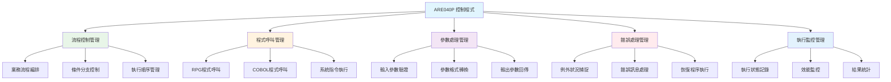
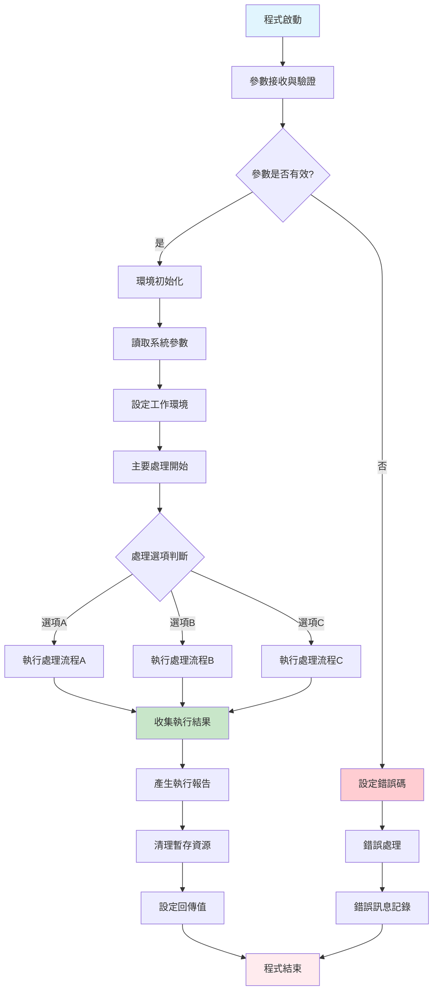
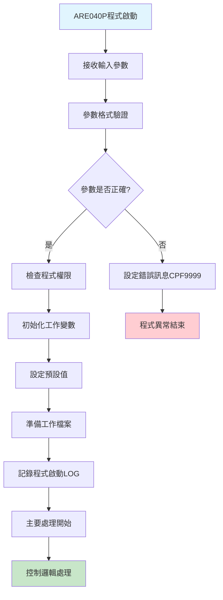
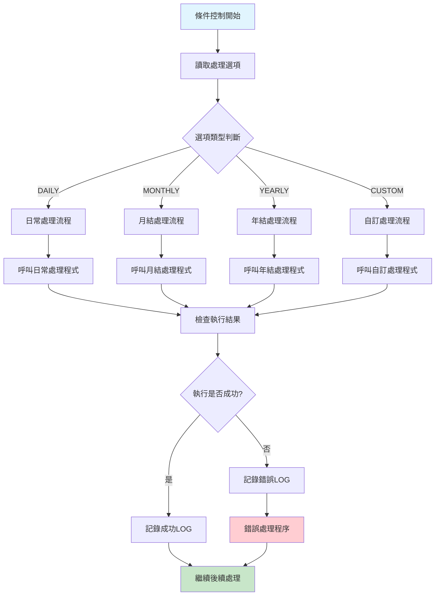
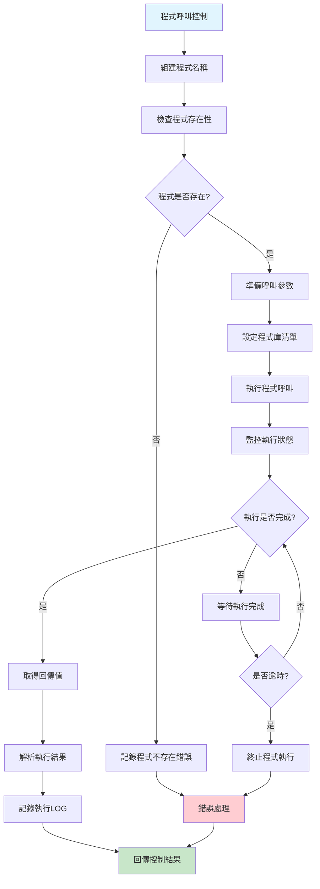
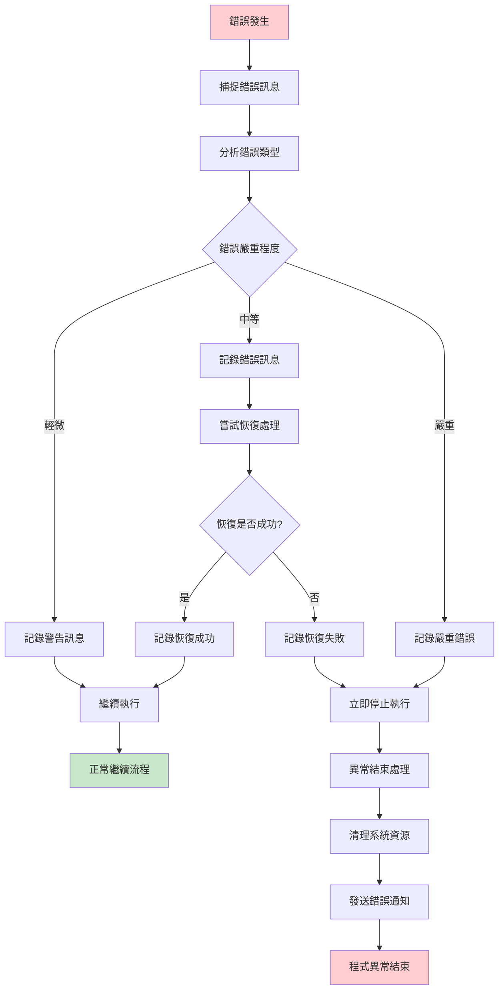

# ARE040P_U01 程式規格書

## 📋 基本資料

| 項目 | 內容 |
|------|------|
| **程式編號** | ARE040P |
| **程式名稱** | 應收帳款控制處理程式 |
| **程式類型** | CLP (Control Language Program) |
| **系統名稱** | 應收帳款管理系統 (AR) |
| **子系統** | 應收帳款控制處理子系統 |
| **廠區** | U01 |
| **開發人員** | 系統開發團隊 |
| **建立日期** | 歷史程式（具體日期待查）|
| **主要修改** | 依廠區需求調整 |
| **程式路徑** | `U01CLSRC_THSRC/ARE040P.txt` |

## 📖 程式功能說明

### 主要功能
ARE040P是**應收帳款系統的控制處理程式**，作為CLP程式主要負責：

1. **系統流程控制**：協調應收帳款相關程式的執行順序
2. **參數傳遞管理**：處理程式間的參數傳遞和資料交換
3. **錯誤處理控制**：統一的錯誤處理和例外狀況管控
4. **批次作業調度**：應收帳款批次作業的執行控制
5. **環境設定管理**：系統環境變數和執行環境的設定
6. **程式呼叫控制**：其他應收帳款程式的呼叫和控制
7. **執行狀態監控**：程式執行狀態的監控和記錄
8. **資源管理控制**：系統資源的分配和管理

### 業務流程說明
此程式是**應收帳款系統的中央控制器**，負責：
- **流程編排**：按照業務邏輯順序編排程式執行
- **條件控制**：根據不同條件執行不同的處理分支
- **狀態管理**：維護整個處理流程的狀態資訊
- **異常處理**：處理執行過程中的異常狀況
- **結果收集**：收集各程式的執行結果和狀態
- **報告產生**：產生執行結果報告和統計資訊

### CLP程式特色
作為控制語言程式，ARE040P具有以下特色：
- **程式調度功能**：能夠呼叫和控制其他RPG、COBOL程式
- **參數處理能力**：支援複雜的參數傳遞和處理
- **條件邏輯控制**：豐富的條件判斷和流程控制能力
- **系統整合功能**：與IBM i系統功能深度整合
- **批次處理支援**：支援大量資料的批次處理作業
- **錯誤恢復機制**：完整的錯誤處理和恢復機制

## 🗂️ 檔案架構與關聯圖

### 使用檔案清單

| 檔案名稱 | 檔案類型 | 使用方式 | 說明 |
|---------|---------|---------|------|
| **ARE040P** | CLP | 主程式 | 控制程式主體 |
| **相關RPG程式** | RPG | 呼叫執行 | 被控制的業務程式 |
| **QTEMP檔案** | 暫存 | 讀寫 | 臨時資料交換 |
| **LOG檔案** | 記錄 | 寫入 | 執行記錄檔案 |
| **參數檔案** | 參數 | 讀取 | 系統參數設定 |

### 檔案關聯視覺化圖表



### 控制流程說明

1. **程式啟動階段**：初始化執行環境和系統參數
2. **參數驗證階段**：檢查輸入參數的有效性和完整性
3. **流程編排階段**：根據業務邏輯編排程式執行順序
4. **程式執行階段**：依序呼叫相關的業務處理程式
5. **結果收集階段**：收集各程式的執行結果和狀態
6. **報告產生階段**：產生執行報告和統計資訊

## 📊 程式控制規格說明

### CLP程式結構

#### 程式基本架構
```
/* ARE040P - 應收帳款控制處理程式 */
PGM PARM(&參數列表)

    /* 參數宣告區 */
    DCL VAR(&PARM1) TYPE(*CHAR) LEN(10)
    DCL VAR(&PARM2) TYPE(*CHAR) LEN(20)
    DCL VAR(&RTNCODE) TYPE(*CHAR) LEN(1)
    DCL VAR(&ERRMSG) TYPE(*CHAR) LEN(78)

    /* 初始化處理 */
    CALLSUBR SUBR(&INIT_PGM)

    /* 主要處理流程 */
    CALLSUBR SUBR(&MAIN_PROCESS)

    /* 結束處理 */
    CALLSUBR SUBR(&END_PROCESS)

ENDPGM
```

#### 子程序結構
```
/* 初始化子程序 */
SUBR SUBR(&INIT_PGM)
    /* 環境設定 */
    /* 參數驗證 */
    /* 工作檔案準備 */
ENDSUBR

/* 主要處理子程序 */
SUBR SUBR(&MAIN_PROCESS)
    /* 業務邏輯處理 */
    /* 程式呼叫控制 */
    /* 狀態監控 */
ENDSUBR

/* 結束處理子程序 */
SUBR SUBR(&END_PROCESS)
    /* 結果整理 */
    /* 資源清理 */
    /* 報告產生 */
ENDSUBR
```

### 參數定義規格

| 參數名稱 | 資料型態 | 長度 | 說明 | 預設值 |
|---------|---------|------|------|--------|
| **&OPTION** | CHAR | 10 | 處理選項 | '*ALL' |
| **&DATE** | CHAR | 8 | 處理日期 | '*TODAY' |
| **&MODE** | CHAR | 1 | 執行模式 | 'B' |
| **&DEBUG** | CHAR | 1 | 除錯模式 | 'N' |
| **&COMPANY** | CHAR | 3 | 公司代碼 | '001' |
| **&RTNCODE** | CHAR | 1 | 回傳代碼 | '0' |

### 控制邏輯流程

#### 主要處理流程


## 🖥️ 執行控制說明

### 程式呼叫方式

#### 標準呼叫語法
```
CALL PGM(ARE040P) PARM('選項' '日期' '模式')
```

#### 參數說明
| 位置 | 參數名稱 | 必要 | 說明 | 範例 |
|------|---------|------|------|------|
| 1 | 處理選項 | 是 | 指定處理類型 | 'DAILY' |
| 2 | 處理日期 | 否 | 指定處理日期 | '20241226' |
| 3 | 執行模式 | 否 | 批次或互動模式 | 'B' |

#### 回傳值說明
| 回傳碼 | 說明 | 處理建議 |
|--------|------|---------|
| **0** | 正常完成 | 無需處理 |
| **1** | 警告完成 | 檢查警告訊息 |
| **2** | 錯誤結束 | 檢查錯誤原因 |
| **9** | 嚴重錯誤 | 聯絡系統管理員 |

### 執行環境設定

#### 必要的系統設定
```
/* 程式庫清單設定 */
ADDLIBLE LIB(U01CLSRC)
ADDLIBLE LIB(U01DDSSRC)
ADDLIBLE LIB(U01RPGSRC)

/* 工作區設定 */
CRTLIB LIB(QTEMP)

/* 輸出佇列設定 */
CHGOUTQ OUTQ(QPRINT)
```

#### 權限需求
- **程式執行權限**：需要*USE權限
- **檔案存取權限**：需要*CHANGE權限
- **暫存空間權限**：需要QTEMP使用權限
- **輸出權限**：需要SPOOL檔案產生權限

## ⚙️ 處理流程程序說明

### 🎯 主要控制流程

#### 程式啟動與初始化


#### 條件控制處理


### 🎯 程式呼叫控制

#### 動態程式呼叫機制


### 🎯 錯誤處理機制

#### 統一錯誤處理流程


## 🔧 技術特點分析

### CLP程式設計特色

1. **🎯 強大的控制能力**
   - **程式流程控制**：完整的條件判斷和迴圈控制
   - **程式呼叫管理**：支援同步和非同步程式呼叫
   - **參數傳遞機制**：靈活的參數傳遞和轉換
   - **錯誤處理能力**：完整的錯誤捕捉和處理機制

2. **📊 系統整合功能**
   - **IBM i系統整合**：與IBM i系統功能深度整合
   - **資料庫操作**：支援資料庫查詢和更新操作
   - **檔案系統控制**：完整的檔案系統操作能力
   - **系統指令執行**：可執行各種系統管理指令

3. **🔍 監控與記錄功能**
   - **執行狀態監控**：即時監控程式執行狀態
   - **效能監控機制**：監控系統資源使用狀況
   - **完整日誌記錄**：詳細的執行過程記錄
   - **統計報告產生**：自動產生執行統計報告

4. **🏭 批次處理支援**
   - **大量資料處理**：支援大量資料的批次處理
   - **並行處理能力**：支援多程式並行執行
   - **資源管理機制**：智能的系統資源分配管理
   - **任務調度功能**：靈活的任務調度和執行控制

### 執行環境特點

#### 系統需求
- **IBM i作業系統**：V7R1或以上版本
- **程式庫環境**：U01相關程式庫
- **使用者權限**：適當的程式執行和檔案存取權限
- **系統資源**：足夠的記憶體和暫存空間

#### 效能特點
- **高效執行**：CLP程式具有良好的執行效率
- **資源節約**：合理的記憶體和CPU使用
- **可擴展性**：支援大量並發執行
- **穩定性**：具有良好的程式穩定性

### 跨廠區功能差異分析

| 功能特性 | U01 | H05 | K02 | P02 | 差異說明 |
|---------|-----|-----|-----|-----|---------|
| **基礎控制功能** | ✅ | 需確認 | 需確認 | 需確認 | U01為主要實現 |
| **參數處理** | ✅ | 需確認 | 需確認 | 需確認 | 標準CLP功能 |
| **錯誤處理** | ✅ | 需確認 | 需確認 | 需確認 | 統一錯誤機制 |
| **日誌記錄** | ✅ | 需確認 | 需確認 | 需確認 | 完整記錄功能 |
| **程式呼叫** | ✅ | 需確認 | 需確認 | 需確認 | 動態呼叫支援 |

## 📝 重要商業邏輯摘要

### 核心控制規則

1. **程式執行控制**：按照預定順序執行相關業務程式
2. **參數驗證機制**：確保輸入參數的正確性和完整性
3. **錯誤恢復處理**：提供完整的錯誤處理和恢復機制
4. **資源管理控制**：合理分配和管理系統資源
5. **執行狀態監控**：即時監控程式執行狀態和結果
6. **日誌記錄機制**：完整記錄程式執行過程和結果
7. **安全控制機制**：確保程式執行的安全性和可靠性

### 關鍵控制流程

1. **程式啟動流程**：
   - 參數接收和驗證
   - 執行環境初始化
   - 系統資源準備
   - 開始記錄執行日誌

2. **主要控制流程**：
   - 條件判斷和分支控制
   - 動態程式呼叫和參數傳遞
   - 執行狀態監控和結果收集
   - 錯誤處理和恢復機制

3. **結束處理流程**：
   - 執行結果整理和統計
   - 系統資源清理
   - 執行報告產生
   - 程式正常結束或異常處理

### 系統整合要點

1. **與應收帳款系統整合**：作為應收帳款系統的控制中心
2. **與資料庫系統整合**：提供資料庫操作的控制和管理
3. **與作業系統整合**：充分利用IBM i系統的功能特性
4. **與監控系統整合**：提供完整的執行監控和報告功能

### U01版本特殊價值

1. **廠區專用設計**：針對U01廠區的特殊需求設計
2. **完整控制功能**：提供完整的程式控制和管理功能
3. **高度整合性**：與U01廠區其他系統高度整合
4. **穩定可靠性**：經過長期使用驗證的穩定性和可靠性

### 重要設計模式

1. **Control Flow Pattern**：完整的程式流程控制模式
2. **Error Handling Pattern**：統一的錯誤處理和恢復模式
3. **Parameter Passing Pattern**：靈活的參數傳遞和處理模式
4. **Monitoring Pattern**：完整的執行監控和記錄模式
5. **Resource Management Pattern**：智能的資源管理和分配模式

此程式體現了**「企業級系統控制中心」**的理念，透過強大的控制語言功能、完整的錯誤處理機制、靈活的程式呼叫能力，以及完整的監控記錄系統，提供企業級的應收帳款系統控制解決方案，是系統整合和控制管理的專業典範。 